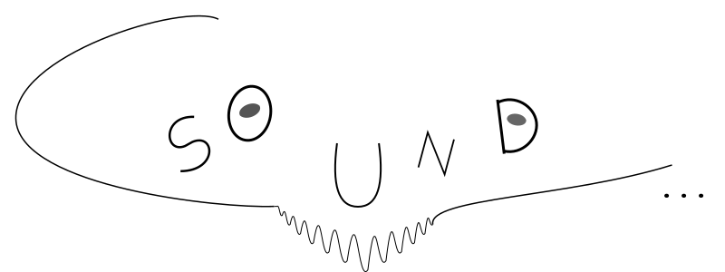

# PRÉFACE

## BIENVENUE DANS CSOUND !

TODO: Traduire la préface en français.

... est l'un des programmes les plus connus et les plus établis dans le
domaine de la programmation audio. Il a été publié pour la première fois en 1986 au
Massachusetts Institute of Technology (MIT) par Barry Vercoe. Mais
l'histoire de Csound s'enracine encore plus profondément dans les racines de la musique informatique car
il est un descendant direct du plus ancien programme informatique pour la synthèse sonore,
_MusicN_, de Max Mathews. Csound est libre et open source,
distribué sous la licence LGPL, et il est maintenu et étendu par
un noyau de développeurs avec le soutien d'une communauté mondiale plus large.

Au cours de la dernière décennie, grâce au travail de Victor Lazzarini, Steven Yi, John
ffitch, Hlöðver Sigurðsson, Rory Walsh, et bien d'autres, Csound est passé
d'un langage de programmation audio quelque peu archaïque à une bibliothèque audio moderne.
Il peut non seulement être utilisé depuis la ligne de commande et les interfaces classiques.
Il peut également être utilisé comme plugin VST. Il peut être utilisé dans le moteur de jeu Unity.
Il peut être utilisé sur Android ou sur n'importe quel micro-ordinateur comme Raspberry Pi ou Bela Board.
Il peut être utilisé via son Interface de Programmation d'Application (API) dans n'importe quel autre
langage de programmation.

TODO: Continuer la traduction du reste de la préface.

## À propos de ce manuel

Ce manuel FLOSS (Free/Libre and Open Source Software) de Csound est un projet communautaire
visant à fournir une documentation complète et accessible pour Csound en français.

TODO: Compléter cette section avec plus de détails sur le manuel.

## Comment utiliser ce manuel

TODO: Ajouter des instructions sur l'utilisation du manuel.

## Remerciements

TODO: Ajouter les remerciements appropriés pour la version française.
