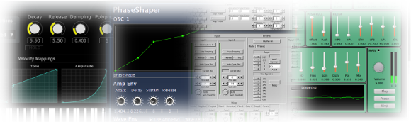

# PREFACE



Csound is one of the best known and longest established programs in the
field of audio programming. It was developed in the mid-1980s at the
Massachusetts Institute of Technology (MIT) by Barry Vercoe but
Csound's history lies even deeper within the roots of computer music:
it is a direct descendant of the oldest computer program for sound
synthesis, _MusicN_, by Max Mathews. Csound is free and open source,
distributed under the LGPL licence, and it is maintained and expanded by
a core of developers with support from a wider global community.

Csound has been growing for 30 years. There is rarely anything related
to audio that you cannot do with Csound. You can work by rendering
offline, or in real-time by processing live audio and synthesizing sound
on the fly. You can control Csound via MIDI, OSC, through a network,
within a browser or via the Csound API (Application Programming
Interface). Csound will run on all major platforms, on phones, tablets
and tinyware computers. In Csound you will find the widest collection of
tools for sound synthesis and sound modification, arguably offering a
superset of features offered by similar software and with an unrivaled
audio precision.

Csound is simultaneously both _old school_ and _new school_.

Is Csound difficult to learn? Generally speaking, graphical audio
programming languages like Pure Data, Max or Reaktor are easier to
learn than text-coded audio programming languages such as Csound or
SuperCollider. In Pd, Max or Reaktor you cannot make a typo which
produces an error that you do not understand. You program without being
aware that you are programming. The user experience mirrors that of
patching together various devices in a studio. This is a fantastically
intuitive approach but when you deal with more complex projects, a
text-based programming language is often easier to use and debug, and
many people prefer to program by typing words and sentences rather than
by wiring symbols together using the mouse.

Yet Csound can straddle both approaches: it is also very easy to use
Csound as an audio engine inside Pd or Max. Have a look at the chapter
_Csound in Other Applications_ for further information.

Amongst text-based audio programming languages, Csound is arguably the
simplest. You do not need to know any specific programming techniques or
to be a computer scientist. The basics of the Csound language are a
straightforward transfer of the signal flow paradigm to text.

For example, to create a 400 Hz sine oscillator with an amplitude of
0.2, this is the signal flow:

{width=20%}

Here is a possible transformation of the signal graph into Csound code:

```csound
instr Sine
 aSig poscil 0.2, 400
 out aSig
endin
```

The oscillator is represented by the opcode
[poscil](http://csound.com/docs/manual/poscil.html) and receives
its input arguments on the right-hand side. These are amplitude (0.2)
and frequency (400). It produces an audio signal called _aSig_ at the
left side which is in turn the input of the second opcode _out_. The
first and last lines encase these connections inside an instrument
called _Sine_.

With the release of Csound version 6, it is possible to write the same
code in an even more condensed fashion using so-called _functional
syntax_, as shown below:

```csound
instr Sine
 out poscil:a(0.2, 400)
endin
```

We will use both, traditional and functional style, throughout this textbook. More details on functional style can be found in chapter
[03 I](03-i-functional-syntax.md).

It is often difficult to find up to date resources that show and explain
what is possible with Csound. Documentation and tutorials produced by
developers and experienced users tend to be scattered across many
different locations. This issue was one of the main motivations for
producing this manual; to facilitate a flow between the knowledge of
contemporary Csound users and those wishing to learn more about Csound.

Throughout this manual we will attempt to maintain a balance between
providing users with knowledge of most of the important aspects of
Csound whilst also remaining concise and simple enough to avoid
overwhelming the reader through the shear number of possibilities
offered by Csound. Frequently this manual will link to other more
detailed resources such as the
[Canonical Csound Reference Manual](http://csound.com/docs/manual/index.html), the main support documentation provided by the Csound developers and associated
community over the years, and the
[Csound Journal](http://csoundjournal.com/index.html) (edited by James Hearon
and Iain McCurdy), a roughly quarterly online publication with many
great Csound-related articles. The
[Csound Community Home Page](https://csound.com/) points to a lot of additional resources of learning Csound and informs about recent developments. Other resources (books, mailing lists, social media, videos) are listed in the [Links](15-c-links.md) section of this manual.

We hope you enjoy reading this textbook and wish you happy Csounding!

\newpage
