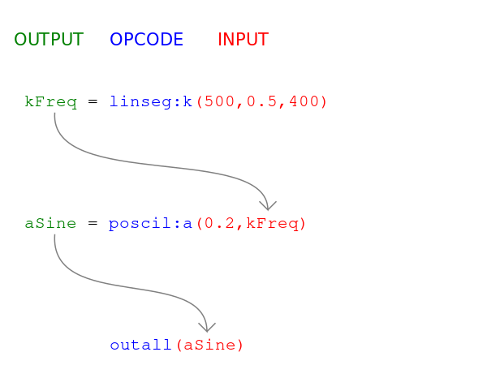

# 02 Hello Frequency

### What you learn in this tutorial

- How to create a sliding frequency or **glissando**.
- What **k-rate** or **control rate** means and
- What **k-variables** in Csound are.
- How a Csound **.csd document** is structured:
- What **CsOptions** are and
- What the **CsInstruments** or **orchestra** is.

## A Line for the Frequency

In natural sounds, the frequency is rarely fixed.
Usually, for instance when we speak, the pitch of our voice varies all the time,
in a certain range.

The most simple case of such a movement is a line.
We need three values to construct a line:

1. A value to start with.
2. A time to move from this value to the target value.
3. The target value itself.

This is a line which moves from 500 to 400 in 0.5 seconds, and then stays at
400 for 1.5 seconds:


Note: Acoustically this way to apply a _glissando_ is questionable.
We will discuss this in [Tutorial 05](01-GS-05.md).

Note: Should we not say: "This is a line which moves from 500 Hz to 400 Hz
in 0.5 seconds", rather than: "This is a line which moves from 500 to 400 in
0.5 seconds"? No. The line outputs numbers. These numbers can be used for
frequencies, but in another context they can have a different meaning.

## A Line Drawn with the 'linseg' Opcode

In Csound, we create a line like this with the opcode `linseg`.
This comes from "linear segments".
Here we only need one segment which moves from 500 to 400 in 0.5 seconds.

This is the Csound code for this linear movement:

    kFreq = linseg:k(500,0.5,400)

You will recognize the structure `opcode(arguments)` which we already used in
the first tutorial. Here, the opcode is `linseg`, and the arguments are `500`
as first value, `0.5` as duration to move to the next value, and `400` as target
value.

But why is the variable on the left side called _**k**Freq_, and why is
`linseg` written as `linseg:k`?

## k-rate Signals

A signal is something whichs values change in time.

But what is time in an audio application like Csound?

The fundamental time is given by the **sample rate**.
It determines how many audio samples we have in one second.
We saw in the first tutorial the signal _aSine_ whichs values change
in **audio rate**; calculating a new value for every sample.

The second possible time resolution in Csound is less fine grained.
It does not calculate a new value for every sample, but only for a **group of
samples**.
This time resolution is called **control rate**.


Variables in Csound which have **k** as first character, are using the control
rate. Their values are updated in the control rate. This is the reason we
write _**k**Freq_.

After the opcode, before the parenthesis, we put `:k` to make clear that this
opcode uses the control rate as its time resolution.

I recommend always using **k** or **a** at **both** positions:

- Left hand side for the variable, and also
- Right hand side after the opcode.

```
aSine = poscil:a(0.2,400)
kFreq = linseg:k(500,0.5,400)
```

You will learn more about _k-rate_ in the next tutorial.

## Example

Push the "Play" button. You will hear a tone with a falling pitch.

Can you see how the moving line is fed into the oscillator?

```csound
<CsoundSynthesizer>
<CsOptions>
-o dac
</CsOptions>
<CsInstruments>

sr = 44100
ksmps = 64
nchnls = 2
0dbfs = 1

instr Hello
  kFreq = linseg:k(500,0.5,400)
  aSine = poscil:a(0.2,kFreq)
  outall(aSine)
endin

</CsInstruments>
<CsScore>
i "Hello" 0 2
</CsScore>
</CsoundSynthesizer>
```

## Signal flow

When you look at our instrument code, you see that there is a common scheme:



The first line produces a signal and stores it in the variable _kLine_.
This variable is then used as input in the second line.

The second line produces a signal and stores it in the variable _aSine_.
This variable is then used as input in the third line.

## The Csound Document Structure

The whole Csound document consists of three parts:

1. The `<CsOptions>` tag. You see here the statement:
   `-o dac`
   This means: The output (`-o`) shall be written to the digital-to-analog converter
   (`dac`); in other words: to the sound card. Because of this, we listen to
   the result in real time.
   Otherwise Csound would write a file as final result of its rendering.
2. The `<CsInstruments>` tag. Here all instruments are collected. This tag is
   the place for the Csound code. It is also called the Csound "Orchestra".
3. The `<CsScore>` tag. This we discussed in the previous section.

As you see, all three tags are embraced by another tag:

`<CsoundSynthesizer> ... </CsoundSynthesizer>`

This tag defines the boundaries for the Csound program you write. In other words:
What you write out of these boundaries will be ignored by Csound.

## Try it yourself

- Let the frequency line move upwards instead of downwards.
- Use `linseg` to create a constant frequency of 400 or 500 Hz.
- Make the time of the _glissando_ ramp longer or shorter.
- Add another segment by appending one more value for time, and one more
  value for the second target value.
- Restore the original arguments of linseg. Then replace `linseg` by `line` and
  hear what is different.

## Opcodes, Tags and Terms you have learned in this tutorial

### Opcodes

- `linseg:k(Value1,Duration1,Value2,...)` generates segments of straight lines

### Tags

- `<CsoundSynthesizer>` ... `</CsoundSynthesizer>` starts and ends a Csound file.
- `<CsOptions>` ... `</CsOptions>` starts and ends the [Csound Options](https://csound.com/manual/invoke/cs-options/).
- `<CsInstruments>` ... `</CsInstruments>` starts and ends the space for defining
  Csound instruments.
- `<CsScore>` ... `</CsScore>` starts and ends the Csound score.

### Terms

- A _control rate_ or _k-rate_ signal is a signal which is not updated every
  sample, but for a group or block of samples.

## Go on now ...

with the next tutorial: [03 Hello Amplitude](01-GS-03.md).

## ... or read some more explanations here

### Linseg versus Line

Csound has a `line` opcode which we could use instead of `linseg`.

We can replace `linseg` in our code with `line`:

```csound
instr Hello
  kFreq = line:k(500,0.5,400)
  aSine = poscil:a(0.2,kFreq)
  outall(aSine)
endin
```

When you run this code, you will hear that `line` has one important
difference to `linseg`: It will not stop at the target value, but continue
its movement, in the same way as before:


Usually we do not want this, so I'd recommend to always use `linseg`,
except some special cases.

### Coding conventions

When you press the "Run" button, Csound "reads" the code you have written.
Perhaps you already experienced that you wrote something which results in an
error, because it is "illegal".

For instance this code:

    kFreq = linseg:k(500 0.5 400)

What is illegal here? We have separated the three input arguments
for `linseg` not by commas, but by spaces. Csound expects commas,
and if there is no comma, it returns a syntax error,
and the code cannot be compiled:

    error: syntax error, unexpected NUMBER_TOKEN,
    expecting ',' or ')' (token "0.5")

This is not a convention, it is a syntax we have to accept when we want our code
to be compiled and executed by Csound.

But inside this syntax we have many ways to write code in one way or another.

Let us look to some examples:

```csound
(1) kFreq = linseg:k(500,0.5,400)
(2) kFreq=linseg:k(500,0.5,400)
(3) kFreq = linseg:k(500, 0.5, 400)
(4) kFreq = linseg:k(500,.5,400)
(5) kFreq 		=		linseg:k(500,   0.5,   400)
```

\(1) This is the way I write code here in these tutorials. I put a space left and
right the `=`, but I put no space after the comma.

\(2) This is possible but perhaps you will agree that it is less clear
because the `=` sign is somehow hidden.

\(3) This is as widely used as (1), or more. I remember when I first read Guido van Rossum's
Python tutorial in which he recommends to write as in (1), I did not like it at
all. It took twenty years to agree ...

\(4) This is a common abbreviation which is possible in Csound and some other
programming languages. Rather than `0.5` you can just write `.5`. I use it
privately, but will not use it here in these tutorials because it is less clear.

\(5) You are allowed to use tabs instead of spaces, and each combination of it,
and as many tabs or spaces as you like. But usually we do not want a line to be
longer than necessary.

Another convention is to write the keywords `instr`and `endin` at the beginning
of the line, and then the code indented by two spaces:

```csound
instr Hello
  kFreq = linseg:k(500,0.5,400)
  aSine = poscil:a(0.2,kFreq)
  outall(aSine)
endin
```

The reason for this convention is again to format the code in favor of
maximum clarity.
In the [Csound Book](https://link.springer.com/book/10.1007/978-3-319-45370-5)
we used one space, but I think two spaces are even better.

To summarize: You have a lot of different options to write Csound code. You
can do what you like, but it is wise to accept some conventions which serve
for maximal comprehension. The goal is readable and transparent code.

### When to choose a-rate or k-rate?

The main reason for introducing _k-rate_ was to save CPU power. This was essential
in the early years of computer music. Nowadays it is not the same. For usual
instruments in electronic music, we can omit _k-rate_ variables, and only
use _a-rate_ variables. In our case, we can write:

    aFreq = linseg:a(500,0.5,400)
    aSine = poscil:a(0.2,aFreq)
    outall(aSine)

As a simple advice:

- Always use _a-rate_ when it sounds better.
- Use _k-rate_ instead of _a-rate_ when you must save CPU power.
- Some opcodes only accept _k-rate_ input, but no _a-rate_ input. In this case
  you must use _k-rate_ variables.
