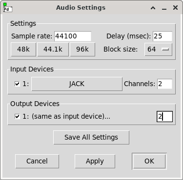

# 03 Hello Amplitude

### What you learn in this tutorial

- How to create a **varying amplitude**.
- What **orchestra header constants** in Csound are:
- The **sample rate**,
- The **ksmps** or **block size**,
- The **nchnls** as number of output channels,
- The **0dbfs** as zero dB full scale equivalent.
- How the **order of execution** works in a Csound program.
- How you can **understand error messages**.

## A Line for the Amplitude

Once we understood how to create lines, we can apply 
a linear movement to the amplitude, too. 

This is a signal which moves from 0.3 to 0.1 in half a second:

And this code will already look quite familiar to you:

    kAmp = linseg:k(0.3,0.5,0.1)

Note: Acoustically this way to change volume is questionable.
We will discuss this in Tutorial 06.

## Back to the head

Let us now look at some important settings which are written at the 
beginning of the `<CsInstruments>` tag:

    sr = 44100
    ksmps = 64
    nchnls = 2
    0dbfs = 1

This is sometimes called the "Orchestra Header".

We see four constants which should be written explicitely in every Csound file.  

They are called "constants" because you cannot change them during one run of 
Csound.  
Once you start Csound (by pushing the "Play" button), and Csound compiles, these
values remain as they are for this run.

What is the meaning of these constants?

### sr

**sr** means **sample rate**. This is the number of audio samples per one second.
Common values are 44100 (the CD standard), 48000 (video standard), or higher 
values like 96000 or 192000.

As the sample rate is measured per second, it is often expressed in Hertz (Hz),
or kilo Hertz (kHz).

You should choose the sample rate which fits to your needs.  
When you produce audio for an *mpeg* video which needs 48 kHz, you should set:

    sr = 48000
    
When your sound card runs at 44100 Hz, you should set your `sr` to the same
value (or vice versa).

### ksmps

**ksmps** means: **Number of samples in one control period**.

As you learned in [Tutorial 02](01-GS-02.md), the *k-rate* is based on the sample 
rate. A group or block of samples is collected in a package. Imagine yourself 
standing besides a belt. Little statues arrive on the belt in a regular
time interval, say once a second. Rather than taking each cube, and throwing 
it to a collegue, you collect 64 of the cubes in one package. A collegue throws 
this package once the 64 cubes are completed. If you are a really good team,
the collegue will throw one package every 64 seconds.

This "time to throw a package" is the control rate or *k-rate*. The time in 
which the little statues arrive one by one is the audio-rate or *a-rate*. 
In our example, the *k-rate* is 64 times slower than the *a-rate*. 

The **ksmps** constant defines how many audio samples are collected for one 
*k-rate* package.  
What we called "package" here, is in technical terms called "block" or 
"vector".  
So *ksmps* is exactly the same as "block size" in PureData or "vector size"
in Max.

### nchnls

**nchnls** means **number of channels**. 

When you have a stereo sound card, you will set `nchnls = 2`.

When you use eight speakers, you must set `nchnls = 8`. You will need a sound
card with at least eight channels the for real-time output.

Note: Csound assumes that you have the same number of input channels as you
have output channels. If this is not the case, you must use the `nchnls_i`
constant to set the number of input channels.  
For instance, in case you have 8 output channels but only 4 input channels on
your audio interface, set:

    nchnls = 8
    nchnls_i = 4

### 0dbfs

**0dbfs** means: **What is the amplitude which represents 0 dB full scale**.

This sounds a bit more complicated as it is.

We define here a number which represents the maximum possible amplitude.

We should always set this number to 1, as this is what all audio applications
do. 0 is minimum amplitude (meaning "silence"), and 1 is maximum amplitude.

Always set

    0dbfs = 1
    
and you will be fine.

(We will explain more in [Tutorial 05](01-GS-05.md) about dB.)

## Default Values in the Orchestra Header

Perhaps you have seen a Csound file in which the four important
constants are not defined.

In this case, Csound will use the "default" values.

The default value for **sr** is 44100.  
This is acceptable, but it is better to set it explicitely (and perhaps change
it then if necessary).

The default value for **ksmps** is 10.  
This is not good because it is not a power of two.  
(See [below](/get-started/GS-03#some-notes-about-ksmps) for explanation.)

The default value for **nchnls** is 1.  
This is not good because usually we want to use at least stereo.

The default value for **0dbfs** is 32767.  
This is not good at all. Please set it to 1.

It is strongly recommended to always set the four constants explicitely.

## Example

Look how both, the *kAmp* and *kFreq* line, are created by the `linseg` opcode.

These two lines are fed via the variable names into the `poscil` oscillator.

~~~csound
<CsoundSynthesizer>
<CsOptions>
-o dac
</CsOptions>
<CsInstruments>

sr = 44100
ksmps = 64
nchnls = 2
0dbfs = 1

instr Hello
  kAmp = linseg:k(0.3,0.5,0.1)
  kFreq = linseg:k(500,0.5,400)
  aSine = poscil:a(kAmp,kFreq)
  outall(aSine)
endin

</CsInstruments>
<CsScore>
i "Hello" 0 2
</CsScore>
</CsoundSynthesizer>
~~~
 

## Try it yourself

- Change the duration in the *kAmp* signal from 0.5 to 1 or 2. The frequency
and the amplitude line are now moving independently from each other.
- Change the values of the *kAmp* signal so that you get a rising rather than a 
decaying amplitude.
- Change `0dbfs` to 2. You should hear that it sounds softer now because the
"full scale" level is twice as high.
- Change `0dbfs`to 0.5. You should hear that it sounds louder now because the
"full scale" level is set to 0.5 now instead of 1.
- Move the line `aSine = poscil:a(kAmp,kFreq)` from third position in the
instrument to the first position. Push the "Play" button and look at the 
error message. Can you understand why Csound is complaining?

## Signal flow and Order of Execution

We can draw the signal flow of our instrument like this:

Please compare this version to the 
[signal flow diagram in Tutorial 01](/get-started/GS-01#a-signal-flow-and-its-code).  
The two inputs for the `poscil` oscillator are not any more two numbers, but
two signals, as outputs of two `linseg` opcodes.

Csound reads our program code line by line. Whenever something is used as input
for an opcode, it must exist at this time. 

## Read (!!!) the error messages

So when we put the third line of the instrument on top, we ask Csound to use 
something which is not known yet:

    instr Hello
      aSine = poscil:a(kAmp,kFreq)
      kAmp = linseg:k(0.3,0.5,0.1)
      kFreq = linseg:k(500,0.5,400)
      outall(aSine)
    endin

The `poscil` oscillator needs *kAmp* and *kFreq* as its input.  
But at this point of the program code, there is neither *kAmp* nor *kFreq*.  
So Csound will return a "used before defined" error message:

    error:  Variable 'kAmp' used before defined
    
As you see, Csound stops reading at the first error message.  
Once you put the `kAmp = linseg:k(0.3,0.5,0.1)` on top of the instrument,
Csound will not complain any more about *kAmp*, 
but move to the next undefined variable:

    error:  Variable 'kFreq' used before defined

The error message has changed now. Csound does not complain any more about
*kAmp* but about *kFreq*.  
Once you put the line `kFreq = linseg:k(500,0.5,400)` on first or second 
position, also this error message will disappear.

To summarize:

1. Learning a programming language is not possible without producing errors.  
This is an essential part of learning. But:

2. You MUST LOOK at the error messages.  
Figure out where the "Csound console" is in your environment. (It can be 
hidden or in the background.)  
And then read until you meet the first error message.

3. The first!  
And then try to understand it and solve it, and don't worry if the next one
shows up.  
You will solve them one by one.

## Constants and Terms you have learned in this tutorial

### Constants
- `sr` number of samples per second
- `ksmps` number of samples in one control block
- `nchnls` number of channels
- `0dbfs` number (amplitude) for zero dB full scale

### Terms
- *Block Size* or *Vector Size* is what Csound sets as `ksmps`:
the number of samples in one control cycle

## Go on now ...

with the next tutorial: [04 Hello Fade-out](01-GS-04.md).

## ... or read some more explanations here

### Some notes about ksmps

Note 1: It is recommended to use **power-of-two** values for `ksmps`.
Common values are 32 (= $2^5$) or 64 (= $2^6$).  
This is due to input/output handling of audio. You will find the same in 
other applications.

Note 2: The advantage of a **smaller** `ksmps` is the better time resolution for
the control rate.  
If the sample rate is 44100 Hz, we have a time resolution of 1/44100 seconds 
for each sample. This is about 0.000023 seconds or 0.023 milliseconds
between two samples.  
If we set `ksmps = 64` for this sample rate, we get 64/44100 seconds as time
resolution for each control value. This is about 0.00145 seconds or 1.45
milliseconds between two blocks or control values.  
If we set `ksmps = 32` for the same sample rate, we get 0.725 milliseconds
as time resolution for each new control value.

Note 3: The advantage of a **larger** `ksmps` is the better performance in terms
of speed. If you have a complex and CPU consuming Csound file, and get dropouts,
you can try to increase `ksmps`.

Note 4: Although `ksmps`is a constant, we can set a **local ksmps** in one 
instrument. The opcode for this operation is `setksmps`.  
Sometimes we wish to run a krate opcode in one instrument sample by sample.
In this case, we can use `setksmps(1)`.  
We only can split the global `ksmps` into smaller parts, not vice versa.

### How is this in PD?

[Pure Data](http://puredata.info/) is another popular audio programming 
language. Other than Csound it is not text based but uses visual symbols 
for programming. You can imagine that the progam flow which we have drawn
[above](/get-started/GS-03#signal-flow-and-order-of-execution) in symbols
is now on your screen, and you connect the object boxes with symbolic cables.

(It is possible, by the way, to embed Csound in PD. Read more 
[here](/csound-in-other-applications/csound-in-pd) 
in this book if you are interested.)

It might be good to have a look how the important constants like sample rate 
and *ksmps* are set in PD, and how they are called in PD. I hope this comparision
helps to understand what is happening in any audio application and audio
programming language.

All settings can be found in the *Audio Settings ...* which look like this for
my PD version:

Top left the **sample rate** is being set, as we did in Csound via

    sr = 44100

Beneath the **block size** can be selected. This is exactly the same as the
**ksmps** in Csound. The selected block size of 64 is what we did as:

    ksmps = 64

Below we can set input and output devices, and the number of input and
output channels. The latter is what we did via

    nchnls = 2
    
(We did not select any audio device because we use Csound in a browser here,
so it uses Web Audio. But of course you can select your input and output device
in Csound, too.)

And what about `0dbfs`? This is always set to 1 in PD, so no field for it.

### What is Open Source?

Both, PD and Csound, are "Open Source Software". What does this mean? 

You can read more about it for instance in the Wikipedia article about
[Free and open source software](https://en.wikipedia.org/wiki/Free_and_open-source_software).
I would like to say here some more specific words about Csound being "free and
open source".

At first, all Csound code is visible to anyone. Currently the source code is
on [Github](https://github.com/csound/csound). Anyone can not only read it,
but also "fork" it, under certain conditions, so change it and distribute it.
But why? Better to contribute to it ...

No one gets paid for developing Csound source code, or for contributing to
the [Csound website](https://csound.com), or for maintaining frontends, or for
writing tutorials. The motivations are certainly different, but I guess that
one motivation is common: That we all enjoy to use a software which is our
common property. And because it is real fun to contribute to a software 
which can be used by anyone, to materialize creative musical ideas.

For me, it is astonishing and encouraging that it works, since nearly four decades. 
If you read this and feel that you might contribute anything: Welcome! Have a look
at the [Community](https://csound.com/community.html) page of the Csound
Website and join us. There is always work to do, and to have fun doing it ...
