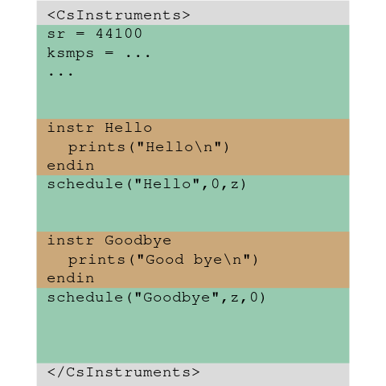
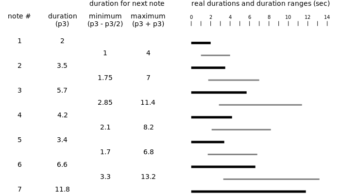

# 10 Hello Random

### What you learn in this tutorial

- How to work with **random numbers** in Csound
- How to set a certain **seed** for random sequences
- How to implement **structural ideas** with random portions
- How a **random walk** can be implemented
- What the **global space** in the Csound orchestra is

## Random Numbers and Artistic Decisions

Throwing the dies and inventing games which follow the dies' result has always
been enjoyable for people. Most interesting is the relationship between the
decided rules and the inpredictablity of the next throw.

In modern art and music random choices often have an important role. It can
be on a more technical level, for instance when we use random deviations for
[granular synthesis](/sound-synthesis/granular-synthesis#asynchronous-granular-synthesis)
to somehow imitate nature in its permanent variety.

But it can also be an essential part of our invention that we create _structures_
which can be realized in one or the other way, rather than determining each single
note like in a melody.

We will create a simple example for this way of composing here. It will show that
"working with random" does not at all mean "withdraw from decisions". In
contrary, the decisions are there, and most important for what can happen.

## The 'random' Opcode and the 'seed'

For getting a random number, we set one limit for the smallest possible number,
and one limit for the largest possible number. Inside this range, a random
number is selected.

This is a simple example for a random number between 10 and 20. Please run it
three times and watch the console printout.

```csound
<CsoundSynthesizer>
<CsOptions>
-o dac -m 128
</CsOptions>
<CsInstruments>
sr = 44100
ksmps = 64
nchnls = 2
0dbfs = 1

instr Random
  iRandomNumber = random:i(10,20)
  prints("Random number between 10 and 20: %f\n",iRandomNumber)
endin

</CsInstruments>
<CsScore>
i "Random" 0 0
</CsScore>
</CsoundSynthesizer>
```

You will see that three times the same random number is generated.
My printout shows:

`Random number between 10 and 20: 18.828730`

Why?

Strictly spoken the computer has no random because it can only calculate.
A random number is created internally by a calculation. Once the first number
is there, all other numbers are determined by a
[pseudorandom number generator](https://en.wikipedia.org/wiki/Pseudorandom_number_generator).

This starting point of a random sequence is called _seed_. If we do not set
a seed, Csound uses a fixed number. This is the reason why we always got the
same number.

The `seed` opcode offers us two possibilities:

- For `seed(0)` Csound will seed from the current clock. This is what most other
  applications do as default. It results in an always different start value, so
  that is what we usually want to get when we use random.
- For any positive integer number we put in `seed`, for instance `seed(1)` or
  `seed(65537)`, we get a certain start value of the random sequence. `seed(1)`
  will yield another result as `seed(65537)`. But once you run your Csound program
  twice with `seed(1)`, it will result in the same random values.  
  This is a good opportunity to check out different random traces, but being able
  to reproduce any of them precisely.

Please insert `seed(0)` in the example above. It should be placed below the
`0dbfs = 0` line, in the global space of the orchestra. When you run your
code several times, it should always print a different _iRandomNumber_ output.

Also try to insert `seed(1)` or `seed(2)` etc. instead. You will see that each
output is different, but once you run one of them twice, you will get the same result.

## The "Global Space" or "instrument 0"

As you know from [Tutorial 02](/get-started/GS-02#the-csound-document-structure)
and from [Tutorial 08](/get-started/GS-08#using-csound-without-the-score-section),
the space for the actual Csound code in a _.csd_ document is what is enclosed
by the `<CsInstruments>` tag. This is also called the "orchestra".

Inside the orchestra, we have instrument definitions. Each instrument starts
with the keyword `instr` and ends with the keyword `endin`.

But we have also a "global space" in the orchestra. "Global" means here:
**Outside** any instrument.



As you see, the global space is not only on top of the orchestra. In fact,
each single empty line outside an instrument is part of the global space.

We have already used this global space. The "orchestra header constants" live
in this global space, outside any instrument, when we set:

    sr = 44100
    ksmps = 64
    nchnls = 2
    0dbfs = 1

We also used the global space in setting our instrument call via `schedule`
below an instrument definition:

    instr MySpace
      ...
    endin
    schedule("MySpace",0,1)

The instrument definition establishes a local space. The `schedule(...)` line
resides in the global space.

Sometimes this global space is called _instrument 0_. The reason is that the
instruments in the orchestra have `1` as smallest possible number.

This is what we **can** do in the global space:

- We can set global parameters like sample rate etc, and also the `seed` because
  it is a global parameter, too.
- We can define own functions or import external code.
- We can create tables (buffers) and assign software channels.
- We can perform _i-rate_ expressions. Insert, for instance,
  `prints("Hello Global Space!\n")` in the global space and look in the console
  ouput.

What we can **not** do in the global space:

- We cannot perform any _k-rate_ or _a-rate_ statement.

The global space is read and executed once we run Csound, even if we do not
call any instrument.

## Example

Please this time read the code first, and guess how it will sound for
each note. What will be the development of this sketch, and how long do
you expect it to go?

```csound
<CsoundSynthesizer>
<CsOptions>
-o dac
</CsOptions>
<CsInstruments>

sr = 44100
ksmps = 64
nchnls = 2
0dbfs = 1
seed(12345)

instr Hello
  //MIDI notes between 55 and 80 for both start and end
  iMidiStart = random:i(55,80)
  iMidiEnd = random:i(55,80)
  //decibel between -30 and -10 for both start and end
  iDbStart = random:i(-30,-10)
  iDbEnd = random:i(-30,-10)
  //calculate lines depending on the random choice
  kDb = linseg:k(iDbStart,p3/2,iDbEnd)
  kMidi = linseg:k(iMidiStart,p3/3,iMidiEnd)
  //create tone with fade-out and output
  aSine = poscil:a(ampdb(kDb),mtof(kMidi))
  aOut = linen:a(aSine,0,p3,p3/2)
  outall(aOut)

  //trigger next instance with random range for start and duration
  iCount = p4
  if (iCount > 1) then
    iStart = random:i(1,3)
    iDur = p3 + random:i(-p3/2,p3)
    schedule("Hello",iStart,iDur,iCount-1)
  endif
endin
schedule("Hello", 0, 2, 15)

</CsInstruments>
<CsScore>
</CsScore>
</CsoundSynthesizer>
```

## Structural Decisions

We have a lot of `random` opcodes in the code. Let us look closer to the
decisions inheritated in them, and to the effects which result from the decisions.

    iMidiStart = random:i(55,80)
    iMidiEnd = random:i(55,80)

Setting both, start and end pitch of the _glissando_ line to a range from
MIDI note 55 (= _F#4_) to 80 (= _G#6_) makes it equally probable that rising
and falling lines will appear. Some will have a big range (imagine a line
from 78 to 56) whilst others will have a small range (imagine a line from 62 to 64).

The alternative could be, for instance, to set:

    iMidiStart = random:i(55,67)
    iMidiEnd = random:i(68,80)

Then the sliding pitch line would always be upwards. Or:

    iMidiStart = random:i(55,70)
    iMidiEnd = random:i(65,80)

Then the pitch line would be mostly upwards, but sometimes not.

Similar decisions apply for the volume line which is set to:

    iDbStart = random:i(-30,-10)
    iDbEnd = random:i(-30,-10)

The maximum difference is 20 dB which is not too much. So there is some
variance between louder and softer tones but all are well perceivable, and
there is not much foreground-background effect as it would probably occur
with a range of say -50 to -10 dB.

The most important decisions for the form are these, concerning the distance
between subsequent notes and the duration of the notes:

    iStart = random:i(1,3)
    iDur = p3 + random:i(-p3/2,p3)

The distance between two notes is between one and three seconds. So in average
we have a new note every two seconds.

But the duration of the notes is managed in a way that the next note duration
has this note's duration (**p3**) plus a random range between

- minus half of this note's duration as minimum, and
- this note's duration as maximum.

(This is the same as a random range between `p3/2` and `p3*2`. But I personally
prefer here thinking the next duration as "this duration plus/minus something".)

For the first note which has a duration of two seconds, this means a random
range between one and four seconds. So the tendency of the duration is to
become larger and larger. Here is what happens in the example code above
for the first seven notes:



It is interesting to see that note 2 and 3 expand their duration as expected,
but then note 4 and 5 shrink because they chose their durations close to the
minimum.

But on the long run the larger durations prevail so that more and more notes
sound at the same time, forming chords or clusters.

## Try it yourself

- Set `seed(0)` instead of `seed(12345)` and listen to some of the results.
- Change line 32 `iDur = ...` so that you get equal probability for longer
  or shorter durations, without any process.  
  Make up your mind about this version.
- Change line 32 `iDur = ...` so that on the long run the durations become
  shorter and shorter.
- Change the code so that for half of the notes to be played the durations
  become longer, and for the second half the durations become shorter.
- Change the code so that for the first half of the notes the distance
  between subsequent notes become shorter, and in the second half again
  become longer.
- Apply this change also to the pitches and the volume so that in the first
  half the pitches increase whilst the volume decreases, and then in the second
  half vice versa.

## Random Walks

In a _random walk_, the random values of the next step depend on the previous step.

In the example above, the durations are following a random walk, whilst the
other random decisions are independent from a previous step.

As shown in the figure above, note number seven with a duration of 11.8 seconds
would not have been possible in one of the previous steps. It depends on the
random range which is generated in step six.

The random walk of the note durations is combined with a tendency, leading to a
development. But it is also possible to keep the conditions for the next
step constant, but nevertheless get surprising patterns. Have a look at the
[Wikipedia article](https://en.wikipedia.org/wiki/Random_walk) or other sources.

This is a random walk for pitch, volume and duration. The conditions for the
next step remain unchanged, but nevertheless there can be a direction in
each of the three parameters.

```csound
<CsoundSynthesizer>
<CsOptions>
-o dac -m 128
</CsOptions>
<CsInstruments>
sr = 44100
ksmps = 64
nchnls = 2
0dbfs = 1
seed(54321)

instr RandomWalk
  //receive pitch and volume
  iMidiPitch = p4
  iDecibel = p5
  //create tone with fade-out and output
  aSine = poscil:a(ampdb:i(iDecibel),mtof:i(iMidiPitch))
  aOut = linen:a(aSine,0,p3,p3)
  outall(aOut)

  //get count
  iCount = p6
  //only continue if notes are left
  if (iCount > 1) then
    //notes are always following each other
    iStart = p3
    //next duration is plusminus half of the current maximum/minimum
    iDur = p3 + random:i(-p3/2,p3/2)
    //next pitch is plusminus a semitone maximum/minimum
    iNextPitch = iMidiPitch + random:i(-1,1)
    //next volume is plusminus 2dB maximum/minimum but
    //always in the range -50 ... -6
    iNextDb = iDecibel + random:i(-3,3)
    if (iNextDb > -6) || (iNextDb < -50) then
      iNextDb = -25
    endif
    //start the next instance
    schedule("RandomWalk",iStart,iDur,iNextPitch,iNextDb,iCount-1)
  //otherwise turn off
  else
    event_i("e",0,0)
  endif

  //print the parameters of this instance to the console
  prints("Note # %2d, Duration = %.3f, Pitch = %.2f, Volume = %.1f dB\n",
         50-iCount+1, p3, iMidiPitch, iDecibel)
endin
schedule("RandomWalk",0,2,71,-20,50)

</CsInstruments>
<CsScore>
</CsScore>
</CsoundSynthesizer>
```

This is how the result looks like:


Without changing the conditions for the random walk, we get an extreme reduction
of the durations at the end of this sequence.

In general, random in art is a part of our phantasy and invention. By
introducing any "if", we can change conditions in
whatever situation. For instance: "If the pitch has been constant in the last
three steps, jump to the upper or lower border."

"Random" and "if" together can create crazy realities. Very individual because
you yourself came across these ideas. Very rational because it is all based
on written rules and conditions. Very inpredictable because the random chain
may lead to unforeseen results. And perhaps this is one of the biggest qualities ...

## Opcodes and terms you have learned in this tutorial

- `random:i(iMin,iMax)`
- `seed(iNum)`
- _global space_ is the part of the `CsInstruments` section which is outside
  any instrument definition
- _instrument 0_ is another word for it

## Go on now ...

with the next tutorial: [11 Hello Keys](01-GS-11.md).

## ... or read some more explanations here

### Remember i-rate and k-rate ...

Perhaps you noticed that until now we only used random at _i-rate_.
As you learned in [Tutorial 05](/get-started/GS-05) this means that a random
value is only generated **once**, at the initialization of the instrument
instance.

What happens if we use `random` at _k-rate_? Like

    kMidi = random:k(55,80)

This will generate a random number between 55 and 80 **in every k-cycle**.
As calculated [here](/get-started/GS-03#some-notes-about-ksmps) this is usually
about 1000 times per second.

So this is a massive difference which is only intrduced by calling either
`random:i` or `random:k`. Although it is consistent and just following what
we explained in [Tutorial 02](/get-started/GS-02) and
[Tutorial 05](/get-started/GS-05), it is often surprising for beginners.

We even can use the `random` opcode at _a-rate_. Then we generate one random
value for each sample, so 44100 times per second, if this is our sample rate.
When we choose a reasonable range for minimum and maximum, we can listen
to it, and call it "white noise":

    aNoise = random:a(-0.1,0.1)

### Random with interpolating or with held values

Having only the choice between one random value for the whole duration of an
instrument event (_i-rate_) and about one thousand different random values
per second (_k-rate_) is not enough for many use cases.
Imagine we want a sound to move between two speakers. We may want it to change
its direction about once per second.

This is a typical case which is covered by the
[`randomi`](https://csound.com/docs/manual/randomi.html) opcode.
The **i** as the end of its name means **interpolating**.
This opcode generates random numbers in a certain density, and draws lines
between them. These lines are the interpolations.

The input arguments for `randomi` are: 1. minumum, 2. maximum, 3. how many 
values to generate per second, 4. is about different possibilities at the
beginning and should be set to `3` for normal use (consult the reference
for more). 

This is a random line between 0 and 1, with one new value every second:


Sometimes we want the random values to be held until the next one. This is
the job of then
[`randomh`](https://csound.com/docs/manual/randomh.html) opcode.

The input parameters carry the same meaning as for `randomi`. This is the output
for `randomh` with the same input arguments as in the previous plot:


All this is just a small selective view on the big world of random.

In all the opcodes we discussed so far we have an equal distribution of the
random numbers in a certain range. But in nature, we often have a larger probability
in the middle than near the borders of the random range. The
[Gaussian distribution](https://en.wikipedia.org/wiki/Normal_distribution)
is the mathematical formulation for it, and it is implemented in the
[`gauss`](https://csound.com/docs/manual/gauss.html)
opcode in Csound.

And the _random walk_ is only one possibility of a random which depends on a
context rather than throwing the dies. The _Markov chain_ is another approach.
If you want to read more, and run some examples, please have a look at the
[Random](/basics/random) chapter in this book.

### Congratulations!

You have now finished the first ten of these tutorials. This block was meant as a 
general introduction. To summarize some of the contents which you know now:

- You know how a **_.csd_ file** is structured.
- You know how you set **sample rate**, **block size** and other constants.
- You know how you define **instruments** as main units of any Csound program.
- You know how you call **instances** of instruments via a **score line**.
- You know how you can do the same from inside the orchestra code via **schedule**.
- You know what **i-rate**, **k-rate** and **a-rate** is. (In case you become
nervous here, and feel a slight fear: Have a look
[here](/get-started/GS-02#k-rate-signals) and
[here](/get-started/GS-05#i-rate-variables-in-csound).)
- You know how you can use **opcodes** and how to read the
[Csound Reference Manual](https://csound.com/docs/manual/index.html)
to know about their inputs and outputs.
- You already know some essential opcodes, like
	- `outall` and `out` for outputting audio signals
	- `poscil` as multi-purpose oscillator
	- `linseg` as generator for whatever lines we need
	- `linen` as simple tool for fades
	- `mtof` and `ampdb` as important converters for pitch and volume
	- `if` as conditional branching
	- `random` and derivates as random generators

I think this should be enough to jump anywhere in this textbook, and either dig
deeper in the Csound language in
[Chapter 03](/csound-language/initialization-and-performance-pass), or look at
sound synthesis methods in [Chapter 04](/sound-synthesis/additive-synthesis),
or to ways to modify existing sounds in [Chapter 05](/sound-modification/envelopes).

Of course you are welcome to continue these tutorials which will now move to
live input and will try to cover other basic subjects of using Csound in an
interactive way.
