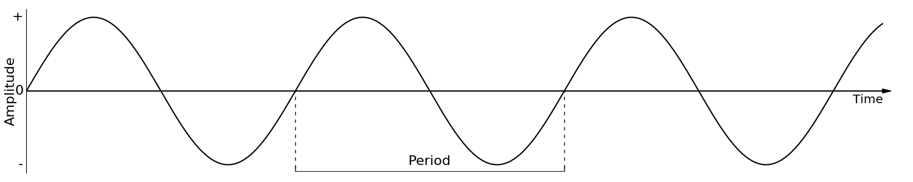
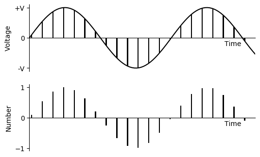
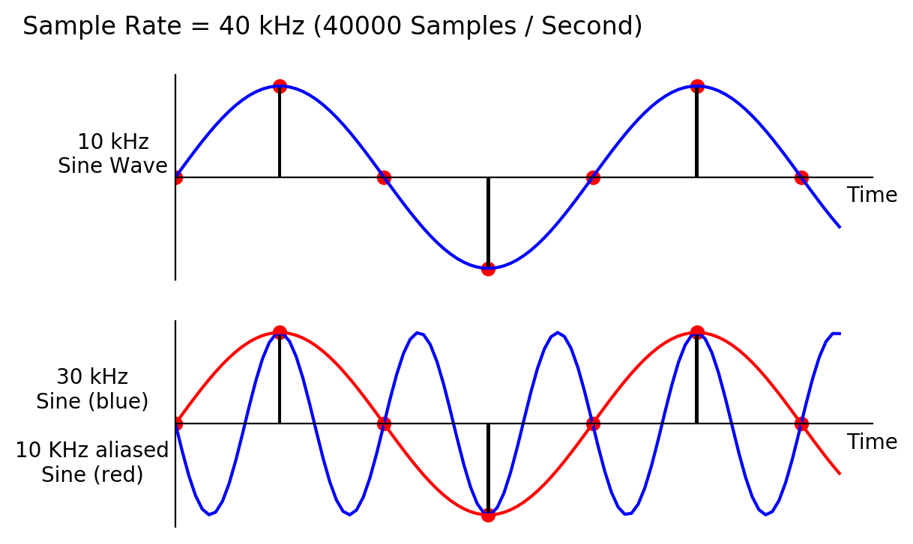

01 A. DIGITAL AUDIO
===================

At a purely physical level, sound is simply a mechanical disturbance of
a medium. The medium in question may be air, solid, liquid, gas or a
combination of several of these. This disturbance in the medium causes
molecules to move back and forth in a spring-like manner. As one
molecule hits the next, the disturbance moves through the medium causing
sound to travel. These so called compressions and rarefactions in the
medium can be described as sound waves. The simplest type of waveform,
describing what is referred to as *simple harmonic motion*, is a sine
wave.

{width=95%}

Each time the waveform signal goes above zero the molecules are in a state
of compression meaning that each molecule within the waveform
disturbance is pushing into its neighbour. Each time the waveform signal
drops below zero the molecules are in a state of rarefaction meaning the
molecules are pulling away from their neighbours. When a waveform shows
a clear repeating pattern, as in the case above, it is said to be
periodic. Periodic sounds give rise to the sensation of pitch.

Elements of a Sound Wave
------------------------

Periodic waves have some main parameters:

-   **Period**: The time it takes for a waveform to complete one cycle,
    measured in seconds.

-   **Frequency**: The number of cycles or periods per second, measured
    in Hertz (Hz). If a sound has a frequency of 440 Hz it
    completes 440 cycles every second. Read more about frequency in the
    [next chapter](01-b-pitch-and-frequency.md).

-   **Phase:** This is the starting point of a waveform.
    It can be expressed in degrees or in radians. A complete cycle of
    a waveform will cover 360 degrees or 2π radians. A sine with a phase
    of 90° or π/2 results in a cosine.

-   **Amplitude:** Amplitude is represented by the y-axis of a plotted
    pressure wave. The strength at which the molecules pull or push away
    from each other, which will also depend upon the resistance offered
    by the medium, will determine how far above and below zero - the
    point of equilibrium - the wave fluctuates. The greater the y-value
    the greater the amplitude of our wave. The greater the compressions
    and rarefactions, the greater the amplitude.

Transduction
------------

The analogue sound waves we hear in the world around us need to be
converted into an electrical signal in order to be amplified or sent to
a soundcard for recording. The process of converting acoustical energy
in the form of pressure waves into an electrical signal is carried out
by a device known as a a transducer.

A transducer, which is usually found in microphones, produces a changing
electrical voltage that mirrors the changing compression and rarefaction
of the air molecules caused by the sound wave. The continuous variation
of pressure is therefore *transduced* into continuous variation of
voltage. The greater the variation of pressure the greater the variation
of voltage that is sent to the computer.

Ideally, the transduction process should be as transparent as possible:
whatever goes in should come out as a perfect analogy in a voltage
representation. In reality, however, this will not be the case. Low quality devices add noise and deformation. High quality devices add certain characteristics like warmth or transparency.

Sampling
--------

The analogue voltage that corresponds to an acoustic signal changes
continuously, so that at each point in time it will have a different
value. It is not possible for a computer to receive the value of the
voltage for every instant because of the physical limitations of both
the computer and the data converters (remember also that there are an
infinite number of instances between every two instances!).

What the soundcard can do, however, is to measure the power of the
analogue voltage at intervals of equal duration. This is how all digital
recording works and this is known as *sampling*. The result of this
sampling process is a discrete, or digital, signal which is no more than
a sequence of numbers corresponding to the voltage at each successive
moment of sampling.

Below is a diagram showing a sinusoidal waveform. The vertical lines
that run through the diagram represent the points in time when a
snapshot is taken of the signal. After the sampling has taken place, we
are left with what is known as a *discrete signal*, consisting of a
collection of audio samples, as illustrated in the bottom half of the
diagram.

{width=70%}

It is important to remember that each sample represents the amount of
voltage, positive or negative, that was present in the signal at the
point in time at which the sample or snapshot was taken.

The same principle applies to recording of live video: a video camera
takes a sequence of pictures of motion and most video cameras will take
between 30 and 60 still pictures a second. Each picture is called a
frame and when these frames are played in sequence at a rate
corresponding to that at which they were taken we no longer perceive
them as individual pictures, we perceive them instead as a continuous
moving image.

Sample Rate and the Sampling Theorem
------------------------------------

The sample rate describes the number of samples (pictures/snapshots)
taken each second. To sample an audio signal correctly, it is important
to pay attention to the sampling theorem:

*To represent digitally a signal containing frequencies up to X Hz, it
is necessary to use a sampling rate of at least 2X samples per second.*

According to this theorem, a soundcard or any other digital recording
device will not be able to represent any frequency above 1/2 the
sampling rate. Half the sampling rate is also referred to as the Nyquist
frequency, after the Swedish physicist Harry Nyquist who formalized the
theory in the 1920s. What it all means is that any signal with
frequencies above the Nyquist frequency will be misrepresented and will
actually produce a frequency lower than the one being sampled. When this
happens it results in what is known as *aliasing* or *foldover*.

Aliasing
--------

Here is a graphical representation of aliasing.

The sinusoidal waveform in blue is being sampled at the vertical black
lines. The line that joins the red circles together is the captured
waveform. As you can see, the captured waveform and the original
waveform express different frequencies.

Here is another example, showing for a sample rate of 40 kHz in the upper section a sine of 10 kHz, and in the lower section a sine of 30 kHz:

We can see that if the sample rate is 40 kHz there is no problem with
sampling a signal that is 10 KHz. On the other hand, in the second
example it can be seen that a 30 kHz waveform is not going to be
correctly sampled. In fact we end up with a waveform that is 10 kHz,
rather than 30 kHz. This may seem like an academic proposition in that we
will never be able to hear a 30KHz waveform anyway but some synthesis
and DSP techniques procedures will produce these frequencies as
unavoidable by-products and we need to ensure that they do not result in
unwanted artifacts.

In computer music we can produce any frequency internally, much higher than we can hear, and much higher than the Nyquist frequency. This may occur intentionally, or by accident, for instance when we multiply a frequency of 2000 Hz by the 22nd harmonic, resulting in 44000 Hz. In the following example, instrument 1 plays a 1000 Hz tone first directly, and then as result of 43100 Hz input which is 1000 Hz lower than the sample rate of 44100 Hz. Instrument 2 demonstrates unwanted aliasing as a result of harmonics beyond Nyquist: the 22nd partial of 1990 Hz is 43780 Hz which sounds as 44100-43780 = 320 Hz.

***EXAMPLE 01A01\_Aliasing.csd***

~~~csound
<CsoundSynthesizer>
<CsOptions>
-odac
</CsOptions>
<CsInstruments>
sr = 44100
ksmps = 32
nchnls = 2
0dbfs = 1

//wave form with harmonics 1, 10, 20
giHarmonics ftgen 0, 0, 8192, 9, 1,.1,0, 11,.1,0, 22,1,0

instr 1
print sr-1990*22
 asig poscil .1, p4
 out asig, asig
endin

instr 2
 asig poscil .2, p4, giHarmonics
 out asig, asig
endin

</CsInstruments>
<CsScore>
i 1 0 2 1000 ;1000 Hz tone
i 1 3 2 43100 ;43100 Hz tone sounds like 1000 Hz because of aliasing
i 2 6 4 1990 ;1990 Hz results in 1990*22=43780 Hz so aliased 320 Hz
</CsScore>
</CsoundSynthesizer>
;example by joachim heintz
~~~

The same phenomenon happens in film and video, too. You may recall
having seen wagon wheels apparently turn in the wrong direction in old
Westerns. Let us say for example that a camera is taking 30 frames per
second of a wheel moving. In one example, if the wheel is completing one
rotation in exactly 1/30th of a second, then every picture looks the
same and as a result the wheel appears to be motionless. If the wheel
speeds up, i.e. it increases its rotational frequency, it will appear as
if the wheel is slowly turning backwards. This is because the wheel will
complete more than a full rotation between each snapshot.

As an aside, it is worth observing that a lot of modern \'glitch\' music
intentionally makes a feature of the spectral distortion that aliasing
induces in digital audio. Csound is perfectly capable of imitating the
effects of aliasing while being run at any sample rate - if that is what
you desire.

Audio-CD Quality uses a sample rate of 44100 Hz (44.1 kHz). This means
that CD quality can only represent frequencies up to 22050 Hz. Humans
typically have an absolute upper limit of hearing of about 20 Khz thus
making 44.1 KHz a reasonable standard sampling rate. Higher sample rates offer better time resolution and the Nyquist frequency is not that close to the limit of hearing. But on the other hand twice the sample rate creates twice as much data. The choice has to be made depending on the situation; in this book we stick on the sample rate of 44100 Hz for the examples.

Bits, Bytes and Words
---------------------

All digital computers represent data as a collection of *bits* (short for
binary digit). A bit is the smallest possible unit of information. One
bit can only be in one of two states: off or on, 0 or 1. All computer data
— a text file on disk, a program in memory, a packet on a network — is ultimately a collection of bits.

Bits in groups of eight are called *bytes*, and one byte historically
represented a single character of data in the computer memory. Mostly one byte is the smallest unit of data, and bigger units will be created by using two, three or more bytes. A good example is the number of bytes which is used to store the number for one audio sample. In early games it was 1 byte (8 bit), on a CD it is 2 bytes (16 bit), in sound cards it is often 3 bytes (24 bit), in most audio software it is internally 4 bytes (32 bit), and in Csound 8 bytes (64 bit).

The [word length](https://en.wikipedia.org/wiki/Word_(computer_architecture)) of a computer is the number of bits which is handled as a unit by the processor. The transition from 32-bit to 64-bit word length around 2010 in the most commonly used processors required new compilations of Csound and other applications, in particular for the Windows installers. To put it simple: A 32-bit machine needs an application compiled for 32-bit, a 64-bit machine needs an application compiled for 64-bit.

Bit-depth Resolution
--------------------

The sample rate determines the finer or rougher resolution in time. The number of bits for each single sample determines the finer or rougher resultion in amplitude. The standard resolution for CDs is 16 bit, which allows for 65536
different possible amplitude levels, 32767 on either side of the zero axis.
Using bit rates lower than 16 is not a good idea as it will result in
noise being added to the signal. This is referred to as quantization
noise and is a result of amplitude values being excessively rounded up
or down when being digitized.

The figure below shows the quantization issue in simplified version, assuming a depth of only 3 bit. This is like a grid of 2^3^ = 8 possible levels which can be used for each sample. At each sampling period the soundcard plots an amplitude which is adjusted to the next possible vertical position. For a signal with lower amplitude the distortion would even be stronger.

 Quantization noise becomes most apparent
when trying to represent low amplitude (quiet) sounds. Frequently a tiny
amount of noise, known as a dither signal, will be added to digital
audio before conversion back into an analogue signal. Adding this dither
signal will actually reduce the more noticeable noise created by
quantization. As higher bit depth resolutions are employed in the
digitizing process the need for dithering is reduced. A general rule is
to use the highest bit rate available.

Many electronic musicians make use of deliberately low bit depth
quantization in order to add noise to a signal. The effect is commonly
known as *bit-crunching* and is easy to implement in Csound. Example 05F02 in chapter [05F](05-f-am-rm-waveshaping.md) shows one possibility.

ADC / DAC
---------

The entire process, as described above, of taking an analogue signal and
converting it to a digital signal is referred to as analogue to digital
conversion, or ADC. Of course digital to analogue conversion, DAC, is
also possible. This is how we get to hear our music through our PC\'s
headphones or speakers. If a sound is played back or streamed, the software will send a series of numbers to the soundcard. The soundcard converts these numbers back to voltage. When the voltages reaches the loudspeaker they cause the loudspeaker's membrane to move inwards and outwards. This induces a disturbance in the air around the speaker — compressions and rarefactions as described at the beginning of this chapter — resulting in what we perceive as sound.
