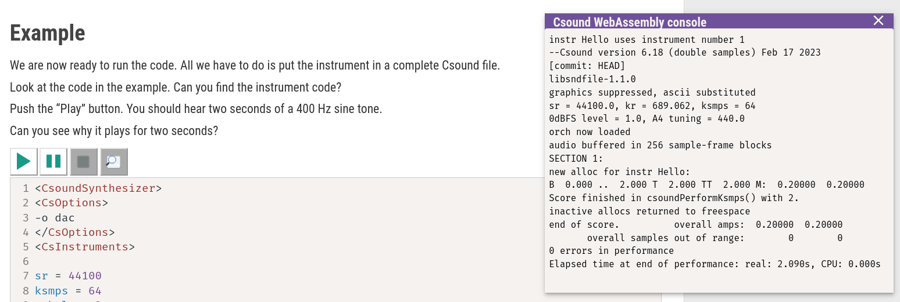
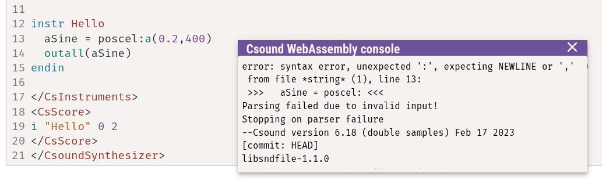

# HOW TO: GET HELP

## REFERENCE MANUAL

### Where can I find the Reference Manual?

- Online: <https://csound.com/docs/manual/index.html>
- Download: <https://github.com/csound/manual/releases>

## ORIENTATION

### Where can I find an Opcode Overview?

- In the Reference Manual: <https://csound.com/docs/manual/PartOpcodesOverview.html>
- In the Floss Manual: [Opcode Guide](/miscellanea/opcode-guide)

## ERRORS

### Where can I find Csound's error messages?

Csound's error messages are displayed in the _Console_.

The console will look different depending on your way to run Csound.
Here in this online textbook, the console shows up when you push the _Run_
button of an example:

In frontends the console may be hidden, but you will be able to bring it to view.

Depending on your way to use Csound, the console may show more or less information.
But the error messages should always be visible.

### How can I find the related code line for an error message?

Csound tries to point us to the first error in the code. Look at the following
output; the error was to write `poscel` rather than `poscil`.

The first line is a bit obscure, but **syntax error** is the important bit here.

The second line reports the line number in the code as `13` which is true.
(Sometimes in frontends the line number is plus-minus one.)

The third line is a quotation of the wrong line:

    >>> aSine = poscel: <<<

Note that it does not report the full line, but up to the point at which the
syntax error occured for the Csound parser.

### What are the most common error messages?

The following is of course a subjective selection.

1. `used before defined`  
   This error message pops up when we use a variable name as input to an opcode,
   but this variable has no value. Often this is just a typo, for instance we
   typed _asine_ rather than _aSine_.
2. `failed to open file (No Error.)`  
   This means that Csound could not find the file, typically as input string for
   the `diskin` opcode. "No Error" means here that this is not a syntax error.
   Once the file can be found, the code can be executed.
3. `diskin2: number of output args inconsistent with number of file channels`  
   This is a frequent message when we have a mismatch between the file input and
   the number of outputs for the `diskin` opcode. For instance, Csound will complain for  
   `aL,aR diskin "fox.wav"`  
   because _fox.wav_ is a mono sound file, but with `aL,aR` we claimed it to be stereo.

### How can I get help if I don't understand an error message?

Use one of the many channels to contact other Csound users: Forum, Chat, or
Email. See [here](https://csound.com/community.html) for more.

### What can I do when Csound just crashes?

This is somehow the worst case: When Csound crashes, you will not see any error
message at all, so you have no clue what went wrong.

If possible, run your Csound file from the command line. The command line itself
will not crash, and perhaps you see something which gives more information.
