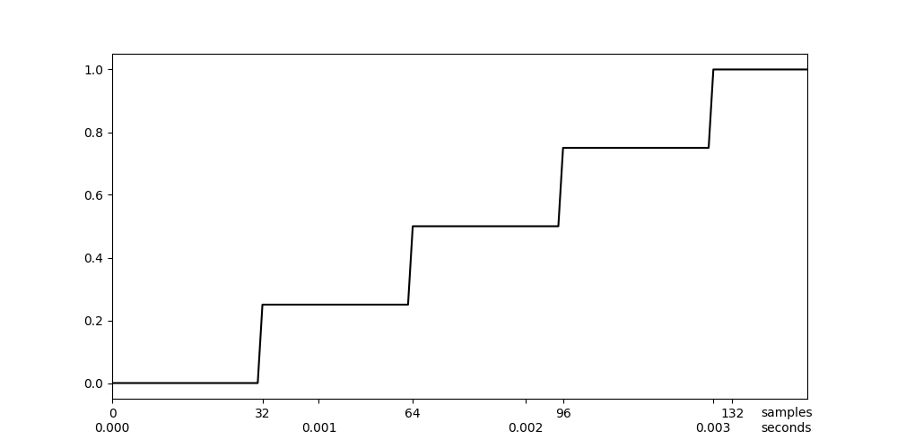
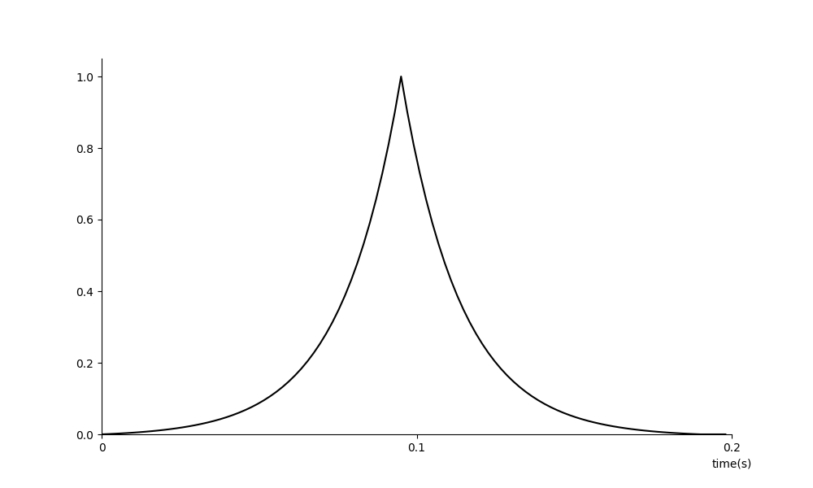
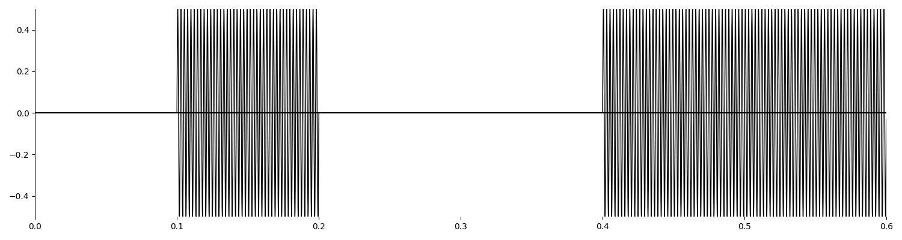
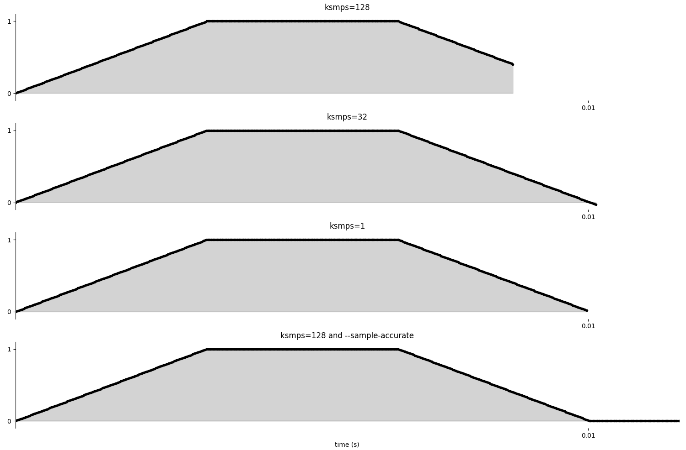

# 03 A. INITIALIZATION AND PERFORMANCE PASS

Not only for beginners, but also for experienced Csound users, many
problems result from the misunderstanding of the so-called i-rate and
k-rate. You want Csound to do something just once, but Csound does it
continuously. You want Csound to do something continuously, but Csound
does it just once. If you experience such a case, you will most probably
have confused i- and k-rate-variables.

The concept behind this is actually not complicated. But it is something
which is more implicitly mentioned when we think of a program flow,
whereas Csound wants to know it explicitely. So we tend to forget it
when we use Csound, and we do not notice that we ordered a stone to
become a wave, and a wave to become a stone. This chapter tries to
explicate very carefully the difference between stones and waves, and
how you can profit from them, after you understood and accepted both
qualities.

## Basic Distinction

We will explain at first the difference between _i-rate_ and _k-rate_.
Then we will look at some properties of k-rate signals,
and finally introduce the audio vector.

### Init Pass

Whenever a Csound instrument is called, all variables are set to initial
values. This is called the initialization pass.

There are certain variables, which stay in the state in which they have
been put by the init-pass. These variables start with an **i** if they
are local (= only considered inside an instrument), or with a **gi** if
they are global (= considered overall in the orchestra). This is a
simple example:

#### **_EXAMPLE 03A01_Init-pass.csd_**

```csound
<CsoundSynthesizer>
<CsInstruments>

giGlobal   =          1/2

instr 1
iLocal     =          1/4
           print      giGlobal, iLocal
endin

instr 2
iLocal     =          1/5
           print      giGlobal, iLocal
endin

</CsInstruments>
<CsScore>
i 1 0 0
i 2 0 0
</CsScore>
</CsoundSynthesizer>
;example by joachim heintz
```

The output should include these lines:

    SECTION 1:
    new alloc for instr 1:
    instr 1:  giGlobal = 0.500  iLocal = 0.250
    new alloc for instr 2:
    instr 2:  giGlobal = 0.500  iLocal = 0.200

As you see, the local variables _iLocal_ do have different meanings in
the context of their instrument, whereas _giGlobal_ is known everywhere
and in the same way. It is also worth mentioning that the performance
time of the instruments (p3) is zero. This makes sense, as the
instruments are called, but only the init-pass is performed.^[
You would not get any other result if you set p3 to 1 or any other
value, as nothing is done here except
initialization.]

### Performance Pass

After having assigned initial values to all variables, Csound starts the
actual performance. As music is a variation of values in time,^[
For the physical result which comes out of the loudspeakers or
headphones, the variation is the variation of air
pressure.] audio signals are producing values which vary in time.
In all digital audio,
the time unit is given by the sample rate, and one sample is the
smallest possible time atom. For a sample rate of 44100 Hz,^[
44100 samples per second] one sample comes up to the duration of
1/44100 = 0.0000227 seconds.

So, performance for an audio application means basically: calculate all
the samples which are finally being written to the output. You can
imagine this as the cooperation of a clock and a calculator. For each
sample, the clock ticks, and for each tick, the next sample is
calculated.

Most audio applications do not perform this calculation sample by
sample. It is much more efficient to collect some amount of samples in a
_block_ or _vector_, and calculate them all together. This means in
fact, to introduce another internal clock in your application; a clock
which ticks less frequently than the sample clock. For instance, if
(always assumed your sample rate is 44100 Hz) your block size consists
of 10 samples, your internal calculation time clock ticks every 1/4410
(0.000227) seconds. If your block size consists of 441 samples, the
clock ticks every 1/100 (0.01) seconds.

The following illustration shows an example for a block size of 10
samples. The samples are shown at the bottom line. Above are the control
ticks, one for each ten samples. The top two lines show the times for
both clocks in seconds. In the upmost line you see that the first
control cycle has been finished at 0.000227 seconds, the second one at
0.000454 seconds, and so on.^[These are by the way the times which
Csound reports if you ask for the control cycles.
The first control cycle in this example \(sr=44100, ksmps=10\)
would be reported as 0.00027 seconds, not as 0.00000 seconds.]

{width=80%}

The rate (frequency) of these ticks is called the control rate in
Csound. By historical reason,^[As Richard Boulanger explains,
in early Csound a line starting with *c* was a comment line.
So it was not possible to abbreviate control variables as cAnything
(http://csound.1045644.n5.nabble.com/OT-why-is-control-rate-called-kontrol-rate-td5720858.html\#a5720866).]
it is called _kontrol rate_ instead
of control rate, and abbreviated as _kr_ instead of cr. Each of the
calculation cycles is called a _k-cycle_. The block size or vector
size is given by the _ksmps_ parameter, which means: how many samples
(smps) are collected for one k-cycle.^[As the k-rate is directly
depending on sample rate (sr) and ksmps (kr = sr/ksmps),
it is probably the best style to specify sr and ksmps in the header,
but not kr.]

Let us see some code examples to illustrate these basic contexts.

### Implicit Incrementation

#### **_EXAMPLE 03A02_Perf-pass_incr.csd_**

```csound
<CsoundSynthesizer>
<CsInstruments>
sr = 44100
ksmps = 4410

instr 1
kCount    init      0; set kcount to 0 first
kCount    =         kCount + 1; increase at each k-pass
          printk    0, kCount; print the value
endin

</CsInstruments>
<CsScore>
i 1 0 1
</CsScore>
</CsoundSynthesizer>
;example by joachim heintz
```

Your output should contain the lines:

    i   1 time     0.10000:     1.00000
    i   1 time     0.20000:     2.00000
    i   1 time     0.30000:     3.00000
    i   1 time     0.40000:     4.00000
    i   1 time     0.50000:     5.00000
    i   1 time     0.60000:     6.00000
    i   1 time     0.70000:     7.00000
    i   1 time     0.80000:     8.00000
    i   1 time     0.90000:     9.00000
    i   1 time     1.00000:    10.00000

A counter (kCount) is set here to zero as initial value. Then, in each
control cycle, the counter is increased by one. What we see here, is the
typical behaviour of a loop. The loop has not been set explicitely, but
works implicitely because of the continuous recalculation of all
k-variables. So we can also speak about the k-cycles as an implicit (and
time-triggered) k-loop.^[This must not be confused with a \'real\'
k-loop where inside one single k-cycle a loop is performed.
See chapter 03C (section Loops) for examples.] Try changing the ksmps
value from 4410 to 8820 and to 2205 and observe the difference.

The next example reads the incrementation of _kCount_ as rising
frequency. The first instrument, called Rise, sets the k-rate frequency
_kFreq_ to the initial value of 100 Hz, and then adds 10 Hz in every new
k-cycle. As ksmps=441, one k-cycle takes 1/100 second to perform. So in
3 seconds, the frequency rises from 100 to 3100 Hz. At the last k-cycle,
the final frequency value is printed out.^[The value is 3110 instead of
3100 because it has already been incremented by 10.]
The second instrument, Partials, increments the counter by one for each
k-cycle, but only sets this as new frequency for every 100 steps.
So the frequency stays at 100Hz for one second, then at 200 Hz for one
second, and so on. As the resulting frequencies are in the ratio
1 : 2 : 3 ..., we hear partials based on a 100 Hz fundamental, from the
first partial up to the 31st.
The opcode printk2 prints out the frequency value whenever it has
changed.

#### **_EXAMPLE 03A03_Perf-pass_incr_listen.csd_**

```csound
<CsoundSynthesizer>
<CsOptions>
-o dac
</CsOptions>
<CsInstruments>
sr = 44100
ksmps = 441
0dbfs = 1
nchnls = 2

;build a table containing a sine wave
giSine     ftgen      0, 0, 2^10, 10, 1

instr Rise
kFreq      init       100
aSine      poscil     .2, kFreq, giSine
           outs       aSine, aSine
;increment frequency by 10 Hz for each k-cycle
kFreq      =          kFreq + 10
;print out the frequency for the last k-cycle
kLast      release
 if kLast == 1 then
           printk     0, kFreq
 endif
endin

instr Partials
;initialize kCount
kCount     init       100
;get new frequency if kCount equals 100, 200, ...
 if kCount % 100 == 0 then
kFreq      =          kCount
 endif
aSine      poscil     .2, kFreq, giSine
           outs       aSine, aSine
;increment kCount
kCount     =          kCount + 1
;print out kFreq whenever it has changed
           printk2    kFreq
endin
</CsInstruments>
<CsScore>
i "Rise" 0 3
i "Partials" 4 31
</CsScore>
</CsoundSynthesizer>
;example by joachim heintz
```

### Init versus Equals

A frequently occuring error is that instead of setting the k-variable
as _kCount init 0_, it is set as _kCount = 0_. The meaning of both
statements has one significant difference. _kCount init 0_ sets the
value for kCount to zero only in the init pass, without affecting it
during the performance pass. _kCount = 0_ sets the value for kCount to
zero again and again, in each control cycle. So the increment always
starts from the same point, and nothing really happens:

#### **_EXAMPLE 03A04_Perf-pass_no_incr.csd_**

```csound
<CsoundSynthesizer>
<CsInstruments>
sr = 44100
ksmps = 4410

instr 1
kcount    =         0; sets kcount to 0 at each k-cycle
kcount    =         kcount + 1; does not really increase ...
          printk    0, kcount; print the value
endin

</CsInstruments>
<CsScore>
i 1 0 1
</CsScore>
</CsoundSynthesizer>
;example by joachim heintz
```

Outputs:

     i   1 time     0.10000:     1.00000
     i   1 time     0.20000:     1.00000
     i   1 time     0.30000:     1.00000
     i   1 time     0.40000:     1.00000
     i   1 time     0.50000:     1.00000
     i   1 time     0.60000:     1.00000
     i   1 time     0.70000:     1.00000
     i   1 time     0.80000:     1.00000
     i   1 time     0.90000:     1.00000
     i   1 time     1.00000:     1.00000

### A Look at the Audio Vector

One k-cycle consists of [ksmps](https://csound.com/docs/manual/ksmps.html) audio samples.
The single samples are processed in a block, called audio vector.
If _ksmps=32_, for each audio signal 32 samples are processed in every k-cycle.

There are different opcodes to print out k-variables.^[See the manual page
for printk, printk2, printks, printf to know more about the differences.]
There is no opcode in Csound to print out the audio vector directly,
but we can use the _vaget_ opcode to see what is happening inside one
control cycle with the audio samples.

#### **_EXAMPLE 03A05_Audio_vector.csd_**

```csound
<CsoundSynthesizer>
<CsInstruments>
sr = 44100
ksmps = 5
0dbfs = 1

instr 1
aSine      poscil     1, 2205
kVec1      vaget      0, aSine
kVec2      vaget      1, aSine
kVec3      vaget      2, aSine
kVec4      vaget      3, aSine
kVec5      vaget      4, aSine
printks "kVec1 = %f, kVec2 = %f, kVec3 = %f, kVec4 = %f, kVec5 = %f\n",
        0, kVec1, kVec2, kVec3, kVec4, kVec5
endin
</CsInstruments>
<CsScore>
i 1 0 [1/2205]
</CsScore>
</CsoundSynthesizer>
;example by joachim heintz
```

The output shows these lines:

    kVec1 =  0.000000, kVec2 =  0.309017, kVec3 =  0.587785, kVec4 =
        0.809017, kVec5 =  0.951057
    kVec1 =  1.000000, kVec2 =  0.951057, kVec3 =  0.809017, kVec4 =
        0.587785, kVec5 =  0.309017
    kVec1 = -0.000000, kVec2 = -0.309017, kVec3 = -0.587785, kVec4 =
        -0.809017, kVec5 = -0.951057
    kVec1 = -1.000000, kVec2 = -0.951057, kVec3 = -0.809017, kVec4 =
        -0.587785, kVec5 = -0.309017

In this example, the number of audio samples in one k-cycle is set to
five by the statement _ksmps=5_. The first argument to vaget specifies
which sample of the block you get. For instance,

    kVec1      vaget      0, aSine

gets the first value of the audio vector and writes it into the variable
kVec1. For a frequency of 2205 Hz at a sample rate of 44100 Hz, you need
20 samples to write one complete cycle of the sine. So we call the
instrument for 1/2205 seconds, and we get 4 k-cycles. The printout shows
exactly one period of the sine wave.

At the end of this chapter we will show another and more advances method
to access the audio vector and modify its samples.

### A Summarizing Example

After having put so much attention to the different single aspects of
initialization, performance and audio vectors, the next example tries to
summarize and illustrate all the aspects in their practical mixture.

#### **_EXAMPLE 03A06_Init_perf_audio.csd_**

```csound
<CsoundSynthesizer>
<CsOptions>
-o dac
</CsOptions>
<CsInstruments>
sr = 44100
ksmps = 441
nchnls = 2
0dbfs = 1
instr 1
iAmp      =       p4 ;amplitude taken from the 4th parameter of the score line
iFreq     =       p5 ;frequency taken from the 5th parameter
; --- move from 0 to 1 in the duration of this instrument call (p3)
kPan      line      0, p3, 1
aNote     poscil  iAmp, iFreq ;create an audio signal
aL, aR    pan2    aNote, kPan ;let the signal move from left to right
          outs    aL, aR ;write it to the output
endin
</CsInstruments>
<CsScore>
i 1 0 3 0.2 443
</CsScore>
</CsoundSynthesizer>
;example by joachim heintz
```

As ksmps=441, each control cycle is 0.01 seconds long (441/44100). So
this happens when the instrument call is performed:

{width=80%}

## Applications and Concepts

We will look now at some applications and consequences of what has been showed.
We will see how we can use a k-variable at i-time.
Then we will at k-signals in an instrument which is called several times.
We will explain the concept of re-initialization and have a look at instruments:
in which order they are processed, how named instruments work,
and how we can use fractional instrument numbers.

### Accessing the Initialization Value of a k-Variable

It has been said that the init pass sets initial values to all
variables. It must be emphasized that this indeed concerns all
variables, not only the i-variables. It is only the matter that
i-variables are not affected by anything which happens later, in the
performance. But also k- and a-variables get their initial values.

As we saw, the init opcode is used to set initial values for k- or
a-variables explicitely. On the other hand, you can get the initial
value of a k-variable which has not been set explicitely,
by the _i()_ facility. This is a simple example:

#### **_EXAMPLE 03A07_Init-values_of_k-variables.csd_**

```csound
<CsoundSynthesizer>
<CsOptions>
-o dac
</CsOptions>
<CsInstruments>
instr 1
gkLine line 0, p3, 1
endin
instr 2
iInstr2LineValue = i(gkLine)
print iInstr2LineValue
endin
instr 3
iInstr3LineValue = i(gkLine)
print iInstr3LineValue
endin
</CsInstruments>
<CsScore>
i 1 0 5
i 2 2 0
i 3 4 0
</CsScore>
</CsoundSynthesizer>
;example by joachim heintz
```

Outputs:

    new alloc for instr 1:
    B  0.000 ..  2.000 T  2.000 TT  2.000 M:      0.0
    new alloc for instr 2:
    instr 2:  iInstr2LineValue = 0.400
    B  2.000 ..  4.000 T  4.000 TT  4.000 M:      0.0
    new alloc for instr 3:
    instr 3:  iInstr3LineValue = 0.800
    B  4.000 ..  5.000 T  5.000 TT  5.000 M:      0.0

Instrument 1 produces a rising k-signal, starting at zero and ending at
one, over a time of five seconds. The values of this line rise are
written to the global variable _gkLine_. After two seconds, instrument 2
is called, and examines the value of _gkLine_ at its init-pass
via **i(_gkLine_)**. The value at this time (0.4), is printed out at
init-time as _iInstr2LineValue_. The same happens for instrument 3,
which prints out **iInstr3LineValue = 0.800**, as it has been started at 4
seconds.

The _i()_ feature is particularily useful if you need to examine the value
of any control signal from a widget or from midi, at the time when an
instrument starts.

For getting the init value of an element in a k-time array, the syntax i(kArray,iIndex) must be used; for instance i(kArr,0) will get the first element of array kArr at init-time. More about this in the
section _Init Values of k-Arrays_ in the [Arrays](03-e-arrays.md) chapter of this book.

### k-Values and Initialization in Multiple Triggered Instruments

What happens on a k-variable if an instrument is called multiple times?
What is the initialization value of this variable on the first call, and
on the subsequent calls?

If this variable is not set explicitely, the init value in the first
call of an instrument is zero, as usual. But, for the next calls, the
k-variable is initialized to the value which was left when the previous
instance of the same instrument turned off.

The following example shows this behaviour. Instrument _Call_ simply
calls the instrument _Called_ once a second, and sends the number of
the call to it. Instrument _Called_ generates the variable kRndVal by
a random generator, and reports both:

- the value of kRndVal at initialization, and
- the value of kRndVal at performance time, i.e. the first control
  cycle.
  (After the first k-cycle, the instrument is turned off immediately.)

  **_EXAMPLE 03A08_k-inits_in_multiple_calls_1.csd_**

```csound
<CsoundSynthesizer>
<CsOptions>
-nm0
</CsOptions>
<CsInstruments>
ksmps = 32

 instr Call
kNumCall init 1
kTrig metro 1
if kTrig == 1 then
  event "i", "Called", 0, 1, kNumCall
  kNumCall += 1
endif
 endin

 instr Called
iNumCall = p4
kRndVal random 0, 10
prints "Initialization value of kRnd in call %d = %.3f\n",
       iNumCall, i(kRndVal)
printks "  New random value of kRnd generated in call %d = %.3f\n",
        0, iNumCall, kRndVal
turnoff
 endin

</CsInstruments>
<CsScore>
i "Call" 0 3
</CsScore>
</CsoundSynthesizer>
;example by joachim heintz
```

The output should show this:

    Initialization value of kRnd in call 1 = 0.000
      New random value of kRnd generated in call 1 = 8.829
    Initialization value of kRnd in call 2 = 8.829
      New random value of kRnd generated in call 2 = 2.913
    Initialization value of kRnd in call 3 = 2.913
      New random value of kRnd generated in call 3 = 9.257

The printout shows what was stated before: If there is no previous value
of a k-variable, this variable is initialized to zero. If there is a
previous value, it serves as initialization value.

Note that this is _exactly_ the same for User-Defined Opcodes! If you
call a UDO twice, it will have the current value of a k-Variable of the
first call as init-value of the second call, unless you initialize the
k-variable explicitely by an init statement.

The final example shows both possibilities, using explicit
initialization or not, and the resulting effect.

#### **_EXAMPLE 03A10_k-inits_in_multiple_calls_3.csd_**

```csound
<CsoundSynthesizer>
<CsOptions>
-nm0
</CsOptions>
<CsInstruments>
ksmps = 32

instr without_init
prints "instr without_init, call %d:\n", p4
kVal = 1
prints "  Value of kVal at initialization = %d\n", i(kVal)
printks "  Value of kVal at first k-cycle = %d\n", 0, kVal
kVal = 2
turnoff
endin

instr with_init
prints "instr with_init, call %d:\n", p4
kVal init 1
kVal = 1
prints "  Value of kVal at initialization = %d\n", i(kVal)
printks "  Value of kVal at first k-cycle = %d\n", 0, kVal
kVal = 2
turnoff
endin

</CsInstruments>
<CsScore>
i "without_init" 0 .1 1
i "without_init" + .1 2
i "with_init" 1 .1 1
i "with_init" + .1 2
</CsScore>
</CsoundSynthesizer>
;example by joachim heintz
```

This is the output:

    instr without_init, call 1:
      Value of kVal at initialization = 0
      Value of kVal at first k-cycle = 1
    instr without_init, call 2:
      Value of kVal at initialization = 2
      Value of kVal at first k-cycle = 1
    instr with_init, call 1:
      Value of kVal at initialization = 1
      Value of kVal at first k-cycle = 1
    instr with_init, call 2:
      Value of kVal at initialization = 1
      Value of kVal at first k-cycle = 1

Note that this characteristics of using _leftovers_ from previous
instances which may lead to undesired effects, does also occur for audio
variables. Similar to k-variables, an audio vector is initalized for the
first instance to zero, or to the value which is explcitely set by
an [init](http://csound.github.io/docs/manual/init.html) statement.
In case a previous instance can be re-used, its last state
will be the init state of the new instance.

The next example shows an undesired side effect in instrument 1. In the
third call (start=2), the previous values for the _a1_ audio vector will
be used, because this variable is not set explicitely. This means,
though, that 32 amplitudes are repeated in a frequency of sr/ksmps, in
this case 44100/32 = 1378.125 Hz. The same happens at start=4 with audio
variable _a2._ Instrument 2 initializes _a1_ and _a2_ in the cases they
need to be, so that the inadvertend tone disappears.

#### **_EXAMPLE 03A11_a_inits_in_multiple_calls.csd_**

```csound
<CsoundSynthesizer>
<CsOptions>
-odac
</CsOptions>
<CsInstruments>

sr = 44100
ksmps = 32 ;try 64 or other values
nchnls = 2
0dbfs = 1

instr 1 ;without explicit init
  i1 = p4
  if i1 == 0 then
  a1 poscil 0.5, 500
  endif
  if i1 == 1 then
  a2 poscil 0.5, 600
  endif
  outs a1, a2
endin

instr 2 ;with explicit init
  i1 = p4
  if i1 == 0 then
  a1 poscil 0.5, 500
  a2 init 0
  endif
  if i1 == 1 then
  a2 poscil 0.5, 600
  a1 init 0
  endif
  outs a1, a2
endin

</CsInstruments>
<CsScore>
i 1 0 .5 0
i . 1 . 0
i . 2 . 1
i . 3 . 1
i . 4 . 0
i . 5 . 0
i . 6 . 1
i . 7 . 1
b 9
i 2 0 .5 0
i . 1 . 0
i . 2 . 1
i . 3 . 1
i . 4 . 0
i . 5 . 0
i . 6 . 1
i . 7 . 1
</CsScore>
</CsoundSynthesizer>
;example by oeyvind brandtsegg and joachim heintz
```

### Reinitialization

As we saw above, an i-value is not affected by the performance loop. So
you cannot expect this to work as an incrementation:

#### **_EXAMPLE 03A12_Init_no_incr.csd_**

```csound
<CsoundSynthesizer>
<CsInstruments>
sr = 44100
ksmps = 4410

instr 1
iCount    init      0          ;set iCount to 0 first
iCount    =         iCount + 1 ;increase
          print     iCount     ;print the value
endin

</CsInstruments>
<CsScore>
i 1 0 1
</CsScore>
</CsoundSynthesizer>
;example by joachim heintz
```

The output is nothing but:

    instr 1:  iCount = 1.000

But you can advise Csound to repeat the initialization of an i-variable.
This is done with the [reinit](https://csound.com/docs/manual/reinit.html) opcode.
You must mark a section by a label (any name followed by a colon).
Then the reinit statement will cause the i-variable to refresh.
Use rireturn to end the reinit section.

#### **_EXAMPLE 03A13_Re-init.csd_**

```csound
<CsoundSynthesizer>
<CsInstruments>
sr = 44100
ksmps = 4410

instr 1
iCount    init      0          ; set icount to 0 first
          reinit    new        ; reinit the section each k-pass
new:
iCount    =         iCount + 1 ; increase
          print     iCount     ; print the value
          rireturn
endin

</CsInstruments>
<CsScore>
i 1 0 1
</CsScore>
</CsoundSynthesizer>
;example by joachim heintz
```

Outputs:

    instr 1:  iCount = 1.000
    instr 1:  iCount = 2.000
    instr 1:  iCount = 3.000
    instr 1:  iCount = 4.000
    instr 1:  iCount = 5.000
    instr 1:  iCount = 6.000
    instr 1:  iCount = 7.000
    instr 1:  iCount = 8.000
    instr 1:  iCount = 9.000
    instr 1:  iCount = 10.000
    instr 1:  iCount = 11.000

What happens here more in detail, is the following. In the actual
init-pass, _iCount_ is set to zero via _iCount init 0_. Still in this
init-pass, it is incremented by one (iCount = iCount+1) and the value is
printed out as _iCount = 1.000_. Now starts the first performance pass.
The statement _reinit new_ advices Csound to initialise again the
section labeled as _new_. So the statement _iCount = iCount + 1_ is
executed again. As the current value of _iCount_ at this time is 1, the
result is 2. So the printout at this first performance pass is _iCount =
2.000_. The same happens in the next nine performance cycles, so the
final count is 11.

### Order of Calculation

In this context, it can be very important to observe the order in which
the instruments of a Csound orchestra are evaluated. This order is
determined by the instrument numbers. So, if you want to use during the
same performance pass a value in instrument 10 which is generated by
another instrument, you must not give this instrument the number 11 or
higher. In the following example, first instrument 10 uses a value of
instrument 1, then a value of instrument 100.

#### **_EXAMPLE 03A14_Order_of_calc.csd_**

```csound
<CsoundSynthesizer>
<CsInstruments>
sr = 44100
ksmps = 4410

instr 1
gkcount   init      0 ;set gkcount to 0 first
gkcount   =         gkcount + 1 ;increase
endin

instr 10
          printk    0, gkcount ;print the value
endin

instr 100
gkcount   init      0 ;set gkcount to 0 first
gkcount   =         gkcount + 1 ;increase
endin


</CsInstruments>
<CsScore>
;first i1 and i10
i 1 0 1
i 10 0 1
;then i100 and i10
i 100 1 1
i 10 1 1
</CsScore>
</CsoundSynthesizer>
;Example by Joachim Heintz
```

The output shows the difference:

    new alloc for instr 1:
    new alloc for instr 10:
     i  10 time     0.10000:     1.00000
     i  10 time     0.20000:     2.00000
     i  10 time     0.30000:     3.00000
     i  10 time     0.40000:     4.00000
     i  10 time     0.50000:     5.00000
     i  10 time     0.60000:     6.00000
     i  10 time     0.70000:     7.00000
     i  10 time     0.80000:     8.00000
     i  10 time     0.90000:     9.00000
     i  10 time     1.00000:    10.00000
    B  0.000 ..  1.000 T  1.000 TT  1.000 M:      0.0
    new alloc for instr 100:
     i  10 time     1.10000:     0.00000
     i  10 time     1.20000:     1.00000
     i  10 time     1.30000:     2.00000
     i  10 time     1.40000:     3.00000
     i  10 time     1.50000:     4.00000
     i  10 time     1.60000:     5.00000
     i  10 time     1.70000:     6.00000
     i  10 time     1.80000:     7.00000
     i  10 time     1.90000:     8.00000
     i  10 time     2.00000:     9.00000
    B  1.000 ..  2.000 T  2.000 TT  2.000 M:      0.0

Instrument 10 can use the values which instrument 1 has produced in the
same control cycle, but it can only refer to values of instrument 100
which are produced in the previous control cycle. By this reason, the
printout shows values which are one less in the latter case.

### Named Instruments

It has been said in chapter 02B (Quick Start) that instead of a number
you can also use a name for an instrument. This is mostly preferable,
because you can give meaningful names, leading to a better readable
code. But what about the order of calculation in named instruments?

The answer is simple: Csound calculates them in the same order as they
are written in the orchestra. So if your instrument collection is like
this ...

#### **_EXAMPLE 03A15_Order_of_calc_named.csd_**

```csound
<CsoundSynthesizer>
<CsOptions>
-nd
</CsOptions>
<CsInstruments>

instr Grain_machine
prints " Grain_machine\n"
endin

instr Fantastic_FM
prints "  Fantastic_FM\n"
endin

instr Random_Filter
prints "   Random_Filter\n"
endin

instr Final_Reverb
prints "    Final_Reverb\n"
endin

</CsInstruments>
<CsScore>
i "Final_Reverb" 0 1
i "Random_Filter" 0 1
i "Grain_machine" 0 1
i "Fantastic_FM" 0 1
</CsScore>
</CsoundSynthesizer>
;example by joachim heintz
```

... you can count on this output:

    new alloc for instr Grain_machine:
     Grain_machine
    new alloc for instr Fantastic_FM:
      Fantastic_FM
    new alloc for instr Random_Filter:
       Random_Filter
    new alloc for instr Final_Reverb:
        Final_Reverb

Note that the score has not the same order. But internally, Csound
transforms all names to numbers, in the order they are written from top
to bottom. The numbers are reported on the top of Csound's
output:^[If you want to know the number in an instrument,
use the nstrnum opcode.]

    instr Grain_machine uses instrument number 1
    instr Fantastic_FM uses instrument number 2
    instr Random_Filter uses instrument number 3
    instr Final_Reverb uses instrument number 4

### Instruments with Fractional Numbers

Sometimes we want to call severall instances of an instrument, but we want to treat each instance different. For this, Csound provides the possibility of fractional note numbers. In the following example, instr 1 shows a basic example, turning on and off certain instances in the score. (Turning off is done here by negative note numbers.) Instr _Play_ is a bit more complicated in using the instance number as index to a global array. Instr _Trigger_ calls this instrument several times with fractional numbers. It also shows how we can use fractional numbers for named instruments: We first get the number which Csound appointed to this instrument (using the [nstrnum](https://csound.com/docs/manual/nstrnum.html) opcode), and then add the fractional part (0, 0.1, 0.2 etc) to it.

#### **_EXAMPLE 03A16_FractionalInstrNums.csd_**

```csound
<CsoundSynthesizer>
<CsOptions>
-odac -m128
</CsOptions>
<CsInstruments>
sr = 44100
nchnls = 2
0dbfs = 1
ksmps = 32
seed 0

giArr[] fillarray 60, 68, 67, 66, 65, 64, 63

instr 1
 iMidiNote = p4
 iFreq mtof iMidiNote
 aPluck pluck .1, iFreq, iFreq, 0, 1
 aOut linenr aPluck, 0, 1, .01
 out aOut, aOut
endin

instr Trigger
 index = 0
 while index < lenarray(giArr) do
  iInstrNum = nstrnum("Play")+index/10
  schedule(iInstrNum,index+random:i(0,.5),5)
  index += 1
 od
endin

instr Play
 iIndx = frac(p1)*10 //index is fractional part of instr number
 iFreq = mtof:i(giArr[round(iIndx)])
 aPluck pluck .1, iFreq, iFreq, 0, 1
 aOut linenr aPluck, 0, 1, .01
 out aOut, aOut
endin

</CsInstruments>
<CsScore>
//traditional score
t 0 90
i 1.0 0 -1 60
i 1.1 1 -1 65
i 1.2 2 -1 55
i 1.3 3 -1 70
i 1.4 4 -1 50
i 1.5 5 -1 75

i -1.4 7 1 0
i -1.1 8 1 0
i -1.5 9 1 0
i -1.0 10 1 0
i -1.3 11 1 0
i -1.2 12 1 0

//event generating instrument
i "Trigger" 15 10
</CsScore>
</CsoundSynthesizer>
;example by joachim heintz
```

## Tips for Pratical Use

The last part of this chapter focusses on some situations which are known as stumbling blocks by many users. We will start with a discussion about _i-time_ and _k-rate_ opcodes, and when to use either of them. In between we will look at some possible issues with the k-rate ticks as internal time units. We will have another look at the audio vector, before we try to throw some light in the complicated matter of hidden initializaion. Finally, we will give some general suggestions when to choose _i_-rate or _k_-rate opcodes.

### About _i-time_ and _k-rate_ Opcodes

It is often confusing for the beginner that there are some opcodes which
only work at _i-time_ or _i-rate_, and others which only work
at _k-rate_ or _k-time_. For instance, if the user wants to print the
value of any variable, (s)he thinks: _OK - print it out._ But Csound
replies: _Please, tell me first if you want to print an i- or a
k-variable_.^[See the following section 03B about the variable types
for more on this subject.]

The [print](http://csound.com/docs/manual/print.html) opcode
just prints variables which are updated at each initialization
pass (_i-time_ or _i-rate_). If you want to print a variable which
is updated at each control cycle (_k-rate_ or _k-time_), you need
its counterpart [printk](http://csound.com/docs/manual/printk.html). (As
the performance pass is usually updated some thousands times per second,
you have an additional parameter in printk, telling Csound how often you
want to print out the k-values.)

So, some opcodes are just for i-rate variables,
like [filelen](http://csound.com/docs/manual/filelen.html) or
[ftgen](http://csound.com/docs/manual/ftgen.html). Others
are just for k-rate variables
like [metro](http://csound.com/docs/manual/metro.html) or
[max_k](http://csound.com/docs/manual/max_k.html). Many
opcodes have variants for either i-rate-variables or k-rate-variables,
like [printf_i](http://csound.com/docs/manual/printf.html)
and [printf](http://csound.com/docs/manual/printf.html),
[sprintf](http://csound.com/docs/manual/sprintf.html) and
[sprintfk](http://csound.com/docs/manual/sprintf.html),
[strindex](http://csound.com/docs/manual/strindex.html) and
[strindexk](http://csound.com/docs/manual/strindexk.html).

Most of the Csound opcodes are able to work either at i-time or at
k-time or at audio-rate, but you have to think carefully what you need,
as the behaviour will be very different if you choose the i-, k- or
a-variante of an opcode. For example,
the [random](http://csound.com/docs/manual/random.html) opcode
can work at all three rates:

    ires      random    imin, imax : works at "i-time"
    kres      random    kmin, kmax : works at "k-rate"
    ares      random    kmin, kmax : works at "audio-rate"

If you use the i-rate random generator, you will get one value for each
note. For instance, if you want to have a different pitch for each note
you are generating, you will use this one.

If you use the k-rate random generator, you will get one new value on
every control cycle. If your sample rate is 44100 and your ksmps=10, you
will get 4410 new values per second! If you take this as pitch value for
a note, you will hear nothing but a noisy jumping. If you want to have a
moving pitch, you can use the
[randomi](http://csound.com/docs/manual/randomi.html) variant
of the k-rate random generator, which can reduce the number of
new values per second, and interpolate between them.

If you use the a-rate random generator, you will get as many new values
per second as your sample rate is. If you use it in the range of your 0
dB amplitude, you produce white noise.

#### **_EXAMPLE 03A17_Random_at_ika.csd_**

```csound
<CsoundSynthesizer>
<CsOptions>
-odac
</CsOptions>
<CsInstruments>
sr = 44100
ksmps = 32
0dbfs = 1
nchnls = 2

          seed      0 ;each time different seed
giSine    ftgen     0, 0, 2^10, 10, 1 ;sine table

instr 1 ;i-rate random
iPch      random    300, 600
aAmp      linseg    .5, p3, 0
aSine     poscil    aAmp, iPch, giSine
          outs      aSine, aSine
endin

instr 2 ;k-rate random: noisy
kPch      random    300, 600
aAmp      linseg    .5, p3, 0
aSine     poscil    aAmp, kPch, giSine
          outs      aSine, aSine
endin

instr 3 ;k-rate random with interpolation: sliding pitch
kPch      randomi   300, 600, 3
aAmp      linseg    .5, p3, 0
aSine     poscil    aAmp, kPch, giSine
          outs      aSine, aSine
endin

instr 4 ;a-rate random: white noise
aNoise    random    -.1, .1
          outs      aNoise, aNoise
endin

</CsInstruments>
<CsScore>
i 1 0   .5
i 1 .25 .5
i 1 .5  .5
i 1 .75 .5
i 2 2   1
i 3 4   2
i 3 5   2
i 3 6   2
i 4 9   1
</CsScore>
</CsoundSynthesizer>
;example by joachim heintz
```

### Possible Problems with k-Rate Tick Size

It has been said that usually the k-rate clock ticks much slower than
the sample (a-rate) clock. For a common size of ksmps=32, one k-value
remains the same for 32 samples. This can lead to problems, for instance
if you use k-rate envelopes. Let us assume that you want to produce a
very short fade-in of 3 milliseconds, and you do it with the following
line of code:

    kFadeIn linseg 0, .003, 1

Your envelope will look like this:



Such a _staircase-envelope_ is what you hear in the next example as
zipper noise. The transeg opcode produces a non-linear envelope with a
sharp peak:



The rise and the decay are each 1/10 seconds long. If this envelope is
produced at k-rate with a blocksize of 128 (instr 1), the noise is
clearly audible. Try changing ksmps to 64, 32 or 16 and compare the
amount of zipper noise. — Instrument 2 uses an envelope at audio-rate
instead. Regardless the blocksize, each sample is calculated seperately,
so the envelope will always be smooth. — Instrument 3 shows a remedy for situations in which a k-rate envelope cannot be avoided: the [a()](https://csound.com/docs/manual/opa.html) will convert the k-signal to audio-rate by interpolation thus smoothing the envelope.

#### **_EXAMPLE 03A18_Zipper.csd_**

```csound
<CsoundSynthesizer>
<CsOptions>
-o dac
</CsOptions>
<CsInstruments>
sr = 44100
;--- increase or decrease to hear the difference more or less evident
ksmps = 128
nchnls = 2
0dbfs = 1

instr 1 ;envelope at k-time
aSine     poscil    .5, 800
kEnv      transeg   0, .1, 5, 1, .1, -5, 0
aOut      =         aSine * kEnv
          outs      aOut, aOut
endin

instr 2 ;envelope at a-time
aSine     poscil    .5, 800
aEnv      transeg   0, .1, 5, 1, .1, -5, 0
aOut      =         aSine * aEnv
          outs      aOut, aOut
endin

instr 3 ;envelope at k-time with a-time interpolation
aSine     poscil    .5, 800
kEnv      transeg   0, .1, 5, 1, .1, -5, 0
aOut      =         aSine * a(kEnv)
          outs      aOut, aOut
endin

</CsInstruments>
<CsScore>
r 3 ;repeat the following line 3 times
i 1 0 1
s ;end of section
r 3
i 2 0 1
s
r 3
i 3 0 1
</CsScore>
</CsoundSynthesizer>
;example by joachim heintz
```

### Time Impossible

There are two internal clocks in Csound. The sample rate (sr) determines
the audio-rate, whereas the control rate (kr) determines the rate, in
which a new control cycle can be started and a new block of samples can
be performed. In general, Csound can not start any event in between two
control cycles, nor end.

The next example chooses an extreme small control rate (only 10 k-cycles
per second) to illustrate this.

#### **_EXAMPLE 03A19_Time_Impossible.csd_**

```csound
<CsoundSynthesizer>
<CsOptions>
-o test.wav -d
</CsOptions>
<CsInstruments>
sr = 44100
ksmps = 4410
nchnls = 1
0dbfs = 1

  instr 1
aPink poscil .5, 430
out aPink
  endin
</CsInstruments>
<CsScore>
i 1 0.05 0.1
i 1 0.4 0.15
</CsScore>
</CsoundSynthesizer>
;example by joachim heintz
```

The first call advices instrument 1 to start performance at time 0.05.
But this is impossible as it lies between two control cycles. The second
call starts at a possible time, but the duration of 0.15 again does not
coincident with the control rate. So the result starts the first call at
time 0.1 and extends the second call to 0.2 seconds:



With Csound6, the possibilities of these _in between_ are enlarged via
the _--sample-accurate_ option. The next image shows how a 0.01 second
envelope which is generated by the code

    a1 init  1
    a2 linen a1, p3/3, p3, p3/3
       out   a2

(and a call of 0.01 seconds at sr=44100) shows up in the following
cases:

1.  ksmps=128
2.  ksmps=32
3.  ksmps=1
4.  ksmps=128 and _--sample-accurate_ enabled



This is the effect:

1.  At ksmps=128, the last section of the envelope is missing. The
    reason is that, at sr=44100 Hz, 0.01 seconds contain 441 samples.
    441 samples divided by the block size (ksmps) of 128 samples yield
    to 3.4453125 blocks. This is rounded to 3. So only 3 \* 128 = 384
    Samples are performed. As you see, the envelope itself is calculated
    correctly in its shape. It _would_ end exactly at 0.01 seconds ..
    but it does not, because the ksmps block ends too early. So this
    envelope might introduce a click at the end of this note.
2.  At ksmps=32, the number of samples (441) divided by ksmps yield to a
    value of 13.78125. This is rounded to 14, so the rendered audio is
    slightly longer than 0.01 seconds (448 samples).
3.  At ksmps=1, the envelope is as expected.
4.  At ksmps=128 and \--sample-accurate enabled, the envelope is
    correct, too. Note that the section is now 4\*128=512 samples long,
    but the envelope is more accurate than at ksmps=32.

So, in case you experience clicks at very short envelopes although you
use a-rate envelopes, it might be necessary to set either ksmps=1, or to
enable the \--sample-accurate option.

### Yet another Look at the Audio Vector

In Csound 6 it is actually possible to access each sample of the audio
vector directly, without setting ksmps=1. This feature, however,
requires some knowledge about arrays and loops, so beginners should skip
this paragraph.

The direct access uses the a\...\[\] syntax which is common in most
programming languages for arrays or lists. As an audio vector is of
ksmps length, we must iterate in each k-cycle over it. By this, we can
both, get and modify the values of the single samples directly.
Moreover, we can use control structures which are usually k-rate only
also at a-rate, for instance any condition depending on the value of a
single sample.

The next example demonstrates three different usages of the
sample-by-sample processing. In the _SimpleTest_ instrument, every
single sample is multiplied by a value (1, 3 and -1). Then the result is
added to the previous sample value. This leads to amplification for
iFac=3 and to silence for iFac=-1 because in this case every sample
cancels itself. In the _PrintSampleIf_ instrument, each sample which
is between 0.99 and 1.00 is printed to the console.
Also in the _PlaySampleIf_ instrument an if-condition is applied on each sample,
but here not for printing rather than playing out only the samples
whichs values are between 0 and 1/10000. They are then multiplied by
10000 so that not only rhythm is irregular but also volume.

#### **_EXAMPLE 03A20_Sample_by_sample_processing.csd_**

```csound
<CsoundSynthesizer>
<CsOptions>
-odac -m128
</CsOptions>
<CsInstruments>
sr = 44100
ksmps = 32
nchnls = 2
0dbfs = 1


instr SimpleTest

 iFac = p4 ;multiplier for each audio sample

 aSinus poscil 0.1, 500

 kIndx = 0
 while kIndx < ksmps do
  aSinus[kIndx] = aSinus[kIndx] * iFac + aSinus[kIndx]
  kIndx += 1
 od

 out aSinus, aSinus

endin

instr PrintSampleIf

 aRnd rnd31 1, 0, 1

 kBlkCnt init 0
 kSmpCnt init 0

 kIndx = 0
 while kIndx < ksmps do
  if aRnd[kIndx] > 0.99 then
   printf "Block = %2d, Sample = %4d, Value = %f\n",
          kSmpCnt, kBlkCnt, kSmpCnt, aRnd[kIndx]
  endif
  kIndx += 1
  kSmpCnt += 1
 od

 kBlkCnt += 1

endin

instr PlaySampleIf

 aRnd rnd31 1, 0, 1
 aOut init 0

 kBlkCnt init 0
 kSmpCnt init 0

 kIndx = 0
 while kIndx < ksmps do
  if aRnd[kIndx] > 0 && aRnd[kIndx] < 1/10000 then
   aOut[kIndx] = aRnd[kIndx] * 10000
  else
   aOut[kIndx] = 0
  endif
  kIndx += 1
 od

 out aOut, aOut

endin


</CsInstruments>
<CsScore>
i "SimpleTest" 0 1 1
i "SimpleTest" 2 1 3
i "SimpleTest" 4 1 -1
i "PrintSampleIf" 6 .033
i "PlaySampleIf" 8 10
</CsScore>
</CsoundSynthesizer>
;example by joachim heintz
```

The output should contain these lines, generated by
the _PrintSampleIf_ instrument, showing that in block 40 there were two
subsequent samples which fell under the condition:

    Block =  2, Sample =   86, Value = 0.998916
    Block =  7, Sample =  244, Value = 0.998233
    Block = 19, Sample =  638, Value = 0.995197
    Block = 27, Sample =  883, Value = 0.990801
    Block = 34, Sample = 1106, Value = 0.997471
    Block = 40, Sample = 1308, Value = 1.000000
    Block = 40, Sample = 1309, Value = 0.998184
    Block = 43, Sample = 1382, Value = 0.994353

At the end of chapter [03G](03-g-user-defined-opcodes.md) an example is shown for a more practical use
of sample-by-sample processing in Csound: to implement a digital filter
as user defined opcode.

### Hidden Initialization of k- and S-Variables

Any k-variable can be explicitly initialized by the _init_ opcode, as
has been shown above. But internally any variable, it be control rate
(k), audio rate (a) or string (S), has an initial value. As this
initialization can be hidden from the user, it can lead to unexpexted
behaviour.

#### Explicit and implicit initialization

The first case is easy to understand, although some results may be
unexpected. Any k-variable which is not explicitly initialized is set to
zero as initial value.

#### **_EXAMPLE 03A21_Init_explcit_implicit.csd_**

```csound
<CsoundSynthesizer>
<CsOptions>
</CsOptions>
<CsInstruments>

sr = 44100
ksmps = 32
nchnls = 2
0dbfs = 1

instr 1

 ;explicit initialization
 k_Exp init 10
 S_Exp init "goodbye"

 ;implicit initialization
 k_Imp linseg 10, 1, 0
 S_Imp strcpyk "world"

 ;print out at init-time
 prints "k_Exp -> %d\n", k_Exp
 printf_i "S_Exp -> %s\n", 1, S_Exp
 prints "k_Imp -> %d\n", k_Imp
 printf_i "S_Imp -> %s\n", 1, S_Imp

endin

</CsInstruments>
<CsScore>
i 1 0 1
</CsScore>
</CsoundSynthesizer>
;example by joachim heintz
```

This is the console output:

    k_Exp -> 10
    S_Exp -> goodbye
    k_Imp -> 0
    S_Imp -> world

The implicit output may be of some surprise.
The variable _k_Imp_ is _not_ initilalized to 10,
although 10 will be the first value during performance.
And _S_Imp_ carries the _world_ already at
initialization although the opcode name _strcpy**k**_ may suggest
something else. But as the manual page states: _strcpyk does the
assignment both at initialization and performance time._

#### Order of initialization statements

What happens if there are two init statements, following each other?
Usually the second one overwrites the first. But if a k-value is
explicitely set via the _init_ opcode, the implicit initialization will
not take place.

#### **_EXAMPLE 03A22_Init_overwrite.csd_**

```csound
<CsoundSynthesizer>
<CsOptions>
-nm0
</CsOptions>
<CsInstruments>

sr = 44100
ksmps = 32
nchnls = 2
0dbfs = 1

instr 1

 ;k-variables
 k_var init 20
 k_var linseg 10, 1, 0

 ;string variables
 S_var init "goodbye"
 S_var strcpyk "world"

 ;print out at init-time
 prints "k_var -> %d\n", k_var
 printf_i "S_var -> %s\n", 1, S_var

endin

</CsInstruments>
<CsScore>
i 1 0 1
</CsScore>
</CsoundSynthesizer>
;example by joachim heintz
```

The output is:

    k_var -> 20
    S_var -> world

Both pairs of lines in the code look similar, but do something quite
different. For _k_var_ the line `k_var linseg 10, 1, 0` will not
initialize _k_var_ to zero, as this happens only if no init value is
assigned. The line `S_var strcpyk "world"` instead does an explicit
initialization, and this initialization will overwrite the preceding
one. If the lines were swapped, the result would be _goodbye_ rather
than _world_.

#### Hidden initialization in k-rate if-clause

If-clauses can be either i-rate or k-rate. A k-rate if-clause
initializes nevertheless. Reading the next example may suggest that the
variable _String_ is only initalized to \"yes\", because the
if-condition will never become true. But regardless it is true or false,
any k-rate if-clause initializes its expressions,
in this case the _String_ variable.

#### **_EXAMPLE 03A23_Init_hidden_in_if.csd_**

```csound
<CsoundSynthesizer>
<CsOptions>
-m128
</CsOptions>
<CsInstruments>
sr = 44100
ksmps = 32
nchnls = 2
0dbfs = 1

instr 1

 ;a string to be copied at init- and performance-time
 String strcpyk "yes!\n"

 ;print it at init-time
 printf_i "INIT 1: %s", 1, String

 ;a copy assignment that will never become true during performance
 kBla = 0
 if kBla == 1 then
  String strcpyk "no!\n"
 endif

 ;nevertheless the string variable is initialized by it
 printf_i "INIT 2: %s", 1, String

 ;during performance only "yes!" remains
 printf "PERF %d: %s", timeinstk(), timeinstk(), String

 ;turn off after three k-cycles
 if timeinstk() == 3 then
  turnoff
 endif

endin

</CsInstruments>
<CsScore>
i 1 0 1
</CsScore>
</CsoundSynthesizer>
;example by joachim heintz
```

Returns:

    INIT 1: yes!
    INIT 2: no!
    PERF 1: yes!
    PERF 2: yes!
    PERF 3: yes!

If you want to skip the initialization at this point, you can use an
_igoto_ statement:

     if kBla == 1 then
      igoto skip
      String strcpyk "no!\n"
      skip:
     endif

#### Hidden initialization via UDOs

A user may expect that a UDO will behave identical to a csound native
opcode, but in terms of implicit initialization it is not the case. In
the following example, we may expect that instrument 2 has the same
output as instrument 1.

#### **_EXAMPLE 03A24_Init_hidden_in_udo.csd_**

```csound
<CsoundSynthesizer>
<CsOptions>
-m128
</CsOptions>
<CsInstruments>

sr = 44100
ksmps = 32
nchnls = 2
0dbfs = 1

  opcode RndInt, k, kk
kMin, kMax xin
kRnd random kMin, kMax+.999999
kRnd = int(kRnd)
xout kRnd
  endop

instr 1 ;opcode

 kBla init 10
 kBla random 1, 2
 prints "instr 1: kBla initialized to %d\n", i(kBla)
 turnoff

endin

instr 2 ;udo has different effect at i-time

 kBla init 10
 kBla RndInt 1, 2
 prints "instr 2: kBla initialized to %d\n", i(kBla)
 turnoff

endin

instr 3 ;but the functional syntax makes it different

 kBla init 10
 kBla = RndInt(1, 2)
 prints "instr 3: kBla initialized to %d\n", i(kBla)
 turnoff

endin

</CsInstruments>
<CsScore>
i 1 0 .1
i 2 + .
i 3 + .
</CsScore>
</CsoundSynthesizer>
;example by joachim heintz
```

But the output is:

    instr 1: kBla initialized to 10
    instr 2: kBla initialized to 0
    instr 3: kBla initialized to 10

The reason that instrument 2 does implicit initialization of _kBla_ is
written in the manual page for xin / xout: _These opcodes actually run
only at i-time._ In this case, _kBla_ is initialized to zero, because
the *kRnd *variable inside the UDO is implicitly zero at init-time.

Instrument 3, on the other hand, uses the **=** operator. It works as
other native opcodes: if a k-variable has an explicit init value, it
does not initialize again.

The examples about hidden (implicit) initialization may look somehow
sophisticated and far from normal usage. But this is not the case. As
users we may think: \"I perform a line from 10 to 0 in 1 second, and i
write this in the variable kLine. So i(kLine) is 10.\" It is not, and if
you send this value at init-time to another instrument, your program
will give wrong output.

### When to Use i- or k- Rate

When you code on your Csound instrument, you may sometimes wonder
whether you shall use an i-rate or a k-rate opcode. From what is said,
the general answer is clear: Use i-rate if something has to be done only
once, or in a somehow punctual manner. Use k-rate if something has to be
done continuously, or if you must regard what happens during the
performance.
