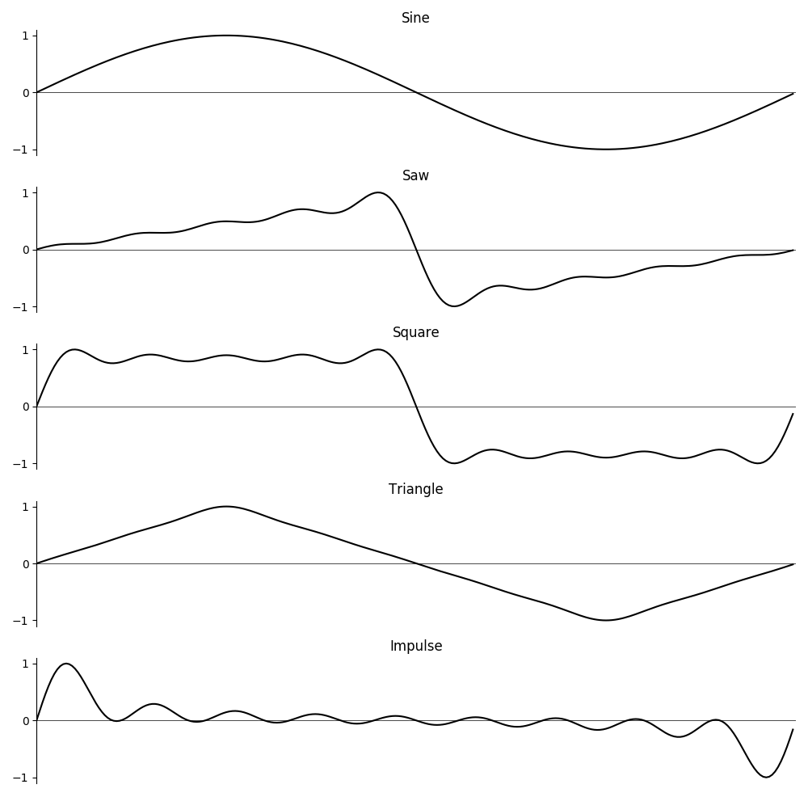
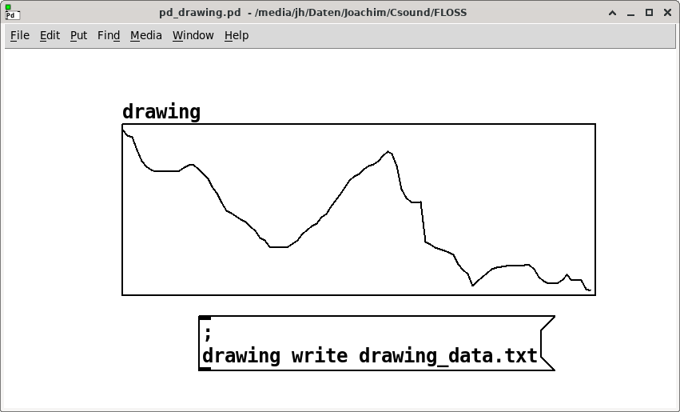
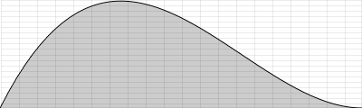
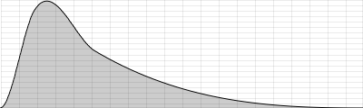
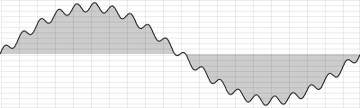
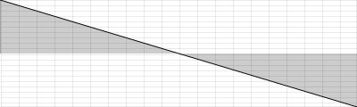
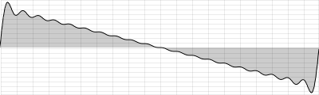

# 03 D. FUNCTION TABLES

_Note: This chapter was written before arrays had been introduced into
Csound. Now the usage of arrays is in some situations preferable to
using function tables. Have a look in chapter [03 E](03-e-arrays.md) to see how you can use arrays._<br>

A function table is essentially the same as what other audio programming
languages might call a buffer, a table, a list or an array. It is a
place where data can be stored in an ordered way. Each function table
has a **size**: how much data (in Csound, just numbers) it can store.
Each value in the table can be accessed by an **index**, counting from 0
to size-1. For instance, if you have a function table with a size of 7,
and the numbers [1.1, 2.2, 3.3, 5.5, 8.8, 13.13, 21.21] in
it, this is the relation of value and index:

| VALUE | INDEX |
| ----- | ----- |
| 1.1   | 0     |
| 2.2   | 1     |
| 3.3   | 2     |
| 5.5   | 3     |
| 8.8   | 4     |
| 13.13 | 5     |
| 21.21 | 6     |

So, if you want to retrieve the value 13.13, you must point to the value
stored under index 5.

The use of function tables is manifold. A function table can contain
pitch values to which you may refer using the input of a MIDI keyboard.
A function table can contain a model of a waveform which is read
periodically by an oscillator. You can record live audio input in a
function table, and then play it back. There are many more applications,
all using the fast access (because function tables are stored in RAM)
and flexible use of function tables.

## How to Generate a Function Table

Each function table must be created **before** it can be used.^[
Nevertheless function tables can be created at any time during
the Csound performance, for instance via `event "f" ...`] Even if
you want to write values later, you must first create an empty table,
because you must initially reserve some space in memory for it.

Each creation of a function table in Csound is performed by one of
the **GEN Routines**. Each GEN Routine generates a function table in a
particular way: [GEN01](http://www.csound.com/docs/manual/GEN01.html)
transfers audio samples from a soundfile into a table,
[GEN02](http://www.csound.com/docs/manual/GEN02.html) stores values we
define explicitly one by one,
[GEN10](http://www.csound.com/docs/manual/GEN10.html) calculates a
waveform using user-defined weightings of harmonically related
sinusoids, [GEN20](http://www.csound.com/docs/manual/GEN20.html) generates
window functions typically used for granular synthesis, and so on.
There is a good [overview](http://www.csound.com/docs/manual/ScoreGenRef.html) in
the [Csound Manual](http://www.csound.com/docs/manual/index.html) of all
existing GEN Routines. Here we will explain their general use and
provide some simple examples using commonly used GEN routines.

### GEN02 and General Parameters for GEN Routines

Let\'s start with our example described above and write the 7 numbers
into a function table with 7 storage locations. For this task use of
a [GEN02](http://www.csound.com/docs/manual/GEN02.html) function table is
required. A short description of GEN02
from the manual reads as follows:

    f # time size 2 v1 v2 v3 ...

This is the traditional way of creating a function table by use of an
\"**f statement**\" or an \"**f score event**\" (in a manner similar to
the use of "i score events" to call instrument instances). The input
parameters after the **f** are as follows:

- **\#**: a number (as positive integer) for this function table;
- **_time_**: at what time, in relation to the passage of the score, the
  function table is created (usually 0: from the beginning);
- **_size_**: the size of the function table. A little care is required:
  in the early days of Csound only power-of-two sizes were possible
  for function tables (2, 4, 8, 16, \...); nowadays almost all GEN
  Routines accepts other sizes, but these non-power-of-two sizes
  must be declared as negative numbers!^[At least this is still the
  safest method to declare a non-power-of-two size for the table,
  although for many GEN routines also positive numbers work.]
- **_2_**: the number of the GEN Routine which is used to generate the
  table, and here is another important point which must be borne in
  mind: **by default, Csound normalizes the table values.** This means
  that the maximum is scaled to +1 if positive, and to -1 if negative.
  All other values in the table are then scaled by the same factor
  that was required to scale the maximum to +1 or -1.
  To **prevent** Csound from normalizing, a **negative** number can be given as
  GEN number (in this example, the GEN routine number will be given as -2
  instead of 2).
- **_v1 v2 v3 ..._**: the values which are written into the function
  table.

The example below demonstrates how the values \[1.1 2.2 3.3 5.5 8.8
13.13 21.21\] can be stored in a function table using
an f-statement in the score. Two versions are created: an unnormalised
version (table number 1) and an normalised version (table number 2). The
difference in their contents will be demonstrated.

#### **_EXAMPLE 03D01_Table_norm_notNorm.csd_**

```csound
<CsoundSynthesizer>
<CsOptions>
-nm0
</CsOptions>
<CsInstruments>
instr 1 ;prints the values of table 1 or 2
 prints "%nFunction Table %d:%n", p4
 indx init 0
 while indx < 7 do
  ival table indx, p4
  prints "Index %d = %f%n", indx, ival
  indx += 1
 od
endin
</CsInstruments>
<CsScore>
f 1 0 -7 -2 1.1 2.2 3.3 5.5 8.8 13.13 21.21; not normalized
f 2 0 -7 2 1.1 2.2 3.3 5.5 8.8 13.13 21.21; normalized
i 1 0 0 1; prints function table 1
i 1 0 0 2; prints function table 2
</CsScore>
</CsoundSynthesizer>
;example by joachim heintz
```

Prints:

    Function Table 1:
    Index 0 = 1.100000
    Index 1 = 2.200000
    Index 2 = 3.300000
    Index 3 = 5.500000
    Index 4 = 8.800000
    Index 5 = 13.130000
    Index 6 = 21.210000

    Function Table 2:
    Index 0 = 0.051862
    Index 1 = 0.103725
    Index 2 = 0.155587
    Index 3 = 0.259312
    Index 4 = 0.414899
    Index 5 = 0.619048
    Index 6 = 1.000000

Instrument 1 simply reads and prints (to the terminal) the values of the
table. Notice the difference in values read, whether the table is
normalized (positive GEN number) or not normalized (negative GEN
number).

Using the [ftgen](http://www.csound.com/docs/manual/ftgen.html) opcode
is a more modern way of creating a function table, which is generally
preferable to the old way of writing an f-statement in the score.^[
*ftgen* is preferred mainly because you can refer to the function
table by a variable name and must not deal with constant tables
numbers. This will enhance the portability of orchestras and better
facilitate the combining of multiple orchestras. It can also enhance
the readability of an orchestra if a function table is located in
the code nearer the instrument that uses it. And, last but not least,
variables can be put as arguments into *ftgen* — imagine for instance
a size for recording tables which you generate or pass as user input.]
The syntax is explained below:

```csound
gir     ftgen     ifn, itime, isize, igen, iarg1 [, iarg2 [, ...]]
```

- **_gir_**: a variable name. Each function is stored in an
  i-variable. Usually you want to have access to it from every
  instrument, so a gi-variable (global initialization variable) is
  given.
- **_ifn_**: a number for the function table. If 0 is given here, Csound
  will generate the number, which is mostly preferable.

The other parameters (size, GEN number, individual arguments) are the
same as in the f-statement in the score. As this GEN call is now a part
of the orchestra, each argument is separated from the next by a comma
(not by a space or tab like in the score).

So this is the same example as above, but now with the function tables
being generated in the orchestra header:

#### **_EXAMPLE 03D02_Table_ftgen.csd_**

```csound
<CsoundSynthesizer>
<CsOptions>
-nm0
</CsOptions>
<CsInstruments>

giFt1 ftgen 1, 0, -10, -2, 1.1, 2.2, 3.3, 5.5, 8.8, 13.13, 21.21
giFt2 ftgen 2, 0, -10, 2, 1.1, 2.2, 3.3, 5.5, 8.8, 13.13, 21.21

  instr 1; prints the values of table 1 or 2
          prints    "%nFunction Table %d:%n", p4
indx      init      0
while indx < 7 do
 prints    "Index %d = %f%n", indx, table:i(indx,p4)
 indx += 1
od
  endin

</CsInstruments>
<CsScore>
i 1 0 0 1; prints function table 1
i 1 0 0 2; prints function table 2
</CsScore>
</CsoundSynthesizer>
;example by joachim heintz
```

Most of the GEN routines offer the possibility to insert the arguments as array rather than as single values. The manual page for ftgen shows this line:

```csound
gir     ftgen     ifn, itime, isize, igen, iarray
```

The `iarray` will contain the arguments of the GEN routine as array. Note that you cannot mix here numbers and strings as currently Csound can only have an array of one single type. Usually the array will contain numbers. This is a simple example in which we generate an array containing the numbers from 1 to 7, and then put the array in a GEN02 function table. As in the previsou example, we simply print the content of the table.

#### **_EXAMPLE 03D03_ftgen_array_arg.csd_**

```csound
<CsoundSynthesizer>
<CsOptions>
-nm0
</CsOptions>
<CsInstruments>

// create i-array
iArray[] = genarray(1,7)

// put this array into a function table via GEN02
giFt ftgen 0, 0, -7, -2, iArray

instr 1; prints the values of giFt
  prints("%nFunction Table giFt:%n")
  indx = 0
  while (indx < 7) do
    prints("  Index %d = %f%n", indx, table:i(indx,giFt))
    indx += 1
  od
endin

</CsInstruments>
<CsScore>
i 1 0 0
</CsScore>
</CsoundSynthesizer>
;example by joachim heintz
```

Prints:

    Function Table giFt:
    Index 0 = 1.000000
    Index 1 = 2.000000
    Index 2 = 3.000000
    Index 3 = 4.000000
    Index 4 = 5.000000
    Index 5 = 6.000000
    Index 6 = 7.000000

This feature is very powerful, and can be much more than an abbreviation. Have a look at example 03D06 below, at the end of the GEN10 explanation.

### GEN01: Importing a Soundfile

[GEN01](http://www.csound.com/docs/manual/GEN01.html) is used for
importing soundfiles stored on disk into the computer's RAM, ready
for use by a number of Csound's opcodes in the orchestra.
A typical _ftgen_ statement for this import might be the following:

    varname             ifn itime isize igen Sfilnam       iskip iformat ichn
    giFile    ftgen     0,  0,    0,    1,   "myfile.wav", 0,    0,      0

- **_varname_**, **_ifn_**, **_itime_**: These arguments have the same
  meaning as explained above in reference to GEN02. Note that on this
  occasion the function table number (_ifn_) has been defined using a
  zero. This means that Csound will automatically assign a unique
  function table number. This number will also be held by the
  variable _giFile_ which we will normally use to reference the
  function table anyway so its actual value will not be important to us.
  If you are interested you can print the value of _giFile_ out.
  If no other tables are defined, it will be 101 and subsequent tables,
  also using automatically assigned table numbers, will follow
  accordingly: 102, 103 etc.
- **_isize_**: Usually you won't know the length of your soundfile in
  samples, and want to have a table length which includes exactly all
  the samples. This is done by setting **isize** to **0**.
- **_igen_**: As explained in the previous subchapter, this is always
  the place for indicating the number of the GEN Routine which must be
  used. As always, a positive number means normalizing, which is often
  convenient for audio samples.
- **_Sfilnam_**: The name of the soundfile in double quotes. Similar to
  other audio programming languages, Csound recognizes just the name
  if your .csd and the soundfile are in the same folder. Otherwise,
  give the full path. (You can also include the folder via the
  _SSDIR_ variable, or add the folder via the
  _--env:SSDIR+=/path/to/sounds_ option.)
- **_iskip_**: The time in seconds you want to skip at the beginning of
  the soundfile. 0 means reading from the beginning of the file.
- **_iformat_**: The format of the amplitude samples in the soundfile,
  e.g. 16 bit, 24 bit etc. Usually providing 0 here is sufficient, in
  which case Csound will read the sample format form the soundfile
  header.
- **_ichn_**: 1 = read the first channel of the soundfile into the
  table, 2 = read the second channel, etc. 0 means that all channels
  are read. Note that only certain opcodes are able to properly make
  use of multichannel audio stored in function tables.

The following example loads a short sample into RAM via a function table
and then plays it. Reading the function table here is done using
the [poscil3](http://www.csound.com/docs/manual/poscil3.html) opcode,
as one of many choices in Csound.

#### **_EXAMPLE 03D04_Sample_to_table.csd_**

```csound
<CsoundSynthesizer>
<CsOptions>
-odac --env:SSDIR=../SourceMaterials
</CsOptions>
<CsInstruments>
sr = 44100
ksmps = 32
nchnls = 2
0dbfs = 1

gS_file = "fox.wav"
giSample ftgen 0, 0, 0, 1, gS_file, 0, 0, 1

instr PlayOnce
 p3 filelen gS_file ;play whole length of the sound file
 aSamp poscil3 .5, 1/p3, giSample
 out aSamp, aSamp
endin

</CsInstruments>
<CsScore>
i "PlayOnce" 0 1
</CsScore>
</CsoundSynthesizer>
;example by joachim heintz
```

### GEN10: Creating a Waveform

The third example for generating a function table covers a classic case:
building a function table which stores one cycle of a waveform. This
waveform will then be read by an oscillator to produce a sound.

There are many GEN Routines which can be used to achieve this. The
simplest one is [GEN10](http://www.csound.com/docs/manual/GEN10.html).
It produces a waveform by adding sine waves which have the \"harmonic\"
frequency relationship 1 : 2 : 3 : 4 ... After the usual arguments for
function table number, start, size and gen routine number, which are the
first four arguments
in [ftgen](http://www.csound.com/docs/manual/ftgen.html) for all
GEN Routines, with GEN10 you must specify the relative strengths of the
harmonics. So, if you just provide one argument, you will end up with a
sine wave (1st harmonic). The next argument is the strength of the 2nd
harmonic, then the 3rd, and so on. In this way, you can build
approximations of the standard harmonic waveforms by the addition of
sinusoids. This is done in the next example by instruments 1-5.
Instrument 6 uses the sine wavetable twice: for generating both the
sound and the envelope.

#### **_EXAMPLE 03D05_Standard_waveforms_with_GEN10.csd_**

```csound
<CsoundSynthesizer>
<CsOptions>
-odac
</CsOptions>
<CsInstruments>
sr = 44100
ksmps = 32
nchnls = 2
0dbfs = 1

giSine    ftgen     0, 0, 2^10, 10, 1
giSaw     ftgen     0, 0, 2^10, 10, 1,-1/2,1/3,-1/4,1/5,-1/6,1/7,-1/8,1/9
giSquare  ftgen     0, 0, 2^10, 10, 1, 0, 1/3, 0, 1/5, 0, 1/7, 0, 1/9
giTri     ftgen     0, 0, 2^10, 10, 1, 0, -1/9, 0, 1/25, 0, -1/49, 0, 1/81
giImp     ftgen     0, 0, 2^10, 10, 1, 1, 1, 1, 1, 1, 1, 1, 1

  instr Sine
aSine     poscil    .2, 400, giSine
aEnv      linen     aSine, .01, p3, .05
          outs      aEnv, aEnv
  endin

  instr Saw
aSaw      poscil    .2, 400, giSaw
aEnv      linen     aSaw, .01, p3, .05
          outs      aEnv, aEnv
  endin

  instr Square
aSqu      poscil    .2, 400, giSquare
aEnv      linen     aSqu, .01, p3, .05
          outs      aEnv, aEnv
  endin

  instr Triangle
aTri      poscil    .2, 400, giTri
aEnv      linen     aTri, .01, p3, .05
          outs      aEnv, aEnv
  endin

  instr Impulse
aImp      poscil    .2, 400, giImp
aEnv      linen     aImp, .01, p3, .05
          outs      aEnv, aEnv
  endin

  instr Sine_with_env
aEnv      poscil    .2, (1/p3)/2, giSine
aSine     poscil    aEnv, 400, giSine
          outs      aSine, aSine
  endin

</CsInstruments>
<CsScore>
i "Sine" 0 3
i "Saw" 4 3
i "Square" 8 3
i "Triangle" 12 3
i "Impulse" 16 3
i "Sine_with_env" 20 3
</CsScore>
</CsoundSynthesizer>
;Example by Joachim Heintz
```



The last example for GEN10 continues what was explained above (example 03D03) about the usage of arrays. It is rather complex; if you are a beginner in Csound, just skip it.

We use four arrays here to create four random GEN10 tables, representing four different timbres. Each of these arrays are filled with 40 amplitude values for the first 40 harmonics. In a loop a random number between -1 and +1 is generated. If its absolut value is below 0.8, the value is set to zero. If its absolut value is above 0.8, it is kept with a standard attenuation for the higher partials.  
For the wavetable transformation we imagine a square with the four tables as corners. We imagine a two-dimensional area with a range of 0-1 for both, the horizontal and vertical axis. In the example we move from table 1 (bottom left of the square) to table to (bottom right), to table 3 (top right), to table 4 (top left), and back to table 1. Then we move in the diagonal to the middle in which all four tables mix to one sound.

#### **_EXAMPLE 03D06_random_GEN10_wavetable.csd_**

```csound
<CsoundSynthesizer>
<CsOptions>
-odac
</CsOptions>
<CsInstruments>
sr = 44100
ksmps = 64
0dbfs = 1
nchnls = 2
seed 13 ;try other values here

// create an array containing the number of four tables
gifn[ ] init 4

// create an array for 40 harmonics
ihar[ ] init 40

// for each table ...
ii = 0
while ii < 4 do

  // ... put 40 random amplitudes for the harmonics in it
 ik = 1
 while ik < 40 do
   // generate random values between 0 and 1
   irnd = abs(random:i(-1,1))
   // use only the ones above 0.8 and scale
   ihar[ik-1] = irnd < 0.8 ? 0 : irnd/ik
   ik += 1
 od
 // here the array is inserted as argument to GEN10
 gifn[ii] = ftgen(0,0,8192,10,ihar)
 ii += 1
od

instr Wavetable

  // set volume and base frequency
  iAmp = 0.2
  iFreq = 133

  // go table 1 -> 2 -> 3 -> 4 -> 1, then to a mix of all
  kh = linseg:k(0,10,1,10,1,10,0,10,0,10,0.5)
  kv = linseg:k(0,10,0,10,1,10,1,10,0,10,0.5)

  // read the four tables ...
  a1 = poscil:a(iAmp,iFreq,gifn[0])
  a2 = poscil:a(iAmp,iFreq,gifn[1])
  a3 = poscil:a(iAmp,iFreq,gifn[2])
  a4 = poscil:a(iAmp,iFreq,gifn[3])

  // ... and mix according to kh and kv
  aMix = (a1*(1-kh)+a2*kh)*(1-kv) + (a3*(1-kh)+a4*kh)*kv

  // fades and output
  aOut = linen:a(aMix,1,p3,10)
  outall(aOut)

endin

</CsInstruments>
<CsScore>
i "Wavetable" 0 60
</CsScore>
</CsoundSynthesizer>
;Example by Victor Lazzarini, adapted by joachim heintz
```

## How to Write Values to a Function Table

As we have seen, GEN Routines generate function tables, and by doing
this, they write values into them according to various methods, but in
certain cases you might first want to create an empty table, and then
write the values into it later or you might want to alter the default
values held in a function table. The following section demonstrates how
to do this.

To be precise, it is not actually correct to talk about an "empty
table". If Csound creates an "empty" table, in fact it writes zeros
to the indices which are not specified. Perhaps the easiest method of
creating an "empty" table for 100 values is shown below:

    giEmpty ftgen 0, 0, -100, 2, 0

The simplest to use opcode that writes values to existing function
tables during a note's performance
is [tablew](http://www.csound.com/docs/manual/tablew.html) and
its i-time equivalent
is [tableiw](http://www.csound.com/manual/html/tableiw.html).
As usual, you must
differentiate if your signal (variable) is i-rate, k-rate or a-rate. The
usage is simple and differs just in the class of values you want to
write to the table (i-, k- or a-variables):

    tableiw   isig, indx, ifn [, ixmode] [, ixoff] [, iwgmode]
    tablew    ksig, kndx, ifn [, ixmode] [, ixoff] [, iwgmode]
    tablew    asig, andx, ifn [, ixmode] [, ixoff] [, iwgmode]

- **_isig_**, **_ksig_**, **_asig_** is the value (variable) you want to
  write into a specified location of the table;
- **_indx_**, **_kndx_**, **_andx_** is the location (index) where you will
  write the value;
- **_ifn_** is the function table you want to write to;
- **_ixmode_** gives the choice to write by raw indices (counting from 0
  to size-1), or by a normalized writing mode in which the start and
  end of each table are always referred as 0 and 1 (not depending on
  the length of the table). The default is ixmode=0 which means the
  raw index mode. A value not equal to zero for ixmode changes to the
  normalized index mode.
- **_ixoff_** (default=0) gives an index offset. So, if indx=0 and
  ixoff=5, you will write at index 5.
- **_iwgmode_** tells what you want to do if your index is larger than
  the size of the table. If iwgmode=0 (default), any index larger than
  possible is written at the last possible index. If iwgmode=1, the
  indices are wrapped around. For instance, if your table size is 8,
  and your index is 10, in the wraparound mode the value will be
  written at index 2.

Here are some examples for i-, k- and a-rate values.

### i-Rate Example

The following example calculates the first 12 values of a Fibonacci
series and writes them to a table. An empty table has first been created
in the header (filled with zeros), then instrument 1 calculates the
values in an i-time loop and writes them to the table using tableiw.
Instrument 2 simply prints all the values in a list to the terminal.

#### **_EXAMPLE 03D07_Write_Fibo_to_table.csd_**

```csound
<CsoundSynthesizer>
<CsOptions>
-nm0
</CsOptions>
<CsInstruments>

giFt ftgen 0, 0, 12, 2, 0

instr 1; calculates first 12 fibonacci values and writes them to giFt
 istart = 1
 inext =	 2
 indx = 0
 while indx < 12 do
  tableiw istart, indx, giFt ;writes istart to table
  istartold = istart ;keep previous value of istart
  istart = inext ;reset istart for next loop
  inext = istartold + inext ;reset inext for next loop
  indx += 1
 od
endin

instr 2; prints the values of the table
 prints "%nContent of Function Table:%n"
 indx init 0
 while indx < 12 do
  ival table indx, giFt
  prints "Index %d = %f%n", indx, ival
  indx += 1
 od
  endin

</CsInstruments>
<CsScore>
i 1 0 0
i 2 0 0
</CsScore>
</CsoundSynthesizer>
;example by joachim heintz
```

### k-Rate Example

The next example writes a k-signal continuously into a table. This can
be used to record any kind of user input, for instance by MIDI or
widgets. It can also be used to record random movements of k-signals,
like here:

#### **_EXAMPLE 03D08_Record_ksig_to_table.csd_**

```csound
<CsoundSynthesizer>
<CsOptions>
-odac
</CsOptions>
<CsInstruments>
sr = 44100
ksmps = 32
nchnls = 2
0dbfs = 1

giFt      ftgen     0, 0, -5*kr, 2, 0; size for 5 seconds of recording
giWave    ftgen     0, 0, 2^10, 10, 1, .5, .3, .1; waveform for oscillator
          seed      0

; - recording of a random frequency movement for 5 seconds, and playing it
  instr 1
kFreq     randomi   400, 1000, 1 ;random frequency
aSnd      poscil    .2, kFreq, giWave ;play it
          outs      aSnd, aSnd
;;record the k-signal
          prints    "RECORDING!%n"
 ;create a writing pointer in the table,
 ;moving in 5 seconds from index 0 to the end
kindx     linseg    0, 5, ftlen(giFt)
 ;write the k-signal
          tablew    kFreq, kindx, giFt
  endin

  instr 2; read the values of the table and play it again
;;read the k-signal
          prints    "PLAYING!%n"
 ;create a reading pointer in the table,
 ;moving in 5 seconds from index 0 to the end
kindx     linseg    0, 5, ftlen(giFt)
 ;read the k-signal
kFreq     table     kindx, giFt
aSnd      oscil3    .2, kFreq, giWave; play it
          outs      aSnd, aSnd
  endin

</CsInstruments>
<CsScore>
i 1 0 5
i 2 6 5
</CsScore>
</CsoundSynthesizer>
;example by joachim heintz
```

As you see, this typical case of writing k-values to a table requires a
changing value for the index, otherwise tablew will continually
overwrite at the same table location. This changing value can be created
using the [line](http://www.csound.com/docs/manual/line.html) or
[linseg](http://www.csound.com/docs/manual/linseg.html) opcodes - as
was done here - or by using
a [phasor](http://www.csound.com/docs/manual/phasor.html).
A phasor moves continuously from 0 to 1 at a user-defined frequency.
For example, if you want a phasor to move from 0 to 1 in 5 seconds,
you must set the frequency to 1/5. Upon reaching 1,
the phasor will wrap-around to zero and begin again.
Note that phasor can also be given a negative frequency
in which case it moves in reverse from 1 to zero then wrapping around to

1.  By setting the _ixmode_ argument of _tablew_ to 1, you can use the phasor
    output directly as writing pointer. Below is an alternative version of
    instrument 1 from the previous example, this time using phasor to
    generate the index values:

        instr 1; rec/play of a random frequency movement for 5 seconds
        kFreq     randomi   400, 1000, 1; random frequency
        aSnd      oscil3    .2, kFreq, giWave; play it
                  outs      aSnd, aSnd
        ;;record the k-signal with a phasor as index
                  prints    "RECORDING!%n"
         ;create a writing pointer in the table,
         ;moving in 5 seconds from index 0 to the end
        kindx     phasor    1/5
         ;write the k-signal
                  tablew    kFreq, kindx, giFt, 1
        endin

### a-Rate Example

Recording an audio signal is quite similar to recording a control
signal. You just need an a-signal to provide input values and also an
index that changes at a-rate. The next example first records a randomly
generated audio signal and then plays it back. It then records the live
audio input for 5 seconds and subsequently plays it back.

#### **_EXAMPLE 03D09_Record_audio_to_table.csd_**

```csound
<CsoundSynthesizer>
<CsOptions>
-iadc -odac
</CsOptions>
<CsInstruments>
sr = 44100
ksmps = 32
nchnls = 2
0dbfs = 1

giFt      ftgen     0, 0, -5*sr, 2, 0; size for 5 seconds of recording audio
          seed      0

  instr 1 ;generating a band filtered noise for 5 seconds, and recording it
aNois     rand      .2
kCfreq    randomi   200, 2000, 3; random center frequency
aFilt     butbp     aNois, kCfreq, kCfreq/10; filtered noise
aBal      balance   aFilt, aNois, 1; balance amplitude
          outs      aBal, aBal
;;record the audiosignal with a phasor as index
          prints    "RECORDING FILTERED NOISE!%n"
 ;create a writing pointer in the table,
 ;moving in 5 seconds from index 0 to the end
aindx     phasor    1/5
 ;write the k-signal
          tablew    aBal, aindx, giFt, 1
  endin

  instr 2 ;read the values of the table and play it
          prints    "PLAYING FILTERED NOISE!%n"
aindx     phasor    1/5
aSnd      table3    aindx, giFt, 1
          outs      aSnd, aSnd
  endin

  instr 3 ;record live input
ktim      timeinsts ; playing time of the instrument in seconds
          prints    "PLEASE GIVE YOUR LIVE INPUT AFTER THE BEEP!%n"
kBeepEnv  linseg    0, 1, 0, .01, 1, .5, 1, .01, 0
aBeep     oscils    .2, 600, 0
          outs      aBeep*kBeepEnv, aBeep*kBeepEnv
;;record the audiosignal after 2 seconds
 if ktim > 2 then
ain       inch      1
          printks   "RECORDING LIVE INPUT!%n", 10
 ;create a writing pointer in the table,
 ;moving in 5 seconds from index 0 to the end
aindx     phasor    1/5
 ;write the k-signal
          tablew    ain, aindx, giFt, 1
 endif
  endin

  instr 4 ;read the values from the table and play it
          prints    "PLAYING LIVE INPUT!%n"
aindx     phasor    1/5
aSnd      table3    aindx, giFt, 1
          outs      aSnd, aSnd
  endin

</CsInstruments>
<CsScore>
i 1 0 5  ; record 5 seconds of generated audio to a table
i 2 6 5  ; play back the recording of generated audio
i 3 12 7 ; record 5 seconds of live audio to a table
i 4 20 5 ; play back the recording of live audio
</CsScore>
</CsoundSynthesizer>
;example by joachim heintz
```

## How to Retrieve Values from a Function Table

There are two methods of reading table values. You can either use
the [table](http://www.csound.com/docs/manual/table.html)/
[tab](http://www.csound.com/docs/manual/tab.html) opcodes, which are
universally usable, but need an index; or you can use an oscillator for
reading a table at k-rate or a-rate.

### The table Opcode

The [table](http://www.csound.com/docs/manual/table.html) opcode is
quite similar in syntax to
the [tableiw](http://www.csound.com/docs/manual/html/tableiw.html)/
[tablew](http://www.csound.com/docs/manual/html/tablew.html) opcodes
(which are explained above). It is simply its counterpart for
reading values from a function table instead of writing them. Its output
can be either an i-, k- or a-rate signal and the value type of the
output automatically selects either the a- k- or a-rate version of the
opcode. The first input is an index at the appropriate rate (i-index for
i-output, k-index for k-output, a-index for a-output). The other
arguments are as explained above
for [tableiw](http://www.csound.com/docs/manual/html/tableiw.html)/
[tablew](http://www.csound.com/docs/manual/html/tablew.html).

    ires      table    indx, ifn [, ixmode] [, ixoff] [, iwrap]
    kres      table    kndx, ifn [, ixmode] [, ixoff] [, iwrap]
    ares      table    andx, ifn [, ixmode] [, ixoff] [, iwrap]

As table reading often requires interpolation between the table values -
for instance if you read k- or a-values faster or slower than they have
been written in the table - Csound offers two descendants of table for
interpolation: [tablei](http://www.csound.com/docs/manual/tablei.html)
interpolates linearly, whilst
[table3](http://www.csound.com/docs/manual/table3.html) performs cubic
interpolation (which is generally preferable but is computationally
slightly more expensive) and when CPU cycles are no object,
[tablexkt](http://www.csound.com/docs/manual/tablexkt.html) can be used
for ultimate interpolating quality.^[For a general introduction
about interpolation, see for instance
http://en.wikipedia.org/wiki/Interpolation]

Examples of the use of the [table](http://www.csound.com/docs/manual/table.html) opcodes
can be found in the earlier examples
in the _How to Write Values to a Function Table_ section.

### Oscillators

It is normal to read tables that contain a single cycle of an audio
waveform using an oscillator but you can actually read any table using
an oscillator, either at a- or at k-rate. The advantage is that you
needn't create an index signal. You can simply specify the frequency of
the oscillator (the opcode creates the required index internally based
on the asked for frequency).

You should bear in mind that some of the oscillators in Csound might work
only with power-of-two table sizes.
The [poscil](http://www.csound.com/docs/manual/poscil.html)/
[poscil3](http://www.csound.com/docs/manual/poscil3.html)
opcodes do not have this restriction and offer a high precision, because
they work with floating point indices, so in general it is recommended
to use them. Below is an example that demonstrates both reading a k-rate
and an a-rate signal from a buffer
with [poscil3](http://www.csound.com/docs/manual/html/poscil3.html) (an
oscillator with a cubic interpolation):

#### **_EXAMPLE 03D10_RecPlay_ak_signals.csd_**

```csound
<CsoundSynthesizer>
<CsOptions>
-iadc -odac
</CsOptions>
<CsInstruments>
sr = 44100
ksmps = 32
nchnls = 2
0dbfs = 1

; -- size for 5 seconds of recording control data
giControl ftgen     0, 0, -5*kr, 2, 0
; -- size for 5 seconds of recording audio data
giAudio   ftgen     0, 0, -5*sr, 2, 0
giWave    ftgen     0, 0, 2^10, 10, 1, .5, .3, .1; waveform for oscillator
          seed      0

; -- ;recording of a random frequency movement for 5 seconds, and playing it
  instr 1
kFreq     randomi   400, 1000, 1; random frequency
aSnd      poscil    .2, kFreq, giWave; play it
          outs      aSnd, aSnd
;;record the k-signal with a phasor as index
          prints    "RECORDING RANDOM CONTROL SIGNAL!%n"
 ;create a writing pointer in the table,
 ;moving in 5 seconds from index 0 to the end
kindx     phasor    1/5
 ;write the k-signal
          tablew    kFreq, kindx, giControl, 1
  endin

  instr 2; read the values of the table and play it with poscil
          prints    "PLAYING CONTROL SIGNAL!%n"
kFreq     poscil    1, 1/5, giControl
aSnd      poscil    .2, kFreq, giWave; play it
          outs      aSnd, aSnd
  endin

  instr 3; record live input
ktim      timeinsts ; playing time of the instrument in seconds
          prints    "PLEASE GIVE YOUR LIVE INPUT AFTER THE BEEP!%n"
kBeepEnv  linseg    0, 1, 0, .01, 1, .5, 1, .01, 0
aBeep     oscils    .2, 600, 0
          outs      aBeep*kBeepEnv, aBeep*kBeepEnv
;;record the audiosignal after 2 seconds
 if ktim > 2 then
ain       inch      1
          printks   "RECORDING LIVE INPUT!%n", 10
 ;create a writing pointer in the table,
 ;moving in 5 seconds from index 0 to the end
aindx     phasor    1/5
 ;write the k-signal
          tablew    ain, aindx, giAudio, 1
 endif
  endin

  instr 4; read the values from the table and play it with poscil
          prints    "PLAYING LIVE INPUT!%n"
aSnd      poscil    .5, 1/5, giAudio
          outs      aSnd, aSnd
  endin

</CsInstruments>
<CsScore>
i 1 0 5
i 2 6 5
i 3 12 7
i 4 20 5
</CsScore>
</CsoundSynthesizer>
;example by joachim heintz
```

## Saving the Contents of a Function Table to a File

A function table exists only as long as you run the Csound instance
which has created it. If Csound terminates, all the data is lost. If you
want to save the data for later use, you must write them to a file.
There are several cases, depending firstly on whether you write at
i-time or at k-time and secondly on what kind of file you want to write
to.

### Writing a File in Csound's _ftsave_ Format at i-Time or k-Time

Any function table in Csound can be easily written to a file using
the [ftsave](http://www.csound.com/docs/manual/ftsave.html) (i-time)
or [ftsavek](http://www.csound.com/docs/manual/ftsavek.html) (k-time)
opcode. Their use is very simple. The first argument specifies the
filename (in double quotes), the second argument selects between a text
format (non zero) or a binary format (zero) output. Finally you just
provide the number of the function table(s) to save.

With the following example, you should end up with two textfiles in the
same folder as your .csd: "i-tim_save.txt" saves function table 1 (a
sine wave) at i-time; "k-time_save.txt" saves function table 2 (a
linear increment produced during the performance) at k-time.

#### **_EXAMPLE 03D11_ftsave.csd_**

```csound
<CsoundSynthesizer>
<CsInstruments>
sr = 44100
ksmps = 32
nchnls = 2
0dbfs = 1

giWave    ftgen     1, 0, 2^7, 10, 1; sine with 128 points
giControl ftgen 2, 0, -kr, 2, 0; size for 1 second of recording control data
          seed      0

  instr 1; saving giWave at i-time
          ftsave    "i-time_save.txt", 1, 1
  endin

  instr 2; recording of a line transition between 0 and 1 for one second
kline     linseg    0, 1, 1
          tabw      kline, kline, giControl, 1
  endin

  instr 3; saving giWave at k-time
          ftsave    "k-time_save.txt", 1, 2
  endin

</CsInstruments>
<CsScore>
i 1 0 0
i 2 0 1
i 3 1 .1
</CsScore>
</CsoundSynthesizer>
;example by joachim heintz
```

The counterpart to _ftsave_/_ftsavek_ are the
[ftload](http://www.csound.com/docs/manual/ftload.html)/
[ftloadk](http://www.csound.com/docs/manual/ftloadk.html)
opcodes. You can use them to load the saved files into function tables.

### Writing a Soundfile from a Recorded Function Table

If you have recorded your live-input to a buffer, you may want to save
your buffer as a soundfile.
In Csound 6.12, [ftaudio](https://csound.com/docs/manual/ftaudio.html) has
been introduced. The following example has in a way substituted by this
new opcode, but it may show how many low-level routines can be
written in Csound code. First instrument 1 records
the live input. Then instrument 2 creates a soundfile "testwrite.wav"
containing this audio in the same folder as the .csd. This is done at
the first k-cycle of instrument 2, by repeatedly reading the table
values and writing them as an audio signal to disk. After this is done,
the instrument is turned off by executing
the [turnoff](http://www.csound.com/manual/html/turnoff.html) statement.

#### **_EXAMPLE 03D12_Table_to_soundfile.csd_**

```csound
<CsoundSynthesizer>
<CsOptions>
-i adc
</CsOptions>
<CsInstruments>
sr = 44100
ksmps = 32
nchnls = 2
0dbfs = 1
; --  size for 5 seconds of recording audio data
giAudio   ftgen     0, 0, -5*sr, 2, 0

  instr 1 ;record live input
ktim      timeinsts ; playing time of the instrument in seconds
          prints    "PLEASE GIVE YOUR LIVE INPUT AFTER THE BEEP!%n"
kBeepEnv  linseg    0, 1, 0, .01, 1, .5, 1, .01, 0
aBeep     oscils    .2, 600, 0
          outs      aBeep*kBeepEnv, aBeep*kBeepEnv
;;record the audiosignal after 2 seconds
 if ktim > 2 then
ain       inch      1
          printks   "RECORDING LIVE INPUT!%n", 10
 ;create a writing pointer in the table,
 ;moving in 5 seconds from index 0 to the end
aindx     phasor    1/5
 ;write the k-signal
          tablew    ain, aindx, giAudio, 1
 endif
  endin

  instr 2; write the giAudio table to a soundfile
iDone  ftaudio giAudio, "testwrite.wav", -1
if iDone==1 then
 prints "FUNCTION TABLE WRITTEN TO FILE 'testwrite.wav'!%n"
endif
  endin

</CsInstruments>
<CsScore>
i 1 0 7
i 2 7 0
</CsScore>
</CsoundSynthesizer>
;example by joachim heintz
```

## Reading a Text File in a Function Table

Sometimes we have data in a text file which we want to use in a function table.
As a practical example, let us assume we have a drawing from PD like this:



The array is scaled from 0 to 10, and the 100 data points are saved in the file _drawing_data.txt_.
When we open the file, we see each data point as number on a new line:
9.67289
9.34579
9.25233
8.50468
7.85049
7.52339
...
We can import now this text file, and write the data points in it to a function table,
via [GEN23](https://csound.com/docs/manual/GEN23.html), The syntax, as written in the manual:

    f # time size -23 "filename.txt"

The `size` parameter we will set usually to `0` which means: The table will have
the same size as the numbers in the file (so 100 here).

`-23` tells Csound to use GEN Routine 23 without normalizing the data.
(`23` instead of `-23` would scale our data between 0 and 1 rather than 0 and 10.)

"filename.txt" is the text file with the numerical data to read. Not only newlines
can be used, but also spaces, tabs or commas as separators between the numbers.
(So we could use a numerical spread sheet when we export it as .csv text file.)

In the following example we apply a simple granular synthesis
and we use the function table with the drawing data in two ways in it:

- We interpret the drawing as number of grains per second. So at the beginning we will have a high grain density, and at the end a low grain density.
- We set the grain duration as reciprocal of the grain density. In the simple form, it would mean that
  for a density of 10 grains per second we have a grain duration of 1/10 seconds.
  To avoid very long grains at the end, we modify it to half of the reciprocal
  (so that a grain density of 10 Hz results in grains of 1/20 seconds).

#### **_EXAMPLE 03D13_textfile_to_table.csd_**

```csound
<CsoundSynthesizer>
<CsOptions>
-odac
</CsOptions>
<CsInstruments>
sr = 44100
ksmps = 64
nchnls = 2
0dbfs = 1

//create a function table with the drawing data from a file
giDrawing = ftgen(0,0,0,-23,"drawing_data.txt")

//sound file to be played
gS_file = "fox.wav"

instr ReadTable

  //index as pointer from start to end of the table over duration (p3)
  kIndx = linseg:k(0,p3,100)
  //values are read at k-rate with interpolation as a global variable
  gkDrawVals = tablei:k(kIndx,giDrawing)

endin

instr PlayWithData

  //calculate the skiptime for the sound file compared to the duration
  kFoxSkip = (timeinsts:k() / p3) * filelen(gS_file)

  //trigger the grains in the frequency of the drawing (density)
  kTrig = metro(gkDrawVals)

  //if one grain is triggered
  if kTrig==1 then

    //calculate the grain duration as half the reciprocal of the density
    kGrainDuration = 0.5/gkDrawVals

    //call the grain and send the skiptime
    schedulek("PlayGrain",0,kGrainDuration,kFoxSkip)

  endif

endin

instr PlayGrain

  //get the skiptime from the calling instrument
  iSkip = p4
  //read the sound from disk at this point
  aSnd diskin gS_file,1,iSkip
  //apply triangular envelope
  aOut = linen:a(aSnd,p3/2,p3,p3/2)
  //output
  outall(aOut)

endin

</CsInstruments>
<CsScore>
i "ReadTable" 0 10
i "PlayWithData" 0 10
</CsScore>
</CsoundSynthesizer>
;example by joachim heintz
```

There is no need to read the table values as a global variable in a separate
instrument. It would be perfectly fine to have it in the `PlayWithData` instrument, too.

## Other GEN Routine Highlights

[GEN05](https://csound.com/docs/manual/GEN05.html),
[GEN07](https://csound.com/docs/manual/GEN07.html),
[GEN25](https://csound.com/docs/manual/GEN25.html),
[GEN27](https://csound.com/docs/manual/GEN27.html) and
[GEN16](https://csound.com/docs/manual/GEN16.html) are useful for
creating envelopes. GEN07 and GEN27 create functions table in the manner
of the [linseg](https://csound.com/docs/manual/linseg.html) opcode -
with GEN07 the user defines segment duration whereas in GEN27 the user
defines the absolute time for each breakpoint from the beginning of the
envelope. GEN05 and GEN25 operate similarly to GEN07 and GEN27 except
that envelope segments are exponential in shape. GEN16 also create an
envelope in breakpoint fashion but it allows the user to specify the
curvature of each segment individually (concave - straight - convex).

[GEN17](https://csound.com/docs/manual/GEN17.html),
[GEN41](https://csound.com/docs/manual/GEN41.html) and
[GEN42](https://csound.com/docs/manual/GEN42.html) are used the
generate histogram-type functions which may prove useful in algorithmic
composition and work with probabilities.

[GEN09](https://csound.com/docs/manual/GEN09.html) and
[GEN19](https://csound.com/docs/manual/GEN19.html) are developments
of [GEN10](https://csound.com/docs/manual/GEN10.html) and are useful
in additive synthesis.

[GEN11](https://csound.com/docs/manual/GEN11.html) is a GEN routine
version of the [gbuzz](https://csound.com/docs/manual/gbuzz.html)
opcode and as it is a fixed waveform (unlike gbuzz) it can be a useful
and efficient sound source in subtractive synthesis.

### GEN08

    f # time size 8 a n1 b n2 c n3 d ...

GEN08 creates a curved function that forms the smoothest possible line
between a sequence of user defined break-points. This GEN routine can be
useful for the creation of window functions for use as envelope shapes
or in granular synthesis. In forming a smooth curve, GEN08 may create
apexes that extend well above or below any of the defined values. For
this reason GEN08 is mostly used with post-normalisation turned on, i.e.
a minus sign is not added to the GEN number when the function table is
defined. Here are some examples of GEN08 tables:



    f 1 0 1024 8 0 1 1 1023 0



    f 2 0 1024 8 0 97 1 170 0.583 757 0


    f 3 0 1024 8 0 1 0.145 166 0.724 857 0


    f 4 0 1024 8 0 1 0.079 96 0.645 927 0

### GEN16

    f # time size 16 val1 dur1 type1 val2 [dur2 type2 val3 ... typeX valN]

GEN16 allows the creation of envelope functions using a sequence of user
defined breakpoints. Additionally for each segment of the envelope we
can define a curvature. The nature of the curvature -- concave or convex
-- will also depend upon the direction of the segment: rising or
falling. For example, positive curvature values will result in concave
curves in rising segments and convex curves in falling segments. The
opposite applies if the curvature value is negative. Below are some
examples of GEN16 function tables:


Screenshot_2023-05-31_16-20-42
f 1 0 1024 16 0 512 20 1 512 20 0


    f 2 0 1024 16 0 512 4 1 512 4 0


    f 3 0 1024 16 0 512 0 1 512 0 0


    f 4 0 1024 16 0 512 -4 1 512 -4 0


    f 5 0 1024 16 0 512 -20 1 512 -20 0

### GEN19

    f # time size  19  pna   stra  phsa  dcoa  pnb strb  phsb  dcob  ...

GEN19 follows on from GEN10 and GEN09 in terms of complexity and controlScreenshot_2023-05-31_16-20-42
options. It shares the basic concept of generating a harmonic waveform
from stacked sinusoids but in addition to control over the strength of
each partial (GEN10) and the partial number and phase (GEN09) it offers
control over the DC offset of each partial. In addition to the creation
of waveforms for use by audio oscillators other applications might be
the creation of functions for LFOs and window functions for envelopes in
granular synthesis. Below are some examples of GEN19:



    f 1 0 1024 19 1 1 0 0 20 0.1 0 0


    f 2 0 1024 -19 0.5 1 180 1

### GEN30

    f # time size  30  src  minh maxh [ref_sr] [interp]

GEN30 uses FFT to create a band-limited version of a source waveform
without band-limiting. We can create a sawtooth waveform by drawing one
explicitly using GEN07 by used as an audio waveform this will create
problems as it contains frequencies beyond the Nyquist frequency
therefore will cause aliasing, particularly when higher notes are
played. GEN30 can analyse this waveform and create a new one with a user
defined lowest and highest partial. If we know what note we are going to
play we can predict what the highest partial below the Nyquist frequency
will be. For a given frequency, freq, the maximum number of harmonics
that can be represented without aliasing can be derived using sr / (2 \*
freq).

Here are some examples of GEN30 function tables (the first table is
actually a GEN07 generated sawtooth, the second two are GEN30
band-limited versions of the first):



     f 1 0 1024 7 1 1024 -1



    f 2 0 1024 30 1 1 20


    f 3 0 1024 30 1 2 20
