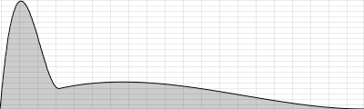
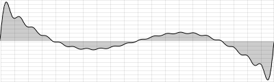

D. FUNCTION TABLES
==================

Csound: FUNCTIONTABLES

*Note: This chapter was written before arrays had been introduced into
Csound. Now the usage of arrays is in some situations preferable to
using function tables. Have a look in chapter 03E to see how you can use
arrays.*

A function table is essentially the same as what other audio programming
languages might call a buffer, a table, a list or an array. It is a
place where data can be stored in an ordered way. Each function table
has a **size**: how much data (in Csound, just numbers) it can store.
Each value in the table can be accessed by an **index**, counting from 0
to size-1. For instance, if you have a function table with a size of 10,
and the numbers \[1.1 2.2 3.3 5.5 8.8 13.13 21.21 34.34 55.55 89.89\] in
it, this is the relation of value and index:

 

  -------- ------ ------ ------ ------ ------ -------- -------- -------- -------- --------
   VALUE    1.1    2.2    3.3    5.5    8.8    13.13    21.21    34.34    55.55    89.89
   INDEX    0      1      2      3      4      5        6        7        8        9
  -------- ------ ------ ------ ------ ------ -------- -------- -------- -------- --------

 

So, if you want to retrieve the value 13.13, you must point to the value
stored under index 5.

The use of function tables is manifold. A function table can contain
pitch values to which you may refer using the input of a MIDI keyboard.
A function table can contain a model of a waveform which is read
periodically by an oscillator. You can record live audio input in a
function table, and then play it back. There are many more applications,
all using the fast access (because function tables are stored in RAM)
and flexible use of function tables.

How to Generate a Function Table
--------------------------------

Each function table must be created **before** it can be used. Even if
you want to write values later, you must first create an empty table,
because you must initially reserve some space in memory for it.

Each creation of a function table in Csound is performed by one of the
**GEN Routines**. Each GEN Routine generates a function table in a
particular way: [GEN01](http://www.csounds.com/manual/html/GEN01.html)
transfers audio samples from a soundfile into a table,
[GEN02](http://www.csounds.com/manual/html/GEN02.html) stores values we
define explicitly one by one,
[GEN10](http://www.csounds.com/manual/html/GEN10.html) calculates a
waveform using user-defined weightings of harmonically related
sinusoids, [GEN20](http://www.csounds.com/manual/html/GEN20.html)
generates window functions typically used for granular synthesis, and so
on. There is a good
[overview](http://www.csounds.com/manual/html/ScoreGenRef.html) in the
[Csound Manual](http://www.csounds.com/manual/html/index.html) of all
existing GEN Routines. Here we will explain their general use and
provide some simple examples using commonly used GEN routines.

### GEN02 and General Parameters for GEN Routines

Let\'s start with our example described above and write the 10 numbers
into a function table with 10 storage locations. For this task use of a
[GEN02](http://www.csounds.com/manual/html/GEN02.html) function table is
required. A short
[description](http://www.csounds.com/manual/html/GEN02.html) of GEN02
from the manual reads as follows:

    f # time size 2 v1 v2 v3 ...

This is the traditional way of creating a function table by use of an
\"**f statement**\" or an \"**f score event**\" (in a manner similar to
the use of \"i score events\" to call instrument instances). The input
parameters after the \"f\" are as follows:

-   **\#**: a number (as positive integer) for this function table;
-   **time**: at what time, in relation to the passage of the score, the
    function table is created (usually 0: from the beginning);
-   **size**: the size of the function table. A little care is required:
    in the early days of Csound only power-of-two sizes were possible
    for function tables (2, 4, 8, 16, \...); nowadays almost all GEN
    Routines accepts other sizes, but these **non-power-of-two sizes
    must be declared as negative number**s!
-   **2**: the number of the GEN Routine which is used to generate the
    table, and here is another important point which must be borne in
    mind: **by default, Csound normalizes the table values.** This means
    that the maximum is scaled to +1 if positive, and to -1 if negative.
    All other values in the table are then scaled by the same factor
    that was required to scale the maximum to +1 or -1. To **prevent**
    Csound from normalizing, a **negative** number can be given as GEN
    number (in this example, the GEN routine number will be given as -2
    instead of 2).
-   **v1 v2 v3 \...**: the values which are written into the function
    table.

The example below demonstrates how the values \[1.1 2.2 3.3 5.5 8.8
13.13 21.21 34.34 55.55 89.89\] can be stored in a function table using
an f-statement in the score. Two versions are created: an unnormalised
version (table number 1) and an normalised version (table number 2). The
difference in their contents will be demonstrated.

   ***EXAMPLE 03D01\_Table\_norm\_notNorm.csd*** 

    <CsoundSynthesizer>
    <CsInstruments>
    ;Example by Joachim Heintz
      instr 1 ;prints the values of table 1 or 2
              prints    "%nFunction Table %d:%n", p4
    indx      init      0
    loop:
    ival      table     indx, p4
              prints    "Index %d = %f%n", indx, ival
              loop_lt   indx, 1, 10, loop
      endin
    </CsInstruments>
    <CsScore>
    f 1 0 -10 -2 1.1 2.2 3.3 5.5 8.8 13.13 21.21 34.34 55.55 89.89; not normalized
    f 2 0 -10 2 1.1 2.2 3.3 5.5 8.8 13.13 21.21 34.34 55.55 89.89; normalized
    i 1 0 0 1; prints function table 1
    i 1 0 0 2; prints function table 2
    </CsScore>
    </CsoundSynthesizer>

Instrument 1 simply reads and prints (to the terminal) the values of the
table. Notice the difference in values read, whether the table is
normalized (positive GEN number) or not normalized (negative GEN
number). 

Using the [ftgen](http://www.csounds.com/manual/html/ftgen.html) opcode
is a more modern way of creating a function table, which is generally
preferable to the old way of writing an f-statement in the score.^1^ 
The syntax is explained below:

    giVar     ftgen     ifn, itime, isize, igen, iarg1 [, iarg2 [, ...]]

-   **giVar**: a variable name. Each function is stored in an
    i-variable. Usually you want to have access to it from every
    instrument, so a gi-variable (global initialization variable) is
    given.
-   **ifn**: a number for the function table. If you type in 0, you give
    Csound the job to choose a number, which is mostly preferable.

The other parameters (size, GEN number, individual arguments) are the
same as in the f-statement in the score. As this GEN call is now a part
of the orchestra, each argument is separated from the next by a comma
(not by a space or tab like in the score).

So this is the same example as above, but now with the function tables
being generated in the orchestra header:

   ***EXAMPLE 03D02\_Table\_ftgen.csd*** 

    <CsoundSynthesizer>
    <CsInstruments>
    ;Example by Joachim Heintz

    giFt1 ftgen 1, 0, -10, -2, 1.1, 2.2, 3.3, 5.5, 8.8, 13.13, 21.21, 34.34, 55.55, 89.89
    giFt2 ftgen 2, 0, -10, 2, 1.1, 2.2, 3.3, 5.5, 8.8, 13.13, 21.21, 34.34, 55.55, 89.89

      instr 1; prints the values of table 1 or 2
              prints    "%nFunction Table %d:%n", p4
    indx      init      0
    loop:
    ival      table     indx, p4
              prints    "Index %d = %f%n", indx, ival
              loop_lt   indx, 1, 10, loop
      endin

    </CsInstruments>
    <CsScore>
    i 1 0 0 1; prints function table 1
    i 1 0 0 2; prints function table 2
    </CsScore>
    </CsoundSynthesizer>

### GEN01: Importing a Soundfile

[GEN01](http://www.csounds.com/manual/html/GEN01.html) is used for
importing soundfiles stored on disk into the computer\'s RAM, ready for
for use by a number of Csound\'s opcodes in the orchestra. A typical
[ftgen](http://www.csounds.com/manual/html/ftgen.html) statement for
this import might be the following:

    varname             ifn itime isize igen Sfilnam       iskip iformat ichn
    giFile    ftgen     0,  0,    0,    1,   "myfile.wav", 0,    0,      0

-   **varname**, **ifn**, **itime**: These arguments have the same
    meaning as explained above in reference to GEN02. Note that on this
    occasion the function table number (ifn) has been defined using a
    zero. This means that Csound will automatically assign a unique
    function table number. This number will also be held by the variable
    giFile which we will normally use to reference the function table
    anyway so its actual value will not be important to us. If you are
    interested you can print the value of giFile (ifn) out. If no other
    tables are defined, it will be 101 and subsequent tables, also using
    automatically assigned table  numbers, will follow accordingly: 102,
    103 etc.
-   **isize**: Usually you won\'t know the length of your soundfile in
    samples, and want to have a table length which includes exactly all
    the samples. This is done by setting **isize=0**. (Note that some
    opcodes may need a power-of-two table. In this case you can not use
    this option, but must calculate the next larger power-of-two value
    as size for the function table.)
-   **igen**: As explained in the previous subchapter, this is always
    the place for indicating the number of the GEN Routine which must be
    used. As always, a positive number means normalizing, which is often
    convenient for audio samples.
-   **Sfilnam**: The name of the soundfile in double quotes. Similar to
    other audio programming languages, Csound recognizes just the name
    if your .csd and the soundfile are in the same folder. Otherwise,
    give the full path. (You can also include the folder via the
    \"SSDIR\" variable, or add the folder via the \"\--env:NAME+=VALUE\"
    option.)
-   **iskip**: The time in seconds you want to skip at the beginning of
    the soundfile. 0 means reading from the beginning of the file.
-   **iformat**: The format of the amplitude samples in the soundfile,
    e.g. 16 bit, 24 bit etc. Usually providing 0 here is sufficient, in
    which case Csound will read the sample format form the soundfile
    header.\
-   **ichn**: 1 = read the first channel of the soundfile into the
    table, 2 = read the second channel, etc. 0 means that all channels
    are read. Note that only certain opcodes are able to properly make
    use of multichannel audio stored in function tables.

The following example loads a short sample into RAM via a function table
and then plays it. You can download the sample
[here](http://www.csounds.com/manual/html/examples/fox.wav) (or replace
it with one of your own). Copy the text below, save it to the same
location as the \"fox.wav\" soundfile (or add the folder via the
\"\--env:NAME+=VALUE\" option),^2^  and it should work. Reading the
function table here is done using the
[poscil3](http://www.csounds.com/manual/html/poscil3.html) opcode which
can deal with non-power-of-two tables.

   ***EXAMPLE 03D03\_Sample\_to\_table.csd*** 

    <CsoundSynthesizer>
    <CsOptions>
    -odac
    </CsOptions>
    <CsInstruments>
    ;Example by Joachim Heintz
    sr = 44100
    ksmps = 32
    nchnls = 2
    0dbfs = 1

    giSample  ftgen     0, 0, 0, 1, "fox.wav", 0, 0, 1

      instr 1
    itablen   =         ftlen(giSample) ;length of the table
    idur      =         itablen / sr ;duration
    aSamp     poscil3   .5, 1/idur, giSample
              outs      aSamp, aSamp
      endin

    </CsInstruments>
    <CsScore>
    i 1 0 2.757
    </CsScore>
    </CsoundSynthesizer>

### GEN10: Creating a Waveform

The third example for generating a function table covers a classic case:
building a function table which stores one cycle of a waveform. This
waveform will then be read by an oscillator to produce a sound.

There are many GEN Routines which can be used to achieve this. The
simplest one is [GEN10](http://www.csounds.com/manual/html/GEN10.html).
It produces a waveform by adding sine waves which have the \"harmonic\"
frequency relationship 1 : 2 : 3  : 4 \... After the usual arguments for
function table number, start, size and gen routine number, which are the
first four arguments in
[ftgen](http://www.csounds.com/manual/html/ftgen.html) for all GEN
Routines, with GEN10 you must specify the relative strengths of the
harmonics. So, if you just provide one argument, you will end up with a
sine wave (1st harmonic). The next argument is the strength of the 2nd
harmonic, then the 3rd, and so on. In this way, you can build
approximations of the standard harmonic waveforms by the addition of
sinusoids. This is done in the next example by instruments 1-5.
Instrument 6 uses the sine wavetable twice: for generating both the
sound and the envelope.

   ***EXAMPLE 03D04\_Standard\_waveforms\_with\_GEN10.csd*** 

    <CsoundSynthesizer>
    <CsOptions>
    -odac
    </CsOptions>
    <CsInstruments>
    ;Example by Joachim Heintz
    sr = 44100
    ksmps = 32
    nchnls = 2
    0dbfs = 1

    giSine    ftgen     0, 0, 2^10, 10, 1
    giSaw     ftgen     0, 0, 2^10, 10, 1, 1/2, 1/3, 1/4, 1/5, 1/6, 1/7, 1/8, 1/9
    giSquare  ftgen     0, 0, 2^10, 10, 1, 0, 1/3, 0, 1/5, 0, 1/7, 0, 1/9
    giTri     ftgen     0, 0, 2^10, 10, 1, 0, -1/9, 0, 1/25, 0, -1/49, 0, 1/81
    giImp     ftgen     0, 0, 2^10, 10, 1, 1, 1, 1, 1, 1, 1, 1, 1

      instr 1 ;plays the sine wavetable
    aSine     poscil    .2, 400, giSine
    aEnv      linen     aSine, .01, p3, .05
              outs      aEnv, aEnv
      endin

      instr 2 ;plays the saw wavetable
    aSaw      poscil    .2, 400, giSaw
    aEnv      linen     aSaw, .01, p3, .05
              outs      aEnv, aEnv
      endin

      instr 3 ;plays the square wavetable
    aSqu      poscil    .2, 400, giSquare
    aEnv      linen     aSqu, .01, p3, .05
              outs      aEnv, aEnv
      endin

      instr 4 ;plays the triangular wavetable
    aTri      poscil    .2, 400, giTri
    aEnv      linen     aTri, .01, p3, .05
              outs      aEnv, aEnv
      endin

      instr 5 ;plays the impulse wavetable
    aImp      poscil    .2, 400, giImp
    aEnv      linen     aImp, .01, p3, .05
              outs      aEnv, aEnv
      endin

      instr 6 ;plays a sine and uses the first half of its shape as envelope
    aEnv      poscil    .2, 1/6, giSine
    aSine     poscil    aEnv, 400, giSine
              outs      aSine, aSine
      endin

    </CsInstruments>
    <CsScore>
    i 1 0 3
    i 2 4 3
    i 3 8 3
    i 4 12 3
    i 5 16 3
    i 6 20 3
    </CsScore>
    </CsoundSynthesizer>

How to Write Values to a Function Table
---------------------------------------

As we have seen, GEN Routines generate function tables, and by doing
this, they write values into them according to various methods, but in
certain cases you might first want to create an empty table, and then
write the values into it later or you might want to alter the default
values held in a function table. The following section demonstrates how
to do this.

To be precise, it is not actually correct to talk about an \"empty
table\". If Csound creates an \"empty\" table, in fact it writes zeros
to the indices which are not specified. Perhaps the easiest method of
creating an \"empty\" table for 100 values is shown below:

    giEmpty   ftgen     0, 0, -100, 2, 0

The simplest to use opcode that writes values to existing function
tables during a note\'s performance is
[tablew](http://www.csounds.com/manual/html/tablew.html) and its i-time
equivalent is
[tableiw](http://www.csounds.com/manual/html/tableiw.html). Note that
you may have problems with some features if your table is not a
power-of-two size. In this case, you can also use
[tabw](http://www.csounds.com/manual/html/tab.html) /
[tabw\_i](http://www.csounds.com/manual/html/tab.html), but they don\'t
have the offset- and the wraparound-feature. As usual, you must
differentiate if your signal (variable) is i-rate, k-rate or a-rate. The
usage is simple and differs just in the class of values you want to
write to the table (i-, k- or a-variables):

    tableiw   isig, indx, ifn [, ixmode] [, ixoff] [, iwgmode]
              tablew    ksig, kndx, ifn [, ixmode] [, ixoff] [, iwgmode]
              tablew    asig, andx, ifn [, ixmode] [, ixoff] [, iwgmode]

-   **isig**, **ksig**, **asig** is the value (variable) you want to
    write into a specified location of the table;
-   **indx**, **kndx**, **andx** is the location (index) where you will
    write the value;
-   **ifn** is the function table you want to write to;
-   **ixmode** gives the choice to write by raw indices (counting from 0
    to size-1), or by a normalized writing mode in which the start and
    end of each table are always referred as 0 and 1 (not depending on
    the length of the table). The default is ixmode=0 which means the
    raw index mode. A value not equal to zero for ixmode changes to the
    normalized index mode.
-   **ixoff** (default=0) gives an index offset. So, if indx=0 and
    ixoff=5, you will write at index 5.
-   **iwgmode** tells what you want to do if your index is larger than
    the size of the table. If iwgmode=0 (default), any index larger than
    possible is written at the last possible index. If iwgmode=1, the
    indices are wrapped around. For instance, if your table size is 8,
    and your index is 10, in the wraparound mode the value will be
    written at index 2.

Here are some examples for i-, k- and a-rate values.

### i-Rate Example

The following example calculates the first 12 values of a Fibonacci
series and writes them to a table. An empty table has first been created
in the header (filled with zeros), then instrument 1 calculates the
values in an i-time loop and writes them to the table using tableiw.
Instrument 2 simply prints all the values in a list to the terminal.

 

   ***EXAMPLE 03D05\_Write\_Fibo\_to\_table.csd*** 

    <CsoundSynthesizer>
    <CsInstruments>
    ;Example by Joachim Heintz

    giFt      ftgen     0, 0, -12, -2, 0

      instr 1; calculates first 12 fibonacci values and writes them to giFt
    istart    =         1
    inext     =         2
    indx      =         0
    loop:
              tableiw   istart, indx, giFt ;writes istart to table
    istartold =         istart ;keep previous value of istart
    istart    =         inext ;reset istart for next loop
    inext     =         istartold + inext ;reset inext for next loop
              loop_lt   indx, 1, 12, loop
      endin

      instr 2; prints the values of the table
              prints    "%nContent of Function Table:%n"
    indx      init      0
    loop:
    ival      table     indx, giFt
              prints    "Index %d = %f%n", indx, ival
              loop_lt   indx, 1, ftlen(giFt), loop
      endin

    </CsInstruments>
    <CsScore>
    i 1 0 0
    i 2 0 0
    </CsScore>
    </CsoundSynthesizer>

### k-Rate Example

The next example writes a k-signal continuously into a table. This can
be used to record any kind of user input, for instance by MIDI or
widgets. It can also be used to record random movements of k-signals,
like here:

   ***EXAMPLE 03D06\_Record\_ksig\_to\_table.csd***

    <CsoundSynthesizer>
    <CsOptions>
    -odac
    </CsOptions>
    <CsInstruments>
    ;Example by Joachim Heintz
    sr = 44100
    ksmps = 32
    nchnls = 2
    0dbfs = 1

    giFt      ftgen     0, 0, -5*kr, 2, 0; size for 5 seconds of recording
    giWave    ftgen     0, 0, 2^10, 10, 1, .5, .3, .1; waveform for oscillator
              seed      0

    ; - recording of a random frequency movement for 5 seconds, and playing it
      instr 1
    kFreq     randomi   400, 1000, 1 ;random frequency
    aSnd      poscil    .2, kFreq, giWave ;play it
              outs      aSnd, aSnd
    ;;record the k-signal
              prints    "RECORDING!%n"
     ;create a writing pointer in the table,
     ;moving in 5 seconds from index 0 to the end
    kindx     linseg    0, 5, ftlen(giFt)
     ;write the k-signal
              tablew    kFreq, kindx, giFt
      endin

      instr 2; read the values of the table and play it again
    ;;read the k-signal
              prints    "PLAYING!%n"
     ;create a reading pointer in the table,
     ;moving in 5 seconds from index 0 to the end
    kindx     linseg    0, 5, ftlen(giFt)
     ;read the k-signal
    kFreq     table     kindx, giFt
    aSnd      oscil3    .2, kFreq, giWave; play it
              outs      aSnd, aSnd
      endin

    </CsInstruments>
    <CsScore>
    i 1 0 5
    i 2 6 5
    </CsScore>
    </CsoundSynthesizer>

As you see, this typical case of writing k-values to a table requires a
changing value for the index, otherwise tablew will continually
overwrite at the same table location. This changing value can be created
using the [line](http://www.csounds.com/manual/html/line.html) or
[linseg](http://www.csounds.com/manual/html/linseg.html) opcodes - as
was done here - or by using a
[phasor](http://www.csounds.com/manual/html/phasor.html). A phasor moves
continuously from 0 to 1 at a user-defined frequency. For example, if
you want a phasor to move from 0 to 1 in 5 seconds, you must set the
frequency to 1/5. Upon reaching 1, the phasor will wrap-around to zero
and begin again. Note that phasor can also be given a negative frequency
in which case it moves in reverse from 1 to zero then wrapping around to
1. By setting the ixmode argument of tablew to 1, you can use the phasor
output directly as writing pointer. Below is an alternative version of
instrument 1 from the previous example, this time using phasor to
generate the index values:

    instr 1; recording of a random frequency movement for 5 seconds, and playing it
    kFreq     randomi   400, 1000, 1; random frequency
    aSnd      oscil3    .2, kFreq, giWave; play it
              outs      aSnd, aSnd
    ;;record the k-signal with a phasor as index
              prints    "RECORDING!%n"
     ;create a writing pointer in the table,
     ;moving in 5 seconds from index 0 to the end
    kindx     phasor    1/5
     ;write the k-signal
              tablew    kFreq, kindx, giFt, 1
    endin

### a-Rate Example

Recording an audio signal is quite similar to recording a control
signal. You just need an a-signal to provide input values and also an
index that changes at a-rate. The next example first records a randomly
generated audio signal and then plays it back. It then records the live
audio input for 5 seconds and subsequently plays it back.

   ***EXAMPLE 03D07\_Record\_audio\_to\_table.csd***   

    <CsoundSynthesizer>
    <CsOptions>
    -iadc -odac
    </CsOptions>
    <CsInstruments>
    ;Example by Joachim Heintz
    sr = 44100
    ksmps = 32
    nchnls = 2
    0dbfs = 1

    giFt      ftgen     0, 0, -5*sr, 2, 0; size for 5 seconds of recording audio
              seed      0

      instr 1 ;generating a band filtered noise for 5 seconds, and recording it
    aNois     rand      .2
    kCfreq    randomi   200, 2000, 3; random center frequency
    aFilt     butbp     aNois, kCfreq, kCfreq/10; filtered noise
    aBal      balance   aFilt, aNois, 1; balance amplitude
              outs      aBal, aBal
    ;;record the audiosignal with a phasor as index
              prints    "RECORDING FILTERED NOISE!%n"
     ;create a writing pointer in the table,
     ;moving in 5 seconds from index 0 to the end
    aindx     phasor    1/5
     ;write the k-signal
              tablew    aBal, aindx, giFt, 1
      endin

      instr 2 ;read the values of the table and play it
              prints    "PLAYING FILTERED NOISE!%n"
    aindx     phasor    1/5
    aSnd      table3    aindx, giFt, 1
              outs      aSnd, aSnd
      endin

      instr 3 ;record live input
    ktim      timeinsts ; playing time of the instrument in seconds
              prints    "PLEASE GIVE YOUR LIVE INPUT AFTER THE BEEP!%n"
    kBeepEnv  linseg    0, 1, 0, .01, 1, .5, 1, .01, 0
    aBeep     oscils    .2, 600, 0
              outs      aBeep*kBeepEnv, aBeep*kBeepEnv
    ;;record the audiosignal after 2 seconds
     if ktim > 2 then
    ain       inch      1
              printks   "RECORDING LIVE INPUT!%n", 10
     ;create a writing pointer in the table,
     ;moving in 5 seconds from index 0 to the end
    aindx     phasor    1/5
     ;write the k-signal
              tablew    ain, aindx, giFt, 1
     endif
      endin

      instr 4 ;read the values from the table and play it
              prints    "PLAYING LIVE INPUT!%n"
    aindx     phasor    1/5
    aSnd      table3    aindx, giFt, 1
              outs      aSnd, aSnd
      endin

    </CsInstruments>
    <CsScore>
    i 1 0 5  ; record 5 seconds of generated audio to a table
    i 2 6 5  ; play back the recording of generated audio
    i 3 12 7 ; record 5 seconds of live audio to a table
    i 4 20 5 ; play back the recording of live audio
    </CsScore>
    </CsoundSynthesizer>

How to Retrieve Values from a Function Table
--------------------------------------------

There are two methods of reading table values. You can either use the
[table](http://www.csounds.com/manual/html/table.html) /
[tab](http://www.csounds.com/manual/html/tab.html) opcodes, which are
universally usable, but need an index; or you can use an oscillator for
reading a table at k-rate or a-rate.

### The table Opcode

The [table](http://www.csounds.com/manual/html/table.html) opcode is
quite similar in syntax to the
[tableiw](http://www.csounds.com/manual/html/tableiw.html)/[tablew](http://www.csounds.com/manual/html/tablew.html)
opcodes (which are explained above). It is simply its counterpart for
reading values from a function table instead of writing them. Its output
can be either an i-, k- or a-rate signal and the value type of the
output automatically selects either the a- k- or a-rate version of the
opcode. The first input is an index at the appropriate rate (i-index for
i-output, k-index for k-output, a-index for a-output). The other
arguments are as explained above for
[tableiw](http://www.csounds.com/manual/html/tableiw.html)/[tablew](http://www.csounds.com/manual/html/tablew.html):

    ires      table    indx, ifn [, ixmode] [, ixoff] [, iwrap]
    kres      table    kndx, ifn [, ixmode] [, ixoff] [, iwrap]
    ares      table    andx, ifn [, ixmode] [, ixoff] [, iwrap]

As table reading often requires interpolation between the table values -
for instance if you read k- or a-values faster or slower than they have
been written in the table - Csound offers two descendants of table for
interpolation: [tablei](http://www.csounds.com/manual/html/tablei.html)
interpolates linearly, whilst
[table3](http://www.csounds.com/manual/html/table3.html) performs cubic
interpolation (which is generally preferable but is computationally
slightly more expensive) and when CPU cycles are no object,
[tablexkt](http://www.csounds.com/manual/html/tablexkt.html) can be used
for ultimate interpolating quality.^3^\
Another variant is the
[tab\_i](http://www.csounds.com/manual/html/tab.html) /
[tab](http://www.csounds.com/manual/html/tab.html) opcode which misses
some features but may be preferable in some situations. If you have any
problems in reading non-power-of-two tables, give them a try. They
should also be faster than the table (and variants thereof) opcode, but
you must take care: they include fewer built-in protection measures than
[table](http://www.csounds.com/manual/html/table.html),
[tablei](http://www.csounds.com/manual/html/tablei.html) and
[table3](http://www.csounds.com/manual/html/table3.html) and if they are
given index values that exceed the table size Csound will stop and
report a performance error.\
Examples of the use of the
[table](http://www.csounds.com/manual/html/table.html) opcodes can be
found in the earlier examples in the How-To-Write-Values\... section.

### Oscillators

It is normal to read tables that contain a single cycle of an audio
waveform using an oscillator but you can actually read any table using
an oscillator, either at a- or at k-rate. The advantage is that you
needn\'t create an index signal. You can simply specify the frequency of
the oscillator (the opcode creates the required index internally based
on the asked for frequency).\
You should bear in mind that many of the oscillators in Csound will work
only with power-of-two table sizes. The
[poscil](http://www.csounds.com/manual/html/poscil.html)/[poscil3](http://www.csounds.com/manual/html/poscil3.html)
opcodes do not have this restriction and offer a high precision, because
they work with floating point indices, so in general it is recommended
to use them. Below is an example that demonstrates both reading a k-rate
and an a-rate signal from a buffer with
[poscil3](http://www.csounds.com/manual/html/poscil3.html) (an
oscillator with a cubic interpolation):

   ***EXAMPLE 03D08\_RecPlay\_ak\_signals.csd***   

    <CsoundSynthesizer>
    <CsOptions>
    -iadc -odac
    </CsOptions>
    <CsInstruments>
    ;Example by Joachim Heintz
    sr = 44100
    ksmps = 32
    nchnls = 2
    0dbfs = 1
    ; -- size for 5 seconds of recording control data
    giControl ftgen     0, 0, -5*kr, 2, 0
    ; -- size for 5 seconds of recording audio data
    giAudio   ftgen     0, 0, -5*sr, 2, 0
    giWave    ftgen     0, 0, 2^10, 10, 1, .5, .3, .1; waveform for oscillator
              seed      0

    ; -- ;recording of a random frequency movement for 5 seconds, and playing it
      instr 1
    kFreq     randomi   400, 1000, 1; random frequency
    aSnd      poscil    .2, kFreq, giWave; play it
              outs      aSnd, aSnd
    ;;record the k-signal with a phasor as index
              prints    "RECORDING RANDOM CONTROL SIGNAL!%n"
     ;create a writing pointer in the table,
     ;moving in 5 seconds from index 0 to the end
    kindx     phasor    1/5
     ;write the k-signal
              tablew    kFreq, kindx, giControl, 1
      endin

      instr 2; read the values of the table and play it with poscil
              prints    "PLAYING CONTROL SIGNAL!%n"
    kFreq     poscil    1, 1/5, giControl
    aSnd      poscil    .2, kFreq, giWave; play it
              outs      aSnd, aSnd
      endin

      instr 3; record live input
    ktim      timeinsts ; playing time of the instrument in seconds
              prints    "PLEASE GIVE YOUR LIVE INPUT AFTER THE BEEP!%n"
    kBeepEnv  linseg    0, 1, 0, .01, 1, .5, 1, .01, 0
    aBeep     oscils    .2, 600, 0
              outs      aBeep*kBeepEnv, aBeep*kBeepEnv
    ;;record the audiosignal after 2 seconds
     if ktim > 2 then
    ain       inch      1
              printks   "RECORDING LIVE INPUT!%n", 10
     ;create a writing pointer in the table,
     ;moving in 5 seconds from index 0 to the end
    aindx     phasor    1/5
     ;write the k-signal
              tablew    ain, aindx, giAudio, 1
     endif
      endin

      instr 4; read the values from the table and play it with poscil
              prints    "PLAYING LIVE INPUT!%n"
    aSnd      poscil    .5, 1/5, giAudio
              outs      aSnd, aSnd
      endin

    </CsInstruments>
    <CsScore>
    i 1 0 5
    i 2 6 5
    i 3 12 7
    i 4 20 5
    </CsScore>
    </CsoundSynthesizer>

Saving the Contents of a Function Table to a File
-------------------------------------------------

A function table exists only as long as you run the Csound instance
which has created it. If Csound terminates, all the data is lost. If you
want to save the data for later use, you must write them to a file.
There are several cases, depending firstly on whether you write at
i-time or at k-time and secondly on what kind of file you want to write
to.

 

### Writing a File in Csound\'s ftsave Format at i-Time or k-Time

Any function table in Csound can be easily written to a file using the
[ftsave](http://www.csounds.com/manual/html/ftsave.html) (i-time) or
[ftsavek](http://www.csounds.com/manual/html/ftsavek.html) (k-time)
opcode. Their use is very simple. The first argument specifies the
filename (in double quotes), the second argument selects between a text
format (non zero) or a binary format (zero) output. Finally you just
provide the number of the function table(s) to save.\
With the following example, you should end up with two textfiles in the
same folder as your .csd: \"i-time\_save.txt\" saves function table 1 (a
sine wave) at i-time; \"k-time\_save.txt\" saves function table 2 (a
linear increment produced during the performance) at k-time.

   ***EXAMPLE 03D09\_ftsave.csd***

    <CsoundSynthesizer>
    <CsInstruments>
    ;Example by Joachim Heintz
    sr = 44100
    ksmps = 32
    nchnls = 2
    0dbfs = 1

    giWave    ftgen     1, 0, 2^7, 10, 1; sine with 128 points
    giControl ftgen     2, 0, -kr, 2, 0; size for 1 second of recording control data
              seed      0

      instr 1; saving giWave at i-time
              ftsave    "i-time_save.txt", 1, 1
      endin

      instr 2; recording of a line transition between 0 and 1 for one second
    kline     linseg    0, 1, 1
              tabw      kline, kline, giControl, 1
      endin

      instr 3; saving giWave at k-time
              ftsave    "k-time_save.txt", 1, 2
      endin

    </CsInstruments>
    <CsScore>
    i 1 0 0
    i 2 0 1
    i 3 1 .1
    </CsScore>
    </CsoundSynthesizer>

The counterpart to
[ftsave](http://www.csounds.com/manual/html/ftsave.html)/[ftsavek](http://www.csounds.com/manual/html/ftsavek.html)
are the
[ftload](http://www.csounds.com/manual/html/ftload.html)/[ftloadk](http://www.csounds.com/manual/html/ftloadk.html)
opcodes. You can use them to load the saved files into function tables.\
\

### Writing a Soundfile from a Recorded Function Table

If you have recorded your live-input to a buffer, you may want to save
your buffer as a soundfile. There is no opcode in Csound which does
that, but it can be done by using a k-rate loop and the
[fout](http://www.csounds.com/manual/html/fout.html) opcode. This is
shown in the next example in instrument 2. First instrument 1 records
your live input. Then instrument 2 creates a soundfile \"testwrite.wav\"
containing this audio in the same folder as your .csd. This is done at
the first k-cycle of instrument 2, by repeatedly reading the table
values and writing them as an audio signal to disk. After this is done,
the instrument is turned off by executing the
[turnoff](http://www.csounds.com/manual/html/turnoff.html) statement.

   ***EXAMPLE 03D10\_Table\_to\_soundfile.csd***   

 

    <CsoundSynthesizer>
    <CsOptions>
    -i adc
    </CsOptions>
    <CsInstruments>
    ;Example by Joachim Heintz
    sr = 44100
    ksmps = 32
    nchnls = 2
    0dbfs = 1
    ; --  size for 5 seconds of recording audio data
    giAudio   ftgen     0, 0, -5*sr, 2, 0

      instr 1 ;record live input
    ktim      timeinsts ; playing time of the instrument in seconds
              prints    "PLEASE GIVE YOUR LIVE INPUT AFTER THE BEEP!%n"
    kBeepEnv  linseg    0, 1, 0, .01, 1, .5, 1, .01, 0
    aBeep     oscils    .2, 600, 0
              outs      aBeep*kBeepEnv, aBeep*kBeepEnv
    ;;record the audiosignal after 2 seconds
     if ktim > 2 then
    ain       inch      1
              printks   "RECORDING LIVE INPUT!%n", 10
     ;create a writing pointer in the table,
     ;moving in 5 seconds from index 0 to the end
    aindx     phasor    1/5
     ;write the k-signal
              tablew    ain, aindx, giAudio, 1
     endif
      endin

      instr 2; write the giAudio table to a soundfile
    Soutname  =         "testwrite.wav"; name of the output file
    iformat   =         14; write as 16 bit wav file
    itablen   =         ftlen(giAudio); length of the table in samples

    kcnt      init      0; set the counter to 0 at start
    loop:
    kcnt      =         kcnt+ksmps; next value (e.g. 10 if ksmps=10)
    andx      interp    kcnt-1; calculate audio index (e.g. from 0 to 9)
    asig      tab       andx, giAudio; read the table values as audio signal
              fout      Soutname, iformat, asig; write asig to a file
     if kcnt <= itablen-ksmps kgoto loop; go back as long there is something to do
              turnoff   ; terminate the instrument
      endin

    </CsInstruments>
    <CsScore>
    i 1 0 7
    i 2 7 .1
    </CsScore>
    </CsoundSynthesizer>

This code can also be used in the form of a [User Defined
Opcode](http://www.csounds.com/manual/html/OrchUDO.html). It can be
found
[here](http://www.csounds.com/udo/displayOpcode.php?opcode_id=122).

### Other GEN Routine Highlights

[GEN05](http://www.csounds.com/manual/html/GEN05.html),
[GEN07](http://www.csounds.com/manual/html/GEN07.html),
[GEN25](http://www.csounds.com/manual/html/GEN25.html),
[GEN27](http://www.csounds.com/manual/html/GEN27.html) and
[GEN16](http://www.csounds.com/manual/html/GEN16.html) are useful for
creating envelopes. GEN07 and GEN27 create functions table in the manner
of the [linseg](http://www.csounds.com/manual/html/linseg.html) opcode -
with GEN07 the user defines segment duration whereas in GEN27 the user
defines the absolute time for each breakpoint from the beginning of the
envelope. GEN05 and GEN25 operate similarly to GEN07 and GEN27 except
that envelope segments are exponential in shape. GEN16 also create an
envelope in breakpoint fashion but it allows the user to specify the
curvature of each segment individually (concave - straight - convex).

[GEN17](http://www.csounds.com/manual/html/GEN17.html),
 [GEN41](http://www.csounds.com/manual/html/GEN41.html) and
[GEN42](http://www.csounds.com/manual/html/GEN42.html) are used the
generate histogram-type functions which may prove useful in algorithmic
composition and work with probabilities.

[GEN09](http://www.csounds.com/manual/html/GEN09.html) and
[GEN19](http://www.csounds.com/manual/html/GEN19.html) are developments
of [GEN10](http://www.csounds.com/manual/html/GEN10.html) and are useful
in additive synthesis.

[GEN11](http://www.csounds.com/manual/html/GEN11.html) is a GEN routine
version of the [gbuzz](http://www.csounds.com/manual/html/gbuzz.html)
opcode and as it is a fixed waveform (unlike gbuzz) it can be a useful
and efficient sound source in subtractive synthesis.  

GEN08
-----

    f # time size 8 a n1 b n2 c n3 d ...

GEN08 creates a curved function that forms the smoothest possible line
between a sequence of user defined break-points. This GEN routine can be
useful for the creation of window functions for use as envelope shapes
or in granular synthesis. In forming a smooth curve, GEN08 may create
apexes that extend well above or below any of the defined values. For
this reason GEN08 is mostly used with post-normalisation turned on, i.e.
a minus sign is not added to the GEN number when the function table is
defined. Here are some examples of GEN08 tables:

::: {.group_img}
::: {.image}
 
:::
:::

    f 1 0 1024 8 0 1 1 1023 0

 

::: {.group_img}
::: {.image}

:::
:::

    f 2 0 1024 8 0 97 1 170 0.583 757 0

 

::: {.group_img}
::: {.image}

:::
:::

    f 3 0 1024 8 0 1 0.145 166 0.724 857 0

 

::: {.group_img}
::: {.image}
 
:::
:::

    f 4 0 1024 8 0 1 0.079 96 0.645 927 0

 

 

GEN16
-----

    f # time size 16 val1 dur1 type1 val2 [dur2 type2 val3 ... typeX valN]

GEN16 allows the creation of envelope functions using a sequence of user
defined breakpoints. Additionally for each segment of the envelope we
can define a curvature. The nature of the curvature -- concave or convex
-- will also depend upon the direction of the segment: rising or
falling. For example, positive curvature values will result in concave
curves in rising segments and convex curves in falling segments. The
opposite applies if the curvature value is negative. Below are some
examples of GEN16 function tables:

::: {.group_img}
::: {.image}

:::
:::

    f 1 0 1024 16 0 512 20 1 512 20 0

 

::: {.group_img}
::: {.image}

:::
:::

    f 2 0 1024 16 0 512 4 1 512 4 0

 

::: {.group_img}
::: {.image}
 
:::
:::

    f 3 0 1024 16 0 512 0 1 512 0 0

 

::: {.group_img}
::: {.image}
 
:::
:::

    f 4 0 1024 16 0 512 -4 1 512 -4 0

 

::: {.group_img}
::: {.image}
 
:::
:::

    f 5 0 1024 16 0 512 -20 1 512 -20 0

 

GEN19
-----

    f # time size  19  pna   stra  phsa  dcoa  pnb strb  phsb  dcob  ...

GEN19 follows on from GEN10 and GEN09 in terms of complexity and control
options. It shares the basic concept of generating a harmonic waveform
from stacked sinusoids but in addition to control over the strength of
each partial (GEN10) and the partial number and phase (GEN09) it offers
control over the DC offset of each partial. In addition to the creation
of waveforms for use by audio oscillators other applications might be
the creation of functions for LFOs and window functions for envelopes in
granular synthesis. Below are some examples of GEN19:

 

::: {.group_img}
::: {.image}

:::
:::

    f 1 0 1024 19 1 1 0 0 20 0.1 0 0

 

::: {.group_img}
::: {.image}
 
:::
:::

    f 2 0 1024 -19 0.5 1 180 1

 

 

GEN30
-----

    f # time size  30  src  minh maxh [ref_sr] [interp]

GEN30 uses FFT to create a band-limited version of a source waveform
without band-limiting. We can create a sawtooth waveform by drawing one
explicitly using GEN07 by used as an audio waveform this will create
problems as it contains frequencies beyond the Nyquist frequency
therefore will cause aliasing, particularly when higher notes are
played. GEN30 can analyse this waveform and create a new one with a user
defined lowest and highest partial. If we know what note we are going to
play we can predict what the highest partial below the Nyquist frequency
will be. For a given frequency, freq, the maximum number of harmonics
that can be represented without aliasing can be derived using sr / (2 \*
freq).  \
Here are some examples of GEN30 function tables (the first table is
actually a GEN07 generated sawtooth, the second two are GEN30
band-limited versions of the first):

::: {.group_img}
::: {.image}
 
:::
:::

     f 1 0 1024 7 1 1024 -1

 

 

::: {.group_img}
::: {.image}

:::
:::

    f 2 0 1024 30 1 1 20

 

::: {.group_img}
::: {.image}
 
:::
:::

    f 3 0 1024 30 1 2 20

Related Opcodes
---------------

[ftgen](http://www.csounds.com/manual/html/ftgen.html): Creates a
function table in the orchestra using any GEN Routine.

[table](http://www.csounds.com/manual/html/table.html) /
[tablei](http://www.csounds.com/manual/html/tablei.html) /
[table3](http://www.csounds.com/manual/html/table3.html): Read values
from a function table at any rate, either by direct indexing (table), or
by linear (tablei) or cubic (table3) interpolation. These opcodes
provide many options and are safe because of boundary check, but you may
have problems with non-power-of-two tables.

[tab\_i](http://www.csounds.com/manual/html/tab.html) /
[tab](http://www.csounds.com/manual/html/tab.html): Read values from a
function table at i-rate (tab\_i), k-rate or a-rate (tab). Offer no
interpolation and less options than the table opcodes, but they work
also for non-power-of-two tables. They do not provide a boundary check,
which makes them fast but also give the user the resposability not
reading any value off the table boundaries.

[tableiw](http://www.csounds.com/manual/html/tableiw.html) /
[tablew](http://www.csounds.com/manual/html/tablew.html): Write values
to a function table at i-rate (tableiw), k-rate and a-rate (tablew).
These opcodes provide many options and are safe because of boundary
check, but you may have problems with non-power-of-two tables.

[tabw\_i](http://www.csounds.com/manual/html/tab.html) /
[tabw](http://www.csounds.com/manual/html/tab.html): Write values to a
function table at i-rate (tabw\_i), k-rate or a-rate (tabw). Offer less
options than the tableiw/tablew opcodes, but work also for
non-power-of-two tables. They do not provide a boundary check, which
makes them fast but also give the user the resposability not writing any
value off the table boundaries.

[poscil](http://www.csounds.com/manual/html/poscil.html) /
[poscil3](http://www.csounds.com/manual/html/poscil3.html): Precise
oscillators for reading function tables at k- or a-rate, with linear
(poscil) or cubic (poscil3) interpolation. They support also
non-power-of-two tables, so it\'s usually recommended to use them
instead of the older oscili/oscil3 opcodes. Poscil has also a-rate input
for amplitude and frequency, while poscil3 has just k-rate input. 

[oscili](http://www.csounds.com/manual/html/oscili.html) /
[oscil3](http://www.csounds.com/manual/html/oscil3.html): The standard
oscillators in Csound for reading function tables at k- or a-rate, with
linear (oscili) or cubic (oscil3) interpolation. They support all rates
for the amplitude and frequency input, but are restricted to
power-of-two tables. Particularily for long tables and low frequencies
they are not as precise as the poscil/poscil3 oscillators.

[ftsave](http://www.csounds.com/manual/html/ftsave.html) /
[ftsavek](http://www.csounds.com/manual/html/ftsavek.html): Save a
function table as a file, at i-time (ftsave) or k-time (ftsavek). This
can be a text file or a binary file, but not a soundfile. If you want to
save a soundfile, use the User Defined Opcode
[TableToSF](http://www.csounds.com/udo/displayOpcode.php?opcode_id=122).

[ftload](http://www.csounds.com/manual/html/ftload.html) /
[ftloadk](http://www.csounds.com/manual/html/ftloadk.html): Load a
function table which has been written by ftsave/ftsavek.

[line](http://www.csounds.com/manual/html/line.html) /
[linseg](http://www.csounds.com/manual/html/linseg.html) /
[phasor](http://www.csounds.com/manual/html/phasor.html): Can be used to
create index values which are needed to read/write k- or a-signals with
the table/tablew or tab/tabw opcodes.

 

1.  [ftgen is preferred mainly because you can refer to the function
    table by a variable name and must not deal with constant tables
    numbers. This will enhance the portability of orchestras and better
    facilitate the combining of multiple orchestras. It can also enhance
    the readability of an orchestra if a function table is located in
    the code nearer the instrument that uses
    it.]{#endnote-992d064f-32cc-4f31-85f5-775c91c558ed}
2.  [If your .csd file is, for instance, in the directory
    /home/jh/csound, and your sound file in the directory
    /home/jh/samples, you should add this inside the \<CsOptions\> tag:
    \--env:SSDIR+=/home/jh/samples. This means: \'Look also in
    /home/jh/sample as Sound Sample Directory
    (SSDIR)\']{#endnote-770293cc-3be6-48e3-ad42-9a88a8bd888b}
3.  [For a general introduction about interpolation, see for instance
    http://en.wikipedia.org/wiki/Interpolation]{#endnote-731e804c-d01d-415b-9d63-417d2c46fec3}
