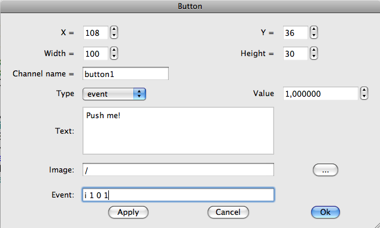
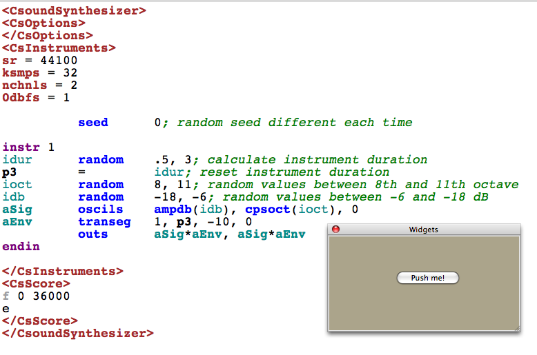

# 03 F. LIVE EVENTS

_Note: This chapter is not about live coding. Live coding should be covered in future in an own chapter. For now, have a look at [live.csound.com](https://live.csound.com/) and Steven Yi's related [csound-live-code](https://github.com/kunstmusik/csound-live-code) repository._

The basic concept of Csound from the early days of the program is still
valid and useful because it is a musically familiar one: you create a
set of instruments and instruct them to play at various times. These
calls of instrument instances, and their execution, are called
_instrument events_.

Whenever any Csound code is executed, it has to be compiled first. Since
Csound6, you can change the code of any running Csound instance, and
recompile it on the fly. There are basically two opcodes for this _live
coding_:&nbsp;
[compileorc](http://www.csound.com/docs/manual/compileorc.html)
&nbsp;re-compiles any existing orc file, whereas&nbsp;
[compilestr](http://www.csound.com/docs/manual/compilestr.html)
compiles any string. At the end of this chapter, we will present some
simple examples for both methods, followed by a description how to
re-compile code on the fly in CsoundQt.

The scheme of instruments and events can be instigated in a number of
ways. In the classical approach you think of an _orchestra_ with a
number of musicians playing from a _score_, but you can also trigger
instruments using any kind of live input: from MIDI, from OSC, from the
command line, from a GUI (such as Csound's _FLTK_ widgets or the
widgets in CsoundQt, Cabbage and Blue), from the API. Or
you can create a kind of _master instrument_, which is always on, and
triggers other instruments using opcodes designed for this task, perhaps
under certain conditions: if the live audio input from a singer has been
detected to have a base frequency greater than 1043 Hz, then start an
instrument which plays a soundfile of broken glass ...

## Order of Execution Revisited

Whatever you do in Csound with instrument events, you must bear in mind
the order of execution that has been explained in the first chapter of
this section about the&nbsp;
[Initialization and Performance Pass](03-a-initialization-and-performance-pass.md):
instruments are executed one by one, both in the initialization pass and
in each control cycle, and the order is determined **by the instrument
number**.

It is worth to have a closer look to what is happening exactly in time
if you trigger an instrument from inside another instrument. The first
example shows the result when instrument 2 triggers instrument 1 and
instrument 3 **at init-time**.

#### **_EXAMPLE 03F01_OrderOfExc_event_i.csd_**

```csound
<CsoundSynthesizer>
<CsOptions>
-nm0
</CsOptions>
<CsInstruments>
sr = 44100
ksmps = 441

instr 1
kCycle timek
prints "Instrument 1 is here at initialization.\n"
printks "Instrument 1: kCycle = %d\n", 0, kCycle
endin

instr 2
kCycle timek
prints "  Instrument 2 is here at initialization.\n"
printks "  Instrument 2: kCycle = %d\n", 0, kCycle
event_i "i", 3, 0, .02
event_i "i", 1, 0, .02
endin

instr 3
kCycle timek
prints "    Instrument 3 is here at initialization.\n"
printks "    Instrument 3: kCycle = %d\n", 0, kCycle
endin

</CsInstruments>
<CsScore>
i 2 0 .02
</CsScore>
</CsoundSynthesizer>
;example by joachim heintz
```

This is the output:

      Instrument 2 is here at initialization.
        Instrument 3 is here at initialization.
    Instrument 1 is here at initialization.
    Instrument 1: kCycle = 1
      Instrument 2: kCycle = 1
        Instrument 3: kCycle = 1
    Instrument 1: kCycle = 2
      Instrument 2: kCycle = 2
        Instrument 3: kCycle = 2

Instrument 2 is the first one to initialize, because it is the only one
which is called by the score. Then instrument 3 is initialized, because
it is called first by instrument 2. The last one is instrument 1. All
this is done before the actual performance begins. In the performance
itself, starting from the first control cycle, all instruments are
executed by their order.

Let us compare now what is happening when instrument 2 calls instrument
1 and 3 **during the performance** (= at k-time):

#### **_EXAMPLE 03F02_OrderOfExc_event_k.csd_**

```csound
<CsoundSynthesizer>
<CsOptions>
-nm0
</CsOptions>
<CsInstruments>
sr = 44100
ksmps = 441
0dbfs = 1
nchnls = 1

instr 1
kCycle timek
prints "Instrument 1 is here at initialization.\n"
printks "Instrument 1: kCycle = %d\n", 0, kCycle
endin

instr 2
kCycle timek
prints "  Instrument 2 is here at initialization.\n"
printks "  Instrument 2: kCycle = %d\n", 0, kCycle
 if kCycle == 1 then
event "i", 3, 0, .02
event "i", 1, 0, .02
 endif
printks "  Instrument 2: still in kCycle = %d\n", 0, kCycle
endin

instr 3
kCycle timek
prints "    Instrument 3 is here at initialization.\n"
printks "    Instrument 3: kCycle = %d\n", 0, kCycle
endin

instr 4
kCycle timek
prints "      Instrument 4 is here at initialization.\n"
printks "      Instrument 4: kCycle = %d\n", 0, kCycle
endin

</CsInstruments>
<CsScore>
i 4 0 .02
i 2 0 .02
</CsScore>
</CsoundSynthesizer>
;example by joachim heintz
```

This is the output:

      Instrument 2 is here at initialization.
          Instrument 4 is here at initialization.
      Instrument 2: kCycle = 1
      Instrument 2: still in kCycle = 1
          Instrument 4: kCycle = 1
        Instrument 3 is here at initialization.
    Instrument 1 is here at initialization.
    Instrument 1: kCycle = 2
      Instrument 2: kCycle = 2
      Instrument 2: still in kCycle = 2
        Instrument 3: kCycle = 2
          Instrument 4: kCycle = 2

Instrument 2 starts with its init-pass, and then instrument 4 is
initialized. As you see, the reverse order of the scorelines has no
effect; the instruments which start at the same time are executed in
ascending order, depending on their numbers.

In this first cycle, instrument 2 calls instrument 3 and 1. As we see
by the output of instrument 4, the whole control cycle is finished
first, before instrument 3 and 1 (in this order) are initialized.
These both instruments start their performance in cycle number two,
where they find themselves in the usual order: instrument 1 before
instrument 2, then instrument 3 before instrument 4.

Usually you will not need to know all of this with such precise timing.
But in case you experience any problems, a clearer awareness of the
process may help.

## Instrument Events from the Score

This is the classical way of triggering instrument events: you write a
list in the score section of a .csd file. Each line which begins with an
_i_ is an instrument event. As this is very simple, and examples can
be found easily, let us focus instead on some additional features which
can be useful when you work in this way. Documentation for these
features can be found in the&nbsp;
[Score Statements](http://www.csound.com/docs/manual/ScoreStatements.html)
&nbsp;section of the Canonical Csound Reference Manual. Here are some
examples:

#### **_EXAMPLE 03F03_Score_tricks.csd_**

```csound
<CsoundSynthesizer>
<CsOptions>
-odac
</CsOptions>
<CsInstruments>
sr = 44100
ksmps = 32
nchnls = 2
0dbfs = 1

giWav     ftgen     0, 0, 2^10, 10, 1, .5, .3, .1

  instr 1
kFadout   init      1
krel      release   ;returns "1" if last k-cycle
 if krel == 1 && p3 < 0 then ;if so, and negative p3:
          xtratim   .5       ;give 0.5 extra seconds
kFadout   linseg    1, .5, 0 ;and make fade out
 endif
kEnv      linseg    0, .01, p4, abs(p3)-.1, p4, .09, 0; normal fade out
aSig      poscil    kEnv*kFadout, p5, giWav
          outs      aSig, aSig
  endin

</CsInstruments>
<CsScore>
t 0 120                      ;set tempo to 120 beats per minute
i    1    0    1    .2   400 ;play instr 1 for one second
i    1    2   -10   .5   500 ;play instr 1 indefinetely (negative p3)
i   -1    5    0             ;turn it off (negative p1)
; -- turn on instance 1 of instr 1 one sec after the previous start
i    1.1  ^+1  -10  .2   600
i    1.2  ^+2  -10  .2   700 ;another instance of instr 1
i   -1.2  ^+2  0             ;turn off 1.2
; -- turn off 1.1 (dot = same as the same p-field above)
i   -1.1  ^+1  .
s                            ;end of a section, so time again starts at zero
i    1    1    1    .2   800
r 5                          ;repeats the following line (until the next "s")
i    1   .25  .25   .2   900
s
v 2                          ;lets time be double as long
i    1    0    2    .2   1000
i    1    1    1    .2   1100
s
v 0.5                        ;lets time be half as long
i    1    0    2    .2   1200
i    1    1    1    .2   1300
s                            ;time is normal now again
i    1    0    2    .2   1000
i    1    1    1    .2   900
s
; -- make a score loop (4 times) with the variable "LOOP"
{4 LOOP
i    1    [0 + 4 * $LOOP.]    3    .2   [1200 - $LOOP. * 100]
i    1    [1 + 4 * $LOOP.]    2    .    [1200 - $LOOP. * 200]
i    1    [2 + 4 * $LOOP.]    1    .    [1200 - $LOOP. * 300]
}
e
</CsScore>
</CsoundSynthesizer>
;example by joachim heintz
```

Triggering an instrument with an indefinite duration by setting _p3_ to
any negative value, and stopping it by a negative p1 value, can be an
important feature for live events. If you turn instruments off in this
way you may have to add a fade out segment. One method of doing this is
shown in the instrument above with a combination of the&nbsp;
[release](http://www.csound.com/docs/manual/release.html) and the&nbsp;
[xtratim](http://www.csound.com/docs/manual/xtratim.html) opcodes. Also
note that you can start and stop certain instances of an instrument with
a floating point number as p1.

## Using MIDI Note-On Events

Csound has a particular feature which makes it very simple to trigger
instrument events from a MIDI keyboard. Each MIDI Note-On event can
trigger an instrument, and the related Note-Off event of the same key
stops the related instrument instance. This is explained more in detail
in the chapter&nbsp;
[Triggering Instrument Instances](07-b-triggering-instrument-instances.md)
&nbsp;in the MIDI section of
this manual. Here, just a small example is shown. Simply connect your
MIDI keyboard and it should work.

#### **_EXAMPLE 03F04_Midi_triggered_events.csd_**

```csound
<CsoundSynthesizer>
<CsOptions>
-Ma -odac
</CsOptions>
<CsInstruments>
sr = 44100
ksmps = 32
nchnls = 2
0dbfs = 1

giSine    ftgen     0, 0, 2^10, 10, 1
          massign   0, 1; assigns all midi channels to instr 1

  instr 1
iFreq     cpsmidi   ;gets frequency of a pressed key
iAmp      ampmidi   8 ;gets amplitude and scales 0-8
iRatio    random    .9, 1.1 ;ratio randomly between 0.9 and 1.1
aTone     foscili   .1, iFreq, 1, iRatio/5, iAmp+1, giSine ;fm
aEnv      linenr    aTone, 0, .01, .01 ; avoiding clicks at the note-end
          outs      aEnv, aEnv
  endin

</CsInstruments>
<CsScore>
f 0 36000; play for 10 hours
e
</CsScore>
</CsoundSynthesizer>
;example by joachim heintz
```

## Using Widgets

If you want to trigger an instrument event in realtime with a Graphical
User Interface, it is usually a _Button_ widget which will do this
job. We will see here a simple example; first implemented using
Csound's FLTK widgets, and then using CsoundQt's widgets.

### FLTK Button

This is a very simple example demonstrating how to trigger an instrument
using an [FLTK button](http://www.csound.com/docs/manual/FLbutton.html).
A more extended example can be found&nbsp;
[here](http://www.csound.com/docs/manual/examples/FLbutton.csd).

#### **_EXAMPLE 03F05_FLTK_triggered_events.csd_**

```csound
<CsoundSynthesizer>
<CsOptions>
-odac
</CsOptions>
<CsInstruments>
sr = 44100
ksmps = 32
nchnls = 2
0dbfs = 1

      ; -- create a FLTK panel --
          FLpanel   "Trigger By FLTK Button", 300, 100, 100, 100
      ; -- trigger instr 1 (equivalent to the score line "i 1 0 1")
k1, ih1   FLbutton  "Push me!", 0, 0, 1, 150, 40, 10, 25, 0, 1, 0, 1
      ; -- trigger instr 2
k2, ih2   FLbutton  "Quit", 0, 0, 1, 80, 40, 200, 25, 0, 2, 0, 1
          FLpanelEnd; end of the FLTK panel section
          FLrun     ; run FLTK
          seed      0; random seed different each time

  instr 1
idur      random    .5, 3; recalculate instrument duration
p3        =         idur; reset instrument duration
ioct      random    8, 11; random values between 8th and 11th octave
idb       random    -18, -6; random values between -6 and -18 dB
aSig      poscil    ampdb(idb), cpsoct(ioct)
aEnv      transeg   1, p3, -10, 0
          outs      aSig*aEnv, aSig*aEnv
  endin

instr 2
          exitnow
endin

</CsInstruments>
<CsScore>
f 0 36000
e
</CsScore>
</CsoundSynthesizer>
;example by joachim heintz
```

Note that in this example the duration of an instrument event is
recalculated when the instrument is initialised. This is done using the
statement _p3 = i..._. This can be a useful technique if you want the
duration that an instrument plays for to be different each time it is
called. In this example duration is the result of a random function.
The duration defined by the FLTK button will be overwritten by any other
calculation within the instrument itself at i-time.

### CsoundQt Button

In CsoundQt, a button can be created easily from the submenu in a widget
panel:

{width=50%}

In the Properties Dialog of the button widget, make sure you have
selected _event_ as Type. Insert a Channel name, and at the bottom
type in the event you want to trigger - as you would if writing a line
in the score.

{width=70%}

In your Csound code, you need nothing more than the instrument you want
to trigger:

{width=70%}

For more information about CsoundQt, read the CsoundQt chapter in the
_Frontends_ section of this manual.

## Using A Realtime Score

### Command Line with the -L stdin Option

If you use any .csd with the option _-L stdin_ (and the -odac option
for realtime output), you can type any score line in realtime (sorry,
this does not work for Windows). For instance, save this .csd anywhere
and run it from the command line:

#### **_EXAMPLE 03F06_Commandline_rt_events.csd_**

```csound
<CsoundSynthesizer>
<CsOptions>
-L stdin -odac
</CsOptions>
<CsInstruments>
;Example by Joachim Heintz
sr = 44100
ksmps = 32
nchnls = 2
0dbfs = 1

          seed      0; random seed different each time

  instr 1
idur      random    .5, 3; calculate instrument duration
p3        =         idur; reset instrument duration
ioct      random    8, 11; random values between 8th and 11th octave
idb       random    -18, -6; random values between -6 and -18 dB
aSig      oscils    ampdb(idb), cpsoct(ioct), 0
aEnv      transeg   1, p3, -10, 0
          outs      aSig*aEnv, aSig*aEnv
  endin

</CsInstruments>
<CsScore>
f 0 36000
e
</CsScore>
</CsoundSynthesizer>
```

If you run it by typing and returning a command line like this ...

{width=70%}

... you should get a prompt at the end of the Csound messages:

{width=70%}

If you now type the line _i 1 0 1_ and press return, you should hear
that instrument 1 has been executed. After three times your messages may
look like this:

{width=70%}

## By Conditions

We have discussed first the classical method of triggering instrument
events from the score section of a .csd file, then we went on to look at
different methods of triggering real time events using MIDI, by using
widgets, and by using score lines inserted live. We will now look at the
Csound orchestra itself and to some methods by which an instrument can
internally trigger another instrument. The pattern of triggering could
be governed by conditionals, or by different kinds of loops. As this
"master" instrument can itself be triggered by a realtime event, you
have unlimited options available for combining the different methods.

Let's start with conditionals. If we have a realtime input, we may want
to define a threshold, and trigger an event

1.  if we cross the threshold from below to above;
2.  if we cross the threshold from above to below.

In Csound, this could be implemented using an orchestra of three
instruments. The first instrument is the master instrument. It receives
the input signal and investigates whether that signal is crossing the
threshold and if it does whether it is crossing from low to high or from
high to low. If it crosses the threshold from low to high the second
instrument is triggered, if it crosses from high to low the third
instrument is triggered.

#### **_EXAMPLE 03F07_Event_by_condition.csd_**

```csound
<CsoundSynthesizer>
<CsOptions>
-iadc -odac
</CsOptions>
<CsInstruments>
sr = 44100
ksmps = 32
nchnls = 2
0dbfs = 1

          seed      0; random seed different each time

  instr 1; master instrument
ichoose   =         p4; 1 = real time audio, 2 = random amplitude movement
ithresh   =         -12; threshold in dB
kstat     init      1; 1 = under the threshold, 2 = over the threshold
;;CHOOSE INPUT SIGNAL
 if ichoose == 1 then
ain       inch      1
 else
kdB       randomi   -18, -6, 1
ain       pinkish   ampdb(kdB)
 endif
;;MEASURE AMPLITUDE AND TRIGGER SUBINSTRUMENTS IF THRESHOLD IS CROSSED
afoll     follow    ain, .1; measure mean amplitude each 1/10 second
kfoll     downsamp  afoll
 if kstat == 1 && dbamp(kfoll) > ithresh then; transition down->up
          event     "i", 2, 0, 1; call instr 2
          printks   "Amplitude = %.3f dB%n", 0, dbamp(kfoll)
kstat     =         2; change status to "up"
 elseif kstat == 2 && dbamp(kfoll) < ithresh then; transition up->down
          event     "i", 3, 0, 1; call instr 3
          printks   "Amplitude = %.3f dB%n", 0, dbamp(kfoll)
kstat     =         1; change status to "down"
 endif
  endin

  instr 2; triggered if threshold has been crossed from down to up
asig      poscil    .2, 500
aenv      transeg   1, p3, -10, 0
          outs      asig*aenv, asig*aenv
  endin

  instr 3; triggered if threshold has been crossed from up to down
asig      poscil    .2, 400
aenv      transeg   1, p3, -10, 0
          outs      asig*aenv, asig*aenv
  endin

</CsInstruments>
<CsScore>
i 1 0 1000 2 ;change p4 to "1" for live input
e
</CsScore>
</CsoundSynthesizer>
;example by joachim heintz
```

## Using i-Rate Loops for Calculating a Pool of Instrument Events

You can perform a number of calculations at init-time which lead to a
list of instrument events. In this way you are producing a score, but
inside an instrument. The score events are then executed later.

Using this opportunity we can introduce the&nbsp;
[scoreline](http://www.csound.com/docs/manual/scoreline.html) /
[scoreline_i](http://www.csound.com/docs/manual/scoreline_i.html)
&nbsp;opcode. It is quite similar to the&nbsp;
[event](http://www.csound.com/docs/manual/event.html) /
&nbsp;[event_i](http://www.csound.com/docs/manual/event_i.html) opcode but
has two major benefits:

- You can write more than one scoreline by using _{{_ at the
  beginning and _}}_ at the end.
- You can send a string to the subinstrument (which is not possible
  with the event opcode).

Let\'s look at a simple example for executing score events from an
instrument using the scoreline opcode:

#### **_EXAMPLE 03F08_Generate_event_pool.csd_**

```csound
<CsoundSynthesizer>
<CsOptions>
-odac
</CsOptions>
<CsInstruments>
sr = 44100
ksmps = 32
nchnls = 2
0dbfs = 1

          seed      0; random seed different each time

  instr 1 ;master instrument with event pool
          scoreline_i {{i 2 0 2 7.09
                        i 2 2 2 8.04
                        i 2 4 2 8.03
                        i 2 6 1 8.04}}
  endin

  instr 2 ;plays the notes
asig      pluck     .2, cpspch(p4), cpspch(p4), 0, 1
aenv      transeg   1, p3, 0, 0
          outs      asig*aenv, asig*aenv
  endin

</CsInstruments>
<CsScore>
i 1 0 7
e
</CsScore>
</CsoundSynthesizer>
;example by joachim heintz
```

With good right, you might say: "OK, that's nice, but I can also write
scorelines in the score itself!" That's right, but the advantage with
the _scoreline_i_ method is that you can **render** the score events in
an instrument, and **then** send them out to one or more instruments to
execute them. This can be done with the&nbsp;
[sprintf](http://www.csound.com/docs/manual/sprintf.html) opcode, which
produces the string for scoreline in an i-time loop (see the chapter
about control structures).

#### **_EXAMPLE 03F09_Events_sprintf.csd_**

```csound
<CsoundSynthesizer>
<CsOptions>
-odac
</CsOptions>
<CsInstruments>
sr = 44100
ksmps = 32
nchnls = 2
0dbfs = 1

giPch     ftgen     0, 0, 4, -2, 7.09, 8.04, 8.03, 8.04
          seed      0; random seed different each time

  instr 1 ; master instrument with event pool
itimes    =         7 ;number of events to produce
icnt      =         0 ;counter
istart    =         0
Slines    =         ""
loop:               ;start of the i-time loop
idur      random    1, 2.9999 ;duration of each note:
idur      =         int(idur) ;either 1 or 2
itabndx   random    0, 3.9999 ;index for the giPch table:
itabndx   =         int(itabndx) ;0-3
ipch      table     itabndx, giPch ;random pitch value from the table
Sline     sprintf   "i 2 %d %d %.2f\n", istart, idur, ipch ;new scoreline
Slines    strcat    Slines, Sline ;append to previous scorelines
istart    =         istart + idur ;recalculate start for next scoreline
          loop_lt   icnt, 1, itimes, loop ;end of the i-time loop
          puts      Slines, 1 ;print the scorelines
          scoreline_i Slines ;execute them
iend      =         istart + idur ;calculate the total duration
p3        =         iend ;set p3 to the sum of all durations
          print     p3 ;print it
  endin

  instr 2 ;plays the notes
asig      pluck     .2, cpspch(p4), cpspch(p4), 0, 1
aenv      transeg   1, p3, 0, 0
          outs      asig*aenv, asig*aenv
  endin

</CsInstruments>
<CsScore>
i 1 0 1 ;p3 is automatically set to the total duration
e
</CsScore>
</CsoundSynthesizer>
;example by joachim heintz
```

In this example, seven events have been rendered in an i-time loop in
instrument 1. The result is stored in the string variable _Slines_. This
string is given at i-time to scoreline_i, which executes them then one
by one according to their starting times (p2), durations (p3) and other
parameters.

Instead of collecting all score lines in a single string, you can also
execute them inside the i-time loop. Also in this way all the single
score lines are added to Csound's event pool. The next example shows an
alternative version of the previous one by adding the instrument events
one by one in the i-time loop, either with event_i (instr 1) or with
scoreline_i (instr 2):

#### **_EXAMPLE 03F10_Events_collected.csd_**

```csound
<CsoundSynthesizer>
<CsOptions>
-odac
</CsOptions>
<CsInstruments>
sr = 44100
ksmps = 32
nchnls = 2
0dbfs = 1

giPch     ftgen     0, 0, 4, -2, 7.09, 8.04, 8.03, 8.04
          seed      0; random seed different each time

  instr 1; master instrument with event_i
itimes    =         7; number of events to produce
icnt      =         0; counter
istart    =         0
loop:               ;start of the i-time loop
idur      random    1, 2.9999; duration of each note:
idur      =         int(idur); either 1 or 2
itabndx   random    0, 3.9999; index for the giPch table:
itabndx   =         int(itabndx); 0-3
ipch      table     itabndx, giPch; random pitch value from the table
          event_i   "i", 3, istart, idur, ipch; new instrument event
istart    =         istart + idur; recalculate start for next scoreline
          loop_lt   icnt, 1, itimes, loop; end of the i-time loop
iend      =         istart + idur; calculate the total duration
p3        =         iend; set p3 to the sum of all durations
          print     p3; print it
  endin

  instr 2; master instrument with scoreline_i
itimes    =         7; number of events to produce
icnt      =         0; counter
istart    =         0
loop:               ;start of the i-time loop
idur      random    1, 2.9999; duration of each note:
idur      =         int(idur); either 1 or 2
itabndx   random    0, 3.9999; index for the giPch table:
itabndx   =         int(itabndx); 0-3
ipch      table     itabndx, giPch; random pitch value from the table
Sline     sprintf   "i 3 %d %d %.2f", istart, idur, ipch; new scoreline
          scoreline_i Sline; execute it
          puts      Sline, 1; print it
istart    =         istart + idur; recalculate start for next scoreline
          loop_lt   icnt, 1, itimes, loop; end of the i-time loop
iend      =         istart + idur; calculate the total duration
p3        =         iend; set p3 to the sum of all durations
          print     p3; print it
  endin

  instr 3; plays the notes
asig      pluck     .2, cpspch(p4), cpspch(p4), 0, 1
aenv      transeg   1, p3, 0, 0
          outs      asig*aenv, asig*aenv
  endin

</CsInstruments>
<CsScore>
i 1 0 1
i 2 14 1
e
</CsScore>
</CsoundSynthesizer>
;example by joachim heintz
```

## Using Time Loops

As discussed above in the chapter about control structures, a time loop
can be built in Csound with the&nbsp;
[timout](http://www.csound.com/docs/manual/timout.html) opcode or with
the [metro](http://www.csound.com/docs/manual/metro.html) opcode. There
were also simple examples for triggering instrument events using both
methods. Here, a more complex example is given: A master instrument
performs a time loop (choose either instr 1 for the timout method or
instr 2 for the metro method) and triggers once in a loop a
subinstrument. The subinstrument itself (instr 10) performs an i-time
loop and triggers several instances of a sub-subinstrument (instr 100).
Each instance performs a partial with an independent envelope for a
bell-like additive synthesis.

#### **_EXAMPLE 03F11_Events_time_loop.csd_**

```csound
<CsoundSynthesizer>
<CsOptions>
-odac
</CsOptions>
<CsInstruments>
sr = 44100
ksmps = 32
nchnls = 2
0dbfs = 1

          seed      0

  instr 1; time loop with timout. events are triggered by event_i (i-rate)
loop:
idurloop  random    1, 4; duration of each loop
          timout    0, idurloop, play
          reinit    loop
play:
idurins   random    1, 5; duration of the triggered instrument
          event_i   "i", 10, 0, idurins; triggers instrument 10
  endin

  instr 2; time loop with metro. events are triggered by event (k-rate)
kfreq     init      1; give a start value for the trigger frequency
kTrig     metro     kfreq
 if kTrig == 1 then ;if trigger impulse:
kdur      random    1, 5; random duration for instr 10
          event     "i", 10, 0, kdur; call instr 10
kfreq     random    .25, 1; set new value for trigger frequency
 endif
  endin

  instr 10; triggers 8-13 partials
inumparts random    8, 14
inumparts =         int(inumparts); 8-13 as integer
ibasoct   random    5, 10; base pitch in octave values
ibasfreq  =         cpsoct(ibasoct)
ipan      random    .2, .8; random panning between left (0) and right (1)
icnt      =         0; counter
loop:
          event_i   "i", 100, 0, p3, ibasfreq, icnt+1, inumparts, ipan
          loop_lt   icnt, 1, inumparts, loop
  endin

  instr 100; plays one partial
ibasfreq  =         p4; base frequency of sound mixture
ipartnum  =         p5; which partial is this (1 - N)
inumparts =         p6; total number of partials
ipan      =         p7; panning
ifreqgen  =         ibasfreq * ipartnum; general frequency of this partial
ifreqdev  random    -10, 10; frequency deviation between -10% and +10%
; -- real frequency regarding deviation
ifreq     =         ifreqgen + (ifreqdev*ifreqgen)/100
ixtratim  random    0, p3; calculate additional time for this partial
p3        =         p3 + ixtratim; new duration of this partial
imaxamp   =         1/inumparts; maximum amplitude
idbdev    random    -6, 0; random deviation in dB for this partial
iamp      =   imaxamp * ampdb(idbdev-ipartnum); higher partials are softer
ipandev   random    -.1, .1; panning deviation
ipan      =         ipan + ipandev
aEnv      transeg   0, .005, 0, iamp, p3-.005, -10, 0
aSine     poscil    aEnv, ifreq
aL, aR    pan2      aSine, ipan
          outs      aL, aR
          prints    "ibasfreq = %d, ipartial = %d, ifreq = %d%n",\
                     ibasfreq, ipartnum, ifreq
  endin

</CsInstruments>
<CsScore>
i 1 0 300 ;try this, or the next line (or both)
;i 2 0 300
</CsScore>
</CsoundSynthesizer>
;example by joachim heintz
```

## Which Opcode Should I Use?

Csound users are often confused about the variety of opcodes available
to trigger instrument events. Should I use event, scoreline, schedule or
schedkwhen? Should I use event or event_i?

Let us start with the latter, which actually leads to the general
question about _i-rate_ and _k-rate_ opcodes.^[See
chapter [03A](03-a-initialization-and-performance-pass.md) about
Initialization and Performance Pass for a detailed discussion.]
In short: Using **event_i** (the i-rate version) will only trigger
an event **once**, when the instrument in which this opcode works is
initiated. Using **event** (the k-rate version) will trigger an event
potentially **again and again**, as long as the instrument runs,
in each control cycle. This is a very simple example:

#### **_EXAMPLE 03F12_event_i_vs_event.csd_**

```csound
<CsoundSynthesizer>
<CsOptions>
-nm0
</CsOptions>
<CsInstruments>
sr=44100
ksmps = 32

;set counters for the instances of Called_i and Called_k
giInstCi init 1
giInstCk init 1

instr Call_i
;call another instrument at i-rate
event_i "i", "Called_i", 0, 1
endin

instr Call_k
;call another instrument at k-rate
event "i", "Called_k", 0, 1
endin

instr Called_i
;report that instrument starts and which instance
prints "Instance #%d of Called_i is starting!\n", giInstCi
;increment number of instance for next instance
giInstCi += 1
endin

instr Called_k
;report that instrument starts and which instance
prints "  Instance #%d of Called_k is starting!\n", giInstCk
;increment number of instance for next instance
giInstCk += 1
endin

</CsInstruments>
<CsScore>
;run "Call_i" for one second
i "Call_i" 0 1
;run "Call_k" for 1/100 seconds
i "Call_k" 0 0.01
</CsScore>
</CsoundSynthesizer>
;example by joachim heintz
```

Although instrument _Call_i_ runs for one second, the call to
instrument _Called_i_ is only performed once, because it is done with
_event_i_: at initialization only. But instrument _Call_k_ calls one
instance of _Called_k_ in each control cycle; so for the duration of
0.01 seconds of running instrument _Call_k_, fourteen instances of
instrument _Called_k_ are being started.^[As for a sample rate of
44100 Hz (sr=44100) and a control period of 32 samples (ksmps=32),
we have 1378 control periods in one second. So 0.01 seconds will
perform 14 control cycles.] So this is the output:

    Instance #1 of Called_i is starting!
    Instance #1 of Called_k is starting!
    Instance #2 of Called_k is starting!
    Instance #3 of Called_k is starting!
    Instance #4 of Called_k is starting!
    Instance #5 of Called_k is starting!
    Instance #6 of Called_k is starting!
    Instance #7 of Called_k is starting!
    Instance #8 of Called_k is starting!
    Instance #9 of Called_k is starting!
    Instance #10 of Called_k is starting!
    Instance #11 of Called_k is starting!
    Instance #12 of Called_k is starting!
    Instance #13 of Called_k is starting!
    Instance #14 of Called_k is starting!

So the first (and probably most important) decision in asking "which
opcode should I use", is the answer to the question: "Do I need an
i-rate or a k-rate opcode?"

### i-rate Versions: _schedule_, _event_i_, _scoreline_i_

If you need an i-rate opcode to trigger an instrument event,
[schedule](https://csound.com/docs/manual/schedule.html) is
the most basic choice. You use it actually exactly the same as writing
any score event; just seperating the parameter fields by commas rather by
spaces:

    schedule iInstrNum (or "InstrName"), iStart, iDur [, ip4] [, ip5] [...]

[event_i](https://csound.com/docs/manual/event_i.html) is very similar:

    event_i "i", iInstrNum (or "InstrName"), iStart, iDur [, ip4] [, ip5] [...]

There are two differences between _schedule_ and _event_i_. The first is that
_schedule_ can only trigger instruments, whereas _event_i_ can also trigger _f_
events (= build function tables).

The second difference is that _schedule_ can pass strings to the called
instrument, but _event_i_ (and _event_) can not. So, if you execute
this code ...

    schedule "bla", 0, 1, "blu"

... it is allright; but with the same line for _event_i_ ...

    event_i "i", "bla", 0, 1, "blu"

... you will get this error message in the console:

    error: Unable to find opcode entry for 'event_i' with matching argument types:
    Found: (null) event_i SccS

With [scoreline_i](https://csound.com/docs/manual/scoreline_i.html)
sending strings is also possible. This opcode takes one or more lines
of score statements which follow the same conventions as if written
in the score section itself.^[This means that score parameter fields
are separated by spaces, not by commas.]
If you enclose the line(s) by _{{_ and _}}_, you can include as many strings in it as you wish:

    scoreline_i {{
                  i "bla" 0 1 "blu" "sound"
                  i "bla" 1 1 "brown" "earth"
                }}

### k-rate versions: _schedulek_, _event_, _scoreline_, _schedkwhen_

If you need a k-rate opcode to trigger an instrument event,
[schedulek](https://csound.com/docs/manual/schedulek.html) is the basic choice as k-variant of _schedule_:

    schedulek kInstrNum (or "InstrName"), kStart, kDur [, kp4] [, kp5] [...]

The advantage of _schedulek_ against _event_ is the possibility to pass strings as p-fields.
On the other hand, [event](https://csound.com/docs/manual/event.html) can not only generate
instrument events, but also other score events.
For instrument events, the syntax is:

    event "i", kInstrNum (or "InstrName"), kStart, kDur [, kp4] [, kp5] [...]

Usually, you will not want to trigger another instrument each control
cycle, but based on certain conditions. A very common case is a
"ticking" periodic signal, whichs ticks are being used as trigger
impulses. The typical code snippel using a metro and the event opcode
would be:

    kTrigger  metro    1 ;"ticks" once a second
    if kTrigger == 1 then ;if it ticks
     schedulek "my_instr", 0, 1 ;call the instrument
    endif

In other words: This code would only use one control-cycle per second to
call my_instr, and would do nothing in the other control cycles.
The [schedkwhen](https://csound.com/docs/manual/schedkwhen.html) opcode simplifies
such typical use cases, and adds some other useful arguments. This is the syntax:

    schedkwhen kTrigger, kMinTim, kMaxNum, kInsrNum (or "InstrName"),
    kStart, kDur [, kp4] [, kp5] [...]

The kMinTim parameter specifies the time which has to be spent between
two subsequent calls of the subinstrument. This is often quite useful as
you may want to state: "Do not call the next instance of the
subinstrument unless 0.1 seconds have been passed." If you set this
parameter to zero, there will be no time limit for calling the
subinstrument.

The kMaxNum parameter specifies the maximum number of instances which
run simultaneously. Say, kMaxNum = 2 and there are indeed two instances
of the subinstrument running, no other instance will be initiated. if
you set this parameter to zero, there will be no limit for calling new
instances.

So, with schedkwhen, we can write the above code snippet in two lines
instead of four:

    kTrigger  metro    1 ;"ticks" once a second
    schedkwhen kTrigger, 0, 0, "my_instr", 0, 1

Only, you cannot pass strings as p-fields via schedkwhen (and event).
So, very much similar as described above for i-rate opcodes,&nbsp;
[scoreline](https://csound.com/docs/manual/scoreline.html)
fills this gap (as well as _schedulek_). Usually we will use it with a
condition, as we did for the event opcode:

    kTrigger  metro    1 ;"ticks" once a second
    if kTrigger == 1 then
      ;if it ticks, call two instruments and pass strings as p-fields
      scoreline {{
                  i "bla" 0 1 "blu" "sound"
                  i "bla" 1 1 "brown" "earth"
                }}
    endif

## Recompilation

As it has been mentioned at the start of this chapter, since Csound6 you
can re-compile any code in an already running Csound instance. Let us
first see some simple examples for the general use, and then a more
practical approach in CsoundQt.

### compileorc / compilestr

The opcode _compileorc_ refers to a definition of instruments which has
been saved as an .orc ("orchestra") file. To see how it works, save
this text in a simple text (ASCII) format as "to_recompile.orc":

    instr 1
    iAmp = .2
    iFreq = 465
    aSig oscils iAmp, iFreq, 0
    outs aSig, aSig
    endin

Then save this csd in the same directory:

#### **_EXAMPLE 03F13_compileorc.csd_**

```csound
<CsoundSynthesizer>
<CsOptions>
-o dac -d -L stdin -Ma
</CsOptions>
<CsInstruments>
sr = 44100
nchnls = 2
ksmps = 32
0dbfs = 1

massign 0, 9999

instr 9999
ires compileorc "to_recompile.orc"
print ires ; 0 if compiled successfully
event_i "i", 1, 0, 3 ;send event
endin

</CsInstruments>
<CsScore>
i 9999 0 1
</CsScore>
</CsoundSynthesizer>
;example by joachim heintz
```

If you run this csd in the terminal, you should hear a three seconds
beep, and the output should be like this:

    SECTION 1:
    new alloc for instr 9999:
    instr 9999:  ires = 0.000
    new alloc for instr 1:
    B  0.000 ..  1.000 T  1.000 TT  1.000 M:  0.20000  0.20000
    B  1.000 ..  3.000 T  3.000 TT  3.000 M:  0.20000  0.20000
    Score finished in csoundPerform().
    inactive allocs returned to freespace
    end of score.           overall amps:  0.20000  0.20000
           overall samples out of range:        0        0
    0 errors in performance

Having understood this, it is easy to do the next step. Remove (or
comment out) the score line _i 9999 0 1_ so that the score is empty.
If you start the csd now, Csound will run indefinitely. Now call instr
9999 by typing _i 9999 0 1_ in the terminal window (if the option -L
stdin works for your setup), or by pressing any MIDI key (if you have
connected a keyboard). You should hear the same beep as before. But as
the recompile.csd keeps running, you can change now the instrument 1 in
file _to_recompile.orc_. Try, for instance, another value for
kFreq. Whenever this is done (file is saved) and you
call again _instr 9999_ in _recompile.csd_, the new version of this
instrument is compiled and then called immediately.

The other possibility to recompile code by using an opcode
is _compilestr_. It will compile any instrument definition which is contained
in a string. As this will be a string with several lines, you will
usually use the _{{_ delimiter for the start and _}}_ for the end of
the string. This is a basic example:

#### **_EXAMPLE 03F14_compilestr.csd_**

```csound
<CsoundSynthesizer>
<CsOptions>
-o dac -d
</CsOptions>
<CsInstruments>
sr = 44100
nchnls = 1
ksmps = 32
0dbfs = 1

instr 1

 ;will fail because of wrong code
ires compilestr {{
instr 2
a1 oscilb p4, p5, 0
out a1
endin
}}
print ires ; returns -1 because not successfull

 ;will compile ...
ires compilestr {{
instr 2
a1 oscils p4, p5, 0
out a1
endin
}}
print ires ; ... and returns 0

 ;call the new instrument
 ;(note that the overall performance is extended)
scoreline_i "i 2 0 3 .2 415"

endin

</CsInstruments>
<CsScore>
i1 0 1
</CsScore>
</CsoundSynthesizer>
;example by joachim heintz
```

Instrument 2 is defined inside instrument 1, and compiled
via _compilestr_. in case you can change this string in real-time (for
instance in receiving it via OSC), you can add any new definition of
instruments on the fly.

The frontends offer simplified methods for recompilation. In CsoundQt, for
instance, you can select any instrument, and choose _Edit \> Evaluate Selection_.
