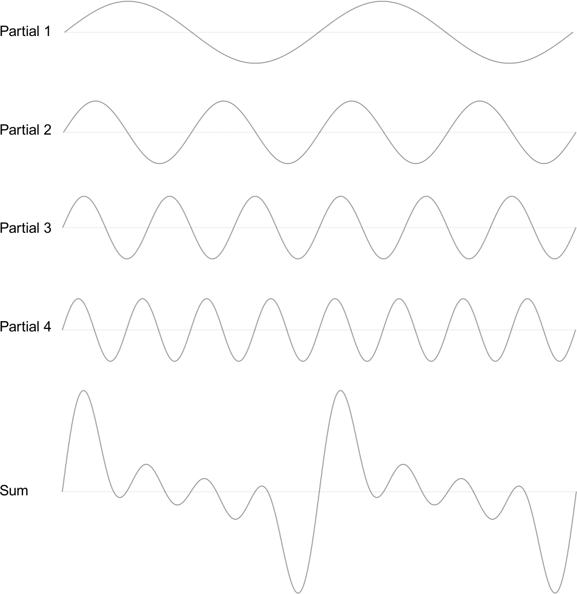
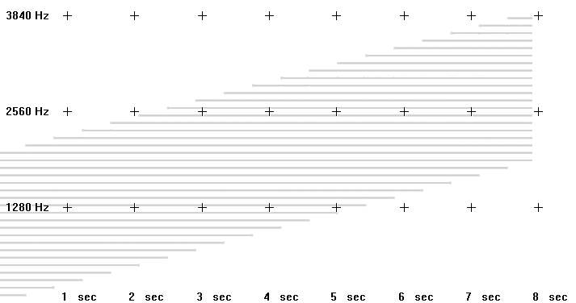

04 A. ADDITIVE SYNTHESIS
========================

Jean Baptiste Joseph Fourier (1768-1830) claimed in this treatise
*Théorie analytique de la chaleur* (1822) that any periodic function
can be described perfectly as a sum of weighted sine waves.
The frequencies of these *harmonics* are integer multiples of the fundamental frequency.

As we can easily produce sine waves of different amplitudes in digital sound synthesis,
the *Fourier Synthesis* or *Additive Synthesis* may sound the universal key for
creating interesting sounds. But first, not all sounds are periodic.
*Noise* as very important part of the sounding world represents the other pole
which is essentially non-periodic. And dealing with single sine waves means
dealing with a lot of data and reqirements.

Nonetheless, additive synthesis can provide unusual and interesting
sounds and the power of modern computers and their ability to manage
data in a programming language offers new dimensions of working with
this old technique. As with most things in Csound there are several ways
to go about implementing additive synthesis. We shall endeavour to
introduce some of them and to allude to how they relate to different
programming paradigms.

Main Parameters of Additive Synthesis
-------------------------------------

Before examining various methods of implementing additive synthesis in
Csound, we shall first consider what parameters might be required. As
additive synthesis involves the addition of multiple sine generators,
the parameters we use will operate on one of two different levels:

-   **For each sine**, there will be a frequency and an amplitude with
    an envelope.
-   -   The **frequency** will usually be a constant value, but it can
        be varied and in fact natural sounds typically exhibit slight
        modulations of partial frequencies.
    -   The **amplitude** must have at least a simple envelope such as
        the well-known ADSR but more complex methods of continuously
        altering the amplitude will result in a livelier sound.

-   **For the sound as an entirety**, the relevant parameters are:
-   -   The total **number of sinusoids**. A sound which consists of
        just three sinusoids will most likely sound poorer than one
        which employs 100.
    -   The **frequency ratios** of the sine generators. For a classic
        harmonic spectrum, the multipliers of the sinusoids are 1, 2, 3,
        ... (If your first sine is 100 Hz, the others will be 200, 300,
        400, ... Hz.) An inharmonic or noisy spectrum will probably
        have no simple integer ratios. These frequency ratios are
        chiefly responsible for our perception of timbre.
    -   The **base frequency** is the frequency of the first partial. If
        the partials are exhibiting a harmonic ratio, this frequency (in
        the example given 100 Hz) is also the overall perceived pitch.
    -   The **amplitude ratios** of the sinusoids. This is also very
        important in determining the resulting timbre of a sound. If the
        higher partials are relatively strong, the sound will be
        perceived as being more "brilliant"; if the higher partials
        are soft, then the sound will be perceived as being dark and
        soft.
    -   The **duration ratios** of the sinusoids. In simple additive
        synthesis, all single sines have the same duration, but it will
        be more interesting if they differ - this will usually relate to
        the durations of the envelopes: if the envelopes of different
        partials vary, some partials will die away faster than others.

It is not always the aim of additive synthesis to imitate natural
sounds, but the task of first analysing and then attempting to imitate a
sound can prove to be very useful when studying additive synthesis. This
is what a guitar note looks like when spectrally analysed:

Each partial possesses its own frequency movement and duration. We may
or may not be able to achieve this successfully using additive
synthesis. We will begin with some simple sounds and consider how to go
about programming this in Csound. Later we will look at some more
complex sounds and the more advanced techniques required to synthesize
them.

Different Methods for Additive Synthesis
----------------------------------------

### Simple Additions of Sinusoids Inside an Instrument

If additive synthesis amounts to simply adding together sine generators,
it is therefore straightforward to implement this by creating multiple
oscillators in a single instrument and adding their outputs together. In
the following example, instrument 1 demonstrates the creation of a
harmonic spectrum, and instrument 2 an inharmonic one. Both instruments
share the same amplitude multipliers: 1, 1/2, 1/3, 1/4, ... and receive
the base frequency in Csound's pitch notation (octave.semitone) and the
main amplitude in dB.

   ***EXAMPLE 04A01_AddSynth_simple.csd***

~~~csound
<CsoundSynthesizer>
<CsOptions>
-o dac
</CsOptions>
<CsInstruments>
sr = 44100
ksmps = 32
nchnls = 2
0dbfs = 1

    instr 1 ;harmonic additive synthesis
;receive general pitch and volume from the score
ibasefrq  =         cpspch(p4) ;convert pitch values to frequency
ibaseamp  =         ampdbfs(p5) ;convert dB to amplitude
;create 8 harmonic partials
aOsc1     poscil    ibaseamp, ibasefrq
aOsc2     poscil    ibaseamp/2, ibasefrq*2
aOsc3     poscil    ibaseamp/3, ibasefrq*3
aOsc4     poscil    ibaseamp/4, ibasefrq*4
aOsc5     poscil    ibaseamp/5, ibasefrq*5
aOsc6     poscil    ibaseamp/6, ibasefrq*6
aOsc7     poscil    ibaseamp/7, ibasefrq*7
aOsc8     poscil    ibaseamp/8, ibasefrq*8
;apply simple envelope
kenv      linen     1, p3/4, p3, p3/4
;add partials and write to output
aOut = aOsc1 + aOsc2 + aOsc3 + aOsc4 + aOsc5 + aOsc6 + aOsc7 + aOsc8
          outs      aOut*kenv, aOut*kenv
    endin

    instr 2 ;inharmonic additive synthesis
ibasefrq  =         cpspch(p4)
ibaseamp  =         ampdbfs(p5)
;create 8 inharmonic partials
aOsc1     poscil    ibaseamp, ibasefrq
aOsc2     poscil    ibaseamp/2, ibasefrq*1.02
aOsc3     poscil    ibaseamp/3, ibasefrq*1.1
aOsc4     poscil    ibaseamp/4, ibasefrq*1.23
aOsc5     poscil    ibaseamp/5, ibasefrq*1.26
aOsc6     poscil    ibaseamp/6, ibasefrq*1.31
aOsc7     poscil    ibaseamp/7, ibasefrq*1.39
aOsc8     poscil    ibaseamp/8, ibasefrq*1.41
kenv      linen     1, p3/4, p3, p3/4
aOut = aOsc1 + aOsc2 + aOsc3 + aOsc4 + aOsc5 + aOsc6 + aOsc7 + aOsc8
          outs aOut*kenv, aOut*kenv
    endin

</CsInstruments>
<CsScore>
;          pch       amp
i 1 0 5    8.00      -13
i 1 3 5    9.00      -17
i 1 5 8    9.02      -15
i 1 6 9    7.01      -15
i 1 7 10   6.00      -13
s
i 2 0 5    8.00      -13
i 2 3 5    9.00      -17
i 2 5 8    9.02      -15
i 2 6 9    7.01      -15
i 2 7 10   6.00      -13
</CsScore>
</CsoundSynthesizer>
;example by Andrés Cabrera
~~~

### Simple Additions of Sinusoids via the Score

A typical paradigm in programming: if you are repeating lines of code
with just minor variations, consider abstracting it in some way. In the
Csound language this could mean moving parameter control to the score.
In our case, the lines

    aOsc1     poscil    ibaseamp, ibasefrq
    aOsc2     poscil    ibaseamp/2, ibasefrq*2
    aOsc3     poscil    ibaseamp/3, ibasefrq*3
    aOsc4     poscil    ibaseamp/4, ibasefrq*4
    aOsc5     poscil    ibaseamp/5, ibasefrq*5
    aOsc6     poscil    ibaseamp/6, ibasefrq*6
    aOsc7     poscil    ibaseamp/7, ibasefrq*7
    aOsc8     poscil    ibaseamp/8, ibasefrq*8

could be abstracted to the form

    aOsc     poscil    ibaseamp*iampfactor, ibasefrq*ifreqfactor

with the parameters *iampfactor* (the relative amplitude of a partial)
and *ifreqfactor* (the frequency multiplier) being transferred to the
score as *p-fields*.

The next version of the previous instrument, simplifies the instrument
code and defines the variable values as score parameters:

   ***EXAMPLE 04A02_AddSynth_score.csd***

~~~csound
<CsoundSynthesizer>
<CsOptions>
-o dac
</CsOptions>
<CsInstruments>
sr = 44100
ksmps = 32
nchnls = 2
0dbfs = 1

giSine    ftgen     0, 0, 2^10, 10, 1

    instr 1
iBaseFreq =         cpspch(p4)
iFreqMult =         p5 ;frequency multiplier
iBaseAmp  =         ampdbfs(p6)
iAmpMult  =         p7 ;amplitude multiplier
iFreq     =         iBaseFreq * iFreqMult
iAmp      =         iBaseAmp * iAmpMult
kEnv      linen     iAmp, p3/4, p3, p3/4
aOsc      poscil    kEnv, iFreq, giSine
          outs      aOsc, aOsc
    endin

</CsInstruments>
<CsScore>
;          freq      freqmult  amp       ampmult
i 1 0 7    8.09      1         -10       1
i . . 6    .         2         .         [1/2]
i . . 5    .         3         .         [1/3]
i . . 4    .         4         .         [1/4]
i . . 3    .         5         .         [1/5]
i . . 3    .         6         .         [1/6]
i . . 3    .         7         .         [1/7]
s
i 1 0 6    8.09      1.5       -10       1
i . . 4    .         3.1       .         [1/3]
i . . 3    .         3.4       .         [1/6]
i . . 4    .         4.2       .         [1/9]
i . . 5    .         6.1       .         [1/12]
i . . 6    .         6.3       .         [1/15]
</CsScore>
</CsoundSynthesizer>
;example by Andrés Cabrera and Joachim Heintz
~~~

You might ask: "Okay, where is the simplification? There are even more
lines than before!" This is true, but this still represents better
coding practice. The main benefit now is *flexibility*. Now we are able
to realise any number of partials using the same instrument, with any
amplitude, frequency and duration ratios. Using the Csound score
abbreviations (for instance a dot for repeating the previous value in
the same p-field), you can make great use of copy-and-paste, and focus
just on what is changing from line to line.

Note that you are now calling **one instrument multiple times** in the
creation of a single additive synthesis note, in fact, each instance of
the instrument contributes just one partial to the additive tone.
Calling multiple instances of one instrument in this way also represents
good practice in Csound coding. We will discuss later how this end can
be achieved in a more elegant way.

### Creating Function Tables for Additive Synthesis

Before we continue, let us return to the first example and discuss a
classic and abbreviated method for playing a number of partials. As we
mentioned at the beginning, Fourier stated that any periodic oscillation
can be described using a sum of simple sinusoids. If the single
sinusoids are static (with no individual envelopes, durations or
frequency fluctuations), the resulting waveform will be similarly
static.

{width=60%}

Above you see four sine waves, each with fixed frequency and amplitude
relationships. These are then mixed together with the resulting waveform
illustrated at the bottom (*Sum*). This then begs the question: why not
simply calculate this composite waveform first, and then read it with
just a single oscillator?

This is what some Csound GEN routines do. They compose the resulting
shape of the periodic waveform, and store the values in a function
table. [GEN10](http://www.csound.com/docs/manual/GEN10.html) can be
used for creating a waveform consisting of harmonically related
partials. Its form begins with the common GEN routine p-fields

    <table number>, <creation time>, <size in points>, <GEN number>

following which you just have to define the relative strengths of the
harmonics. [GEN09](http://www.csound.com/docs/manual/GEN09.html) is
more complex and allows you to also control the frequency multiplier and
the phase (0-360°) of each partial. Thus we are able to reproduce the
first example in a shorter (and computationally faster) form:

   ***EXAMPLE 04A03_AddSynth_GEN.csd***

~~~csound
<CsoundSynthesizer>
<CsOptions>
-o dac
</CsOptions>
<CsInstruments>
sr = 44100
ksmps = 32
nchnls = 2
0dbfs = 1

giSine    ftgen     0, 0, 2^10, 10, 1
giHarm    ftgen     1, 0, 2^12, 10, 1, 1/2, 1/3, 1/4, 1/5, 1/6, 1/7, 1/8
giNois    ftgen     2, 0, 2^12, 9, 100,1,0,  102,1/2,0,  110,1/3,0, \
                 123,1/4,0,  126,1/5,0,  131,1/6,0,  139,1/7,0,  141,1/8,0

    instr 1
iBasFreq  =         cpspch(p4)
iTabFreq  =         p7 ;base frequency of the table
iBasFreq  =         iBasFreq / iTabFreq
iBaseAmp  =         ampdb(p5)
iFtNum    =         p6
aOsc      poscil    iBaseAmp, iBasFreq, iFtNum
aEnv      linen     aOsc, p3/4, p3, p3/4
          outs      aEnv, aEnv
    endin

</CsInstruments>
<CsScore>
;          pch       amp       table      table base (Hz)
i 1 0 5    8.00      -10       1          1
i . 3 5    9.00      -14       .          .
i . 5 8    9.02      -12       .          .
i . 6 9    7.01      -12       .          .
i . 7 10   6.00      -10       .          .
s
i 1 0 5    8.00      -10       2          100
i . 3 5    9.00      -14       .          .
i . 5 8    9.02      -12       .          .
i . 6 9    7.01      -12       .          .
i . 7 10   6.00      -10       .          .
</CsScore>
</CsoundSynthesizer>
;example by Andrés Cabrera and Joachim Heintz
~~~

You maybe noticed that to store a waveform in which the partials are not
harmonically related, the table must be constructed in a slightly
special way (see table *giNois*). If the frequency multipliers in our
first example started with 1 and 1.02, the resulting period is actually
very long. If the oscillator was playing at 100 Hz, the tone it would
produce would actually contain partials at 100 Hz and 102 Hz. So you
need 100 cycles from the 1.00 multiplier and 102 cycles from the 1.02
multiplier to complete one period of the composite waveform. In other
words, we have to create a table which contains respectively 100 and 102
periods, instead of 1 and 1.02. Therefore the table frequencies will not
be related to 1 as usual but instead to 100. This is the reason that we
have to introduce a new parameter, *iTabFreq*, for this purpose. (N.B.
In this simple example we could actually reduce the ratios to 50 and 51
as 100 and 102 share a common denominator of 2.)

This method of composing waveforms can also be used for generating four
standard waveform shapes typically encountered in vintage synthesizers.
An **impulse** wave can be created by adding a number of harmonics of
the same strength. A **sawtooth** wave has the amplitude multipliers 1,
1/2, 1/3, ... for the harmonics. A **square** wave has the same
multipliers, but just for the odd harmonics. A **triangle** can be
calculated as 1 divided by the square of the odd partials, with swapping
positive and negative values. The next example creates function tables
with just the first ten partials for each of these waveforms.

   ***EXAMPLE 04A04_Standard_waveforms.csd***

~~~csound
<CsoundSynthesizer>
<CsOptions>
-o dac
</CsOptions>
<CsInstruments>
sr = 44100
ksmps = 32
nchnls = 2
0dbfs = 1

giImp  ftgen  1, 0, 4096, 10, 1, 1, 1, 1, 1, 1, 1, 1, 1, 1
giSaw  ftgen  2, 0, 4096, 10, 1,-1/2,1/3,-1/4,1/5,-1/6,1/7,-1/8,1/9,-1/10
giSqu  ftgen  3, 0, 4096, 10, 1, 0, 1/3, 0, 1/5, 0, 1/7, 0, 1/9, 0
giTri  ftgen  4, 0, 4096, 10, 1, 0, -1/9, 0, 1/25, 0, -1/49, 0, 1/81, 0

instr 1
asig   poscil .2, 457, p4
       outs   asig, asig
endin

</CsInstruments>
<CsScore>
i 1 0 3 1
i 1 4 3 2
i 1 8 3 3
i 1 12 3 4
</CsScore>
</CsoundSynthesizer>
;example by joachim heintz
~~~

### Triggering Instrument Events for the Partials

Performing additive synthesis by designing partial strengths into
function tables has the disadvantage that once a note has begun there is
no way of varying the relative strengths of individual partials. There
are various methods to circumvent the inflexibility of table-based
additive synthesis such as morphing between several tables (for example
by using the [ftmorf](http://www.csound.com/docs/manual/ftmorf.html)
opcode) or by filtering the result. Next we shall consider another
approach: triggering one instance of a sub-instrument^[This term is
used here in a general manner. There is also a Csound opcode
[subinstr](https://csound.com/docs/manual/subinstr.html),
which has some more specific meanings.] for each
partial, and exploring the possibilities of creating a spectrally
dynamic sound using this technique.

Let us return to the second instrument (04A02.csd) which had already
made use of some abstractions and triggered one instrument instance for
each partial. This was done in the score, but now we will trigger one
complete note in one score line, not just one partial. The first step is
to assign the desired number of partials via a score parameter. The next
example triggers any number of partials using this one value:

   ***EXAMPLE 04A05_Flexible_number_of_partials.csd***

~~~csound
<CsoundSynthesizer>
<CsOptions>
-o dac
</CsOptions>
<CsInstruments>
sr = 44100
ksmps = 32
nchnls = 2
0dbfs = 1

instr 1 ;master instrument
inumparts =         p4 ;number of partials
ibasfreq  =         200 ;base frequency
ipart     =         1 ;count variable for loop
;loop for inumparts over the ipart variable
;and trigger inumpartss instanes of the subinstrument
loop:
ifreq     =         ibasfreq * ipart
iamp      =         1/ipart/inumparts
          event_i   "i", 10, 0, p3, ifreq, iamp
          loop_le   ipart, 1, inumparts, loop
endin

instr 10 ;subinstrument for playing one partial
ifreq     =         p4 ;frequency of this partial
iamp      =         p5 ;amplitude of this partial
aenv      transeg   0, .01, 0, iamp, p3-0.1, -10, 0
apart     poscil    aenv, ifreq
          outs      apart, apart
endin

</CsInstruments>
<CsScore>
;         number of partials
i 1 0 3   10
i 1 3 3   20
i 1 6 3   2
</CsScore>
</CsoundSynthesizer>
;Example by joachim heintz
~~~

This instrument can easily be transformed to be played via a midi
keyboard. In the next the midi key velocity will map to the number of
synthesized partials played to implement a brightness control.

   ***EXAMPLE 04A06_Play_it_with_Midi.csd***

~~~csound
<CsoundSynthesizer>
<CsOptions>
-o dac -Ma
</CsOptions>
<CsInstruments>
sr = 44100
ksmps = 32
nchnls = 2
0dbfs = 1

          massign   0, 1 ;all midi channels to instr 1

instr 1 ;master instrument
ibasfreq  cpsmidi       ;base frequency
iampmid   ampmidi   20 ;receive midi-velocity and scale 0-20
inparts   =         int(iampmid)+1 ;exclude zero
ipart     =         1 ;count variable for loop
;loop for inparts over the ipart variable
;and trigger inparts instances of the sub-instrument
loop:
ifreq     =         ibasfreq * ipart
iamp      =         1/ipart/inparts
          event_i   "i", 10, 0, 1, ifreq, iamp
          loop_le   ipart, 1, inparts, loop
endin

instr 10 ;subinstrument for playing one partial
ifreq     =         p4 ;frequency of this partial
iamp      =         p5 ;amplitude of this partial
aenv      transeg   0, .01, 0, iamp, p3-.01, -3, 0
apart     poscil    aenv, ifreq
          outs      apart/3, apart/3
endin

</CsInstruments>
<CsScore>

</CsScore>
</CsoundSynthesizer>
;Example by Joachim Heintz
~~~

Although this instrument is rather primitive it is useful to be able to
control the timbre in this way using key velocity. Let us continue to
explore some other methods of creating parameter variation in additive
synthesis.

### Applying User-controlled Random Variations

Natural sounds exhibit constant movement and change in the parameters we
have so far discussed. Even the best player or singer will not be able
to play a note in the exact same way twice and within a tone, the
partials will have some unsteadiness: slight waverings in the amplitudes
and slight frequency fluctuations. In an audio programming environment
like Csound, we can imitate these movements by employing random
deviations. The boundaries of random deviations must be adjusted as
carefully. Exaggerate them and the result will be unnatural or like a
bad player. The rates or speeds of these fluctuations will also need to
be chosen carefully and sometimes we need to modulate the rate of
modulation in order to achieve naturalness.

Let us start with some random deviations in our subinstrument. The
following parameters can be affected:

-   The **frequency** of each partial can be slightly detuned. The range
    of this possible maximum detuning can be set in cents (100 cent = 1
    semitone).
-   The **amplitude** of each partial can be altered relative to its
    default value. This alteration can be measured in decibels (dB).
-   The **duration** of each partial can be made to be longer or shorter
    than the default value. Let us define this deviation as a
    percentage. If the expected duration is five seconds, a maximum
    deviation of 100% will mean a resultant value of between half the
    duration (2.5 sec) and double the duration (10 sec).

The following example demonstrates the effect of these variations. As a
base - and as a reference to its author - we take as our starting point,
the *bell-like* sound created by Jean-Claude Risset in his *Sound
Catalogue*.^[Jean-Claude Risset, Introductory Catalogue of Computer Synthesized
Sounds (1969), cited after Dodge/Jerse, Computer Music, New York/London 1985, p.94]

   ***EXAMPLE 04A07_Risset_variations.csd***

~~~csound
<CsoundSynthesizer>
<CsOptions>
-o dac -m0
</CsOptions>
<CsInstruments>
sr = 44100
ksmps = 32
nchnls = 2
0dbfs = 1
seed 0

;frequency and amplitude multipliers for 11 partials of Risset's bell
giFqs[] fillarray  .56, .563, .92, .923, 1.19, 1.7, 2, 2.74, 3, 3.74, 4.07
giAmps[] fillarray 1, 2/3, 1, 1.8, 8/3, 5/3, 1.46, 4/3, 4/3, 1, 4/3
gSComments[] fillarray "unchanged sound", "slight variations in frequency",
      "slight variations in amplitude", "slight variations in duration",
      "slight variations combined", "heavy variations"
giCommentsIndx[] fillarray 0, 0, 1, 1, 1, 1, 2, 2, 2, 2, 3, 3, 3, 3,
       4, 4, 4, 4, 4, 4, 5, 5, 5, 5, 5, 5
giCommentsCounter init 0

instr 1 ;master instrument
ibasfreq  =         400
ifqdev    =         p4 ;maximum freq deviation in cents
iampdev   =         p5 ;maximum amp deviation in dB
idurdev   =         p6 ;maximum duration deviation in %
indx      =         0 ;count variable for loop
iMsgIndx  =         giCommentsIndx[giCommentsCounter]
puts gSComments[iMsgIndx], 1
giCommentsCounter += 1
while indx < 11 do
 ifqmult   =         giFqs[indx] ;get frequency multiplier from array
 ifreq     =         ibasfreq * ifqmult
 iampmult  =         giAmps[indx] ;get amp multiplier
 iamp      =         iampmult / 20 ;scale
          event_i   "i", 10, 0, p3, ifreq, iamp, ifqdev, iampdev, idurdev
 indx      +=        1
od
endin

instr 10 ;subinstrument for playing one partial
;receive the parameters from the master instrument
ifreqnorm =         p4 ;standard frequency of this partial
iampnorm  =         p5 ;standard amplitude of this partial
ifqdev    =         p6 ;maximum freq deviation in cents
iampdev   =         p7 ;maximum amp deviation in dB
idurdev   =         p8 ;maximum duration deviation in %
;calculate frequency
icent     random    -ifqdev, ifqdev ;cent deviation
ifreq     =         ifreqnorm * cent(icent)
;calculate amplitude
idb       random    -iampdev, iampdev ;dB deviation
iamp      =         iampnorm * ampdb(idb)
;calculate duration
idurperc  random    -idurdev, idurdev ;duration deviation (%)
iptdur    =         p3 * 2^(idurperc/100)
p3        =         iptdur ;set p3 to the calculated value
;play partial
aenv      transeg   0, .01, 0, iamp, p3-.01, -10, 0
apart     poscil    aenv, ifreq
          outs      apart, apart
endin

</CsInstruments>
<CsScore>
;         frequency   amplitude   duration
;         deviation   deviation   deviation
;         in cent     in dB       in %
;;unchanged sound (twice)
r 2
i 1 0 5   0           0           0
s
;;slight variations in frequency
r 4
i 1 0 5   25          0           0
;;slight variations in amplitude
r 4
i 1 0 5   0           6           0
;;slight variations in duration
r 4
i 1 0 5   0           0           30
;;slight variations combined
r 6
i 1 0 5   25          6           30
;;heavy variations
r 6
i 1 0 5   50          9           100
</CsScore>
</CsoundSynthesizer>
;Example by joachim heintz
~~~

In midi-triggered descendant of this instrument, we could - as one of
many possible options - vary the amount of possible random variation
according to the key velocity so that a key pressed softly plays the
bell-like sound as described by Risset but as a key is struck with
increasing force the sound produced will be increasingly altered.

   ***EXAMPLE 04A08_Risset_played_by_Midi.csd***

~~~csound
<CsoundSynthesizer>
<CsOptions>
-o dac -m0
</CsOptions>
<CsInstruments>
sr = 44100
ksmps = 32
nchnls = 2
0dbfs = 1
seed 0

;frequency and amplitude multipliers for 11 partials of Risset's bell
giFqs[] fillarray  .56, .563, .92, .923, 1.19, 1.7, 2, 2.74, 3, 3.74, 4.07
giAmps[] fillarray 1, 2/3, 1, 1.8, 8/3, 5/3, 1.46, 4/3, 4/3, 1, 4/3

massign 0, 1 ;all midi channels to instr 1

instr 1 ;master instrument
;;scale desired deviations for maximum velocity
;frequency (cent)
imxfqdv   =         100
;amplitude (dB)
imxampdv  =         12
;duration (%)
imxdurdv  =         100
;;get midi values
ibasfreq  cpsmidi       ;base frequency
iampmid   ampmidi   1 ;receive midi-velocity and scale 0-1
;;calculate maximum deviations depending on midi-velocity
ifqdev    =         imxfqdv * iampmid
iampdev   =         imxampdv * iampmid
idurdev   =         imxdurdv * iampmid
;;trigger subinstruments
indx      =          0
while indx < 11 do
 ifqmult   =         giFqs[indx]
 ifreq     =         ibasfreq * ifqmult
 iampmult  =         giAmps[indx]
 iamp      =         iampmult / 20 ;scale
          event_i   "i", 10, 0, 3, ifreq, iamp, ifqdev, iampdev, idurdev
 indx      +=        1
od
endin

instr 10 ;subinstrument for playing one partial
;receive the parameters from the master instrument
ifreqnorm =         p4 ;standard frequency of this partial
iampnorm  =         p5 ;standard amplitude of this partial
ifqdev    =         p6 ;maximum freq deviation in cents
iampdev   =         p7 ;maximum amp deviation in dB
idurdev   =         p8 ;maximum duration deviation in %
;calculate frequency
icent     random    -ifqdev, ifqdev ;cent deviation
ifreq     =         ifreqnorm * cent(icent)
;calculate amplitude
idb       random    -iampdev, iampdev ;dB deviation
iamp      =         iampnorm * ampdb(idb)
;calculate duration
idurperc  random    -idurdev, idurdev ;duration deviation (%)
iptdur    =         p3 * 2^(idurperc/100)
p3        =         iptdur ;set p3 to the calculated value
;play partial
aenv      transeg   0, .01, 0, iamp, p3-.01, -10, 0
apart     poscil    aenv, ifreq
          outs      apart, apart
endin

</CsInstruments>
<CsScore>

</CsScore>
</CsoundSynthesizer>
;example by joachim heintz
~~~

Whether you can play examples like this in realtime will depend on the
power of your computer. Have a look at chapter
[2D](02-d-live-audio.md) (Live Audio) for tips
on getting the best possible performance from your Csound orchestra.

### Using a Recursive UDO

A recursive User-Defines Opcode, as described in chapter [03 G](03-g-user-defined-opcodes.md), is an elegant way to accomplish the task of individually controlled partials in an additive synthesis. One instance of the UDO performs one partial. It calls the next instance recursively until the desired number of partials is there. The audio signals are added in the recursion.

The next example demonstrates this in transforming the Risset bell code (04A07) to this approach. The coding style is more condensed here, so some comments are added after the code.

   ***EXAMPLE 04A09_risset_bell_rec_udo.csd***

~~~csound
<CsoundSynthesizer>
<CsOptions>
-o dac -m128
</CsOptions>
<CsInstruments>
sr = 44100
ksmps = 32
nchnls = 2
0dbfs = 1
seed 0

opcode AddSynth,a,i[]i[]iooo
 /* iFqs[], iAmps[]: arrays with frequency ratios and amplitude multipliers
 iBasFreq: base frequency (hz)
 iPtlIndex: partial index (first partial = index 0)
 iFreqDev, iAmpDev: maximum frequency (cent) and amplitude (db) deviation */
 iFqs[], iAmps[], iBasFreq, iPtlIndx, iFreqDev, iAmpDev xin
 iFreq = iBasFreq * iFqs[iPtlIndx] * cent(rnd31:i(iFreqDev,0))
 iAmp = iAmps[iPtlIndx] * ampdb(rnd31:i(iAmpDev,0))
 aPartial poscil iAmp, iFreq
 if iPtlIndx < lenarray(iFqs)-1 then
  aPartial += AddSynth(iFqs,iAmps,iBasFreq,iPtlIndx+1,iFreqDev,iAmpDev)
 endif
 xout aPartial
endop

;frequency and amplitude multipliers for 11 partials of Risset's bell
giFqs[] fillarray  .56, .563, .92, .923, 1.19, 1.7, 2, 2.74, 3, 3.74, 4.07
giAmps[] fillarray 1, 2/3, 1, 1.8, 8/3, 5/3, 1.46, 4/3, 4/3, 1, 4/3

instr Risset_Bell
 ibasfreq = p4
 iamp = ampdb(p5)
 ifqdev = p6 ;maximum freq deviation in cents
 iampdev = p7 ;maximum amp deviation in dB
 aRisset AddSynth giFqs, giAmps, ibasfreq, 0, ifqdev, iampdev
 aRisset *= transeg:a(0, .01, 0, iamp/10, p3-.01, -10, 0)
 out aRisset, aRisset
endin

instr PlayTheBells
 iMidiPitch random 60,70
 schedule("Risset_Bell",0,random:i(2,8),mtof:i(iMidiPitch),
          random:i(-30,-10),30,6)
 if p4 > 0 then
  schedule("PlayTheBells",random:i(1/10,1/4),1,p4-1)
 endif
endin

</CsInstruments>
<CsScore>
;         base   db   frequency   amplitude
;         freq        deviation   deviation
;                      in cent     in dB
r 2 ;unchanged sound
i 1 0 5   400    -6   0           0
r 2 ;variations in frequency
i 1 0 5   400    -6   50          0
r 2 ;variations in amplitude
i 1 0 5   400    -6   0           10
s
i "PlayTheBells" 0 1 50 ;perform sequence of 50 bells
</CsScore>
</CsoundSynthesizer>
;example by joachim heintz
~~~

Some comments:

- Line 12-17: The main inputs are array with the frequencies *iFqs[]*, the array with the amplitudes *iAmps[]*, and the base frequency *iBasFreq*. The partial index *iPtlIndx* is by default zero, as well as the possible frequency and amplitude deviation of each partial.
- Line 18-19: The appropriate frequency and amplitude multiplier is selected from the array as `iFqs[iPtlIndx]` and `iAmps[iPtlIndx]`. The deviations are   calculated for each partial by the [rnd31](https://csound.com/docs/manual/rnd31.html) opcode, a bipolar random generator which by default seeds from  system clock.
- Line 21-23: The recursion is done if this is not the last partial. For the Risset bell it means: partials 0, 1, 2, ... are called until partial index 10. As index 10 is not smaller than the length of the frequency array (= 11) minus 1, it will not perform the recursion any more.
- Line 37: The envelope is applied for the sum of all partials (again in functional style, see chapter [03 I](03-i-functional-syntax.md)), as we don't use individual durations here.
- Line 41-47: The *PlayTheBells* instrument also uses recursion. It starts with p4=50 and calls the next instance of itself with p4=49, which in turn will call the next instance with p4=48, until 0 has been reached. The *Risset_Bell* instrument is scheduled with random values for duration, pitch and volume.

Csound Opcodes for Additive Synthesis
-------------------------------------

### gbuzz, buzz and GEN11

[gbuzz](http://www.csound.com/docs/manual/gbuzz.html) is useful for
creating additive tones made of harmonically related cosine waves.
Rather than define attributes for every partial individually,
*gbuzz* allows us to
define parameters that describe the entire additive tone in a more
general way: specifically the number of partials in the tone, the
partial number of the lowest partial present and an amplitude
coefficient multipler, which shifts the peak of spectral energy in the
tone. Although number of harmonics (knh) and lowest hamonic (klh) are
k-rate arguments, they are only interpreted as integers by the opcode;
therefore changes from integer to integer will result in discontinuities
in the output signal. The amplitude coefficient multiplier allows for
smooth spectral modulations however. Although we lose some control of
individual partials using gbuzz, we gain by being able to nimbly sculpt
the spectrum of the tone it produces.

In the following example a 100Hz tone is created, in which the number of
partials it contains rises from 1 to 20 across its 8 second duration. A
spectrogram/sonogram displays how this manifests spectrally. A linear
frequency scale is employed in the spectrogram so that harmonic partials
appear equally spaced.

   ***EXAMPLE 04A10_gbuzz.csd***

~~~csound
<CsoundSynthesizer>

<CsOptions>
-o dac
</CsOptions>

<CsInstruments>
sr = 44100
ksmps = 32
nchnls = 2
0dbfs = 1

; a cosine wave
gicos ftgen 0, 0, 2^10, 11, 1

 instr 1
knh  line  1, p3, 20  ; number of harmonics
klh  =     1          ; lowest harmonic
kmul =     1          ; amplitude coefficient multiplier
asig gbuzz 1, 100, knh, klh, kmul, gicos
     outs  asig, asig
 endin

</CsInstruments>

<CsScore>
i 1 0 8
e
</CsScore>

</CsoundSynthesizer>
;example by Iain McCurdy
~~~

The total number of partials only reaches 19 because the
[line](http://www.csound.com/docs/manual/line.html) function only
reaches 20 at the very conclusion of the note.

In the next example the number of partials contained within the tone
remains constant but the partial number of the lowest partial rises from
1 to 20.

   ***EXAMPLE 04A11_gbuzz_partials_rise.csd***

~~~csound
<CsoundSynthesizer>

<CsOptions>
-o dac
</CsOptions>

<CsInstruments>
sr = 44100
ksmps = 32
nchnls = 2
0dbfs = 1

; a cosine wave
gicos ftgen 0, 0, 2^10, 11, 1

 instr 1
knh  =     20
klh  line  1, p3, 20
kmul =     1
asig gbuzz 1, 100, knh, klh, kmul, gicos
     outs  asig, asig
 endin

</CsInstruments>

<CsScore>
i 1 0 8
e
</CsScore>

</CsoundSynthesizer>
;example by Iain McCurdy
~~~

In the spectrogram it can be seen how, as lowermost partials are
removed, additional partials are added at the top of the spectrum. This
is because the total number of partials remains constant at 20.

In the final *gbuzz*
example the amplitude coefficient multiplier rises from 0 to 2. It can
be heard (and seen in the spectrogram) how, when this value is zero,
emphasis is on the lowermost partial and when this value is 2, emphasis
is on the uppermost partial.

   ***EXAMPLE 04A12_gbuzz_amp_coeff_rise.csd***

~~~csound
<CsoundSynthesizer>

<CsOptions>
-o dac
</CsOptions>

<CsInstruments>
sr = 44100
ksmps = 32
nchnls = 2
0dbfs = 1

; a cosine wave
gicos ftgen 0, 0, 2^10, 11, 1

 instr 1
knh  =     20
klh  =     1
kmul line  0, p3, 2
asig gbuzz 1, 100, knh, klh, kmul, gicos
     outs  asig, asig
 endin

</CsInstruments>

<CsScore>
i 1 0 8
e
</CsScore>

</CsoundSynthesizer>
;example by Iain McCurdy
~~~

[buzz](http://www.csound.com/docs/manual/buzz.html) is a simplified
version of *gbuzz* with
fewer parameters -- it does not provide for modulation of the lowest
partial number and amplitude coefficient multiplier.

[GEN11](http://www.csound.com/docs/manual/GEN11.html) creates a
function table waveform using the same parameters as
*gbuzz*. If a *gbuss* tone is required
but no performance time modulation of its parameters is
needed, *GEN11* may
provide a more efficient option. *GEN11* also opens the
possibility of using its waveforms in a variety of other opcodes.
*gbuzz*, *buzz* and *GEN11* may also prove
useful as a source for subtractive synthesis.

### hsboscil

The opcode [hsboscil](http://www.csound.com/docs/manual/hsboscil.html)
offers an interesting method of additive synthesis in which all partials
are spaced an octave apart. Whilst this may at first seems limiting, it
does offer simple means for morphing the precise make up of its
spectrum. It can be thought of as producing a sound spectrum that
extends infinitely above and below the base frequency. Rather than
sounding all of the resultant partials simultaneously, a window
(typically a Hanning window) is placed over the spectrum, masking it so
that only one or several of these partials sound at any one time. The
user can shift the position of this window up or down the spectrum at
k-rate and this introduces the possibility of spectral morphing. *hsbosil*
refers to this control as *kbrite*. The width of the window can be
specified (but only at i-time) using its *iOctCnt* parameter. The
entire spectrum can also be shifted up or down, independent of the
location of the masking window using the *ktone* parameter, which can
be used to create a *Risset glissando*-type effect. The sense of the
interval of an octave between partials tends to dominate but this can be
undermined through the use of frequency shifting or by using a waveform
other than a sine wave as the source waveform for each partial.

In the next example, instrument 1 demonstrates the basic sound produced
by hsboscil whilst randomly modulating the location of the masking
window (kbrite) and the transposition control (ktone). Instrument 2
introduces frequency shifting (through the use of the hilbert opcode)
which adds a frequency value to all partials thereby warping the
interval between partials. Instrument 3 employs a more complex waveform
(pseudo-inharmonic) as the source waveform for the partials.

   ***EXAMPLE 04A13_hsboscil.csd***

~~~csound
<CsoundSynthesizer>
<CsOptions>
-o dac -m0
</CsOptions>
<CsInstruments>
sr = 44100
ksmps = 32
0dbfs = 1
nchnls = 2

giSine ftgen 0, 0, 2^10, 10, 1
; hanning window
giWindow ftgen 0, 0, 1024, -19, 1, 0.5, 270, 0.5
; a complex pseudo inharmonic waveform (partials scaled up X 100)
giWave ftgen 0, 0, 262144, 9, 100,1.000,0, 278,0.500,0, 518,0.250,0,
     816,0.125,0, 1166,0.062,0, 1564,0.031,0, 1910,0.016,0

instr 1 ; demonstration of hsboscil
kAmp = 0.3
kTone rspline -1,1,0.05,0.2 ; randomly shift spectrum up and down
kBrite rspline -1,3,0.4,2 ; randomly shift masking window up and down
iBasFreq = 200 ; base frequency
iOctCnt = 3 ; width of masking window
aSig hsboscil kAmp, kTone, kBrite, iBasFreq, giSine, giWindow, iOctCnt
out aSig, aSig
endin

instr 2 ; frequency shifting added
kAmp = 0.3
kTone = 0 ; spectrum remains static this time
kBrite rspline -2,5,0.4,2 ; randomly shift masking window up and down
iBasFreq = 75 ; base frequency
iOctCnt = 6 ; width of masking window
aSig hsboscil kAmp, kTone, kBrite, iBasFreq, giSine, giWindow, iOctCnt
; frequency shift the sound
kfshift = -357 ; amount to shift the frequency
areal,aimag hilbert aSig ; hilbert filtering
asin poscil 1, kfshift, giSine, 0 ; modulating signals
acos poscil 1, kfshift, giSine, 0.25
aSig = (areal*acos) - (aimag*asin) ; frequency shifted signal
out aSig, aSig
endin

instr 3 ; hsboscil using a complex waveform
kAmp = 0.3
kTone rspline -1,1,0.05,0.2 ; randomly shift spectrum up and down
kBrite rspline -3,3,0.1,1 ; randomly shift masking window
iBasFreq = 200
aSig hsboscil kAmp, kTone, kBrite, iBasFreq/100, giWave, giWindow
aSig2 hsboscil kAmp,kTone, kBrite, (iBasFreq*1.001)/100, giWave, giWindow
out aSig+aSig2, aSig+aSig2 ; mix signal with \'detuned\' version
endin

</CsInstruments>
<CsScore>
i 1 0 14
i 2 15 14
i 3 30 14
</CsScore>
</CsoundSynthesizer>
;example by iain mccurdy
~~~

Additive synthesis can still be an exciting way of producing sounds. It
offers the user a level of control that other methods of synthesis
simply cannot match. It also provides an essential workbench for
learning about acoustics and spectral theory as related to sound.
