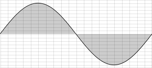
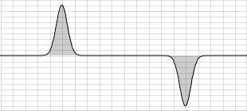
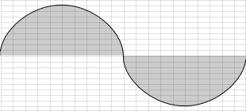
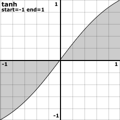
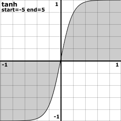

04 E. WAVESHAPING
=================

Waveshaping is in some ways a relation of modulation techniques such as
frequency or phase modulation. Waveshaping can create quite dramatic
sound transformations through the application of a very simple process.
In FM (frequency modulation) modulation synthesis occurs between two
oscillators, waveshaping is implemented using a single oscillator
(usually a simple sine oscillator) and a so-called *transfer
function*. The transfer function transforms and shapes the incoming
amplitude values using a simple look-up process: if the incoming value
is x, the outgoing value becomes y. This can be written as a table with
two columns. Here is a simple example:

  -------------------------- --------------------------
    **Incoming (x) Value**     **Outgoing (y) Value**
  -0.5 or lower               -1
   between -0.5 and 0.5       remain unchanged
   0.5 or higher              1
  -------------------------- --------------------------

 

 

Illustrating this in an x/y coordinate system results in the following
graph:

 

Basic Implementation Model
--------------------------

Although Csound contains several opcodes for waveshaping, implementing
waveshaping from first principles as Csound code is fairly
straightforward. The x-axis is the amplitude of every single sample,
which is in the range of -1 to +1. This number has to be used as index
to a table which stores the transfer function. To create a table like
the one above, you can use Csound's sub-routine 
[GEN07](https://csound.com/docs/manual/GEN07.html). 
This statement will create a table of 4096 points with the desired shape:

    giTrnsFnc ftgen 0, 0, 4096, -7, -0.5, 1024, -0.5, 2048, 0.5, 1024, 0.5

 

Now two problems must be solved. First, the index of the function table
is not -1 to +1. Rather, it is either 0 to 4095 in the raw index mode,
or 0 to 1 in the normalized mode. The simplest solution is to use the
normalized index and scale the incoming amplitudes, so that an amplitude
of -1 becomes an index of 0, and an amplitude of 1 becomes an index of
1:

    aIndx = (aAmp + 1) / 2

The other problem stems from the difference in the accuracy of possible
values in a sample and in a function table. Every single sample is
encoded in a 32-bit floating point number in standard audio applications
- or even in a 64-bit float in Csound. A table with 4096 points
results in a 12-bit number, so you will have a serious loss of accuracy
(= sound quality) if you use the table values directly. Here, the
solution is to use an interpolating table reader. The opcode
[tablei](https://csound.com/docs/manual/tablei.html) (instead of
[table](https://csound.com/docs/manual/table.html)) does this job.
This opcode then needs an extra point in the table for interpolating, so
we give 4097 as the table size instead of 4096. 

This is the code for simple waveshaping using our transfer function
which has been discussed previously:

   ***EXAMPLE 04E01_Simple_waveshaping.csd***

~~~
<CsoundSynthesizer>
<CsOptions>
-odac
</CsOptions>
<CsInstruments>
sr = 44100
ksmps = 32
nchnls = 2
0dbfs = 1

giTrnsFnc ftgen 0, 0, 4097, -7, -0.5, 1024, -0.5, 2048, 0.5, 1024, 0.5
giSine    ftgen 0, 0, 1024, 10, 1

instr 1
aAmp      poscil    1, 400, giSine
aIndx     =         (aAmp + 1) / 2
aWavShp   tablei    aIndx, giTrnsFnc, 1
          out       aWavShp, aWavShp
endin

</CsInstruments>
<CsScore>
i 1 0 10
</CsScore>
</CsoundSynthesizer>
;example by joachim heintz
~~~

Powershape
----------

The [powershape](https://csound.com/docs/manual/powershape.html)
opcode performs waveshaping by simply raising all samples to the power
of a user given exponent. Its main innovation is that the polarity of
samples within the negative domain will be retained. It simply performs
the power function on absolute values (negative values made positive)
and then reinstates the minus sign if required. It also normalises the
input signal between -1 and 1 before shaping and then rescales the
output by the inverse of whatever multiple was required to normalise the
input. This ensures useful results but does require that the user states
the maximum amplitude value expected in the opcode declaration and
thereafter abide by that limit. The exponent, which the opcode refers to
as *shape amount*, can be varied at k-rate thereby facilitating the
creation of dynamic spectra upon a constant spectrum input.

If we consider the simplest possible input - again a sine wave - a shape
amount of *1* will produce no change (raising any value to the power
of 1 leaves that value unchanged).

A shaping amount of 2.5 will visibly "squeeze" the waveform as values
less than 1 become increasingly biased towards the zero axis.

 

Much higher values will narrow the positive and negative peaks further.
Below is the waveform resulting from a shaping amount of 50.

 

Shape amounts less than 1 (but greater than zero) will give the opposite
effect of drawing values closer to -1 or 1. The waveform resulting from
a shaping amount of 0.5 shown below is noticeably more rounded than the
sine wave input.

 

Reducing shape amount even closer to zero will start to show squaring of
the waveform. The result of a shape amount of 0.1 is shown below.

The sonograms of the five examples shown above are as shown below:

As power (shape amount) is increased from 1 through 2.5 to 50, it can be
observed how harmonic partials are added. It is worth noting also that
when the power exponent is 50 the strength of the fundamental has waned
somewhat. What is not clear from the sonogram is that the partials
present are only the odd numbered ones. As the power exponent is reduced
below 1 through 0.5 and finally 0.1, odd numbered harmonic partials
again appear but this time the strength of the fundamental remains
constant. It can also be observed that aliasing is becoming a problem as
evidenced by the vertical artifacts in the sonograms for 0.5 and in
particular 0.1. This is a significant concern when using waveshaping
techniques. Raising the sampling rate can provide additional headroom
before aliasing manifests but ultimately subtlety in waveshaping's use
is paramount.

[TODO: Add csd example for what has been described.]

Distort
-------

The [distort](https://csound.com/docs/manual/distort.html) opcode,
authored by Csound's original creator Barry Vercoe, was originally part
of the *Extended Csound* project but was introduced into Canonical Csound
in version 5. It waveshapes an input signal according to a transfer
function provided by the user using a function table. At first glance
this may seem to offer little more than what we have already
demonstrated from first principles, but it offers a number of additional
features that enhance its usability. The input signal first has
soft-knee compression applied before being mapped through the transfer
function. Input gain is also provided via the *distortion amount*
input argument and this provides dynamic control of the waveshaping
transformation. The result of using compression means that spectrally
the results are better behaved than is typical with waveshaping. A
common transfer function would be the hyperbolic tangent (tanh)
function. Csound possesses an GEN routine
[GENtanh](https://csound.com/docs/manual/GENtanh.html) for the
creation of tanh functions:

    GENtanh
    f # time size "tanh" start end rescale

By adjusting the *start* and *end* values we can modify the shape of
the $tanh$ transfer function and therefore the aggressiveness of the
waveshaping (*start* and *end* values should be the same absolute
values and negative and positive respectively if we want the function to
pass through the origin from the lower left quadrant to the upper right
quadrant).

Start and end values of -1 and 1 will produce a gentle "s" curve.

This represents only a very slight deviation from a straight line
function from (-1,-1) to (1,1) - which would produce no distortion -
therefore the effects of the above used as a transfer function will be
extremely subtle.

Start and end points of -5 and 5 will produce a much more dramatic curve
and more dramatic waveshaping:

    f 1 0 1024 "tanh" -5 5 0

Note that the GEN routine's argument p7 for rescaling is set to zero
ensuring that the function only ever extends from -1 and 1. The values
provided for *start* and *end* only alter the shape.

In the following test example a sine wave at 200 hz is waveshaped using
distort and the tanh function shown above.

   ***EXAMPLE 04E02_Distort_1.csd*** 

~~~
<CsoundSynthesizer>
<CsOptions>
-dm0 -odac
</CsOptions>

<CsInstruments>

sr = 44100
ksmps =32
nchnls = 1
0dbfs = 1

giSine  ftgen   1,0,1025,10,1           ; sine function
giTanh  ftgen   2,0,257,"tanh",-10,10,0 ; tanh function

instr 1
 aSig  poscil   1, 200, giSine          ; a sine wave
 kAmt  line     0, p3, 1                ; rising distortion amount
 aDst  distort  aSig, kAmt, giTanh      ; distort the sine tone
       out      aDst*0.1
endin

</CsInstruments>
<CsScore>
i 1 0 4
</CsScore>
</CsoundSynthesizer>
;example by Iain McCurdy
~~~

The resulting sonogram looks like this:

As the distort amount is raised from zero to 1 it can be seen from the
sonogram how upper partials emerge and gain in strength. Only the odd
numbered partials are produced, therefore over the fundemental at 200 hz
partials are present at 600, 1000, 1400 hz and so on. If we want to
restore the even numbered partials we can simultaneously waveshape a
sine at 400 hz, one octave above the fundamental as in the next example:

   ***EXAMPLE 04E03_Distort_2.csd***

~~~
<CsoundSynthesizer>
<CsOptions>
-dm0 -odac
</CsOptions>
<CsInstruments>

sr = 44100
ksmps =32
nchnls = 1
0dbfs =    1

giSine    ftgen    1,0,1025,10,1
giTanh    ftgen   2,0,257,"tanh",-10,10,0

instr 1
 kAmt  line     0, p3, 1                 ; rising distortion amount
 aSig  poscil   1, 200, giSine           ; a sine
 aSig2 poscil   kAmt*0.8,400,giSine      ; a sine an octave above
 aDst  distort  aSig+aSig2, kAmt, giTanh ; distort a mixture of the two sines
       out      aDst*0.1
endin

</CsInstruments>

<CsScore>
i 1 0 4
</CsScore>
</CsoundSynthesizer>
;example by Iain McCurdy
~~~

The higher of the two sines is faded in using the distortion amount
control so that when distortion amount is zero we will be left with only
the fundamental. The sonogram looks like this:

What we hear this time is something close to a sawtooth waveform with a
rising low-pass filter. The higher of the two input sines at 400 hz will
produce overtones at 1200, 2000, 2800 ... thereby filling in the missing
partials.

