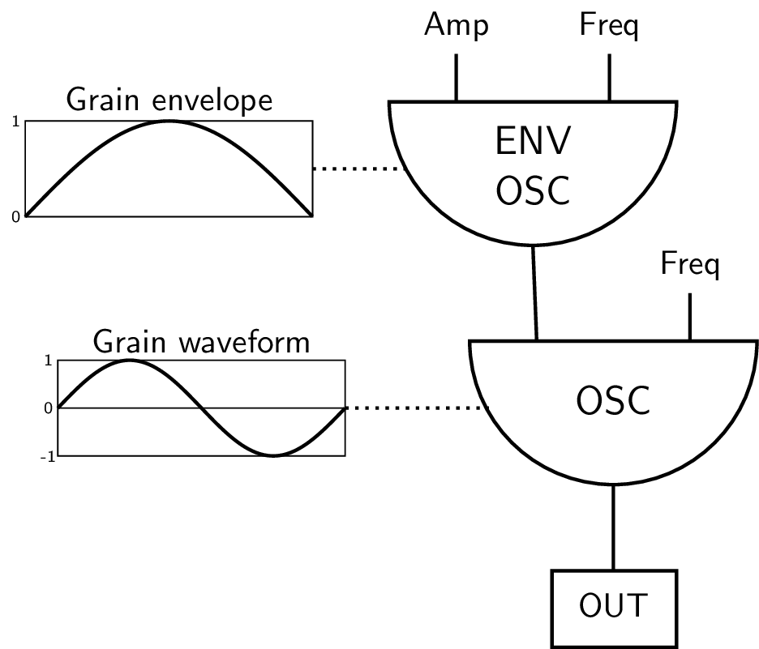

# 04 F. GRANULAR SYNTHESIS

In his _Computer Music Tutorial_, Curtis Roads gives an interesting introductory model for granular synthesis. A sine as source waveform is modified by a repeating envelope. Each envelope period creates one grain.

{width=50%}

In our introductory example, we will start with 1 Hz as frequency for the envelope opscillator, then rising to 10 Hz, then to 20, 50 and finally 300 Hz. The grain durations are therefore 1 second, then 1/10 second, then 1/20, 1/50 and 1/300 second. In a second run, we will use the same values, but add a random value to the frequency of the envelope generator, thus avoiding regularities.

#### **_EXAMPLE 04F01_GranSynthIntro.csd_**

```csound
<CsoundSynthesizer>
<CsOptions>
-o dac -m128
</CsOptions>
<CsInstruments>
sr = 44100
ksmps = 32
nchnls = 2
0dbfs = 1

giEnv ftgen 0, 0, 8192, 9, 1/2, 1, 0 ;half sine as envelope

instr EnvFreq
 printf "   Envelope frequency rising from %d to %d Hz\n", 1, p4, p5
 gkEnvFreq expseg p4, 3, p4, 2, p5
endin

instr GrainGenSync
 puts "\nSYNCHRONOUS GRANULAR SYNTHESIS", 1
 aEnv poscil .2, gkEnvFreq, giEnv
 aOsc poscil aEnv, 400
 aOut linen aOsc, .1, p3, .5
 out aOut, aOut
endin

instr GrainGenAsync
 puts "\nA-SYNCHRONOUS GRANULAR SYNTHESIS", 1
 aEnv poscil .2, gkEnvFreq+randomi:k(0,gkEnvFreq,gkEnvFreq), giEnv
 aOsc poscil aEnv, 400
 aOut linen aOsc, .1, p3, .5
 out aOut, aOut
endin

</CsInstruments>
<CsScore>
i "GrainGenSync" 0 30
i "EnvFreq" 0 5 1 10
i . + . 10 20
i . + . 20 50
i . + . 50 100
i . + . 100 300
b 31
i "GrainGenAsync" 0 30
i "EnvFreq" 0 5 1 10
i . + . 10 20
i . + . 20 50
i . + . 50 100
i . + . 100 300
</CsScore>
</CsoundSynthesizer>
;example by joachim heintz
```

We hear different characteristics, due to the regular or irregular sequence of the grains. To understand what happens, we will go deeper in this matter and advance to a more flexible model for grain generation.

## Concept Behind Granular Synthesis

Granular synthesis can in general be described as a technique in which a source sound or waveform is
broken into many fragments, often of very short duration, which are then
restructured and rearranged according to various patterning and
indeterminacy functions.

If we
repeat a fragment of sound with regularity, there are
two principle attributes that we are most concerned
with. Firstly the duration of each sound grain is significant: if the
grain duration if very small, typically less than 0.02 seconds, then
less of the characteristics of the source sound will be evident. If the
grain duration is greater than 0.02 then more of the character of the
source sound or waveform will be evident. Secondly the rate at which
grains are generated will be significant: if grain generation is below
20 Hertz, i.e. less than 20 grains per second, then the stream of grains
will be perceived as a rhythmic pulsation; if rate of grain generation
increases beyond 20 Hz then individual grains will be harder to
distinguish and instead we will begin to perceive a buzzing tone, the
fundamental of which will correspond to the frequency of grain
generation. Any pitch contained within the source material is not
normally perceived as the fundamental of the tone whenever grain
generation is periodic, instead the pitch of the source material or
waveform will be perceived as a resonance peak (sometimes referred to as
a formant); therefore transposition of the source material will result
in the shifting of this resonance peak.

## Granular Synthesis Demonstrated Using First Principles

The following example exemplifies the concepts discussed above. None of
Csound's built-in granular synthesis opcodes are used, instead
[schedkwhen](https://csound.com/docs/manual/schedkwhen.html) in
instrument 1 is used to precisely control the triggering of grains in
instrument 2. Three notes in instrument 1 are called from the score one
after the other which in turn generate three streams of grains in
instrument 2. The first note demonstrates the transition from pulsation
to the perception of a tone as the rate of grain generation extends
beyond 20 Hz. The second note demonstrates the loss of influence of the
source material as the grain duration is reduced below 0.02 seconds. The
third note demonstrates how shifting the pitch of the source material
for the grains results in the shifting of a resonance peak in the output
tone. In each case information regarding rate of grain generation,
duration and fundamental (source material pitch) is output to the
terminal every 1/2 second so that the user can observe the changing
parameters.

It should also be noted how the amplitude of each grain is enveloped in
instrument 2. If grains were left unenveloped they would likely produce
clicks on account of discontinuities in the waveform produced at the
beginning and ending of each grain.

Granular synthesis in which grain generation occurs with perceivable
periodicity is referred to as synchronous granular synthesis. Granular
synthesis in which this periodicity is not evident is referred to as
asynchronous granular synthesis.

#### **_EXAMPLE 04F02_GranSynth_basic.csd_**

```csound
<CsoundSynthesizer>
<CsOptions>
-odac -m0
</CsOptions>
<CsInstruments>

sr = 44100
ksmps = 1
nchnls = 1
0dbfs = 1

giSine  ftgen  0,0,4096,10,1

instr 1
  kRate  expon  p4,p3,p5   ; rate of grain generation
  kTrig  metro  kRate      ; a trigger to generate grains
  kDur   expon  p6,p3,p7   ; grain duration
  kForm  expon  p8,p3,p9   ; formant (spectral centroid)
   ;                      p1 p2 p3   p4
  schedkwhen    kTrig,0,0,2, 0, kDur,kForm ;trigger a note(grain) in instr 2
  ;print data to terminal every 1/2 second
  printks "Rate:%5.2F  Dur:%5.2F  Formant:%5.2F%n", 0.5, kRate , kDur, kForm
endin

instr 2
  iForm =       p4
  aEnv  linseg  0,0.005,0.2,p3-0.01,0.2,0.005,0
  aSig  poscil  aEnv, iForm, giSine
        out     aSig
endin

</CsInstruments>
<CsScore>
;p4 = rate begin
;p5 = rate end
;p6 = duration begin
;p7 = duration end
;p8 = formant begin
;p9 = formant end
; p1 p2 p3 p4 p5  p6   p7    p8  p9
i 1  0  30 1  100 0.02 0.02  400 400  ;demo of grain generation rate
i 1  31 10 10 10  0.4  0.01  400 400  ;demo of grain size
i 1  42 20 50 50  0.02 0.02  100 5000 ;demo of changing formant
e
</CsScore>
</CsoundSynthesizer>
;example by Iain McCurdy
```

## Granular Synthesis of Vowels: FOF

The principles outlined in the previous example can be extended to
imitate vowel sounds produced by the human voice. This type of granular
synthesis is referred to as FOF (_fonction d'onde formatique_) synthesis
and is based on work by Xavier Rodet on his CHANT program at IRCAM.
Typically five synchronous granular synthesis streams will be used to
create five different resonant peaks in a fundamental tone in order to
imitate different vowel sounds expressible by the human voice. The most
crucial element in defining a vowel imitation is the degree to which the
source material within each of the five grain streams is transposed.
Bandwidth (essentially grain duration) and intensity (loudness) of each
grain stream are also important indicators in defining the resultant
sound.

Csound has a number of opcodes that make working with FOF synthesis
easier. We will be using [fof](https://csound.com/docs/manual/fof.html).

Information regarding frequency, bandwidth and intensity values that
will produce various vowel sounds for different voice types can be found
in the appendix of the Csound manual [here](https://csound.com/docs/manual/MiscFormants.html).
These values are stored in function tables in the FOF synthesis example.
GEN07, which produces linear break point envelopes, is chosen as we will
then be able to morph continuously between vowels.

#### **_EXAMPLE 04F03_Fof_vowels.csd_**

```csound
<CsoundSynthesizer>
<CsOptions>
-odac
</CsOptions>
<CsInstruments>
sr = 44100
ksmps = 16
nchnls = 2
0dbfs = 1

;FUNCTION TABLES STORING DATA FOR VARIOUS VOICE FORMANTS
;BASS
giBF1 ftgen 0, 0, -5, -2, 600,   400, 250,   400,  350
giBF2 ftgen 0, 0, -5, -2, 1040, 1620, 1750,  750,  600
giBF3 ftgen 0, 0, -5, -2, 2250, 2400, 2600, 2400, 2400
giBF4 ftgen 0, 0, -5, -2, 2450, 2800, 3050, 2600, 2675
giBF5 ftgen 0, 0, -5, -2, 2750, 3100, 3340, 2900, 2950

giBDb1 ftgen 0, 0, -5, -2,   0,   0,   0,   0,   0
giBDb2 ftgen 0, 0, -5, -2,  -7, -12, -30, -11, -20
giBDb3 ftgen 0, 0, -5, -2,  -9,  -9, -16, -21, -32
giBDb4 ftgen 0, 0, -5, -2,  -9, -12, -22, -20, -28
giBDb5 ftgen 0, 0, -5, -2, -20, -18, -28, -40, -36

giBBW1 ftgen 0, 0, -5, -2,  60,  40,  60,  40,  40
giBBW2 ftgen 0, 0, -5, -2,  70,  80,  90,  80,  80
giBBW3 ftgen 0, 0, -5, -2, 110, 100, 100, 100, 100
giBBW4 ftgen 0, 0, -5, -2, 120, 120, 120, 120, 120
giBBW5 ftgen 0, 0, -5, -2, 130, 120, 120, 120, 120

;TENOR
giTF1 ftgen 0, 0, -5, -2,  650,  400,  290,  400,  350
giTF2 ftgen 0, 0, -5, -2, 1080, 1700, 1870,  800,  600
giTF3 ftgen 0, 0, -5, -2, 2650, 2600, 2800, 2600, 2700
giTF4 ftgen 0, 0, -5, -2, 2900, 3200, 3250, 2800, 2900
giTF5 ftgen 0, 0, -5, -2, 3250, 3580, 3540, 3000, 3300

giTDb1 ftgen 0, 0, -5, -2,   0,   0,   0,   0,   0
giTDb2 ftgen 0, 0, -5, -2,  -6, -14, -15, -10, -20
giTDb3 ftgen 0, 0, -5, -2,  -7, -12, -18, -12, -17
giTDb4 ftgen 0, 0, -5, -2,  -8, -14, -20, -12, -14
giTDb5 ftgen 0, 0, -5, -2, -22, -20, -30, -26, -26

giTBW1 ftgen 0, 0, -5, -2,  80,  70,  40,  40,  40
giTBW2 ftgen 0, 0, -5, -2,  90,  80,  90,  80,  60
giTBW3 ftgen 0, 0, -5, -2, 120, 100, 100, 100, 100
giTBW4 ftgen 0, 0, -5, -2, 130, 120, 120, 120, 120
giTBW5 ftgen 0, 0, -5, -2, 140, 120, 120, 120, 120

;COUNTER TENOR
giCTF1 ftgen 0, 0, -5, -2,  660,  440,  270,  430,  370
giCTF2 ftgen 0, 0, -5, -2, 1120, 1800, 1850,  820,  630
giCTF3 ftgen 0, 0, -5, -2, 2750, 2700, 2900, 2700, 2750
giCTF4 ftgen 0, 0, -5, -2, 3000, 3000, 3350, 3000, 3000
giCTF5 ftgen 0, 0, -5, -2, 3350, 3300, 3590, 3300, 3400

giTBDb1 ftgen 0, 0, -5, -2,   0,   0,   0,   0,   0
giTBDb2 ftgen 0, 0, -5, -2,  -6, -14, -24, -10, -20
giTBDb3 ftgen 0, 0, -5, -2, -23, -18, -24, -26, -23
giTBDb4 ftgen 0, 0, -5, -2, -24, -20, -36, -22, -30
giTBDb5 ftgen 0, 0, -5, -2, -38, -20, -36, -34, -30

giTBW1 ftgen 0, 0, -5, -2, 80,   70,  40,  40,  40
giTBW2 ftgen 0, 0, -5, -2, 90,   80,  90,  80,  60
giTBW3 ftgen 0, 0, -5, -2, 120, 100, 100, 100, 100
giTBW4 ftgen 0, 0, -5, -2, 130, 120, 120, 120, 120
giTBW5 ftgen 0, 0, -5, -2, 140, 120, 120, 120, 120

;ALTO
giAF1 ftgen 0, 0, -5, -2,  800,  400,  350,  450,  325
giAF2 ftgen 0, 0, -5, -2, 1150, 1600, 1700,  800,  700
giAF3 ftgen 0, 0, -5, -2, 2800, 2700, 2700, 2830, 2530
giAF4 ftgen 0, 0, -5, -2, 3500, 3300, 3700, 3500, 2500
giAF5 ftgen 0, 0, -5, -2, 4950, 4950, 4950, 4950, 4950

giADb1 ftgen 0, 0, -5, -2,   0,   0,   0,   0,   0
giADb2 ftgen 0, 0, -5, -2,  -4, -24, -20,  -9, -12
giADb3 ftgen 0, 0, -5, -2, -20, -30, -30, -16, -30
giADb4 ftgen 0, 0, -5, -2, -36, -35, -36, -28, -40
giADb5 ftgen 0, 0, -5, -2, -60, -60, -60, -55, -64

giABW1 ftgen 0, 0, -5, -2, 50,   60,  50,  70,  50
giABW2 ftgen 0, 0, -5, -2, 60,   80, 100,  80,  60
giABW3 ftgen 0, 0, -5, -2, 170, 120, 120, 100, 170
giABW4 ftgen 0, 0, -5, -2, 180, 150, 150, 130, 180
giABW5 ftgen 0, 0, -5, -2, 200, 200, 200, 135, 200

;SOPRANO
giSF1 ftgen 0, 0, -5, -2,  800,  350,  270,  450,  325
giSF2 ftgen 0, 0, -5, -2, 1150, 2000, 2140,  800,  700
giSF3 ftgen 0, 0, -5, -2, 2900, 2800, 2950, 2830, 2700
giSF4 ftgen 0, 0, -5, -2, 3900, 3600, 3900, 3800, 3800
giSF5 ftgen 0, 0, -5, -2, 4950, 4950, 4950, 4950, 4950

giSDb1 ftgen 0, 0, -5, -2,   0,   0,   0,   0,   0
giSDb2 ftgen 0, 0, -5, -2,  -6, -20, -12, -11, -16
giSDb3 ftgen 0, 0, -5, -2, -32, -15, -26, -22, -35
giSDb4 ftgen 0, 0, -5, -2, -20, -40, -26, -22, -40
giSDb5 ftgen 0, 0, -5, -2, -50, -56, -44, -50, -60

giSBW1 ftgen 0, 0, -5, -2,  80,  60,  60,  70,  50
giSBW2 ftgen 0, 0, -5, -2,  90,  90,  90,  80,  60
giSBW3 ftgen 0, 0, -5, -2, 120, 100, 100, 100, 170
giSBW4 ftgen 0, 0, -5, -2, 130, 150, 120, 130, 180
giSBW5 ftgen 0, 0, -5, -2, 140, 200, 120, 135, 200

gisine ftgen 0, 0, 4096, 10, 1
giexp ftgen 0, 0, 1024, 19, 0.5, 0.5, 270, 0.5

instr 1
  kFund    expon     p4,p3,p5               ; fundemental
  kVow     line      p6,p3,p7               ; vowel select
  kBW      line      p8,p3,p9               ; bandwidth factor
  iVoice   =         p10                    ; voice select

  ; read formant cutoff frequenies from tables
  kForm1   tablei    kVow*5,giBF1+(iVoice*15)
  kForm2   tablei    kVow*5,giBF1+(iVoice*15)+1
  kForm3   tablei    kVow*5,giBF1+(iVoice*15)+2
  kForm4   tablei    kVow*5,giBF1+(iVoice*15)+3
  kForm5   tablei    kVow*5,giBF1+(iVoice*15)+4
  ; read formant intensity values from tables
  kDB1     tablei    kVow*5,giBF1+(iVoice*15)+5
  kDB2     tablei    kVow*5,giBF1+(iVoice*15)+6
  kDB3     tablei    kVow*5,giBF1+(iVoice*15)+7
  kDB4     tablei    kVow*5,giBF1+(iVoice*15)+8
  kDB5     tablei    kVow*5,giBF1+(iVoice*15)+9
  ; read formant bandwidths from tables
  kBW1     tablei    kVow*5,giBF1+(iVoice*15)+10
  kBW2     tablei    kVow*5,giBF1+(iVoice*15)+11
  kBW3     tablei    kVow*5,giBF1+(iVoice*15)+12
  kBW4     tablei    kVow*5,giBF1+(iVoice*15)+13
  kBW5     tablei    kVow*5,giBF1+(iVoice*15)+14
  ; create resonant formants using fof opcode
  koct     =         1
  aForm1   fof       ampdb(kDB1),kFund,kForm1,0,kBW1,0.003,0.02,0.007,\
                       1000,gisine,giexp,3600
  aForm2   fof       ampdb(kDB2),kFund,kForm2,0,kBW2,0.003,0.02,0.007,\
                       1000,gisine,giexp,3600
  aForm3   fof       ampdb(kDB3),kFund,kForm3,0,kBW3,0.003,0.02,0.007,\
                       1000,gisine,giexp,3600
  aForm4   fof       ampdb(kDB4),kFund,kForm4,0,kBW4,0.003,0.02,0.007,\
                       1000,gisine,giexp,3600
  aForm5   fof       ampdb(kDB5),kFund,kForm5,0,kBW5,0.003,0.02,0.007,\
                       1000,gisine,giexp,3600

  ; formants are mixed
  aMix     sum       aForm1,aForm2,aForm3,aForm4,aForm5
  kEnv     linseg    0,3,1,p3-6,1,3,0     ; an amplitude envelope
           outs      aMix*kEnv*0.3, aMix*kEnv*0.3 ; send audio to outputs
endin

</CsInstruments>
<CsScore>
; p4 = fundamental begin value (c.p.s.)
; p5 = fundamental end value
; p6 = vowel begin value (0 - 1 : a e i o u)
; p7 = vowel end value
; p8 = bandwidth factor begin (suggested range 0 - 2)
; p9 = bandwidth factor end
; p10 = voice (0=bass; 1=tenor; 2=counter_tenor; 3=alto; 4=soprano)

; p1 p2  p3  p4  p5  p6  p7  p8  p9 p10
i 1  0   10  50  100 0   1   2   0  0
i 1  8   .   78  77  1   0   1   0  1
i 1  16  .   150 118 0   1   1   0  2
i 1  24  .   200 220 1   0   0.2 0  3
i 1  32  .   400 800 0   1   0.2 0  4
e
</CsScore>
</CsoundSynthesizer>
;example by Iain McCurdy
```

## Asynchronous Granular Synthesis

The previous two examples have played psychoacoustic phenomena
associated with the perception of granular textures that exhibit
periodicity and patterns. If we introduce indeterminacy into some of the
parameters of granular synthesis we begin to lose the coherence of some
of these harmonic structures.

The next example is based on the design of example _04F01.csd_. Two
streams of grains are generated. The first stream begins as a
synchronous stream but as the note progresses the periodicity of grain
generation is eroded through the addition of an increasing degree of
[gaussian](http://en.wikipedia.org/wiki/Normal_distribution)
[noise](http://en.wikipedia.org/wiki/Normal_distribution). It will be
heard how the tone metamorphosizes from one characterized by steady
purity to one of fuzzy airiness. The second the applies a similar
process of increasing indeterminacy to the formant parameter (frequency
of material within each grain).

Other parameters of granular synthesis such as the amplitude of each
grain, grain duration, spatial location etc. can be similarly modulated
with random functions to offset the psychoacoustic effects of
synchronicity when using constant values.

#### **_EXAMPLE 04F04_Asynchronous_GS.csd_**

```csound
<CsoundSynthesizer>
<CsOptions>
-odac
</CsOptions>
<CsInstruments>

sr = 44100
ksmps = 1
nchnls = 1
0dbfs = 1

giWave  ftgen  0,0,2^10,10,1,1/2,1/4,1/8,1/16,1/32,1/64

instr 1 ;grain generating instrument 1
  kRate         =          p4
  kTrig         metro      kRate      ; a trigger to generate grains
  kDur          =          p5
  kForm         =          p6
  ;note delay time (p2) is defined using a random function -
  ;- beginning with no randomization but then gradually increasing
  kDelayRange   transeg    0,1,0,0,  p3-1,4,0.03
  kDelay        gauss      kDelayRange
  ;                                  p1 p2 p3   p4
  ;trigger a note (grain) in instr 3
                schedkwhen kTrig,0,0,3, abs(kDelay), kDur,kForm
endin

instr 2 ;grain generating instrument 2
  kRate          =          p4
  kTrig          metro      kRate      ; a trigger to generate grains
  kDur           =          p5
  ;formant frequency (p4) is multiplied by a random function -
  ;- beginning with no randomization but then gradually increasing
  kForm          =          p6
  kFormOSRange  transeg     0,1,0,0,  p3-1,2,12 ;range defined in semitones
  kFormOS       gauss       kFormOSRange
  ;                                   p1 p2 p3   p4
                schedkwhen  kTrig,0,0,3, 0, kDur,kForm*semitone(kFormOS)
endin

instr 3 ;grain sounding instrument
  iForm =       p4
  aEnv  linseg  0,0.005,0.2,p3-0.01,0.2,0.005,0
  aSig  poscil  aEnv, iForm, giWave
        out     aSig
endin

</CsInstruments>
<CsScore>
;p4 = rate
;p5 = duration
;p6 = formant
; p1 p2   p3 p4  p5   p6
i 1  0    12 200 0.02 400
i 2  12.5 12 200 0.02 400
e
</CsScore>
</CsoundSynthesizer>
;example by Iain McCurdy
```

## Synthesis of Dynamic Sound Spectra: grain3

The next example introduces another of Csound's built-in granular
synthesis opcodes to demonstrate the range of dynamic sound spectra that
are possible with granular synthesis.

Several parameters are modulated slowly using Csound's random spline
generator [rspline](https://csound.com/docs/manual/rspline.html).
These parameters are formant frequency, grain duration and grain density
(rate of grain generation). The waveform used in generating the content
for each grain is randomly chosen using a slow
[sample and hold](http://en.wikipedia.org/wiki/Sample_and_hold)
random function - a
new waveform will be selected every 10 seconds. Five waveforms are
provided: a sawtooth, a square wave, a triangle wave, a pulse wave and a
band limited buzz-like waveform. Some of these waveforms, particularly
the sawtooth, square and pulse waveforms, can generate very high
overtones, for this reason a high sample rate is recommended to reduce
the risk of aliasing (see chapter [01A](01-a-digital-audio.md)).

Current values for formant (cps), grain duration, density and waveform
are printed to the terminal every second. The key for waveforms is:
1:sawtooth; 2:square; 3:triangle; 4:pulse; 5:buzz.

#### **_EXAMPLE 04F05_grain3.csd_**

```csound
<CsoundSynthesizer>
<CsOptions>
-odac
</CsOptions>
<CsInstruments>

sr = 96000
ksmps = 16
nchnls = 1
0dbfs = 1

;waveforms used for granulation
giSaw   ftgen 1,0,4096,7,0,4096,1
giSq    ftgen 2,0,4096,7,0,2046,0,0,1,2046,1
giTri   ftgen 3,0,4096,7,0,2046,1,2046,0
giPls   ftgen 4,0,4096,7,1,200,1,0,0,4096-200,0
giBuzz  ftgen 5,0,4096,11,20,1,1

;window function - used as an amplitude envelope for each grain
;(hanning window)
giWFn   ftgen 7,0,16384,20,2,1

instr 1
  ;random spline generates formant values in oct format
  kOct    rspline 4,8,0.1,0.5
  ;oct format values converted to cps format
  kCPS    =       cpsoct(kOct)
  ;phase location is left at 0 (the beginning of the waveform)
  kPhs    =       0
  ;frequency (formant) randomization and phase randomization are not used
  kFmd    =       0
  kPmd    =       0
  ;grain duration and density (rate of grain generation)
  kGDur   rspline 0.01,0.2,0.05,0.2
  kDens   rspline 10,200,0.05,0.5
  ;maximum number of grain overlaps allowed. This is used as a CPU brake
  iMaxOvr =       1000
  ;function table for source waveform for content of the grain
  ;a different waveform chosen once every 10 seconds
  kFn     randomh 1,5.99,0.1
  ;print info. to the terminal
          printks "CPS:%5.2F%TDur:%5.2F%TDensity:%5.2F%TWaveform:%1.0F%n",
                  1, kCPS, kGDur, kDens, kFn
  aSig grain3 kCPS, kPhs, kFmd, kPmd, kGDur, kDens, iMaxOvr, kFn, giWFn, 0, 0
          out     aSig*0.06
endin

</CsInstruments>
<CsScore>
i 1 0 300
e
</CsScore>
</CsoundSynthesizer>
;example by Iain McCurdy
```

The final example introduces grain3's two built-in randomizing
functions for phase and pitch. Phase refers to the location in the
source waveform from which a grain will be read, pitch refers to the
pitch of the material within grains. In this example a long note is
played, initially no randomization is employed but gradually phase
randomization is increased and then reduced back to zero. The same
process is applied to the pitch randomization amount parameter. This
time grain size is relatively large:0.8 seconds and density
correspondingly low: 20 Hz.

#### **_EXAMPLE 04F06_grain3_random.csd_**

```csound
<CsoundSynthesizer>
<CsOptions>
-odac
</CsOptions>
<CsInstruments>
sr = 44100
ksmps = 16
nchnls = 1
0dbfs = 1

;waveforms used for granulation
giBuzz  ftgen 1,0,4096,11,40,1,0.9

;window function - used as an amplitude envelope for each grain
;(bartlett window)
giWFn   ftgen 2,0,16384,20,3,1

instr 1
  kCPS    =       100
  kPhs    =       0
  kFmd    transeg 0,21,0,0, 10,4,15, 10,-4,0
  kPmd    transeg 0,1,0,0,  10,4,1,  10,-4,0
  kGDur   =       0.8
  kDens   =       20
  iMaxOvr =       1000
  kFn     =       1
  ;print info. to the terminal
          printks "Random Phase:%5.2F%TPitch Random:%5.2F%n",1,kPmd,kFmd
  aSig grain3 kCPS, kPhs, kFmd, kPmd, kGDur, kDens, iMaxOvr, kFn, giWFn, 0, 0
          out     aSig*0.06
endin

</CsInstruments>
<CsScore>
i 1 0 51
e
</CsScore>
</CsoundSynthesizer>
;example by Iain McCurdy
```

This chapter has introduced some of the concepts behind the synthesis of
new sounds based on simple waveforms by using granular synthesis
techniques. Only two of Csound's built-in opcodes for granular
synthesis, [fof](https://csound.com/docs/manual/fof.html) and
[grain3](https://csound.com/docs/manual/grain3.html), have been
used; it is beyond the scope of this work to cover all of the many
opcodes for granulation that Csound provides. This chapter has focused
mainly on synchronous granular synthesis; chapter
[05G](05-g-granular-synthesis.md), which introduces
granulation of recorded sound files, makes greater use of asynchronous
granular synthesis for time-stretching and pitch shifting. This chapter
will also introduce some of Csound's other opcodes for granular
synthesis.
