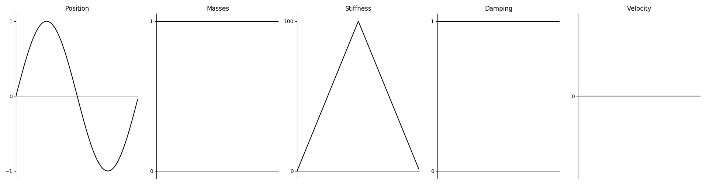
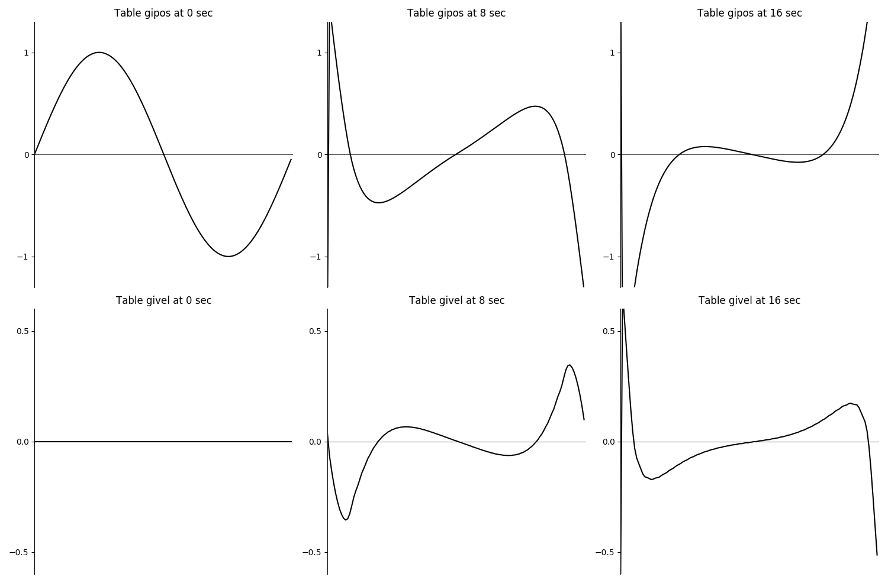
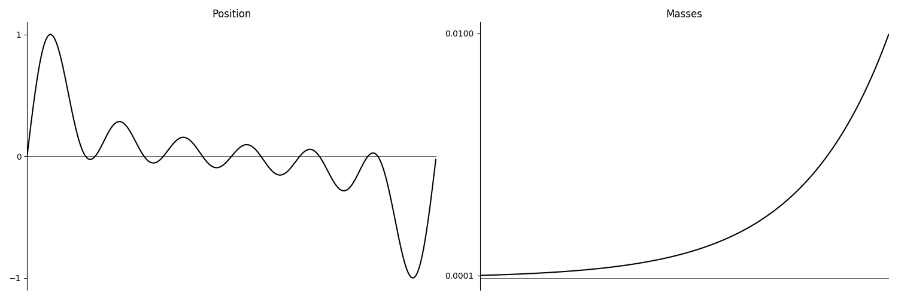
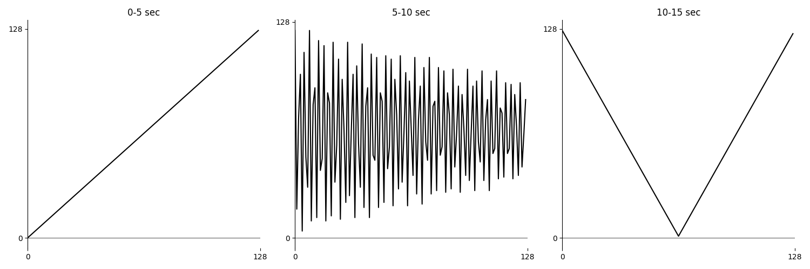

# 04 H. SCANNED SYNTHESIS

Scanned Synthesis is a relatively new synthesis technique invented by
Max Mathews, Rob Shaw and Bill Verplank at Interval Research in 2000.
This algorithm uses a combination of a table-lookup oscillator and Issac Newton's mechanical model (equation) of a mass and spring system
to dynamically change the values stored in an f-table. The sonic result
is a timbral spectrum that changes with time.

Csound has a couple opcodes dedicated to scanned synthesis, and these
opcodes can be used not only to make sounds, but also to generate
dynamic f-tables for use with other Csound opcodes.

## A Quick Scanned Synth

The quickest way to start using scanned synthesis is Matt Gilliard's opcode
[scantable](https://csound.com/docs/manual/scantable.html).

    a1 scantable kamp, kfrq, ipos, imass, istiff, idamp, ivel

The arguments _kamp_ and _kfrq_ should be familiar, amplitude and
frequency respectively. The other arguments are f-table numbers
containing data known in the scanned synthesis world as **profiles**.

### Profiles

Profiles refer to variables in the mass and spring equation. Newton's
model describes a string as a finite series of marbles connected to each
other with springs.

In this example we will use 128 marbles in our system. To the Csound
user, profiles are a series of f-tables that set up the
[scantable](https://csound.com/docs/manual/scantable.html) opcode.
To the opcode, these f-tables influence the dynamic behavior of
the table read by a table-lookup oscillator.

    gipos ftgen 1, 0, 128, 10, 1 ;Position Initial Shape: Sine wave range -1 to 1
    gimass ftgen 2, 0, 128, -7, 1, 128, 1 ;Masses: Constant value 1
    gistiff ftgen 3, 0, 128, -7, 0, 64, 100, 64, 0 ;Stiffness: triangle
    gidamp ftgen 4, 0, 128, -7, 1, 128, 1 ;Damping: Constant value 1
    givel ftgen 5, 0, 128, -2, 0 ;Velocity: Initially constant value 0



All these tables need to be the same size; otherwise Csound will
return an error.

Run the following _.csd_. Notice that the sound starts off sounding like
our intial shape (a sine wave) but evolves as if there are filters,
distortions or LFO's.

#### **_EXAMPLE 04H01_scantable_1.csd_**

```csound
<CsoundSynthesizer>
<CsOptions>
-o dac
</CsOptions>
<CsInstruments>
nchnls = 2
sr = 44100
ksmps = 32
0dbfs = 1

gipos ftgen 1, 0, 128, 10, 1 ;position of the masses (initially: sine)
gimass ftgen 2, 0, 128, -7, 1, 128, 1 ;masses: constant value 1
gistiff ftgen 3, 0, 128, -7, 0, 64, 100, 64, 0 ;stiffness; triangle 0->100->0
gidamp ftgen 4, 0, 128, -7, 1, 128, 1 ;damping; constant value 1
givel ftgen 5, 0, 128, -2, 0 ;velocity; initially 0

instr 1
 iamp = .2
 ifrq = 440
 aScan scantable iamp, ifrq, gipos, gimass, gistiff, gidamp, givel
 aOut linen aScan, 1, p3, 1
 out aOut, aOut
endin

</CsInstruments>
<CsScore>
i 1 0 19
</CsScore>
</CsoundSynthesizer>
;example by Christopher Saunders and joachim heintz
```

What happens in the _scantable_ synthesis, is a constant change in the position (table _gipos_) and the velocity (table _givel_) of the mass particles. Here are three snapshots of these tables in the examples above:



The audio output of _scantable_ is the result of oscillating through the _gipos_ table. So we will achieve the same audible result with this code:

#### **_EXAMPLE 04H02_scantable_2.csd_**

```csound
<CsoundSynthesizer>
<CsOptions>
-o dac
</CsOptions>
<CsInstruments>
nchnls = 2
sr = 44100
ksmps = 32
0dbfs = 1

gipos ftgen 1, 0, 128, 10, 1 ;position of the masses (initially: sine)
gimass ftgen 2, 0, 128, -7, 1, 128, 1 ;masses: constant value 1
gistiff ftgen 3, 0, 128, -7, 0, 64, 100, 64, 0 ;stiffness; triangle 0->100->0
gidamp ftgen 4, 0, 128, -7, 1, 128, 1 ;damping; constant value 1
givel ftgen 5, 0, 128, -2, 0 ;velocity; initially 0

instr 1
 iamp = .2
 ifrq = 440
 a0 scantable 0, 0, gipos, gimass, gistiff, gidamp, givel
 aScan poscil iamp, ifrq, gipos
 aOut linen aScan, 1, p3, 1
 out aOut, aOut
endin

</CsInstruments>
<CsScore>
i 1 0 19
</CsScore>
</CsoundSynthesizer>
;example by Christopher Saunders and joachim heintz
```

## Dynamic Tables

We can use table which is changed by _scantable_ dynamically for any context.
Below is an example of using the values of an f-table generated
by _scantable_ to modify the amplitudes of an fsig, a signal type in csound which
represents a spectral signal.

#### **_EXAMPLE 04H03_Scantable_pvsmaska.csd_**

```csound
<CsoundSynthesizer>
<CsOptions>
-o dac
</CsOptions>
<CsInstruments>
nchnls = 2
sr = 44100
ksmps = 32
0dbfs = 1

gipos ftgen 0,0,128,10,1,1,1,1,1,1     ;Initial Position Shape: impulse-like
gimass ftgen 0,0,128,-5,0.0001,128,.01 ;Masses: exponential 0.0001 to 0.01
gistiff ftgen 0,0,128,-7,0,64,100,64,0 ;Stiffness; triangle range 0 to 100
gidamp ftgen 0,0,128,-7,1,128,1        ;Damping; constant value 1
givel ftgen 0,0,128,-7,0,128,0         ;Initial Velocity; constant value 0
gisin ftgen 0,0,8192,10,1              ;Sine wave for buzz opcode

instr 1
iamp       =          .2
kfrq       =          110
aBuzz      buzz       iamp, kfrq, 32, gisin
aBuzz      linen      aBuzz, .1, p3, 1
           out        aBuzz, aBuzz
endin
instr 2
iamp       =          .4
kfrq       =          110
a0         scantable  0, 0, gipos, gimass, gistiff, gidamp, givel
ifftsize   =          128
ioverlap   =          ifftsize / 4
iwinsize   =          ifftsize
iwinshape  =          1; von-Hann window
aBuzz      buzz       iamp, kfrq, 32, gisin
fBuzz      pvsanal    aBuzz, ifftsize, ioverlap, iwinsize, iwinshape ;fft
fMask      pvsmaska   fBuzz, gipos, 1
aOut       pvsynth    fMask; resynthesize
aOut       linen      aOut, .1, p3, 1
           out        aOut, aOut
endin
</CsInstruments>
<CsScore>
i 1 0 3
i 2 4 20
</CsScore>
</CsoundSynthesizer>
;Example by Christopher Saunders and joachim heintz
```

In this .csd, the score plays instrument 1, a normal buzz sound, and
then the score plays instrument 2 — the same buzz sound re-synthesized
with amplitudes of each of the 128 frequency bands, controlled by a
dynamic function table which is generated by _scantable_.
Compared to the first example, two tables have been changed.
The initial positions are an impulse-like wave form,
and the masses are between 1/10000 and 1/10 in exponential rise.



## A More Flexible Scanned Synth

_Scantable_ can do a lot for us, it can synthesize an interesting, time-varying
timbre using a table lookup oscillator, or animate an f-table for use in
other Csound opcodes. However, there are other scanned synthesis opcodes
that can take our expressive use of the algorithm even further.

The opcodes
[scans](https://csound.com/docs/manual/scans.html) and
[scanu](https://csound.com/docs/manual/scanu.html)
by Paris Smaragdis give the Csound user one of the most robust and
flexible scanned synthesis environments. These opcodes work in tandem to
first set up the dynamic wavetable, and then to _scan_ the dynamic
table in ways a table-lookup oscillator cannot.

_Scanu_ takes 18 arguments and sets a table into motion.

     scanu ipos, irate, ifnvel, ifnmass, ifnstif, ifncentr, ifndamp, kmass,
       kstif, kcentr, kdamp, ileft, iright, kpos, kstrngth, ain, idisp, id

For a detailed description of what each argument does, see the
[Csound Reference Manual](https://csound.com/docs/manual/scanu.html);
I will discuss the various types of arguments in the opcode.

The first set of arguments - _ipos, ifnvel, ifnmass, ifnstiff,
ifncenter_, and _ifndamp_ - are f-tables describing the profiles,
similar to the profile arguments for _scantable_. Like for _scantable_,
the same size is required for each of these tables.

An exception to this size requirement is the _ifnstiff_ table. This
table is the size of the other profiles squared. If the other f-tables
are size 128, then _ifnstiff_ should be of size 16384 (or 128\*128).
To discuss what this table does, I must first introduce the concept of a
scanned matrix.

### The Scanned Matrix

The scanned matrix is a convention designed to describe the shape of the
connections of masses in the mass and spring model.

Going back to our discussion on Newton's mechanical model, the
mass and spring model describes the behavior of a string as a
finite number of masses connected by springs. As you can imagine, the
masses are connected sequentially, one to another, like beads on a
string. Mass \#1 is connected to \#2, \#2 connected to \#3 and
so on. However, the pioneers of scanned synthesis had the idea to
connect the masses in a non-linear way. It's hard to imagine, because
as musicians, we have experience with piano or violin strings (one
dimensional strings), but not with multi-dimensional strings.
Fortunately, the computer has no problem working with this idea, and the
flexibility of Newton's equation allows us to use the CPU to model
mass \#1 being connected with springs not only to \#2 but also
to \#3 and any other mass in the model.

The most direct and useful implementation of this concept is to connect
mass \#1 to mass \#2 and mass \#128 -- forming a string without
endpoints, a circular string, like tying our string with beads to make a
necklace. The pioneers of scanned synthesis discovered that this
circular string model is more useful than a conventional one-dimensional
string model with endpoints. In fact,
[scantable](https://csound.com/docs/manual/scantable.html)
uses a circular string.

The matrix is described in a simple ASCII file, imported into Csound via
a GEN23 generated f-table.

    f3 0 16384 -23 "string-128"

This text file **must** be located in the same directory as your .csd or
csound will give you this error

    ftable 3: error opening ASCII file

You can construct your own matrix using Stephen Yi's Scanned Matrix
editor included in the Blue frontend for Csound.

To swap out matrices, simply type the name of a different matrix file
into the double quotes, i.e.:

    f3 0 16384 -23 "circularstring_2-128"

Different matrices have unique effects on the behavior of the system.
Some matrices can make the synth extremely loud, others extremely quiet.
Experiment with using different matrices.

Now would be a good time to point out that Csound has other scanned
synthesis opcodes preceded with an _x_,
[xscans](https://csound.com/docs/manual/xscans.html),
[xscanu](https://csound.com/docs/manual/xscanu.html),
that use a different matrix format than the one used by
[scans](https://csound.com/docs/manual/scans.html),
[scanu](https://csound.com/docs/manual/scanu.html),
and Stephen Yi's Scanned Matrix Editor. The Csound Reference Manual has
more information on this.

### The Hammer

If the initial shape, an f-table specified by the _ipos_ argument
determines the shape of the initial contents in our dynamic table.
What if we want to "reset" or "pluck" the
table, perhaps with a shape of a square wave instead of a sine wave,
while the instrument is playing?

With [scantable](https://csound.com/docs/manual/scantable.html),
there is an easy way to to this, send a score event changing the
contents of the dynamic f-table. You can do this with the Csound score
by adjusting the start time of the f-events in the score.

#### **_EXAMPLE 04H04_Hammer.csd_**

```csound
<CsoundSynthesizer>
<CsOptions>
-o dac
</CsOptions>
<CsInstruments>
sr=44100
ksmps=32
nchnls=2
0dbfs=1

instr 1
ipos       ftgen      1, 0, 128, 10, 1 ; Initial Shape, sine
imass      ftgen      2, 0, 128, -7, 1, 128, 1 ;Masses(adj.), constant value 1
istiff     ftgen      3, 0, 128, -7, 0, 64, 100, 64, 0 ;Stiffness triangle
idamp      ftgen      4, 0, 128, -7, 1, 128, 1; ;Damping; constant value 1
ivel       ftgen      5, 0, 128, -7, 0, 128, 0 ;Initial Velocity 0
iamp       =          0.2
a1         scantable  iamp, 60, ipos, imass, istiff, idamp, ivel
           outs       a1, a1
endin
</CsInstruments>
<CsScore>
i 1 0 14
f 1 1 128 10 1 1 1 1 1 1 1 1 1 1 1
f 1 2 128 10 1 1 0 0 0 0 0 0 0 1 1
f 1 3 128 10 1 1 1 1 1
f 1 4 128 10 1 0 0 0 0 0 0 0 0 0 0 0 0 0 0 1
f 1 5 128 10 1 1
f 1 6 128 13 1 1 0 0 0 -.1 0 .3 0 -.5 0 .7 0 -.9 0 1 0 -1 0
f 1 7 128 21 6 5.745
</CsScore>
</CsoundSynthesizer>
;example by Christopher Saunders
```

You'll get the warning

    WARNING: replacing previous ftable 1

which means this method of hammering the string is
working. In fact you could use this method to explore and hammer every
possible GEN routine in Csound.
[GEN10](https://csound.com/docs/manual/GEN10.html) (sines),
[GEN 21](https://csound.com/docs/manual/GEN21.html) (noise) and
[GEN 27](https://csound.com/docs/manual/GEN27.html) (breakpoint functions)
could keep you occupied for a while.

Unipolar waves have a different sound but a loss in volume can occur.
There is a way to do this with
[scanu](https://csound.com/docs/manual/scanu.html),
but I do not use this feature and just use these values instead.

     ileft = 0. iright = 1. kpos = 0. kstrngth = 0.

## More on Profiles

One of the biggest challenges in understanding scanned synthesis is the
concept of profiles.

Setting up the opcode [scanu](https://csound.com/docs/manual/scanu.html)
requires 3 profiles - Centering, Mass and Damping. The pioneers of
scanned synthesis discovered early on that the resultant timbre is far
more interesting if marble \#1 had a different centering force than mass
\#64.

The farther our model gets away from a physical real-world string that
we know and pluck on our guitars and pianos, the more interesting the
sounds for synthesis. Therefore, instead of one mass, and damping, and
centering value for all 128 of the marbles each marble can have its own
conditions. How the centering, mass, and damping profiles make the
system behave is up to the user to discover through experimentation
(more on how to experiment safely later in this chapter).

## Control Rate Profile Scalars

Profiles are a detailed way to control the behavior of the string, but
what if we want to influence the mass or centering or damping of every
marble **after** a note has been activated and while its playing?

[Scanu](https://csound.com/docs/manual/scanu.html) gives us
4 k-rate arguments _kmass, kstif, kcentr, kdamp_, to scale
these forces. One could scale mass to volume, or have an envelope
controlling centering.

**Caution!** These parameters can make the scanned system unstable in
ways that could make **extremely** loud sounds come out of your
computer. It is best to experiment with small changes in range and keep
your headphones off. A good place to start experimenting is with
different values for _kcentr_ while keeping _kmass_, _kstiff_, and
_kdamp_ constant. You could also scale mass and stiffness to MIDI
velocity.

## Audio Injection

Instead of using the hammer method to move the marbles around, we could
use audio to add motion to the mass and spring model. _Scanu_ lets us do
this with a simple audio rate argument. Be careful with the amplitude again.

To bypass audio injection all together, simply assign 0 to an a-rate
variable.

     ain = 0

and use this variable as the argument.

## Connecting to Scans

The p-field id is an arbitrary integer label that tells the scans opcode
which _scanu_
to read. By making the value of id negative, the arbitrary numerical
label becomes the number of an f-table that can be used by any other
opcode in Csound, like we did with _scantable_ earlier in this chapter.

We could then use [poscil](https://csound.com/docs/manual/poscil.html)
to perform a table lookup algorithm to make sound out
of [scanu](https://csound.com/docs/manual/scanu.html)
(as long as id is negative), but _scanu_ has a companion
opcode, [scans](https://csound.com/docs/manual/scans.html)
which has 1 more argument than _oscil_.
This argument is the number of an f-table containing the scan
trajectory.

## Scan Trajectories

One thing we have taken for granted so far with
[poscil](https://csound.com/docs/manual/poscil.html)
is that the wave table is read front to back. If you regard _poscil_ as a
phasor and table pair, the first index of the table is always read first
and the last index is always read last as in the example below:

#### **_EXAMPLE 04H05_Scan_trajectories.csd_**

```csound
<CsoundSynthesizer>
<CsOptions>
-o dac
</CsOptions>
<CsInstruments>
sr=44100
ksmps=32
nchnls=2
0dbfs=1

instr 1
andx phasor 440
a1 table andx*8192, 1
outs a1*.2, a1*.2
endin
</CsInstruments>
<CsScore>
f1 0 8192 10 1
i 1 0 4
</CsScore>
</CsoundSynthesizer>
;example by Christopher Saunders
```

But what if we wanted to read the table indices back to front, or even
"out of order"? Well we could do something like this:

#### **_EXAMPLE 04H06_Scan_trajectories2.csd_**

```csound
<CsoundSynthesizer>
<CsOptions>
-o dac
</CsOptions>
<CsInstruments>
sr=44100
ksmps=32
nchnls=2
0dbfs=1

instr 1
andx phasor 440
andx table andx*8192, 2  ; read the table out of order!
aOut table andx*8192, 1
outs aOut*.2, aOut*.2
endin
</CsInstruments>
<CsScore>
f1 0 8192 10 1
f2 0 8192 -5 .001 8192 1;
i 1 0 4
</CsScore>
</CsoundSynthesizer>
;example by Christopher Saunders
```

We are still dealing with 1-dimensional arrays, or f-tables as we know
them. But if we remember back to our conversation about the scanned
matrix, matrices are multi-dimensional.

The opcode [scans](https://csound.com/docs/manual/scans.html)
gives us the flexibility of specifying a scan trajectory, analogous to
telling the phasor/table combination to read values non-consecutively.
We could read these values, not left to right, but in a spiral order, by
specifying a table to be the _ifntraj_ argument of _scans_.

    a3 scans iamp, kpch, ifntraj ,id , interp

An f-table for the spiral method can generated by reading the ASCII file
_spiral-8,16,128,2,1over2_ by GEN23

    f2 0 128 -23 "spiral-8,16,128,2,1over2"

The following .csd requires that the files _circularstring-128_ and
_spiral-8,16, 128,2,1over2_ be located in the same directory as the
.csd.

#### **_EXAMPLE 04H07_Scan_matrices.csd_**

```csound
<CsoundSynthesizer>
<CsOptions>
-o dac
</CsOptions>
<CsInstruments>
nchnls = 2
sr = 44100
ksmps = 32
0dbfs = 1
instr 1
ipos ftgen 1, 0, 128, 10, 1
irate = .005
ifnvel ftgen 6, 0, 128, -7, 0, 128, 0
ifnmass ftgen 2, 0, 128, -7, 1, 128, 1
ifnstif ftgen 3, 0, 16384,-23,"circularstring-128"
ifncentr ftgen 4, 0, 128, -7, 0, 128, 2
ifndamp ftgen 5, 0, 128, -7, 1, 128, 1
imass = 2
istif = 1.1
icentr = .1
idamp = -0.01
ileft = 0.
iright = .5
ipos = 0.
istrngth = 0.
ain = 0
idisp = 0
id = 8
scanu 1, irate, ifnvel, ifnmass, ifnstif, ifncentr, ifndamp, imass, istif,
      icentr, idamp, ileft, iright, ipos, istrngth, ain, idisp, id
scanu 1,.007,6,2,3,4,5, 2, 1.10 ,.10 ,0 ,.1 ,.5, 0, 0,ain,1,2;
iamp = .2
ifreq = 200
a1 scans iamp, ifreq, 7, id
outs a1, a1
endin
</CsInstruments>
<CsScore>
f7 0 128 -7 0 128 128
i 1 0 5
f7 5 128 -23 "spiral-8,16,128,2,1over2"
i 1 5 5
f7 10 128 -7 127 64 0 64 127
i 1 10 5
</CsScore>
</CsoundSynthesizer>
;example by Christopher Saunders
```

Notice that the scan trajectory has an FM-like effect on the sound.
These are the three different _f7_ tables which are started in the score:



## Table Size and Interpolation

Tables used for scan trajectory must be the same size (have the same
number of indices) as the mass, centering and damping tables and must
also have the same range as the size of these tables. For example, in
our .csd we have been using 128 point tables for initial position, mass
centering, damping (our stiffness tables have 128 squared). So our
trajectory tables must be of size 128, and contain values from 0 to 127.

One can use larger or smaller tables, but their sizes must agree in this
way or Csound will give you an error. Larger tables, of course
significantly increase CPU usage and slow down real-time performance.

When using smaller size tables it may be necessary to use interpolation
to avoid the artifacts of a small table. _scans_ gives us this option as
a fifth optional argument, _iorder,_ detailed in the reference manual
and worth experimenting with.

Using the opcodes scanu and scans require that we fill in 22 arguments
and create at least 7 f-tables, including at least one external ASCII
file (because no one wants to fill in 16,384 arguments to an
f-statement). This a very challenging pair of opcodes. The beauty of
scanned synthesis is that there is no scanned synthesis "sound".

## Using Balance to Tame Amplitudes

However, like this frontier can be a lawless, dangerous place. When
experimenting with scanned synthesis parameters, one can illicit
extraordinarily loud sounds out of Csound, often by something as simple
as a misplaced decimal point.

**Warning: the following .csd is hot, it produces massively loud
amplitude values. Be very cautious about rendering this .csd, I highly
recommend rendering to a file instead of real-time. Only uncomment line 43 when you know what you do!**

#### **_EXAMPLE 04H08_Scan_extreme_amplitude.csd_**

```csound
<CsoundSynthesizer>
<CsOptions>
-o dac
</CsOptions>
<CsInstruments>

nchnls = 2
sr = 44100
ksmps = 32
0dbfs = 1
;NOTE THIS CSD WILL NOT RUN UNLESS
;IT IS IN THE SAME FOLDER AS THE FILE "STRING-128"
instr 1
ipos ftgen 1, 0, 128 , 10, 1
irate = .007
ifnvel ftgen 6, 0, 128 , -7, 0, 128, 0.1
ifnmass ftgen 2, 0, 128 , -7, 1, 128, 1
ifnstif ftgen 3, 0, 16384, -23, "string-128"
ifncentr ftgen 4, 0, 128 , -7, 1, 128, 2
ifndamp ftgen 5, 0, 128 , -7, 1, 128, 1
kmass = 1
kstif = 0.1
kcentr = .01
kdamp = 1
ileft = 0
iright = 1
kpos = 0
kstrngth = 0.
ain = 0
idisp = 1
id = 22
scanu ipos, irate, ifnvel, ifnmass, \
ifnstif, ifncentr, ifndamp, kmass, \
kstif, kcentr, kdamp, ileft, iright,\
kpos, kstrngth, ain, idisp, id
kamp = 0dbfs*.2
kfreq = 200
ifn ftgen 7, 0, 128, -5, .001, 128, 128.
a1 scans kamp, kfreq, ifn, id
a1 dcblock2 a1
iatt = .005
idec = 1
islev = 1
irel = 2
aenv adsr iatt, idec, islev, irel
;outs a1*aenv,a1*aenv; Uncomment for speaker destruction;
endin
</CsInstruments>
<CsScore>
f8 0 8192 10 1;
i 1 0 5
</CsScore>
</CsoundSynthesizer>
;example by Christopher Saunders
```

The extreme volume of this .csd comes from a value given to scanu

    kdamp = .1

0.1 is not exactly a safe value for this argument, in fact, any value
above 0 for this argument can cause chaos.

It would take a skilled mathematician to map out safe possible ranges
for all the arguments of scanu. I figured out these values through a mix
of trial and error and studying other .csd.

We can use the opcode [balance](https://csound.com/docs/manual/balance.html)
to listen to sine wave (a signal with consistent, safe amplitude) and
squash down our extremely loud scanned synth output (which is loud only
because of our intentional carelessness.)

#### **_EXAMPLE 04H09_Scan_balanced_amplitudes.csd_**

```csound
<CsoundSynthesizer>
<CsOptions>
-o dac
</CsOptions>
<CsInstruments>

nchnls = 2
sr = 44100
ksmps = 256
0dbfs = 1
;NOTE THIS CSD WILL NOT RUN UNLESS
;IT IS IN THE SAME FOLDER AS THE FILE "STRING-128"

instr 1
ipos ftgen 1, 0, 128 , 10, 1
irate = .007
ifnvel   ftgen 6, 0, 128 , -7, 0, 128, 0.1
ifnmass  ftgen 2, 0, 128 , -7, 1, 128, 1
ifnstif  ftgen 3, 0, 16384, -23, "string-128"
ifncentr ftgen 4, 0, 128 , -7, 1, 128, 2
ifndamp  ftgen 5, 0, 128 , -7, 1, 128, 1
kmass = 1
kstif = 0.1
kcentr = .01
kdamp = -0.01
ileft = 0
iright = 1
kpos = 0
kstrngth = 0.
ain = 0
idisp = 1
id = 22
scanu ipos, irate, ifnvel, ifnmass, \
ifnstif, ifncentr, ifndamp, kmass, \
kstif, kcentr, kdamp, ileft, iright,\
kpos, kstrngth, ain, idisp, id
kamp = 0dbfs*.2
kfreq = 200
ifn ftgen 7, 0, 128, -5, .001, 128, 128.
a1 scans kamp, kfreq, ifn, id
a1 dcblock2 a1
ifnsine ftgen 8, 0, 8192, 10, 1
a2 poscil kamp, kfreq, ifnsine
a1 balance a1, a2
iatt = .005
idec = 1
islev = 1
irel = 2
aenv adsr iatt, idec, islev, irel
outs a1*aenv,a1*aenv
endin
</CsInstruments>
<CsScore>
f8 0 8192 10 1;
i 1 0 5
</CsScore>
</CsoundSynthesizer>
;example by Christopher Saunders
```

It must be emphasized that this is merely a safeguard. We still get
samples out of range when we run this .csd, but many less than if we had
not used balance. It is recommended to use balance if you are doing
real-time mapping of k-rate profile scalar arguments for
[scans](https://csound.com/docs/manual/scans.html);
mass stiffness, damping, and centering.
