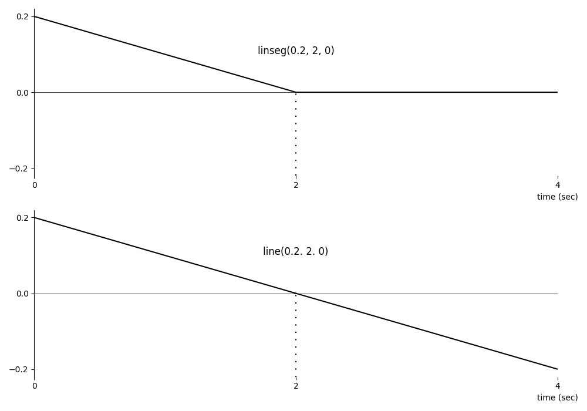
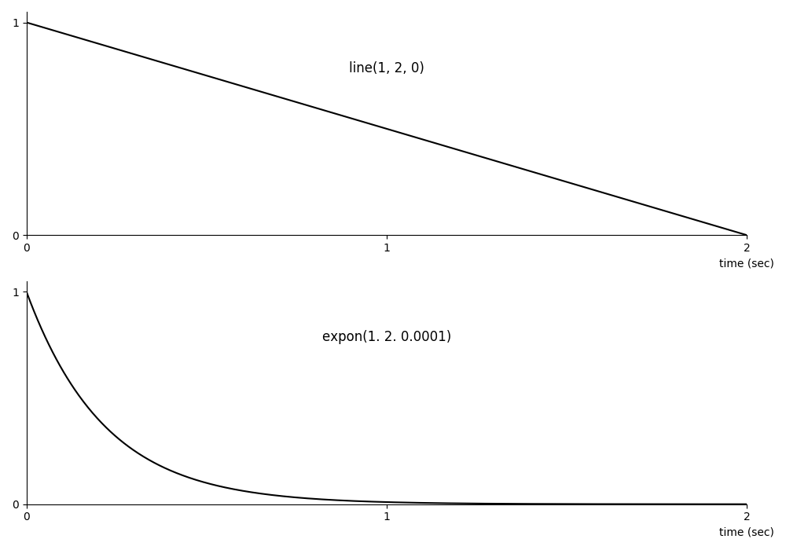
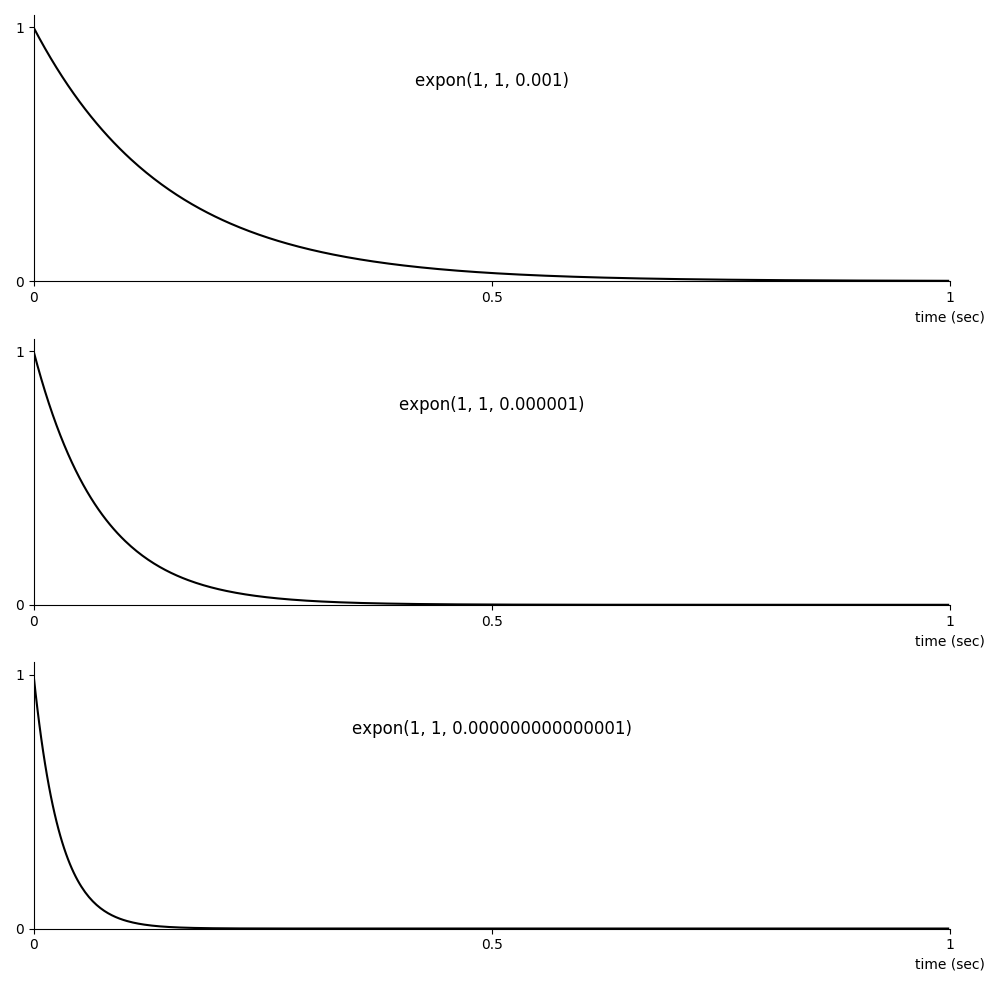
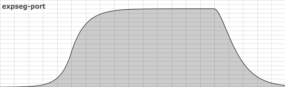

05 A. ENVELOPES
===============

Envelopes are used to define how a value evolves over time. In early
synthesisers, envelopes were used to define the changes in amplitude in
a sound across its duration thereby imbuing sounds characteristics such
as *percussive*, or *sustaining*. Envelopes are also commonly used
to modulate filter cutoff frequencies and the frequencies of oscillators
but in reality we are only limited by our imaginations in regard to what
they can be used for.

Csound offers a wide array of opcodes for generating envelopes including
ones which emulate the classic ADSR (attack-decay-sustain-release)
envelopes found on hardware and commercial software synthesizers. A
selection of these opcodes types shall be introduced here.

The simplest opcode for defining an envelope is
[line](https://csound.com/docs/manual/line.html). It describes a
single envelope segment as a straight line between a start value *ia* and an
end value *ib* which has a given duration *idur*.

    ares *line* ia, idur, ib
    kres *line* ia, idur, ib

In the following example *line* is used to create a simple envelope
which is then used as the amplitude control of a *poscil* oscillator.
This envelope starts with a value of 0.5 then over the course of 2
seconds descends in linear fashion to zero.

   ***EXAMPLE 05A01_line.csd***

~~~Csound
<CsoundSynthesizer>
<CsOptions>
-odac
</CsOptions>
<CsInstruments>
sr = 44100
ksmps = 32
nchnls = 2
0dbfs = 1

  instr 1
aEnv     line     0.5, 2, 0         ; amplitude envelope
aSig     poscil   aEnv, 500         ; audio oscillator
         out      aSig, aSig        ; audio sent to output
  endin

</CsInstruments>
<CsScore>
i 1 0 2 ; instrument 1 plays a note for 2 seconds
</CsScore>
</CsoundSynthesizer>
;example by Iain McCurdy
~~~

The envelope in the above example assumes that all notes played by this
instrument will be 2 seconds long. In practice it is often beneficial to
relate the duration of the envelope to the duration of the note (p3) in
some way. In the next example the duration of the envelope is replaced
with the value of p3 retrieved from the score, whatever that may be. The
envelope will be stretched or contracted accordingly.

   ***EXAMPLE 05A02_line_p3.csd***

~~~Csound
<CsoundSynthesizer>
<CsOptions>
-odac
</CsOptions>
<CsInstruments>
sr = 44100
ksmps = 32
nchnls = 2
0dbfs = 1

  instr 1
; A single segment envelope. Time value defined by note duration.
aEnv     line     0.5, p3, 0
aSig     poscil   aEnv, 500
         out      aSig, aSig
  endin

</CsInstruments>
<CsScore>
; p1 p2  p3
i 1  0    1
i 1  2  0.2
i 1  3    4
</CsScore>
</CsoundSynthesizer>
;example by Iain McCurdy
~~~

It may not be disastrous if a envelope's duration does not match p3 and
indeed there are many occasions when we want an envelope duration to be
independent of p3 but we need to remain aware that if p3 is shorter than
an envelope's duration then that envelope will be truncated before it
is allowed to complete and if p3 is longer than an envelope's duration
then the envelope will complete before the note ends (the consequences
of this latter situation will be looked at in more detail later on in
this section).

*line* (and most of Csound's envelope generators) can output either **k**
or **a**-rate variables. k-rate envelopes are computationally cheaper than
a-rate envelopes but in envelopes with fast moving segments quantisation
can occur if they output a k-rate variable, particularly when the
control rate is low, which in the case of amplitude envelopes can lead
to clicking artefacts or distortion.

[linseg](https://csound.com/docs/manual/linseg.html) is an
elaboration of *line* and allows us to add an arbitrary number of
segments by adding further pairs of time durations followed envelope
values. Provided we always end with a value and not a duration we can
make this envelope as long as we like.

    ares *linseg* ia, idur1, ib [, idur2] [, ic] [...]
    kres *linseg* ia, idur1, ib [, idur2] [, ic] [...]

In the next example a more complex amplitude envelope is employed by
using the *linseg* opcode. This envelope is also note duration (p3)
dependent but in a more elaborate way. An attack-decay stage is defined
using explicitly declared time durations. A release stage is also
defined with an explicitly declared duration. The sustain stage is the
p3 dependent stage but to ensure that the duration of the entire
envelope still adds up to p3, the explicitly defined durations of the
attack, decay and release stages are subtracted from the p3 dependent
sustain stage duration. For this envelope to function correctly it is
important that p3 is not less than the sum of all explicitly defined
envelope segment durations. If necessary, additional code could be
employed to circumvent this from happening.

   ***EXAMPLE 05A03_linseg.csd***

~~~Csound
<CsoundSynthesizer>
<CsOptions>
-odac
</CsOptions>
<CsInstruments>
sr = 44100
ksmps = 32
nchnls = 2
0dbfs = 1

  instr 1
; a more complex amplitude envelope:
;                 |-attack-|-decay--|---sustain---|-release-|
aEnv     linseg   0, 0.01, 1, 0.1,  0.1, p3-0.21, 0.1, 0.1, 0
aSig     poscil   aEnv, 500
         out      aSig, aSig
  endin

</CsInstruments>
<CsScore>
i 1 0 1
i 1 2 5
</CsScore>
</CsoundSynthesizer>
;example by Iain McCurdy
~~~

The next example illustrates an approach that can be taken whenever it
is required that more than one envelope segment duration be p3
dependent. This time each segment is a fraction of p3. The sum of all
segments still adds up to p3 so the envelope will complete across the
duration of each note regardless of duration.

   ***EXAMPLE 05A04_linseg_p3_fractions.csd***

~~~Csound
<CsoundSynthesizer>
<CsOptions>
-odac
</CsOptions>
<CsInstruments>
sr = 44100
ksmps = 32
nchnls = 2
0dbfs = 1

  instr 1
aEnv     linseg   0, p3*0.5, .2, p3*0.5, 0 ; rising then falling envelope
aSig     poscil   aEnv, 500
         out      aSig, aSig
  endin

</CsInstruments>

<CsScore>
; 3 notes of different durations are played
i 1 0   1
i 1 2 0.1
i 1 3   5
</CsScore>
</CsoundSynthesizer>
;example by Iain McCurdy
~~~

The next example highlights an important difference in the behaviours of
*line* and *linseg* when p3 exceeds the duration of an envelope.

When a note continues beyond the end of the final value of a *linseg*
defined envelope the final value of that envelope is held. A *line*
defined envelope behaves differently in that instead of holding its
final value it continues in the trajectory defined by its one and only
segment.

This difference is illustrated in the following example. The *linseg*
and *line* envelopes of instruments 1 and 2 appear to be the same but
the difference in their behaviour as described above when they continue
beyond the end of their final segment is clear. The *linseg* envelope stays at zero, whilst the *line* envelope continues through zero to negative range, thus ending at -0.2.[^1]

[^1]: Negative values for the envelope have the same loudness.
      Only the phase of the signal is inverted.

   ***EXAMPLE 05A05_line_vs_linseg.csd***

~~~Csound
<CsoundSynthesizer>
<CsOptions>
-odac
</CsOptions>
<CsInstruments>
sr = 44100
ksmps = 32
nchnls = 2
0dbfs = 1

  instr 1 ; linseg envelope
aEnv     linseg   0.2, 2, 0      ; linseg holds its last value
aSig     poscil   aEnv, 500
         out      aSig, aSig
  endin

  instr 2 ; line envelope
aEnv     line     0.2, 2, 0      ; line continues its trajectory
aSig     poscil   aEnv, 500
         out      aSig
  endin

</CsInstruments>
<CsScore>
i 1 0 4 ; linseg envelope
i 2 5 4 ; line envelope
</CsScore>
</CsoundSynthesizer>
;example by Iain McCurdy and joachim heintz
~~~

[expon](https://csound.com/docs/manual/expon.html) and
[expseg](https://csound.com/docs/manual/expseg.html) are versions of
*line* and *linseg* that instead produce envelope segments with concave
exponential shapes rather than linear shapes. *expon* and *expseg* can
often be more musically useful for envelopes that define amplitude or
frequency as they will reflect the logarithmic nature of how these
parameters are perceived.[^2] On account of the mathematics that are used to
define these curves, we cannot define a value of zero at any node in the
envelope and an envelope cannot cross the zero axis. If we require a
value of zero we can instead provide a value very close to zero. If we
still really need zero we can always subtract the offset value from the
entire envelope in a subsequent line of code.

[^2]: See chapter [01 C](01-c-intensities.md) for some background information.

The following example illustrates the difference between *line* and
*expon* when applied as amplitude envelopes.

   ***EXAMPLE 05A06_line_vs_expon.csd***

~~~Csound
<CsoundSynthesizer>
<CsOptions>
-odac
</CsOptions>
<CsInstruments>
sr = 44100
ksmps = 32
nchnls = 2
0dbfs = 1

  instr 1 ; line envelope
aEnv     line     1, p3, 0
aSig     poscil   aEnv, 500
         out      aSig, aSig
  endin

  instr 2 ; expon envelope
aEnv     expon    1, p3, 0.0001
aSig     poscil   aEnv, 500
         out      aSig, aSig
  endin

</CsInstruments>
<CsScore>
i 1 0 2 ; line envelope
i 2 2 1 ; expon envelope
</CsScore>
</CsoundSynthesizer>
;example by Iain McCurdy
~~~Csound

The nearer our *near-zero* values are to zero the quicker the curve
will appear to reach zero. In the next example smaller and smaller
envelope end values are passed to the expon opcode using p4 values in
the score. The percussive *ping* sounds are perceived to be
increasingly short.

   ***EXAMPLE 05A07_expon_pings.csd***

~~~Csound
<CsoundSynthesizer>
<CsOptions>
-odac
</CsOptions>
<CsInstruments>
sr = 44100
ksmps = 32
nchnls = 2
0dbfs = 1

  instr 1; expon envelope
iEndVal  =        p4 ; variable 'iEndVal' retrieved from score
aEnv     expon    1, p3, iEndVal
aSig     poscil   aEnv, 500
         out      aSig, aSig
  endin

</CsInstruments>
<CsScore>
;p1  p2 p3 p4
i 1  0  1  0.001
i 1  1  1  0.000001
i 1  2  1  0.000000000000001
e
</CsScore>
</CsoundSynthesizer>
;example by Iain McCurdy
~~~

Note that *expseg* does not behave like linseg in that it will not hold
its last final value if p3 exceeds its entire duration, instead it
continues its curving trajectory in a manner similar to *line* (and
*expon*). This could have dangerous results if used as an amplitude
envelope.

When dealing with notes with an indefinite duration at the time of
initiation (such as midi activated notes or score activated notes with a
negative p3 value), we do not have the option of using p3 in a
meaningful way. Instead we can use one of Csound's envelopes that sense
the ending of a note when it arrives and adjust their behaviour
according to this. The opcodes in question are
[linenr](https://csound.com/docs/manual/linenr.html),
[linsegr](https://csound.com/docs/manual/linsegr.html),
[expsegr](https://csound.com/docs/manual/expsegr.html),
[madsr](https://csound.com/docs/manual/madsr.html),
[mxadsr](https://csound.com/docs/manual/mxadsr.html) and
[envlpxr](https://csound.com/docs/manual/envlpxr.html). These
opcodes wait until a held note is turned off before executing their
final envelope segment. To facilitate this mechanism they extend the
duration of the note so that this final envelope segment can complete.

The following example uses midi input (either hardware or virtual) to
activate notes. The use of the *linsegr* envelope means that after the
short attack stage lasting 0.1 seconds, the penultimate value of 1 will
be held as long as the note is sustained but as soon as the note is
released the note will be extended by 0.5 seconds in order to allow the
final envelope segment to decay to zero.

   ***EXAMPLE 05A08_linsegr.csd***

~~~Csound
<CsoundSynthesizer>
<CsOptions>
-odac -+rtmidi=virtual -M0
; activate real time audio and MIDI (virtual midi device)
</CsOptions>
<CsInstruments>
sr = 44100
ksmps = 32
nchnls = 2
0dbfs = 1

  instr 1
icps     cpsmidi
;                 attack-|sustain-|-release
aEnv     linsegr  0, 0.01,  0.1,     0.5,0 ; envelope that senses note releases
aSig     poscil   aEnv, icps               ; audio oscillator
         out      aSig, aSig               ; audio sent to output
  endin

</CsInstruments>
<CsScore>
e 240 ; csound performance for 4 minutes
</CsScore>
</CsoundSynthesizer>
;example by Iain McCurdy
~~~

Sometimes designing our envelope shape in a function table can provide
us with shapes that are not possible using Csound's envelope generating
opcodes. In this case the envelope can be read from the function table
using an oscillator. If the oscillator is given a frequency of 1/p3 then
it will read though the envelope just once across the duration of the
note.

The following example generates an amplitude envelope which uses the
shape of the first half of a sine wave.

   ***EXAMPLE 05A09_sine_env.csd***

~~~Csound
<CsoundSynthesizer>
<CsOptions>
-odac
</CsOptions>
<CsInstruments>
sr = 44100
ksmps = 32
nchnls = 2
0dbfs = 1

giEnv    ftgen    0, 0, 2^12, 9, 0.5, 1, 0 ; envelope shape: a half sine

  instr 1
; read the envelope once during the note's duration:
aEnv     poscil   .5, 1/p3, giEnv
aSig     poscil   aEnv, 500                ; audio oscillator
         out      aSig, aSig               ; audio sent to output
  endin

</CsInstruments>
<CsScore>
; 7 notes, increasingly short
i 1 0 2
i 1 2 1
i 1 3 0.5
i 1 4 0.25
i 1 5 0.125
i 1 6 0.0625
i 1 7 0.03125
e 7.1
</CsScore>
</CsoundSynthesizer>
;example by Iain McCurdy
~~~

Comparison of the Standard Envelope Opcodes
-------------------------------------------

The precise shape of the envelope of a sound, whether that envelope
refers to its amplitude, its pitch or any other parameter, can be
incredibly subtle and our ears, in identifying and characterising
sounds, are fantastically adept at sensing those subtleties. Csound's
original envelope generating opcode
[linseg](https://csound.com/docs/manual/linseg.html), whilst capable of emulating the envelope generators of vintage electronic synthesisers, may not
produce convincing results in the emulation of acoustic instruments and
natural sound. Thus it has, since Csound's creation, been augmented with a number of other envelope generators whose usage is similar to that of linseg but whose output function is subtly different in shape.

If we consider a basic envelope that ramps up across ¼ of the duration
of a note, then sustains for ½ the durations of the and finally ramps
down across the remaining ¼ duration of the note, we can implement this
envelope using linseg thus:

    kEnv linseg 0, p3/4, 0.9, p3/2, 0.9, p3/4, 0

The resulting envelope will look like this:

When employed as an amplitude control, the resulting sound may seem to
build rather too quickly, then crescendo in a slightly mechanical
fashion and finally arrive at its sustain portion with abrupt stop in
the crescendo. Similar critcism could be levelled at the latter part of
the envelope going from sustain to ramping down.

The [expseg](https://csound.com/docs/manual/expseg.html) opcode,
introduced sometime after linseg, attempted to address the issue of
dynamic response when mapping an envelope to amplitude. Two caveats
exist in regard to the use of expseg: firstly a single expseg definition
cannot cross from the positive domain to the negative domain (and vice
versa), and secondly it cannot reach zero. This second caveat means that
an amplitude envelope created using expseg cannot express silence
unless we remove the offset away form zero that the envelope employs. An
envelope with similar input values to the linseg envelope above but
created with expseg could use the following code:

    kEnv expseg 0.001, p3/4, 0.901, p3/2, 0.901, p3/4, 0.001
    kEnv = kEnv – 0.001

and would look like this:

In this example the offset above zero has been removed. This time we can
see that the sound will build in a rather more natural and expressive
way, however the change from *crescendo* to *sustain* is even more abrupt
this time. Adding some lowpass filtering to the envelope signal can
smooth these abrupt changes in direction. This could be done with, for
example, the port opcode given a half-point value of 0.05.

    kEnv port kEnv, 0.05

The resulting envelope looks like this:

The changes to and from the sustain portion have clearly been improved
but close examination of the end of the envelope reveals that the use of
port has prevented the envelope from reaching zero. Extending the
duration of the note or overlaying a second *anti-click* envelope
should obviate this issue.

    xtratim 0.1

will extend the note by 1/10 of a second.

    aRamp linseg 1, p3-0.1, 1, 0.1, 0

will provide a quick ramp down at the note conclusion if multiplied to
the previously created envelope.

A more recently introduced alternative is the
[cosseg](https://csound.com/docs/manual/cosseg.html) opcode which
applies a cosine transfer function to each segment of the envelope.
Using the following code:

    kEnv cosseg 0, p3/4, 0.9, p3/2, 0.9, p3/4, 0

the resulting envelope will look like this:

It can be observed that this envelope provides a smooth gradual building
up from silence and a gradual arrival at the sustain level. This
opcode has no restrictions relating to changing polarity or passing
through zero.

Another alternative that offers enhanced user control and that might in
many situations provide more natural results is the
[transeg](https://csound.com/docs/manual/transeg.html) opcode.
*transeg* allows us to specify the curvature of each segment but it should
be noted that the curvature is dependent upon whether the segment is
rising or falling. For example a positive curvature will result in a
concave segment in a rising segment but a convex segment in a falling
segment. The following code:

    kEnv transeg 0, p3/4, -4, 0.9, p3/2, 0, 0.9, p3/4, -4, 0

will produce the following envelope:

This looks perhaps rather lopsided but in emulating acoustic
instruments can actually produce more natural results. Considering an
instrument such as a clarinet, it is in reality very difficult to fade a
note in smoothly from silence. It is more likely that a note will
start slightly abruptly in spite of the player's efforts. This
aspect is well represented by the attack portion of the envelope above.
When the note is stopped, its amplitude will decay quickly and
exponentially as reflected in the envelope also. Similar attack and
release characteristics can be observed in the slight pitch envelopes
expressed by wind instruments.

*lpshold*, *loopseg* and *looptseg* - A Csound TB303
----------------------------------------------------

The next example introduces three of Csound's looping opcodes,
[lpshold](https://csound.com/docs/manual/lpshold.html),
[loopseg](https://csound.com/docs/manual/loopseg.html) and
[looptseg](https://csound.com/docs/manual/looptseg.html).

These opcodes generate envelopes which are looped at a rate
corresponding to a defined frequency. What they each do could also be
accomplished using the *envelope from table* technique outlined in an
earlier example but these opcodes provide the added convenience of
encapsulating all the required code in one line without the need for
[phasors](https://csound.com/docs/manual/phasor.html),
[tables](https://csound.com/docs/manual/tablei.html) and
[ftgens](https://csound.com/docs/manual/ftgen.html). Furthermore all
of the input arguments for these opcodes can be modulated at k-rate.

*lpshold* generates an envelope in which each break point is held
constant until a new break point is encountered. The resulting envelope
will contain horizontal line segments. In our example this opcode will
be used to generate the notes (as MIDI note numbers) for a looping
bassline in the fashion of a Roland TB303. Because the duration of the
entire envelope is wholly dependent upon the frequency with which the
envelope repeats - in fact it is the reciprocal of the frequency --
values for the durations of individual envelope segments are not
defining times in seconds but instead represent proportions of the
entire envelope duration. The values given for all these segments do not
need to add up to any specific value as Csound rescales the
proportionality according to the sum of all segment durations. You might
find it convenient to contrive to have them all add up to 1, or to 100
-- either is equally valid. The other looping envelope opcodes discussed
here use the same method for defining segment durations.

*loopseg* allows us to define a looping envelope with linear segments.
In this example it is used to define the amplitude envelope for each
individual note. Take note that whereas the *lpshold* envelope used to
define the pitches of the melody repeats once per phrase, the amplitude
envelope repeats once for each note of the melody, therefore its
frequency is 16 times that of the melody envelope (there are 16 notes in
our melodic phrase).

*looptseg* is an elaboration of *loopseg* in that is allows us to define
the shape of each segment individually, whether that be convex, linear
or concave. This aspect is defined using the *type* parameters. A
*type* value of 0 denotes a linear segement, a positive value denotes
a convex segment with higher positive values resulting in increasingly
convex curves. Negative values denote concave segments with increasing
negative values resulting in increasingly concave curves. In this
example *looptseg* is used to define a filter envelope which, like the
amplitude envelope, repeats for every note. The addition of the *type*
parameter allows us to modulate the sharpness of the decay of the filter
envelope. This is a crucial element of the TB303 design.

Other crucial features of this instrument, such as *note on/off* and
*hold* for each step, are also implemented using *lpshold*.

A number of the input parameters of this example are modulated
automatically using the
[randomi](https://csound.com/docs/manual/randomi.html) opcode in
order to keep it interesting. It is suggested that these modulations
could be replaced by linkages to other controls such as CsoundQt/Cabbage/Blue
widgets, FLTK widgets or MIDI controllers. Suggested ranges for each of
these values are given in the .csd.

   ***EXAMPLE 05A10_lpshold_loopseg.csd***

~~~Csound
<CsoundSynthesizer>
<CsOptions>
-odac ;activates real time sound output
</CsOptions>
<CsInstruments>
sr = 44100
ksmps = 4
nchnls = 2
0dbfs = 1

seed 0; seed random number generators from system clock

  instr 1; Bassline instrument
kTempo    =            90          ; tempo in beats per minute
kCfBase   randomi      1,4, 0.2    ; base filter frequency (oct format)
kCfEnv    randomi      0,4,0.2     ; filter envelope depth
kRes      randomi      0.5,0.9,0.2 ; filter resonance
kVol      =            0.5         ; volume control
kDecay    randomi      -10,10,0.2  ; decay shape of the filter.
kWaveform =            0           ; oscillator waveform. 0=sawtooth 2=square
kDist     randomi      0,1,0.1     ; amount of distortion
kPhFreq   =            kTempo/240  ; freq. to repeat the entire phrase
kBtFreq   =            (kTempo)/15 ; frequency of each 1/16th note
; -- Envelopes with held segments  --
; The first value of each pair defines the relative duration of that segment,
; the second, the value itself.
; Note numbers (kNum) are defined as MIDI note numbers.
; Note On/Off (kOn) and hold (kHold) are defined as on/off switches, 1 or zero
;                    note:1      2     3     4     5     6     7     8
;                         9     10    11    12    13    14    15    16    0
kNum  lpshold kPhFreq, 0, 0,40,  1,42, 1,50, 1,49, 1,60, 1,54, 1,39, 1,40, \
                       1,46, 1,36, 1,40, 1,46, 1,50, 1,56, 1,44, 1,47,1
kOn   lpshold kPhFreq, 0, 0,1,   1,1,  1,1,  1,1,  1,1,  1,1,  1,0,  1,1,  \
                       1,1,  1,1,  1,1,  1,1,  1,1,  1,1,  1,0,  1,1,  1
kHold lpshold kPhFreq, 0, 0,0,   1,1,  1,1,  1,0,  1,0,  1,0,  1,0,  1,1,  \
                       1,0,  1,0,  1,1,  1,1,  1,1,  1,1,  1,0,  1,0,  1
kHold     vdel_k       kHold, 1/kBtFreq, 1 ; offset hold by 1/2 note duration
kNum      portk        kNum, (0.01*kHold)  ; apply portamento to pitch changes
                                           ; if note is not held: no portamento
kCps      =            cpsmidinn(kNum)     ; convert note number to cps
kOct      =            octcps(kCps)        ; convert cps to oct format
; amplitude envelope                  attack    sustain       decay  gap
kAmpEnv   loopseg      kBtFreq, 0, 0, 0,0.1, 1, 55/kTempo, 1, 0.1,0, 5/kTempo,0,0
kAmpEnv   =            (kHold=0?kAmpEnv:1)  ; if a held note, ignore envelope
kAmpEnv   port         kAmpEnv,0.001

; filter envelope
kCfOct    looptseg      kBtFreq,0,0,kCfBase+kCfEnv+kOct,kDecay,1,kCfBase+kOct
; if hold is off, use filter envelope, otherwise use steady state value:
kCfOct    =             (kHold=0?kCfOct:kCfBase+kOct)
kCfOct    limit        kCfOct, 4, 14 ; limit the cutoff frequency (oct format)
aSig      vco2         0.4, kCps, i(kWaveform)*2, 0.5 ; VCO-style oscillator
aFilt      lpf18        aSig, cpsoct(kCfOct), kRes, (kDist^2)*10 ; filter audio
aSig      balance       aFilt,aSig             ; balance levels
kOn       port         kOn, 0.006              ; smooth on/off switching
; audio sent to output, apply amp. envelope,
; volume control and note On/Off status
aAmpEnv   interp       kAmpEnv*kOn*kVol
aOut      =            aSig * aAmpEnv
          out          aOut, aOut
  endin

</CsInstruments>
<CsScore>
i 1 0 3600 ; instr 1 plays for 1 hour
</CsScore>
</CsoundSynthesizer>
;example by Iain McCurdy
~~~

Hopefully this final example has provided some idea as to the extend of
parameters that can be controlled using envelopes and also an allusion
to their importance in the generation of musical *gesture*.
