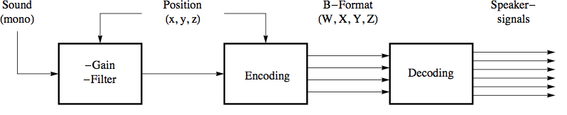
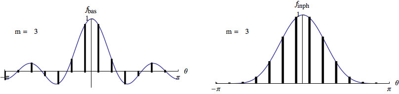
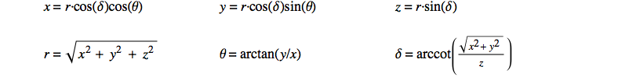
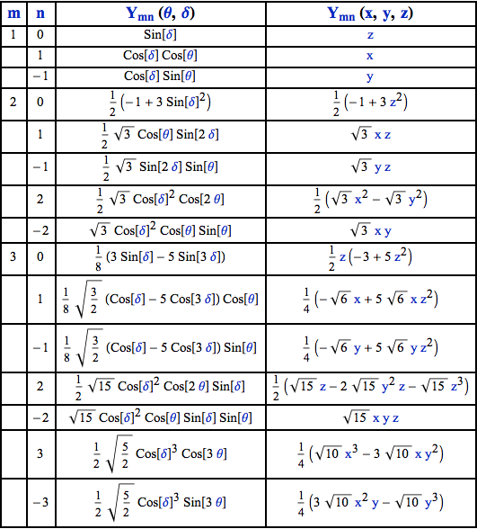

05 B. PANNING AND SPATIALIZATION
================================

Simple Stereo Panning 
----------------------

Csound provides a large number of opcodes designed to assist in the
distribution of sound amongst two or more speakers. These range from
opcodes that merely balance a sound between two channels to one that
include algorithms to simulate the doppler shift which occurs when sound
moves, algorithms that simulate the filtering and inter-aural delay that
occurs as sound reaches both our ears and algorithms that simulate
distance in an acoustic space.

First we will look at some methods of panning a sound between two
speakers based on first principles.

The simplest method that is typically encountered is to multiply one
channel of audio (aSig) by a panning variable (kPan) and to multiply the
other side by 0 minus the same variable like this:

    aSigL  =  aSig * kPan
    aSigR  =  aSig * (1 – kPan)
              outs aSigL, aSigR

kPan should be a value within the range zero and 1. If kPan is 1 all of
the signal will be in the left channel, if it is zero, all of the signal
will be in the right channel and if it is 0.5 there will be signal of
equal amplitude in both the left and the right channels. This way the
signal can be continuously panned between the left and right channels.

The problem with this method is that the overall power drops as the
sound is panned to the middle.

One possible solution to this problem is to take the square root of the
panning variable for each channel before multiplying it to the audio
signal like this:

    aSigL  =     aSig * sqrt(kPan)
    aSigR  =     aSig * sqrt((1 – kPan))
           outs  aSigL, aSigR

By doing this, the straight line function of the input panning variable
becomes a convex curve, so that less power is lost as the sound is
panned centrally.

Using 90º sections of a sine wave for the mapping produces a more convex
curve and a less immediate drop in power as the sound is panned away
from the extremities. This can be implemented using the code shown
below.

    aSigL  =     aSig * sin(kPan*$M_PI_2)
    aSigR  =     aSig * cos(kPan*$M_PI_2)
           outs  aSigL, aSigR

(Note that \'\$M\_PI\_2\' is one of [Csound\'s built in
macros](https://csound.com/docs/manual/define.html "Ambisonic UDOs")
and is equivalent to pi/2.)

A fourth method, devised by Michael Gogins, places the point of maximum
power for each channel slightly before the panning variable reaches its
extremity. The result of this is that when the sound is panned
dynamically it appears to move beyond the point of the speaker it is
addressing. This method is an elaboration of the previous one and makes
use of a different 90 degree section of a sine wave. It is implemented
using the following code:

    aSigL  =     aSig * sin((kPan + 0.5) * $M_PI_2)
    aSigR  =     aSig * cos((kPan + 0.5) * $M_PI_2)
           outs  aSigL, aSigR

The following example demonstrates all three methods one after the other
for comparison. Panning movement is controlled by a slow moving LFO. The
input sound is filtered pink noise.

 

**   *EXAMPLE 05B01\_Pan\_stereo.csd***

    <CsoundSynthesizer>

    <CsOptions>
    -odac ; activates real time sound output
    </CsOptions>

    <CsInstruments>
    sr = 44100
    ksmps = 10
    nchnls = 2
    0dbfs = 1

      instr 1
    imethod  =         p4 ; read panning method variable from score (p4)

    ;---------------- generate a source sound -------------------
    a1       pinkish   0.3            ; pink noise
    a1       reson     a1, 500, 30, 1 ; bandpass filtered
    aPan     lfo       0.5, 1, 1      ; panning controlled by an lfo
    aPan     =         aPan + 0.5     ; offset shifted +0.5
    ;------------------------------------------------------------

     if imethod=1 then
    ;------------------------ method 1 --------------------------
    aPanL    =         aPan
    aPanR    =         1 - aPan
    ;------------------------------------------------------------
     endif

     if imethod=2 then
    ;------------------------ method 2 --------------------------
    aPanL    =       sqrt(aPan)
    aPanR    =       sqrt(1 - aPan)
    ;------------------------------------------------------------
     endif

     if imethod=3 then
    ;------------------------ method 3 --------------------------
    aPanL    =       sin(aPan*$M_PI_2)
    aPanR    =       cos(aPan*$M_PI_2)
    ;------------------------------------------------------------
     endif

     if imethod=4 then
    ;------------------------ method 4 --------------------------
    aPanL   =  sin((aPan + 0.5) * $M_PI_2)
    aPanR   =  cos((aPan + 0.5) * $M_PI_2)
    ;------------------------------------------------------------
     endif

             outs    a1*aPanL, a1*aPanR ; audio sent to outputs
      endin

    </CsInstruments>

    <CsScore>
    ; 4 notes one after the other to demonstrate 4 different methods of panning
    ; p1 p2  p3   p4(method)
    i 1  0   4.5  1
    i 1  5   4.5  2
    i 1  10  4.5  3
    i 1  15  4.5  4
    e
    </CsScore>
    </CsoundSynthesizer>

 

An opcode called
[pan2](https://csound.com/docs/manual/pan2.html "Ambisonic UDOs")
exists which makes it slightly easier for us to implement various
methods of panning. The following example demonstrates the three methods
that this opcode offers one after the other. The first is the \'equal
power\' method, the second \'square root\' and the third is simple
linear. The [Csound
Manual](https://csound.com/docs/manual/index.html "Ambisonic UDOs")
describes a fourth method but this one does not seem to function
currently.

 

**   *EXAMPLE 05B02\_pan2.csd***

    <CsoundSynthesizer>
    <CsOptions>
    -odac ; activates real time sound output
    </CsOptions>

    <CsInstruments>
    sr = 44100
    ksmps = 10
    nchnls = 2
    0dbfs = 1

      instr 1
    imethod        =         p4 ; read panning method variable from score (p4)
    ;----------------------- generate a source sound ------------------------
    aSig           pinkish   0.5              ; pink noise
    aSig           reson     aSig, 500, 30, 1 ; bandpass filtered
    ;------------------------------------------------------------------------

    ;---------------------------- pan the signal ----------------------------
    aPan           lfo       0.5, 1, 1        ; panning controlled by an lfo
    aPan           =         aPan + 0.5       ; DC shifted + 0.5
    aSigL, aSigR   pan2      aSig, aPan, imethod; create stereo panned output
    ;------------------------------------------------------------------------

                   outs      aSigL, aSigR     ; audio sent to outputs
      endin

    </CsInstruments>

    <CsScore>
    ; 3 notes one after the other to demonstrate 3 methods used by pan2
    ;p1 p2  p3   p4
    i 1  0  4.5   0 ; equal power (harmonic)
    i 1  5  4.5   1 ; square root method
    i 1 10  4.5   2 ; linear
    e
    </CsScore>
    </CsoundSynthesizer>

In the next example we will generate some sounds as the primary signal.
We apply some delay and reverb to this signal to produce a secondary
signal. A random function will pan the primary signal between the
channels, but the secondary signal remains panned in the middle all the
time.

***   EXAMPLE 05B03\_Different\_pan\_layers.csd***

    <CsoundSynthesizer>
    <CsOptions>
    -o dac -d
    </CsOptions>

    <CsInstruments>
    ; Example by Bjorn Houdorf, March 2013

    sr = 44100
    ksmps = 32
    nchnls = 2
    0dbfs = 1
               seed       0

    instr 1
    ktrig      metro      0.8; Trigger frequency, instr. 2
               scoreline  "i 2 0 4", ktrig
    endin

    instr 2
    ital       random     60, 72; random notes
    ifrq       =          cpsmidinn(ital)
    knumpart1  oscili     4, 0.1, 1
    knumpart2  oscili     5, 0.11, 1
    ; Generate primary signal.....
    asig       buzz       0.1, ifrq, knumpart1*knumpart2+1, 1
    ipan       random     0, 1; ....make random function...
    asigL, asigR pan2     asig, ipan, 1; ...pan it...
               outs       asigL, asigR ;.... and output it..
    kran1      randomi    0,4,3
    kran2      randomi    0,4,3
    asigdel1   delay      asig, 0.1+i(kran1)
    asigdel2   delay      asig, 0.1+i(kran2)
    ; Make secondary signal...
    aL, aR     reverbsc   asig+asigdel1, asig+asigdel2, 0.9, 15000
               outs       aL, aR; ...and output it
    endin
    </CsInstruments>

    <CsScore>
    f1 0 8192 10 1
    i1 0 60
    </CsScore>
    </CsoundSynthesizer>

3D Binaural Encoding 
---------------------

3D binaural encoding is available through a number of opcodes that make
use of spectral data files that provide information about the filtering
and inter-aural delay effects of the human head. The oldest one of these
is
[hrtfer](https://csound.com/docs/manual/hrtfer.html "Ambisonic UDOs").
Newer ones are
[hrtfmove](https://csound.com/docs/manual/hrtfmove.html "Ambisonic UDOs"),
[hrtfmove2](https://csound.com/docs/manual/hrtfmove2.html "Ambisonic UDOs")
and
[hrtfstat](https://csound.com/docs/manual/hrtfstat.html "Ambisonic UDOs").
The main parameters for control of the opcodes are azimuth (the
horizontal direction of the source expressed as an angle formed from the
direction in which we are facing) and elevation (the angle by which the
sound deviates from this horizontal plane, either above or below). Both
these parameters are defined in degrees. \'Binaural\' infers that the
stereo output of this opcode should be listened to using headphones so
that no mixing in the air of the two channels occurs before they reach
our ears (although a degree of effect is still audible through
speakers).

The following example take a monophonic source sound of noise impulses
and processes it using the *hrtfmove2* opcode. First of all the sound is
rotated around us in the horizontal plane then it is raised above our
head then dropped below us and finally returned to be level and directly
in front of us. For this example to work you will need to download the
files hrtf-44100-left.dat and hrtf-44100-right.dat ([a place to download
them may be
here](https://github.com/audiokit/AudioKit/tree/master/AudioKit/Resources/AKSoundFiles.bundle/Sounds "Ambisonic UDOs"))
and place them in your SADIR (see [setting environment
variables](https://csound.com/docs/manual/CommandEnvironment.html "Ambisonic UDOs"))
or in the same directory as the .csd.

 

**   *EXAMPLE 05B04\_hrtfmove.csd***

    <CsoundSynthesizer>
    <CsOptions>
    -odac ; activates real time sound output
    </CsOptions>

    <CsInstruments>
    ; Example by Iain McCurdy

    sr = 44100
    ksmps = 10
    nchnls = 2
    0dbfs = 1

    giSine         ftgen       0, 0, 2^12, 10, 1             ; sine wave
    giLFOShape     ftgen       0, 0, 131072, 19, 0.5,1,180,1 ; U-shape parabola

      instr 1
    ; create an audio signal (noise impulses)
    krate          oscil       30,0.2,giLFOShape            ; rate of impulses
    ; amplitude envelope: a repeating pulse
    kEnv           loopseg     krate+3,0, 0,1, 0.05,0, 0.95,0,0
    aSig           pinkish     kEnv                             ; noise pulses

    ; -- apply binaural 3d processing --
    ; azimuth (direction in the horizontal plane)
    kAz            linseg      0, 8, 360
    ; elevation (held horizontal for 8 seconds then up, then down, then horizontal
    kElev          linseg      0, 8,   0, 4, 90, 8, -40, 4, 0
    ; apply hrtfmove2 opcode to audio source - create stereo ouput
    aLeft, aRight  hrtfmove2   aSig, kAz, kElev, \
                                   "hrtf-44100-left.dat","hrtf-44100-right.dat"
                   outs        aLeft, aRight                 ; audio to outputs
    endin

    </CsInstruments>

    <CsScore>
    i 1 0 24 ; instr 1 plays a note for 24 seconds
    e
    </CsScore>
    </CsoundSynthesizer>

Going Multichannel
------------------

So far we have only considered working in 2-channels/stereo, but Csound
is extremely flexible at working in more that 2 channels. By changing
nchnls in the orchestra header we can specify any number of channels but
we also need to ensure that we choose an audio hardware device using
*-odac* that can handle multichannel audio. Audio channels sent from
Csound, that do not address hardware channels, will simply not be
reproduced. There may be some need to make adjustments to the software
settings of your soundcard using its own software or the operating
system\'s software, but due to the variety of sound hardware options
available, it would be impossible to offer further specific advice here.

Sending Multichannel Sound to the Loudspeakers
----------------------------------------------

In order to send multichannel audio we must use opcodes designed for
that task. So far we have used
[outs](https://csound.com/docs/manual/outs.html "Ambisonic UDOs") to
send stereo sound to a pair of loudspeakers. (The \'s\' actually stands
for \'stereo\'). Correspondingly there exist opcodes for quadophonic
([outq](https://csound.com/docs/manual/outq.html "Ambisonic UDOs")),
hexaphonic
([outh](https://csound.com/docs/manual/outh.html "Ambisonic UDOs")),
octophonic
([outo](https://csound.com/docs/manual/outo.html "Ambisonic UDOs")),
16-channel sound
([outx](https://csound.com/docs/manual/outx.html "Ambisonic UDOs"))
and 32-channel sound
([out32](https://csound.com/docs/manual/out32.html "Ambisonic UDOs")).

For example:

     outq  a1, a2, a3, a4

sends four independent audio streams to four hardware channels. Any
unrequired channels still have to be given an audio signal. A typical
workaround would be to give them \'silence\'. For example if only 5
channels were required:

    nchnls   =  6

    ; --snip--

    aSilence =    0
             outh a1, a2, a3, a4, a5, aSilence

These opcodes only address very specific loudspeaker arrangements
(although workarounds are possible) and have been superseded, to a large
extent, by newer opcodes that allow greater flexibility in the number
and routing of audio to a multichannel output.

[outc](https://csound.com/docs/manual/outc.html "Ambisonic UDOs")
allows us to address any number of output audio channels, but they still
need to be addressed sequentially. For example our 5-channel audio could
be design as follows:

    nchnls   =  5

    ; --snip--

        outc a1, a2, a3, a4, a5

[outch](https://csound.com/docs/manual/outch.html "Ambisonic UDOs")
allows us to direct audio to a specific channel or list of channels and
takes the form:

    outch kchan1, asig1 [, kchan2] [, asig2] [...]

For example, our 5-channel audio system could be designed using outch as
follows:

    nchnls   =  5

    ; --snip--

        outch 1,a1, 2,a2, 3,a3, 4,a4, 5,a5

Note that channel numbers can be changed at k-rate thereby opening the
possibility of changing the speaker configuration dynamically during
performance. Channel numbers do not need to be sequential and unrequired
channels can be left out completely. This can make life much easier when
working with complex systems employing many channels.

Flexibly Moving Between Stereo and Multichannel
-----------------------------------------------

It may be useful to be able to move between working in multichannel
(beyond stereo) and then moving back to stereo (when, for example, a
multichannel setup is not available). It won\'t be sufficient to simply
change nchnls = 2. It will also be necessary to change all *outq*,
*outo*, *outch* etc to *outs.* In complex orchestras this could
laboursome and particularly so if it is required to go back to a
multichannel configuration later on. In this situation conditional
outputs based on the nchnls value are useful. For example:

     if nchnls==4 then
         outq  a1,a2,a3,a4
     elseif nchnls==2 then
         outs  a1+a3, a2+a4
     endif

Using this method, it will only be required to change nchnls = \... in
the orchestra header. In stereo mode, if nchnls = 2, at least all audio
streams will be monitored, even if the results do not reflect the four
channel spatial arrangement.

Rendering Multichannel Audio Streams as Sound Files
---------------------------------------------------

So far we have referred to outs, outo etc. as a means to send audio to
the speakers but strictly speaking they are only sending audio to
Csound\'s output (as specified by nchnls) and the final destination will
be defined using a command line flag in \<CsOptions\>\</CsOptions\>.
-odac will indeed instruct Csound to send audio to the audio hardware
and then onto the speakers but we can alternatively send audio to a
sound file using -oSoundFile.wav. Provided a file type that supports
multichannel interleaved data is chosen (\".wav\" will work), a
multichannel file will be created that can be used in some other audio
applications or can be re-read by Csound later on by using, for example,
[diskin2](https://csound.com/docs/manual/diskin2.html "Ambisonic UDOs").
This method is useful for rendering audio that is too complex to be
monitored in real-time. Only single interleaved sound files can be
created, separate mono files cannot be created using this method.
Simultaneously monitoring the audio generated by Csound whilst rendering
will not be possible when using this method; we must choose one or the
other.

An alternative method of rendering audio in Csound, and one that will
allow simulatenous monitoring in real-time, is to use the
[fout](https://csound.com/docs/manual/fout.html "Ambisonic UDOs")
opcode. For example:

    fout  "FileName.wav", 8, a1, a2, a3, a4
    outq  a1, a2, a3, a4

 

will render an interleaved, 24-bit, 4-channel sound file whilst
simultaneously sending the quadrophonic audio to the loudspeakers.

If we wanted to de-interleave an interleaved sound file into multiple
mono sound files we could use the code:

    a1, a2, a3, a4   soundin   "4ChannelSoundFile.wav"
     fout      "Channel1.wav", 8, a1
     fout      "Channel2.wav", 8, a2
     fout      "Channel3.wav", 8, a3
     fout      "Channel4.wav", 8, a4

VBAP
----

Vector Base Amplitude Panning^1^  can be described as a method which
extends stereo panning to more than two speakers. The number of speakers
is, in general, arbitrary. You can configure for standard layouts such
as quadrophonic, octophonic or 5.1 configuration, but in fact any number
of speakers can be positioned even in irregular distances from each
other. If you are fortunate enough to have speakers arranged at
different heights, you can even configure VBAP for three dimensions.

### Basic Steps

First you must tell VBAP where your loudspeakers are positioned. Let us
assume you have seven speakers in the positions and numberings outlined
below (M = middle/centre):

::: {.group_img}
::: {.image}
{width="600" height="424"}
:::
:::

\
The opcode
[vbaplsinit](https://csound.com/docs/manual/vbaplsinit.html "Ambisonic UDOs"),
which is usually placed in the header of a Csound orchestra, defines
these positions as follows:

    vbaplsinit 2, 7, -40, 40, 70, 140, 180, -110, -70

The first number determines the number of dimensions (here 2). The
second number states the overall number of speakers, then followed by
the positions in degrees (clockwise).

All that is required now is to provide vbap with a monophonic sound
source to be distributed amongst the speakers according to information
given about the position. Horizontal position (azimuth) is expressed in
degrees clockwise just as the initial locations of the speakers were.
The following would be the Csound code to play the sound file
\"ClassGuit.wav\" once while moving it counterclockwise:

 

**   *EXAMPLE 05B05\_VBAP\_circle.csd***

 

    <CsoundSynthesizer>
    <CsOptions>
    -odac -d ;for the next line, change to your folder
    --env:SSDIR+=/home/jh/Joachim/Csound/FLOSS/audio
    </CsOptions>
    <CsInstruments>
    sr = 44100
    ksmps = 32
    0dbfs = 1
    nchnls = 7

    vbaplsinit 2, 7, -40, 40, 70, 140, 180, -110, -70

      instr 1
    Sfile      =          "ClassGuit.wav"
    iFilLen    filelen    Sfile
    p3         =          iFilLen
    aSnd, a0   soundin    Sfile
    kAzim      line       0, p3, -360 ;counterclockwise
    a1, a2, a3, a4, a5, a6, a7, a8 vbap8 aSnd, kAzim
    outch 1, a1, 2, a2, 3, a3, 4, a4, 5, a5, 6, a6, 7, a7
      endin
    </CsInstruments>
    <CsScore>
    i 1 0 1
    </CsScore>
    </CsoundSynthesizer>
    ;example by joachim heintz

In the CsOptions tag, you see the option *\--env:SSDIR+= \...* as a
possibility to add a folder to the path in which Csound usually looks
for your samples (SSDIR = Sound Sample Directory) if you call them only
by name, without the full path. To play the full length of the sound
file (without prior knowledge of its duration) the filelen opcode is
used to derive this duration, and then the duration of this instrument
(p3) is set to this value. The p3 given in the score section (here 1) is
overwritten by this value.

The circular movement is a simple k-rate line signal, from 0 to -360
across the duration of the sound file (in this case the same as p3).
Note that we have to use the opcode *vbap8* here, as there is no vbap7.
Just give the eighth channel a variable name (a8) and thereafter ignore
it.

### The Spread Parameter

As VBAP derives from a panning paradigm, it has one problem which
becomes more serious as the number of speakers increases. Panning
between two speakers in a stereo configuration means that all speakers
are active. Panning between two speakers in a quadro configuration means
that half of the speakers are active. Panning between two speakers in an
octo configuration means that only a quarter of the speakers are active
and so on; so that the actual perceived extent of the sound source
becomes unintentionally smaller and smaller.

To alleviate this tendency, Ville Pulkki has introduced an additional
parameter, called \'spread\', which has a range of zero to hundred
percent.^2^  The \'ascetic\' form of VBAP we have seen in the previous
example, means: no spread (0%). A spread of 100% means that all speakers
are active, and the information about where the sound comes from is
nearly lost.

As the *kspread* input to the *vbap8* opcode is the second of two
optional parameters, we first have to provide the first one*. kelev*
defines the elevation of the sound - it is always zero for two
dimensions, as in the speaker configuration in our example. The next
example adds a spread movement to the previous one. The spread starts at
zero percent, then increases to hundred percent, and then decreases back
down to zero.

 

**   *EXAMPLE 05B06\_VBAP\_spread.csd***

    <CsoundSynthesizer>
    <CsOptions>
    -odac -d ;for the next line, change to your folder
    --env:SSDIR+=/home/jh/Joachim/Csound/FLOSS/audio
    </CsOptions>
    <CsInstruments>
    sr = 44100
    ksmps = 32
    0dbfs = 1
    nchnls = 7

    vbaplsinit 2, 7, -40, 40, 70, 140, 180, -110, -70

      instr 1
    Sfile      =          "ClassGuit.wav"
    iFilLen    filelen    Sfile
    p3         =          iFilLen
    aSnd, a0   soundin    Sfile
    kAzim      line       0, p3, -360
    kSpread    linseg     0, p3/2, 100, p3/2, 0
    a1, a2, a3, a4, a5, a6, a7, a8 vbap8 aSnd, kAzim, 0, kSpread
    outch 1, a1, 2, a2, 3, a3, 4, a4, 5, a5, 6, a6, 7, a7
      endin
    </CsInstruments>
    <CsScore>
    i 1 0 1
    </CsScore>
    </CsoundSynthesizer>
    ;example by joachim heintz

### New VBAP Opcodes

As a response to a number of requests, John fFitch has written new VBAP
opcodes in 2012 whose main goal is to allow more than one loudspeaker
configuration within a single orchestra (so that you can switch between
them during performance) and to provide more flexibility in the number
of output channels used. Here is an example for three different
configurations which are called in three different instruments:

 

**   *EXAMPLE 05B07\_VBAP\_new.csd***

    <CsoundSynthesizer>
    <CsOptions>
    -odac -d ;for the next line, change to your folder
    --env:SSDIR+=/home/jh/Joachim/Csound/FLOSS/audio
    </CsOptions>
    <CsInstruments>
    sr = 44100
    ksmps = 32
    0dbfs = 1
    nchnls = 7

    vbaplsinit 2.01, 7, -40, 40, 70, 140, 180, -110, -70
    vbaplsinit 2.02, 2, -40, 40
    vbaplsinit 2.03, 3, -70, 180, 70

      instr 1
    aSnd, a0   soundin    "ClassGuit.wav"
    kAzim      line       0, p3, -360
    a1, a2, a3, a4, a5, a6, a7 vbap aSnd, kAzim, 0, 0, 1
    outch 1, a1, 2, a2, 3, a3, 4, a4, 5, a5, 6, a6, 7, a7
      endin

      instr 2
    aSnd, a0   soundin    "ClassGuit.wav"
    kAzim      line       0, p3, -360
    a1, a2     vbap       aSnd, kAzim, 0, 0, 2
               outch      1, a1, 2, a2
      endin

      instr 3
    aSnd, a0   soundin    "ClassGuit.wav"
    kAzim      line       0, p3, -360
    a1, a2, a3 vbap       aSnd, kAzim, 0, 0, 3
               outch      7, a1, 3, a2, 5, a3
      endin

    </CsInstruments>
    <CsScore>
    i 1 0 6
    i 2 6 6
    i 3 12 6
    </CsScore>
    </CsoundSynthesizer>
    ;example by joachim heintz

 

Instead of just one loudspeaker configuration, as in the previous
examples, there are now three configurations:

 

    vbaplsinit 2.01, 7, -40, 40, 70, 140, 180, -110, -70
    vbaplsinit 2.02, 2, -40, 40
    vbaplsinit 2.03, 3, -70, 180, 70

The first parameter (the number of dimensions) now has an additional
fractional part, with a range from .01 to .99, specifying the number of
the speaker layout. So *2.01* means: two dimensions, layout number one,
*2.02* is layout number two, and *2.03* is layout number three. The new
[vbap](https://csound.com/docs/manual/vbap.html "Ambisonic UDOs")
opcode has now these parameters:

    ar1[, ar2...] vbap asig, kazim [, kelev] [, kspread] [, ilayout]

The last parameter *ilayout* refers to the speaker layout number. In the
example above, instrument 1 uses layout 1, instrument 2 uses layout 2,
and instrument 3 uses layout 3. Even if you do not have more than two
speakers you should see in Csound\'s output that instrument 1 goes to
all seven speakers, instrument 2 only to the first two, and instrument 3
goes to speaker 3, 5, and 7.

In addition to the new
[vbap](https://csound.com/docs/manual/vbap.html "Ambisonic UDOs")
opcode,
[vbapg](https://csound.com/docs/manual/vbapg.html "Ambisonic UDOs")
has been written. The idea is to have an opcode which returns the gains
(amplitudes) of the speakers instead of the audio signal:

    k1[, k2...] vbapg kazim [,kelev] [, kspread] [, ilayout]

Ambisonics
----------

Ambisonics is another technique to distribute a virtual sound source in
space.

There are excellent sources for the discussion of Ambisonics
online^3^and the following chapter will give a step by step
introduction. We will focus just on the basic practicalities of using
the Ambisonics opcodes of Csound, without going into too much detail of
the concepts behind them. 

Ambisonics works using two basic steps. In the first step you **encode**
the sound and the spatial information (its localisation) of a virtual
sound source in a so-called **B-format**. In the second step you
**decode** the B-format to match your loudspeaker setup.

It is possible to save the B-format as its own audio file, to preserve
the spatial information or you can immediately do the decoding after the
encoding thereby dealing directly only with audio signals instead of
Ambisonic files. The next example takes the latter approach by
implementing a transformation of the VBAP circle example to Ambisonics.

 

**   *EXAMPLE 05B08\_Ambi\_circle.csd***

    <CsoundSynthesizer>
    <CsOptions>
    -odac -d ;for the next line, change to your folder
    --env:SSDIR+=/home/jh/Joachim/Csound/FLOSS/Release01/Csound_Floss_Release01/audio
    </CsOptions>
    <CsInstruments>
    sr = 44100
    ksmps = 32
    0dbfs = 1
    nchnls = 8

      instr 1
    Sfile      =          "ClassGuit.wav"
    iFilLen    filelen    Sfile
    p3         =          iFilLen
    aSnd, a0   soundin    Sfile
    kAzim      line       0, p3, 360 ;counterclockwise (!)
    iSetup     =          4 ;octogon
    aw, ax, ay, az bformenc1 aSnd, kAzim, 0
    a1, a2, a3, a4, a5, a6, a7, a8 bformdec1 iSetup, aw, ax, ay, az
    outch 1, a1, 2, a2, 3, a3, 4, a4, 5, a5, 6, a6, 7, a7, 8, a8
      endin
    </CsInstruments>
    <CsScore>
    i 1 0 1
    </CsScore>
    </CsoundSynthesizer>
    ;example by joachim heintz

The first thing to note is that for a counterclockwise circle, the
azimuth now has the line 0 -\> 360, instead of 0 -\> -360 as was used in
the VBAP example. This is because Ambisonics usually reads the angle in
a mathematical way: a positive angle is *counter*clockwise. Next, the
encoding process is carried out in the line:

    aw, ax, ay, az bformenc1 aSnd, kAzim, 0

Input arguments are the monophonic sound source *aSnd*, the xy-angle
*kAzim*, and the elevation angle which is set to zero. Output signals
are the spatial information in x-, y- and z- direction (*ax, ay, az*),
and also an omnidirectional signal called *aw*. 

Decoding is performed by the line:

    a1, a2, a3, a4, a5, a6, a7, a8 bformdec1 iSetup, aw, ax, ay, az

The inputs for the decoder are the same *aw,* *ax, ay, az*, which were
the results of the encoding process, and an additional *iSetup*
parameter. Currently the Csound decoder only works with some standard
setups for the speaker: *iSetup = 4* refers to an octogon.^4^ So the
final eight audio signals *a1, \..., a8* are being produced using this
decoder, and are then sent to the speakers in the same way using the
[outch](https://csound.com/docs/manual/outch.html "Ambisonic UDOs")
opcode.

### Different Orders

What we have seen in this example is called \'first order\' ambisonics.
This means that the encoding process leads to the four basic dimensions
w, x, y, z as described above.^5^ In \"second order\" ambisonics, there
are additional \"directions\" called r, s, t, u, v. And in \"third
order\" ambisonics again the additional k, l, m, n, o, p, q. The final
example in this section shows the three orders, each of them in one
instrument. If you have eight speakers in octophonic setup, you can
compare the results.

 

**   *EXAMPLE 05B09\_Ambi\_orders.csd***

    <CsoundSynthesizer>
    <CsOptions>
    -odac -d ;for the next line, change to your folder
    --env:SSDIR+=/home/jh/Joachim/Csound/FLOSS/Release01/Csound_Floss_Release01/audio
    </CsOptions>
    <CsInstruments>
    sr = 44100
    ksmps = 32
    0dbfs = 1
    nchnls = 8

      instr 1 ;first order
    aSnd, a0   soundin    "ClassGuit.wav"
    kAzim      line       0, p3, 360
    iSetup     =          4 ;octogon
    aw, ax, ay, az bformenc1 aSnd, kAzim, 0
    a1, a2, a3, a4, a5, a6, a7, a8 bformdec1 iSetup, aw, ax, ay, az
    outch 1, a1, 2, a2, 3, a3, 4, a4, 5, a5, 6, a6, 7, a7, 8, a8
      endin

      instr 2 ;second order
    aSnd, a0   soundin    "ClassGuit.wav"
    kAzim      line       0, p3, 360
    iSetup     =          4 ;octogon
    aw, ax, ay, az, ar, as, at, au, av bformenc1 aSnd, kAzim, 0
    a1, a2, a3, a4, a5, a6, a7, a8 bformdec1 iSetup, aw, ax, ay, az, ar, as, at, au, av
    outch 1, a1, 2, a2, 3, a3, 4, a4, 5, a5, 6, a6, 7, a7, 8, a8
      endin

      instr 3 ;third order
    aSnd, a0   soundin    "ClassGuit.wav"
    kAzim      line       0, p3, 360
    iSetup     =          4 ;octogon
    aw, ax, ay, az, ar, as, at, au, av, ak, al, am, an, ao, ap, aq bformenc1 aSnd, kAzim, 0
    a1, a2, a3, a4, a5, a6, a7, a8 bformdec1 iSetup, aw, ax, ay, az, ar, as, at, au, av, ak, al, am, an, ao, ap, aq
    outch 1, a1, 2, a2, 3, a3, 4, a4, 5, a5, 6, a6, 7, a7, 8, a8
      endin
    </CsInstruments>
    <CsScore>
    i 1 0 6
    i 2 6 6
    i 3 12 6
    </CsScore>
    </CsoundSynthesizer>
    ;example by joachim heintz

 

In theory, first-order ambisonics need at least 4 speakers to be
projected correctly. Second-order ambisonics needs at least 6 speakers
(9, if 3 dimensions are employed). Third-order ambisonics need at least
8 speakers (or 16 for 3d). So, although higher order should in general
lead to a better result in space, you cannot expect it to work unless
you have a sufficient number of speakers. Of course practice over theory
may prove to be a better judge in many cases.

Ambisonics UDOs
---------------

### Usage of the ambisonics UDOs

This chapter gives an overview of the UDOs explained below.

The channels of the B-format are stored in a zak space. Call zakinit
only once and put it outside of any instrument definition in the
orchestra file after the header. zacl clears the za space and is called
after decoding. The B format of order n can be decoded in any order \<=
n. 

The text files \"ambisonics\_udos.txt\", \"ambisonics2D\_udos.txt\",
\"AEP\_udos.txt\" and \"utilities.txt\" must be located in the same
folder as the csd files or included with full path.

These files can be downloaded together with the entire examples (some of
them for CsoundQt) from [here (as of September
2015).](https://www.zhdk.ch/index.php?id=icst_ambisonicsudo "Ambisonic UDOs")

 

    zakinit isizea, isizek    (isizea = (order + 1)^2 in ambisonics (3D); isizea = 2·order + 1 in ambi2D; isizek = 1)

    #include "ambisonics_udos.txt"  (order <= 8)
            ambi_encode     asnd, iorder, kazimuth, kelevation (azimuth, elevation in degrees)
            ambi_enc_dist asnd, iorder, kazimuth, kelevation, kdistance
    a1 [, a2] ... [, a8]    ambi_decode     iorder, ifn
    a1 [, a2] ... [, a8]    ambi_dec_inph   iorder, ifn
    f ifn  0  n  -2 p1 az1 el1 az2 el2 ... (n is a power of 2 greater than 3·number_of_spekers + 1) (p1 is not used)
            ambi_write_B    "name", iorder, ifile_format    (ifile_format see fout in the csound help)
            ambi_read_B     "name", iorder (only <= 5)
    kaz, kel, kdist xyz_to_aed      kx, ky, kz

    ;#include "ambisonics2D_udos.txt"
            ambi2D_encode   asnd, iorder, kazimuth  (any order) (azimuth in degrees)
            ambi2D_enc_dist asnd, iorder, kazimuth, kdistance
    a1 [, a2] ... [, a8]    ambi2D_decode   iorder, iaz1 [, iaz2] ...       [, iaz8]
    a1 [, a2] ... [, a8]    ambi2D_dec_inph iorder, iaz1 [, iaz2] ...       [, iaz8]        (order <= 12)
            ambi2D_write_B  "name", iorder, ifile_format
            ambi2D_read_B   "name", iorder  (order <= 19)
    kaz, kdist      xy_to_ad        kx, ky

    #include "AEP_udos.txt" (any order integer or fractional)
    a1 [, a2] ... [, a16] AEP_xyz   asnd, korder, ifn, kx, ky, kz, kdistance
    f ifn  0  64  -2  max_speaker_distance x1 y1 z1 x2 y2 z2 ...
    a1 [, a2] ... [, a8] AEP        asnd, korder, ifn, kazimuth, kelevation, kdistance (azimuth, elevation in degrees)
    f ifn  0  64  -2  max_speaker_distance az1 el1 dist1 az2 el2 dist2 ...  (azimuth, elevation in degrees)

    ;#include "ambi_utilities.txt"
    kdist   dist    kx, ky
    kdist   dist    kx, ky, kz
    ares    Doppler asnd, kdistance
    ares    absorb  asnd, kdistance
    kx, ky, kz      aed_to_xyz      kazimuth, kelevation, kdistance
    ix, iy, iz      aed_to_xyz      iazimuth, ielevation, idistance
    a1 [, a2] ... [, a16]   dist_corr       a1 [, a2] ... [, a16], ifn
    f ifn  0  32  -2  max_speaker_distance dist1, dist2, ... (distances in m)
    irad    radiani idegree
    krad    radian  kdegree
    arad    radian  adegree
    idegree degreei irad
    kdegree degree  krad
    adegree degree  arad

### Introduction

In the following introduction we will explain the principles of
ambisonics step by step and write an opcode for every step. The opcodes
above combine all of the functionality described. Since the
two-dimensional analogy to Ambisonics is easier to understand and to
implement with a simple equipment, we shall fully explain it first.

Ambisonics is a technique of three-dimensional sound projection. The
information about the recorded or synthesized sound field is encoded and
stored in several channels, taking no account of the arrangement of the
loudspeakers for reproduction. The encoding of a signal\'s spatial
information can be more or less precise, depending on the so-called
order of the algorithm used. Order zero corresponds to the monophonic
signal and requires only one channel for storage and reproduction. In
first-order Ambisonics, three further channels are used to encode the
portions of the sound field in the three orthogonal directions x, y and
z. These four channels constitute the so-called first-order B-format.
When Ambisonics is used for artificial spatialisation of recorded or
synthesized sound, the encoding can be of an arbitrarily high order. The
higher orders cannot be interpreted as easily as orders zero and one. 

In a two-dimensional analogy to Ambisonics (called Ambisonics2D in what
follows), only sound waves in the horizontal plane are encoded.

The loudspeaker feeds are obtained by decoding the B-format signal. The
resulting panning is amplitude panning, and only the direction to the
sound source is taken into account.

The illustration below shows the principle of Ambisonics. First a sound
is generated and its position determined. The amplitude and spectrum are
adjusted to simulate distance, the latter using a low-pass filter. Then
the Ambisonic encoding is computed using the sound\'s coordinates.
Encoding mth order B-format requires n = (m+1)\^2 channels (n = 2m + 1
channels in Ambisonics2D). By decoding the B-format, one can obtain the
signals for any number (\>= n) of loudspeakers in any arrangement. Best
results are achieved with symmetrical speaker arrangements. 

If the B-format does not need to be recorded the speaker signals can be
calculated at low cost and arbitrary order using so-called ambisonics
equivalent panning (AEP). 

 

::: {.group_img}
::: {.image}
{width="582" height="118"}
:::
:::

**Ambisonics2D **

### Introduction

We will first explain the encoding process in Ambisonics2D. The position
of a sound source in the horizontal plane is given by two coordinates.
In Cartesian coordinates (x, y) the listener is at the origin of the
coordinate system (0, 0), and the x-coordinate points to the front, the
y-coordinate to the left. The position of the sound source can also be
given in polar coordinates by the angle ψ between the line of vision of
the listener (front) and the direction to the sound source, and by their
distance r. Cartesian coordinates can be converted to polar coordinates
by the formulae: 

  r =    and  ψ = arctan(x, y), 

polar to Cartesian coordinates by 

  x = r·cos(ψ) and y = r·sin(ψ).  

 

 

::: {.group_img}
::: {.image}

:::
:::

 

The 0th order B-Format of a signal S of a sound source on the unit
circle is just the mono signal: W0 = W = S. The first order B-Format
contains two additional channels: W1,1 = X = S·cos(ψ) = S·x and W1,2 = Y
= S·sin(ψ) = S·y, i.e. the product of the Signal S with the sine and the
cosine of the direction ψ of the sound source. The B-Format higher order
contains two additional channels per order m: Wm, 1 = S·cos(mψ) and Wm,
2 = S·sin(mψ).

 

 W0 = S

 W1,1 = X = S·cos(ψ) = S·x W1,2 = Y = S·sin(ψ) = S·y

 W2,1 = S·cos(2ψ) W2,2 = S·sin(2ψ)

 \...

 Wm,1 = S·cos(mψ)    Wm,2 = S·sin(mψ) 

 

From the n = 2m + 1 B-Format channels the loudspeaker signals pi of n
loudspeakers which are set up symmetrically on a circle (with angle ϕi)
are:

   pi = 1/n(W0 + 2W1,1cos(ϕi) + 2W1,2sin(ϕi) + 2W2,1cos(2ϕi) +
2W2,2sin(2ϕi) + \...)

  = 2/n(1/2 W0 + W1,1cos(ϕi) + W1,2sin(ϕi) + W2,1cos(2ϕi) + W2,2sin(2ϕi)
+ \...)

(If more than n speakers are used, we can use the same formula)

In the Csound example udo\_ambisonics2D\_1.csd the opcode
ambi2D\_encode\_1a produces the 3 channels W, X and Y (a0, a11, a12)
from an input sound and the angle ψ (azmuth kaz), the opcode
ambi2D\_decode\_1\_8 decodes them to 8 speaker signals a1, a2, \..., a8.
The inputs of the decoder are the 3 channels a0, a11, a12 and the 8
angles of the speakers. 

***  EXAMPLE 05B10\_udo\_ambisonics2D\_1.csd***

    <CsoundSynthesizer>
    <CsInstruments>
    sr      =  44100
    ksmps   =  32
    nchnls  =  8
    0dbfs    = 1

    ; ambisonics2D first order without distance encoding
    ; decoding for 8 speakers symmetrically positioned on a circle

    ; produces the 3 channels 1st order; input: asound, kazimuth
    opcode  ambi2D_encode_1a, aaa, ak
    asnd,kaz        xin
    kaz = $M_PI*kaz/180
    a0      =       asnd
    a11     =       cos(kaz)*asnd
    a12     =       sin(kaz)*asnd
                    xout            a0,a11,a12
    endop

    ; decodes 1st order to a setup of 8 speakers at angles i1, i2, ...
    opcode  ambi2D_decode_1_8, aaaaaaaa, aaaiiiiiiii
    a0,a11,a12,i1,i2,i3,i4,i5,i6,i7,i8      xin
    i1 = $M_PI*i1/180
    i2 = $M_PI*i2/180
    i3 = $M_PI*i3/180
    i4 = $M_PI*i4/180
    i5 = $M_PI*i5/180
    i6 = $M_PI*i6/180
    i7 = $M_PI*i7/180
    i8 = $M_PI*i8/180
    a1      =       (.5*a0 + cos(i1)*a11 + sin(i1)*a12)*2/3
    a2      =       (.5*a0 + cos(i2)*a11 + sin(i2)*a12)*2/3
    a3      =       (.5*a0 + cos(i3)*a11 + sin(i3)*a12)*2/3
    a4      =       (.5*a0 + cos(i4)*a11 + sin(i4)*a12)*2/3
    a5      =       (.5*a0 + cos(i5)*a11 + sin(i5)*a12)*2/3
    a6      =       (.5*a0 + cos(i6)*a11 + sin(i6)*a12)*2/3
    a7      =       (.5*a0 + cos(i7)*a11 + sin(i7)*a12)*2/3
    a8      =       (.5*a0 + cos(i8)*a11 + sin(i8)*a12)*2/3
                    xout                    a1,a2,a3,a4,a5,a6,a7,a8
    endop

    instr 1
    asnd    rand    .05
    kaz     line    0,p3,3*360 ;turns around 3 times in p3 seconds
    a0,a11,a12 ambi2D_encode_1a asnd,kaz
    a1,a2,a3,a4,a5,a6,a7,a8 \
            ambi2D_decode_1_8  a0,a11,a12,
                               0,45,90,135,180,225,270,315
            outc    a1,a2,a3,a4,a5,a6,a7,a8
    endin

    </CsInstruments>
    <CsScore>
    i1 0 40
    </CsScore>
    </CsoundSynthesizer>
    ;example by martin neukom

 

The B-format of all events of all instruments can be summed before
decoding. Thus in the example udo\_ambisonics2D\_2.csd we create a zak
space with 21 channels (zakinit 21, 1) for the 2D B-format up to 10th
order where the encoded signals are accumulated. The opcode
ambi2D\_encode\_3 shows how to produce the 7 B-format channels a0, a11,
a12, \..., a32 for third order. The opcode ambi2D\_encode\_n produces
the 2(n+1) channels a0, a11, a12, \..., a32 for any order n (needs
zakinit 2(n+1), 1). The opcode ambi2D\_decode\_basic is an overloaded
function i.e. it decodes to n speaker signals depending on the number of
in- and outputs given (in this example only for 1 or 2 speakers). Any
number of instruments can play arbitrary often. Instrument 10 decodes
for the first 4 speakers of an 18 speaker setup. 

***  EXAMPLE 05B11\_udo\_ambisonics2D\_2.csd*** 

    <CsoundSynthesizer>
    <CsInstruments>

    sr      =  44100
    ksmps   =  32
    nchnls  =  4
    0dbfs    = 1

    ; ambisonics2D encoding fifth order
    ; decoding for 8 speakers symmetrically positioned on a circle
    ; all instruments write the B-format into a buffer (zak space)
    ; instr 10 decodes

    ; zak space with the 21 channels of the B-format up to 10th order
    zakinit 21, 1

    ;explicit encoding third order
    opcode  ambi2D_encode_3, 0, ak
    asnd,kaz        xin

    kaz = $M_PI*kaz/180

                    zawm            asnd,0
                    zawm            cos(kaz)*asnd,1         ;a11
                    zawm            sin(kaz)*asnd,2         ;a12
                    zawm            cos(2*kaz)*asnd,3       ;a21
                    zawm            sin(2*kaz)*asnd,4       ;a22
                    zawm            cos(3*kaz)*asnd,5       ;a31
                    zawm            sin(3*kaz)*asnd,6       ;a32

    endop

    ; encoding arbitrary order n(zakinit 2*n+1, 1)
    opcode  ambi2D_encode_n, 0, aik
    asnd,iorder,kaz xin
    kaz = $M_PI*kaz/180
    kk =    iorder
    c1:
            zawm    cos(kk*kaz)*asnd,2*kk-1
            zawm    sin(kk*kaz)*asnd,2*kk
    kk =            kk-1

    if      kk > 0 goto c1
            zawm    asnd,0
    endop

    ; basic decoding for arbitrary order n for 1 speaker
    opcode  ambi2D_decode_basic, a, ii
    iorder,iaz      xin
    iaz = $M_PI*iaz/180
    igain   =       2/(2*iorder+1)
    kk =    iorder
    a1      =       .5*zar(0)
    c1:
    a1 +=   cos(kk*iaz)*zar(2*kk-1)
    a1 +=   sin(kk*iaz)*zar(2*kk)
    kk =            kk-1
    if      kk > 0 goto c1
                    xout                    igain*a1
    endop

    ; decoding for 2 speakers
    opcode  ambi2D_decode_basic, aa, iii
    iorder,iaz1,iaz2        xin
    iaz1 = $M_PI*iaz1/180
    iaz2 = $M_PI*iaz2/180
    igain   =       2/(2*iorder+1)
    kk =    iorder
    a1      =       .5*zar(0)
    c1:
    a1 +=   cos(kk*iaz1)*zar(2*kk-1)
    a1 +=   sin(kk*iaz1)*zar(2*kk)
    kk =            kk-1
    if      kk > 0 goto c1

    kk =    iorder
    a2      =       .5*zar(0)
    c2:
    a2 +=   cos(kk*iaz2)*zar(2*kk-1)
    a2 +=   sin(kk*iaz2)*zar(2*kk)
    kk =            kk-1
    if      kk > 0 goto c2
                    xout                    igain*a1,igain*a2
    endop

    instr 1
    asnd    rand            p4
    ares    reson           asnd,p5,p6,1
    kaz     line            0,p3,p7*360             ;turns around p7 times in p3 seconds
                    ambi2D_encode_n asnd,10,kaz
    endin

    instr 2
    asnd    oscil           p4,p5,1
    kaz     line            0,p3,p7*360             ;turns around p7 times in p3 seconds
                    ambi2D_encode_n asnd,10,kaz
    endin

    instr 10        ;decode all insruments (the first 4 speakers of a 18 speaker setup)
    a1,a2           ambi2D_decode_basic     10,0,20
    a3,a4           ambi2D_decode_basic     10,40,60
                    outc    a1,a2,a3,a4
                    zacl    0,20            ; clear the za variables
    endin

    </CsInstruments>
    <CsScore>
    f1 0 32768 10 1
    ;                       amp      cf     bw              turns
    i1 0 3  .7       1500   12              1
    i1 2 18         .1  2234        34              -8
    ;                       amp             fr      0       turns
    i2 0 3   .1             440     0       2
    i10 0 3
    </CsScore>
    </CsoundSynthesizer>
    ;example by martin neukom

 

 

### In-phase Decoding

The left figure below shows a symmetrical arrangement of 7 loudspeakers.
If the virtual sound source is precisely in the direction of a
loudspeaker, only this loudspeaker gets a signal (center figure). If the
virtual sound source is between two loudspeakers, these loudspeakers
receive the strongest signals; all other loudspeakers have weaker
signals, some with negative amplitude, that is, reversed phase (right
figure).

::: {.group_img}
::: {.image}
{width="577" height="136"}
:::
:::

To avoid having loudspeaker sounds that are far away from the virtual
sound source and to ensure that negative amplitudes (inverted phase) do
not arise, the B-format channels can be weighted before being decoded.
The weighting factors depend on the highest order used (M) and the order
of the particular channel being decoded (m). 

 gm =  (M!)\^2/((M + m)!·(M - m)!) 

::: {.group_img}
::: {.image}
{width="587" height="183"}
:::
:::

 

The decoded signal can be normalised with the factor gnorm(M) = (2M + 1)
!/(4\^M (M!)\^2)  

::: {.group_img}
::: {.image}

:::
:::

The illustration below shows a third-order B-format signal decoded to 13
loudspeakers first uncorrected (so-called basic decoding, left), then
corrected by weighting (so-called in-phase decoding, right).

::: {.group_img}
::: {.image}
{width="593" height="141"}
:::
:::

Example udo\_ambisonics2D\_3.csd shows in-phase decoding. The weights
and norms up to 12th order are saved in the arrays iWeight2D\[\]\[\] and
iNorm2D\[\] respectively. Instrument 11 decodes third order for 4
speakers in a square.

  ***EXAMPLE 05B12\_udo\_ambisonics2D\_3.csd*** 

    <CsoundSynthesizer>
    <CsInstruments>

    sr      =  44100
    ksmps   =  32
    nchnls  =  4
    0dbfs    = 1

    opcode  ambi2D_encode_n, 0, aik
    asnd,iorder,kaz xin
    kaz = $M_PI*kaz/180
    kk =    iorder
    c1:
            zawm    cos(kk*kaz)*asnd,2*kk-1
            zawm    sin(kk*kaz)*asnd,2*kk
    kk =            kk-1

    if      kk > 0 goto c1
            zawm    asnd,0

    endop

    ;in-phase-decoding
    opcode  ambi2D_dec_inph, a, ii
    ; weights and norms up to 12th order
    iNorm2D[] array 1,0.75,0.625,0.546875,0.492188,0.451172,0.418945,
                                            0.392761,0.370941,0.352394,0.336376,0.322360
    iWeight2D[][] init   12,12
    iWeight2D     array  0.5,0,0,0,0,0,0,0,0,0,0,0,
            0.666667,0.166667,0,0,0,0,0,0,0,0,0,0,
            0.75,0.3,0.05,0,0,0,0,0,0,0,0,0,
            0.8,0.4,0.114286,0.0142857,0,0,0,0,0,0,0,0,
            0.833333,0.47619,0.178571,0.0396825,0.00396825,0,0,0,0,0,0,0,
            0.857143,0.535714,0.238095,0.0714286,0.012987,0.00108225,0,0,0,0,0,0,
            0.875,0.583333,0.291667,0.1060601,0.0265152,0.00407925,0.000291375,0,0,0,0,0,
            0.888889,0.622222,0.339394,0.141414,0.043512,0.009324,0.0012432,
            0.0000777,0,0,0,0,
            0.9,0.654545,0.381818,0.176224,0.0629371,0.0167832,0.00314685,
            0.000370218,0.0000205677,0,0,0,
            0.909091,0.681818,0.41958,0.20979,0.0839161,0.0262238,0.0061703,
            0.00102838,0.000108251,0.00000541254,0,0,
            0.916667,0.705128,0.453297,0.241758,0.105769,0.0373303,0.0103695,
            0.00218306,0.000327459,0.0000311866,0.00000141757,0,
            0.923077,0.725275,0.483516,0.271978,0.12799,0.0497738,0.015718,
            0.00392951,0.000748478,0.000102065,0.00000887523,0.000000369801

    iorder,iaz1     xin
    iaz1 = $M_PI*iaz1/180
    kk =    iorder
    a1      =       .5*zar(0)
    c1:
    a1 +=   cos(kk*iaz1)*iWeight2D[iorder-1][kk-1]*zar(2*kk-1)
    a1 +=   sin(kk*iaz1)*iWeight2D[iorder-1][kk-1]*zar(2*kk)
    kk =            kk-1
    if      kk > 0 goto c1
                    xout                    iNorm2D[iorder-1]*a1
    endop

    zakinit 7, 1

    instr 1
    asnd    rand            p4
    ares    reson           asnd,p5,p6,1
    kaz     line            0,p3,p7*360             ;turns around p7 times in p3 seconds
                    ambi2D_encode_n         asnd,3,kaz
    endin

    instr 11

    a1              ambi2D_dec_inph         3,0
    a2              ambi2D_dec_inph         3,90
    a3              ambi2D_dec_inph         3,180
    a4              ambi2D_dec_inph         3,270
                    outc    a1,a2,a3,a4
                    zacl    0,6             ; clear the za variables
    endin

    </CsInstruments>
    <CsScore>
    ;                       amp      cf     bw              turns
    i1 0 3  .1       1500   12              1
    i11 0 3
    </CsScore>
    </CsoundSynthesizer>
    ;example by martin neukom

 

**Distance**

In order to simulate distances and movements of sound sources, the
signals have to be treated before being encoded. The main perceptual
cues for the distance of a sound source are reduction of the amplitude,
filtering due to the absorbtion of the air and the relation between
direct and indirect sound. We will implement the first two of these
cues. The amplitude arriving at a listener is inversely proportional to
the distance of the sound source. If the distance is larger than the
unit circle (not necessarily the radius of the speaker setup, which does
not need to be known when encoding sounds) we can simply divide the
sound by the distance. With this calculation inside the unit circle the
amplitude is amplified and becomes infinite when the distance becomes
zero. Another problem arises when a virtual sound source passes the
origin. The amplitude of the speaker signal in the direction of the
movement suddenly becomes maximal and the signal of the opposite speaker
suddenly becomes zero. A simple solution for these problems is to limit
the gain of the channel W inside the unit circle to 1 (f1 in the figure
below) and to fade out all other channels (f2). By fading out all
channels except channel W the information about the direction of the
sound source is lost and all speaker signals are the same and the sum of
the speaker signals reaches its maximum when the distance is 0. 

 

::: {.group_img}
::: {.image}
 
:::
:::

Now, we are looking for gain functions that are smoother at d = 1. The
functions should be differentiable and the slope of f1 at distance d = 0
should be 0. For distances greater than 1 the functions should be
approximately 1/d. In addition the function f1 should continuously grow
with decreasing distance and reach its maximum at d = 0. The maximal
gain must be 1. The function atan(d·π/2)/(d·π/2) fulfills these
constraints. We create a function f2 for the fading out of the other
channels by multiplying f1 by the factor (1 -- E\^(-d)).

::: {.group_img}
::: {.image}
 
:::
:::

In example udo\_ambisonics2D\_4 the UDO ambi2D\_enc\_dist\_n encodes a
sound at any order with distance correction. The inputs of the UDO are
asnd, iorder, kazimuth and kdistance. If the distance becomes negative
the azimuth angle is turned to its opposite (kaz += π) and the distance
taken positive. 

***EXAMPLE 05B13\_udo\_ambisonics2D\_4.csd*** 

    <CsoundSynthesizer>
    <CsOptions>
    --env:SSDIR+=../SourceMaterials -odac -m0
    </CsOptions>
    <CsInstruments>

    sr      =  44100
    ksmps   =  32
    nchnls  =  8
    0dbfs      = 1

    #include "../SourceMaterials/ambisonics2D_udos.txt"

    ; distance encoding
    ; with any distance (includes zero and negative distance)

    opcode    ambi2D_enc_dist_n, 0, aikk
    asnd,iorder,kaz,kdist    xin
    kaz = $M_PI*kaz/180
    kaz    =            (kdist < 0 ? kaz + $M_PI : kaz)
    kdist =        abs(kdist)+0.0001
    kgainW    =        taninv(kdist*1.5707963) / (kdist*1.5708)        ;pi/2
    kgainHO =    (1 - exp(-kdist))*kgainW
    kk =    iorder
    asndW    =    kgainW*asnd
    asndHO    =    kgainHO*asndW
    c1:
           zawm    cos(kk*kaz)*asndHO,2*kk-1
           zawm    sin(kk*kaz)*asndHO,2*kk
    kk =        kk-1

    if    kk > 0 goto c1
        zawm    asndW,0

    endop

    zakinit 17, 1

    instr 1
    asnd    rand        p4
    ;asnd    soundin    "/Users/user/csound/ambisonic/violine.aiff"
    kaz       line        0,p3,p5*360        ;turns around p5 times in p3 seconds
    kdist    line        p6,p3,p7
            ambi2D_enc_dist_n asnd,8,kaz,kdist
    endin

    instr 10
    a1,a2,a3,a4,
    a5,a6,a7,a8         ambi2D_decode        8,0,45,90,135,180,225,270,315
            outc    a1,a2,a3,a4,a5,a6,a7,a8
            zacl     0,16
    endin

    </CsInstruments>
    <CsScore>
    f1 0 32768 10 1
    ;        amp turns dist1 dist2
    i1 0 4   1   0     2     -2
    ;i1 0 4  1   1     1     1
    i10 0 4
    </CsScore>
    </CsoundSynthesizer>
    ;example by martin neukom

 

In order to simulate the absorption of the air we introduce a very
simple lowpass filter with a distance depending cutoff frequency. We
produce a Doppler-shift with a distance dependent delay of the sound.
Now, we have to determine our unit since the delay of the sound wave is
calculated as distance divided by sound velocity. In our example
udo\_ambisonics2D\_5.csd we set the unit to 1 metre. These procedures
are performed before the encoding. In instrument 1 the movement of the
sound source is defined in Cartesian coordinates. The UDO xy\_to\_ad
transforms them into polar coordinates. The B-format channels can be
written to a sound file with the opcode
[fout](https://csound.com/docs/manual/fout.html "Ambisonic UDOs").
The UDO write\_ambi2D\_2 writes the channels up to second order into a
sound file. 

***  EXAMPLE 05B14\_udo\_ambisonics2D\_5.csd***  

    <CsoundSynthesizer>
    <CsOptions>
    --env:SSDIR+=../SourceMaterials -odac -m0
    </CsOptions>
    <CsInstruments>
    sr      =  44100
    ksmps   =  32
    nchnls  =  8
    0dbfs      = 1

    #include "../SourceMaterials/ambisonics2D_udos.txt"
    #include "../SourceMaterials/ambisonics_utilities.txt" ;opcodes Absorb and Doppler

    /* these opcodes are included in "ambisonics2D_udos.txt"
    opcode xy_to_ad, kk, kk
    kx,ky        xin
    kdist =    sqrt(kx*kx+ky*ky)
    kaz         taninv2    ky,kx
                xout        180*kaz/$M_PI, kdist
    endop

    opcode Absorb, a, ak
    asnd,kdist    xin
    aabs         tone         5*asnd,20000*exp(-.1*kdist)
                xout         aabs
    endop

    opcode Doppler, a, ak
    asnd,kdist    xin
    abuf        delayr     .5
    adop        deltapi    interp(kdist)*0.0029137529 + .01 ; 1/343.2
                delayw     asnd
                xout        adop
    endop
    */
    opcode    write_ambi2D_2, 0,    S
    Sname            xin
    fout     Sname,12,zar(0),zar(1),zar(2),zar(3),zar(4)
    endop

    zakinit 17, 1        ; zak space with the 17 channels of the B-format

    instr 1
    asnd    buzz     p4,p5,50,1
    ;asnd   soundin  "/Users/user/csound/ambisonic/violine.aiff"
    kx      line     p7,p3,p8
    ky      line     p9,p3,p10
    kaz,kdist xy_to_ad kx,ky
    aabs    absorb   asnd,kdist
    adop    Doppler  .2*aabs,kdist
            ambi2D_enc_dist adop,5,kaz,kdist
    endin

    instr 10        ;decode all insruments
    a1,a2,a3,a4,
    a5,a6,a7,a8     ambi2D_dec_inph 5,0,45,90,135,180,225,270,315
                    outc            a1,a2,a3,a4,a5,a6,a7,a8
    ;               fout "B_format2D.wav",12,zar(0),zar(1),zar(2),zar(3),zar(4),
    ;                                zar(5),zar(6),zar(7),zar(8),zar(9),zar(10)
                    write_ambi2D_2  "ambi_ex5.wav"
                    zacl            0,16 ; clear the za variables
    endin

    </CsInstruments>
    <CsScore>
    f1 0 32768 10 1
    ;            amp         f         0        x1    x2    y1    y2
    i1 0 5     .8  200         0         40    -20    1    .1
    i10 0 5
    </CsScore>
    </CsoundSynthesizer>
    ;example by martin neukom

The position of a point in space can be given by its Cartesian
coordinates x, y and z or by its spherical coordinates the radial
distance r from the origin of the coordinate system, the elevation δ
(which lies between --π and π) and the azimuth angle θ.

::: {.group_img}
::: {.image}

:::
:::

The formulae for transforming coordinates are as follows:

 

::: {.group_img}
::: {.image}
{width="672" height="84"}
:::
:::

 

The channels of the Ambisonic B-format are computed as the product of
the sounds themselves and the so-called spherical harmonics representing
the direction to the virtual sound sources. The spherical harmonics can
be normalised in various ways. We shall use the so-called
semi-normalised spherical harmonics. The following table shows the
encoding functions up to the third order as function of azimuth and
elevation Ymn(θ,δ) and as function of x, y and z Ymn(x,y,z) for sound
sources on the unit sphere. The decoding formulae for symmetrical
speaker setups are the same.

 

::: {.group_img}
::: {.image}
 
:::
:::

In the first 3 of the following examples we will not produce sound but
display in number boxes (for example using CsoundQt widgets) the
amplitude of 3 speakers at positions (1, 0, 0), (0, 1, 0) and (0, 0, 1)
in Cartesian coordinates. The position of the sound source can be
changed with the two scroll numbers. The example udo\_ambisonics\_1.csd
shows encoding up to second order. The decoding is done in two steps.
First we decode the B-format for one speaker. In the second step, we
create a overloaded opcode for n speakers. The number of output signals
determines which version of the opcode is used. The opcodes ambi\_encode
and ambi\_decode up to 8th order are saved in the text file
\"ambisonics\_udos.txt\".

***  EXAMPLE 05B15\_udo\_ambisonics\_1.csd***  

    <CsoundSynthesizer>
    <CsInstruments>
    sr      =  44100
    ksmps   =  32
    nchnls  =  1
    0dbfs    = 1

    zakinit 9, 1    ; zak space with the 9 channel B-format second order

    opcode  ambi_encode, 0, aikk
    asnd,iorder,kaz,kel     xin
    kaz = $M_PI*kaz/180
    kel = $M_PI*kel/180
    kcos_el = cos(kel)
    ksin_el = sin(kel)
    kcos_az = cos(kaz)
    ksin_az = sin(kaz)

            zawm    asnd,0                                                  ; W
            zawm    kcos_el*ksin_az*asnd,1          ; Y      = Y(1,-1)
            zawm    ksin_el*asnd,2                          ; Z      = Y(1,0)
            zawm    kcos_el*kcos_az*asnd,3          ; X      = Y(1,1)

            if              iorder < 2 goto      end

    i2      = sqrt(3)/2
    kcos_el_p2 = kcos_el*kcos_el
    ksin_el_p2 = ksin_el*ksin_el
    kcos_2az = cos(2*kaz)
    ksin_2az = sin(2*kaz)
    kcos_2el = cos(2*kel)
    ksin_2el = sin(2*kel)

            zawm i2*kcos_el_p2*ksin_2az*asnd,4      ; V = Y(2,-2)
            zawm i2*ksin_2el*ksin_az*asnd,5         ; S = Y(2,-1)
            zawm .5*(3*ksin_el_p2 - 1)*asnd,6               ; R = Y(2,0)
            zawm i2*ksin_2el*kcos_az*asnd,7         ; S = Y(2,1)
            zawm i2*kcos_el_p2*kcos_2az*asnd,8      ; U = Y(2,2)
    end:

    endop

    ; decoding of order iorder for 1 speaker at position iaz,iel,idist
    opcode  ambi_decode1, a, iii
    iorder,iaz,iel  xin
    iaz = $M_PI*iaz/180
    iel = $M_PI*iel/180
    a0=zar(0)
            if      iorder > 0 goto c0
    aout = a0
            goto    end
    c0:
    a1=zar(1)
    a2=zar(2)
    a3=zar(3)
    icos_el = cos(iel)
    isin_el = sin(iel)
    icos_az = cos(iaz)
    isin_az = sin(iaz)
    i1      =       icos_el*isin_az                 ; Y      = Y(1,-1)
    i2      =       isin_el                                 ; Z      = Y(1,0)
    i3      =       icos_el*icos_az                 ; X      = Y(1,1)
            if iorder > 1 goto c1
    aout    =       (1/2)*(a0 + i1*a1 + i2*a2 + i3*a3)
            goto end
    c1:
    a4=zar(4)
    a5=zar(5)
    a6=zar(6)
    a7=zar(7)
    a8=zar(8)

    ic2     = sqrt(3)/2

    icos_el_p2 = icos_el*icos_el
    isin_el_p2 = isin_el*isin_el
    icos_2az = cos(2*iaz)
    isin_2az = sin(2*iaz)
    icos_2el = cos(2*iel)
    isin_2el = sin(2*iel)

    i4 = ic2*icos_el_p2*isin_2az    ; V = Y(2,-2)
    i5      = ic2*isin_2el*isin_az          ; S = Y(2,-1)
    i6 = .5*(3*isin_el_p2 - 1)              ; R = Y(2,0)
    i7 = ic2*isin_2el*icos_az               ; S = Y(2,1)
    i8 = ic2*icos_el_p2*icos_2az    ; U = Y(2,2)

    aout    =       (1/9)*(a0 + 3*i1*a1 + 3*i2*a2 + 3*i3*a3 + 5*i4*a4 + 5*i5*a5 + 5*i6*a6 + 5*i7*a7 + 5*i8*a8)

    end:
                    xout                    aout
    endop

    ; overloaded opcode for decoding of order iorder
    ; speaker positions in function table ifn
    opcode  ambi_decode,    a,ii
    iorder,ifn xin
                    xout            ambi_decode1(iorder,table(1,ifn),table(2,ifn))
    endop
    opcode  ambi_decode,    aa,ii
    iorder,ifn xin
                    xout                            ambi_decode1(iorder,table(1,ifn),table(2,ifn)),
                    ambi_decode1(iorder,table(3,ifn),table(4,ifn))
    endop
    opcode  ambi_decode,    aaa,ii
    iorder,ifn xin
                    xout            ambi_decode1(iorder,table(1,ifn),table(2,ifn)),
                    ambi_decode1(iorder,table(3,ifn),table(4,ifn)),
                    ambi_decode1(iorder,table(5,ifn),table(6,ifn))
    endop

    instr 1
    asnd    init            1
    ;kdist  init            1
    kaz             invalue "az"
    kel             invalue "el"

                ambi_encode asnd,2,kaz,kel

    ao1,ao2,ao3     ambi_decode     2,17
                    outvalue "sp1", downsamp(ao1)
                    outvalue "sp2", downsamp(ao2)
                    outvalue "sp3", downsamp(ao3)
                    zacl    0,8
    endin

    </CsInstruments>
    <CsScore>
    ;f1 0 1024 10 1
    f17 0 64 -2 0  0 0   90 0   0 90   0 0  0 0  0 0
    i1 0 100
    </CsScore>
    </CsoundSynthesizer>
    ;example by martin neukom

Example udo\_ambisonics\_2.csd shows in-phase decoding. The weights up
to 8th order are stored in the arrays iWeight3D\[\]\[\]. 

  ***EXAMPLE 05B16\_udo\_ambisonics\_2.csd*** 

    <CsoundSynthesizer>
    <CsOptions>
    --env:SSDIR+=../SourceMaterials -odac -m0
    </CsOptions>
    <CsInstruments>
    sr      =  44100
    ksmps   =  32
    nchnls  =  1
    0dbfs      = 1

    zakinit 81, 1 ; zak space for up to 81 channels of the 8th order B-format

    ; the opcodes used below are safed in "ambisonics_udos.txt"
    #include "../SourceMaterials/ambisonics_udos.txt"

    ; in-phase decoding up to third order for one speaker
    opcode    ambi_dec1_inph3, a, iii
    ; weights up to 8th order
    iWeight3D[][] init   8,8
    iWeight3D     array  0.333333,0,0,0,0,0,0,0,
        0.5,0.1,0,0,0,0,0,0,
        0.6,0.2,0.0285714,0,0,0,0,0,
        0.666667,0.285714,0.0714286,0.0079365,0,0,0,0,
        0.714286,0.357143,0.119048,0.0238095,0.0021645,0,0,0,
        0.75,0.416667,0.166667,0.0454545,0.00757576,0.00058275,0,0,
        0.777778,0.466667,0.212121,0.0707071,0.016317,0.002331,0.0001554,0,
          0.8,0.509091,0.254545,0.0979021,0.027972,0.0055944,0.0006993,0.00004114

    iorder,iaz,iel    xin
    iaz = $M_PI*iaz/180
    iel = $M_PI*iel/180
    a0=zar(0)
        if    iorder > 0 goto c0
    aout = a0
        goto    end
    c0:
    a1=iWeight3D[iorder-1][0]*zar(1)
    a2=iWeight3D[iorder-1][0]*zar(2)
    a3=iWeight3D[iorder-1][0]*zar(3)
    icos_el = cos(iel)
    isin_el = sin(iel)
    icos_az = cos(iaz)
    isin_az = sin(iaz)
    i1    =    icos_el*isin_az            ; Y     = Y(1,-1)
    i2    =    isin_el                    ; Z     = Y(1,0)
    i3    =    icos_el*icos_az            ; X     = Y(1,1)
        if iorder > 1 goto c1
    aout    =    (3/4)*(a0 + i1*a1 + i2*a2 + i3*a3)
        goto end
    c1:
    a4=iWeight3D[iorder-1][1]*zar(4)
    a5=iWeight3D[iorder-1][1]*zar(5)
    a6=iWeight3D[iorder-1][1]*zar(6)
    a7=iWeight3D[iorder-1][1]*zar(7)
    a8=iWeight3D[iorder-1][1]*zar(8)

    ic2    = sqrt(3)/2

    icos_el_p2 = icos_el*icos_el
    isin_el_p2 = isin_el*isin_el
    icos_2az = cos(2*iaz)
    isin_2az = sin(2*iaz)
    icos_2el = cos(2*iel)
    isin_2el = sin(2*iel)

    i4 = ic2*icos_el_p2*isin_2az    ; V = Y(2,-2)
    i5    = ic2*isin_2el*isin_az        ; S = Y(2,-1)
    i6 = .5*(3*isin_el_p2 - 1)        ; R = Y(2,0)
    i7 = ic2*isin_2el*icos_az        ; S = Y(2,1)
    i8 = ic2*icos_el_p2*icos_2az    ; U = Y(2,2)
    aout    =    (1/3)*(a0 + 3*i1*a1 + 3*i2*a2 + 3*i3*a3 + 5*i4*a4 + 5*i5*a5 + 5*i6*a6 + 5*i7*a7 + 5*i8*a8)

    end:
            xout            aout
    endop

    ; overloaded opcode for decoding for 1 or 2 speakers
    ; speaker positions in function table ifn
    opcode    ambi_dec2_inph,    a,ii
    iorder,ifn xin
            xout        ambi_dec1_inph(iorder,table(1,ifn),table(2,ifn))
    endop
    opcode    ambi_dec2_inph,    aa,ii
    iorder,ifn xin
            xout        ambi_dec1_inph(iorder,table(1,ifn),table(2,ifn)),
            ambi_dec1_inph(iorder,table(3,ifn),table(4,ifn))
    endop
    opcode    ambi_dec2_inph,    aaa,ii
    iorder,ifn xin
            xout        ambi_dec1_inph(iorder,table(1,ifn),table(2,ifn)),
            ambi_dec1_inph(iorder,table(3,ifn),table(4,ifn)),
            ambi_dec1_inph(iorder,table(5,ifn),table(6,ifn))
    endop

    instr 1
    asnd    init       1
    kdist   init       1
    kaz     invalue    "az"
    kel     invalue    "el"

            ambi_encode asnd,8,kaz,kel
    ao1,ao2,ao3 ambi_dec_inph 8,17
            outvalue   "sp1", downsamp(ao1)
            outvalue   "sp2", downsamp(ao2)
            outvalue   "sp3", downsamp(ao3)
            zacl       0,80
    endin

    </CsInstruments>
    <CsScore>
    f1 0 1024 10 1
    f17 0 64 -2 0  0 0   90 0   0 90  0 0  0 0  0 0  0 0  0 0
    i1 0 100
    </CsScore>
    </CsoundSynthesizer>
    ;example by martin neukom

 

The weighting factors for in-phase decoding of Ambisonics (3D) are:

::: {.group_img}
::: {.image}
{width="571" height="168"}
:::
:::

Example udo\_ambisonics\_3.csd shows distance encoding. 

***  EXAMPLE 05B17\_udo\_ambisonics\_3.csd*** 

    <CsoundSynthesizer>
    <CsOptions>
    --env:SSDIR+=../SourceMaterials -odac -m0
    </CsOptions>
    <CsInstruments>
    sr      =  44100
    ksmps   =  32
    nchnls  =  2
    0dbfs      = 1

    zakinit 81, 1        ; zak space with the 11 channels of the B-format

    #include "../SourceMaterials/ambisonics_udos.txt"

    opcode    ambi3D_enc_dist1, 0, aikkk
    asnd,iorder,kaz,kel,kdist    xin
    kaz = $M_PI*kaz/180
    kel = $M_PI*kel/180
    kaz    =        (kdist < 0 ? kaz + $M_PI : kaz)
    kel    =        (kdist < 0 ? -kel : kel)
    kdist =    abs(kdist)+0.00001
    kgainW    =    taninv(kdist*1.5708) / (kdist*1.5708)
    kgainHO =    (1 - exp(-kdist)) ;*kgainW
        outvalue "kgainHO", kgainHO
        outvalue "kgainW", kgainW
    kcos_el = cos(kel)
    ksin_el = sin(kel)
    kcos_az = cos(kaz)
    ksin_az = sin(kaz)
    asnd =        kgainW*asnd
        zawm    asnd,0                            ; W
    asnd =     kgainHO*asnd
        zawm    kcos_el*ksin_az*asnd,1        ; Y     = Y(1,-1)
        zawm    ksin_el*asnd,2                 ; Z     = Y(1,0)
        zawm    kcos_el*kcos_az*asnd,3        ; X     = Y(1,1)
        if        iorder < 2 goto    end
    /*
    ...
    */
    end:

    endop

    instr 1
    asnd    init      1
    kaz     invalue "az"
    kel     invalue "el"
    kdist   invalue "dist"
            ambi_enc_dist asnd,5,kaz,kel,kdist
    ao1,ao2,ao3,ao4 ambi_decode 5,17
            outvalue "sp1", downsamp(ao1)
            outvalue "sp2", downsamp(ao2)
            outvalue "sp3", downsamp(ao3)
            outvalue "sp4", downsamp(ao4)
            outc      0*ao1,0*ao2;,2*ao3,2*ao4
            zacl      0,80
    endin
    </CsInstruments>
    <CsScore>
    f17 0 64 -2 0  0 0  90 0   180 0      0 90  0 0    0 0
    i1 0 100
    </CsScore>
    </CsoundSynthesizer>
    ;example by martin neukom

In example udo\_ambisonics\_4.csd a buzzer with the three-dimensional
trajectory shown below is encoded in third order and decoded for a
speaker setup in a cube (f17).

***  EXAMPLE 05B18\_udo\_ambisonics\_4.csd***  

    <CsoundSynthesizer>
    <CsOptions>
    --env:SSDIR+=../SourceMaterials -odac -m0
    </CsOptions>
    <CsInstruments>
    sr      =  44100
    ksmps   =  32
    nchnls  =  8
    0dbfs      = 1

    zakinit 16, 1

    #include "../SourceMaterials/ambisonics_udos.txt"
    #include "../SourceMaterials/ambisonics_utilities.txt"

    instr 1
    asnd    buzz    p4,p5,p6,1
    kt      line    0,p3,p3
    kaz,kel,kdist xyz_to_aed 10*sin(kt),10*sin(.78*kt),10*sin(.43*kt)
    adop Doppler asnd,kdist
            ambi_enc_dist adop,3,kaz,kel,kdist
    a1,a2,a3,a4,a5,a6,a7,a8 ambi_decode 3,17
    ;k0        ambi_write_B    "B_form.wav",8,14
            outc    a1,a2,a3,a4,a5,a6,a7,a8
            zacl    0,15
    endin

    </CsInstruments>
    <CsScore>
    f1 0 32768 10 1
    f17 0 64 -2 0 -45 35.2644  45 35.2644  135 35.2644  225 35.2644  -45 -35.2644  .7854 -35.2644  135 -35.2644  225 -35.2644
    i1 0 40 .5 300 40
    </CsScore>
    </CsoundSynthesizer>
    ;example by martin neukom

**Ambisonics Equivalent Panning (AEP) **** **

If we combine encoding and in-phase decoding, we obtain the following
panning function (a gain function for a speaker depending on its
distance to a virtual sound source):

  P(γ, m) = (1/2+ 1/2 cos γ)\^m 

where γ denotes the angle between a sound source and a speaker and m
denotes the order. If the speakers are positioned on a unit sphere the
cosine of the angle γ is calculated as the scalar product of the vector
to the sound source (x, y, z) and the vector to the speaker (xs, ys,
zs). 

In contrast to Ambisonics the order indicated in the function does not
have to be an integer. This means that the order can be continuously
varied during decoding. The function can be used in both Ambisonics and
Ambisonics2D.

This system of panning is called Ambisonics Equivalent Panning. It has
the disadvantage of not producing a B-format representation, but its
implementation is straightforward and the computation time is short and
independent of the Ambisonics order simulated. Hence it is particularly
useful for real-time applications, for panning in connection with
sequencer programs and for experimentation with high and non-integral
Ambisonic orders.

The opcode AEP1 in the example udo\_AEP.csd shows the calculation of
ambisonics equivalent panning for one speaker. The opcode AEP then uses
AEP1 to produce the signals for several speakers. In the text file
\"AEP\_udos.txt\" AEP ist implemented for up to 16 speakers. The
position of the speakers must be written in a function table. As the
first parameter in the function table the maximal speaker distance must
be given.

***  EXAMPLE 05B19\_udo\_AEP.csd***   

    <CsoundSynthesizer>
    <CsOptions>
    </CsOptions>
    <CsInstruments>
    sr      =  44100
    ksmps   =  32
    nchnls  =  4
    0dbfs    = 1

    ;#include "ambisonics_udos.txt"

    ; opcode AEP1 is the same as in udo_AEP_xyz.csd

    opcode  AEP1, a, akiiiikkkkkk ; soundin, order, ixs, iys, izs, idsmax, kx, ky, kz
    ain,korder,ixs,iys,izs,idsmax,kx,ky,kz,kdist,kfade,kgain        xin
    idists =                sqrt(ixs*ixs+iys*iys+izs*izs)
    kpan =                  kgain*((1-kfade+kfade*(kx*ixs+ky*iys+kz*izs)/(kdist*idists))^korder)
                    xout    ain*kpan*idists/idsmax
    endop

    ; opcode AEP calculates ambisonics equivalent panning for n speaker
    ; the number n of output channels defines the number of speakers (overloaded function)
    ; inputs: sound ain, order korder (any real number >= 1)
    ; ifn = number of the function containing the speaker positions
    ; position and distance of the sound source kaz,kel,kdist in degrees

    opcode AEP, aaaa, akikkk
    ain,korder,ifn,kaz,kel,kdist    xin
    kaz = $M_PI*kaz/180
    kel = $M_PI*kel/180
    kx = kdist*cos(kel)*cos(kaz)
    ky = kdist*cos(kel)*sin(kaz)
    kz = kdist*sin(kel)
    ispeaker[] array 0,
      table(3,ifn)*cos(($M_PI/180)*table(2,ifn))*cos(($M_PI/180)*table(1,ifn)),
      table(3,ifn)*cos(($M_PI/180)*table(2,ifn))*sin(($M_PI/180)*table(1,ifn)),
      table(3,ifn)*sin(($M_PI/180)*table(2,ifn)),
      table(6,ifn)*cos(($M_PI/180)*table(5,ifn))*cos(($M_PI/180)*table(4,ifn)),
      table(6,ifn)*cos(($M_PI/180)*table(5,ifn))*sin(($M_PI/180)*table(4,ifn)),
      table(6,ifn)*sin(($M_PI/180)*table(5,ifn)),
      table(9,ifn)*cos(($M_PI/180)*table(8,ifn))*cos(($M_PI/180)*table(7,ifn)),
      table(9,ifn)*cos(($M_PI/180)*table(8,ifn))*sin(($M_PI/180)*table(7,ifn)),
      table(9,ifn)*sin(($M_PI/180)*table(8,ifn)),
      table(12,ifn)*cos(($M_PI/180)*table(11,ifn))*cos(($M_PI/180)*table(10,ifn)),
      table(12,ifn)*cos(($M_PI/180)*table(11,ifn))*sin(($M_PI/180)*table(10,ifn)),
      table(12,ifn)*sin(($M_PI/180)*table(11,ifn))

    idsmax   table   0,ifn
    kdist    =       kdist+0.000001
    kfade    =       .5*(1 - exp(-abs(kdist)))
    kgain    =       taninv(kdist*1.5708)/(kdist*1.5708)

    a1       AEP1    ain,korder,ispeaker[1],ispeaker[2],ispeaker[3],
                       idsmax,kx,ky,kz,kdist,kfade,kgain
    a2       AEP1    ain,korder,ispeaker[4],ispeaker[5],ispeaker[6],
                       idsmax,kx,ky,kz,kdist,kfade,kgain
    a3       AEP1    ain,korder,ispeaker[7],ispeaker[8],ispeaker[9],
                       idsmax,kx,ky,kz,kdist,kfade,kgain
    a4       AEP1    ain,korder,ispeaker[10],ispeaker[11],ispeaker[12],
                       idsmax,kx,ky,kz,kdist,kfade,kgain
             xout    a1,a2,a3,a4
    endop

    instr 1
    ain      rand    1
    ;ain            soundin "/Users/user/csound/ambisonic/violine.aiff"
    kt       line    0,p3,360
    korder   init    24
    ;kdist  Dist kx, ky, kz
    a1,a2,a3,a4 AEP  ain,korder,17,kt,0,1
             outc    a1,a2,a3,a4
    endin

    </CsInstruments>
    <CsScore>

    ;fuction for speaker positions
    ; GEN -2, parameters: max_speaker_distance, xs1,ys1,zs1,xs2,ys2,zs2,...
    ;octahedron
    ;f17 0 32 -2 1 1 0 0  -1 0 0  0 1 0  0 -1 0  0 0 1  0 0 -1
    ;cube
    ;f17 0 32 -2 1,732 1 1 1  1 1 -1  1 -1 1  -1 1 1
    ;octagon
    ;f17 0 32 -2 1 0.924 -0.383 0 0.924 0.383 0 0.383 0.924 0 -0.383 0.924 0 -0.924 0.383 0 -0.924 -0.383 0 -0.383 -0.924 0 0.383 -0.924 0
    ;f17 0 32 -2 1  0 0 1  45 0 1  90 0 1  135 0 1  180 0 1  225 0 1  270 0 1  315 0 1
    ;f17 0 32 -2 1  0 -90 1  0 -70 1  0 -50 1  0 -30 1  0 -10 1  0 10 1  0 30 1  0 50 1
    f17 0 32 -2 1   -45 0 1   45 0 1   135 0 1  225 0 1
    i1 0 2

    </CsScore>
    </CsoundSynthesizer>
    ;example by martin neukom

 

 

**Utilities** 

The file utilities.txt contains the following opcodes:

dist computes the distance from the origin (0, 0) or (0, 0, 0) to a
point (x, y) or (x, y, z)

kdist dist kx, ky

kdist dist kx, ky, kz

 

Doppler simulates the Doppler-shift

ares Doppler  asnd, kdistance  

 

absorb is a very simple simulation of the frequency dependent absorption

ares absorb asnd, kdistance

 

aed\_to\_xyz converts polar coordinates to Cartesian coordinates

kx, ky, kz aed\_to\_xyz kazimuth, kelevation, kdistance

ix, iy, iz aed\_to\_xyz iazimuth, ielevation, idistance

 

dist\_corr induces a delay and reduction of the speaker signals relative
to the most distant speaker.

a1 \[, a2\] \... \[, a16\] dist\_corr a1 \[, a2\] \... \[, a16\], ifn

 f ifn  0  32  -2  max\_speaker\_distance dist1, dist2, \... ;distances
in m

 

radian (radiani) converts degrees to radians.

irad radiani idegree 

krad radian kdegree

arad radian adegree

degree (degreei) converts radian to degrees

idegree degreei irad

kdegree degree krad

adegree degree arad 

VBAP or Ambisonics?
-------------------

Csound offers a simple and reliable way to access two standard methods
for multi-channel spatialisation. Both have different qualities and
follow different aesthetics. VBAP can perhaps be described as clear,
rational and direct. It combines simplicity with flexibility. It gives a
reliable sound projection even for rather asymmetric speaker setups.
Ambisonics on the other hand offers a very soft sound image, in which
the single speaker becomes part of a coherent sound field. The B-format
offers the possibility to store the spatial information independently
from any particular speaker configuration. 

The composer, or spatial interpreter, can choose one or the other
technique depending on the music and the context. Or (s)he can design a
personal approach to spatialisation by combining the different
techniques described in this chapter.

 

1.  [First described by Ville Pulkki in 1997: Ville Pulkki, Virtual
    source positioning using vector base amplitude panning, in: Journal
    of the Audio Engeneering Society, 45(6),
    456-466]{#endnote-959a9e9d-7591-4ad5-9328-6f3b7628a281}
2.  [Ville Pulkki, Uniform spreading of amplitude panned virtual
    sources, in: Proceedings of the 1999 IEEE Workshop on Applications
    of Signal Processing to Audio and Acoustics, Mohonk Montain House,
    New Paltz]{#endnote-490a5b37-2432-4850-8db3-323f9daed493}
3.  [For instance www.ambisonic.net or
    www.icst.net/research/projects/ambisonics-theory]{#endnote-5131e201-7fa3-4979-8f14-e30461658147}
4.  [See www.csounds.com/manual/html/bformdec1.html for more
    details.]{#endnote-7c417261-2a86-4df3-b1dd-2485634b1441}
5.  [Which in turn then are taken by the decoder as
    input.]{#endnote-fdea072d-c760-4872-8e46-6a3d3bdb2c44}
