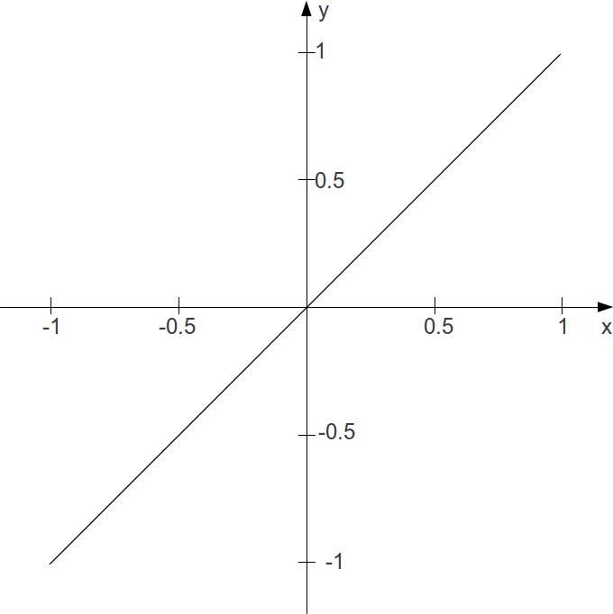

05 F. AM / RM / WAVESHAPING
===========================

An introduction as well as some background theory of amplitude
modulation, ring modulation and waveshaping is given in the fourth
chapter entitled \"sound-synthesis\". As all of these techniques merely
modulate the amplitude of a signal in a variety of ways, they can also
be used for the modification of non-synthesized sound. In this chapter
we will explore amplitude modulation, ring modulation and waveshaping as
applied to non-synthesized sound.^1^ 

AMPLITUDE MODULATION
--------------------

With \"sound-synthesis\", the principle  of AM was shown as a amplitude
multiplication of two sine oscillators. Later we\'ve used a more complex
modulators, to generate more complex spectrums. The principle also works
very well with sound-files (samples) or live-audio-input.

Karlheinz Stockhausens *\"Mixtur für Orchester, vier Sinusgeneratoren
und vier Ringmodulatoren*" (1964) was the first piece which used analog
ringmodulation (AM without DC-offset) to alter the acoustic instruments
pitch in realtime during a live-performance. The word ringmodulation
inherites from the analog *four-diode circuit* which was arranged in a
\"ring\".

In the following example shows how this can be done digitally in Csound.
In this case a sound-file works as the *carrier* which is modulated by a
*sine-wave-osc*. The result sounds like old \'Harald Bode\'
pitch-shifters from the 1960\'s.

***EXAMPLE: 05F01\_RM\_modification.csd***

    <CsoundSynthesizer>
    <CsOptions>
    -o dac
    </CsOptions>
    <CsInstruments>

    sr = 48000
    ksmps = 32
    nchnls = 1
    0dbfs = 1

    instr 1   ; Ringmodulation
    aSine1     poscil     0.8, p4, 1
    aSample    diskin2    "fox.wav", 1, 0, 1, 0, 32
               out        aSine1*aSample
    endin

    </CsInstruments>
    <CsScore>
    f 1 0 1024 10 1 ; sine

    i 1 0 2 400
    i 1 2 2 800
    i 1 4 2 1600
    i 1 6 2 200
    i 1 8 2 2400
    e
    </CsScore>
    </CsoundSynthesizer>
    ; written by Alex Hofmann (Mar. 2011)

WAVESHAPING
-----------

In chapter 04E waveshaping has been described as a method of applying a
transfer function to an incoming signal. It has been discussed that the
table which stores the transfer function must be read with an
interpolating table reader to avoid degradation of the signal. On the
other hand, degradation can be a nice thing for sound modification. So
let us start with this branch here.

### Bit Depth Reduction

If the transfer function itself is linear, but the table of the function
is small, and no interpolation is applied to the amplitude as index to
the table, in effect the bit depth is reduced. For a function table of
size 4, a line becomes a staircase:

Bit Depth = high                                                

::: {.group_img}
::: {.image}
{width="599" height="599"}
:::
:::

Bit Depth = 2

::: {.group_img}
::: {.image}
{width="601" height="601"}
:::
:::

This is the sounding result:

***EXAMPLE 05F02\_Wvshp\_bit\_crunch.csd***

    <CsoundSynthesizer>
    <CsOptions>
    -odac
    </CsOptions>
    <CsInstruments>
    sr = 44100
    ksmps = 32
    nchnls = 2
    0dbfs = 1

    giTrnsFnc ftgen 0, 0, 4, -7, -1, 3, 1

    instr 1
    aAmp      soundin   "fox.wav"
    aIndx     =         (aAmp + 1) / 2
    aWavShp   table     aIndx, giTrnsFnc, 1
              outs      aWavShp, aWavShp
    endin

    </CsInstruments>
    <CsScore>
    i 1 0 2.767
    </CsScore>
    </CsoundSynthesizer>
    ;example by joachim heintz

### Transformation and Distortion

In general, the transformation of sound in applying waveshaping depends
on the transfer function. The following example applies at first a table
which does not change the sound at all, because the function just says
*y = x*. The second one leads aready to a heavy distortion, though
\"just\" the samples between an amplitude of -0.1 and +0.1 are erased.
Tables 3 to 7 apply some chebychev functions which are well known from
waveshaping synthesis. Finally, tables 8 and 9 approve that even a
meaningful sentence and a nice music can regarded as noise \...

***EXAMPLE 05F03\_Wvshp\_different\_transfer\_funs.csd***

 

    <CsoundSynthesizer>
    <CsOptions>
    -odac
    </CsOptions>
    <CsInstruments>
    sr = 44100
    ksmps = 32
    nchnls = 2
    0dbfs = 1

    giNat   ftgen 1, 0, 2049, -7, -1, 2048, 1
    giDist  ftgen 2, 0, 2049, -7, -1, 1024, -.1, 0, .1, 1024, 1
    giCheb1 ftgen 3, 0, 513, 3, -1, 1, 0, 1
    giCheb2 ftgen 4, 0, 513, 3, -1, 1, -1, 0, 2
    giCheb3 ftgen 5, 0, 513, 3, -1, 1, 0, 3, 0, 4
    giCheb4 ftgen 6, 0, 513, 3, -1, 1, 1, 0, 8, 0, 4
    giCheb5 ftgen 7, 0, 513, 3, -1, 1, 3, 20, -30, -60, 32, 48
    giFox   ftgen 8, 0, -121569, 1, "fox.wav", 0, 0, 1
    giGuit  ftgen 9, 0, -235612, 1, "ClassGuit.wav", 0, 0, 1

    instr 1
    iTrnsFnc  =         p4
    kEnv      linseg    0, .01, 1, p3-.2, 1, .01, 0
    aL, aR    soundin   "ClassGuit.wav"
    aIndxL    =         (aL + 1) / 2
    aWavShpL  tablei    aIndxL, iTrnsFnc, 1
    aIndxR    =         (aR + 1) / 2
    aWavShpR  tablei    aIndxR, iTrnsFnc, 1
              outs      aWavShpL*kEnv, aWavShpR*kEnv
    endin

    </CsInstruments>
    <CsScore>
    i 1 0 7 1 ;natural though waveshaping
    i 1 + . 2 ;rather heavy distortion
    i 1 + . 3 ;chebychev for 1st partial
    i 1 + . 4 ;chebychev for 2nd partial
    i 1 + . 5 ;chebychev for 3rd partial
    i 1 + . 6 ;chebychev for 4th partial
    i 1 + . 7 ;after dodge/jerse p.136
    i 1 + . 8 ;fox
    i 1 + . 9 ;guitar
    </CsScore>
    </CsoundSynthesizer>
    ;example by joachim heintz

Instead of using the \"self-built\" method which has been described
here, you can use the Csound opcode
[distort](http://www.csounds.com/manual/html/distort.html). It performs
the actual waveshaping process and gives a nice control about the amount
of distortion in the *kdist* parameter. Here is a simple example:^2^ 

***EXAMPLE 05F04\_distort.csd***

 

    <CsoundSynthesizer>
    <CsOptions>
    -odac
    </CsOptions>
    <CsInstruments>
    sr     = 44100
    ksmps  = 32
    nchnls = 2
    0dbfs  = 1

    gi1 ftgen 1,0,257,9,.5,1,270 ;sinoid (also the next)
    gi2 ftgen 2,0,257,9,.5,1,270,1.5,.33,90,2.5,.2,270,3.5,.143,90
    gi3 ftgen 3,0,129,7,-1,128,1 ;actually natural
    gi4 ftgen 4,0,129,10,1 ;sine
    gi5 ftgen 5,0,129,10,1,0,1,0,1,0,1,0,1 ;odd partials
    gi6 ftgen 6,0,129,21,1 ;white noise
    gi7 ftgen 7,0,129,9,.5,1,0 ;half sine
    gi8 ftgen 8,0,129,7,1,64,1,0,-1,64,-1 ;square wave

    instr 1
    ifn       =         p4
    ivol      =         p5
    kdist     line      0, p3, 1 ;increase the distortion over p3
    aL, aR    soundin   "ClassGuit.wav"
    aout1     distort   aL, kdist, ifn
    aout2     distort   aR, kdist, ifn
              outs      aout1*ivol, aout2*ivol
    endin
    </CsInstruments>
    <CsScore>
    i 1 0 7 1 1
    i . + . 2 .3
    i . + . 3 1
    i . + . 4 .5
    i . + . 5 .15
    i . + . 6 .04
    i . + . 7 .02
    i . + . 8 .02
    </CsScore>
    </CsoundSynthesizer>
    ;example by joachim heintz

 

1.  [This is the same for Granular Synthesis which can either be
    \"pure\" synthesis or applied so sampled
    sound.]{#endnote-e24221b6-a525-4a6a-8aa9-42071e49246d}
2.  [Have a look at Iain McCurdy\'s Realtime example (which has also
    been ported to CsoundQt by René Jopi) for \'distort\' for a more
    interactive exploration of the
    opcode.]{#endnote-10b2a749-7153-4f8d-b4b1-d21416632ae8}
