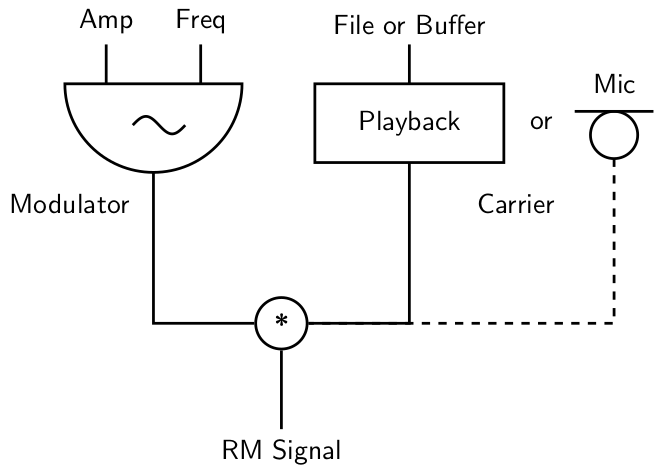
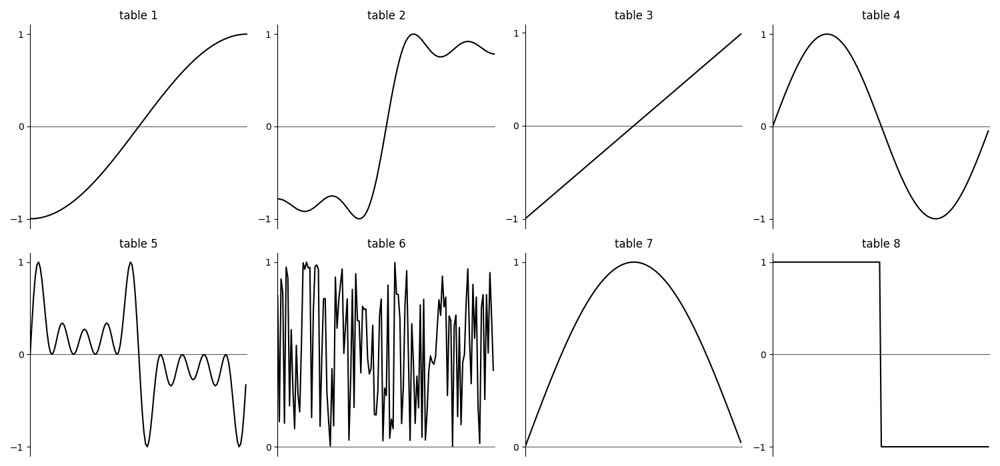

# 05 F. AM / RM / WAVESHAPING

An introduction as well as some background theory of amplitude
modulation, ring modulation and waveshaping is given in chapters
[04 C](04-c-amplitude-and-ring-modulation.md) and
[04 E](04-e-waveshaping.md). As all of these techniques merely
modulate the amplitude of a signal in a variety of ways, they can also
be used for the modification of non-synthesized sound. In this chapter
we will explore amplitude modulation, ring modulation and waveshaping as
applied to non-synthesized sound.^[This is the same for Granular Synthesis
which can either be "pure" synthesis or applied on sampled sound.]

## AMPLITUDE AND RING MODULATION

As shown in chapter [04 C](04-c-amplitude-and-ring-modulation.md), ring modulation in digital domain can be implemented as multiplication of a carrier audio signal with a modulator signal. If adapted to the modification of samples or live input, the carrier signal now changes to a playback unit or a microphone. The modulator usually remains a sine oscillator.

{width=60%}

The spectrum of the carrier sound is shifted by plus and minus the modulator frequency. As this is happening for each part of the spectrum, the source sound often seems to loose its center. A piano sound easily becomes bell-like, and a voice can become gnomic.

In the following example, first three static modulating frequencies are applied. As the voice itself has a somehow floating pitch, we already hear an always moving artificial speactrum component. This effect is emphasized in the second instrument which applies a random glissando for the modulating frequency. If the random movements are slow (first with 1 Hz, then 10 Hz), the pitch movements are still recognizable. If they are fast (100 Hz in the last call), the sound becomes noisy.

**_EXAMPLE 05F01_RM_modification.csd_**

```csound
<CsoundSynthesizer>
<CsOptions>
-o dac  --env:SSDIR+=../SourceMaterials
</CsOptions>
<CsInstruments>

sr = 44100
ksmps = 32
nchnls = 2
0dbfs = 1

instr RM_static
aMod     poscil     1, p4
aCar     diskin    "fox.wav"
aRM      =         aMod * aCar
         out       aRM, aRM
endin

instr RM_moving
aMod     poscil     1, randomi:k(400,1000,p4,3)
aCar     diskin    "fox.wav"
aRM      =         aMod * aCar
         out       aRM, aRM
endin

</CsInstruments>
<CsScore>
i "RM_static" 0 3 400
i .           + . 800
i .           + . 1600
i "RM_moving" 10 3 1
i .           + .  10
i .           + .  100
</CsScore>
</CsoundSynthesizer>
;written by Alex Hofmann and joachim heintz
```

In instrument _RM_static_, the fourth parameter of the score line (p4) directly yields the frequency of the modulator. In instrument _RM_moving_, this frequency is a random movement between 400 and 1000 Hz, and p4 here yields the rate in which new random values are generated.

For amplitude modulation, a constant part - the _DC offset_ - is added to the modulating signal. The result is a mixture of unchanged and ring modulated sound, in different weights. The most simple way to implement this is to add a part of the source signal to the ring modulated signal.

## WAVESHAPING

In chapter [04E](04-e-waveshaping.md) waveshaping has been described as a method of applying a transfer function to an incoming signal. It has been discussed that the table which stores the transfer function must be read with an interpolating table reader to avoid degradation of the signal. On the
other hand, degradation can be a nice thing for sound modification. So
let us start with this branch here.

### Bit Depth Reduction

If the transfer function itself is linear, but the table of the function
is small, and no interpolation is applied to the amplitude as index to
the table, in effect the bit depth is reduced. For a function table of
size 4, a line becomes a staircase:

Bit Depth = high

{width=50%}

Bit Depth = 2

{width=50%}

This is the sounding result:

**_EXAMPLE 05F02_Wvshp_bit_crunch.csd_**

```csound
<CsoundSynthesizer>
<CsOptions>
-odac
</CsOptions>
<CsInstruments>
sr = 44100
ksmps = 32
nchnls = 2
0dbfs = 1

giTrnsFnc ftgen 0, 0, 4, -7, -1, 3, 1

instr 1
aAmp      soundin   "fox.wav"
aIndx     =         (aAmp + 1) / 2
aWavShp   table     aIndx, giTrnsFnc, 1
          out       aWavShp, aWavShp
endin

</CsInstruments>
<CsScore>
i 1 0 2.767
</CsScore>
</CsoundSynthesizer>
;example by joachim heintz
```

### Transformation and Distortion

In general, the transformation of sound in applying waveshaping depends
on the transfer function. The following example applies at first a table
which does not change the sound at all, because the function just says
_y = x_. The second one leads already to a heavy distortion, because the samples between an amplitude of -0.1 and +0.1 are erased.
Tables 3 to 7 apply some chebychev functions which are well known from
waveshaping synthesis. Finally, tables 8 and 9 approve that even a
meaningful sentence and a nice music can regarded as noise ...

**_EXAMPLE 05F03_Wvshp_different_transfer_funs.csd_**

```csound
<CsoundSynthesizer>
<CsOptions>
-odac
</CsOptions>
<CsInstruments>
sr = 44100
ksmps = 32
nchnls = 2
0dbfs = 1

giNat   ftgen 1, 0, 2049, -7, -1, 2048, 1
giDist  ftgen 2, 0, 2049, -7, -1, 1024, -.1, 0, .1, 1024, 1
giCheb1 ftgen 3, 0, 513, 3, -1, 1, 0, 1
giCheb2 ftgen 4, 0, 513, 3, -1, 1, -1, 0, 2
giCheb3 ftgen 5, 0, 513, 3, -1, 1, 0, 3, 0, 4
giCheb4 ftgen 6, 0, 513, 3, -1, 1, 1, 0, 8, 0, 4
giCheb5 ftgen 7, 0, 513, 3, -1, 1, 3, 20, -30, -60, 32, 48
giFox   ftgen 8, 0, -121569, 1, "fox.wav", 0, 0, 1
giGuit  ftgen 9, 0, -235612, 1, "ClassGuit.wav", 0, 0, 1

instr 1
iTrnsFnc  =         p4
kEnv      linseg    0, .01, 1, p3-.2, 1, .01, 0
aL, aR    soundin   "ClassGuit.wav"
aIndxL    =         (aL + 1) / 2
aWavShpL  tablei    aIndxL, iTrnsFnc, 1
aIndxR    =         (aR + 1) / 2
aWavShpR  tablei    aIndxR, iTrnsFnc, 1
          outs      aWavShpL*kEnv, aWavShpR*kEnv
endin

</CsInstruments>
<CsScore>
i 1 0 7 1 ;natural though waveshaping
i 1 + . 2 ;rather heavy distortion
i 1 + . 3 ;chebychev for 1st partial
i 1 + . 4 ;chebychev for 2nd partial
i 1 + . 5 ;chebychev for 3rd partial
i 1 + . 6 ;chebychev for 4th partial
i 1 + . 7 ;after dodge/jerse p.136
i 1 + . 8 ;fox
i 1 + . 9 ;guitar
</CsScore>
</CsoundSynthesizer>
;example by joachim heintz
```

Instead of using the "self-built" method which has been described
here, you can use the Csound opcode
[distort](https://csound.com/docs/manual/distort.html). It performs
the actual waveshaping process and gives a nice control about the amount
of distortion in the _kdist_ parameter. Here is a simple example, using rather different tables:



**_EXAMPLE 05F04_distort.csd_**

```csound
<CsoundSynthesizer>
<CsOptions>
-odac
</CsOptions>
<CsInstruments>
sr     = 44100
ksmps  = 32
nchnls = 2
0dbfs  = 1

gi1 ftgen 1,0,257,9,.5,1,270 ;sinoid (also the next)
gi2 ftgen 2,0,257,9,.5,1,270,1.5,.33,90,2.5,.2,270,3.5,.143,90
gi3 ftgen 3,0,129,7,-1,128,1 ;actually natural
gi4 ftgen 4,0,129,10,1 ;sine
gi5 ftgen 5,0,129,10,1,0,1,0,1,0,1,0,1 ;odd partials
gi6 ftgen 6,0,129,21,1 ;white noise
gi7 ftgen 7,0,129,9,.5,1,0 ;half sine
gi8 ftgen 8,0,129,7,1,64,1,0,-1,64,-1 ;square wave

instr 1
ifn       =         p4
ivol      =         p5
kdist     line      0, p3, 1 ;increase the distortion over p3
aL, aR    soundin   "ClassGuit.wav"
aout1     distort   aL, kdist, ifn
aout2     distort   aR, kdist, ifn
          outs      aout1*ivol, aout2*ivol
endin
</CsInstruments>
<CsScore>
i 1 0 7 1 1
i . + . 2 .3
i . + . 3 1
i . + . 4 .5
i . + . 5 .15
i . + . 6 .04
i . + . 7 .02
i . + . 8 .02
</CsScore>
</CsoundSynthesizer>
;example by joachim heintz
```
