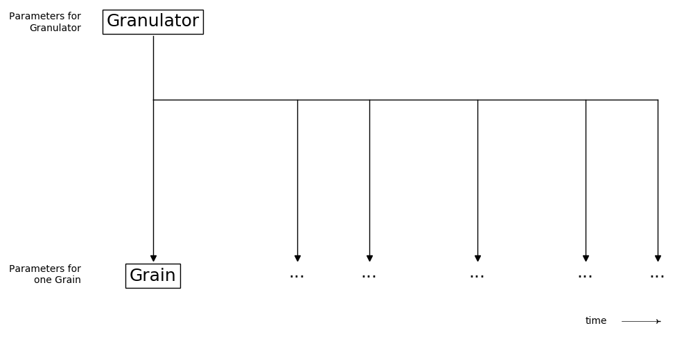
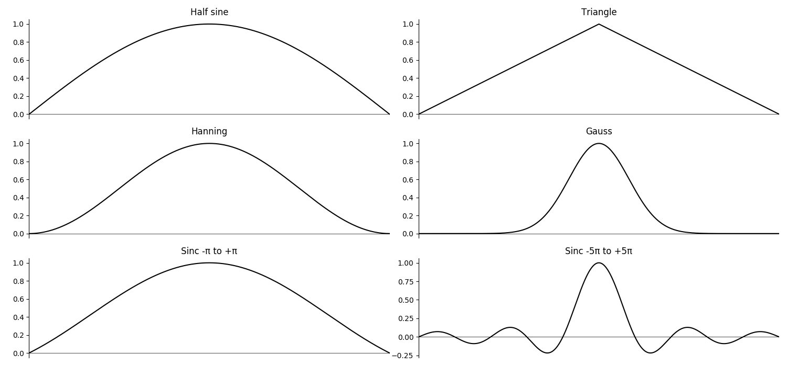

# 05 G. GRANULAR SYNTHESIS

This chapter will focus upon granular synthesis used as a DSP technique
upon recorded sound files and will introduce techniques including time
stretching, time compressing and pitch shifting. The emphasis will be
upon asynchronous granulation. For an introduction to synchronous
granular synthesis using simple waveforms please refer to chapter
[04 F](04-f-granular-synthesis.md).

We will start with a self-made granulator which we build step by step. It may help to understand the main parameters, and to see upon which decisions the different opcode designs are built. In the second part of this chapter we will introduce some of the many Csound opcodes for granular synthesis, in typical use cases.

## A Self-Made Granulator

It is perfectly possible to build one's own granular machine in Csound code, without using one of the many opcodes for granular synthesis. This machine will certainly run slower than a native opcode. But for understanding what is happening, and being able to implement own ideas, this is a very instructive approach.

Granular synthesis can be described as a sequence of small sound snippets. So we can think of two units: One unit is managing the sequence, the other unit is performing one grain. Let us call the first unit _Granulator_, and the second unit _Grain_. The _Granulator_ will manage the sequence of grains in calling the _Grain_ unit again and again, with different parameters:



In Csound, we implement this architecture as two instruments. We will start with the instrument which performs one grain.

### The Grain Unit

#### Parameters for One Grain

The _Grain_ instrument needs the following information in order to play back a single grain:

1. **Sound**. In the most simple version this is a sound file on the hard disk. More flexible and fast is a sample which has been stored in a buffer (function table). We can also record this buffer in real time and through this perform live granular synthesis.
2. **Point in Sound to start playback**. In the most simple version, this is the same as the _skiptime_ for playing back sound from hard disk via [diskin](https://csound.com/docs/manual/diskin.html). Usually we will choose seconds as unit for this parameter.
3. **Duration**. The duration for one grain is usually in the range 20-50 ms, but can be smaller or bigger for special effects. In Csound this parameter is passed to the instrument as _p3_ in its call, measured in seconds.
4. **Speed of Playback**. This parameter is used by _diskin_ and similar opcodes: 1 means the normal speed, 2 means double speed, 1/2 means half speed. This would result in no pitch change (1), octave higher (2) and octave lower(1/2). Negative numbers mean reverse playback.
5. **Volume**. We will measure it in _dB_, where 0 dB means to play back the sound as it is recorded.
6. **Envelope**. Each grain needs an envelope which starts and ends at zero, to ensure that there will be no clicks.
   These are some frequently used envelopes:^[The function tables have been created with this code:
   i0 ftgen 1, 0, 8192, 20, 3, 1
   i0 ftgen 2, 0, 8192, 9, 1/2, 1, 0
   i0 ftgen 3, 0, 8192, 20, 2, 1
   i0 ftgen 4, 0, 8192, 20, 6, 1
   i0 ftgen 5, 0, 8192, 20, 9, 1
   i0 ftgen 6, 0, 8192, 20, 9, 1, 5 ]



7. **Spatial Position**. Each grain will be send to a certain point in space. For stereo, it will be a panning position between 0 (left) and 1 (right).

#### Simple Grain Implementation

We start with the most simple implementation. We play back the sound with [diskin](https://csound.com/docs/manual/diskin.html) and apply a triangular envelope with the [linen](https://csound.com/docs/manual/linen.html) opcode. We pass the _grain duration_ as _p3_, the _playback start_ as _p4_ and the _playback speed_ as _p5_. We choose a constant grain duration of 50 ms, but in the first five examples different starting points, then in the other five examples from one starting point different playback speeds.

**_EXAMPLE 05G01_simple_grain.csd_**

```csound
<CsoundSynthesizer>
<CsOptions>
-odac
</CsOptions>
<CsInstruments>
sr = 44100
ksmps = 32
nchnls = 2
0dbfs = 1

instr Grain
 //input parameters
 Sound = "fox.wav"
 iStart = p4 ;position in sec to read the sound
 iSpeed = p5
 iVolume = -3 ;dB
 iPan = .5 ;0=left, 1=right
 //perform
 aSound = diskin:a(Sound,iSpeed,iStart,1)
 aOut = linen:a(aSound,p3/2,p3,p3/2)
 aL, aR pan2 aOut*ampdb(iVolume), iPan
 out(aL,aR)
endin

</CsInstruments>
<CsScore>
;              start speed
i "Grain" 0 .05 .05    1
i .       1 .   .2     .
i .       2 .   .42    .
i .       3 .   .78    .
i .       4 .   1.2    .
i .       6 .   .2     1
i .       7 .   .      2
i .       8 .   .      0.5
i .       9 .   .      10
i .      10 .   .25    -1
</CsScore>
</CsoundSynthesizer>
;example by joachim heintz
```

It is a tiring job to write a score line for each grain ... — no one will do this. But with but a small change we can read through the whole sound file by calling our _Grain_ instrument only once! The technique we use in the next example is to start a new instance of the _Grain_ instrument by the running instance, as long as the end of the sound file has not yet been reached. (This technique has been described in paragraph _Self-Triggering and Recursion_ of chapter [03 C](03-d-control-structures.md).)

**_EXAMPLE 05G02_simple_grain_continuous.csd_**

```csound
<CsoundSynthesizer>
<CsOptions>
-odac
</CsOptions>
<CsInstruments>
sr = 44100
ksmps = 32
nchnls = 2
0dbfs = 1

instr Grain
 //input parameters
 Sound = "fox.wav"
 iStart = p4 ;position in sec to read the sound
 iSpeed = 1
 iVolume = -3 ;dB
 iPan = .5 ;0=left, 1=right
 //perform
 aSound = diskin:a(Sound,iSpeed,iStart,1)
 aOut = linen:a(aSound,p3/2,p3,p3/2)
 aL, aR pan2 aOut*ampdb(iVolume), iPan
 out(aL,aR)
 //call next grain until sound file has reached its end
 if iStart < filelen(Sound) then
  schedule("Grain",p3,p3,iStart+p3)
 endif
endin
schedule("Grain",0,50/1000,0)

</CsInstruments>
<CsScore>
e 5 ;stops performance after 5 seconds
</CsScore>
</CsoundSynthesizer>
;example by joachim heintz
```

#### Improvements

The _Grain_ instrument works but it has some weaknesses:

- Rather than being played back from disk, the sound should be put in a buffer (function table) and played back from there. This is faster and gives more flexibility, for instance in filling the buffer with real-time recording.
- The envelope should also be read from a function table. Again, this is faster and offers more flexibility. In case we want to change the envelope, we simply use another function table, without changing any code of the instrument.

Table reading can be done by different methods in Csound. Have a look at chapter [03 D](03-d-function-tables.md) for details. We will use reading the tables with the [poscil3](https://csound.com/docs/manual/poscil3.html) oscillator here. This should give a very good result in sound quality.

In the next example we reproduce the first example above to check the new code to the _Grain_ instrument.

**_EXAMPLE 05G03_simple_grain_optimized.csd_**

```csound
<CsoundSynthesizer>
<CsOptions>
-odac
</CsOptions>
<CsInstruments>
sr = 44100
ksmps = 32
nchnls = 2
0dbfs = 1

//load sample to table and create triangular shape
giSample ftgen 0, 0, 0, -1, "fox.wav", 0, 0, 1
giEnv ftgen 0, 0, 8192, 20, 3, 1
giSampleLen = ftlen(giSample)/sr

instr Grain
 //input parameters
 iStart = p4 ;position in sec to read the sound
 iSpeed = p5
 iVolume = -3 ;dB
 iPan = .5 ;0=left, 1=right
 //perform
 aEnv = poscil3:a(ampdb(iVolume),1/p3,giEnv)
 aSound = poscil3:a(aEnv,iSpeed/giSampleLen,giSample,iStart/giSampleLen)
 aL, aR pan2 aSound, iPan
 out(aL,aR)
endin

</CsInstruments>
<CsScore>
;              start speed
i "Grain" 0 .05 .05    1
i .       1 .   .2     .
i .       2 .   .42    .
i .       3 .   .78    .
i .       4 .   1.2    .
i .       6 .   .2     1
i .       7 .   .      2
i .       8 .   .      0.5
i .       9 .   .      10
i .      10 .   .25    -1
</CsScore>
</CsoundSynthesizer>
;example by joachim heintz
```

Some comments to this code:

- Line 12-13: The sample _fox.wav_ is loaded into function table _giSample_ via [GEN](https://csound.com/docs/manual/ScoreGenRef.html) routine [01](https://csound.com/docs/manual/GEN01.html). Note that we are using here -1 instead of 1 because we don't want to normalize the sound.^[
  This decision is completely up to the user.] \
  The triangular shape is loaded via [GEN 20](https://csound.com/docs/manual/GEN20.html) which offers a good selection of different envelope shapes.
- Line 14: `giSampleLen = ftlen(giSample)/sr`. This calculates the length of the sample in seconds, as length of the function table divided by the sample rate. It makes sense to store this in a global variable because we are using it in the _Grain_ instrument again and again.
- Line 23:`aEnv = poscil3:a(ampdb(iVolume),1/p3,giEnv)`. The envelope (as audio signal) is reading the table _giEnv_ in which a triangular shape is stored. We set the amplitude of the oscillator to `ampdb(iVolume)`, so to the amplitude equivalent of the _iVolume_ decibel value. The frequency of the oscillator is _1/p3_ because we want to read the envelope exactly once during the performance time of this instrument instance.
- Line 24: `aSound = poscil3:a(aEnv,iSpeed/giSampleLen, \\
giSample,iStart/giSampleLen)`. Again this is a [poscil3](https://csound.com/docs/manual/poscil3.html) oscillator reading a table. The table is here _giSample_; the amplitude of the oscillator is the _aEnv_ signal we produced. The frequency of reading the table in normal speed is _1/giSampleLen_; if we include the speed changes, it is _iSpeed/giSampleLen_. The starting point to read the table is given to the oscillator as phase value (0=start to 1=end of the table). So we must divide _iStart_ by _giSampleLen_ to get this value.

### The Granulator Unit

The main job for the _Granulator_ is to call the _Grain_ unit again and again over time. The _grain density_ and the _grain distribution_ direct this process. The other parameters are basically the same as in the _Grain_ unit.

As granular synthesis is a mass structure, one of its main features is to deal with variations. Each parameter usually deviates in a given range. We will at first build the _Granulator_ in the most simple way, without these deviations, and then proceed to more interesting, variative structures.

#### Parameters for the Granulator

The first seven parameters are similar to the parameters for the _Grain_ unit. Grain density and grain distribution are added at the end of the list.

1. **Sound**. The sound must be loaded in a function table. We pass the variable name or number of this table to the _Grain_ instrument.
2. **Pointer in Sound**. Usually we will have a moving pointer position here. We will use a simple line in the next example, moving from start to end of the sound in a certain duration. Later we will implement a moving pointer driven by speed.
3. **Duration**. We will use milliseconds as unit here and then change it to seconds when we call the _Grain_ instrument.
4. **Pitch Shift (Transposition)**. This is the speed of reading the sound in the _Grain_ units, resulting in a pitch shift or transposition. We will use _Cent_ as unit here, and change the value internally to the corresponding speed: cent=0 -> speed=1, cent=1200 -> speed=2, cent=-1200 -> speed=0.5.
5. **Volume**. We will measure it in _dB_ as for the _Grain_ unit. But the resulting volume will also depend on the grain density, as overlapping grains will add their amplitudes.
6. **Envelope**. The grain envelope must be stored in a function table. We will pass the name or number of the table to the _Grain_ instrument.
7. **Spatial Position**. For now, we will use a fixed pan position between 0 (left) and 1 (right), as we did for the _Grain_ instrument.
8. **Density**. This is the number of grains per second, so the unit is Hz.
9. **Distribution**. This is a continuum between sychronous granular synthesis,
   in which all grains are equally distributed, and asynchronous, in which the distribution is
   irregular or scattered.^[As maximum irregularity we will consider a random position between the regular position of a grain and the regular position of the next neighbouring grain. (Half of this irregularity will be a random position between own regular and half of the distance to the neighbouring regular position.)] We will use 0 for synchronous and 1 for asynchronous granular synthesis.

#### Simple Granulator Implementation

For triggering the single grains, we use the [metro](https://csound.com/docs/manual/metro.html) opcode. We call a grain on each trigger tick of the _metro_. This is a basic example; the code will be condensed later, but is kept here more explicit to show the functionality.

**_EXAMPLE 05G04_simple_granulator.csd_**

```csound
<CsoundSynthesizer>
<CsOptions>
-odac -m128
</CsOptions>
<CsInstruments>
sr = 44100
ksmps = 32
nchnls = 2
0dbfs = 1

//load sample to table and create half sine envelope
giSample ftgen 0, 0, 0, -1, "fox.wav", 0, 0, 1
giHalfSine ftgen 0, 0, 1024, 9, .5, 1, 0

instr Granulator
 //input parameters as described in text
 iSndTab = giSample ;table with sample
 iSampleLen = ftlen(iSndTab)/sr
 kPointer = linseg:k(0,iSampleLen,iSampleLen)
 iGrainDur = 30 ;milliseconds
 iTranspos = -100 ;cent
 iVolume = -6 ;dB
 iEnv = giHalfSine ;table with envelope
 iPan = .5 ;panning 0-1
 iDensity = 50 ;Hz (grains per second)
 iDistribution = .5 ;0-1
 //perform: call grains over time
 kTrig = metro(iDensity)
 if kTrig==1 then
  kOffset = random:k(0,iDistribution/iDensity)
  schedulek("Grain", kOffset, iGrainDur/1000, iSndTab, iSampleLen,
            kPointer, cent(iTranspos), iVolume, iEnv, iPan)
 endif
endin

instr Grain
 //input parameters
 iSndTab = p4
 iSampleLen = p5
 iStart = p6
 iSpeed = p7
 iVolume = p8 ;dB
 iEnvTab = p9
 iPan = p10
 //perform
 aEnv = poscil3:a(ampdb(iVolume),1/p3,iEnvTab)
 aSound = poscil3:a(aEnv,iSpeed/iSampleLen,iSndTab,iStart/iSampleLen)
 aL, aR pan2 aSound, iPan
 out(aL,aR)
endin

</CsInstruments>
<CsScore>
i "Granulator" 0 3
</CsScore>
</CsoundSynthesizer>
;example by joachim heintz
```

Some comments:

- Line 13: We use a half sine here, generated by [GEN09](https://csound.com/docs/manual/GEN09.html). Other envelopes are available via [GEN20](https://csound.com/docs/manual/GEN20.html). As we used a high-quality interpolating oscillator in the _Grain_ instrument for reading the envelope, the table size is kept rather small.
- Line 18: The length of the sample is calculated here not as a global variable, but once in this instrument. This would allow to pass the _iSndTab_ as _p_-field without changing the code.
- Line 30: The irregularity is applied as random offset to the regular position of the grain. The range of the offset is from zero to _iDistribution/iDensity_. For _iDensity=50Hz_ and _iDistribution=1_, for instance, the maximum offset would be 1/50 seconds.
- Line 31-32: The [schedulek](https://csound.com/docs/manual/schedulek.html) opcode is used here. It has been introduced in Csound 6.14; for older versions of Csound, [event](https://csound.com/docs/manual/event.html) can be used as well: `event("i","Grain",kOffset, ...)` would be the code then. Note that we divide the _iGrainDur_ by 1000, because it was given in milliseconds. For the transformation of the _cent_ input to a multiplier, we simply use the [cent](https://csound.com/docs/manual/cent.html) opcode.

It is suggested to change some values in this example, and to listen to the result; for instance:

1. Change `kPointer = linseg:k(0,iSampleLen,iSampleLen)` (line 19) to `kPointer = linseg:k(0,iSampleLen*2,iSampleLen)` or to `kPointer = linseg:k(0,iSampleLen*5,iSampleLen)` (increase p3 in the score then, too). This change will increase the time in which the pointer moves from start to end of the sound file. This is called **time stretching**, and is one of the main features of granular synthesis. If a smaller duration for the pointer is used (e.g. `iSampleLen/2` or `iSampleLen/5`) we apply _time compression_.

2. Change _iGrainDur_ (line 20) from 30 ms to a bigger or smaller value. For very small values (below 10 ms) artifacts arise.

3. Set _iDensity_ (line 29) to 10 Hz or less and change the _iDistribution_ (line 26). A distribution of 0 should give a perfectly regular sequence of grains, whereas 1 should result in irregularity.

#### Improvements and Random Deviations

The preferred method for the moving pointer in the _Granulator_ instrument is a [phasor](https://csound.com/docs/manual/phasor.html). It is the best approach for real-time use. It can run for an unlimited time and can easily move backwards. As input for the phasor, technically its frequency, we will put the speed in the usual way: 1 means normal speed, 0 is freeze, -1 is backwards reading in normal speed. As optional parameter we can set a start position of the pointer.

All we have to do for implementing this in Csound is to take the sound file length in account for both, the pointer position and the start position:

    iFileLen = 2 ;sec
    iStart = 1 ;sec
    kSpeed = 1
    kPhasor = phasor:a(kSpeed/iFileLen,iStart/iFileLen)
    kPointer = kPhasor*iFileLen

In this example, the phasor will start with an initial phase of _iStart/iFileLen_ = 0.5. The _kPhasor_ signal which is always 0-1, will move in the frequency _kSpeed/iFileLen_, here 1/2. The _kPhasor_ will then be multiplied by two, so will become 0-2 for _kPointer_.

It is very useful to add **random deviations** to some of the parameters for granular synthesis. This opens the space for many different structures and possibilities. We will apply here random deviations to these parameters of the _Granulator_:

- _Pointer_. The pointer will "tremble" or "jump" depending on the range of the random deviation. The range is given in seconds. It is implemented in line 36 of the next example as

```csound
kPointer = kPhasor*iSampleLen + rnd31:k(iPointerRndDev,0)
```

The opcode [rnd31](https://csound.com/docs/manual/rnd31.html) is a bipolar random generator which will output values between _-iPointerRndDev_ and _+iPointerRndDev_. This is then added to the normal pointer position.

- _Duration_. We will define here a maximum deviation in percent, related to the medium grain duration. 100% would mean that a grain duration can deviate between half and twice the medium duration. A medium duration of 20 ms would yield a random range of 10-40 ms in this case.
- _Transposition_. We can add to the main transposition a bipolar random range. If, for example, the main transposition is 500 cent and the maximum random transposition is 300 cent, each grain will choose a value between 200 and 800 cent.
- _Volume_. A maximum decibel deviation (also bipolar) can be added to the main volume.
- _Spatial Position_. In addition to the main spatial position (in the stereo field 0-1), we can add a bipolar maximum deviation. If the main position is 0.5 and the maximum deviation is 0.2, each grain will have a panning position between 0.3 and 0.7.

The next example demonstrates the five possibilities one by one, each parameter in three steps: at first with no random deviations, then with slight deviations, then with big ones.

**_EXAMPLE 05G05_random_deviations.csd_**

```csound
<CsoundSynthesizer>
<CsOptions>
-odac -m128
</CsOptions>
<CsInstruments>
sr = 44100
ksmps = 32
nchnls = 2
0dbfs = 1

giSample ftgen 0, 0, 0, -1, "fox.wav", 0, 0, 1
giHalfSine ftgen 0, 0, 1024, 9, .5, 1, 0

instr Granulator
 //standard input parameter
 iSndTab = giSample
 iSampleLen = ftlen(iSndTab)/sr
 iStart = 0 ;sec
 kPointerSpeed = 2/3
 iGrainDur = 30 ;milliseconds
 iTranspos = -100 ;cent
 iVolume = -6 ;dB
 iEnv = giHalfSine ;table with envelope
 iPan = .5 ;panning 0-1
 iDensity = 50 ;Hz (grains per second)
 iDistribution = .5 ;0-1
 //random deviations (for demonstration set to p-fields)
 iPointerRndDev = p4 ;sec
 iGrainDurRndDev = p5 ;percent
 iTransposRndDev = p6 ;cent
 iVolumeRndDev = p7 ;dB
 iPanRndDev = p8 ;as in iPan
 //perform
 kPhasor = phasor:k(kPointerSpeed/iSampleLen,iStart/iSampleLen)
 kTrig = metro(iDensity)
 if kTrig==1 then
  kPointer = kPhasor*iSampleLen + rnd31:k(iPointerRndDev,0)
  kOffset = random:k(0,iDistribution/iDensity)
  kGrainDurDiff = rnd31:k(iGrainDurRndDev,0) ;percent
  kGrainDur = iGrainDur*2^(kGrainDurDiff/100) ;ms
  kTranspos = cent(iTranspos+rnd31:k(iTransposRndDev,0))
  kVol = iVolume+rnd31:k(iVolumeRndDev,0)
  kPan = iPan+rnd31:k(iPanRndDev,0)
  schedulek("Grain",kOffset,kGrainDur/1000,iSndTab,
            iSampleLen,kPointer,kTranspos,kVol,iEnv,kPan)
 endif
endin

instr Grain
 //input parameters
 iSndTab = p4
 iSampleLen = p5
 iStart = p6
 iSpeed = p7
 iVolume = p8 ;dB
 iEnvTab = p9
 iPan = p10
 //perform
 aEnv = poscil3:a(ampdb(iVolume),1/p3,iEnvTab)
 aSound = poscil3:a(aEnv,iSpeed/iSampleLen,iSndTab,iStart/iSampleLen)
 aL, aR pan2 aSound, iPan
 out(aL,aR)
endin

</CsInstruments>
<CsScore>
t 0 40
; Random Deviations: Pointer GrainDur Transp Vol Pan
;RANDOM POINTER DEVIATIONS
i "Granulator" 0 2.7   0       0        0      0   0 ;normal pointer
i .            3 .     0.1     0        0      0   0 ;slight trembling
i .            6 .     1       0        0      0   0 ;chaotic jumps
;RANDOM GRAIN DURATION DEVIATIONS
i .           10 .     0       0        0      0   0 ;no deviation
i .           13 .     0     100        0      0   0 ;100%
i .           16 .     0     200        0      0   0 ;200%
;RANDOM TRANSPOSITION DEVIATIONS
i .           20 .     0       0        0      0   0 ;no deviation
i .           23 .     0       0      300      0   0 ;±300 cent maximum
i .           26 .     0       0     1200      0   0 ;±1200 cent maximum
;RANDOM VOLUME DEVIATIONS
i .           30 .     0       0        0      0   0 ;no deviation
i .           33 .     0       0        0      6   0 ;±6 dB maximum
i .           36 .     0       0        0     12   0 ;±12 dB maximum
;RANDOM PAN DEVIATIONS
i .           40 .     0       0        0      0   0 ;no deviation
i .           43 .     0       0        0      0  .1 ;±0.1 maximum
i .           46 .     0       0        0      0  .5 ;±0.5 maximum
</CsScore>
</CsoundSynthesizer>
;example by joachim heintz
```

It sounds like for normal use, the pointer, transposition and pan deviation are most interesting to apply.

#### Final Example

After first prsenting the more instructional examples, this final one shows some of the potential applications for granular sounds. It uses the same parts of _The quick brown fox_ as in the first example of this chapter, each which different sounds and combination of the parameters.

**_EXAMPLE 05G06_the_fox_universe.csd_**

```csound
<CsoundSynthesizer>
<CsOptions>
-odac -m128
</CsOptions>
<CsInstruments>
sr = 44100
ksmps = 32
nchnls = 2
0dbfs = 1
seed 0

opcode Chan,S,Si
 Sname, id xin
 Sout sprintf "%s_%d", Sname, id
 xout Sout
endop

giSample ftgen 0, 0, 0, -1, "fox.wav", 0, 0, 1
giSinc ftgen 0, 0, 1024, 20, 9, 1
gi_ID init 1

instr Quick
 id = gi_ID
 gi_ID += 1
 iStart = .2
 chnset(1/100, Chan("PointerSpeed",id))
 chnset(linseg:k(10,p3,1), Chan("GrainDur",id))
 chnset(randomi:k(15,20,1/3,3), Chan("Density",id))
 chnset(linseg:k(7000,p3/2,6000), Chan("Transpos",id))
 chnset(600,Chan("TransposRndDev",id))
 chnset(linseg:k(-10,p3-3,-10,3,-30), Chan("Volume",id))
 chnset(randomi:k(.2,.8,1,3), Chan("Pan",id))
 chnset(.2,Chan("PanRndDev",id))
 schedule("Granulator",0,p3,id,iStart)
 schedule("Output",0,p3,id,0)
endin

instr Brown
 id = gi_ID
 gi_ID += 1
 iStart = .42
 chnset(1/100, Chan("PointerSpeed",id))
 chnset(50, Chan("GrainDur",id))
 chnset(50, Chan("Density",id))
 chnset(100,Chan("TransposRndDev",id))
 chnset(linseg:k(-50,3,-10,12,-10,3,-50), Chan("Volume",id))
 chnset(.5, Chan("Pan",id))
 schedule("Granulator",0,p3,id,iStart)
 schedule("Output",0,p3+3,id,.3)
endin

instr F
 id = gi_ID
 gi_ID += 1
 iStart = .68
 chnset(50, Chan("GrainDur",id))
 chnset(40, Chan("Density",id))
 chnset(100,Chan("TransposRndDev",id))
 chnset(linseg:k(-30,3,-10,p3-6,-10,3,-30)+randomi:k(-10,10,1/3),
                 Chan("Volume",id))
 chnset(.5, Chan("Pan",id))
 chnset(.5, Chan("PanRndDev",id))
 schedule("Granulator",0,p3,id,iStart)
 schedule("Output",0,p3+3,id,.9)
endin

instr Ox
 id = gi_ID
 gi_ID += 1
 iStart = .72
 chnset(1/100,Chan("PointerSpeed",id))
 chnset(50, Chan("GrainDur",id))
 chnset(40, Chan("Density",id))
 chnset(-2000,Chan("Transpos",id))
 chnset(linseg:k(-20,3,-10,p3-6,-10,3,-30)+randomi:k(-10,0,1/3),
        Chan("Volume",id))
 chnset(randomi:k(.2,.8,1/5,2,.8), Chan("Pan",id))
 schedule("Granulator",0,p3,id,iStart)
 schedule("Output",0,p3+3,id,.9)
endin

instr Jum
 id = gi_ID
 gi_ID += 1
 iStart = 1.3
 chnset(0.01,Chan("PointerRndDev",id))
 chnset(50, Chan("GrainDur",id))
 chnset(40, Chan("Density",id))
 chnset(transeg:k(p4,p3/3,0,p4,p3/2,5,3*p4),Chan("Transpos",id))
 chnset(linseg:k(0,1,-10,p3-7,-10,6,-50)+randomi:k(-10,0,1,3),
        Chan("Volume",id))
 chnset(p5, Chan("Pan",id))
 schedule("Granulator",0,p3,id,iStart)
 schedule("Output",0,p3+3,id,.7)
 if p4 < 300 then
  schedule("Jum",0,p3,p4+500,p5+.3)
 endif
endin

instr Whole
 id = gi_ID
 gi_ID += 1
 iStart = 0
 chnset(1/2,Chan("PointerSpeed",id))
 chnset(5, Chan("GrainDur",id))
 chnset(20, Chan("Density",id))
 chnset(.5, Chan("Pan",id))
 chnset(.3, Chan("PanRndDev",id))
 schedule("Granulator",0,p3,id,iStart)
 schedule("Output",0,p3+1,id,0)
endin

instr Granulator
 //get ID for resolving string channels
 id = p4
 //standard input parameter
 iSndTab = giSample
 iSampleLen = ftlen(iSndTab)/sr
 iStart = p5
 kPointerSpeed = chnget:k(Chan("PointerSpeed",id))
 kGrainDur = chnget:k(Chan("GrainDur",id))
 kTranspos = chnget:k(Chan("Transpos",id))
 kVolume = chnget:k(Chan("Volume",id))
 iEnv = giSinc
 kPan = chnget:k(Chan("Pan",id))
 kDensity = chnget:k(Chan("Density",id))
 iDistribution = 1
 //random deviations
 kPointerRndDev = chnget:k(Chan("PointerRndDev",id))
 kTransposRndDev = chnget:k(Chan("TransposRndDev",id))
 kPanRndDev = chnget:k(Chan("PanRndDev",id))
 //perform
 kPhasor = phasor:k(kPointerSpeed/iSampleLen,iStart/iSampleLen)
 kTrig = metro(kDensity)
 if kTrig==1 then
  kPointer = kPhasor*iSampleLen + rnd31:k(kPointerRndDev,0)
  kOffset = random:k(0,iDistribution/kDensity)
  kTranspos = cent(kTranspos+rnd31:k(kTransposRndDev,0))
  kPan = kPan+rnd31:k(kPanRndDev,0)
  schedulek("Grain",kOffset,kGrainDur/1000,iSndTab,iSampleLen,
            kPointer,kTranspos,kVolume,iEnv,kPan,id)
 endif
endin

instr Grain
 //input parameters
 iSndTab = p4
 iSampleLen = p5
 iStart = p6
 iSpeed = p7
 iVolume = p8
 iEnvTab = p9
 iPan = p10
 id = p11
 //perform
 aEnv = poscil3:a(ampdb(iVolume),1/p3,iEnvTab)
 aSound = poscil3:a(aEnv,iSpeed/iSampleLen,iSndTab,iStart/iSampleLen)
 aL, aR pan2 aSound, iPan
 //write audio to channels for id
 chnmix(aL,Chan("L",id))
 chnmix(aR,Chan("R",id))
endin

instr Output
 id = p4
 iRvrbTim = p5
 aL_dry = chnget:a(Chan("L",id))
 aR_dry = chnget:a(Chan("R",id))
 aL_wet, aR_wet reverbsc aL_dry, aR_dry, iRvrbTim,sr/2
 out(aL_dry+aL_wet,aR_dry+aR_wet)
 chnclear(Chan("L",id),Chan("R",id))
endin

</CsInstruments>
<CsScore>
i "Quick" 0 20
i "Brown" 10 20
i "F" 20 50
i "Ox" 30 40
i "Jum" 72 30 -800 .2
i "Quick" 105 10
i "Whole" 118 5.4
</CsScore>
</CsoundSynthesizer>
;example by joachim heintz
```

Some comments:

- Line 12-16: The User-Defined Opcode (UDO) _Chan_ puts a string and an ID together to a combined string: `Chan("PointerSpeed",1)` returns `"PointerSpeed_1"`. This is nothing but a more readable version of `sprintf("%s_%d", "PointerSpeed", 1)`.
- Line 20-24: The whole architecture of this example is based on software channels. The instr _Quick_ schedules one instance of instr _Granulator_.
  While this instance is still running, the instr _Brown_ schedules another instance of instr _Granulator_.
  Both, _Quick_ and _Brown_ want to send their specific values to their instance of instr _Granulator_.
  This is done by an ID which is added to the channel name. For the pointer speed, instr _Quick_ uses the channel "PointerSpeed\*1" whereas instr _Brown_ uses the channel "PointerSpeed\*2". So each of the instruments _Quick_, _Brown_ etc. have to get a unique ID. This is done with the global variable `gi_ID`. When instr _Quick_ starts, it sets its own variable _id_ to the value of `gi_ID` (which is 1 in this moment), and then sets `gi_ID` to 2. So when instr _Brown_ starts, it sets its own _id_ as 2 and sets `gi_ID` to 3 for future use by instrument _F_.
- Line 34: Each of the instruments which provide the different parameters, like instr _Quick_ here, call an instance of instr _Granulator_ and pass the ID to it, as well as the pointer start in the sample: `schedule("Granulator",0,p3,id,iStart)`. The _id_ is passed here as fourth parameter, so instr _Granulator_ will read `id = p4` in line 112 to receive th ID, and `iStart = p5` in line 116, to receive the pointer start.
- Line 35: As we want to add some reverb, but with different reverb time for each structure, we start one instance of instr _Output_ here. Again it will pass the own ID to the instance of instr _Output_, and also the reverb time. In line 162-163 we see how these values are received: `id = p4` and `iRvrbTim = p5`
- Line 157-158: Instr _Grain_ does not output the audio signal directly, but sends it via [chnmix](https://csound.com/docs/manual/chnmix.html) to the instance of instr _Output_ with the same ID. See line 164-165 for the complementary code in instr _Output_. Note that we must use _chnmix_ not _chnset_ here because we muss add all audio in the overlapping grains (try to substitute _chnmix_ by _chnset_ to hear the difference). The zeroing of each audio channel at the end of the chain by [chnclear](https://csound.com/docs/manual/chnclear.html) is also important (cmment out line 168 to hear the difference).

#### Live Input

Instead of using prerecorded samples, granular synthesis can also be applied to live input. Basically what we have to do is to add an instrument which writes the live input continuously to a table. When we ensure that writing and reading the table is done in a circular way, the table can be very short.

The time interval between writing and reading can be very short. If we do not transpose, or only downwards, we can read immediately. Only if we tranpose upwards, we must wait. Imagine a grain duration of 50 ms, a delay between writing and reading of 20 ms, and a pitch shift of one octave upwards. The reading pointer will move twice as fast as the writing pointer, so after 40 ms of the grain, it will get ahead of the writing pointer.

So, in the following example, we will set the desired delay time to a small value. It has to be adjusted by the user depending on maximal tranposition and grain size.

**_EXAMPLE 05G07_live_granular.csd_**

```csound
<CsoundSynthesizer>
<CsOptions>
-odac -iadc -m128
</CsOptions>
<CsInstruments>
sr = 44100
ksmps = 32
nchnls = 2
0dbfs = 1

giTable ftgen 0, 0, sr, 2, 0 ;for one second of recording
giHalfSine ftgen 0, 0, 1024, 9, .5, 1, 0
giDelay = 1 ;ms

instr Record
 aIn = inch(1)
 gaWritePointer = phasor(1)
 tablew(aIn,gaWritePointer,giTable,1)
endin
schedule("Record",0,-1)

instr Granulator
 kGrainDur = 30 ;milliseconds
 kTranspos = -300 ;cent
 kDensity = 50 ;Hz (grains per second)
 kDistribution = .5 ;0-1
 kTrig = metro(kDensity)
 if kTrig==1 then
  kPointer = k(gaWritePointer)-giDelay/1000
  kOffset = random:k(0,kDistribution/kDensity)
  schedulek("Grain",kOffset,kGrainDur/1000,kPointer,cent(kTranspos))
 endif
endin
schedule("Granulator",giDelay/1000,-1)

instr Grain
 iStart = p4
 iSpeed = p5
 aOut = poscil3:a(poscil3:a(.3,1/p3,giHalfSine),iSpeed,giTable,iStart)
 out(aOut,aOut)
endin

</CsInstruments>
<CsScore>
</CsScore>
</CsoundSynthesizer>
;example by joachim heintz
```

We only use some of the many parameters here; others can be added easily. As we chose one second for the table, we can simplify some calculations. Most important is to know for instr _Granulator_ the current position of the write pointer, and to start playback _giDelay_ milliseconds (here 1 ms) after it. For this, we write the current write pointer position to a global variable _gaWritePointer_ in instr _Record_ and get the start for one grain by

    kPointer = k(gaWritePointer)-giDelay/1000

After having built this self-made granulator step by step, we will look now into some Csound opcodes for sample-based granular synthesis.

## Csound Opcodes for Granular Synthesis

Csound offers a wide range of opcodes for sound granulation. Each has
its own strengths and weaknesses and suitability for a particular task.
Some are easier to use than others, some, such as
[granule](https://csound.com/docs/manual/granule.html) and
[partikkel](https://csound.com/docs/manual/partikkel.html), are
extremely complex and are, at least in terms of the number of input
arguments they demand, amongst Csound's most complex opcodes.

### sndwarp - Time Stretching and Pitch Shifting

[sndwarp](https://csound.com/docs/manual/sndwarp.html)
may not be Csound's newest or most advanced opcode for sound
granulation but it is quite easy to use and is certainly up to the task
of time stretching and pitch shifting. _sndwarp_ has two modes by which we
can modulate time stretching characteristics, one in which we define a
_stretch factor_, a value of 2 defining a stretch to twice the normal
length, and the other in which we directly control a pointer into the
file. The following example uses _sndwarp's_ first mode to produce a
sequence of time stretches and pitch shifts. An overview of each
procedure will be printed to the terminal as it occurs. _sndwarp_ does not
allow for k-rate modulation of grain size or density so for this level
we need to look elsewhere.

You will need to make sure that a sound file is available to sndwarp via
a GEN01 function table. You can replace the one used in this example
with one of your own by replacing the reference to
_ClassicalGuitar.wav_. This sound file is stereo therefore instrument
1 uses the stereo version
[sndwarpst](https://csound.com/docs/manual/sndwarpst.html).
A mismatch between the number
of channels in the sound file and the version of sndwarp used will
result in playback at an unexpected pitch.

sndwarp describes grain size as _window size_ and it is defined in
samples so therefore a window size of 44100 means that grains will last
for 1s each (when sample rate is set at 44100). Window size
randomization (irandw) adds a random number within that range to the
duration of each grain. As these two parameters are closely related it
is sometime useful to set irandw to be a fraction of window size. If
irandw is set to zero we will get artefacts associated with synchronous
granular synthesis.

sndwarp (along with many of Csound's other granular synthesis opcodes)
requires us to supply it with a window function in the form of a
function table according to which it will apply an amplitude envelope to
each grain. By using different function tables we can alternatively
create softer grains with gradual attacks and decays (as in this
example), with more of a percussive character (short attack, long decay)
or _gate_-like (short attack, long sustain, short decay).

**_EXAMPLE 05G08_sndwarp.csd_**

```csound
<CsoundSynthesizer>
<CsOptions>
-odac -m128
--env:SSDIR+=../SourceMaterials
</CsOptions>
<CsInstruments>
sr = 44100
ksmps = 16
nchnls = 2
0dbfs = 1

; waveform used for granulation
giSound  ftgen 1, 0, 0, 1, "ClassGuit.wav", 0, 0, 0

; window function - used as an amplitude envelope for each grain
; (first half of a sine wave)
giWFn   ftgen 2, 0, 16384, 9, 0.5, 1, 0

  instr 1
kamp        =          0.1
ktimewarp   expon      p4,p3,p5  ; amount of time stretch, 1=none 2=double
kresample   line       p6,p3,p7  ; pitch change 1=none 2=+1oct
ifn1        =          giSound   ; sound file to be granulated
ifn2        =          giWFn     ; window shaped used to envelope every grain
ibeg        =          0
iwsize      =          3000      ; grain size (in sample)
irandw      =          3000      ; randomization of grain size range
ioverlap    =          50        ; density
itimemode   =          0         ; 0=stretch factor 1=pointer
            prints     p8        ; print a description
aSigL,aSigR sndwarpst  kamp,ktimewarp,kresample,ifn1,ibeg, \
                                 iwsize,irandw,ioverlap,ifn2,itimemode
            outs       aSigL,aSigR
  endin

</CsInstruments>

<CsScore>
;p3 = stretch factor begin / pointer location begin
;p4 = stretch factor end / pointer location end
;p5 = resample begin (transposition)
;p6 = resample end (transposition)
;p7 = procedure description
;p8 = description string
; p1 p2   p3 p4 p5  p6    p7    p8
i 1  0    10 1  1   1     1     "No time stretch. No pitch shift."
i 1  10.5 10 2  2   1     1     "%nTime stretch x 2."
i 1  21   20 1  20  1     1     \
          "%nGradually increasing time stretch factor from x 1 to x 20."
i 1  41.5 10 1  1   2     2     "%nPitch shift x 2 (up 1 octave)."
i 1  52   10 1  1   0.5   0.5   "%nPitch shift x 0.5 (down 1 octave)."
i 1  62.5 10 1  1   4     0.25  \
 "%nPitch shift glides smoothly from 4 (up 2 octaves)\
 to 0.25 (down 2 octaves)."
i 1  73   15 4  4   1     1     \
"%nA chord containing three transpositions:\
 unison, +5th, +10th. (x4 time stretch.)"
i 1  73   15 4  4   [3/2] [3/2] ""
i 1  73   15 4  4   3     3     ""
e
</CsScore>
</CsoundSynthesizer>
;example written by Iain McCurdy
```

The next example uses sndwarp's other timestretch mode with which we
explicitly define a pointer position from where in the source file
grains shall begin. This method allows us much greater freedom with how
a sound will be time warped; we can even freeze movement and go
backwards in time - something that is not possible with timestretching
mode.

This example is self generative in that instrument 2, the instrument
that actually creates the granular synthesis textures, is repeatedly
triggered by instrument 1. Instrument 2 is triggered once every 12.5s
and these notes then last for 40s each so will overlap. Instrument 1 is
played from the score for 1 hour so this entire process will last that
length of time. Many of the parameters of granulation are chosen
randomly when a note begins so that each note will have unique
characteristics. The timestretch is created by a
[line](https://csound.com/docs/manual/line.html) function: the start
and end points of which are defined randomly when the note begins.
Grain/window size and window size randomization are defined randomly
when a note begins - notes with smaller window sizes will have a fuzzy
airy quality wheres notes with a larger window size will produce a
clearer tone. Each note will be randomly transposed (within a range of
+/- 2 octaves) but that transposition will be quantized to a rounded
number of semitones - this is done as a response to the equally tempered
nature of source sound material used.

Each entire note is enveloped by an amplitude envelope and a resonant
lowpass filter in each case encasing each note under a smooth arc.
Finally a small amount of reverb is added to smooth the overall texture
slightly

**_EXAMPLE 05G09_selfmade_grain.csd_**

```csound
<CsoundSynthesizer>
<CsOptions>
-odac --env:SSDIR+=../SourceMaterials
</CsOptions>
<CsInstruments>

sr = 44100
ksmps = 32
nchnls = 2
0dbfs = 1

; the name of the sound file used is defined as a string variable -
; - as it will be used twice in the code.
; This simplifies adapting the orchestra to use a different sound file
gSfile = "ClassGuit.wav"

; waveform used for granulation
giSound  ftgen 1,0,0,1,gSfile,0,0,0

; window function - used as an amplitude envelope for each grain
giWFn   ftgen 2,0,16384,9,0.5,1,0

seed 0 ; seed the random generators from the system clock
gaSendL init 0  ; initialize global audio variables
gaSendR init 0

  instr 1 ; triggers instrument 2
ktrigger   metro       1/12.5  ;metronome of triggers. One every 12.5s
schedkwhen ktrigger,0,0,2,0,40 ;trigger instr. 2 for 40s
  endin

  instr 2 ; generates granular synthesis textures
;define the input variables
ifn1        =          giSound
ilen        =          nsamp(ifn1)/sr
iPtrStart   random     1,ilen-1
iPtrTrav    random     -1,1
ktimewarp   line       iPtrStart,p3,iPtrStart+iPtrTrav
kamp        linseg     0,p3/2,0.2,p3/2,0
iresample   random     -24,24.99
iresample   =          semitone(int(iresample))
ifn2        =          giWFn
ibeg        =          0
iwsize      random     400,10000
irandw      =          iwsize/3
ioverlap    =          50
itimemode   =          1
; create a stereo granular synthesis texture using sndwarp
aSigL,aSigR sndwarpst  kamp,ktimewarp,iresample,ifn1,ibeg,\
                              iwsize,irandw,ioverlap,ifn2,itimemode
; envelope the signal with a lowpass filter
kcf         expseg     50,p3/2,12000,p3/2,50
aSigL       moogvcf2    aSigL, kcf, 0.5
aSigR       moogvcf2    aSigR, kcf, 0.5
; add a little of our audio signals to the global send variables -
; - these will be sent to the reverb instrument (2)
gaSendL     =          gaSendL+(aSigL*0.4)
gaSendR     =          gaSendR+(aSigR*0.4)
            outs       aSigL,aSigR
  endin

  instr 3 ; reverb (always on)
aRvbL,aRvbR reverbsc   gaSendL,gaSendR,0.85,8000
            outs       aRvbL,aRvbR
;clear variables to prevent out of control accumulation
            clear      gaSendL,gaSendR
  endin

</CsInstruments>
<CsScore>
; p1 p2 p3
i 1  0  3600 ; triggers instr 2
i 3  0  3600 ; reverb instrument
</CsScore>
</CsoundSynthesizer>
;example written by Iain McCurdy
```

### granule - Clouds of Sound

The [granule](https://csound.com/docs/manual/granule.html) opcode is
one of Csound's most complex opcodes requiring up to 22 input arguments
in order to function. Only a few of these arguments are available during
performance (_k-rate_) so it is less well suited for real-time modulation,
for real-time a more nimble implementation such as
[syncgrain](https://csound.com/docs/manual/syncgrain.html),
[fog](https://csound.com/docs/manual/fog.html), or
[grain3](https://csound.com/docs/manual/grain3.html) would be
recommended. For more complex realtime granular techniques, the
[partikkel](http://csounds.com/manual/html/partikkel.html)
opcode can be used. The granule opcode as used here, proves itself
ideally suited at the production of massive clouds of granulated sound
in which individual grains are often completely indistinguishable. There
are still two important k-rate variables that have a powerful effect on
the texture created when they are modulated during a note, they are:
grain gap - effectively density - and grain size which will affect the
clarity of the texture - textures with smaller grains will sound fuzzier
and airier, textures with larger grains will sound clearer. In the
following example
[transeg](https://csound.com/docs/manual/transeg.html) envelopes
move the grain gap and grain size parameters through a variety of
different states across the duration of each note.

With _granule_ we define a number of grain streams for the opcode using its
_ivoice_ input argument. This will also have an effect on the density
of the texture produced. Like _sndwarp's_ first timestretching mode,
granule also has a stretch ratio parameter. Confusingly it works the
other way around though, a value of 0.5 will slow movement through the
file by 1/2, 2 will double is and so on. Increasing grain gap will also
slow progress through the sound file. granule also provides up to four
pitch shift voices so that we can create chord-like structures without
having to use more than one iteration of the opcode. We define the
number of pitch shifting voices we would like to use using the
_ipshift_ parameter. If this is given a value of zero, all pitch
shifting intervals will be ignored and grain-by-grain transpositions
will be chosen randomly within the range +/-1 octave. granule contains
built-in randomizing for several of it parameters in order to easier
facilitate asynchronous granular synthesis. In the case of grain gap and
grain size randomization these are defined as percentages by which to
randomize the fixed values.

Unlike Csound's other granular synthesis opcodes, granule does not use
a function table to define the amplitude envelope for each grain,
instead attack and decay times are defined as percentages of the total
grain duration using input arguments. The sum of these two values should
total less than 100.

Five notes are played by this example. While each note explores grain
gap and grain size in the same way each time, different permutations for
the four pitch transpositions are explored in each note. Information
about what these transpositions are is printed to the terminal as each
note begins.

**_EXAMPLE 05G10_granule.csd_**

```csound
<CsoundSynthesizer>
<CsOptions>
-odac -m128
--env:SSDIR+=../SourceMaterials
</CsOptions>
<CsInstruments>
sr = 44100
ksmps = 32
nchnls = 2
0dbfs = 1

;waveforms used for granulation
giSoundL ftgen 1,0,1048576,1,"ClassGuit.wav",0,0,1
giSoundR ftgen 2,0,1048576,1,"ClassGuit.wav",0,0,2

seed 0; seed the random generators from the system clock
gaSendL init 0
gaSendR init 0

  instr 1 ; generates granular synthesis textures
            prints     p9
;define the input variables
kamp        linseg     0,1,0.1,p3-1.2,0.1,0.2,0
ivoice      =          64
iratio      =          0.5
imode       =          1
ithd        =          0
ipshift     =          p8
igskip      =          0.1
igskip_os   =          0.5
ilength     =          nsamp(giSoundL)/sr
kgap        transeg    0,20,14,4,       5,8,8,     8,-10,0,    15,0,0.1
igap_os     =          50
kgsize      transeg    0.04,20,0,0.04,  5,-4,0.01, 8,0,0.01,   15,5,0.4
igsize_os   =          50
iatt        =          30
idec        =          30
iseedL      =          0
iseedR      =          0.21768
ipitch1     =          p4
ipitch2     =          p5
ipitch3     =          p6
ipitch4     =          p7
;create the granular synthesis textures; one for each channel
aSigL  granule  kamp,ivoice,iratio,imode,ithd,giSoundL,ipshift,igskip,\
     igskip_os,ilength,kgap,igap_os,kgsize,igsize_os,iatt,idec,iseedL,\
     ipitch1,ipitch2,ipitch3,ipitch4
aSigR  granule  kamp,ivoice,iratio,imode,ithd,giSoundR,ipshift,igskip,\
     igskip_os,ilength,kgap,igap_os,kgsize,igsize_os,iatt,idec,iseedR,\
     ipitch1,ipitch2,ipitch3,ipitch4
;send a little to the reverb effect
gaSendL     =          gaSendL+(aSigL*0.3)
gaSendR     =          gaSendR+(aSigR*0.3)
            outs       aSigL,aSigR
  endin

  instr 2 ; global reverb instrument (always on)
; use reverbsc opcode for creating reverb signal
aRvbL,aRvbR reverbsc   gaSendL,gaSendR,0.85,8000
            outs       aRvbL,aRvbR
;clear variables to prevent out of control accumulation
            clear      gaSendL,gaSendR
  endin

</CsInstruments>
<CsScore>
; p4 = pitch 1
; p5 = pitch 2
; p6 = pitch 3
; p7 = pitch 4
; p8 = number of pitch shift voices (0=random pitch)
; p1 p2  p3   p4  p5    p6    p7    p8    p9
i 1  0   48   1   1     1     1     4    "pitches: all unison"
i 1  +   .    1   0.5   0.25  2     4    \
 "%npitches: 1(unison) 0.5(down 1 octave) 0.25(down 2 octaves) 2(up 1 octave)"
i 1  +   .    1   2     4     8     4    "%npitches: 1 2 4 8"
i 1  +   .    1   [3/4] [5/6] [4/3] 4    "%npitches: 1 3/4 5/6 4/3"
i 1  +   .    1   1     1     1     0    "%npitches: all random"

i 2 0 [48*5+2]; reverb instrument
</CsScore>
</CsoundSynthesizer>
;example written by Iain McCurdy
```

### Grain delay effect with fof2

Granular techniques can be used to implement a flexible delay effect,
where we can do transposition, time modification and disintegration of
the sound into small particles, all within the delay effect itself. To
implement this effect, we record live audio into a buffer (Csound
table), and let the granular synthesizer/generator read sound for the
grains from this buffer. We need a granular synthesizer that allows
manual control over the read start point for each grain, since the
relationship between the write position and the read position in the
buffer determines the delay time. We've used the fof2 opcode for this
purpose here.

**_EXAMPLE 05G11_grain_delay.csd_**

```csound
<CsoundSynthesizer>
<CsOptions>
--env:SSDIR+=../SourceMaterials
-odac -m128
</CsOptions>
<CsInstruments>
sr = 44100
ksmps = 128
nchnls = 2
0dbfs = 1

; empty table, live audio input buffer used for granulation
giTablen  = 131072
giLive    ftgen 0,0,giTablen,2,0

; sigmoid rise/decay shape for fof2, half cycle from bottom to top
giSigRise ftgen 0,0,8192,19,0.5,1,270,1

; test sound
giSample  ftgen 0,0,0,1,"fox.wav", 0,0,0

instr 1
; test sound, replace with live input
  a1      loscil 1, 1, giSample, 1
          outch 1, a1
          chnmix a1, "liveAudio"
endin

instr 2
; write live input to buffer (table)
  a1      chnget "liveAudio"
  gkstart tablewa giLive, a1, 0
  if gkstart < giTablen goto end
  gkstart = 0
  end:
  a0      = 0
          chnset a0, "liveAudio"
endin

instr 3
; delay parameters
  kDelTim = 0.5                 ; delay time in seconds (max 2.8 seconds)
  kFeed   = 0.8
; delay time random dev
  kTmod   = 0.2
  kTmod   rnd31 kTmod, 1
  kDelTim = kDelTim+kTmod
; delay pitch random dev
  kFmod   linseg 0, 1, 0, 1, 0.1, 2, 0, 1, 0
  kFmod   rnd31 kFmod, 1
 ; grain delay processing
  kamp    = ampdbfs(-8)
  kfund   = 25 ; grain rate
  kform   = (1+kFmod)*(sr/giTablen) ; grain pitch transposition
  koct    = 0
  kband   = 0
  kdur    = 2.5 / kfund ; duration relative to grain rate
  kris    = 0.5*kdur
  kdec    = 0.5*kdur
  kphs    = (gkstart/giTablen)-(kDelTim/(giTablen/sr)) ;grain phase
  kgliss  = 0
  a1     fof2 1, kfund, kform, koct, kband, kris, kdur, kdec, 100, \
      giLive, giSigRise, 86400, kphs, kgliss
          outch     2, a1*kamp
          chnset a1*kFeed, "liveAudio"
endin

</CsInstruments>
<CsScore>
i 1 0 20
i 2 0 20
i 3 0 20
</CsScore>
</CsoundSynthesizer>
;example by Oeyvind Brandtsegg
```

In the last example we will use the
[grain](https://csound.com/docs/manual/grain.html) opcode. This
opcode is part of a little group of opcodes which also includes
[grain2](https://csound.com/docs/manual/grain2.html) and
[grain3](https://csound.com/docs/manual/grain3.html). _grain_ is
the oldest opcode, _Grain2_ is a more easy-to-use opcode, while
_Grain3_ offers more control.

**_EXAMPLE 05G12_grain.csd_**

```csound
<CsoundSynthesizer>
<CsOptions>
 -o dac  --env:SSDIR+=../SourceMaterials
</CsOptions>
<CsInstruments>
sr     = 44100
ksmps  = 128
nchnls = 2
0dbfs  = 1

; First we hear each grain, but later on it sounds more like a drum roll.
gareverbL  init       0
gareverbR  init       0
giFt1 ftgen 0, 0, 1025, 20, 2, 1 ; GEN20, Hanning window for grain envelope
giFt2      ftgen      0, 0, 0, 1, "fox.wav", 0, 0, 0

instr 1 ; Granular synthesis of soundfile
ipitch     =          sr/ftlen(giFt2) ; Original frequency of the input sound
kdens1     expon      3, p3, 500
kdens2     expon      4, p3, 400
kdens3     expon      5, p3, 300
kamp       line       1, p3, 0.05
a1         grain      1, ipitch, kdens1, 0, 0, 1, giFt2, giFt1, 1
a2         grain      1, ipitch, kdens2, 0, 0, 1, giFt2, giFt1, 1
a3         grain      1, ipitch, kdens3, 0, 0, 1, giFt2, giFt1, 1
aleft      =          kamp*(a1+a2)
aright     =          kamp*(a2+a3)
           outs       aleft, aright ; Output granulation
gareverbL  =          gareverbL + a1+a2 ; send granulation to Instr 2 (Reverb)
gareverbR  =          gareverbR + a2+a3
endin

instr 2 ; Reverb
kkamp      line       0, p3, 0.08
aL         reverb     gareverbL, 10*kkamp ; reverberate what is in gareverbL
aR         reverb     gareverbR, 10*kkamp ; and garaverbR
           outs       kkamp*aL, kkamp*aR ; and output the result
gareverbL  =          0 ; empty the receivers for the next loop
gareverbR  =          0
endin
</CsInstruments>
<CsScore>
i1 0 20 ; Granulation
i2 0 21 ; Reverb
</CsScore>
</CsoundSynthesizer>
;example by Bjørn Houdorf
```

Several opcodes for granular synthesis have been considered in this
chapter but this is in no way meant to suggest that these are the best,
in fact it is strongly recommended to explore all of Csound's other
opcodes as they each have their own unique character. The
[syncgrain](https://csound.com/docs/manual/syncgrain.html) family of
opcodes (including also
[syncloop](https://csound.com/docs/manual/syncloop.html) and
[diskgrain](https://csound.com/docs/manual/diskgrain.html)) are
deceptively simple as their k-rate controls encourages further
abstractions of grain manipulation,
[fog](https://csound.com/docs/manual/fog.html) is designed for FOF
synthesis type synchronous granulation but with sound files and
[partikkel](https://csound.com/docs/manual/partikkel.html) offers a
comprehensive control of grain characteristics on a grain-by-grain basis
inspired by Curtis Roads' encyclopedic book on granular synthesis
_Microsound_.
