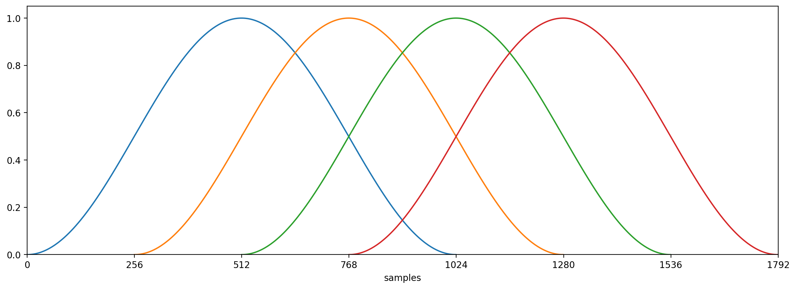
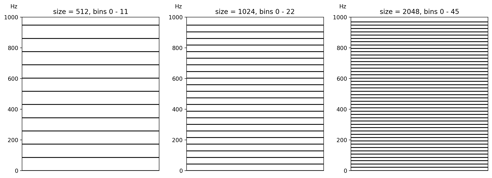
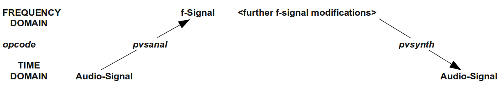

05 I. FOURIER ANALYSIS / SPECTRAL PROCESSING
============================================

An audio signal can be described as continuous changes of amplitudes in time.[^1] This is what we call *time-domain*. With a Fourier Transform (FT), we can transfer this time-domain signal to the *frequency domain*. This can, for instance, be used to analyze and visualize the spectrum of the signal. Fourier transform and subsequent manipulations in the frequency domain open a wide area of far-reaching sound transformations, like time stretching, pitch shifting, cross synthesis and any kind of spectral modification.

[^1]: *Silence* in the digital domain is not only when the ampltitudes are
      always zero. Silence is any constant amplitude, it be 0 or 1 or -0.2.

FT, STFT, DFT and FFT
---------------------

As described in chapter [04 A](04-a-additive-synthesis.md), the mathematician J.B. Fourier (1768-1830) developed a method to approximate periodic functions by weighted sums of the trigonometric functions *sine* and *cosine*. As many sounds, for instance a violin or a flute tone, can be described as *periodic functions*,[^2] we should be able to analyse their spectral components by means of the Fourier Transform.

[^2]: To put this simply: If we *zoom* into recordings of any pitched sound,
      we will see periodic repetitions. If a flute is playing a 440 Hz (A4) 
      tone, we will see every 2.27 milliseconds (1/440 second) the same shape.
      
As continuous changes are inherent to sounds, the FT used in musical applications follows a principle which is well known from film or video. The continuous flow of time is divided into a number of fixed *frames*. If this number is big enough (at least 20 frames per second), the continuous flow can reasonably be divided to this sequence of FT *snapshots*. This is called the *Short Time Fourier Transform (STFT)*.

Some care has to be taken to minimise the side effects of cutting the time into snippets. Firstly an *envelope* for the analysis frame is applied. As one analysis frame is often called *window*, the envelope shapes are called *window function*, *window shape* or *window type*. Most common are the *Hamming* and the *von Hann* (or *Hanning*) window functions:

{width=70%}

Secondly the analysis windows are not put side by side but as *overlapping* each other. The minimal overlap would be to start the next window at the middle of the previous one. More common is to have four overlaps which would result in this image:[^3]

[^3]: It can be a good choice to have 8 overlaps if CPU speed allows it.

We already measured the size of the analysis window in these figures in samples rather than in milliseconds. As we are dealing with *digital* audio, the Fourier Transform has become a *Digital Fourier Transform* (*DFT*). It offers some simplifications compared to the analogue FT as the number of amplitudes in one frame is finite. And moreover, there is a considerable gain of speed in the calculation if the window size is a power of two. This version of the DFT is called *Fast Fourier Transform* (*FFT*) and is implemented in all audio programming languages.

Window Size, Bins and Time-Frequency-Tradeoff
---------------------------------------------

Given that one FFT analysis window size should last about 10-50 ms and that a power-of-two number of samples must be matched, for *sr=44100* the sizes 512, 1024 or 2048 samples would be most suitable for one FFT window, thus resulting in a window length of about 11, 23 and 46 milliseconds respectively. Whether a smaller or lager window size is better, depends on different decisions.

First thing to know about this is that the frequency resolution in a FFT analysis window directly relates to its size. This is based on two aspects: the fundamental frequency and the number of potenial harmonics which are analysed and weighted via the Fourier Transform.

The *fundamental frequency* of one given FFT window is the inverse of its size in seconds related to the sample rate. For *sr=44100* Hz, the fundamental frequencies are:

- 86.13 Hz for a window size of 512 samples
- 43.07 Hz for a window size of 1024 samples
- 21.53 Hz for a window size of 2048 sample.

It is obvious that a larger window is better for frequency analysis at least for low frequencies. This is even more the case as the estimated harmonics which are scanned by the Fourier Transform are *integer multiples* of the fundamental frequency.[^4] These estimated harmonics or partials are usually called *bins* in FT terminology. So, again for *sr=44100* Hz, the bins are:

[^4]: Remember that FT is based on the assumption that the signal to be 
      analysed is a periodic function.

- bin 1 = 86.13 Hz, bin 2 = 172.26 Hz, bin 3 = 258.40 Hz for size=512
- bin 1 = 43.07 Hz, bin 2 = 86.13 Hz, bin 3 = 129.20 Hz for size=1024
- bin 1 = 21.53 Hz, bin 2 = 43.07 Hz, bin 3 = 64.60 Hz for size=2048

This means that a larger window is not only better to analyse low frequencies, it also has a better frequency resolution in general. In fact, the window of size 2048 samples has 1024 analysis bins from the fundamental frequency 21.53 Hz to the Nyquist frequency 22050 Hz, each of them covering a frequency range of 21.53 Hz, whilst the window of size 512 samples has 256 analysis bins from the fundamental frequency 86.13 Hz to the Nyquist frequency 22050 Hz, each of them covering a frequency range of 86.13 Hz.[^5]

[^5]: For both, the *bin 0* is to be added which analyses the energy at 0 Hz.
      So in general the number of bins is half of the window size plus one:
      257 bins for size 512, 513 bins for size 1924, 1025 bins for size 2048.

Why then not always use the larger window? — Because a larger window needs more time, or in other words: the time resolution is worse for a window size of 2048, is fair for a window size of 1024 and is better for a window size of 512.

This dilemma is known as *time-frequency tradeoff*. We must decide for each FFT situation whether the frequency resolution or the time resolution is more important. If, for instance, we have long piano chords with low frequencies, we may use the bigger window size. If we analyse spoken words of a female voice, we may use the smaller window size. Or to put it very pragmatic: We will use the medium FFT size (1024 samples) first, and in case we experience unsatisfying results (bad frequency response or smearing time resolution) we will change the window size.

FFT in Csound
-------------

The raw output of a Fourier Transform is a number of *amplitude-phase* pairs per analysis window frame. Most Csound opcodes use another format which transforms the *phase* values to *frequencies*. This format is related to the *phase vocoder* implementation, so the Csound opcodes of this class are called *phase vocoder opcodes* and start with *pv* or *pvs*.

The *pv* opcodes belong to the early implementation of FFT in Csound. This group comprises the opcodes
[pvadd](https://csound.com/docs/manual/pvadd.html),
[pvbufread](https://csound.com/docs/manual/pvbufread.html),
[pvcross](https://csound.com/docs/manual/pvcross.html),
[pvinterp](https://csound.com/docs/manual/pvinterp.html),
[pvoc](https://csound.com/docs/manual/pvov.html),
[pvread](https://csound.com/docs/manual/pvread.html) and
[vpvoc](https://csound.com/docs/manual/vpvoc.html).
Note that these **pv** opcodes are **not designed to work in real-time**.

The opcodes which **are** designed *for real-time spectral processing* are called *phase vocoder streaming* opcodes. They all start with **pvs**; a rather complete list can be found on the 
[Spectral Processing](https://csound.com/docs/manual/SpectralTop.html)
site in the Csound Manual. They are fast and easy to use. Because of their power and diversity they are one of the biggest strengths in using Csound.

We will focus on these *pvs* opcodes here, which for most use cases offer all what is desirable to work in the spectral domain. There is, however, a group of opcodes which allow to go back to the *raw* FFT output (without the phase vocoder format). They are listed as 
[array-based spectral opcodes](https://csound.com/docs/manual/arraysfft.html)
in the Csound Manual.

From Time Domain to Frequency Domain: *pvsanal*
-----------------------------------------------

For dealing with signals in the frequency domain, the *pvs* opcodes
implement a new signal type, the *frequency-* or *f-signal*. If we start with an audio signal in time-domain as *aSig*, it will become *fSig* as result of the Fourier Transform.

There are several opcodes to perform this transform. The most simple one is 
[pvsanal](https://csound.com/docs/manual/pvsanal.html). It performs on-the-fly transformation of an input audio signal *aSig* to a frequency signal *fSig*. In addition to the audio signal input it requires some basic FFT settings:

- *ifftsize* is the size of the FFT. As explained above, 512, 1024 or 2048 
  samples are reasonable values here.
- *ioverlap* is the number of samples after which the next (overlapping)
  FFT frame starts (often refered to as *hop size*). Usually it is 1/4
  of the FFT size, so for instance 256 samples for a FFT size of 1024.
- *iwinsize* is the size of the analysis window. Usually this is set to
  the same size as *ifftsize*.[^6]
- *iwintype* is the shape of the analysis window. 0 will use a Hamming
  window, 1 will use a von-Hann (or Hanning) window.

[^6]: It can be an integral multiple of *ifftsize*, so a window twice as 
      large as the FFT size would be possible and may improve the quality
      of the anaylysis. But it also induces more latency which usually
      is not desirable.

The first example covers two typical situations:

-   The audio signal derives from playing back a soundfile from the hard
    disk (instr 1).
-   The audio signal is the live input (instr 2).

(Caution - this example can quickly start feeding back. Best results are
with headphones.)

   ***EXAMPLE 05I01_pvsanal.csd*** 

~~~
<CsoundSynthesizer>
<CsOptions>
-i adc -o dac
--env:SSDIR+=../resources/SourceMaterials
</CsOptions>
<CsInstruments>
sr = 44100
ksmps = 32
nchnls = 2
0dbfs = 1

;general values for fourier transform
gifftsiz  =         1024
gioverlap =         256
giwintyp  =         1 ;von hann window

instr 1 ;soundfile to fsig
asig      soundin   "fox.wav"
fsig      pvsanal   asig, gifftsiz, gioverlap, gifftsiz*2, giwintyp
aback     pvsynth   fsig
          outs      aback, aback
endin

instr 2 ;live input to fsig
          prints    "LIVE INPUT NOW!%n"
ain       inch      1 ;live input from channel 1
fsig      pvsanal   ain, gifftsiz, gioverlap, gifftsiz, giwintyp
alisten   pvsynth   fsig
          outs      alisten, alisten
endin

</CsInstruments>
<CsScore>
i 1 0 3
i 2 3 10
</CsScore>
</CsoundSynthesizer>
;example by joachim heintz
~~~

You should hear first the *fox.wav* sample, and then the slightly
delayed live input signal. The delay (or latency) that you will observe
will depend first of all on the general settings for realtime input
(ksmps, -b and -B: see chapter [02 D](02-d-live-audio.md)), but it will also be added to by the FFT process. The window size here is 1024 samples, so the additional delay is 1024/44100 = 0.023 seconds. If you change the window size
*gifftsiz* to 2048 or to 512 samples, you should notice a larger or
shorter delay. For realtime applications, the decision about the FFT
size is not only a question of better time resolution versus better
frequency resolution, but it will also be a question concerning
tolerable latency.

What happens in the example above? Firstly, the audio signal (*asig* or
*ain*) is being analyzed and transformed to an f-signal. This is done via
the opcode [pvsanal](https://csound.com/docs/manual/pvsanal.html).
Then nothing more happens than the f-signal being transformed from the
frequency domain signal back into the time domain (an audio signal).
This is called inverse Fourier transformation (IFT or IFFT) and is
carried out by the opcode
[pvsynth](https://csound.com/docs/manual/pvsynth.html). In this
case, it is just a test: to see if everything works, to hear the results
of different window sizes and to check the latency, but potentially you
can insert any other pvs opcode(s) in between this analysis and
resynthesis:

### Alternatives and Time Stretching: *pvstanal* / *pvsbufread*

Working with *pvsanal* to create an f-signal is easy and straightforward. But if we are using an already existing sound file, we are missing one of the interesting possibilities in working with FFT: time stretching. This we can obtain most simple when we use 
[pvstanal](https://csound.com/docs/manual/pvstanal.html) instead. The *t* in *pvs**t**anal* stands for *table*. This opcode performs FFT on a sound which has been loaded in a table.[^7] These are the main parameters:

[^7]: The table can also be recorded in live performance.

- *ktimescal* is the time scaling ratio. 1 means normal speed, 0.5 means half
  speed, 2 means double speed.
- *kpitch* is the pitch scaling ratio. We will keep this here at 1 which means
  that the pitch is not altered.
- *ktab* is the function table which is being read.

*pvstanal* offers some more and quite interesting parameters but we will use it here only a simple way to demonstrate time stretching.

   ***EXAMPLE 05I02_pvstanal.csd***

~~~
<CsoundSynthesizer>
<CsOptions>
-o dac
</CsOptions>
<CsInstruments>

sr = 44100
ksmps = 32
nchnls = 2
0dbfs  = 1

gifil     ftgen     0, 0, 0, 1, "fox.wav", 0, 0, 1

instr 1
iTimeScal =         p4
fsig      pvstanal  iTimeScal, 1, 1, gifil
aout      pvsynth   fsig
          outs      aout, aout
endin

</CsInstruments>
<CsScore>
i 1 0 2.7 1 ;normal speed
i 1 3 1.3 2 ;double speed
i 1 6 4.5 0.5 ; half speed
i 1 12 17 0.1 ; 1/10 speed
</CsScore>
</CsoundSynthesizer>
;example by joachim heintz
~~~

We hear that for extreme time stretching artifacts arise. This is expected and a result of the FFT resynthesis. Later in this chapter we will discuss how to avoid these artifacts.

The other possibility to work with a table (buffer) and get the f-signal by reading it is to use 
[pvsbufread](https://csound.com/docs/manual/pvsbufread.html). This opcode does not read from an audio buffer but needs a buffer which is filled with FFT data already. This job is done by the related opcode 
[pvsbuffer](https://csound.com/docs/manual/pvsbuffer.html). In the next example, we wrap this procedure in the User Defined Opcode *FileToPvsBuf*. This *UDO* is called at the first control cycle of instrument *simple_time_stretch*, when *timeinstk()* (which counts the control cycles in an instrument) outputs 1. After this job is done, the pvs-buffer is ready and stored in the global variable *gibuffer*. 

Time stretching is then done in the first instrument in a similar way we performed above with *pvstanal*; only that we do not control directly the speed of reading but the real time position (in seconds) in the buffer. In the example, we start in the middle of the sound file and read the words "over the lazy dog" with a time stretch factor of about 10.

The second instrument can still use the buffer. Here a time stretch line is superimposed by a *trembling* random movement. It changes 10 times a second and interpolates to a point which is between - 0.2 seconds and + 0.2 seconds from the current position of the slow moving time pointer created by the expression *linseg:k(0,p3,gilen)*. 

So although a bit harder to use, *pvsbufread* offers some nice possibilities. And it is reported to have a very good performance, for instance when playing back a lot of files triggered by a MIDI keyboard.

   ***EXAMPLE 05I03_pvsbufread.csd***

~~~
<CsoundSynthesizer>
<CsOptions>
-o dac  --env:SSDIR+=../SourceMaterials
</CsOptions>
<CsInstruments>
sr = 44100
ksmps = 32
nchnls = 2
0dbfs = 1

opcode FileToPvsBuf, iik, kSooop
 ;writes an audio file to a fft-buffer if trigger is 1
 kTrig, Sfile, iFFTsize, iOverlap, iWinsize, iWinshape xin
  ;default values
 iFFTsize = (iFFTsize == 0) ? 1024 : iFFTsize
 iOverlap = (iOverlap == 0) ? 256 : iOverlap
 iWinsize = (iWinsize == 0) ? iFFTsize : iWinsize
  ;fill buffer
 if kTrig == 1 then
  ilen 	filelen Sfile
  kNumCycles	= ilen * kr
  kcycle		init		0
  while kcycle < kNumCycles do
   ain soundin Sfile
   fftin pvsanal ain, iFFTsize, iOverlap, iWinsize, iWinshape
   ibuf, ktim pvsbuffer fftin, ilen + (iFFTsize / sr)
   kcycle += 1
  od
 endif
 xout ibuf, ilen, ktim
endop

instr simple_time_stretch
 gibuffer, gilen, k0 FileToPvsBuf timeinstk(), "fox.wav"
 ktmpnt linseg 1.6, p3, gilen
 fread pvsbufread ktmpnt, gibuffer
 aout pvsynth fread
 out aout, aout
endin

instr tremor_time_stretch
 ktmpnt = linseg:k(0,p3,gilen) + randi:k(1/5,10)
 fread pvsbufread ktmpnt, gibuffer
 aout pvsynth fread
 out aout, aout
endin

</CsInstruments>
<CsScore>
i 1 0 10
i 2 11 20
</CsScore>
</CsoundSynthesizer>
;example by joachim heintz
~~~

The [mincer](https://csound.com/docs/manual/mincer.html) opcode also provides a high-quality time- and pitch-shifting algorithm. Other than *pvstanal* and *pvsbufread* it already transforms the f-signal back to time domain, thus outputting an audio signal.

Pitch shifting
--------------

Simple pitch shifting can be carried out by the opcode
[pvscale](https://csound.com/docs/manual/pvscale.html). All the
frequency data in the f-signal are scaled by a certain value.
Multiplying by 2 results in transposing by an octave upwards;
multiplying by 0.5 in transposing by an octave downwards. For accepting
cent values instead of ratios as input, the
[cent](https://csound.com/docs/manual/cent.html) opcode can be used.

   ***EXAMPLE 05I04_pvscale.csd***

~~~
<CsoundSynthesizer>
<CsOptions>
-odac --env:SSDIR+=../SourceMaterials
</CsOptions>
<CsInstruments>
sr = 44100
ksmps = 32
nchnls = 1
0dbfs = 1

gifftsize =         1024
gioverlap =         gifftsize / 4
giwinsize =         gifftsize
giwinshape =        1; von-Hann window

instr 1 ;scaling by a factor
ain       soundin  "fox.wav"
fftin     pvsanal  ain, gifftsize, gioverlap, giwinsize, giwinshape
fftscal   pvscale  fftin, p4
aout      pvsynth  fftscal
          out      aout
endin

instr 2 ;scaling by a cent value
ain       soundin  "fox.wav"
fftin     pvsanal  ain, gifftsize, gioverlap, giwinsize, giwinshape
fftscal   pvscale  fftin, cent(p4)
aout      pvsynth  fftscal
          out      aout/3
endin

</CsInstruments>
<CsScore>
i 1 0 3 1; original pitch
i 1 3 3 .5; octave lower
i 1 6 3 2 ;octave higher
i 2 9 3 0
i 2 9 3 400 ;major third
i 2 9 3 700 ;fifth
e
</CsScore>
</CsoundSynthesizer>
;example by joachim heintz
~~~

Pitch shifting via FFT resynthesis is very simple in general, but rather
more complicated in detail. With speech for instance, there is a problem
because of the formants. If we simply scale the frequencies, the
formants are shifted, too, and the sound gets the typical *helium
voice* effect. There are some parameters in the *pvscale* opcode, and
some other pvs-opcodes which can help to avoid this, but the quality of
the results will always depend to an extend upon the nature of the input
sound.

As mentioned above, simple pitch shifting can also be performed via
[pvstanal](https://csound.com/docs/manual/pvstanal.html) or
[mincer](https://csound.com/docs/manual/mincer.html).
 

Cross Synthesis 
---------------

Working in the frequency domain makes it possible to combine or
*cross* the spectra of two sounds. As the Fourier transform of an
analysis frame results in a frequency and an amplitude value for each
frequency *bin*, there are many different ways of performing cross
synthesis. The most common methods are:

-   Combine the amplitudes of sound A with the frequencies of sound B.
    This is the classical phase vocoder approach. If the frequencies are
    not completely from sound B, but represent an interpolation between
    A and B, the cross synthesis is more flexible and adjustable. This
    is what [pvsvoc](https://csound.com/docs/manual/pvsvoc.html)
    does. 
-   Combine the frequencies of sound A with the amplitudes of sound B.
    Give user flexibility by scaling the amplitudes between A and B:
    [pvscross](https://csound.com/docs/manual/pvscross.html).
-   Get the frequencies from sound A. Multiply the amplitudes of A
    and B. This can be described as spectral filtering.
    [pvsfilter](https://csound.com/docs/manual/pvsfilter.html) gives
    a flexible portion of this filtering effect.

This is an example of phase vocoding. It is nice to have speech as sound
A, and a rich sound, like classical music, as sound B. Here the *fox*
sample is being played at half speed and *sings* through the music of
sound B: 

   ***EXAMPLE 05I05_phase_vocoder.csd***

~~~
<CsoundSynthesizer>
<CsOptions>
-odac --env:SSDIR+=../SourceMaterials
</CsOptions>
<CsInstruments>
sr = 44100
ksmps = 32
nchnls = 1
0dbfs = 1

;store the samples in function tables (buffers)
gifilA    ftgen     0, 0, 0, 1, "fox.wav", 0, 0, 1
gifilB    ftgen     0, 0, 0, 1, "ClassGuit.wav", 0, 0, 1

;general values for the pvstanal opcode
giamp     =         1 ;amplitude scaling
gipitch   =         1 ;pitch scaling
gidet     =         0 ;onset detection
giwrap    =         1 ;loop reading
giskip    =         0 ;start at the beginning
gifftsiz  =         1024 ;fft size
giovlp    =         gifftsiz/8 ;overlap size
githresh  =         0 ;threshold

instr 1
;read "fox.wav" in half speed and cross with classical guitar sample
fsigA     pvstanal  .5, giamp, gipitch, gifilA, gidet, giwrap, giskip,\
                     gifftsiz, giovlp, githresh
fsigB     pvstanal  1, giamp, gipitch, gifilB, gidet, giwrap, giskip,\
                     gifftsiz, giovlp, githresh
fvoc      pvsvoc    fsigA, fsigB, 1, 1
aout      pvsynth   fvoc
aenv      linen     aout, .1, p3, .5
          out       aenv
endin

</CsInstruments>
<CsScore>
i 1 0 11
</CsScore>
</CsoundSynthesizer>
;example by joachim heintz
~~~
 

The next example introduces *pvscross*:

   ***EXAMPLE 05I05_pvscross.csd***

~~~
<CsoundSynthesizer>
<CsOptions>
-odac --env:SSDIR+=../SourceMaterials
</CsOptions>
<CsInstruments>
sr = 44100
ksmps = 32
nchnls = 1
0dbfs = 1

;store the samples in function tables (buffers)
gifilA    ftgen     0, 0, 0, 1, "BratscheMono.wav", 0, 0, 1
gifilB    ftgen     0, 0, 0, 1, "fox.wav", 0, 0, 1

;general values for the pvstanal opcode
giamp     =         1 ;amplitude scaling
gipitch   =         1 ;pitch scaling
gidet     =         0 ;onset detection
giwrap    =         1 ;loop reading
giskip    =         0 ;start at the beginning
gifftsiz  =         1024 ;fft size
giovlp    =         gifftsiz/8 ;overlap size
githresh  =         0 ;threshold

instr 1
;cross viola with "fox.wav" in half speed
fsigA     pvstanal  1, giamp, gipitch, gifilA, gidet, giwrap, giskip,\
                    gifftsiz, giovlp, githresh
fsigB     pvstanal  .5, giamp, gipitch, gifilB, gidet, giwrap, giskip,\
                     gifftsiz, giovlp, githresh
fcross    pvscross  fsigA, fsigB, 0, 1
aout      pvsynth   fcross
aenv      linen     aout, .1, p3, .5
          out       aenv
endin

</CsInstruments>
<CsScore>
i 1 0 11
</CsScore>
</CsoundSynthesizer>
;example by joachim heintz
~~~

The last example shows spectral filtering via *pvsfilter*. The
well-known *fox* (sound A) is now filtered by the viola (sound B). Its
resulting intensity is dependent upon the amplitudes of sound B, and if
the amplitudes are strong enough, you will hear a resonating effect:

   ***EXAMPLE 05I06_pvsfilter.csd***

~~~
<CsoundSynthesizer>
<CsOptions>
-odac --env:SSDIR+=../SourceMaterials
</CsOptions>
<CsInstruments>
sr = 44100
ksmps = 32
nchnls = 1
0dbfs = 1

;store the samples in function tables (buffers)
gifilA    ftgen     0, 0, 0, 1, "fox.wav", 0, 0, 1
gifilB    ftgen     0, 0, 0, 1, "BratscheMono.wav", 0, 0, 1

;general values for the pvstanal opcode
giamp     =         1 ;amplitude scaling
gipitch   =         1 ;pitch scaling
gidet     =         0 ;onset detection
giwrap    =         1 ;loop reading
giskip    =         0 ;start at the beginning
gifftsiz  =         1024 ;fft size
giovlp    =         gifftsiz/4 ;overlap size
githresh  =         0 ;threshold

instr 1
;filters "fox.wav" (half speed) by the spectrum of the viola (double speed)
fsigA     pvstanal  .5, giamp, gipitch, gifilA, gidet, giwrap, giskip,\
                     gifftsiz, giovlp, githresh
fsigB     pvstanal  2, 5, gipitch, gifilB, gidet, giwrap, giskip,\
                     gifftsiz, giovlp, githresh
ffilt     pvsfilter fsigA, fsigB, 1
aout      pvsynth   ffilt
aenv      linen     aout, .1, p3, .5
          out       aenv
endin

</CsInstruments>
<CsScore>
i 1 0 11
</CsScore>
</CsoundSynthesizer>
;example by joachim heintz
~~~

Tewaking FFT Signals
--------------------

(to be written ...)
