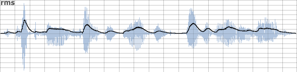

05 L. AMPLITUDE AND PITCH TRACKING
==================================

Tracking the amplitude of an audio signal is a relatively simple
procedure but simply following the amplitude values of the waveform is
unlikely to be useful. An audio waveform will be bipolar, expressing
both positive and negative values, so to start with, some sort of
rectifying of the negative part of the signal will be required. The most
common method of achieving this is to square it (raise to the power of
2) and then to take the square root. Squaring any negative values will
provide positive results (-2 squared equals 4). Taking the square root
will restore the absolute values.

An audio signal is an oscillating signal, periodically passing through
amplitude zero but these zero amplitudes do not necessarily imply that
the signal has decayed to silence as our brain perceives it. Some sort
of averaging will be required so that a tracked amplitude of close to
zero will only be output when the signal has settled close to zero for
some time. Sampling a set of values and outputting their mean will
produce a more acceptable sequence of values over time for a signal\'s
change in amplitude. Sample group size will be important: too small a
sample group may result in some residual ripple in the output signal,
particularly in signals with only low frequency content, whereas too
large a group may result in a sluggish response to sudden changes in
amplitude. Some judgement and compromise is required.

The procedure described above is implemented in the following example. A
simple audio note is created that ramps up and down according to a
linseg envelope. In order to track its amplitude, audio values are
converted to k-rate values and are then squared, then square rooted and
then written into sequential locations of an array 31 values long. The
mean is calculated by summing all values in the array and divided by the
length of the array. This procedure is repeated every k-cycle. The
length of the array will be critical in fine tuning the response for the
reasons described in the preceding paragraph. Control rate (kr) will
also be a factor therefore is taken into consideration when calculating
the size of the array. Changing control rate (kr) or number of audio
samples in a control period (ksmps) will then no longer alter response
behaviour.

***EXAMPLE 05L01\_Amplitude\_Tracking\_First\_Principles.csd*** 

    <CsoundSynthesizer>

    <CsOptions>
    -dm0 -odac
    </CsOptions>

    <CsInstruments>

    sr = 44100
    ksmps = 16
    nchnls = 1
    0dbfs = 1

    ; a rich waveform
    giwave ftgen 1,0, 512, 10, 1,1/2,1/3,1/4,1/5

    instr   1
     ; create an audio signal
     aenv    linseg     0,p3/2,1,p3/2,0  ; triangle shaped envelope
     aSig    poscil     aenv,300,giwave  ; audio oscillator
             out        aSig             ; send audio to output

     ; track amplitude
     kArr[]   init  500 / ksmps     ; initialise an array
     kNdx     init  0               ; initialise index for writing to array
     kSig     downsamp        aSig  ; create k-rate version of audio signal
     kSq      =     kSig ^ 2        ; square it (negatives become positive)
     kRoot    =     kSq ^ 0.5       ; square root it (restore absolute values)
     kArr[kNdx] =   kRoot           ; write result to array
     kMean      =   sumarray(kArr) / lenarray(kArr) ; calculate mean of array
                    printk  0.1,kMean   ; print mean to console
    ; increment index and wrap-around if end of the array is met
     kNdx           wrap    kNdx+1, 0, lenarray(kArr)
    endin

    </CsInstruments>

    <CsScore>
    i 1 0 5
    </CsScore>

    </CsoundSynthesizer>

In practice it is not necessary for us to build our own amplitude
tracker as Csound already offers several opcodes for the task.
[rms](https://csound.com/docs/manual/rms.html) outputs a k-rate
amplitude tracking signal by employing mathematics similar to those
described above.
[follow](https://csound.com/docs/manual/follow.html) outputs at
a-rate and uses a sample and hold method as it outputs data, probably
necessitating some sort of low-pass filtering of the output signal.
[follow2](https://csound.com/docs/manual/follow2.html) also outputs
at a-rate but smooths the output signal by different amounts depending
on whether the amplitude is rising or falling.

A quick comparison of these three opcodes and the original method from
first principles is given below:

The sound file used in all three comparisons is \'fox.wav\' which can be
found as part of the Csound HTML Manual download. This sound is someone
saying: "the quick brown fox jumps over the lazy dog".

::: {.group_img}
::: {.image}

:::
:::

First of all by employing the the technique exemplified in example
05L01, the amplitude following signal is overlaid upon the source
signal:

::: {.group_img}
::: {.image}

:::
:::

 

It can be observed that the amplitude tracking signal follows the
amplitudes of the input signal reasonably well. A slight delay in
response at sound onsets can be observed as the array of values used by
the averaging mechanism fills with appropriately high values. As
discussed earlier, reducing the size of the array will improve response
at the risk of introducing ripple. Another approach to dealing with the
issue of ripple is to low-pass filter the signal output by the amplitude
follower. This is an approach employed by the
[follow2](https://csound.com/docs/manual/follow2.html) opcode. The
second thing that is apparent is that the amplitude following signal
does not attain the peak value of the input signal. At its peaks, the
amplitude following signal is roughly 1/3 of the absolute peak value of
the input signal. How close it gets to the absolute peak amplitude
depends somewhat on the dynamic nature of the input signal. If an input
signal sustains a peak amplitude for some time then the amplitude
following signal will tend to this peak value.

The [rms](https://csound.com/docs/manual/rms.html) opcode employs a
method similar to that used in the previous example but with the
convenience of an encapsulated opcode. Its output superimposed upon the
waveform is shown below:

::: {.group_img}
::: {.image}

:::
:::

 

 

 

Its method of averaging uses filtering rather than simply taking a mean
of a buffer of amplitude values.
[rms](https://csound.com/docs/manual/rms.html) allows us to set the
cutoff frequency (kCf) of its internal filter:

    kRms  rms  aSig, kCf

This is an optional argument which defaults to 10. Lowering this value
will dampen changes in rms and smooth out ripple, raising it will
improve the response but increase the audibility of ripple. A choice can
be made based on some foreknowledge of the input audio signal: dynamic
percussive input audio might demand faster response whereas audio that
dynamically evolves gradually might demand greater smoothing.

\
The [follow](https://csound.com/docs/manual/follow.html) opcode uses
a sample-and-hold mechanism when outputting the tracked amplitude. This
can result in a stepped output that might require addition lowpass
filtering before use. We actually defined the period, the duration for
which values are held, using its second input argument. The update rate
will be one over the period.  In the following example the audio is
amplitude tracked using the following line:

    aRms    follow    aSig, 0.01

 with the following result:

::: {.group_img}
::: {.image}

:::
:::

The hump over the word spoken during the third and fourth time divisions
initially seem erroneous but it is a result of greater amplitude
excursion into the negative domain.
[follow](https://csound.com/docs/manual/follow.html) provides a
better reflection of absolute peak amplitude. 

[follow2](https://csound.com/docs/manual/follow2.html) uses a
different algorithm with smoothing on both upward and downward slopes of
the tracked amplitude. We can define different values for attack and
decay time. In the following example the decay time is much longer than
the attack time. The relevant line of code is:

    iAtt  =        0.04
    iRel  =        0.5
    aTrk  follow2  aSig, 0.04, 0.5

and the result of amplitude tracking is:

::: {.group_img}
::: {.image}

:::
:::

This technique can be used to extend the duration of short input sound
events or triggers. Note that the attack and release times for follow2
can also be modulated at k-rate. 

 

Dynamic Gating and Amplitude Triggering
---------------------------------------

Once we have traced the changing amplitude of an audio signal it is
straightforward to use specific changes in that function to trigger
other events within Csound. The simplest technique would be to simply
define a threshold above which one thing happens and below which
something else happens. A crude dynamic gating of the signal above could
be implemented thus:

***EXAMPLE 05L02\_Simple\_Dynamic\_Gate.csd***

    <CsoundSynthesizer>

    <CsOptions>
    -dm0 -odac
    </CsOptions>

    <CsInstruments>

    ksmps = 32
    0dbfs = 1
    ; this is a necessary definition,
    ;         otherwise amplitude will be -32768 to 32767

    instr    1
     aSig    diskin  "fox.wav", 1        ; read sound file
     kRms    rms     aSig                ; scan rms
     iThreshold =    0.1                 ; rms threshold
     kGate   =       kRms > iThreshold ? 1 : 0  ; gate either 1 or zero
     aGate   interp  kGate   ; interpolate to create smoother on->off->on switching
     aSig    =       aSig * aGate        ; multiply signal by gate
             out     aSig                ; send to output
    endin

    </CsInstruments>

    <CsScore>
    i 1 0 10
    </CsScore>

    </CsoundSynthesizer>

Once a dynamic threshold has been defined, in this case 0.1, the RMS
value is interrogated every k-cycle as to whether it is above or below
this value. If it is above, then the variable kGate adopts a value of
\'1\' (open) or if below, kGate is zero (closed). This on/off switch
could just be multiplied to the audio signal to turn it on or off
according to the status of the gate but clicks would manifest each time
the gates opens or closes so some sort of smoothing or ramping of the
gate signal is required. In this example I have simply interpolated it
using the \'interp\' opcode to create an a-rate signal which is then
multiplied to the original audio signal. This means that a linear ramp
with be added across the duration of a k-cycle in audio samples -- in
this case 32 samples. A more elaborate approach might involve portamento
and low-pass filtering.\
The results of this dynamic gate are shown below:

::: {.group_img}
::: {.image}

:::
:::

The threshold is depicted as a red line. It can be seen that each time
the RMS value (the black line) drops below the threshold the audio
signal (blue waveform) is muted.

The simple solution described above can prove adequate in applications
where the user wishes to sense sound event onsets and convert them to
triggers but in more complex situations, in particular when a new sound
event occurs whilst the previous event is still sounding and pushing the
RMS above the threshold, this mechanism will fail. In these cases
triggering needs to depend upon dynamic *change* rather than absolute
RMS values. If we consider a two-event sound file where two notes sound
on a piano, the second note sounding while the first is still decaying,
triggers generated using the RMS threshold mechanism from the previous
example will only sense the first note onset. (In the diagram below this
sole trigger is illustrated by the vertical black line.) Raising the
threshold might seem to be remedial action but is not ideal as this will
prevent quietly played notes from generating triggers.

::: {.group_img}
::: {.image}

:::
:::

 

It will often be more successful to use magnitudes of amplitude increase
to decide whether to generate a trigger or not. The two critical values
in implementing such a mechanism are the time across which a change will
be judged (\'iSampTim\' in the example) and the amount of amplitude
increase that will be required to generate a trigger (iThresh). An
additional mechanism to prevent double triggerings if an amplitude
continues to increase beyond the time span of a single sample period
will also be necessary. What this mechanism will do is to bypass the
amplitude change interrogation code for a user-definable time period
immediately after a trigger has been generated (iWait). A timer which
counts elapsed audio samples (kTimer) is used to time how long to wait
before retesting amplitude changes.

If we pass our piano sound file through this instrument, the results
look like this:

::: {.group_img}
::: {.image}
<!-- FIXME:  -->
:::
:::

This time we correctly receive two triggers, one at the onset of each
note.

The example below tracks audio from the sound-card input channel 1 using
this mechanism.

***EXAMPLE 05L03\_Dynamic\_Trigger.csd***

    <CsoundSynthesizer>

    <CsOptions>
    -dm0 -iadc -odac
    </CsOptions>

    <CsInstruments>

    sr     =  44100
    ksmps  =  32
    nchnls =  2
    0dbfs  =  1

    instr   1
     iThresh  =       0.1                ; change threshold
     aSig     inch    1                  ; live audio in
     iWait    =       1000              ; prevent repeats wait time (in samples)
     kTimer   init    1001               ; initial timer value
     kRms     rms     aSig, 20           ; track amplitude
     iSampTim =       0.01    ; time across which change in RMS will be measured
     kRmsPrev delayk  kRms, iSampTim     ; delayed RMS (previous)
     kChange  =       kRms - kRmsPrev    ; change
     if(kTimer>iWait) then               ; if we are beyond the wait time...
      kTrig   =       kChange > iThresh ? 1 : 0 ; trigger if threshold exceeded
      kTimer  =       kTrig == 1 ? 0 : kTimer ; reset timer when a trigger generated
     else                     ; otherwise (we are within the wait time buffer)
      kTimer  +=      ksmps              ; increment timer
      kTrig   =       0                  ; cancel trigger
     endif
              schedkwhen kTrig,0,0,2,0,0.1 ; trigger a note event
    endin

    instr   2
     aEnv     transeg   0.2, p3, -4, 0     ; decay envelope
     aSig     poscil    aEnv, 400          ; 'ping' sound indicator
              out       aSig               ; send audio to output
    endin

    </CsInstruments>

    <CsScore>
    i 1 0 [3600*24*7]
    </CsScore>
    </CsoundSynthesizer>

 

Pitch Tracking
--------------

Csound currently provides five opcode options for pitch tracking. In
ascending order of newness they are:
[pitch](https://csound.com/docs/manual/pitch.html),
[pitchamdf](https://csound.com/docs/manual/pitchamdf.html),
[pvspitch](https://csound.com/docs/manual/pvspitch.html),
[ptrack](https://csound.com/docs/manual/ptrack.html) and
[plltrack](https://csound.com/docs/manual/plltrack.html). Related to
these opcodes are pvscent and centroid but rather than track the
harmonic fundamental, they track the spectral centroid of a signal. An
example and suggested application for centroid is given a little later
on in this chapter.

Each offers a slightly different set of features -- some offer
simultaneous tracking of both amplitude and pitch, some only pitch
tracking. None of these opcodes provide more than one output for tracked
frequency therefore none offer polyphonic tracking although in a
polyphonic tone the fundamental of the strongest tone will most likely
be tracked. Pitch tracking presents many more challenges than amplitude
tracking therefore a degree of error can be expected and will be an
issue that demands addressing. To get the best from any pitch tracker it
is important to consider preparation of the input signal -- either
through gating or filtering -- and also processing of the output
tracking data, for example smoothing changes through the use of
filtering opcode such as port, median filtering to remove erratic and
erroneous data and a filter to simply ignore obviously incorrect data.
Parameters for these procedures will rely upon some prior knowledge of
the input signal, the pitch range of an instrument for instance. A
particularly noisy environment or a distant microphone placement might
demand more aggressive noise gating. In general some low-pass filtering
of the input signal will always help in providing a more stable
frequency tracking signal. Something worth considering is that the
attack portion of a note played on an acoustic instrument generally
contains a lot of noisy, harmonically chaotic material. This will tend
to result in slightly chaotic movement in the pitch tracking signal, we
may therefore wish to sense the onset of a note and only begin tracking
pitch once the sustain portion has begun. This may be around 0.05
seconds after the note has begun but will vary from instrument to
instrument and from note to note. In general lower notes will have a
longer attack. However we do not really want to overestimate the
duration of this attack stage as this will result in a sluggish pitch
tracker. Another specialised situation is the tracking of pitch in
singing -- we may want to gate sibilant elements (\'sss\', \'t\' etc.).
pvscent can be useful in detecting the difference between vowels and
sibilants.

\'pitch\' is the oldest of the pitch tracking opcodes on offer and
provides the widest range of input parameters.

    koct, kamp pitch asig, iupdte, ilo, ihi, idbthresh [, ifrqs] [, iconf] \
          [, istrt] [, iocts] [, iq] [, inptls] [, irolloff] [, iskip]

This makes it somewhat more awkward to use initially (although many of
its input parameters are optional) but some of its options facilitate
quite specialised effects. Firstly it outputs its tracking signal in
\'oct\' format. This might prove to be a useful format but conversion to
other formats is easy anyway. Apart from a number of parameters intended
to fine tune the production of an accurate signal it allows us to
specify the number of octave divisions used in quantising the output.
For example if we give this a value of 12 we have created the basis of a
simple chromatic \'autotune\' device. We can also quantise the procedure
in the time domain using its \'update period\' input. Material with
quickly changing pitch or vibrato will require a shorter update period
(which will demand more from the CPU). It has an input control for
\'threshold of detection\' which can be used to filter out and disregard
pitch and amplitude tracking data beneath this limit. Pitch is capable
of very good pitch and amplitude tracking results in real-time.

pitchamdf uses the so-called \'Average Magnitude Difference Function\'
method. It is perhaps slightly more accurate than pitch as a general
purpose pitch tracker but its CPU demand is higher.

pvspitch uses streaming FFT technology to track pitch. It takes an
f-signal as input which will have to be created using the pvsanal
opcode. At this step the choice of FFT size will have a bearing upon the
performance of the pvspitch pitch tracker. Smaller FFT sizes will allow
for faster tracking but with perhaps some inaccuracies, particularly
with lower pitches whereas larger FFT sizes are likely to provide for
more accurate pitch tracking at the expense of some time resolution.
pvspitch tries to mimic certain functions of the human ear in how it
tries to discern pitch. pvspitch works well in real-time but it does
have a tendency to jump its output to the wrong octave -- an octave too
high -- particularly when encountering vibrato.

ptrack also makes uses of streaming FFT but takes an normal audio signal
as input, performing the FFT analysis internally. We still have to
provide a value for FFT size with the same considerations mentioned
above. ptrack is based on an algorithm by Miller Puckette, the
co-creator of MaxMSP and creator of PD. ptrack also works well in
real-time but it does have a tendency to jump to erroneous pitch
tracking values when pitch is changing quickly or when encountering
vibrato. Median filtering (using the mediank opcode) and filtering of
outlying values might improve the results.

plltrack uses a phase-locked loop algorithm in detecting pitch. plltrack
is another efficient real-time option for pitch tracking. It has a
tendency to gliss up and down from very low frequency values at the
start and end of notes, i.e. when encountering silence. This effect can
be minimised by increasing its \'feedback\' parameter but this can also
make pitch tracking unstable over sustained notes.

In conclusion, pitch is probably still the best choice as a general
purpose pitch tracker, pitchamdf is also a good choice. pvspitch, ptrack
and plltrack all work well in real-time but might demand additional
processing to remove errors.

[pvscent](https://csound.com/docs/manual/pvscent.html) and
[centroid](https://csound.com/docs/manual/centroid.html) are a
little different to the other pitch trackers in that, rather than try to
discern the fundemental of a harmonic tone, they assess what the centre
of gravity of a spectrum is. An application for this is in the
identification of different instruments playing the same note. Softer,
darker instruments, such as the french horn, will be characterised by a
lower centroid to that of more shrill instruments, such as the violin.

Both opcodes use FFT. Centroid works directly with an audio signal input
whereas pvscent requires an f-sig input. Centroid also features a
trigger input which allows us to manually trigger it to update its
output. In the following example we use centroid to detect individual
drums sounds -- bass drum, snare drum, cymbal -- within a drum loop. We
will use the dynamic amplitude trigger from earlier on in this chapter
to detect when sound onsets are occurring and use this trigger to
activate centroid and also then to trigger another instrument with a
replacement sound. Each percussion instrument in the original drum loop
will be replaced with a different sound: bass drums will be replaced
with a kalimba/thumb piano sound, snare drums will be replaced by hand
claps (a la TR-808), and cymbal sounds will be replaced with tambourine
sounds. The drum loop used is beats.wav which can be found with the
download of the Csound HTML manual (and within the Csound download
itself). This loop is not ideal as some of the instruments coincide with
one another -- for example, the first consists of a bass drum and a
snare drum played together. The \'beat replacer\' will inevitably make a
decision one way or the other but is not advanced enough to detect both
instruments playing simultaneously. The critical stage is the series of
if\... elseifs\... at the bottom of instrument 1 where decisions are
made about instruments\' identities according to what centroid band they
fall into. The user can fine tune the boundary division values to modify
the decision making process. centroid values are also printed to the
terminal when onsets are detected which might assist in this fine
tuning.

***EXAMPLE 05L04\_Drum\_Replacement.csd***

    <CsoundSynthesizer>
    <CsOptions>
    -dm0 -odac
    </CsOptions>
    <CsInstruments>

    sr = 44100
    ksmps = 32
    nchnls = 1
    0dbfs = 1

    instr   1
     asig   diskin  "beats.wav",1

     iThreshold = 0.05
     iWait      = 0.1*sr
     kTimer     init iWait+1
     iSampTim =       0.02                ; time across which RMS change is measured
     kRms   rms     asig ,20
     kRmsPrev       delayk  kRms,iSampTim ; rms from earlier
     kChange =      kRms - kRmsPrev       ; change (+ve or -ve)

     if kTimer > iWait then               ; prevent double triggerings
      ; generate a trigger
      kTrigger   =  kChange > iThreshold ? 1 : 0
      ; if trigger is generated, reset timer
      kTimer  =   kTrigger == 1 ? 0 : kTimer
     else
      kTimer  +=  ksmps                   ; increment timer
      kTrigger = 0                        ; clear trigger
     endif

     ifftsize = 1024
     ; centroid triggered 0.02 after sound onset to avoid noisy attack
     kDelTrig delayk kTrigger,0.02
     kcent  centroid asig, kDelTrig, ifftsize  ; scan centroid
            printk2  kcent            ; print centroid values
     if kDelTrig==1 then
      if kcent>0 && kcent<2500 then   ; first freq. band
       event "i","Cowbell",0,0.1
      elseif kcent<8000 then          ; second freq. band
       event "i","Clap",0,0.1
      else                            ; third freq. band
       event "i","Tambourine",0,0.5
      endif
     endif
    endin

    instr   Cowbell
     kenv1  transeg 1,p3*0.3,-30,0.2, p3*0.7,-30,0.2
     kenv2  expon   1,p3,0.0005
     kenv   =       kenv1*kenv2
     ipw    =       0.5
     a1     vco2    0.65,562,2,0.5
     a2     vco2    0.65,845,2,0.5
     amix   =       a1+a2
     iLPF2  =       10000
     kcf    expseg  12000,0.07,iLPF2,1,iLPF2
     alpf   butlp   amix,kcf
     abpf   reson   amix, 845, 25
     amix   dcblock2        (abpf*0.06*kenv1)+(alpf*0.5)+(amix*0.9)
     amix   buthp   amix,700
     amix   =       amix*0.5*kenv
            out     amix
    endin

    instr   Clap
     if frac(p1)==0 then
      event_i       "i", p1+0.1, 0,     0.02
      event_i       "i", p1+0.1, 0.01,  0.02
      event_i       "i", p1+0.1, 0.02,  0.02
      event_i       "i", p1+0.1, 0.03,  2
     else
      kenv  transeg 1,p3,-25,0
      iamp  random  0.7,1
      anoise        dust2   kenv*iamp, 8000
      iBPF          =       1100
      ibw           =       2000
      iHPF          =       1000
      iLPF          =       1
      kcf   expseg  8000,0.07,1700,1,800,2,500,1,500
      asig  butlp   anoise,kcf*iLPF
      asig  buthp   asig,iHPF
      ares  reson   asig,iBPF,ibw,1
      asig  dcblock2        (asig*0.5)+ares
            out     asig
     endif
    endin

    instr   Tambourine
            asig    tambourine      0.3,0.01 ,32, 0.47, 0, 2300 , 5600, 8000
                    out     asig    ;SEND AUDIO TO OUTPUTS
    endin

    </CsInstruments>
    <CsScore>
    i 1 0 10
    </CsScore>
    </CsoundSynthesizer>
