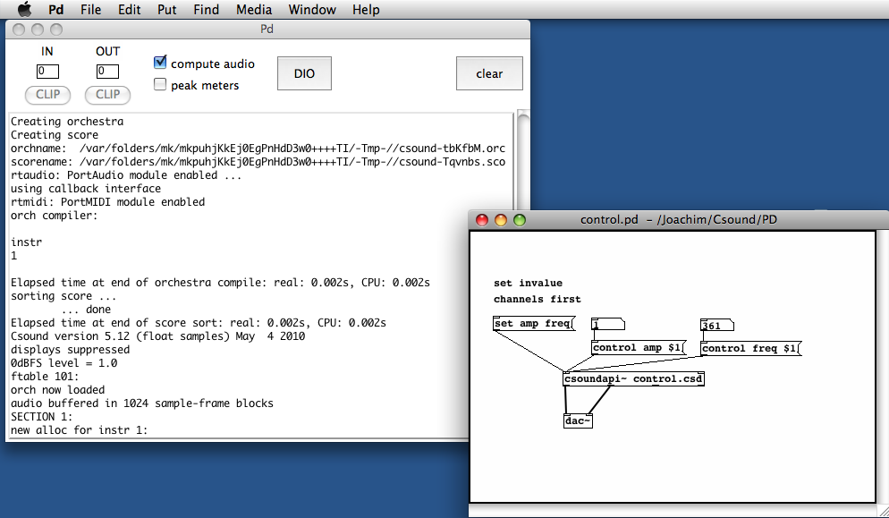
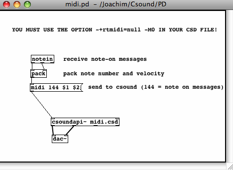
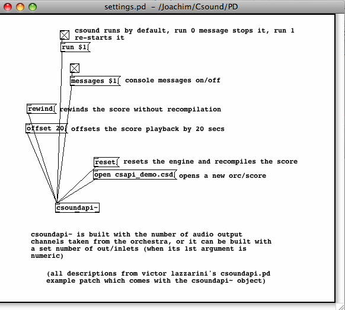

09 A. CSOUND IN PD
==================

INSTALLING 
-----------

You can embed Csound in PD via the external object **csound6\~**^1^
which has been written by Victor Lazzarini. This external is either part
of the Csound distribution or can be built from the sources at
<https://github.com/csound/csound_pd> . In the examples folder of this
repository you can also find all the .csd and .pd files of this chapter.

On **Ubuntu Linux**, you can install the csound6\~ via the Synaptic
Package Manager. Just look for \"csound6\~\" or \"pd-csound\", check
\"install\", and your system will install the library at the appropriate
location. If you build Csound from sources, go to
<https://github.com/csound/csound_pd> and follow the build instructions.
Once it is compiled, the object will appear as csound6\~.pd\_linux and
should be copied (together with csound6\~-help.pd) to /usr/lib/pd/extra,
so that PD can find it. If not, add it to PD\'s search path
(File-\>Path\...).

On **Mac OSX**, you find the csound6\~ external, help file and examples
in <https://github.com/csound/csound_pd/releases>

(Prior to 6.11, it was in
/Library/Frameworks/CsoundLib64.framework/Versions/6.0/Resources/PD.)

Put these files in a folder which is in PD\'s search path. For
PD-extended, it is by default \~/Library/Pd. But you can put it
anywhere. Just make sure that the location is specified in PD\'s
Preferences \> Path\... menu.

On **Windows**, you find the csound6\~ external, help file and examples
in <https://github.com/csound/csound_pd/releases>

For older versions of Csound, the csound6\~ object was included in the
installer. The description is left here for the case that someone needs
to install one of these older versions:

\<\<while installing Csound, open up the \"Front ends\" component in the
Installer box and make sure the item \"csound6\~\" is checked:

 

::: {.group_img}
::: {.image}

:::
:::

\
\
After having finished the installation, you will find csound6\~.dll in
the csound/bin folder. Copy this file into the pd/extra folder, or in
any other location in PD\'s search path. Due to the dependencies in
Csound 6, you may find that it works better to add the Csound/bin
directory to the search paths in Pd\'s Preferences window.

*Note for Csound 6.07 for Windows: As it is build for 64bit
architecture, but PD does not fully support the 64 bit CPU architecture
with loadable objects at this time, the Windows installer currently
comes without the csound6\~ external. Use 6.06 or earlier versions until
a solution is found.\>\>*

Once you have installed the \"csound6\~\" extension on any platform, and
included the file in PD\'s search path if necessary, you should be able
to call the csound6\~ object in PD. Just open a PD window, put a new
object, and type in \"csound6\~\":

::: {.group_img}
::: {.image}
{width="671" height="342"}
:::
:::

\
\

CONTROL DATA
------------

You can send control data from PD to your Csound instrument via the
keyword \"control\" in a message box. In your Csound code, you must
receive the data via
[invalue](a-csound-in-pd/csound-in-pd/www.csounds.com/manual/html/invalue.html "this")
or
[chnget](a-csound-in-pd/csound-in-pd/www.csounds.com/manual/html/chnget.html "this").
This is a simple example:

***EXAMPLE 09A01\_pdcs\_control\_in.csd***

    <CsoundSynthesizer>
    <CsOptions>
    </CsOptions>
    <CsInstruments>
    ;Example by Joachim Heintz

    sr = 44100
    nchnls = 2
    0dbfs = 1
    ksmps = 8

    giSine    ftgen     0, 0, 2^10, 10, 1

    instr 1
    kFreq     invalue   "freq"
    kAmp      invalue   "amp"
    aSin      oscili    kAmp, kFreq, giSine
              outs      aSin, aSin
    endin

    </CsInstruments>
    <CsScore>
    i 1 0 10000
    </CsScore>
    </CsoundSynthesizer>

Save this file under the name \"control.csd\". Save a PD window in the
same folder and create the following patch:

::: {.group_img}
::: {.image}
{width="600" height="349"}
:::
:::

Note that for *invalue* channels, you first must register these channels
by a \"set\" message. The usage of *chnget* is easier; a simple example
can be found in
[this](https://github.com/csound/csound_pd/blob/master/examples/iem_workshop/cs_pd_05_control_input.pd "this")
example in the csound6\~ repository.

As you see, the first two outlets of the csound6\~ object are the signal
outlets for the audio channels 1 and 2. The third outlet is an outlet
for control data (not used here, see below). The rightmost outlet sends
a bang when the score has been finished.

LIVE INPUT
----------

Audio streams from PD can be received in Csound via the
[inch](a-csound-in-pd/csound-in-pd/www.csounds.com/manual/html/inch.html "this")
opcode. The number of audio inlets created in the csound6\~ object will
depend on the number of input channels used in the Csound orchestra. The
following .csd uses two audio inputs:

***EXAMPLE 09A02\_pdcs\_live\_in.csd ***

    <CsoundSynthesizer>
    <CsOptions>
    </CsOptions>
    <CsInstruments>
    ;Example by Joachim Heintz
    sr = 44100
    0dbfs = 1
    ksmps = 8
    nchnls = 2

    instr 1
    aL        inch      1
    aR        inch      2
    kcfL      randomi   100, 1000, 1; center frequency
    kcfR      randomi   100, 1000, 1; for band pass filter
    aFiltL    butterbp  aL, kcfL, kcfL/10
    aoutL     balance   aFiltL, aL
    aFiltR    butterbp  aR, kcfR, kcfR/10
    aoutR     balance   aFiltR, aR
              outch     1, aoutL
              outch     2, aoutR
    endin

    </CsInstruments>
    <CsScore>
    i 1 0 10000
    </CsScore>
    </CsoundSynthesizer>

The corresponding PD patch is extremely simple:

::: {.group_img}
::: {.image}
{width="600" height="341"}
:::
:::

MIDI
----

The csound6\~ object receives MIDI data via the keyword \"midi\". Csound
is able to trigger instrument instances in receiving a \"note on\"
message, and turning them off in receiving a \"note off\" message (or a
note-on message with velocity=0). So this is a very simple way to build
a synthesizer with arbitrary polyphonic output:

::: {.group_img}
::: {.image}
{width="468" height="341"}
:::
:::

This is the corresponding midi.csd. It must contain the options
-+rtmidi=null -M0 in the \<CsOptions\> tag. It is an FM synth in which
the modulation index is defined according to the note velocity. The
harder a key is truck, the higher the index of modulation will be; and
therefore a greater number of stronger partials will be created. The
ratio is calculated randomly between two limits, which can be adjusted.

***EXAMPLE 09A03\_pdcs\_midi.csd ***

    <CsOptions>
    -+rtmidi=null -M0
    </CsOptions>
    <CsoundSynthesizer>
    <CsInstruments>
    ;Example by Joachim Heintz
    sr      =  44100
    ksmps   =  8
    nchnls  =  2
    0dbfs = 1

    giSine    ftgen     0, 0, 2^10, 10, 1

    instr 1
    iFreq     cpsmidi   ;gets frequency of a pressed key
    iAmp      ampmidi   8;gets amplitude and scales 0-8
    iRatio    random    .9, 1.1; ratio randomly between 0.9 and 1.1
    aTone     foscili   .1, iFreq, 1, iRatio/5, iAmp+1, giSine; fm
    aEnv      linenr    aTone, 0, .01, .01; avoiding clicks at the end of a note
              outs      aEnv, aEnv
    endin

    </CsInstruments>
    <CsScore>
    f 0 36000; play for 10 hours
    e
    </CsScore>
    </CsoundSynthesizer>

SCORE EVENTS
------------

Score events can be sent from PD to Csound by a message with the keyword
**event**. You can send any kind of score events, like instrument calls
or function table statements. The following example triggers Csound\'s
instrument 1 whenever you press the message box on the top. Different
sounds can be selected by sending f events (building/replacing a
function table) to Csound.

::: {.group_img}
::: {.image}
{width="479" height="403"}
:::
:::

***EXAMPLE 09A04\_pdcs\_events.csd***

    <CsoundSynthesizer>
    <CsOptions>
    </CsOptions>
    <CsInstruments>
    ;Example by Joachim Heintz
    sr = 44100
    ksmps = 8
    nchnls = 2
    0dbfs = 1

              seed      0; each time different seed
    giSine    ftgen     1, 0, 2^10, 10, 1; function table 1

    instr 1
    iDur      random    0.5, 3
    p3        =         iDur
    iFreq1    random    400, 1200
    iFreq2    random    400, 1200
    idB       random    -18, -6
    kFreq     linseg    iFreq1, iDur, iFreq2
    kEnv      transeg   ampdb(idB), p3, -10, 0
    aTone     oscili    kEnv, kFreq, 1
              outs      aTone, aTone
    endin

    </CsInstruments>
    <CsScore>
    f 0 36000; play for 10 hours
    e
    </CsScore>
    </CsoundSynthesizer>

CONTROL OUTPUT
--------------

If you want Csound to pass any control data to PD, you can use the
opcode
[outvalue](a-csound-in-pd/csound-in-pd/www.csounds.com/manual/html/outvalue.html "this")
. You will receive this data at the second outlet from the right of the
csound6\~ object. The data are sent as a list with two elements. The
name of the control channel is the first element, and the value is the
second element. You can get the values by a *route* object or by a
*send/receive* chain. This is a simple example:

::: {.group_img}
::: {.image}
{width="396" height="340"}
:::
:::

***EXAMPLE 09A05\_pdcs\_control\_out.csd ***

    <CsoundSynthesizer>
    <CsOptions>
    </CsOptions>
    <CsInstruments>
    ;Example by Joachim Heintz

    sr = 44100
    nchnls = 2
    0dbfs = 1
    ksmps = 8

    instr 1
    ktim      times
    kphas     phasor    1
              outvalue  "time", ktim
              outvalue  "phas", kphas*127
    endin

    </CsInstruments>
    <CsScore>
    i 1 0 30
    </CsScore>
    </CsoundSynthesizer>

 

SEND/RECEIVE BUFFERS FROM PD TO CSOUND AND BACK
-----------------------------------------------

A PD array can be sent directly to Csound, and a Csound function table
to PD. The message *tabset* \[tabset array-name ftable-number\] copies a
PD array into a Csound function table. The message *tabget* \[tabget
array-name ftable-number\] copies a Csound function table into a PD
array. The example below should explain everything. Just choose another
soundfile instead of \"stimme.wav\".

::: {.group_img}
::: {.image}

:::
:::

*\
*

***EXAMPLE 06A06\_pdcs\_tabset\_tabget.csd***

    <CsoundSynthesizer>
    <CsOptions>
    -odac
    </CsOptions>
    <CsInstruments>
    sr = 44100
    ksmps = 8
    nchnls = 1
    0dbfs = 1

    giCopy ftgen 1, 0, -88200, 2, 0 ;"empty" table
    giFox  ftgen 2, 0, 0, 1, "fox.wav", 0, 0, 1

      opcode BufPlay1, a, ipop
    ifn, ispeed, iskip, ivol xin
    icps      =         ispeed / (ftlen(ifn) / sr)
    iphs      =         iskip / (ftlen(ifn) / sr)
    asig      poscil3   ivol, icps, ifn, iphs
              xout      asig
      endop

      instr 1
    itable    =         p4
    aout      BufPlay1  itable
              out       aout
      endin

    </CsInstruments>
    <CsScore>
    f 0 99999
    </CsScore>
    </CsoundSynthesizer>
    ;example by joachim heintz

SETTINGS
--------

Make sure that the Csound vector size given by the
[ksmps](http://www.csounds.com/manual/html/ksmps.html "this") value, is
not larger than the internal PD vector size. It should be a power of 2.
I would recommend starting with ksmps=8. If there are performance
problems, try to increase this value to 16, 32, or 64, i.e. ascending
powers of 2.

The csound6\~ object runs by default if you turn on audio in PD. You can
stop it by sending a \"run 0\" message, and start it again with a \"run
1\" message.

You can recompile the .csd file of a csound6\~ object by sending a
\"reset\" message.

By default, you see all the messages of Csound in the PD window. If you
do not want to see them, send a \"message 0\" message. \"message 1\"
re-enables message printing.

If you want to open a new .csd file in the csound6\~ object, send the
message \"open\", followed by the path of the .csd file you want to
load.

A \"rewind\" message rewinds the score without recompilation. The
message \"offset\", followed by a number, offsets the score playback by
that number of seconds.

::: {.group_img}
::: {.image}

:::
:::

1.  [This is the new name for Csound 6. In Csound 5 the name was
    csoundapi\~. The different names make it possible to have both
    versions installed. Wherever in this chapter \"csoundapi\~\" is
    used, it should work the same way as \"csound6\~\" for
    Csound 6.]{#endnote-852c47c3-a7d4-4c09-a4fa-044b889cf87c}
