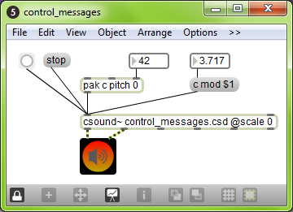
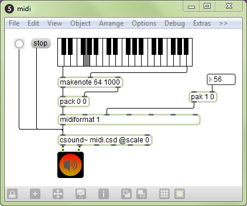

09 B. CSOUND IN MAXMSP
======================

 

Csound can be embedded in a [Max](http://cycling74.com/products/max/)
patch using the csound\~ object. This allows you to synthesize and
process audio, MIDI, or control data with Csound.

INSTALLING
----------

The csound\~ requires an installation of Csound. For Csound6, it should
be a part of the main installer. If this is not the case, you should
find an installer in Csound\'s file release folder, for instance as to
Csound 6.02 here:
http://sourceforge.net/projects/csound/files/csound6/Csound6.02/csound%7E\_v1.1.1.pkg/download.

The next paragraphs were instructions for Csound5. They may now be
obsolete.

### INSTALLING ON MAC OS X

 

1.  Expand the zip file and navigate to binaries/MacOSX/.
2.  Choose an mxo file based on what kind of CPU you have (intel or ppc)
    and which type of floating point numbers are used in your Csound5
    version (double or float). The name of the Csound5 installer may
    give a hint with the letters \"f\" or \"d\" or explicitly with the
    words \"double\" or \"float\". However, if you do not see a hint,
    then that means the installer contains both, in which case you only
    have to match your CPU type.
3.  Copy the mxo file to:
    -   *Max 4.5*: /Library/Application Support/Cycling \'74/externals/
    -   *Max 4.6*: /Applications/MaxMSP 4.6/Cycling\'74/externals/
    -   *Max 5*: /Applications/Max5/Cycling \'74/msp-externals/
4.  Rename the mxo file to \"csound\~.mxo\".
5.  If you would like to install the help patches, navigate to the
    help\_files folder and copy all files to:
    -   *Max 4.5*: /Applications/MaxMSP 4.5/max-help/
    -   *Max 4.6*: /Applications/MaxMSP 4.6/max-help/
    -   *Max 5*: /Applications/Max5/Cycling \'74/msp-help/

 

### INSTALLING ON WINDOWS

 

1.  Expand the zip file and navigate to binaries\\Windows\\.
2.  Choose an mxe file based on the type of floating point numbers used
    in your Csound5 version (double or float). The name of the Csound5
    installer may give a hint with the letters \"f\" or \"d\" or
    explicitly with the words \"double\" or \"float\".
3.  Copy the mxe file to:
    -   *Max 4.5*: C:\\Program Files\\Common Files\\Cycling
        \'74\\externals\\
    -   *Max 4.6*: C:\\Program Files\\Cycling \'74\\MaxMSP 4.6\\Cycling
        \'74\\externals\\
    -   *Max 5*: C:\\Program Files\\Cycling \'74\\Max 5.0\\Cycling
        \'74\\msp-externals\\
4.  Rename the mxe file to \"csound\~.mxe\".
5.  If you would like to install the help patches, navigate to the
    help\_files folder and copy all files to:
    -   *Max 4.5*: C:\\Program Files\\Cycling \'74\\MaxMSP
        4.5\\max-help\\
    -   *Max 4.6*: C:\\Program Files\\Cycling \'74\\MaxMSP
        4.6\\max-help\\
    -   *Max 5*: C:\\Program Files\\Cycling \'74\\Max 5.0\\Cycling
        \'74\\msp-help\\

 

### KNOWN ISSUES

On Windows (only), various versions of Csound5 have a known
incompatibility with csound\~ that has to do with the fluid opcodes. How
can you tell if you are affected? Here is how: if you stop a Csound
performance (or it stops by itself) and you click on a non-MaxMSP or
non-Live window and it crashes, then you are affected. Until this is
fixed, an easy solution is to remove/delete fluidOpcodes.dll from your
plugins or plugins64 folder. Here are some common locations for that
folder:

-   C:\\Program Files\\Csound\\plugins
-   C:\\Program Files\\Csound\\plugins64

CREATING A CSOUND\~ PATCH
-------------------------

 

1.  Create the following patch:\
     
    ::: {.group_img}
    ::: {.image}
    {width="240"
    height="242"}
    :::
    :::

2.  Save as \"helloworld.maxpat\" and close it.
3.  Create a text file called \"helloworld.csd\" within the same folder
    as your patch.
4.  Add the following to the text file:\

    ***EXAMPLE 09B01\_maxcs\_helloworld.csd ***

        <CsoundSynthesizer>
        <CsInstruments>
        ;Example by Davis Pyon
        sr     = 44100
        ksmps  = 32
        nchnls = 2
        0dbfs  = 1

        instr 1
        aNoise noise .1, 0
               outch 1, aNoise, 2, aNoise
        endin

        </CsInstruments>
        <CsScore>
        f0 86400
        i1 0 86400
        e
        </CsScore>
        </CsoundSynthesizer>

5.  Open the patch, press the bang button, then press the speaker icon.

 

At this point, you should hear some noise. Congratulations! You created
your first csound\~ patch.

You may be wondering why we had to save, close, and reopen the patch.
This is needed in order for csound\~ to find the csd file. In effect,
saving and opening the patch allows csound\~ to \"know\" where the patch
is. Using this information, csound\~ can then find csd files specified
using a relative pathname (e.g. \"helloworld.csd\"). Keep in mind that
this is only necessary for newly created patches that have not been
saved yet. By the way, had we specified an absolute pathname (e.g.
\"C:/Mystuff/helloworld.csd\"), the process of saving and reopening
would have been unnecessary.

The \"\@scale 0\" argument tells csound\~ not to scale audio data
between Max and Csound. By default, csound\~ will scale audio to match
0dB levels. Max uses a 0dB level equal to one, while Csound uses a 0dB
level equal to 32768. Using \"\@scale 0\" and adding the statement
\"**[0dbfs](http://www.csounds.com/manual/html/Zerodbfs.html)** = 1\"
within the csd file allows you to work with a 0dB level equal to one
everywhere. This is highly recommended.

AUDIO I/O
---------

All csound\~ inlets accept an audio signal and some outlets send an
audio signal. The number of audio outlets is determined by the arguments
to the csound\~ object. Here are four ways to specify the number of
inlets and outlets:

-   \[csound\~ \@io 3\]
-   \[csound\~ \@i 4 \@o 7\]
-   \[csound\~ 3\]
-   \[csound\~ 4 7\]

\"\@io 3\" creates 3 audio inlets and 3 audio outlets. \"\@i 4 \@o 7\"
creates 4 audio inlets and 7 audio outlets. The third and fourth lines
accomplish the same thing as the first two. If you don\'t specify the
number of audio inlets or outlets, then csound\~ will have two audio
inlets and two audio oulets. By the way, audio outlets always appear to
the left of non-audio outlets. Let\'s create a patch called
audio\_io.maxpat that demonstrates audio i/o:

::: {.group_img}
::: {.image}
{width="397"
height="233"}
:::
:::

Here is the corresponding text file (let\'s call it audio\_io.csd):

***EXAMPLE 09B02\_maxcs\_audio\_io.csd ***

    <CsoundSynthesizer>
    <CsInstruments>
    ;Example by Davis Pyon
    sr     = 44100
    ksmps  = 32
    nchnls = 3
    0dbfs  = 1

    instr 1
    aTri1 inch 1
    aTri2 inch 2
    aTri3 inch 3
    aMix  = (aTri1 + aTri2 + aTri3) * .2
          outch 1, aMix, 2, aMix
    endin

    </CsInstruments>
    <CsScore>
    f0 86400
    i1 0 86400
    e
    </CsScore>
    </CsoundSynthesizer>

 

In audio\_io.maxpat, we are mixing three triangle waves into a stereo
pair of outlets. In audio\_io.csd, we use
**[inch](http://www.csounds.com/manual/html/inch.html)** and
**[outch](http://www.csounds.com/manual/html/outch.html)** to receive
and send audio from and to csound\~.
**[inch](http://www.csounds.com/manual/html/inch.html)** and
**[outch](http://www.csounds.com/manual/html/outch.html)** both use a
numbering system that starts with one (the left-most inlet or outlet).

Notice the statement
\"**[nchnls](http://www.csounds.com/manual/html/nchnls.html)** = 3\" in
the orchestra header. This tells the Csound compiler to create three
audio input channels and three audio output channels. Naturally, this
means that our csound\~ object should have no more than three audio
inlets or outlets.

CONTROL MESSAGES
----------------

Control messages allow you to send numbers to Csound. It is the primary
way to control Csound parameters at i-rate or k-rate. To control a-rate
(audio) parameters, you must use and audio inlet. Here are two examples:

-   control frequency 2000
-   c resonance .8

Notice that you can use either \"control\" or \"c\" to indicate a
control message. The second argument specifies the name of the channel
you want to control and the third argument specifies the value.

 

The following patch and text file demonstrates control messages:

::: {.group_img}
::: {.image}
{width="360"
height="261"}
:::
:::

***EXAMPLE 09B03\_maxcs\_control\_in.csd *** 

 

    <CsoundSynthesizer>
    <CsInstruments>
    ;Example by Davis Pyon
    sr     = 44100
    ksmps  = 32
    nchnls = 2
    0dbfs  = 1

    giSine ftgen 1, 0, 16384, 10, 1 ; Generate a sine wave table.

    instr 1
    kPitch chnget "pitch"
    kMod   invalue "mod"
    aFM    foscil .2, cpsmidinn(kPitch), 2, kMod, 1.5, giSine
           outch 1, aFM, 2, aFM
    endin
    </CsInstruments>
    <CsScore>
    f0 86400
    i1 0 86400
    e
    </CsScore>
    </CsoundSynthesizer>

 

In the patch, notice that we use two different methods to construct
control messages. The \"pak\" method is a little faster than the message
box method, but do whatever looks best to you. You may be wondering how
we can send messages to an audio inlet (remember, all inlets are audio
inlets). Don\'t worry about it. In fact, we can send a message to any
inlet and it will work.

In the text file, notice that we use two different opcodes to receive
the values sent in the control messages:
**[chnget](http://www.csounds.com/manual/html/chnget.html)** and
**[invalue](http://www.csounds.com/manual/html/invalue.html)**.
**[chnget](http://www.csounds.com/manual/html/chnget.html)** is more
versatile (it works at i-rate and k-rate, and it accepts strings) and is
a tiny bit faster than
**[invalue](http://www.csounds.com/manual/html/invalue.html)**. On the
other hand, the limited nature of
**[invalue](http://www.csounds.com/manual/html/invalue.html)** (only
works at k-rate, never requires any declarations in the header section
of the orchestra) may be easier for newcomers to Csound.

MIDI
----

csound\~ accepts raw MIDI numbers in it\'s first inlet. This allows you
to create Csound instrument instances with MIDI notes and also control
parameters using MIDI Control Change. csound\~ accepts all types of MIDI
messages, except for: sysex, time code, and sync. Let\'s look at a patch
and text file that uses MIDI:

::: {.group_img}
::: {.image}
{width="422"
height="353"}
:::
:::

 

 

***EXAMPLE 09B04\_maxcs\_midi.csd ***

    <CsoundSynthesizer>
    <CsInstruments>
    ;Example by Davis Pyon
    sr     = 44100
    ksmps  = 32
    nchnls = 2
    0dbfs  = 1

    massign 0, 0 ; Disable default MIDI assignments.
    massign 1, 1 ; Assign MIDI channel 1 to instr 1.

    giSine ftgen 1, 0, 16384, 10, 1 ; Generate a sine wave table.

    instr 1
    iPitch cpsmidi
    kMod   midic7 1, 0, 10
    aFM    foscil .2, iPitch, 2, kMod, 1.5, giSine
           outch 1, aFM, 2, aFM
    endin
    </CsInstruments>
    <CsScore>
    f0 86400
    e
    </CsScore>
    </CsoundSynthesizer>

 

In the patch, notice how we\'re using midiformat to format note and
control change lists into raw MIDI bytes. The \"1\" argument for
midiformat specifies that all MIDI messages will be on channel one.

In the text file, notice the
**[massign](http://www.csounds.com/manual/html/massign.html)**
statements in the header of the orchestra.
\"**[massign](http://www.csounds.com/manual/html/massign.html)** 0,0\"
tells Csound to clear all mappings between MIDI channels and Csound
instrument numbers. This is highly recommended because forgetting to add
this statement may cause confusion somewhere down the road. The next
statement
\"**[massign](http://www.csounds.com/manual/html/massign.html)** 1,1\"
tells Csound to map MIDI channel one to instrument one.

To get the MIDI pitch, we use the opcode
**[cpsmidi](http://www.csounds.com/manual/html/cpsmidi.html)**. To get
the FM modulation factor, we use
**[midic7](http://www.csounds.com/manual/html/midic7.html)** in order to
read the last known value of MIDI CC number one (mapped to the range
\[0,10\]).

Notice that in the score section of the text file, we no longer have the
statement \"i1 0 86400\" as we had in earlier examples. This is a good
thing as you should never instantiate an instrument via both MIDI and
score events (at least that has been this writer\'s experience).

Events
------

To send Csound events (i.e. score statements), use the \"event\" or
\"e\" message. You can send any type of event that Csound understands.
The following patch and text file demonstrates how to send events:

 

::: {.group_img}
::: {.image}

:::
:::

***EXAMPLE 09B05\_maxcs\_events.csd ***

    <CsoundSynthesizer>
    <CsInstruments>
    ;Example by Davis Pyon
    sr     = 44100
    ksmps  = 32
    nchnls = 2
    0dbfs  = 1

    instr 1
      iDur = p3
      iCps = cpsmidinn(p4)
     iMeth = 1
           print iDur, iCps, iMeth
    aPluck pluck .2, iCps, iCps, 0, iMeth
           outch 1, aPluck, 2, aPluck
    endin
    </CsInstruments>
    <CsScore>
    f0 86400
    e
    </CsScore>
    </CsoundSynthesizer>

In the patch, notice how the arguments to the pack object are declared.
The \"i1\" statement tells Csound that we want to create an instance of
instrument one. There is no space between \"i\" and \"1\" because pack
considers \"i\" as a special symbol signifying an integer. The next
number specifies the start time. Here, we use \"0\" because we want the
event to start right now. The duration \"3.\" is specified as a floating
point number so that we can have non-integer durations. Finally, the
number \"64\" determines the MIDI pitch. You might be wondering why the
pack object output is being sent to a message box. This is good practice
as it will reveal any mistakes you made in constructing an event
message.

In the text file, we access the event parameters using p-statements. We
never access **p1** (instrument number) or **p2** (start time) because
they are not important within the context of our instrument. Although
**p3** (duration) is not used for anything here, it is often used to
create audio envelopes. Finally, **p4** (MIDI pitch) is converted to
cycles-per-second. The
**[print](http://www.csounds.com/manual/html/print.html)** statement is
there so that we can verify the parameter values.
