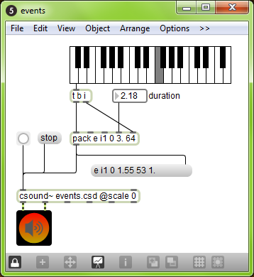

# 09 B. CSOUND IN MAXMSP

Csound can be embedded in a [Max](http://cycling74.com/products/max/)
patch using the _csound~_ object. This allows you to synthesize and
process audio, MIDI, or control data with Csound.

_Note: Most of the descriptions below have been written years ago by Davis Pyon. They may be outdated and will need to be updated._

## Installing

The _csound~_ requires an installation of Csound.
The external can be downloaded on [Csound's download page](https://csound.com/download.html) (under _Other_).

## Creating a _csound~_ Patch

1.  Create the following patch:

    

2.  Save as _helloworld.maxpat_ and close it.
3.  Create a text file called _helloworld.csd_ within the same folder
    as your patch.
4.  Add the following to the text file:\

#### **_EXAMPLE 09B01_maxcs_helloworld.csd _**

```csound
<CsoundSynthesizer>
<CsInstruments>
;Example by Davis Pyon
sr     = 44100
ksmps  = 32
nchnls = 2
0dbfs  = 1

instr 1
aNoise noise .1, 0
       outch 1, aNoise, 2, aNoise
endin

</CsInstruments>
<CsScore>
f0 86400
i1 0 86400
e
</CsScore>
</CsoundSynthesizer>
```

5.  Open the patch, press the bang button, then press the speaker icon.

At this point, you should hear some noise. Congratulations! You created
your first _csound~_ patch.

You may be wondering why we had to save, close, and reopen the patch.
This is needed in order for _csound~_ to find the csd file. In effect,
saving and opening the patch allows _csound~_ to "know" where the patch
is. Using this information, _csound~_ can then find csd files specified
using a relative pathname (e.g. _helloworld.csd_). Keep in mind that
this is only necessary for newly created patches that have not been
saved yet. By the way, had we specified an absolute pathname (e.g.
_C:/Mystuff/helloworld.csd_), the process of saving and reopening
would have been unnecessary.

The _@scale 0_ argument tells _csound~_ not to scale audio data
between Max and Csound. By default, _csound~_ will scale audio to match
0dB levels. Max uses a 0dB level equal to one, while Csound uses a 0dB
level equal to 32768. Using _@scale 0_ and adding the statement
_0dbfs = 1_ within the csd file allows you to work with a 0dB level equal to one everywhere.
This is highly recommended.

## Audio I/O

All _csound~_ inlets accept an audio signal and some outlets send an
audio signal. The number of audio outlets is determined by the arguments
to the _csound~_ object. Here are four ways to specify the number of
inlets and outlets:

- \[csound\~ \@io 3\]
- \[csound\~ \@i 4 \@o 7\]
- \[csound\~ 3\]
- \[csound\~ 4 7\]

_@io 3_ creates 3 audio inlets and 3 audio outlets. _@i 4 @o 7_
creates 4 audio inlets and 7 audio outlets. The third and fourth lines
accomplish the same thing as the first two. If you don't specify the
number of audio inlets or outlets, then _csound~_ will have two audio
inlets and two audio oulets. By the way, audio outlets always appear to
the left of non-audio outlets. Let's create a patch called
_audio_io.maxpat_ that demonstrates audio i/o:


Here is the corresponding text file (let's call it _audio_io.csd_):

#### **_EXAMPLE 09B02_maxcs_audio_io.csd _**

```csound
<CsoundSynthesizer>
<CsInstruments>
sr     = 44100
ksmps  = 32
nchnls = 3
0dbfs  = 1

instr 1
aTri1 inch 1
aTri2 inch 2
aTri3 inch 3
aMix  = (aTri1 + aTri2 + aTri3) * .2
      outch 1, aMix, 2, aMix
endin

</CsInstruments>
<CsScore>
f0 86400
i1 0 86400
e
</CsScore>
</CsoundSynthesizer>
;example by Davis Pyon
```

In _audio_io.maxpat_, we are mixing three triangle waves into a stereo
pair of outlets. In _audio_io.csd_, we use
[inch](https://csound.com/docs/manual/inch.html) and
[outch](https://csound.com/docs/manual/outch.html) to receive
and send audio from and to _csound~_. _inch_ and _outch_ both use a
numbering system that starts with one (the left-most inlet or outlet).

Notice the statement _nchnls = 3_ in
the orchestra header. This tells the Csound compiler to create three
audio input channels and three audio output channels. Naturally, this
means that our _csound~_ object should have no more than three audio
inlets or outlets.

## Control Messages

Control messages allow you to send numbers to Csound. It is the primary
way to control Csound parameters at i-rate or k-rate. To control a-rate
(audio) parameters, you must use and audio inlet. Here are two examples:

- control frequency 2000
- c resonance .8

Notice that you can use either _control_ or _c_ to indicate a
control message. The second argument specifies the name of the channel
you want to control and the third argument specifies the value.

The following patch and Csound file demonstrates control messages:


#### **_EXAMPLE 09B03_maxcs_control_in.csd _**

```csound
<CsoundSynthesizer>
<CsInstruments>
sr     = 44100
ksmps  = 32
nchnls = 2
0dbfs  = 1

giSine ftgen 1, 0, 16384, 10, 1 ; Generate a sine wave table.

instr 1
kPitch chnget "pitch"
kMod   invalue "mod"
aFM    foscil .2, cpsmidinn(kPitch), 2, kMod, 1.5, giSine
       outch 1, aFM, 2, aFM
endin
</CsInstruments>
<CsScore>
f0 86400
i1 0 86400
e
</CsScore>
</CsoundSynthesizer>
;example by Davis Pyon
```

In the patch, notice that we use two different methods to construct
control messages. The _pak_ method is a little faster than the message
box method, but do whatever looks best to you. You may be wondering how
we can send messages to an audio inlet (remember, all inlets are audio
inlets). Don't worry about it. In fact, we can send a message to any
inlet and it will work.

In the Csound file, notice that we use two different opcodes to receive
the values sent in the control messages:
[chnget](https://csound.com/docs/manual/chnget.html) and
[invalue](https://csound.com/docs/manual/invalue.html).
_chnget_ is more versatile (it works at i-rate and k-rate,
and it accepts strings) and is a tiny bit faster than _invalue_.
On the other hand, the limited nature
of _invalue_ (only works at k-rate, never requires
any declarations in the header section of the orchestra) may be easier for newcomers to Csound.

## MIDI

_csound~_ accepts raw MIDI numbers in its first inlet. This allows you
to create Csound instrument instances with MIDI notes and also control
parameters using MIDI Control Change. _csound~_ accepts all types of MIDI
messages, except for: sysex, time code, and sync. Let's look at a patch
and text file that uses MIDI:


#### **_EXAMPLE 09B04_maxcs_midi.csd _**

```csound
<CsoundSynthesizer>
<CsInstruments>
sr     = 44100
ksmps  = 32
nchnls = 2
0dbfs  = 1

massign 0, 0 ; Disable default MIDI assignments.
massign 1, 1 ; Assign MIDI channel 1 to instr 1.

giSine ftgen 1, 0, 16384, 10, 1 ; Generate a sine wave table.

instr 1
iPitch cpsmidi
kMod   midic7 1, 0, 10
aFM    foscil .2, iPitch, 2, kMod, 1.5, giSine
       outch 1, aFM, 2, aFM
endin
</CsInstruments>
<CsScore>
</CsScore>
</CsoundSynthesizer>
;example by Davis Pyon
```

In the patch, notice how we're using _midiformat_ to format note and
control change lists into raw MIDI bytes. The _1_ argument for
midiformat specifies that all MIDI messages will be on channel one.

In the Csound file, notice the [massign](https://csound.com/docs/manual/massign.html)
statements in the header of the orchestra.
_massign 0, 0_ tells Csound to clear all mappings between
MIDI channels and Csound instrument numbers.
This is highly recommended because forgetting to add this statement
may cause confusion somewhere down the road.
The next statement _massign 1,1_ tells Csound to map MIDI channel one to instrument one.

To get the MIDI pitch, we use the opcode [cpsmidi](https://csound.com/docs/manual/cpsmidi.html).
To get the FM modulation factor,
we use [midic7](https://csound.com/docs/manual/midic7.html) in order to
read the last known value of MIDI CC number one (mapped to the range
\[0,10\]).^[Csound's MIDI options and opcodes are described in detail in
section 7 of this manual.]

Notice that in the score section of the Csound file,
we no longer have the statement _i1 0 86400_ as we had in earlier examples.
The score section is left empty here, so that instrument 1 is compiled but not activated.
Activation is done via MIDI here.

## Events

To send Csound events (i.e. score statements),
use the _event_ or _e_ message.
You can send any type of event that Csound understands.
The following patch and text file demonstrates how to send events:



#### **_EXAMPLE 09B05_maxcs_events.csd _**

```csound
<CsoundSynthesizer>
<CsInstruments>
sr     = 44100
ksmps  = 32
nchnls = 2
0dbfs  = 1

instr 1
  iDur = p3
  iCps = cpsmidinn(p4)
 iMeth = 1
       print iDur, iCps, iMeth
aPluck pluck .2, iCps, iCps, 0, iMeth
       outch 1, aPluck, 2, aPluck
endin
</CsInstruments>
<CsScore>
</CsScore>
</CsoundSynthesizer>
;example by Davis Pyon
```

In the patch, notice how the arguments to the _pack_ object are declared.
The _i1_ statement tells Csound that we want to create an instance of
instrument one. There is no space between _i_ and _1_ because pack
considers _i_ as a special symbol signifying an integer. The next
number specifies the start time. Here, we use _0_ because we want the
event to start right now. The duration _3._ is specified as a floating
point number so that we can have non-integer durations. Finally, the
number _64_ determines the MIDI pitch. You might be wondering why the
_pack_ object output is being sent to a message box. This is good practice
as it will reveal any mistakes you made in constructing an event
message.

In the Csound file, we access the event parameters using p-statements. We
never access _p1_ (instrument number) or _p2_ (start time) because
they are not important within the context of our instrument.
Although _p3_ (duration) is not used for anything here, it is often used to
create audio envelopes.
Finally, _p4_ (MIDI pitch) is converted to cycles-per-second.
The [print](https://csound.com/docs/manual/print.html) statement is
there so that we can verify the parameter values.
