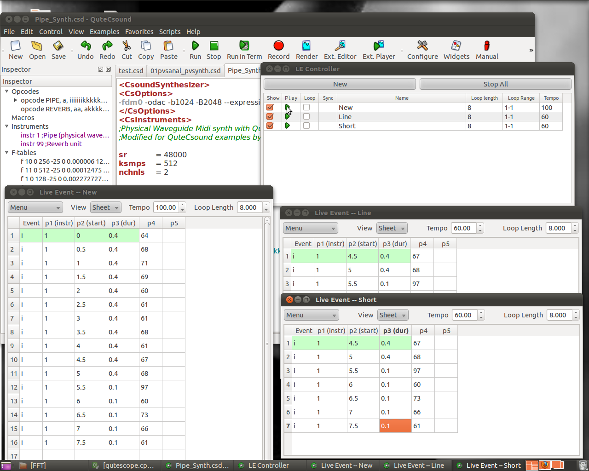
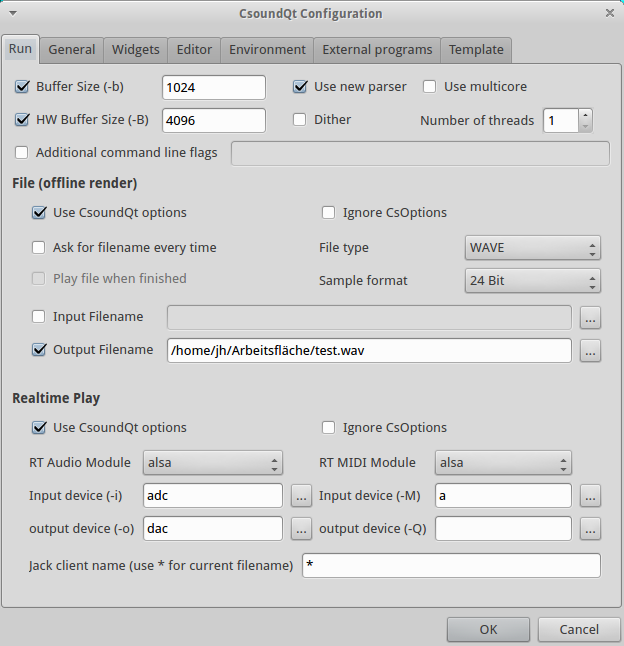
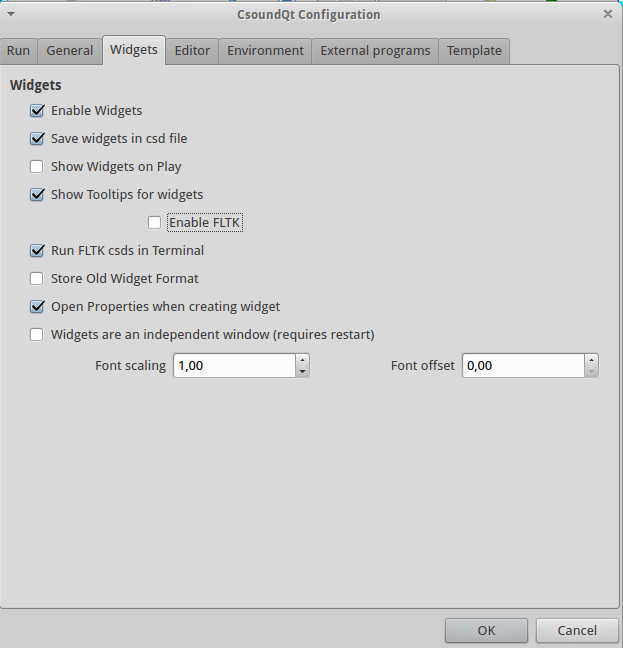
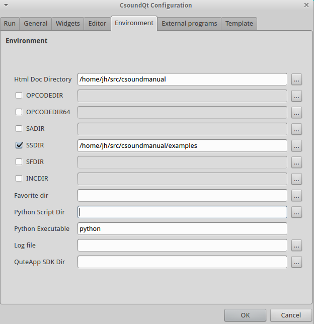

10 A. CSOUNDQT
==============

CsoundQt is a free, cross-platform graphical frontend to Csound. It
features syntax highlighting, code completion and a graphical widget
editor for realtime control of Csound. It comes with many useful code
examples, from basic tutorials to complex synthesizers and pieces
written in Csound. It also features an integrated Csound language help
display.

CsoundQt (named QuteCsound until automn 2011) can be used as a code
editor tailored for Csound, as it facilitates running and rendering
Csound files without the need of typing on the command line using the
Run and Render buttons.

::: {.group_img}
::: {.image}
{width="600" height="371"}
:::
:::

In the widget editor panel, you can create a variety of widgets to
control Csound. To link the value from a widget, you first need to set
its channel, and then use the Csound opcodes invalue or chnget. To send
values to widgets, e.g. for data display, you need to use the outvalue
or chnset opcode.

::: {.group_img}
::: {.image}
{width="600" height="466"}
:::
:::

\
CsoundQt also now implements the use of HTML and JavaScript code
embedded in the optional \<html\> element of the CSD file. If this
element is detected, CsoundQt will parse it out as a Web page, compile
it, and display it in the \'HTML5 Gui\' window. HTML code in this window
can control Csound via a selected part of the Csound API that is exposed
in JavaScript. This can be used to define custom user interfaces,
display video and 3D graphics, generate Csound scores, and much more.
See Chapter 12, Section H, *Csound and Html* for more information.

CsoundQt also offers convenient facilities for score editing in a
spreadsheet like environment which can be transformed using Python
scripting (see also chapter 12C).

::: {.group_img}
::: {.image}
{width="600" height="479"}
:::
:::

You will find more detailed information and video tutorials in the
CsoundQt home page at <http://qutecsound.sourceforge.net>.

### Configuring CsoundQt 

CsoundQt gives easy access to the most important [Csound
options](http://www.csounds.com/manual/html/CommandFlags.html) and to
many specific CsoundQt settings via its Configuration Panel. In
particular the \'Run\' tab offers many choices which have to be
understood and set carefully.

The current version of CsoundQt\'s configuration settings should be
found at <http://qutecsound.sourceforge.net/pages/documentation.html.>
So the following descriptions may be outdated.

To open the configuration panel simply push the \'Configure\' button.
The configuration panel comprises 7 tabs. The available configurable
parameters in each tab are described below for each tab.

#### Run

::: {.group_img}
::: {.image}
{width="500" height="517"}
:::
:::

The settings at the top of the "Run" tab allow the user to define the
command-line flags with which Csound is invoked.

**Buffer Size (-b)**

> This defines the software buffer size (corresponding with the -b
> flag).\
> If you do not tick, CsoundQt will use the defaults.^1^ \
> If you tick to enter an own value, these are some hints:\
>
> -   Always use power-of-two values.
> -   Usually the [ksmps](http://www.csounds.com/manual/html/ksmps.html)
>     block size is 1/4 or 1/2 of the software buffer size. If you use
>     live input and output, it is most effective to set the software
>     buffer size to an integer multiple of *ksmps* (\"full duplex
>     audio\").
> -   Use smaller values (e.g. 128) for live performance (in particular
>     with live input), as it will reduce the latency. Use larger values
>     (e.g. 1024) for other cases, for instance playing sound files.

**HW Buffer Size (-B)**

> This defines the hardware buffer size (corresponding with the -B
> flag).\
> If you do not tick, CsoundQt will use the defaults.^2^ \
> If you tick to enter an own value, these are some hints:\
>
> -   Always use a multiple integer of the software buffer size. A
>     common relation is: Hardware Buffer Size = 4 \* Software Buffer
>     Size.
> -   The relation between software buffer size and hardware buffer size
>     depends on the audio module.^3^

**Use new parser**

> Tick this if you use Csound 5.14 or higher. This option has been
> introduced during the transition between the old and the new parser,
> and will disappear in future.

**Use multicore /Number of threads**

> This option is only available when the new parser is enabled, and
> corresponds with the -j flag. For instance, '-j 2' will tell Csound to
> use 2 parallel processors when possible.\
> You should use this option with care. It may be also worth to state
> that using multiple threads will not in each case improve the
> performance. Whether it does or not depends on the structure of the
> csd file you run.

**Dither**

> Switches on dithering (the \--dither flag) for the conversion of audio
> from the internal resolution (now mostly 64 bit double precision
> float) to the output sample format (see below).

**Additional command line flags**

> This enables the user to add any additional
> [options](http://www.csounds.com/manual/html/CommandFlags.html) not
> listed here. Only use if you know what you are doing!

##### File (offline render)

These options determine CsoundQt\'s behaviour if you render to file (by
pushing the *Render* button or selecting the menu item Control -\>
Render to file).

**Use CsoundQt options**

> Tick this to activate the CsoundQT options configured here.

 

**Ignore CsOptions**

> Use this to ignore the option embedded in the \<CsOptions\> section of
> the csd files you are rendering. \
> NOTE that care must be taken to avoid inconsistencies between
> CsOptions and CsoundQt options. For beginners, it is recommended to
> tick \"Ignore CsOptions\" when the CsoundQT options are enabled. If
> you are a more experienced user, you can leave this unchecked to allow
> some additional options like -m128 to reduce Csound\'s printout. \
> NOTE that if you have checked \"Use CsoundQt options\" and have *not*
> checked \"Ignore CsOptions\", in the case of a conflict between both
> the CsoundQt options set in the configure panel will have the
> priority.\

 **Ask for filename every time**

> Ask for a filename to render the performance to.

 **File type / Sample format**

> Use this to set the output file format.

 **Input Filename**

> Corresponds with the -i flag (Input soundfile name).

 **Output Filename**

> Corresponds with the -o flag for defining the output file name to
> which the sound is written. 

##### Realtime Play

These options determine CsoundQt\'s behaviour if you push the *Run*
button (or select the menu item Control -\> Run Csound).

**Use CsoundQt options**

> Tick this to activate the CsoundQT options configured here.

**Ignore CsOptions**

> Use this to ignore the option embedded in the \<CsOptions\> section of
> the csd files you are running. \
> NOTE that care must be taken to avoid inconsistencies between
> CsOptions and CsoundQt options. For beginners, it is recommended to
> disable CsOptions when the CsoundQT options are enabled. If you are a
> more experienced user, you can leave this unchecked to allow some
> additional options like -m128 to reduce Csound\'s printout. \
> NOTE that if you have checked \"Use CsoundQt options\" and have *not*
> checked \"Ignore CsOptions\", in the case of a conflict between both
> the CsoundQt options set in the configure panel will have the
> priority.\

**RT Audio Module**

> This option is very much dependent on your operating system.\
> In case you experience crashes or have problems with the real time
> performance, it is worth to try another module. \
> The most common choices on the different operating systems are
> probably:\
>
> -   For Linux, use alsa or jack.
> -   For OSX, use coreaudio or portaudio.
> -   For Windows, use portaudio.

**Input device**

> This option selects the device you are using for real-time input, for
> instance from a microphone. (Note that you must have ticked \"Use
> CsoundQt options\" if you want Csound to use your selection.)\
> The usual (and most stable) choice here is *adc*. In this case Csound
> will use the device which has been selected as standard by your
> operating system. \
> If you want to use another device instead, click on the button at the
> right side. You will find a list of available devices and can choose
> one of them.

**Output device**

> This option selects the device you are using for real-time output.
> (Note that you must have ticked \"Use CsoundQt options\" if you want
> Csound to use your selection.) \
> The usual (and most stable) choice here is *dac*. In this case Csound
> will use the device which has been selected as standard by your
> operating system. \
> If you want to use another device instead, click on the button at the
> right side. You will find a list of available devices and can choose
> one of them.

**RT MIDI Module**

> This option is very much dependent on your operating system.\
> In case you experience problems with MIDI, it is worth to try another
> module. In case you do not use any MIDI at all, select *none* to get
> rid of one possible source of trouble.\
> The most common choices on the different operating systems are
> probably:\
>
> -   For Linux, use alsa or portmidi.
> -   For OSX, use coremidi^4^ or portmidi.
> -   For Windows, use portmidi.

**Input device**

> This option selects the device you are using for real-time MIDI input.
> (Note that you must have ticked \"Use CsoundQt options\" if you want
> Csound to use your selection.)\
> The usual choice here is *a*. In this case Csound will use all MIDI
> devices. \
> In case your RT MIDI Module does not support this option, click on the
> button at the right side. You will find a list of available devices
> and can choose one of them.

**Output device**

> This option selects the device you are using for real-time MIDI
> output. (Note that you must have ticked \"Use CsoundQt options\" if
> you want Csound to use your selection.) \

**Jack client nam****e**

> This option specifies the name for communicating with a Jack audio
> client. The default \'\*\' means \'all\' clients. \

#### **General**

::: {.group_img}
::: {.image}
{width="500" height="519"}
:::
:::

##### Run Utilities using:

This should be self-explanatory and is only meaningful if you run any of
the Csound Utilities like
[sndinfo](http://www.csounds.com/manual/html/UtilityQueries.html) or the
FFT analysis tool
[pvanal](http://www.csounds.com/manual/html/pvanal.html).

##### Interface language

Self-explanatory.

##### Performance tweaks

These are very important options in case you use CsoundQt for real-time
usage and experience performance problems.

**No messages to consoles**

> Tick this to disable any printout.\

 

**Disable recording and scopes**

> This refers to CsoundQt\'s internal Record facility and to the Scope
> widget. \

**Disable realtime score events**

> If you check this, you will not be able to send any live score event,
> for instance from a Button widget or the Live Event Sheet.\

**Disable python callback**

> If you do not use CsoundQt\'s internal Python scripting facility in
> real-time, you should check this to improve the overall performance. \

##### Internal MIDI interface

The \"Internal MIDI interface\" is the MIDI device from which MIDI
control messages are sent directly to the CsoundQt widgets. Have a look,
for instance, in the properties of a Slider widget to see the MIDI CC
number and the MIDI Channel to be specified.       \
Note that this does *not* set the input MIDI device for Csound itself
(which has be explained above in Run -\> RT MIDI Module -\> Input
device).

##### Record sample format

Defines the bit depth of the audio file to which CsoundQt records its
real-time output, when using the Record button (or the \'record\' option
from the Control menu). For most cases 32bit float or 24bit formats are
recommended. The former is particularly useful as it can hold 'clipped'
sample values, which can be later normalised.

##### Console

You can choose here how the Csound output console looks like.

**Control message buffer size**

> If you do not not want to prevent CsoundQt from printing anything to
> the console at all (see above) but want to reduce this output for
> performance\'s sake, you can set here a limit. \

 

There are some mixed options at the bottom of this tab:

**Allow key repeats for sensekey**

> If you press a key on your computer for a long time, the key is
> repeated. This may or may not be useful for the
> [sensekey](http://www.csounds.com/manual/html/sensekey.html) opcode
> and can be decided here. \

**Debug mode for Live Event Sheet**

> Self-explanatory. \

**Allow simultaneous play**

> If checked, it allows you to play more than one csd tab
> simultansously. \

**Theme**

> Allows you to choose between the traditional (\"fun\") CsoundQt look,
> and a more serious (\"boring\") one. \

**Widgets**

::: {.group_img}
::: {.image}
{width="500" height="520"}
:::
:::

**Enable Widgets**

> If not checked, you cannot use any of CsoundQt\'s widgets. \

**Save Widgets in csd file**

> Each csd file has a section for widgets and presets. These sections
> are hidden when you open your csd file in CsoundQt, but are visible in
> any text editor. So if you do not have checked this option, you will
> not see any of your widgets the next time you open your csd. So, only
> useful if you want to export a csd without the widget tags. \

**Show Widgets on play**

> If checked, the widget panel will pop up each time you push the Play
> button. \

**Show tooltips for widgets**

> Enables a useful feature which lets you see the channel name of a
> widget if you stay a moment on it with the computer mouse. \

**Enable FLTK**

> [F](http://www.csounds.com/manual/html/ControlFltkIntro.html)[LTK](http://www.csounds.com/manual/html/ControlFltkIntro.html)
> means a built-in (and somehow outdated) method of using widgets in
> Csound. As these widgets could conflict with CsoundQt\'s own widgets,
> you will usually uncheck this.\

**Run FLTK csds in Terminal**

> This lets you execute csd files which contain FLTK widgets without
> conflicting with CsoundQt.\

**Store Old Widget Format**

> CsoundQt started in using the file format for widgets from Matt
> Ingall\'s \'Mac Csound\' for the sake of compatibility. Later it
> decided to use an own format; mainly for the build-in presets
> facility. When you check this option, CsoundQt will save the old Mac
> Csound widgets format in addition to the new proper CsoundQt widget
> format. \

**Open properties when creating widgets**

> Usually you will this have ticked, to enter your channel name and
> other properties when you create a widget. \

**Widgets are an independent window**

> CsoundQt consists of many subwindows except the main Editor panel: the
> Console, the Help (Manual), the Inspector, and so on. If you check
> this option, the widget panel will not be considered as one of them,
> but as independent window. This means that you cannot dock it by
> double-clicking on the top, like all the other subwindows, but it may
> have advantages anyhow, depending on your operating system and your
> configuration. \

**Font scaling / Font offset**

> Affects the way the fonts are shown for instance in a Label widget. \

**Editor**

::: {.group_img}
::: {.image}
{width="500" height="517"}  
:::
:::

Only one option needs some explanation:

**Autoplay files when launched from file**

> If ticked, a csd file will play immediately when opened. \

#### **Environment**

::: {.group_img}
::: {.image}
{width="500" height="515"} 
:::
:::

There are some important settings here, along with some only for
developers. We will focus on the options which can be important for all
users.

**Html Doc directory**

> This refers to the folder containing the Canonical Csound Manual. If
> you choose View -\> Help Panel, and see nothing but a message like
> \"not found!\", you will have to set here the directory for the
> manual. Click on the browse button on the right side, and choose the
> folder where it is on your computer.^5^  \

**SADIR** (Sound Analysis Directory)

> You can set here the directory in which Csound will seek for analysis
> files like .pvx files. \

**SSDIR** (Sound Sample Directory)

> This is very useful to set a folder for sound samples, for instance
> used by [diskin](http://www.csounds.com/manual/html/diskin.html). You
> can then refer to the sample only by name. \

**SFDIR** (Sound File Directory)

> To specify a directory for output files. This is usually be done in
> the \'Run\' tab, as explained above (Output Filename). \

**INCDIR** (Include Directory)

> Specifies a directory for files which all called by the
> [\#include](http://www.csounds.com/manual/html/include.html)
> statement. \

**Favorite dir**

> Specifies a directory which will then appear under the menu as
> \'Favorites\'. \

**Python script dir**

> Usually you will leave this empty so that CsoundQt links to the Python
> Scripts it comes with. Only specify if you build CsoundQt or want to
> change the scipts folder. \

#### **External Programs**

::: {.group_img}
::: {.image}
{width="500" height="522"} 
:::
:::

Should be self-explanatory. \'Dot\' is the executable from
[www.graphviz.org.](http://www.graphviz.org) It is used in CsoundQt for
the Code Graph Viewer (View -\> View Code Graph). 

 

#### **Template**

This tab is useful as it allows the user to define a default template
for new CSDs. Something like this can be a great timesaver:

::: {.group_img}
::: {.image}
{width="500" height="521"}
:::
:::

 

1.  [According to the relevant manual page, the defaults are 256 for
    Linux, 1024 for OSX and 4096 for
    Windows.]{#endnote-ecda606c-5669-4e9b-90e4-a345530f6c05}
2.  [According to the manual, 1024 for Linux, 4096 for OSX and 16384 for
    Windows.]{#endnote-e91c947c-aa88-4fdf-b1fe-40633ec3201e}
3.  [In the explanation of Victor Lazzarini (mail to Joachim Heintz, 19
    march 2013): \"1. For portaudio, -B is only used to suggest a
    latency to the backend, whereas -b is used to set the actual
    buffersize. 2. For coreaudio, -B is used as the size of the internal
    circular buffer, and -b is used for the actual IO buffer size. 3.
    For jack, -B is used to determine the number of buffers used in
    conjunction with -b , num = (N + M + 1) / M. -b is the size of each
    buffer. 4. For alsa, -B is the size of the buffer size, -b is the
    period size (a buffer is divided into periods). 5. For pulse, -b is
    the actual buffersize passed to the device, -B is not used. In other
    words, -B is not too significant in 1), not used in 5), but has a
    part to play in 2), 3) and 4), which is functionally
    similar.\"]{#endnote-018b55c0-8b98-4c44-8546-3dd4390aed1e}
4.  [This options is only available in CsoundQt 0.7.3 or higher. For
    older versions, you must use the command line flag
    -+rtmidi=coremidi.]{#endnote-4d38f845-03ac-433a-9ad9-ce1bbfd7793d}
5.  [Or download the manual, if necessary, from sourceforge (currently
    http://sourceforge.net/projects/csound/files/csound5/csound5.19/manual/).]{#endnote-dfc088d4-687a-4a23-a493-502ec5d696c6}
