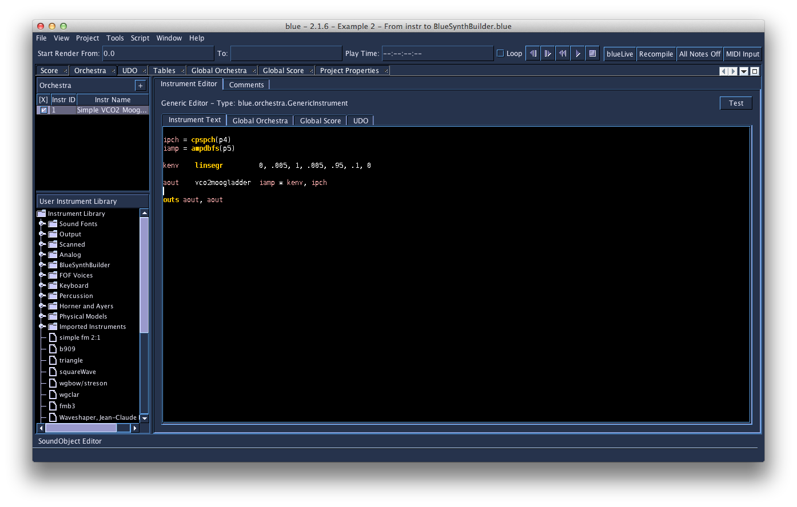
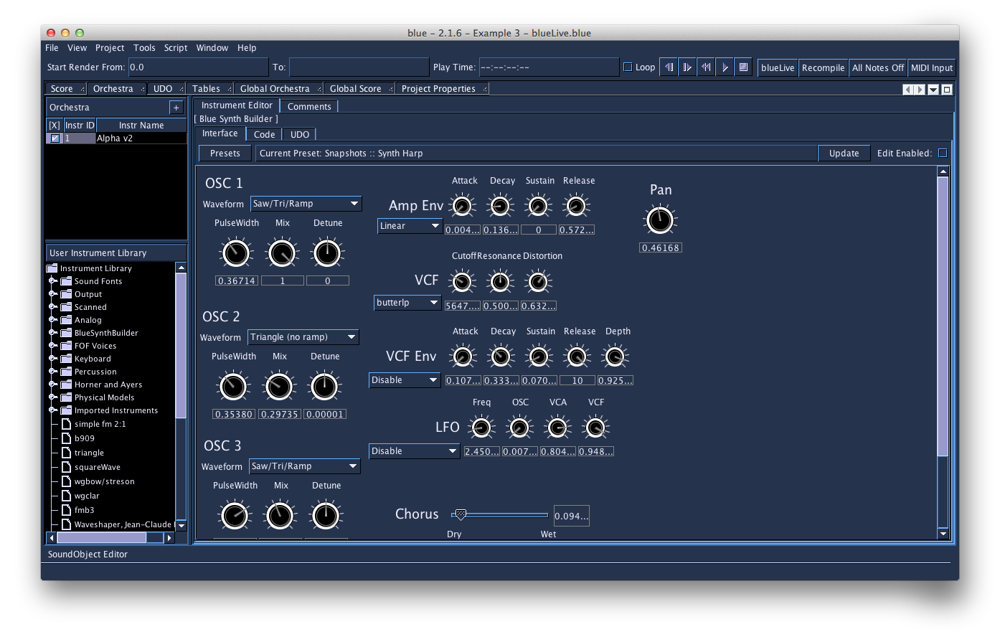
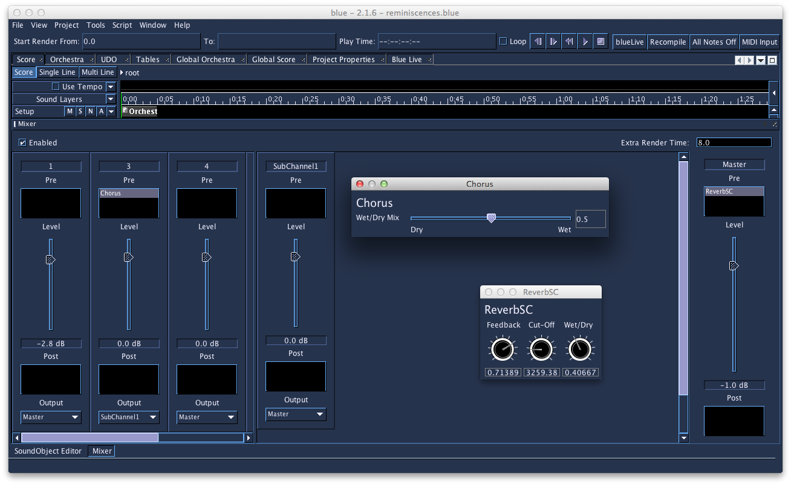

10 C. BLUE
==========

General Overview 
-----------------

**Blue** is a graphical computer music environment for composition, a
versatile front-end to Csound. It is written in **Java**,
platform-independent, and uses **Csound** as its audio engine. It
provides higher level abstractions such as a graphical timeline for
composition, GUI-based instruments, score generating SoundObjects like
PianoRolls, python scripting, Cmask, Jmask and more.  It is available
for free (donation appreciated) at:\
http://blue.kunstmusik.com\
 

Organization of tabs and windows
--------------------------------

Blue organizes all tasks that may arise while working with Csound within
a single environment. Each task, be it score generation, instrument
design, or composition is done in its own window. All the different
windows are organized in tabs so that you can flip through easily and
access them quickly.\
In several places you will find lists and trees: All of your instruments
used in a composition are numbered, named and listed in the
Orchestra-window.\
You will find the same for UDOs (User Defined Opcodes).\
From this list you may export or import Instruments and UDOs from a
library to the piece and vice versa. You may also bind several UDOs to a
particular Instrument and export this instrument along with the UDOs it
needs.\
  

### Editor

Blue holds several windows where you can enter code in an editor-like
window. The editor-like windows are found for example in the
Orchestra-window, the window to enter global score or the Tables-window
to collect all the functions. There you may type in, import or paste
text-based information. It gets displayed with syntax highlighting of
Csound code.\
 

::: {.group_img}
::: {.image}

:::
:::

 Image: The Orchestra-window

 

### The Score timeline as a graphical representation of the composition

The Score timeline allows for visual organization of all the used
**SoundObjects** in a composition.\
In the Score-window, which is the main graphical window that represents
the composition, you may arrange the composition by arranging the
various SoundObjects in the timeline. A SoundObject is an object that
holds or even generates a certain amount of score-events. SoundObjects
are the building blocks within blue\'s score timeline. SoundObjects can
be lists of notes, algorithmic generators, python script code, Csound
instrument definitions, PianoRolls, Pattern Editors, Tracker interfaces,
and more. These SoundObjects may be text based or GUI-based as well,
depending on their facilities and purposes.

 

::: {.group_img}
::: {.image}

:::
:::

\
Image: The timeline holding several Sound Objects. One SoundObject is
selected and opened in the SoundObject-Editor-window

 

SoundObjects 
-------------

To enable every kind of music production style and thus every kind of
electronic music, blue holds a set of different SoundObjects.
SoundObjects in blue can represent many things, whether it is a single
sound, a melody, a rhythm, a phrase, a section involving phrases and
multiple lines, a gesture, or anything else that is a perceived sound
idea.\
Just as there are many ways to think about music, each with their own
model for describing sound and vocabulary for explaining music, there
are a number of different SoundObjects in blue. Each SoundObject in blue
is useful for different purposes, with some being more appropriate for
expressing certain musical ideas than others. For example, using a
scripting object like the PythonObject or RhinoObject would serve a user
who is trying to express a musical idea that may require an algorithmic
basis, while the PianoRoll would be useful for those interested in
notating melodic and harmonic ideas. The variety of different
SoundObjects allows for users to choose what tool will be the most
appropriate to express their musical ideas.\
Since there are many ways to express musical ideas, to fully allow the
range of expression that Csound offers, blue\'s SoundObjects are capable
of generating different things that Csound will use. Although most often
they are used for generating Csound SCO text, SoundObjects may also
generate ftables, instruments, user-defined opcodes, and everything else
that would be needed to express a musical idea in Csound.\
 

### Means of modification of a SoundObject

First, you may set the start time and duration of every SoundObject \"by
hand\" by typing in precise numbers or drag it more intuitively back and
fourth on the timeline. This modifies and the position in time of a
SoundObject, while stretching it modifies the outer boundaries of it and
may even change the density of events it generates inside.\
If you want to enter information into a SoundObject, you can open and
edit it in a SoundObject editor-window.\
But there is also a way to modify the "output" of a SoundObject, without
having to change its content. The way to do this is using
**NoteProcessors**.\
By using NoteProcessors, several operations may be applied onto the
parameters of a SoundObject. NoteProcessors allow for modifying the
SoundObjects score results, i.e. adding 2 to all p4 values, multiplying
all p5 values by 6, etc. These NoteProcessors can be chained together to
manipulate and modify objects to achieve things like transposition,
serial processing of scores, and more.\
Finally the SoundObjects may be grouped together and organized in
larger-scale hierarchy by combining them to **PolyObjects**.\
Polyobject are objects, which hold other SoundObjects, and have
timelines in themselves. Working within them on their timelines and
outside of them on the parent timeline helps organize and understand the
concepts of objective time and relative time between different objects.\
 

Instruments with a graphical interface
--------------------------------------

Instruments and effects with a graphical interface may help to increase
musical workflow. Among the instruments with a graphical user interface
there are BlueSynthBuilder (BSB)-Instruments, BlueEffects and the blue
Mixer.\
 

### BlueSynthBuilder (BSB)-Instruments

The BlueSynthBuilder (BSB)-Instruments and the BlueEffects work like
conventional Csound instruments, but there is an additional opportunity
to add and design a GUI that may contain sliders, knobs, textfields,
pull-down menus and more. You may convert any conventional Csound
Instrument automatically to a BSB-Instrument and then add and design a
GUI.\

::: {.group_img}
::: {.image}

:::
:::

\
Image: The interface of a BSB-Instrument.\
 

### blue Mixer

Blue\'s graphical mixer system allows signals generated by instruments
to be mixed together and further processed by Blue Effects. The GUI
follows a paradigm commonly found in music sequencers and digital audio
workstations.\
The mixer UI is divided into channels, sub-channels, and the master
channel. Each channel has a fader for applying level adjustments to the
channel\'s signal, as well as bins pre- and post-fader for adding
effects. Effects can be created on the mixer, or added from the Effects
Library.\
Users can modify the values of widgets by manipulating them in
real-time, but they can also draw automation curves to compose value
changes over time.

::: {.group_img}
::: {.image}

:::
:::

Image: The BlueMixer

 

Automation
----------

For **BSB-Instruments**, **blueMixer** and **blueEffects** it is
possible to use Lines and Graphs within the score timeline to enter and
edit parameters via a line. In Blue, most widgets in BlueSynthBuilder
and Effects can have automation enabled. Faders in the Mixer can also be
automated.\
Editing automation is done in the Score timeline. This is done by first
selecting a parameter for automation from the SoundLayer\'s "A"
button\'s popup menu, then selecting the Single Line mode in the Score
for editing individual line values.\
Using Multi-Line mode in the score allows the user to select blocks of
SoundObjects and automations and move them as a whole to other parts of
the Score.\
Thus the parameters of these instruments with a GUI may be automatized
and controlled via an editable graph in the Score-window.\
 

Libraries
---------

blue features also **libraries for instruments**, **SoundObjects**,
**UDO**s, **Effects** (for the blueMixer) and the **CodeRepository**for
code snippets. All these libraries are organized as lists or trees.
Items of the library may be imported to the current composition or
exported from it to be used later in other pieces.

The SoundObject library allows for instantiating multiple copies of a
SoundObject, which allows for editing the original object and updating
all copies. If NoteProcessors are applied to the instances in the
composition representing the general structure of the composition you
may edit the content of a SoundObject in the library while the structure
of the composition remains unchanged. That way you may work on a
SoundObject while all the occurrences in the composition of that very
SoundObject are updated automatically according the changes done in the
library.\
The Orchestra manager organizes instruments and functions as an
instrument librarian.\
There is also an Effects Library and a Library for the UDOs\
 

Other Features
--------------

\-   **blueLive** - work with SoundObjects in realtime to experiment
with musical ideas or performance.\
-   **SoundObject freezing** - frees up CPU cycles by pre-rendering
SoundObjects\
-   **Microtonal support**using scales defined in the Scala scale
format, including a microtonal PianoRoll, Tracker, NoteProcessors, and
more.

 
