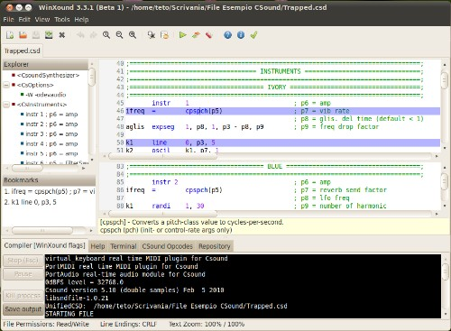

10 D. WINXOUND
==============

WinXound is a free and open-source Front-End GUI Editor for CSound 6,
CSoundAV, CSoundAC, with Python and Lua support, developed by Stefano Bonetti.
It runs on Microsoft Windows, Apple Mac OsX and Linux.
WinXound is optimized to work with the CSound 6 compiler.

See [WinXound's Website](https://mnt.conts.it/winxound) for more information.

