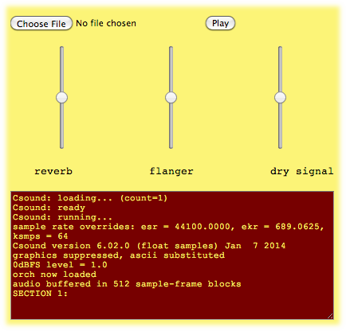

WEB BASED CSOUND
================

Using Csound via UDP with the \--port Option
--------------------------------------------

The \--port=N option allows users to send orchestras to be compiled
on-the-fly by Csound via UDP connection. This way, Csound can be started
with no instruments, and will listen to messages sent to it. Many
programs are capable of sending UDP messages, and scripting languages,
such as Python, can also be used for this purpose. The simplest way of
trying out this option is via the netcat program, which can be used in
the terminal via the nc command.

Let\'s explore this as an example of the \--port option. First, Csound
is started with the following command:

    $ csound -odac --port=1234

Alternatively, if using a frontend such as CsoundQT, it is possible run
an empty CSD, with the \--port in its CsOptions field:

    <CsoundSynthesizer>
    <CsOptions>
    --port=1234
    </CsOptions>
    <CsInstruments>
    </CsInstruments>
    <CsScore>
    </CsScore>
    </CsoundSynthesizer>

This will start Csound in a daemon mode, waiting for any UDP messages in
port 1234. Now with netcat, orchestra code can be sent to Csound. A
basic option is to use it interactively in the terminal, with a
heredocument command (\<\<) to indicate the end of the orchestra we are
sending:

    $ nc -u 127.0.0.1 1234 << EOF
    > instr 1
    > a1 oscili p4*0dbfs,p5
    > out a1
    > endin
    > schedule 1,0,1,0.5,440
    > EOF

Csound will respond with a 440Hz sinewave. The ctl-c key combination can
be used to close nc and go back to the shell prompt. Alternatively, we
could write our orchestra code to a file and then send it to Csound via\
the following command (orch is the name of our file):

    $ nc -u 127.0.0.1 1234 < orch

Csound performance can be stopped in the usual way via ctl-c in the
terminal, or through the dedicated\
transport controls in a frontend. We can also close the server it via a
special UDP message:

    ERROR WITH MACRO close

However, this will not close Csound, but just stop the UDP server.

\

pNaCl - Csound for Portable Native Client
-----------------------------------------

Native Client (NaCl) is a sandboxing technology developed by Google that
allows C/C++ modules to extend the support provided by HTML5. Portable
Native Client (pNaCl) is one of the toolchains in the NaCl SDK (the
others are newlib and glibc). The advantage of pNaCl over the other
options is that it only requires a single module to be built for all
supported architectures.

The other major advantage is that pNaCl is, as of Google Chrome 31,
enabled by default in the browser. This means that users just need to
load a page containing the pNaCl application and it will work. pNaCl
modules are compiled to llvm bytecode that is translated to a native
binary by the browser. To check whether your version of Chrome supports
pNaCl, use the following address: 

    chrome://nacl

The pNaCl Csound implementation allows users to embed the system in web
pages. With a minimal use of Javascript, it is possible to create
applications and frontends for Csound, to be run inside a web browser
(Chrome, Chromium). 

A binary package for pNaCl-Csound can be found in the Csound releases
[http://sourceforge.net/projects/csound/files/csound6](http://sourceforge.net/projects/csound/files/csound6)

Running the example application\

NaCl pages need to be served over http, which means they will not work
when opened as local files. For this you will need a http server. A
minimal one, written in Python, can be found in the NaCl SDK
[https://developer.chrome.com/native-client/sdk/download](https://developer.chrome.com/native-client/sdk/download). 

### Csound pNaCl module reference

The interface to Csound is found in the csound.js javascript file.
Csound is ready on module load, and can accept control messages from
then on. 

#### Control functions

The following control functions can be used to interact with Csound:

-   **csound.Play()** - starts performance
-   **csound.PlayCsd(s)** - starts performance from a CSD file s, which
    can be in ./http/ (ORIGIN server) or ./local/ (local sandbox).
-   **csound.RenderCsd(s)** - renders a CSD file s, which can be in
    ./http/ (ORIGIN server) or ./local/ (local sandbox), with no RT
    audio output. The "finished render" message is issued on completion.
-   **csound.Pause()** - pauses performance
-   **csound.StartAudioInput()** - switches on audio input (available in
    Chrome version 36 onwards)
-   **csound.CompileOrc(s)** - compiles the Csound code in the string s
-   **csound.ReadScore(s)** - reads the score in the string s (with
    preprocessing support)
-   **csound.Event(s)** - sends in the line events contained in the
    string s (no preprocessing)
-   **csound.SetChannel(name, value)** - sends the control channel name
    the value value.
-   **csound.SetStringChannel(name, string)** - sends the string channel
    name the string string.
-   **csound.SetTable(num, pos, value)** - sets the table name at index
    pos the value value.
-   **csound.RequestTable(num)** - requests the table data for table
    num. The "Table::Complete" message is issued on completion.
-   **csound.GetTableData()** - returns the most recently requested
    table data as an ArrayObject.
-   **MIDIin(byte1, byte2, byte3)** - sends a MIDI in message to Csound.
-   **NoteOn(channel,number,velocity)** - sends a Note ON message to
    Csound.
-   **NoteOff(channel,number,velocity)** - sends a Note OFF message to
    Csound.
-   **PolyAftertouch(channel,number,aftertouch)** - sends a polyphonic
    aftertouch message to Csound.
-   **ControlChange(channel,control,amount)** - sends a control change
    message to Csound.
-   **ProgramChange(channel,control)** - sends a program change message
    to Csound.
-   **Aftertouch(channel,amount)** - sends a mono aftertouch message to
    Csound.
-   **PitchBend(channel,fine,coarse)** - sends a pitchbend message to
    Csound

#### Filesystem functions 

In order to facilitate access to files, the following filesystem
functions can be used: 

-   **csound.CopyToLocal(src, dest)** - copies the file src in the
    ORIGIN directory to the local file dest, which can be accessed at
    ./local/dest. The "Complete" message is issued on completion.
-   **csound.CopyUrlToLocal(url,dest)** - copies the url url to the
    local file dest, which can be accessed at ./local/dest. Currently
    only ORIGIN and CORS urls are allowed remotely, but local files can
    also be passed if encoded as urls with the
    webkitURL.createObjectURL() javascript method. The "Complete"
    message is issued on completion.
-   **csound.RequestFileFromLocal(src)** - requests the data from the
    local file src. The "Complete" message is issued on completion.
-   **csound.GetFileData()** - returns the most recently requested file
    data as an ArrayObject.\

#### Callbacks

The csound.js module will call the following window functions when it
starts:

-   **function moduleDidLoad()**: this is called as soon as the module
    is loaded
-   **function handleMessage(message)**: called when there are messages
    from Csound (pnacl module). The string message.data contains the
    message.
-   **function attachListeners()**: this is called when listeners for
    different events are to be attached.\

You should implement these functions in your HTML page script, in order
to use the Csound javascript interface. In addition to the above, Csound
javascript module messages are always sent to the HTML element with
id='console', which is normally of type \<div\> or \<textarea\>. 

### Example

Here is a minimal HTML example showing the use of Csound.

    <!DOCTYPE html>
    <html>
    <!--
     Csound pnacl minimal example
     Copyright (C) 2013 V Lazzarini
    -->
    <head>
     <title>Minimal Csound Example</title>
     
     
    </head>
    <body>
      

       <h3 id="tit"> </h3>
      

      

      <!--pNaCl csound module-->
      

    </body>
    </html>

### Limitations

The following limitations apply:

-   MIDI is implemented so that Csound MIDI opcodes can be used. MIDI
    hardware interface needs to be provided in Javascript by another
    library (e.g. WebMIDI).
-   no plugins, as pNaCl does not support dlopen() and friends. This
    means some opcodes are not available as they reside in plugin
    libraries. It might be possible to add some of these opcodes
    statically to the Csound pNaCl library in the future.\

More information on Csound for pNaCl can be found
<http://vlazzarini.github.io/>.

::: {.group_img}
::: {.image}

:::
:::

 

libcsound.js - Csound as a Javascript Library {#csoundemscripten-a-javascript-library-for-csound-on-the-web}
---------------------------------------------

### Introduction

### The javascript build of Csound allows any standards compliant web browser to run an instance of Csound in a web page without the need for plugins or add ons. This is made possible by using [Emscripten](http://Emscripten.org), a program that can convert software written in C (such as Csound) into Javascript, allowing it to be run natively within any web browser that supports modern web standards. {#introduction}

### Caveats

The javascript build of Csound is currently in early stages of
development and therefore there are a number of caveats and limitations
with its current implementation which should be noted.

-   Emscripten generates a highly optimisable subset of Javascript
    called [*asm.js*](http://asmjs.org). This allows Javascript engines
    which have been optimised for this subset to achieve substantial
    performance increases over other Javascript engines. At this time
    the only Javascript engine that supports asm.js optimisations is the
    Spider Monkey engine which is part of Firefox. Therefore the
    Emscripten build of Csound will perform best on the current version
    of Firefox.

-   At this time, due to the design of the Web Audio API, the Csound
    javascript library can only execute within the main thread of a web
    page. This means that it must pause execution of any performance
    when any other process that uses the main thread (such as the UI)
    needs to execute. This can cause dropouts and/or glitching of the
    audio during a performance.

-   As this project is in its infancy, there are a minimal number of
    routines implemented so far in order to instantiate, compile and
    perform a .csd file. Additional routines will be added over time as
    the project matures.

### Getting libcsound.js {#getting-csoundemscripten}

The javascript build of Csound now comes as part of the regular
distribution of the Csound source code. It can be found in the
*emscripten* folder which also contains a markdown file that gives the
instructions on how to compile the javascript library. 

### Using libcsound.js {#using-csoundemscripten}

In order to demonstrate how to use the Csound javascript library, what
follows is a tutorial which shows the steps necessary to create a simple
website that can open .csd files, compile them, and play them back from
the browser.

#### Create a simple website

First create a new folder for the website and copy the libcsound.js and
libcsound.js.mem  files from the emscripten/dist directory into the new
websites directory. Next, create an index.html file at the top level of
the new websites directory that contains the following minimal html
code:

    <html>
    <head>
    <meta http-equiv="content-type" content="text/html; charset=utf-8">
    </head>
    <body>
    </body>
    </html>

#### Instantiate Csound

We need to write some Javascript to create an instance of CsoundObj, so
within the body tags ad new script tags and insert the following code:

    <html>
    <head>
    <meta http-equiv="content-type" content="text/html; charset=utf-8">
    </head>
    <body>
    
    
    </body>
    </html>

The *Module* functions within this code are related to how emscripten
built javascript libraries execute when a webpage is loaded. The
*noExitRuntime* variable sets whether the emscripten runtime environment
is exited once the main function has finished executing. The
*\_main* variable is actually a function that is executed as soon as the
webpage has finished loading. Csound itself is instantiated using a
constructor for the *CsoundObj* object. This object provides all the
methods for directly interacting with the current running instance of
csound.

The Javascript console of the web browser should now show some messages
that give the version number of Csound, the build date and the version
of libsndfile being used by Csound.

 **Upload .csd file to Javascript File System**

In order to run a .csd file from the Csound javascript library, we first
need to upload the file from the local file system to the javascript
virtual file system. In the emscripten/examples directory there is the
*FileManager.js* file that provides an object which greatly simplifies
the process of uploading files to the virtual file system. Copy
*FileManager.js* to the root directory of the web page.

    <html>
    <head>
    <meta http-equiv="content-type" content="text/html; charset=utf-8">
    </head>
    <body>
    
    
    
    </body>
    </html>

As can be seen in the code above, the file manager is instantiated with
two arguments. The first argument is an array of strings which tells the
file manager instance which file extensions that are permitted to be
uploaded. The second argument is the function with which the file manger
will print error messages, in this case it will print to the javascript
console. The file managers upload method also takes two arguments. The
first argument is the files path relative to the website root directory
and the second is the function to execute when the file has been
successfully uploaded. In this case when the file has been uploaded
csound will compile the .csd file.

If the web page is reloaded now, the file *test.csd* will be uploaded to
the javascript file system and csound will compile it making it ready
for performance.

### **Running Csound **

Once the .csd file has been compiled csound can execute a performance.
In the following code we will create an html button and add some code to
the button so that when pressed it will run a performance of csound. 

    <html>
    <head>
    <meta http-equiv="content-type" content="text/html; charset=utf-8">
    </head>
    <body>
    
    
    
    </body>
    </html>

Here we can see that the button *startButton* is instantiated using the
*document.createElement* method. The buttons label is set using the
*innerHTML* method, and we can set the buttons action by defining a
function and assigning it to the buttons *onclick* method. The function
simply calls the *start* method from *CsoundObj.* The button is then
added to the DOM using *document.body.appendChild*. 

If the page is reloaded there should now be a button present that is
labelled with the text \"Start Csound\". When the button is pressed
csound should perform the .csd file which was uploaded to the javascript
file system. 

#### CsoundObj.js Reference {#implement-file-upload-facility}

***CsoundObj.compileCSD(fileName)***

This method takes as its argument the address of a CSD file *fileName*
and compiles it for performance. The CSD file must be present in
Emscripten\'s javascript virtual filesystem.

------------------------------------------------------------------------

***CsoundObj.disableAudioInput()***

This method disables audio input to the web browser. Audio input will
not be available to the running Csound instance

------------------------------------------------------------------------

***CsoundObj.enableAudioInput()***

This method enables audio input to the web browser. When called, it
triggers a permissions dialogue in the host web browser requesting
permission to allow audio input. If permission is granted, audio input
is available for the running Csound instance. 

------------------------------------------------------------------------

***CsoundObj.enableMidiInput()***

This method enables Midi input to the web browser. When activated on
supported browsers (currently only Chrome supports web midi) it is
possible for the running instance of Csound to receive midi messages
from a compatible input device.

------------------------------------------------------------------------

***CsoundObj.evaluateCode()***

This method takes a string of Csound orchestra code and evaluates it on
the fly. Any instruments contained in the code will be created and added
to the running Csound process.

------------------------------------------------------------------------

***CsoundObj.readScore()***

This method takes a string of Csound score code and evaluates it.

------------------------------------------------------------------------

***CsoundObj.render()***

This method renders the currently compiled .csd file as quickly as
possible. This method is currently only used to evaluate the performance
of libcsound.js and is of no practical use to end users.

------------------------------------------------------------------------

***CsoundObj.reset()***

This method resets the currently running instance of Csound. This method
should be called before a new .csd file needs to be read and compiled
for performance.

------------------------------------------------------------------------

***CsoundObj.setControlChannel()***

This method sets a named Csound control channel to a specified value.

------------------------------------------------------------------------

***CsoundObj.setControlChannel()***

This method gets the current value of a named Csound control channel. 

------------------------------------------------------------------------

***CsoundObj.start()***

This method starts a performance of a compiled .csd file.
