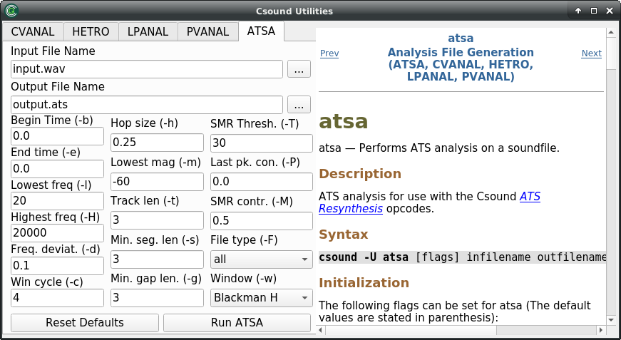
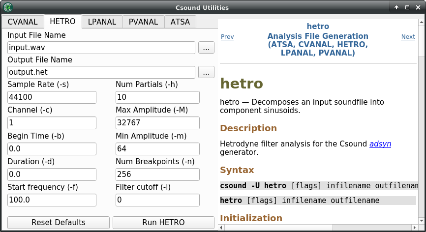
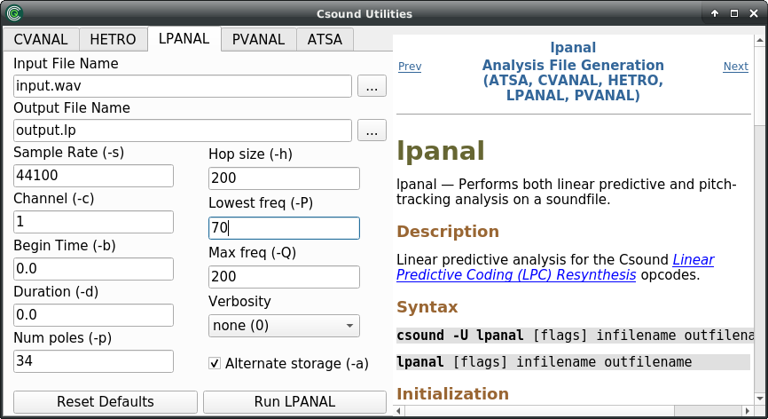
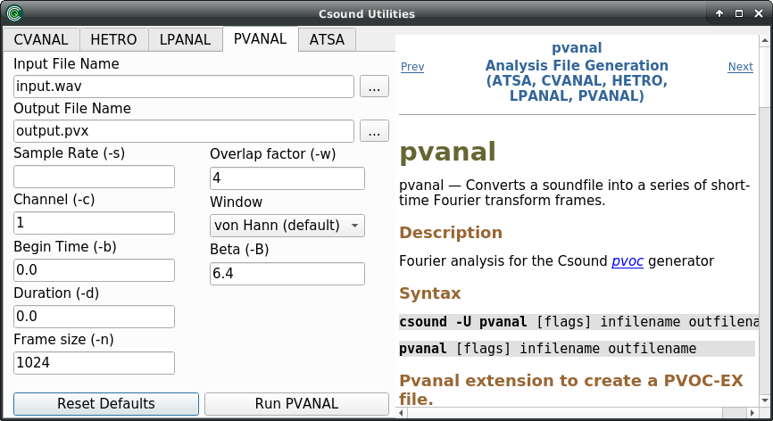

11 A. ANALYSIS
==============

Csound comes bundled with a variety of additional utility applications.
These are small programs that perform a single function, very often with
a sound file, that might be useful just before or just after working
with the main Csound program. Originally these were programs that were
run from the command line but many of Csound front-ends now offer direct
access to many of these utilities through their own utilities menus. It
is useful to still have access to these programs via the command line
though, if all else fails.

The standard syntax for using these programs from the command line is to
type the name of the utility followed optionally by one or more command
line flags which control various performance options of the program —
all of these will have useable defaults anyway — and finally the name of
the sound file upon which the utility will operate.

    utility_name [flag(s)] [file_name(s)]

If we require some help or information about a utility and don't want
to be bothered hunting through the Csound Manual we can just type the
the utility's name with no additional arguments, hit enter and the
commmand line response will give us some information about that utility
and what command line flags it offers. We can also run the utility
through Csound — perhaps useful if there are problems running the
utility directly — by calling Csound with the *-U* flag. The *-U* flag will
instruct Csound to run the utility and to interpret subsequent flags as
those of the utility and not its own.

    Csound -U utility_name [flag(s)] [file_name(s)]

Analysis Utilities
------------------

Although many of Csound's opcodes already operate upon commonly
encountered sound file formats such as *wav* and *aiff*, a number of
them require sound information in more specialised and pre-analysed
formats, and for this Csound provides the sound analysis utilities
[atsa](https://csound.com/docs/manual/UtilityAtsa.html),
[cvanal](https://csound.com/docs/manual/cvanal.html),
[hetro](https://csound.com/docs/manual/hetro.html),
[lpanal](https://csound.com/docs/manual/lpanal.html) and
[pvanal](https://csound.com/docs/manual/pvanal.html).

We will explain in the following paragraphs the background and usage of these five different sound analysis utilities. 

### atsa

Chapter [05 K](05-k-ats-resynthesis.md) gives some background about the *Analysis-Transformation-Synthesis* (ATS) method of spectral resynthesis. It requires the preceding analysis of a sound file. This is the job of the *atsa* utility.

The basic usage is simple:

    atsa [flags] infilename outfilename

where *infilename* is the sound file to be analyzed, and *outfilename* is the *.ats* file which is written as result of the *atsa* utility.

It can be said that the default values of the various *flags* are reasonable for a first usage. For a refinement of the analysis the [atsa manual page](https://csound.com/docs/manual/UtilityAtsa.html) provides all necessary information.

### cvanal

The *cvanal* utility analyses an impulse response for usage in the old [concolve](https://csound.com/docs/manual/convolve.html) opcode. Nowadays, convolution in Csound is mostly done with other opcodes which are described in the [Convolution](05-h-convolution.md) chapter of this book. More information about the *cvanal* utility can be found [here](https://csound.com/docs/manual/cvanal.html) in the Csound Manual.

### hetro

The hetrodyne filter analysis can be understood as one way of applying the Fourier Transform.[^1] Its attempt is to reconstruct a number of partial tracks in a time-breakpoint manner. The breakpoints are measured in milliseconds. 
Although this utility is originally designed for the usage in the [adsyn](https://csound.com/docs/manual/adsyn.html) opcode, it can be used to get data from any harmonic sound for additive synthesis. 

[^1]: Cf. Curtis Roads, The Computer Music Tutorial, Cambridge MA: MIT Press 1996, 548-549;
James Beauchamp, Analysis, Synthesis and Perception of Musical Sounds, New York:Springer 2007, 5-12

The usage of *hetro* follows the general utility standard:

    hetro [flags] infilename outfilename

But the adjustment of some *flags* is crucial here depending on the desired usage of the analysis:

- **-f** *begfreq*: This is the estimated frequency of the fundamental. The default is 100 Hz, but it should be adjusted as good as possible to the real fundamental frequency of the input sound.  
- **-h** *partials*: This is the number of partials the utility will analyze and write in the output file. The default number of 10 is quite low and will usually result in a dull sound in the resynthesis.  
- **-n** *brkpts*: This is the number of breakpoints for the analysis. These breakpoints are initially evenly spread over the duration, and then reduced and adjusted by the algorithm. The default number of 256 is reasonable for most usage, but can be massively reduced for some sounds and usages.  
- **-m** *minamp*: The *hetro* utility uses the old Csound amplitude convention where 0 dB is set to 32767. This has to be considered in this option, in which a minimal amplitude is set. Below this amplitude a partial is considered dormant. So the default 64 corresponds to -54 dB; other common values are 128 (-48 dB), 32 (-60 dB) or 0 (no thresholding).
 
As an example, we start the utility with these parameters:

This is the output of the analysis in the Csound console:

~~~
util hetro:
audio sr = 44100, monaural
opening WAV infile resources/SourceMaterials/BratscheMono.wav
analysing 359837 sample frames (8.2 secs)
analyzing harmonic #0
freq estimate  220.0, max found  220.0, rel amp 1039228.8
analyzing harmonic #1
freq estimate  440.0, max found  443.5, rel amp 358754.9
analyzing harmonic #2
freq estimate  660.0, max found  660.0, rel amp 329786.0
analyzing harmonic #3
freq estimate  880.0, max found  880.0, rel amp 253682.2
analyzing harmonic #4
freq estimate 1100.0, max found 1147.5, rel amp 188708.2
analyzing harmonic #5
freq estimate 1320.0, max found 1320.0, rel amp 51153.9
analyzing harmonic #6
freq estimate 1540.0, max found 1564.8, rel amp 52575.5
analyzing harmonic #7
freq estimate 1760.0, max found 1760.0, rel amp 149709.0
analyzing harmonic #8
freq estimate 1980.0, max found 1980.0, rel amp 162766.8
analyzing harmonic #9
freq estimate 2200.0, max found 2200.0, rel amp 71892.1
scale = 0.013184
harmonic #0:	amp points 10, 	frq points 10,	peakamp 13701
harmonic #1:	amp points 10, 	frq points 10,	peakamp 4730
harmonic #2:	amp points 10, 	frq points 10,	peakamp 4348
harmonic #3:	amp points 10, 	frq points 10,	peakamp 3344
harmonic #4:	amp points 9, 	frq points 9,	peakamp 2488
harmonic #5:	amp points 10, 	frq points 10,	peakamp 674
harmonic #6:	amp points 9, 	frq points 9,	peakamp 693
harmonic #7:	amp points 10, 	frq points 10,	peakamp 1974
harmonic #8:	amp points 9, 	frq points 9,	peakamp 2146
harmonic #9:	amp points 9, 	frq points 9,	peakamp 948
wrote 848 bytes to resources/SourceMaterials/BratscheMono.het
~~~

The file *BratscheMono.het* starts with `HETRO 10` as first line, showing that 10 partial track data will follow. The amplitude data lines begin with -1, the frequency data lines begin with -2.  This is start and end of the first two lines, slightly formatted to show the breakpoints:

~~~
-1, 0,0,   815,3409, 1631,11614, 2447,12857, ... , 7343,0,   32767
-2, 0,220, 815,217,  1631,218,   2447,219, ...   , 7343,217, 32767
~~~

After the starting -1 or -2, the time-value pairs are written. Here we have at 0 ms an amplitude of 0 and a frequency of 220. At 815 ms we have amplitude of 3409 and frequency of 217. At 7343 ms, near the end of this file, we have amplitude of 0 and frequency of 217, followed in both cases by 32767 (as additional line ending signifier).

### lpanal

Linear Prediction Coding has been developed for the analysis and resynthesis of speech.[^2] 
The [lpanal](https://csound.com/docs/manual/lpanal.html) utility performs the analysis, which will then be used by the [LPC Resynthesis Opcodes](https://csound.com/docs/manual/SpectralLpcresyn.html). The defaults can be seen in the following screenshot:

[^2]: Cf. Curtis Roads, The Computer Music Tutorial, Cambridge MA: MIT Press 1996, 200-210

It should be mentioned that in 2020 Victor Lazzarini wrote a bunch of opcodes which apply real-time (streaming) linear prediction analysis. The complement of the old lpanal utility is the [lpcanal](https://csound.com/docs/manual/lpcanal.html) opcode.

### pvanal

The [pvanal](https://csound.com/docs/manual/pvanal.html) utility performs a Short-Time Fourier Transform over a sound file. It will produce a *.pvx* file which can be used by the old *pv*-opcodes. Nowadays the *pvs*-opcodes are mostly in use; see chapter [05 I](05-i-fourier-analysis-spectral-processing.md) of this book. Nevertheless, the *pvanal* utility provides a simple option to perform FFT and write the result in a file.

The main parameter are few; the defaults can be seen here:

The binary data of a *.pvx* file can be converted in a text file via the [pvlook](https://csound.com/docs/manual/pvlook.html) utility.
