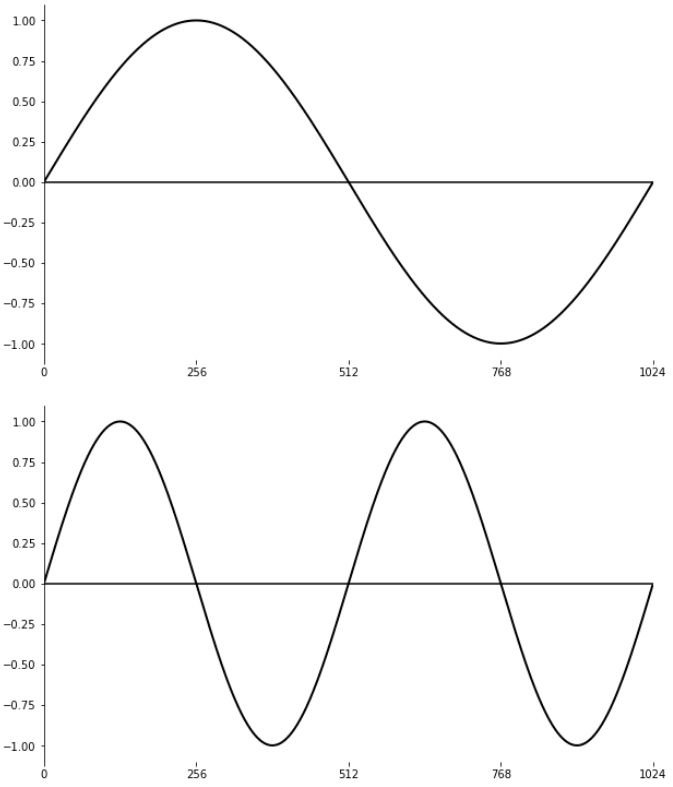
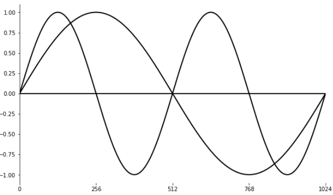
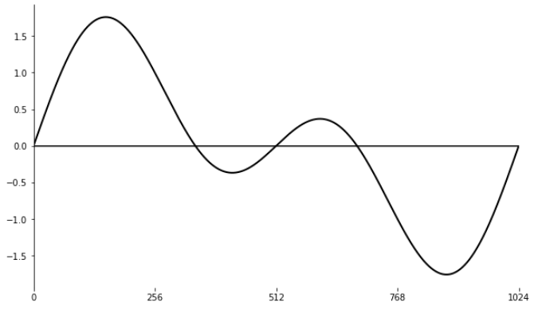

12 B. PYTHON AND CSOUND
=======================

The connection between Csound and Python has a long history. Already in 2002 Maurizio Umberto Puxeddu contributed the [Python Opcodes](https://csound.com/docs/manual/py.html) which allowed the execution of Python code inside Csound. Because of Csound's confession to keep backwards compatibility, this possibility to run **Python inside Csound** will stay as long as the Python code can be executed. 

With the Csound API however, which has been explained in the 
[previous chapter](12-a-the-csound-api.md), a more flexible and versatile communication between Python and Csound can be established. Now it is **Csound** which runs **inside Python**. This Csound Python API was first generated by [SWIG](http://swig.org/) from the Csound's C API. This version was called *csnd6.py*. In 2015, François Pinot wrote a new version of the Csound Python API. It is based on Python's [ctypes](https://docs.python.org/3/library/ctypes.html) from which its name [ctcsound](https://github.com/csound/ctcsound) (as ctypes csound) originates. This version is better adopted to native Python code and has some useful additional features, as the integration into [Jupyter Notebooks](https://jupyter.org/) and the new implementation of Andrés Cabrera's *iCsound*.

We will describe in the first part of this chapter some features of using Csound inside Python via *ctcsound*. In the second part we will describe some use cases of the old Python Opcodes in Csound. The possibility to use Python in the score section of a *.csd* file is described in [chapter 14 A](14-a-methods-of-writing-csound-scores.md).

Csound in Python using ctcsound
-------------------------------

We will focus here on some examples of using *ctcsound* in the Jupyter Notebooks. More can be found in ctcsound's [repository](https://github.com/csound/ctcsound).

### Installing

#### Install ctcsound.py

The file *ctcsound.py* is distributed with the Csound installer. This version must be used, to avoid incompatibilities between the installed Csound version and the *ctcsound* version. In case it cannot be found, it can be installed from the [Csound sources](https://github.com/csound/csound/blob/master/interfaces/ctcsound.py).

To make the *ctcsound.py* working in Python, it must be copied to a directory which Python uses to load external libraries. This folder is usually called *site-packages*. In case there are more than one versions of Python on your computer, make sure you copy to the one which you use to launch the Juypter Notebooks. On OSX, for instance, when using Anaconda Python, copy *ctcsound.py* from */Library/Frameworks/CsoundLib64.framework/Versions/6.0/Resources/Python/Current* to *anaconda3/lib/python3.X/site-packages*.

Once this is done, open a Jupyter Notebook and type

    import ctcsound

to see if the installation was successful.

#### Install csoundmagics

The *csoundmagics* offer some nice features to work with *ctcsound* in the Jupyter Notebooks, including syntax highlighting. They also contain the *iCsound* class. To install the *csoundmagics*, the files at <https://github.com/csound/ctcsound> should be downloaded first. They contain the *cookbook* with a lot of Jupyter Notebook files. The files to be installed can be found in the [csoundmagics](https://github.com/csound/ctcsound/tree/master/cookbook/csoundmagics) foldes in the *cookbook* directory. A description how to install can be found in the [fifth](https://github.com/csound/ctcsound/blob/master/cookbook/05-installingCsoundmagics.ipynb) example of the *cookbook*.

Once this is done, open a Jupyter Notebook and type

    %load_ext csoundmagics

to see if the installation was successful.

### iCsound

The *iCsound* class is loaded as part of *ctcsound* with the same command we just used to check the installation:

~~~python
%load_ext csoundmagics
~~~

After this command has loaded all the libraries, we create an instance of *iCsound*:

~~~python
cs = ICsound()
~~~

Usually we will get the message: `Csound engine started at slot#: 1.` Now we can write some simple code and send it to this instance of Csound:

~~~python
orc = """
instr 1
 aOut poscil .2, 400
 out aOut, aOut
endin
"""
cs.sendCode(orc)
cs.sendScore('i 1 0 -1')
~~~

Csound runs now and plays a sine tone. To turn off the instrument and delete this instance of iCsound, we use:

~~~python
cs.sendScore('i -1 0 1')
del cs
~~~

### Some features

As a short survey of some *csoundmagics* and *iCsound* features, we start again with loading the library and creating an instance:

~~~python
%load_ext csoundmagics
cs = ICsound()
~~~

Now we can use the `%%csound` magics to communicate directly with the running csound instance:

~~~python
%%csound
iSine1 ftgen 1, 0, 1024, 10, 1
iSine2 ftgen 2, 0, 1024, 10, 0, 1
~~~

The `plotTable()` method displays now both tables by an internal call to the matplotlib:

~~~python
cs.plotTable(1)
cs.plotTable(2)
~~~

If we want to see both tables in the same plot, we use the option `reuse=True`:

~~~python
cs.plotTable(1)
cs.plotTable(2,reuse=True)
~~~

Now we add both tables and display the result:

~~~python
both = cs.table(1) + cs.table(2)
cs.fillTable(3,both)
cs.plotTable(3)
~~~

### Building GUI with PySimpleGUI

It is fairly easy to build an own GUI in this way. We use [PySimpleGUI](https://github.com/PySimpleGUI) here. After installing, it can be loaded into Python with `import PySimpleGUI as sg`.

Generally spoken, a GUI can have two functions. It can control Csound, for instance start/stop Csound, browse files or change control values. The second function is to use a GUI to display Csound values. We will give one simple example for each case.

#### GUI controls Csound

This is a code which creates a GUI which lets the user browse an audio file, start and stop playback in a loop, with a volume slider, and deletes the Csound instance when closing. Comments are below.

~~~python
import PySimpleGUI as sg
%load_ext csoundmagics
cs = ICsound()

orc = """
instr 1
 Sfile chnget "file" 
 kVol chnget "vol"
 aSound[] diskin Sfile, 1, 0, 1
 kFadeOut linenr 1, .01, 1, .01
 out aSound[0]*kFadeOut*ampdb(kVol), aSound[1]*kFadeOut*ampdb(kVol)
endin
"""
cs.sendCode(orc)

layout = [
    [sg.Text('Select File, then Start/Stop')],
    [sg.FileBrowse(key='FILE', enable_events=True), 
     sg.Button('Start'), 
     sg.Button('Stop')],
    [sg.Slider(key='VOL',
               range=(-20,6),
               default_value=0,
               orientation='h',
               enable_events=True)]]

window = sg.Window('GUI -> Csound', layout)

while True:
    event, values = window.read()
    if event is None:
        cs.sendScore('i -1 0 1')
        del cs
        break
    cs.setStringChannel('file',values['FILE'])
    cs.setControlChannel('vol',values['VOL'])
    if event is 'Start':
        cs.sendScore('i 1 0 -1')
    if event is 'Stop':
        cs.sendScore('i -1 0 1')

window.close()
~~~

In the first section, we see the usual way to load the modules, create a Csound instance and send an instrument to it. The *layout* section defines the widgets which will be present in the GUI. The `key` parameter is particularly important here, as this is the way a widget can be identified. 

The interaction between the GUI and Csound happens in the `while` loop. Here we send the values of the browse button and the slider to Csound:

    cs.setStringChannel('file',values['FILE'])
    cs.setControlChannel('vol',values['VOL'])

Also we start and stop the Csound instrument when the Start/Stop buttons are pressed:

    if event is 'Start':
        cs.sendScore('i 1 0 -1')
    if event is 'Stop':
        cs.sendScore('i -1 0 1')

And finally, if the window is being closed, we turn off the instrument, delete the Csound instance and leave the while-loop:

    if event is None:
        cs.sendScore('i -1 0 1')
        del cs
        break

#### GUI displays Csound values

In the previous example, Csound received values from the GUI via `chnget`, and the Python code sent these values via `setStringChannel` and `setControlChannel`. Considering now the other way round, we find `chnset` on the Csound side, and `channel` on the Python side. The following code shows a moving line in Csound which is displayed by a slider and a text box.

~~~python
import PySimpleGUI as sg
%load_ext csoundmagics
cs = ICsound()
orc = """
seed 0
instr 1
 kLine randomi -1,1,1,3
 chnset kLine, "line"
endin
"""
cs.sendCode(orc)
cs.sendScore('i 1 0 -1')

layout = [[sg.Slider(range=(-1,1),
                     orientation='h',
                     key='LINE',
                     resolution=.01)],
          [sg.Text(size=(6,1),
                   key='LINET',
                   text_color='black',
                   background_color='white',
                   justification = 'right',
                   font=('Courier',16,'bold'))]
         ]

window = sg.Window('Csound -> GUI',layout)

while True:
    event, values = window.read(timeout=100)
    if event is None:
        cs.sendScore('i -1 0 1')
        del cs
        break
    window['LINE'].update(cs.channel('line')[0])
    window['LINET'].update('%+.3f' % cs.channel('line')[0])
window.close()
~~~

Python in Csound using the Python Opcodes
-----------------------------------------

The second part of this chapter, discussing the old Python opcodes in Csound, is based on Andrés Cabrera's article *Using Python inside Csound, An introduction to the Python opcodes*.[^1] 
All examples below are to be executed in a Terminal. If using CsoundQt, choose *Run in Term* instead of *Run*. It should be noted that all examples here are using Python 2. There is a [plugin](https://github.com/csound/plugins) to port the Python opcodes to Python 3. There is also an [example](https://github.com/csound/plugins/blob/master/py/examples/embeddedCtcsound.csd) how to embed *ctcsound* in the Python opcodes.

[^1]: Csound Journal Issue 6, Spring 2007:
      <http://csoundjournal.com/issue6/pythonOpcodes.html>

### Starting the Python Interpreter and Running Python Code at i-Time: *pyinit* and *pyruni*

To use the Python opcodes inside Csound, you must first start the Python
interpreter. This is done using the
[pyinit](https://csound.com/docs/manual/pyinit.html)
opcode. The *pyinit* opcode must be put in the header before any other
Python opcode is used, otherwise, since the interpreter is not running,
all Python opcodes will return an error. You can run any Python code by
placing it within quotes as argument to the opcode
[pyruni](https://csound.com/docs/manual/pyruni.html).
This opcode executes the Python code at init time[^2] and can be put in the
header. The example below shows a simple csd file which prints the text
"Hello Csound world!" to the terminal.

[^2]: See chapter [03 A](03-a-initialization-and-performance-pass.md) for more
      about init- and k-time in Csound.

***EXAMPLE 12B01_pyinit.csd***

~~~csound
<CsoundSynthesizer>
<CsOptions>
-ndm0
</CsOptions>
<CsInstruments>

;start python interpreter
pyinit

;run python code at init-time
pyruni "print '*********************'"
pyruni "print '*Hello Csound world!*'"
pyruni "print '*********************'"

</CsInstruments>
<CsScore>
e 0
</CsScore>
</CsoundSynthesizer>
;Example by Andrés Cabrera and Joachim Heintz
~~~

### Python Variables are usually Global

The Python interpreter maintains its state for the length of the Csound
run. This means that any variables declared will be available on all
calls to the Python interpreter. In other words, they are global. The
code below shows variables 'c' and 'd' being calculated both in the
header (c) and in instrument 2 (d), and that they are available
in all instruments (here printed out in instrument 1 and 3). A
multi-line string can be written in Csound with the {{\...}} delimiters.
This can be useful for longer Python code snippets.

***EXAMPLE 12B02_python_global.csd***

~~~csound
 <CsoundSynthesizer>
<CsOptions>
-ndm0
</CsOptions>
<CsInstruments>

pyinit

;Execute a python script in the header
pyruni {{
a = 2
b = 3
c = a + b
}}

instr 1 ;print the value of c
prints "Instrument %d reports:\n", p1
pyruni "print 'a + b = c = %d' % c"
endin

instr 2 ;calculate d
prints "Instrument %d calculates the value of d!\n", p1
pyruni "d = c**2"
endin

instr 3 ;print the value of d
prints "Instrument %d reports:\n", p1
pyruni "print 'c squared = d = %d' % d"
endin

</CsInstruments>
<CsScore>
i 1 1 0
i 2 3 0
i 3 5 0
</CsScore>
</CsoundSynthesizer>
;Example by Andrés Cabrera and Joachim Heintz
~~~

Prints:

    Instrument 1 reports:
    a + b = c = 5
    Instrument 2 calculates the value of d!
    Instrument 3 reports:
    c squared = d = 25

### Running Python Code at k-Time

Python scripts can also be executed at k-rate using
[pyrun](https://csound.com/docs/manual/pyrun.html). When *pyrun* is
used, the script will be executed on every k-pass for the
instrument, which means it will be executed
[kr](https://csound.com/docs/manual/kr.html) times per second. The
example below shows a simple example of *pyrun*. The number of control
cycles per second is set here to 100 via the statement *kr=100*. After
setting the value of variable 'a' in the header to zero, instrument 1
runs for one second, thus incrementing the value of 'a' to 100 by the
Python statement 'a = a + 1'. Instrument 2, starting after the first
second, prints the value. Instrument 1 is then called again for another
two seconds, so the value of variable 'a' is 300 afterwards. Then
instrument 3 is called which performs both, incrementing (in the *+=*
short form) and printing, for the first two k-cycles.

***EXAMPLE 12B03_pyrun.csd***

~~~csound
<CsoundSynthesizer>
<CsOptions>
-ndm0
</CsOptions>
<CsInstruments>

kr=100

;start the python interpreter
pyinit
;set variable a to zero at init-time
pyruni "a = 0"

instr 1
;increment variable a by one in each k-cycle
pyrun "a = a + 1"
endin

instr 2
;print out the state of a at this instrument's initialization
pyruni "print 'instr 2: a = %d' % a"
endin

instr 3
;perform two more increments and print out immediately
kCount timeinstk
pyrun "a += 1"
pyrun "print 'instr 3: a = %d' % a"
;;turnoff after k-cycle number two
if kCount == 2 then
turnoff
endif
endin
</CsInstruments>
<CsScore>
i 1 0 1  ;Adds to a for 1 second
i 2 1 0  ;Prints a
i 1 2 2  ;Adds to a for another two seconds
i 3 4 1  ;Prints a again
</CsScore>
</CsoundSynthesizer>
;Example by Andrés Cabrera and Joachim Heintz
~~~

Prints:

    instr 2: a = 100
    instr 3: a = 301
    instr 3: a = 302

### Running External Python Scripts: *pyexec*

Csound allows you to run Python script files that exist outside your *csd*
file. This is done using
[pyexec](https://csound.com/docs/manual/pyexec.html).
The pyexec opcode will run the script indicated, like this:

    pyexec "/home/python/myscript.py"

In this case, the script *myscript.py* will be executed at k-rate. You
can give full or relative path names.

There are other versions of the pyexec opcode, which run at
initialization only (*pyexeci*) and others that include an additional
trigger argument (*pyexect*).

### Passing values from Python to Csound: *pyeval(i)*

The opcode pyeval and its relatives allow you to pass to Csound the
value of a Python expression. As usual, the expression is given as a
string. So we expect this to work:

***Not Working Example!***

~~~csound
<CsoundSynthesizer>
<CsOptions>
-ndm0
</CsOptions>
<CsInstruments>

pyinit
pyruni "a = 1"
pyruni "b = 2"

instr 1
ival pyevali "a + b"
prints "a + b = %d\n", ival
endin

</CsInstruments>
<CsScore>
i 1 0 0
</CsScore>
</CsoundSynthesizer>
~~~

Running this code results in an error with this message:

    INIT ERROR in instr 1: pyevali: expression must evaluate in a float

What happens is that Python has delivered an integer to Csound, which
expects a floating-point number. Csound always works with numbers which
are not integers (to represent a 1, Csound actually uses 1.0). This is
equivalent mathematically, but in computer memory these two numbers are
stored in a different way. So what you need to do is tell Python to
deliver a floating-point number to Csound. This can be done by Python's
*float()* facility. So this code should work:

***EXAMPLE 12B04_pyevali.csd***

~~~csound
<CsoundSynthesizer>
<CsOptions>
-ndm0
</CsOptions>
<CsInstruments>

pyinit
pyruni "a = 1"
pyruni "b = 2"

instr 1
ival pyevali "float(a + b)"
prints "a + b = %d\n", ival
endin

</CsInstruments>
<CsScore>
i 1 0 0
</CsScore>
</CsoundSynthesizer>
;Example by Andrés Cabrera and Joachim Heintz
~~~

Prints:

    a + b = 3

### Passing Values from Csound to Python: *pyassign(i)*

You can pass values from Csound to Python via the
[pyassign](https://csound.com/docs/manual/pyassign.html) opcodes. This
is a very simple example which calculates the cent distance of the
proportion 3/2:

***EXAMPLE 12B05_pyassigni.csd***

~~~csound
<CsoundSynthesizer>
<CsOptions>
-ndm0
</CsOptions>
<CsInstruments>

pyinit

instr 1 ;assign 3/2 to the python variable "x"
pyassigni "x", 3/2
endin

instr 2 ;calculate cent distance of this proportion
pyruni {{
from math import log
cent = log(x,2)*1200
print cent
}}
endin

</CsInstruments>
<CsScore>
i 1 0 0
i 2 0 0
</CsScore>
</CsoundSynthesizer>
;example by joachim heintz
~~~

Unfortunately, you can neither pass strings from Csound to Python via
pyassign, nor from Python to Csound via pyeval. So the interchange
between both worlds is actually limited to numbers.

### Calling Python Functions with Csound Variables

Apart from reading and setting variables directly with an opcode, you
can also call Python functions from Csound and have the function return
values directly to Csound. This is the purpose of the
[pycall](https://csound.com/docs/manual/pycall.html) opcodes.
With these opcodes you specify the function to call and the function
arguments as arguments to the opcode. You can have the function return
values (up to 8 return values are allowed) directly to Csound i- or
k-rate variables. You must choose the appropriate opcode depending on
the number of return values from the function, and the Csound rate (i-
or k-rate) at which you want to run the Python function. Just add a
number from 1 to 8 after to pycall, to select the number of outputs for
the opcode. If you just want to execute a function without return value
simply use pycall. For example, the function *average* defined above,
can be called directly from Csound using:

    kave   pycall1 "average", ka, kb

The output variable kave, will calculate the average of the variable ka
and kb at k-rate.

As you may have noticed, the Python opcodes run at k-rate, but also have
i-rate versions if an *i* is added to the opcode name. This is also
true for pycall. You can use *pycall1i*, *pycall2i*, etc. if you want the
function to be evaluated at instrument initialization, or in the header.
The following csd shows a simple usage of the pycall opcodes:

***EXAMPLE 12B06_pycall.csd***

~~~csound
<CsoundSynthesizer>
<CsOptions>
-dnm0
</CsOptions>
<CsInstruments>

pyinit

pyruni {{
def average(a,b):
    ave = (a + b)/2
    return ave
}} ;Define function "average"

instr 1 ;call it
iave   pycall1i "average", p4, p5
prints "a = %i\n", iave
endin

</CsInstruments>
<CsScore>
i 1 0 1  100  200
i 1 1 1  1000 2000
</CsScore>
</CsoundSynthesizer>
;example by andrés cabrera and joachim heintz
~~~

This csd will print the following output:

    a = 150
    a = 1500

### Local Instrument Scope

Sometimes you want Python variables to be global, and sometimes you may
want Python variables to be local to the instrument instance. This is
possible using the local Python opcodes. These opcodes are the same as
the ones shown above, but have the prefix pyl instead of py. There are
opcodes like pylruni, pylcall1t and pylassigni, which will behave just
like their global counterparts, but they will affect local Python
variables only. It is important to have in mind that this locality
applies to instrument instances, not instrument numbers. The next
example shows both, local and global behaviour.

***EXAMPLE 12B07_local_vs_global.csd***

~~~csound
<CsoundSynthesizer>
<CsOptions>
-dnm0
</CsOptions>
<CsInstruments>
ksmps=32

pyinit

instr 1 ;local python variable 'value'
 pylassigni "value", p4
 if timeinstk() == 1 then
  kvalue pyleval "value"
  printks "Python variable 'value' in instr %d, instance %d, at start = %d\n",
           0, p1, frac(p1)*10, kvalue
 elseif release() == 1 then
  kvalue pyleval "value"
  printks "Python variable 'value' in instr %d, instance %d, at end = %d\n",
           0, p1, frac(p1)*10, kvalue
 endif
endin

instr 2 ;global python variable 'value'
 pyassigni "value", p4
 if timeinstk() == 1 then
  kvalue pyeval "value"
  printks "Python variable 'value' in instr %d, instance %d, at start = %d\n",
           0, p1, frac(p1)*10, kvalue
 elseif release() == 1 then
  kvalue pyeval "value"
  printks "Python variable 'value' in instr %d, instance %d, at end = %d\n",
           0, p1, frac(p1)*10, kvalue
 endif
endin

</CsInstruments>
<CsScore>
;             p4
i 1.1 0.0  1  100
i 1.2 0.1  1  200
i 1.3 0.2  1  300
i 1.4 0.3  1  400

i 2.1 2.0  1  100
i 2.2 2.1  1  200
i 2.3 2.2  1  300
i 2.4 2.3  1  400
</CsScore>
</CsoundSynthesizer>
;Example by Andrés Cabrera and Joachim Heintz
~~~

Prints:

    Python variable 'value' in instr 1, instance 1, at start = 100
    Python variable 'value' in instr 1, instance 2, at start = 200
    Python variable 'value' in instr 1, instance 3, at start = 300
    Python variable 'value' in instr 1, instance 4, at start = 400
    Python variable 'value' in instr 1, instance 1, at end = 100
    Python variable 'value' in instr 1, instance 2, at end = 200
    Python variable 'value' in instr 1, instance 3, at end = 300
    Python variable 'value' in instr 1, instance 4, at end = 400
    Python variable 'value' in instr 2, instance 1, at start = 100
    Python variable 'value' in instr 2, instance 2, at start = 200
    Python variable 'value' in instr 2, instance 3, at start = 300
    Python variable 'value' in instr 2, instance 4, at start = 400
    Python variable 'value' in instr 2, instance 1, at end = 400
    Python variable 'value' in instr 2, instance 2, at end = 400
    Python variable 'value' in instr 2, instance 3, at end = 400
    Python variable 'value' in instr 2, instance 4, at end = 400

Both instruments pass the value of the score parameter field p4 to the
python variable *value*. The only difference is that instrument 1 does
this local (with pylassign and pyleval) and instrument 2 does it global
(with pyassign and pyeval). Four instances of instrument 1 are called with 0.1 seconds time offset, for the duration of one second. Printout is done in the first and the last k-cycle of the instrument.

At start, all instruments show that they have set the python variable *value* correctly to the p4 value. This does not change in instrument 1, because the settings als local here. In instrument 2, however, the now *global* python variable *value* is being reset by each of the four instances. At start of the first instance (Csound time 2.0), it is 100. At start of instance 2 (time 2.1), it is 200. It is set to 400 at Csound time 2.3. So at time 2.999, when the first instance finishes its performance, the value is not any more 100, but 400. This is reported in the *at end* printout.

### Triggered Versions of Python Opcodes

All of the python opcodes have a "triggered" version, which will only
execute when its trigger value is different to 0. The names of these
opcodes have a "t" added at the end of them (e.g. *pycallt* or
*pylassignt*), and all have an additional parameter called ktrig for
triggering purposes.

### Simple Markov Chains Using the Python Opcodes

Python opcodes can simplify the creation of complex data structures for
algorithmic composition. Below you will find a simple example of using
the Python opcodes to generate Markov chains for a pentatonic scale.
Markov chains require in practice building matrices, which start
becoming unwieldy in Csound, especially for more than two dimensions. In
Python multi-dimensional matrices can be handled as nested lists very
easily. Another advange is that the size of matrices (or lists) need not
be known in advance, since it is not necessary in python to declare the
sizes of lists.

***EXAMPLE 12B08_markov.csd***

~~~csound
<CsoundSynthesizer>
<CsOptions>
-odac -dm0
</CsOptions>
<CsInstruments>

sr = 44100
ksmps = 32
nchnls = 2
0dbfs = 1

pyinit

; Python script to define probabilities for each note as lists within a list
; Definition of the get_new_note function which randomly generates a new
; note based on the probabilities of each note occuring.
; Each note list must total 1, or there will be problems!

pyruni {{
c = [0.1, 0.2, 0.05, 0.4, 0.25]
d = [0.4, 0.1, 0.1, 0.2, 0.2]
e = [0.2, 0.35, 0.05, 0.4, 0]
g = [0.7, 0.1, 0.2, 0, 0]
a = [0.1, 0.2, 0.05, 0.4, 0.25]

markov = [c, d, e, g, a]

from random import random, seed

seed()

def get_new_note(previous_note):
    number = random()
    accum = 0
    i = 0
    while accum < number:
        accum = accum + markov[int(previous_note)] [int(i)]
        i = i + 1
    return i - 1.0
}}

giSine ftgen 0, 0, 2048, 10, 1 ;sine wave
giPenta ftgen 0, 0, -6, -2, 0, 2, 4, 7, 9  ;Pitch classes for pentatonic scale

instr 1  ;Markov chain reader and note spawner
;p4 = frequency of note generation
;p5 = octave
ioct init p5
klastnote init 0 ;Used to remember last note played
ktrig metro p4 ;generate a trigger with frequency p4
knewnote pycall1t ktrig, "get_new_note", klastnote ;get new note from chain
schedkwhen ktrig, 0, 10, 2, 0, 0.2, knewnote, ioct ;launch note on instr 2
klastnote = knewnote ;New note is now the old note
endin

instr 2 ;A simple sine wave instrument
;p4 = note to be played
;p5 = octave
ioct init p5
ipclass table p4, giPenta
ipclass = ioct + (ipclass / 100) ; Pitch class of the note
ifreq = cpspch(ipclass) ;Note frequency in Hertz
aenv linen .2, 0.05, p3, 0.1 ;Amplitude envelope
aout poscil  aenv, ifreq , giSine ;Simple oscillator
outs aout, aout
endin

</CsInstruments>
<CsScore>
;        frequency of       Octave of
;        note generation    melody
i 1 0 30      3               7
i 1 5 25      6               9
i 1 10 20     7.5             10
i 1 15 15     1               8
</CsScore>
</CsoundSynthesizer>
;Example by Andrés Cabrera
~~~
