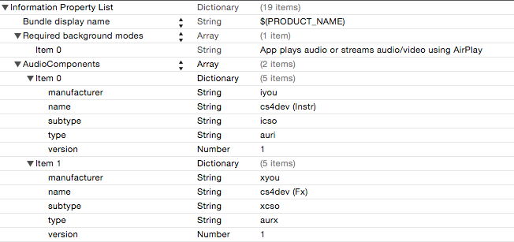

# 12 D. CSOUND IN iOS

The first part of this chapter is a guide which aims to introduce and illustrate some of the power that the
Csound language offers to iOS Developers.
It assumes that the reader has a rudimentary background in Csound,
and some experience and understanding of iOS development with either Swift or Objective-C.
The most recent Csound iOS SDK can be downloaded on Csound's [download](http://csound.github.io/download) page.
Older versions can be found [here](https://github.com/csound/csound/releases).
The Csound for iOS Manual (Lazzarini, Yi, Boulanger) that ships with the Csound for iOS API
is intended to serve as a lighter reference for developers.
This guide is distinct from it in that it is intended to be a more thorough,
step-by-step approach to learning the API for the first time.

The second part of this chapter is a detailed discussion of
the full integration of Csound into ths iOS Core Audio system.

## I. Features of Csound in iOS

### Getting Started

There are a number of ways in which one might begin to learn to work
with the Csound for iOS API. Here, to aid in exploring it, we first
describe how the project of examples that ships with the API is
structured. We then talk about how to go about configuring a new iOS
Xcode project to work with Csound from scratch.

#### Csound for iOS Examples

The Csound for iOS Examples project contains a number of simple examples
(in both Objective-C and Swift) of how one might use Csound's synthesis
and signal processing capabilities, and the communicative functionality
of the API. It is available both in the download bundle or online in the
[Csound sources](https://github.com/csound/csound/tree/develop/iOS).

In the _ViewControllers_ group, a number of subgroups exist to organize
the various individual examples into a single application. This is done
using the Master-Detail application layout paradigm, wherein a set of
options, all of them listed in a _master_ table, correlates to a single
_detail_ ViewController. Familiar examples of this design model,
employed by Apple and provided with every iOS device, are the Settings
app, and the Notes app -- each of these contains a master table upon
which the detail ViewController's content is predicated.

In each of these folders, you will find a unique example showcasing how
one might use some of the features of the Csound for iOS API to
communicate with Csound to produce and process sounds and make and play
music. These are designed to introduce you to these features in a
practical setting, and etch of these has a unifying theme that informs
its content, interactions, and structure.

#### Adding Csound to Your Project

If you are working in Objective-C, adding Csound for iOS to your project
is as simple as dragging the csound-iOS folder into your project. You
should select _Groups_ rather than _Folder References_, and it is
recommended that you elect to copy the csound-iOS folder into your
project folder ("Copy Items if Needed").

Once you have successfully added this folder, including the CsoundObj
class (the class that manages Csound on iOS) is as simple as adding an
import statement to the class. For example:

```c
//
// ViewController.h
//
#import "CsoundObj.h"
```

Note that this only makes the CsoundObj class available, which provides
an interface for Csound. There are other objects containing UI and
CoreMotion bindings, as well as MIDI handling. These are discussed later
in this document, and other files will need to be imported in order to
access them.

For Swift users, the process is slightly different: you will need to
first create a _bridging header_: a `.h` header file that can import the
Objective-C API for access in Swift.
The naming convention is _[YourProjectName]-Bridging Header.h_ and
this file can be easily created manually in Xcode
by choosing _File > New > File > Header File_ (under _Source_),
and using the naming convention described above. After
this, you will need to navigate to your project build settings and add
the path to this file (relative to your project's _.xcodeproj_ project
file).

Once this is done, navigate to the bridging header in Xcode and add your
Objective-C `#import` statements here. For example:

```c
//
// CsoundiOS_ExampleSwift-Bridging-Header.h
// CsoundiOS_ExampleSwift
//

#ifndef CsoundiOS_ExampleSwift_Bridging_Header_h
#define CsoundiOS_ExampleSwift_Bridging_Header_h

#import "CsoundObj.h"

#endif /* CsoundiOS_ExampleSwift_Bridging_Header_h */
```

You do not need to add any individual import statements to Swift files,
CsoundObj's functionality should be accessible in your _.swift_ files
after this process is complete.

#### Playing a _.csd_ File

The first thing we will do so that we can play a _.csd_ file is add our
_.csd_ file to our project. In this case, we will add a simple _.csd_ (in
this case named _test.csd_) that plays a sine tone with a frequency of
440Hz for ten seconds. Sample Csound code for this is:

#### **_EXAMPLE 12D01_iOS_simple.csd_**

```csound
<CsoundSynthesizer>
<CsOptions>
-odac
</CsOptions>
<CsInstruments>

sr = 44100
ksmps = 128
nchnls = 2
0dbfs = 1

instr 1
asig poscil 0.5 , 440
outs asig , asig
endin

</CsInstruments>
<CsScore>
i1 0 10
</CsScore>
</CsoundSynthesizer>
```

We will add this to our Xcode project by dragging and dropping it into
our project's main folder, making sure to select _Copy items if needed_
and to add it to our main target.

In order to play this _.csd_ file, we must first create an instance of the
CsoundObj class. We can do this by creating a property of our class as
follows, in our .h file (for example, in ViewController.h):

```c
//
// ViewController.h
// CsoundiOS_ExampleProject
//

#import <UIKit/UIKit.h>
#import "CsoundObj.h"

@interface ViewController : UIViewController

@property CsoundObj *csound;

@end
```

Once we've done this, we can move over to the corresponding `.m` file (in
this case, ViewController.m) and instantiate our Csound object. Here we
will do this in our _viewDidLoad_ method, that is called when our
ViewController's view loads.

```c
//
// ViewController.m
// CsoundiOS_ExampleProject
//

@interface ViewController()
@end
@implementation ViewController

- (void)viewDidLoad {
    [super viewDidLoad];
    // Allocate memory for and initialize a CsoundObj
    self.csound = [[CsoundObj alloc] init];
}
```

Note: in order to play our _.csd_ file, we must first get a path to it
that we can give Csound. Because part of this path can vary depending on
certain factors (for example, the user's native language setting), we
cannot pass a static or "hard-coded" path. Instead, we will access the
file using the NSBundle class (or 'Bundle' in Swift).

The _.csd_ file is copied as a resource (you can see this under the
_Build Phases_ tab in your target's settings), and so we will access it and
tell Csound to play it as follows:

```c
- (void) viewDidLoad {
  [super viewDidLoad];
  self.csound = [[CsoundObj alloc] init];
  // CsoundObj *csound is declared as a property in .h
  NSString *pathToCsd =
      [[NSBundle mainBundle] pathForResource:@"test" ofType:@"csd"];
  [self.csound play:pathToCsd];
}
```

Note that in Swift, this is a little easier and we can simply use:

```swift
import UIKit
class ViewController: UIViewController {
    var csound = CsoundObj()

    override func viewDidLoad() {
        super.viewDidLoad()
        let pathToCsd = Bundle.main.path(forResource: "test", ofType: "csd")
        self.csound.play(pathToCsd)
    }
}
```

With this, the test.csd file should load and play, and we should hear a
ten-second long sine tone shortly after the application runs (i.e. when
the main ViewController's main view loads).

### Recording and Rendering

#### Recording (Real-Time)

To record the output of Csound in real-time, instead of the play method,
use:

```c
// Objective-C
NSURL *docsDirURL = [[[NSFileManager defaultManager]
    URLsForDirectory:NSDocumentDirectory
           inDomains:NSUserDomainMask] lastObject];
NSURL *file = [docsDirURL URLByAppendingPathComponent:@"outputFile.aif"];
NSString *csdPath =
    [[NSBundle mainBundle] pathForResource:@"csdToRecord" ofType:@"csd"];
[self.csound record:csdPath toURL:file];
```

```swift
// Swift
let docsDirURL =
  FileManager.default.urls(for: .documentDirectory, in: .userDomainMask)[0]
let file = docsDirURL.appendingPathComponent("outFile.aif")
let csdPath = Bundle.main.path(forResource: "csdFile", ofType: "csd")
csound.record(csdPath, to: file)
```

Alternatively, the `recordToURL` method can be used while Csound is
already running to begin recording:

```c
// Objective-C
NSURL *docsDirURL = [[[NSFileManager defaultManager]
    URLsForDirectory:NSDocumentDirectory
           inDomains:NSUserDomainMask] lastObject];
NSURL *file = [docsDirURL URLByAppendingPathComponent:@"outputFile.aif"];
[self.csound recordToURL:file];
```

```swift
// Swift
let docsDirURL =
  FileManager.default.urls(for: .documentDirectory, in: .userDomainMask)[0]
let file = docsDirURL.appendingPathComponent("outFile.aif")
csound.record(to: file)
```

Note: the `stopRecording` method is used to stop recording without also
stopping Csound's real-time rendering.

#### Rendering (Offline)

You can also render a _.csd_ to an audio file offline. To render Csound
offline to disk, use the record:toFile: method, which takes a path
rather than a URL as its second argument. For example:

```c
// Objective-C
NSString *docsDir = NSSearchPathForDirectoriesInDomains(
    NSDocumentDirectory, NSUserDomainMask, YES)[0];
NSString *file = [docsDir stringByAppendingPathComponent:@"outFile.aif"];
NSString *csdPath =
    [[NSBundle mainBundle] pathForResource:@"csdFile" ofType:@"csd"];
[self record:csdPath toFile:file];
```

```swift
// Swift
let docsDir = NSSearchPathForDirectoriesInDomains(
  .documentDirectory, .userDomainMask, true
)[0]
let file = docsDir.appending("/outFile.aif")
let csdPath = Bundle.main.path(forResource: "csdFile", ofType: "csd")
csound.record(csdPath, toFile: file)
```

These demonstrations above save the audio files in the app's documents
directory, which allows write access for file and subdirectory storage
on iOS. Note that the `-W` and `-A` flags behave as usual on iOS: they will
decide whether the file rendered is a WAV or an AIFF file. In the event
that neither is provided, the latter will be used as a default.

### The CsoundUI Class

The CsoundUI class provides for direct bindings between named Csound
channels and commonly used objects from the UIKit iOS framework. While
it is not necessary to use a CsoundUI object for this communication
between iOS and Csound, it can, in many cases, abstract the process of
setting up a UI object binding to a single line of code. To initialize a
CsoundUI object, we must give it a reference to our Csound object:

```c
//Objective-C
CsoundUI *csoundUI = [[CsoundUI alloc] initWithCsoundObj: self.csound];
```

```swift
// Swift
var csoundUI = CsoundUI(csoundObj: csound)
```

Normally, however, these objects are declared as properties rather than
locally in methods. As mentioned, CsoundUI uses named channels for
communicating to and from Csound. Once set-up, values passed to these
named channels are normally accessed through the chnget opcode, for
example:

```orc
instr 1
kfreq chnget "frequency"
asig oscil 0.5 , kfreq
outs asig , asig
endin
```

Conversely, in order to pass values from Csound, the chnset opcode is
normally used with two arguments. The first is the variable, and it is
followed by the channel name:

```orc
instr 1
krand randomi 300 , 2000 , 1 , 3
asig poscil 0.5 , krand
outs asig , asig
chnset krand , "randFreq"
endin
```

#### UIButton Binding

The UIButton binding is predominantly contained within the
CsoundButtonBinding class, which CsoundUI uses to create individual
button bindings. To add a button binding, use:

```c
//Objective-C
[self.csoundUI addButton:self.button forChannelName:"channelName"];
```

```swift
// Swift
csoundUI.add(button, forChannelName: "channelName")
```

Where `self.button` is the button you would like to bind to, and the
string _channelName_ contains the name of the channel referenced by
chnget in Csound.

The corresponding value in Csound will be equal to 1 while the button is
touched, and reset to 0 when it is released. A simple example of how
this might be used in Csound, based on the pvscross example by Joachim
Heintz, is shown below:

```csound
instr 1
kpermut chnget "crossToggle "
ain1 soundin "fox .wav"
ain2 soundin "wave .wav"

;fft - analysis of file 1
fftin1 pvsanal ain1 , 1024 , 256 , 1024 , 1
;fft - analysis of file 2
fftin2 pvsanal ain2 , 1024 , 256 , 1024 , 1

if kpermut == 1 then
fcross pvscross fftin2 , fftin1 , .5 , .5
else
fcross pvscross fftin1 , fftin2 , .5 , .5
endif

aout pvsynth fcross
out aout
endin
```

#### UISwitch Binding

The UISwitch binding provides a connection between the UISwitch object
and a named channel in Csound. This binding is managed in the
CsoundSwitchBinding class and you can create a UISwitch binding by
using:

```c
//Objective-C
[self.csoundUI addSwitch:self.uiSwitch forChannelName:"channelName"];
```

```none
// Swift
csoundUI.add(switch, forChannelName: "channelName")
```

As in the case of the UIButton binding, the UISwitch binding provides an
on-off state value (1 or 0 respectively) to Csound. Below we use it to
turn on or off a simple note generator:

```csound
; Triggering instrument
instr 1
kTrigFreq randomi gkTrigFreqMin , gkTrigFreqMax , 5
ktrigger metro kTrigFreq
kdur randomh .1 , 2 , 5
konoff chnget " instrToggle "
if konoff == 1 then
schedkwhen ktrigger , 0 , 0 , 2 , 0 , kdur
endif
endin

; Sound generating instrument
instr 2
iamp random 0.03 ,0.5
ipan random 0 , 1
ipdx random 0 ,13
ipch table ipdx , 2+i( gkscale )
aenv expseg 1 , ( p3 ) , .001
asig oscil iamp * aenv , cpspch(ipch) , 1
outs asig * ipan , asig * (1 - ipan)
endin
```

#### UILabel Binding

The UILabel binding allows you to display any value from Csound in a
UILabel object. This can often be a helpful way of providing feedback to
the user. You can add a label binding with:

```c
//Objective-C
[self.csoundUI addLabel:self.label forChannelName:"channelName"];
```

```none
// Swift
csoundUI.add(label, forChannelName: "channelName")
```

However, in this case the channel is an output channel. To demonstrate,
let us add an output channel in Csound to display the frequency of the
sound generating instrument's oscillator from the previous example (for
UISwitch):

```csound
; Triggering instrument
instr 1
kTrigFreq randomi gkTrigFreqMin , gkTrigFreqMax , 5
ktrigger metro kTrigFreq
kdur randomh .1 , 2 , 5
konoff chnget " instrToggle "
if konoff == 1 then
schedkwhen ktrigger , 0 , 0 , 2 , 0 , kdur
endif
endin

; Sound generating instrument
instr 2
iamp random 0.03 ,0.5
ipan random 0 , 1
ipdx random 0 ,13
ipch table ipdx , 2+i( gkscale )
aenv expseg 1 , ( p3 ) , .001
asig oscil iamp * aenv , cpspch(ipch) , 1
chnset cpspch(ipch) , " pitchOut "
outs asig * ipan , asig * (1 - ipan)
endin
```

Note additionally that the desired precision of the value display can be
set beforehand using the labelPrecision property of the CsoundUI object.
For example:

```none
self.csoundUI.labelPrecision = 4;
```

#### UISlider Binding

The UISlider binding is possibly the most commonly used UI binding - it
allows the value of a UISlider object to be passed to Csound whenever it
changes. This is set up in the CsoundSliderBinding class and we access
it via CsoundUI using:

```c
// Objective-C
[self.csoundUI addSlider:self.slider
forChannelName:"channelName"];
```

```none
// Swift
csoundUI.add(slider, forChannelName: "channelName")
```

Note that this restricts you to using the slider's actual value, rather
than a rounded verion of it or some other variation, which would
normally be best suited to a manual value binding, which is addressed
later in this guide. An example is provided below of two simple such
UISlider-bound values in Csound:

```csound
sr = 44100
ksmps = 128
nchnls = 2
0dbfs = 1

instr 1
kfreq chnget "frequency" ; input 0 - 1
kfreq expcurve kfreq , 500 ; exponential distribution
kfreq *= 19980 ; scale to range
kfreq += 20 ;add offset
kamp chnget " amplitude "
kamp port kamp , .001 ; smooth values
asig poscil kamp , kfreq
outs asig , asig
endin
```

Above we get around being restricted to the value of the UISlider by
creating an exponential distribution in Csound. Of course we could
simply make the minimum and maximum values of the UISlider 20 and 20000
respectively, but that would be a linear distribution by default. In
both cases here, the UISlider's range of floating point values is set to
be from 0 to 1.

#### Momentary Button Binding

The momentary button binding is similar to the normal UIButton binding
in that it uses a UIButton, however it differs in how it uses this
object. The UIButton binding passes a channel value of 1 for as long as
the UIButton is held, whereas the momentary button binding sets the
channel value to 1 for one Csound k-period (i.e. one k-rate sample). It
does this by setting an intermediate value to 1 when the button is
touched, passing this to Csound on the next k-cycle, and immediately
resetting it to 0 after passing it. This is all occurring predominantly
in the CsoundMomentaryButtonBinding class, which we access using:

```c
// Objective-C
[self.csoundUI
  addMomentaryButton:self.triggerButton
  forChannelName:"channelName"
];
```

```swift
// Swift
csoundUI.addMomentaryButton(triggerButton, forChannelName: "channelName")
```

Here's a simple usage example:

```csound
; Triggering instrument
instr 1
ktrigger chnget " noteTrigger "
schedkwhen ktrigger , 0 , 0 , 2 , 0 , kdur
endin

; Sound generating instrument
instr 2
iamp random 0.03 ,0.5
ipan random 0 , 1
ipdx random 0 ,13
ipch table ipdx , 2+i( gkscale )
aenv expseg 1 , ( p3 ) , .001
asig oscil iamp * aenv , cpspch(ipch) , 1
chnset cpspch(ipch) , " pitchOut "
outs asig * ipan , asig * (1 - ipan)
endin
```

This replaces the automatic instrument triggering with a manual trigger.
Every time the UIButton is touched, a note (by way of an instance of
instr 2) will be triggered. This may seem like a more esoteric binding,
but there are a variety of potential uses.

### The CsoundMotion Class

The CsoundMotion class and its associated bindings allow information to
be passed from a device's motion sensors, via the CoreMotion framework,
to Csound. As with CsoundUI, it is possible to pass this data indirectly
by writing code to mediate between CoreMotion and Csound, but
CsoundMotion simplifies and greatly abstracts this process. Subsection
4.4 shows an example of how these values are accessed and might be used
in Csound. Note that with CsoundMotion, you do not assign channel names:
they are pre-assigned by the relevant objects (e.g. "AccelerometerX").

To declare and initialize a CsoundMotion object, use:

```c
// Objective-C
CsoundMotion *csoundMotion =
  [[CsoundMotion alloc] initWithCsoundObj:self.csound];
```

```swift
// Swift
var csoundMotion = CsoundMotion(csoundObj: csound)
```

As with CsoundUI, it may often be advantageous to declare the
CsoundMotion object as a property rather than locally.

#### Accelerometer Binding

The acclerometer binding, implemented in the CsoundAccelerometerBinding
class and enabled through the CsoundMotion class, allows access to an
iOS device's accelerometer data along its three axes (X, Y, Z). The
accelerometer is a device that measures acceleration, aiding in several
basic interactions. To enable it, use:

```c
// Objective-C
[csoundMotion enableAccelerometer];
```

```swift
// Swift
csoundMotion.enableAccelerometer()
```

#### Gyroscope Binding

The gyroscope binding, implemented in the CsoundGyroscopeBinding class
and enabled through the CsoundMotion class, allows access to an iOS
device's gyroscope data along its three axes (X, Y, Z). The
accelerometer is a device that allows rotational velocity to be
determined, and together with the accelerometer forms a system with six
degrees of freedom. To enable it, use:

```c
// Objective-C
[csoundMotion enableGyroscope];
```

```swift
// Swift
csoundMotion.enableGyroscope()
```

#### Attitude Binding

Finally, the attitude binding, implemented in CsoundAttitudeBinding and
enabled through CsoundMotion, allows access to an iOS device's _attitude
data_. As the Apple reference notes, _attitude_ refers to the
orientation of a body relative to a given frame of reference.
CsoundMotion enables this as three Euler angle
valies: _roll_, _pitch_, and _yaw_ (rotation around X, Y, and Z respectively).
To enable the attitude binding, use:

```c
// Objective-C
[csoundMotion enableAttitude];
```

```swift
// Swift
csoundMotion.enableAttitude()
```

Together, these bindings enable control of Csound parameters with device
motion in ways that are very simple and straightforward. In the
following subsection, an example demonstrating each of the pre-set
channel names as well as how some of this information might be used is
provided.

#### Motion Csound Example

Here is an example of a Csound instrument that accesses all of the data,
and demonstrates uses for some of it.
This example is taken from the
[Csound for iOS Examples](https://github.com/csound/csound/tree/develop/iOS)
project.

```csound
instr 1
kaccelX chnget " accelerometerX "
kaccelY chnget " accelerometerY "
kaccelZ chnget " accelerometerZ "

kgyroX chnget " gyroX "
kgyroY chnget " gyroY "
kgyroZ chnget " gyroZ "

kattRoll chnget " attitudeRoll "
kattPitch chnget " attitudePitch "
kattYaw chnget " attitudeYaw "

kcutoff = 5000 + (4000 * kattYaw )
kresonance = .3 + (.3 * kattRoll )
kpch = 880 + ( kaccelX * 220)
a1 vco2 ( kattPitch + .5) * .2 , kpch
a1 moogladder a1 , kcutoff , kresonance
aL , aR reverbsc a1 , a1 , .72 , 5000
outs aL , aR
endin
```

Each of the channel names is shown here, and each corresponds to what is
automatically set in the relevant binding. A little experimenting can be
very helpful in determining what to use these values for in your
particular application, and of course one is never under any obligation
to use all of them. Regardless, they can be helpful and very
straightforward ways to add now-familiar interactions.

### The _CsoundBinding_ Protocol

The _CsoundBinding_ protocol allows you to read values from and write
values to Csound using named channels that can be referenced in your
_.csd_ file using opcodes like chnget and chnset, as described in the
earlier section on CsoundUI. The protocol definition from CsoundObj is:

```c
@protocol CsoundBinding <NSObject>
- (void)setup:(CsoundObj*)csoundObj;
@optional
- (void)cleanup;
- (void)updateValuesFromCsound;
- (void)updateValuesToCsound;
@end
```

In order to add a binding object to Csound, use CsoundObj's addBinding
method:

```c
// Objective-C
[self.csound addBinding:self];
```

```none
// Swift
csound.addBinding(self)
```

Note that you will need to conform to the CsoundBinding protocol, and
implement. at minimum, the required setup method. The CsoundBinding
setup method will be called on every object added as a binding, and the
remaining methods, marked with the \@optional directive will be called
on any bindings that implement them.

#### Channels and Channel Types

Named channels allow us to pass data to and from Csound while it is
running. These channels refer to memory locations that we can write to
and Csound can read from, and vice-versa. The two most common channel
types are: `CSOUND_CONTROL_CHANNEL` refers to a floating point control
channel, normally associated with a k-rate variable in
Csound. `CSOUND_AUDIO_CHANNEL` refers to an array of floating point
audio samples of length _ksmps_.

Each of these can be an input or output channel depending on whether
values are being passed to or from Csound.

Given below is an example of using named channels in a simplified Csound
instrument. The polymorphic _chnget_ and _chnset_ opcodes are used, and the
context here implies that kverb received its value from an input control
channel named _verbMix_, and that _asig_ outputs to an audio channel
named _samples_.

```csound
giSqr ftgen 2, 0, 8192, 10, 1,0,.33,0,.2,0,.14,0,.11,0,.09

instr 1
kfreq = p4
kverb chnget " verbMix "
aosc poscil .5 , kfreq , 2
arvb reverb aosc , 1.5
asig = (aosc * (1 - kverb) ) + (arvb * kverb)
chnset asig , " samples "
outs asig , asig
endin
```

The section that follows will describe how to set up and pass values to
and from this instrument's channels in an iOS application.

#### The _Setup_ Method

The _setup_ method is called before Csound's first performance pass, and
this is typically where channel references are created. For example:

```c
// Objective-C
// verbPtr and samplesPtr are instance variables of type float*

- (void) setup : (CsoundObj *)csoundObj {
  verbPtr = [csoundObj getInputChannelPtr:@"verbMix"
                              channelType:CSOUND_CONTROL_CHANNEL];
  samplesPtr = [csoundObj getOutputChannelPtr:@"samples"
                                  channelType:CSOUND_AUDIO_CHANNEL];
}
```

```swift
// Swift
var verbPtr: UnsafeMutablePointer<Float>?
var samplesPtr: UnsafeMutablePointer<Float>?

func setup(_ csoundObj: CsoundObj) {
    verbPtr = csoundObj.getInputChannelPtr(
      "verbMix", channelType: CSOUND_CONTROL_CHANNEL
    )
    samplesPtr = csoundObj.getOutputChannelPtr(
      "samples", channelType: CSOUND_AUDIO_CHANNEL
    )
}
```

The _cleanup_ method from CsoundBinding, also optional, is intended for
use in removing bindings once they are no longer active. This can be
done using CsoundObj's removeBinding method:

```c
// Objective-C
// verbPtr and samplesPtr are instance variables of type float*
-(void)cleanup {
    [self.csound removeBinding:self];
}
```

```swift
// Swift
func cleanup() {
    csound.removeBinding(self)
}
```

#### Communicating Values To and From Csound

Communicating values to Csound is normally handled in the `updateValuesToCsound` method.
This method is called once per performance
pass (i.e. at the k-rate). For example:

```c
// Objective-C
-(void)updateValuesToCsound {
    *verbPtr = self.verbSlider.value;
}
```

```swift
// Swift
func updateValuesToCsound() {
    verbPtr?.pointee = verbSlider.value
}
```

This updates the value at a memory location that Csound has already
associated with a named channel (in the setup method). This process has
essentially replicated the functionality of the CsoundUI API's slider
binding. The advantage here is that we could perform any transformation
on the slider value, or associate another value (that might not be
associated with a UI object) with the channel altogether. To pass values
back from Csound, we use the updateValuesFromCsound method.

```c
// Objective-C
-(void)updateValuesFromCsound {
    float *samps = samplesPtr;
}
```

Note that in Swift, we have do a little extra work in order to get an
array of samples that we can easily index into:

```swift
// Swift
func updateValuesFromCsound() {
    let samps = samplesPtr?.pointee
    let sampsArray = [Float](UnsafeBufferPointer(start: audioPtr,
    count: Int(csound.getKsmps())))
}
```

Note also that `updateValuesToCsound` is called before
`updateValuesFromCsound` during each performance pass, with the Csound
engine performance call in between the two.

### The _CsoundObjListener_ Protocol

The _CsoundObjListener_ protocol allows objects in your program to be
notified when Csound begins running, and when it completes running. The
protocol definition from CsoundObj is:

```c
@protocol CsoundObjListener <NSObject>
@optional
- (void)csoundObjStarted:(CsoundObj *)csoundObj;
- (void)csoundObjCompleted:(CsoundObj *)csoundObj;
@end
```

Note that there are no methods that an object is required to adopt in
order to conform to this protocol. These methods simply allow an object
to elect to be notified when Csound either begins, completes running, or
both. Note that these methods are not called on the main thread, so any
UI work must be explicitly run on the main thread. For example:

```c
// Objective-C
- (void)viewDidLoad {
  [super viewDidLoad];
  [self.csound addListener:self];
}
- (void)csoundObjStarted:(CsoundObj *)csoundObj {
  [self.runningLabel performSelectorOnMainThread:@selector(setText:)
                                      withObject:@"Csound Running"
                                   waitUntilDone:NO];
}
```

```swift
// Swift
override func viewDidLoad() {
    super.viewDidLoad()
    csound.add(self)
}
func csoundObjCompleted(_ csoundObj: CsoundObj) {
    DispatchQueue.main.async { [unowned self] in
        self.runningLabel.text = "Csound Stopped"
    }
}
```

### Console Output

Console output from Csound is handled via a callback. You can set the
method that handles console info using CsoundObj's
setMessageCallbackSelector method, and passing in an appropriate
selector, for instance:

```c
// Objective-C
[self.csound setMessageCallbackSelector:@selector(printMessage:)];
```

```swift
// Swift
csound.setMessageCallbackSelector(#selector(printMessage(_:)))
```

An object of type NSValue will be passed in. This object is acting as a
wrapper for a C struct of type Message. The definition for Message in
_CsoundObj.h_ is:

```c
typedef struct {
    CSOUND *cs;
    int attr;
    const char *format;
    va_list valist;
} Message;
```

The two fields of interest to us for the purposes of console output are
format and valist. The former is a format string, and the latter
represents a list of arguments to match its format specifiers.

The process demonstrated in the code examples below can be described as:

1.  Declare an instance of a Message struct.
2.  Unwrap the NSValue to store its contained Message value at the
    address of this instance.
3.  Declare an empty C string, to act as a buffer.
4.  Use the vsnprintf function to populate the buffer with the formatted
    output string.
5.  Wrap this C string in an Objective-C NSString or Swift String.

```c
// Objective-C
- (void)printMessage:(NSValue *)infoObj
    Message info;
    [infoObj getValue:&info];
    char message[1024];
    vsnprintf(message, 1024, info.format, info.valist);
    NSString *messageStr = [NSString stringWithFormat:@"%s", message];
    NSLog(@"%@", messageStr);
}
```

Note that in Swift, we have to create a `CVaListPointer` (equivalent to a
`va_list *` in C) for use with the `vsnprintf()` function:

```swift
// Swift
func messageCallback(_ infoObj: NSValue) {
    var info = Message()
    infoObj.getValue(&info)
    let message = UnsafeMutablePointer<Int8>.allocate(capacity: 1024)
    let va_ptr: CVaListPointer = CVaListPointer(
      _fromUnsafeMutablePointer: &(info.valist)
    )
    vsnprintf(message, 1024, info.format, va_ptr)
    let messageStr = String(cString: message)
    print(messageStr)
}
```

In both cases above, we are printing the resulting string objects to
Xcode's console. This can be very useful for finding and addressing
issues that have to do with Csound or with a _.csd_ file you might be
using.

We could also pass the resulting string object around in our program;
for example, we could insert the contents of this string object into a
UITextView for a simulated Csound console output.

### Csound-iOS and MIDI

The Csound iOS API provides two possible ways of passing MIDI
information to Csound. CsoundObj can receive MIDI events from CoreMIDI
directly. By default, this functionality is disabled, but setting
CsoundObj's midiInEnabled property to true (or _YES_ on Objective-C)
enables it. This must, however be done before Csound is run.

Note that you must also set the appropriate command-line flag in your
csd, under CsOptions. For example, `-M0`. Additionally, the MIDI device
must be connected before the application is started.

#### MidiWidgetsManager

The second way that is provided to communicate MIDI information to
Csound is indirect, via the use of UI widgets and CsoundUI. In this
case, the MidiWidgetsManager uses a MidiWidgetsWrapper to connect a MIDI
CC to a UI object, and then CsoundUI can be used to connect this UI
object's value to a named channel in Csound. For instance:

```c
// Objective-C
MidiWidgetsManager *widgetsManager = [[MidiWidgetsManager alloc] init];
[widgetsManager addSlider:self.cutoffSlider forControllerNumber:5];
[csoundUI addSlider:self.cutoffSlider forChannelName:@"cutoff"];
[widgetsManager openMidiIn];
```

```swift
// Swift
let widgetsManager = MidiWidgetsManager()
widgetsManager.add(cutoffSlider, forControllerNumber: 5)
csoundUI?.add(cutoffSlider, forChannelName: "cutoff")
widgetsManager.openMidiIn()
```

An advantage of this variant is that MIDI connections to the UI widgets
are active even when Csound is not running, so visual feedback can still
be provided, for example. At the time of writing, support is only
built-in for UISliders.

### Other Functionality

This section describes a few methods of CsoundObj that are potentially
helpful for more complex applications.

#### _getCsound_

```c
(CSOUND *)getCsound;
```

The `getCsound` method returns a pointer to a struct of type CSOUND, the
underlying Csound instance in the C API that the iOS API wraps. Because
the iOS API only wraps the most commonly needed functionality from the
Csound C API, this method can be helpful for accessing it directly
without needing to modify the Csound iOS API to do so.

Note that this returns an opaque pointer because the declaration of this
struct type is not directly accessible. This should, however, still
allow you to pass it into Csound C API functions in either Objective-C
or Swift if you would like to access them.

#### _getAudioUnit_

```c
(AudioUnit *)getAudioUnit;
```

The `getAudioUnit` method returns a pointer to a CsoundObj instance's I/O
AudioUnit, which provides audio input and output to Csound from iOS.

This can have several potential purposes. As a simple example, you can
use the AudioOutputUnitStop() function with the returned value's pointee
to pause rendering, and AudioOutputUnitStart() to resume.

#### _updateOrchestra_

```c
(void)updateOrchestra:(NSString *)orchestraString;
```

The `updateOrchestra` method allows you to supply a new Csound orchestra
as a string.

#### Other

Additionally, `getKsmps` returns the current _ksmps_ value, and
`getNumChannels` returns the number of audio channels in use by the
current Csound instance. These both act directly as wrappers to Csound C
API functions.

## II. How to Fully Integrate Csound into Apples iOS CoreAudio

In the second part of this chapter we will study some strategies for best integration of Csound with CoreAudio,
in order to aid the development of iOS applications.
There are some important issues to be considered for a professional audio application,
such as the native Inter-App Audio routing, buffer frame etc.
We will examine in detail the relevant code (Csound and Objective-C) taken from
few audio apps based on Csound. We will learn how to manage the buffer frame and sampling rate;
how to draw a Waveform in CoreGraphics from a Csound GEN Routine;
how to write a Csound GEN table and much more.

### Getting Started

The development of professional audio applications involves
to consider some important aspects of iOS in order to maximize
the compatibility and versatility of the app.

The approach should focus on these five important points:

1. Implement Background Audio
2. Switch on/off your Audio Engine
3. Implement Core MIDI
4. Do not waste System Resources
5. Set up the Sampling Rate and Buffer Frame according to applications running in the system.

The code for the User Interface (UI) is written in Objective-C,
whilst the Csound API (i.e. Application Programming Interface) is written in C.
This duality allows us to understand in detail the interaction between both.
As we will see in the next section,
the control unit is based on the _callback_ mechanism rather than the _pull_ mechanism.

No Objective-C code was deliberately written in the C audio _callback_,
since it is not recommended as well it is not recommended to allocate/de-allocate memory.

Since often we will refer to the tutorials (_XCode_ projects),
it would be useful to have on hand the _xCode_ environment.
These files can be downloaded [here](https://bitbucket.org/alessandropetrolati/tutorials/src/master/).

### Setup for an Audio App

In the first _XCode_ project (_01_csSetup_) we configure a
Single View Application to work with audio and _Csound_.
The project dependencies are only **libcsound.a** and **libsndfile.a** with
the header (.h) files and _CsoundMIDI.h_ as well as _CsoundMIDI.m._

The code of _initializeAudio_ function will enable the input/output audio:

```c
- (void)initializeAudio {

  /* Audio Session handler */
  AVAudioSession *session = [AVAudioSession sharedInstance];

  NSError *error = nil;
  BOOL success = NO;

  success = [session setCategory:AVAudioSessionCategoryPlayAndRecord
                     withOptions:(
                       AVAudioSessionCategoryOptionMixWithOthers |
                       AVAudioSessionCategoryOptionDefaultToSpeaker)
                     error:&error];

  success = [session setActive:YES error:&error];

  /* Sets Interruption Listner */
  [[NSNotificationCenter defaultCenter]
      addObserver:self
         selector:@selector(InterruptionListener:)
             name:AVAudioSessionInterruptionNotification
           object:session];

  AudioComponentDescription defaultOutputDescription;
  defaultOutputDescription.componentType = kAudioUnitType_Output;
  defaultOutputDescription.componentSubType = kAudioUnitSubType_RemoteIO;
  defaultOutputDescription.componentManufacturer =
    kAudioUnitManufacturer_Apple;
  defaultOutputDescription.componentFlags = 0;
  defaultOutputDescription.componentFlagsMask = 0;

  // Get the default playback output unit
  AudioComponent HALOutput =
      AudioComponentFindNext(NULL, &defaultOutputDescription);
  NSAssert(HALOutput, @"Can't find default output");

  // Create a new unit based on this that we will use for output
  err = AudioComponentInstanceNew(HALOutput, &csAUHAL);

  // Enable IO for recording
  UInt32 flag = 1;
  err = AudioUnitSetProperty(csAUHAL, kAudioOutputUnitProperty_EnableIO,
                             kAudioUnitScope_Input, 1, &flag, sizeof(flag));
  // Enable IO for playback
  err = AudioUnitSetProperty(csAUHAL, kAudioOutputUnitProperty_EnableIO,
                             kAudioUnitScope_Output, 0, &flag, sizeof(flag));

  err = AudioUnitInitialize(csAUHAL);

  /* AUDIOBUS and IAA  */
  [self initializeAB_IAA];
}
```

This code is common to many audio applications,
easily available online or from the Apple documentation.
Basically, we setup the app as _PlayAndRecord_ category,
then we create the AudioUnit.
The _PlayAndRecord_ category allows receiving audio from the system and
simultaneously produce audio.

**IMPORTANT:**

For proper operation with Audiobus (AB) and Inter-App Audio (IAA),
we must instantiate and initialize one Audio Unit (AU) only once for the entire life cycle of the app.
To destroy and recreate the AU would involve to require more memory (for each instance).
If the app is connected to IAA or AB it will stop responding and we will experience unpredictable behavior,
which may lead to an unexpected crash.

Actually there is no way to tell at runtime AB and / or IAA that the AU address has changed.
The _InitializeAudio_ function should be called only once, unlike the run/stop functions of Csound.

These aspects will become more clear in the following paragraphs.

### Initialize Csound and Communicate with it

The **_AudioDSP.m_** class implements the entire audio structure and manages
the user interface interaction with Csound.
_AudioDSP_ is a subclass of _NSObject_ that is instantiated on the **_Main.storyboard_**.
A reference to this class on the storyboard greatly facilitates connections between
the GUI (_IBOutlet_ and _IBAction_) and the DSP i.e. Csound.

As we will see in the next section,
all links are established graphically with the _Interface Builder_.

The main CSOUND structure is allocated in the _AudioDSP_ constructor and initializes the audio system.
This approach foresees that the \_cs (CSOUND\*) class variable persists for the entire life cycle of the app.
As mentioned, the _initializeAudio_ function should be called only once.

```c
- (instancetype)init {
    self = [super init];
    if (self) {

        // Creates an instance of Csound
        _cs = csoundCreate(NULL);

        // Setup CoreAudio
        [self initializeAudio];
    }
    return self;
}
```

Since we have the CSOUND structure allocated and the CoreAudio properly configured,
we can manage Csound asynchronously.

The main purpose of this simple example is to study how the user interface (UI) interacts with Csound.
All connections have been established and managed graphically through the Interface Builder.

The _UISwitch_ object is connected with the _toggleOnOff_,
which has the task to toggle on/off Csound in this way:

```c
- (IBAction)toggleOnOff:(id)component {

  UISwitch *uiswitch = (UISwitch *)component;

  if (uiswitch.on) {

    NSString *tempFile =
        [[NSBundle mainBundle] pathForResource:@"test" ofType:@"csd"];

    [self stopCsound];
    [self startCsound:tempFile];

  } else {
    [self stopCsound];
  }
}
```

In the example the _test.csd_ is performed which implements a simple sinusoidal oscillator.
The frequency of the oscillator is controlled by the _UISlider_ object.
This is linked with the _sliderAction_ callback.

As anticipated, the mechanism adopted is driven by events (callback).
This means that the function associated with the event is called only when
the user performs an action on the UI slider.

In this case the action is of type _Value Changed_.
The Apple documentation concerning the UIControl framework should be consulted,
for further clarification in this regard.

```c
- (IBAction)sliderAction:(id)sender {

  UISlider *sld = sender;

  if (!_cs || !running)
    return;

  NSString *channelName = @"freq";
  float *value;
  csoundGetChannelPtr(
    _cs, &value,
    [channelName cStringUsingEncoding:NSASCIIStringEncoding],
    CSOUND_CONTROL_CHANNEL | CSOUND_INPUT_CHANNEL
  );

  *value = (float)sld.value;
}
```

As we can see, we get the pointer through _csoundGetChannelPtr_,
this is relative to incoming control signals.
From the point of view of Csound, the signals in the input (`CSOUND_INPUT_CHANNEL`)
are sampled from the software bus via _chnget_, while in
the output (`CSOUND_OUTPUT_CHANNEL`) _chnset_ is used.

The allocation is done by dereferencing the pointer in this way:

```c
*value = (float) sld.value;
```

or

```c
value[0] = (float) sld.value;
```

The _channelName_ string _freq_ is the reference text used by
the _chnget_ opcode in the _instr 1_ of the Csound Orchestra.

```csound
kfr chnget "freq"
```

Since the control architecture is based on the callback mechanism and therefore
depends on the user actions, we must send all values when Csound starts.
We can use Csound's delegate:

```c
-(void)csoundObjDidStart {
    [_freq sendActionsForControlEvents:UIControlEventAllEvents];
}
```

This operation must be repeated for all UI widgets in practice.
Immediately after Csound is running we send an _UIControlEventAllEvents_ message to all widgets.
So we are sure that Csound receives properly the current state of the UI's widgets values.

In this case _\_freq_ is the reference (IBOutlet) of the UISlider in the **_Main.storyboard_**.

### Enabling Audiobus and Inter-App Audio

The last line of code in the _initializeAudio_ function calls the _initializeAB_IAA_ for initialize and
configure the Inter-App Audio and Audiobus.

The _XCode_ tutorials do not include the Audiobus SDK since it is covered by license,
see the website for more information and to consult the official documentation [here](http://audiob.us).

However, the existing code to Audiobus should ensure proper functioning after the inclusion of the library.

In the file _AudioDSP.h_ there are two macros: _AB_ and _IAA_.
These are used to include or exclude the needed code.
The first step is to configure the two _AudioComponentDescriptions_ for the
types: _kAudioUnitType_RemoteInstrument_ and _kAudioUnitType_RemoteEffect_.

```c
/* Create Sender and Filter ports */
AudioComponentDescription desc_instr = {
    kAudioUnitType_RemoteInstrument,
    'icso',
    'iyou', 0, 0
};

AudioComponentDescription desc_fx = {
    kAudioUnitType_RemoteEffect,
    'xcso',
    'xyou', 0, 0
};
```

This point is crucial because you have to enter the same information in the file _Info.plist_-



In the _Info.plist_ (i.e. Information Property List), the _Bundle display name_ key
and _Require background modes_ must absolutely be defined to enable the audio in the background.

The app must continue to play audio even when it is not in the foreground.
Here we configure the _Audio Components_ (i.e. AU).

```c
typedef struct AudioComponentDescription {
    OSType              componentType;
    OSType              componentSubType;
    OSType              componentManufacturer;
    UInt32              componentFlags;
    UInt32              componentFlagsMask;
} AudioComponentDescription;
```

As said, the _AudioComponentDescription_ structure used for the configuration of the AU,
must necessarily coincide in the _Info.plist_,

The structure fields (_OSType_) are of _FourCharCode_,
so they must consist of four characters.

IMPORTANT: it is recommended to use different names for
both _componentSubType_ and _componentManufacturer_ of each _AudioComponent_.
In the example the characters &#39;i&#39; and &#39;x&#39; refer
to _Instrument_ and _Fx_.

Only for the first field (componentType) of the AudioComponentDescription structure we can use the enumerator

```c
enum {
    kAudioUnitType_RemoteEffect         = 'aurx',
    kAudioUnitType_RemoteGenerator      = 'aurg',
    kAudioUnitType_RemoteInstrument     = 'auri',
    kAudioUnitType_RemoteMusicEffect    = 'aurm'
};
```

where _auri_ identifies the Instrument (_Instr_) and _aurx_ the effect (_Fx_),
at which point the app will appear on the lists of the various _IAA Host_ as _Instr_ and _Fx_ and
in Audiobus as Sender or Receiver.

At this point we are able to:

1. Perform Audio in the background
2. Get IAA and AB support for input/output
3. Toggle DSP (Csound) on and off
4. Control Csound through the _callback_ mechanism
5. Record the output audio

In the following sections we will see how to manage the advanced settings for
Csound's _ksmps_, according to the system BufferFrame.

### Buffer Frame vs ksmps

In IOS, the first audio app which is running (in foreground or in background),
imposes its own Sampling Rate and BuffeFrame to the whole iOS (i.e. for all audio apps).

IOS allows power-of-two ​​BufferFrame values in the range 64, 128, 256, 512, 1024, etc ...

It is not recommended to use values ​​bigger than 1024 or smaller than 64.
A good compromise is 256, as suggests the default value of _GarageBand_ and
Other similar applications.

In the Csound language, the vector size (i.e. BufferFrame in the example) is expressed as _ksmps_.
So it is necessary to manage appropriately the values of _BufferFrame_ and _ksmps_.

There are three main possible solutions:

1. Keep the _ksmps_ static with a very low value, such as 32 or 64
2. Dynamically manage the _ksmps_ depending on _BufferFrame_
3. _BufferFrame_ and _ksmps_ decorrelation

All three cases have advantages and disadvantages.
In the first case the BufferFrame must be always >= _ksmps_,
and in the second case we must implement a spartan workaround tp synchronize _ksmps_ with _BufferFrame_.
The third and more complex case requires a control at run-time on the audio callback and we must manage an
accumulation buffer. Thanks to this, the _BufferFrame_ can be bigger than _ksmps_ or vice versa.
However there are some limitations.
In fact, this approach does not always lead to the benefits hoped for in terms of performance.

### Static ksmps

To keep the _ksmps_ static with a very low value, such as 32 or 64, we will set _ksmps_ in the
Csound Orchestra to this value. As mentioned, the BufferFrame of iOS is always greater or equal than 64.
The operation is assured thanks to the _for_ statement in the _Csound_Render:_

```c
OSStatus  Csound_Render(void *inRefCon,
                        AudioUnitRenderActionFlags *ioActionFlags,
                        const AudioTimeStamp *inTimeStamp,
                        UInt32 dump,
                        UInt32 inNumberFrames,
                        AudioBufferList *ioData) {
    //…

    /* inNumberFrames => ksmps */
    for(int i = 0; i < (int)slices; ++i){
        ret = csoundPerformKsmps(cs);
    }

    //…
}
```

This C routine is called from the CoreAudio every _inNumberFrames_ (i.e. BufferFrame).
The _ioData_ pointer contains _inNumberFrames_ of audio samples incoming from the input (mic/line).
Csound reads this data and returns _ksmps_ processed samples.

When the _inNumberFrames_ and _ksmps_ are identical, we can simply copy out the processed buffer,
this is done by calling the _csoundPerformKsmps()_ procedure. Since that _ksmps_ is less
or equal to _inNumberFrames_, we need to call _N slices_ the _csoundPerformKsmps()_.
This is safe, as _ksmps_ will in this situation never be greater than _inNumberFrames_.

Example:

```c
ksmps = 64
inNumberFrames = 512
```

slices is calculated as follows:

```c
int slices = inNumberFrames / csoundGetKsmps(cs);
slices is 8
```

In other words, every _Csound_Render_ call involves eight sub-calls to _csoundPerformKsmps()_,
for every sub-call we fill the _ioData_ with _ksmps_ samples.

### Dynamic ksmps, Buffer Frame and Sampling Rate Synchronization

The _ksmps_ value should be chosen according to the Csound Orchestra operating logic.
If the Orchestra is particularly heavy in terms of k-rate operations,
which however do not require low-latency, we can use higher values as 512 or 1024.
This second case is adoptable for many apps developed so far.
In fact, except in specific cases, it is always convenient to set
the _ksmps_ to the same value as the system's _BufferFrame_.

The following steps are required to change _sr_ and _ksmps_:

1. Stop and Clean the _Csound_ Object
2. Replace the Orchestra Code in the .csd file with new _sr_ and _ksmps_
3. Initialize and Run the _Csound_ Object with these new values

This is a workaround but it works properly; we just have to set placeholders in the Orchestra header.

```csound
<CsInstruments>
sr = 44100
ksmps = 512

;;;;SR;;;;		//strings replaced from Objective-C
;;;;KSMPS;;;;

nchnls = 2
0dbfs = 1

…
```

The two univocal strings are the placeholders for _sr_ and _ksmps_.
They begin with the semicolon character so that Csound recognizes it as a comment.
The following function in Objective-C looks for the placeholders in the _myOrchestra.csd_ and
replaces them with new _sr_ and _ksmps_ values.

```c
- (void)csoundApplySrAndKsmpsSettings:(Float64)sr withBuffer:(Float64)ksmps
{

  NSString* pathAndName = [[[NSBundle mainBundle] resourcePath]
    stringByAppendingString:@"/myOrchestra.csd"];

  if ([[NSFileManager defaultManager] fileExistsAtPath:pathAndName]) {
    NSString* myString =
      [[NSString alloc] initWithContentsOfFile:pathAndName
                                      encoding:NSUTF8StringEncoding
                                         error:NULL];

    myString = [myString
      stringByReplacingOccurrencesOfString:@";;;;SR;;;;"
                                withString:[NSString
                                            stringWithFormat:@"sr = %f", sr]];

    myString = [myString
      stringByReplacingOccurrencesOfString:@";;;;KSMPS;;;;"
                                withString:[NSString
                                             stringWithFormat:@"ksmps = %f",
                                                              ksmps]];

    NSString* pathAndNameRUN =
      [NSString stringWithFormat:@"%@dspRUN.csd", NSTemporaryDirectory()];

    NSError* error = nil;

    // save copy of dspRUN.csd in library directory
    [myString writeToFile:pathAndNameRUN
               atomically:NO
                 encoding:NSUTF8StringEncoding
                    error:&error];

    // Run Csound
    [self startCsound:pathAndNameRUN];

  } else
    NSLog(@"file %@ Does Not Exists At Path!!!", pathAndName);
}
```

The NSString _pathAndName_ contains the file path of _myOrchestra.csd_ in the Resources folder.
This path is used to copy in _myString_ the entire file (as NSString).
Subsequently the _stringByReplacingOccurrencesOfString_ method replaces the
placeholders with the valid strings.

Since iOS does not allow to edit files in the application _Resources_ folder (i.e. _pathAndName_),
we need to save the modified version in the new file _dspRUN.csd_ that
is saved in the temporary folder (i.e. _pathAndNameRUN_).
This is achieved through the _writeToFile_ method.

As a final step it is necessary to re-initialise Csound by calling the _runCsound_ function
which runs Csound and sends the appropriate values of _sr_ and _ksmps._

###_BufferFrame_ and _ksmps_ decorrelation

As seen the second case is a good compromise, however it is not suitable
in some particular conditions. So far we have only considered the aspect
in which the app works on the main audio thread, with a _BufferFrame_ imposed by iOS.
But there are special cases in which the app is called to work on a different thread
and with a different _BufferFrame_.

For instance the _freeze track_ feature implemented by major Host IAA
apps (such as Cubasis, Auria etc ...) bypasses the current setup of iOS
and imposes an arbitrary _BufferFrame_ (usually 64).

Since Csound is still configured with the iOS _BufferFrame_ (the main audio thread),
but during the freeze track process the _Csound_Perform_ routine is called with a different
BufferFrame, Csound cannot work properly.

In order to solve this limitation we need a run-time control on the
audio callback and handle the exception.

On the _Csound_Render_ we will evaluate the condition for which _slices_ is < 1:

```c
OSStatus Csound_Perform(void *inRefCon,
                        AudioUnitRenderActionFlags *ioActionFlags,
                        const AudioTimeStamp *inTimeStamp, UInt32 dump,
                        UInt32 inNumberFrames, AudioBufferList *ioData) {

  //…

  /* CSOUND PERFORM */
  if (slices < 1.0) {
    /* inNumberFrames < ksmps */
    Csound_Perform_DOWNSAMP(inRefCon, ioActionFlags, inTimeStamp, dump,
                            inNumberFrames, ioData);
  } else {
    /* inNumberFrames => ksmps */
    for (int i = 0; i < (int)slices; ++i) {
      ret = csoundPerformKsmps(cs);
    }
  }

  //…
}
```

Please note that _slices_ is calculated as follows:

```c
int slices = inNumberFrames / csoundGetKsmps(cs);
```

Every time the _ksmps_ (for some reason) is greater than BufferFrame,
we will perform the `Csound_Perform_DOWNSAMP` procedure.

```c
// Called when inNumberFrames < ksmps
OSStatus Csound_Perform_DOWNSAMP(
  void *inRefCon,
  AudioUnitRenderActionFlags *ioActionFlags,
  const AudioTimeStamp *inTimeStamp, UInt32 dump,
  UInt32 inNumberFrames,
  AudioBufferList *ioData
) {
  AudioDSP *cdata = (__bridge AudioDSP *)inRefCon;

  int ret = cdata->ret, nchnls = cdata->nchnls;
  CSOUND *cs = cdata->_cs;

  MYFLT *spin = csoundGetSpin(cs);
  MYFLT *spout = csoundGetSpout(cs);
  MYFLT *buffer;

  /* DOWNSAMPLING FACTOR */
  int UNSAMPLING = csoundGetKsmps(cs) / inNumberFrames;

  if (cdata->counter < UNSAMPLING - 1) {
    cdata->counter++;
  } else {
    cdata->counter = 0;

    /* CSOUND PROCESS KSMPS */
    if (!cdata->ret) {
      /* PERFORM CSOUND */
      cdata->ret = csoundPerformKsmps(cs);
    } else {
      cdata->running = false;
    }
  }

  /* INCREMENTS DOWNSAMPLING COUNTER */
  int slice_downsamp = inNumberFrames * cdata->counter;

  /* COPY IN CSOUND SYSTEM SLICE INPUT */
  for (int k = 0; k < nchnls; ++k) {
    buffer = (MYFLT *)ioData->mBuffers[k].mData;
    for (int j = 0; j < inNumberFrames; ++j) {
      spin[(j + slice_downsamp) * nchnls + k] = buffer[j];
    }
  }

  /* COPY OUT CSOUND KSMPS SLICE */
  for (int k = 0; k < nchnls; ++k) {
    buffer = (MYFLT *)ioData->mBuffers[k].mData;
    for (int j = 0; j < inNumberFrames; ++j) {
      buffer[j] = (MYFLT)spout[(j + slice_downsamp) * nchnls + k];
    }
  }

  cdata->ret = ret;
  return noErr;
}
```

As mentioned we need a buffer for the accumulation.
It is, however, not necessary to create a new one since you can directly
use Csound's _spin_ and _spout_ buffer.

First we have to evaluate what is the level of under-sampling, for example:

```c
Csound ksmps = 512
iOS inNumberFrames = 64

/* DOWNSAMPLING FACTOR */
int UNSAMPLING = csoundGetKsmps(cs)/inNumberFrames;

UNSAMPLING is 8
```

This value represents the required steps to accumulate the input signal in spin
for every call of csoundPerformKsmps().

```c
if (cdata->counter < UNSAMPLING-1) {
	cdata->counter++;
}
else {
	cdata->counter = 0;

	/* CSOUND PROCESS KSMPS */
	if(!cdata->ret) {
		cdata->ret = csoundPerformKsmps(cs);
	}
}
```

The `Csound_Perform_DOWNSAMP` routine is called by iOS every 64 samples, while we must
call _csoundPerformKsmps()_ after 512 samples.
This means we need to skip eight times (i.e. UNSAMPLING) until we have collected the input buffer.

From another point of view, before calling _csoundPerformKsmps()_ we must accumulate eight _inNumberFrames_ in _spin_,
and for every call of `Csound_Perform_DOWNSAMP` we must return _inNumberFrames_ from _spout_.

In the next example, the iOS audio is in _buffer_ which is a pointer of the _ioData_ structure.

```c
/* INCREMENTS DOWNSAMPLING COUNTER */
int slice_downsamp = inNumberFrames * cdata->counter;

/* COPY IN CSOUND SYSTEM SLICE INPUT */
for (int k = 0; k < nchnls; ++k){
	buffer = (MYFLT *) ioData->mBuffers[k].mData;
	for(int j = 0; j < inNumberFrames; ++j){
		spin[(j+slice_downsamp)*nchnls+k] = buffer[j];
	}
}

/* COPY OUT CSOUND KSMPS SLICE */
for (int k = 0; k < nchnls; ++k) {
	buffer = (MYFLT *) ioData->mBuffers[k].mData;
	for(int j = 0; j < inNumberFrames; ++j) {
		buffer[j] = (MYFLT) spout[(j+slice_downsamp)*nchnls+k];
	}
}
```

Ignoring the implementation details regarding the de-interlacing of the audio,
we can focus on the **_slice_downsamp_** which serves as offset-index for the arrays _spin_ and _spout_.

The implementation of both second and third cases guarantees that the app works properly in every situation.

### Plot a Waveform

In this section we will see a more complex example to access memory of Csound and display the contents on a UIView.

The _waveDrawView_ class interacts with the _waveLoopPointsView_,
the _loopoints_ allow us to select a portion of the file via the zoom on the waveform (pinch in / out).
These values (loopoints) are managed by Csound which ensures the correct reading of the file and
returns the normalized value of the instantaneous phase of reading.

The two classes are instantiated in **_Main.storyboard_**.
Please note the hierarchy that must be respected for the setup of other projects as well as
the three _UIView_ must have the same size (frame) and cannot be dynamically resized.


In the score of the file _csound_waveform.csd_, two _GEN Routines_ are declared to load WAV files in memory:

```csound
f2 0 0 1 "TimeAgo.wav" 0 0 1
f3 0 0 1 "Density_Sample08.wav" 0 0 1
```

In order to access the audio files in the app Resources folder,
we need to setup some environment variables for Csound.
This is done in the _runCsound_ function.
Here we set the SFDIR (Sound File Directory) and the SADIR (Sound analysis directory):

```c
// Set Environment Sound Files Dir
NSString *resourcesPath = [[NSBundle mainBundle] resourcePath];
NSString *envFlag = @"--env:SFDIR+=";

char *SFDIR = (char *)[[envFlag stringByAppendingString:resourcesPath]
    cStringUsingEncoding:NSASCIIStringEncoding];

envFlag = @"--env:SADIR+=";
char *SADIR = (char *)[[envFlag stringByAppendingString:resourcesPath]
    cStringUsingEncoding:NSASCIIStringEncoding];

char *argv[4] = {
    "csound", SFDIR, SADIR,
    (char *)[csdFilePath cStringUsingEncoding:NSASCIIStringEncoding]};

ret = csoundCompile(_cs, 4, argv);
```

The interaction between Csound and the UI is two-way,
the class method _drawWaveForm_ draws the contents of the _genNum_.

```c
[waveView drawWaveFromCsoundGen:_cs genNumber:genNum];
```

After calling this method, we need to enable an _NSTimer_ object in order to
read continuosly (pull) the phase value returned by Csound.
Please examine the _loadSample_1_ function code for insights.

The timer is disabled when the DSP is switched off,
in the timer-callback we get the pointer, this time from CSOUND_OUTPUT_CHANNEL,
finally we use this value to synchronize the graphics cursor on the waveform (scrub) in the GUI.

```c
- (void)updateScrubPositionFromTimer {

    if (!running) return;

    MYFLT* channelPtr_file_position = nil;
    csoundGetChannelPtr(_cs, &channelPtr_file_position,
                        [@"file_position_from_csound"
                         cStringUsingEncoding:NSASCIIStringEncoding],
                        CSOUND_CONTROL_CHANNEL | CSOUND_OUTPUT_CHANNEL);

    if (channelPtr_file_position) {
        [waveView updateScrubPosition:*channelPtr_file_position];
    }
}
```

In the Orchestra we find the corresponding code for writing in the software bus.

```orc
chnset kfilposphas, "file_position_from_csound"
```

### Write into a Csound GEN table

We already have seen how to read from the Csound's GEN memory.
Now we will focus on the write operation with two possible ways.

The goal is to modify a table in realtime while being read (played) by an
oscillator LUT (i.e. look-up table). A **Pad** XY,
to the left in the UI, manages the interpolation on the four prototypes and,
to the right of the interface, a **16-slider** surface controls the harmonic content of a wave.

Concerning the first example (pad morph), the waveform interpolations are implemented in the
Orchestra file and performed by Csound.
The UI communicates with Csound, by activating an instrument (instr 53) through a score message.
Instead, in the second example (16-slider surface) the code is implemented in the **_AudioDSP.m_** file and,
precisely, in the _didValueChanged_ delegate.
The architecture of this second example is based on addArm procedure that write in a temporary array.
The resulting waveform is then copied to the GEN-table, via the _csoundTableCopyIn_ API.

In the first example, _instr 53_ is activated via a score message for
every action on the pad, this is performed in ui_wavesMorphPad:

```c
NSString* score = [NSString stringWithFormat:
									@"i53 0 %f %f %f",
									UPDATE_RES,
									pad.xValue,
									pad.yValue];

csoundInputMessage(_cs, [score cStringUsingEncoding:NSASCIIStringEncoding]);
```

The _instr 53_ is kept active for `UPDATE_RES` sec (0.1), the _maxalloc_ opcode limits
the number of simultaneous instances (notes).
Thus, any score events which fall inside UPDATE_RES time, are ignored.

```orc
maxalloc 53, 1  ;iPad UI Waveforms morphing only 1 instance
```

This results in a sub-sampling of Csound's _instr 53_, compared to the UI pad-callback.
The waveform display process is done by the Waveview class,
it is a simplified version of the WaveDrawView class, introduced in the tutorial (**04_plotWaveForm**),
that does not deserve particular investigation.
As mentioned, the waveforms's interpolations are performed by Csound, followed by the _instr 53_ code:

```csound
tableimix giWaveTMP1, 0, giWaveSize, giSine, \
          0, 1.-p4, giTri, 0, p4
tableimix giWaveTMP2, 0, giWaveSize, giSawSmooth, \
          0, 1.-p4, giSquareSmooth, 0, p4
tableimix giWaveMORPH, 0, giWaveSize, giWaveTMP2, \
          0, 1.-p5, giWaveTMP1, 0, p5

chnset giWaveMORPH , "wave_func_table"
```

The p4 and p5 p-fields are the XY pad axes used as weights for the three vector-interpolations which are required.
The _tablemix_ opcode mixes two tables with different weights into the _giWaveTMP1_ destination table.
In this case we interpolate a Sine Wave (i.e. _giSine_) with a triangular (i.e. _giTri_),
then in the second line between _giSawSmooth_ and _giSquareSmooth_, mixing the result in _giWaveTMP2_.
At the end of the process, **_giWaveMORPH_** contains the interpolated values of the
two _giWaveTMP1_ and _giWaveTMP2_ arrays.

The global _ftgen_-tables, deliberately have been declared with the first argument set to zero.
This means that the GEN\_-table number is assigned dynamically from Csound at compile time.
Since we do not know the number assigned, we must return the number of the table through _chnset_ at runtime.

In the **_AudioDSP.m_** class is the implementation code of the second example.

The `APE_MULTISLIDER` class returns, through its own delegate method _didValueChanged_,
an array with the indexed values of the sliders.
These are used as amplitude-weights for the generation of the harmonic additive waveform.
Let us leave out the code about the wave's amplitude normalization and we focus on this code:

```c
MYFLT *tableNumFloat;
csoundGetChannelPtr(_cs, &tableNumFloat,
                    [@"harm_func_table"
                        cStringUsingEncoding:NSASCIIStringEncoding],
                    CSOUND_CONTROL_CHANNEL | CSOUND_INPUT_CHANNEL);

/* Contain the table num (i.e. giWaveHARM) */
int tableNum = (int)*tableNumFloat;

/* Contain the table (giWaveHARM) Pointer */
MYFLT *tablePtr;
int tableLength = csoundGetTable(_cs, &tablePtr, tableNum);

/* Is invalid? Return */
if (tableLength <= 0 || tableNum <= 0 || !tablePtr)
  return;

/* Clear temporary array  */
memset(srcHarmonic, 0, tableLength * sizeof(MYFLT));

/* Generate an additive sinusoidal waveform with 16 harmonics */
for (int i = 0; i < maxnum; ++i) {
  [self appendHarm:i + 1
               Amp:(powf(value[i], 2.0)) * average
              SIZE:tableLength
              DEST:srcHarmonic];
}

/* Write array in the Csound Gen Memory (i.e. giWaveHARM) */
csoundTableCopyIn(_cs, tableNum, srcHarmonic);
```

This function also can be sub-sampled by de-commenting the `DOWNSAMP_FUNC` macro.
This code is purely for purpose of example as it can be significantly optimized,
in the case of vectors's operations, the Apple _vDSP_ framework could be an excellent solution.

### Optimize performance and add a custom opcode

In this final section we will understand how to use the programming environment
to implement an _ocpode_ directly in the **_AudioDSP_** class and add it to the list of
Csound opcodes without re-compiling Csound. This is fundamental in order to optimize some audio processing,
in particular heavy ones regarding CPU cost.
In fact, outside of Csound it will be possible to use a series of instruments such as
the highly powerful vDSP of Apple, especially for the implementation of FFT routines.

The steps involved are three:

1. add custom opcode to the Csound opcode list
2. declare opcode structure
3. implement functions

The first step must be done in the _runCsound_ process, before calling _csoundCompile_.

```c
csoundAppendOpcode(
  cs, "MOOGLADDER", sizeof(MOOGLADDER_OPCODE),
  0, 3, "a", "akk", iMOOGLADDER, kMOOGLADDER, aMOOGLADDER
);
```

This appends an opcode implemented by external software to Csound's internal opcode list.
The opcode list is extended by one slot, and the parameters are copied into the new slot.

Basically, what we have done is declaring three pointers to functions
(iMOOGLADDER, kMOOGLADDER and aMOOGLADDER) implemented in the class _AudioDSP_.

The second step is to declare the data structure used by the opcode in the **AudioDSP.h**.
So the header file csdl.h must be included according to the documentation:

_Plugin opcodes can extend the functionality of Csound, providing new functionality
that is exposed as opcodes in the Csound language.
Plugins need to include this header file only, as it will bring all necessary data structures
to interact with Csound. It is not necessary for plugins to link to the libcsound library,
as plugin opcodes will always receive a CSOUND\* pointer (to the CSOUND_struct) which contains all
the API functions inside. This is the basic template for a plugin opcode.
See the manual for further details on accepted types and function call rates.
The use of the LINKAGE macro is highly recommended, rather than calling the functions directly._

```c
typedef struct {
    OPDS    h;
    MYFLT   *ar, *asig, *kcutoff, *kresonance;
    //…
} MOOGLADDER_OPCODE;
```

Finally, the implementation of the three required functions in **_AudioDSP.m_**:

```c
int iMOOGLADDER(CSOUND *csound, void *p_) {
    //…
}

int kMOOGLADDER(CSOUND *csound, void *p_)
{
    //…
}

int aMOOGLADDER(CSOUND *csound, void *p_)
{
    //…
}
```

In the Orchestra code, we can call MOOGLADDER in the same way as the native opcodes compiled:

```csound
aOutput MOOGLADDER aInput, kcutoff, kres
```

The MOOGLADDER is a simplified and optimized implementation of the opcode moogladder by Victor Lazzarini.
The iVCS3 app uses this mechanism for the Envelope and Filter implementationthat
also allows a fine control of the cutoff.

### Conclusion

1. The descriptions here describe the essential audio integrations in iOS.
   Some of the topics will be soon out of date, like the Inter-Audio App (IAA) which is deprecated form
   Apple since iOS 13, or the Audiobus which is replaced as well from the modern AUv3 technology.

2. This approach cover the inalienable features for the audio integration using
   Csound for professional software audio applications and presents some workarounds
   to solve some intrinsic idiosyncratic issue related to the Csound world.

3. A separate study deserves the integration of Csound for the Av3 architecture,
   meanwhile in the [tutorial repository](https://bitbucket.org/alessandropetrolati/tutorials/src/master) you can
   download an Xcode project template using Csound as audio engine for an AUv3 plugins extension.
   The template is self-explanatory.

4. All the tutorials are using the latest Csound 6.14 compiled for Apple Catalyst SDK
   it means that the app can runs as universal in both iOS and macOS (since Catalina >= 10.15).

### Links

[Csound for iOS](https://github.com/csound/csound/releases/download) (look for the iOS-zip file)

[Online Tutorial](https://bitbucket.org/alessandropetrolati/tutorials/src/master)

[apeSoft](http://www.apesoft.it)

[Audiobus](http://audiob.us)

[A Tasty](http://atastypixel.com)

[The Open Music App Collaboration Manifesto](https://docs.google.com/document/d/1UW-8vPEf95p0zO0hV1lpwD5MTgefKB1y-jdWR-nFYM8/edit?hl=en_US&pli=1)
