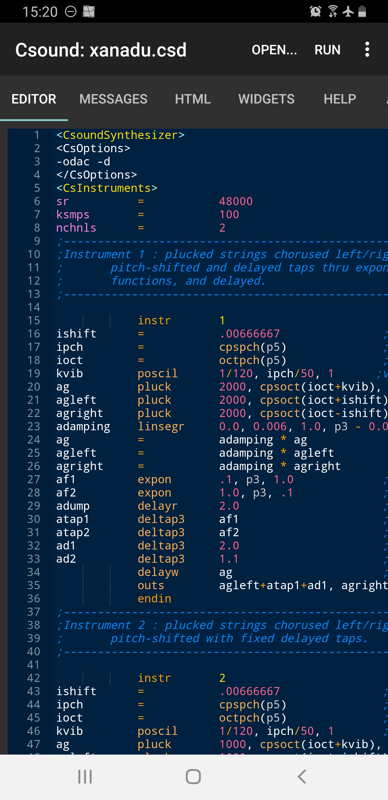
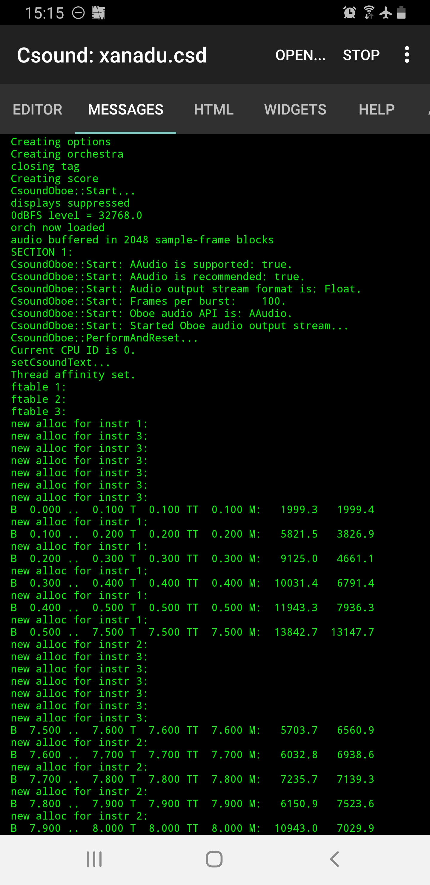
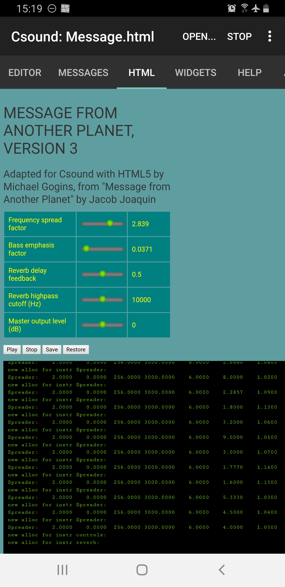
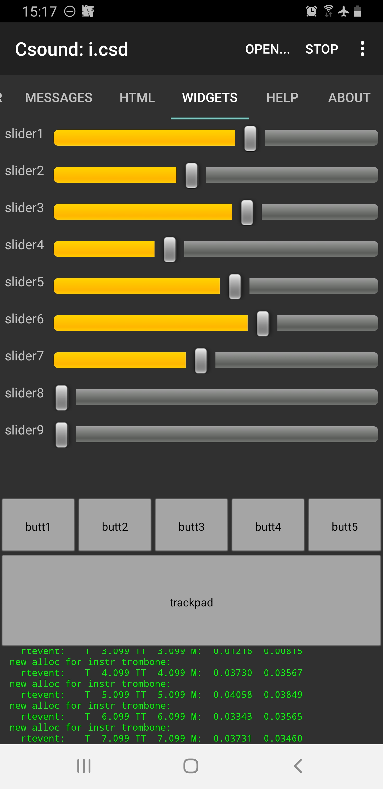

12 E. CSOUND ON ANDROID
=======================

There is no essential difference between running Csound on a computer and 
running it on a smartphone. Csound has been available on the Android platform 
since 2012 (Csound 5.19), thanks to the work of Victor Lazzarini and Steven 
Yi. Csound 6 was ported to Android, and enhanced, by Michael Gogins and Steven 
Yi in the summer of 2013.  
  
The following packages are available for Android:

1.  The *CsoundAndroid library*, which is intended to be used by
    developers for creating apps based on Csound. This is available for 
    download at [Csound's download page](https://csound.com/download.html).

2.  The *Csound for Android app*, which is a self-contained environment 
    for creating, editing, debugging, and performing Csound pieces on Android. 
    The app includes a number of built-in example pieces. This is available 
    from the [Google Play store](https://play.google.com/store/apps/details?id=com.csounds.Csound6),
    or for download from the [csound-extended](https://github.com/gogins/csound-extended) 
    repository [releases page](https://github.com/gogins/csound-extended/releases).

For more information about these packages, download them and consult the
documentation contained therein.

This chapter is about the Csound for Android app.

The Csound for Android app
--------------------------

The Csound for Android app permits the user, on any Android
device that is powerful enough, including most tablets and the most
powerful smartphones, to do most things that can be done with Csound on
any other platform such as OS X, Windows, or Linux. This includes creating 
Csound pieces, editing them in the built-in text editor, debugging them, and 
performing them, either in real time to audio output or to a soundfile for 
later playback.  

The app has a built-in, pre-configured user interface with nine sliders,
five push buttons, one trackpad, and a 3-dimensional accelerometer that
are pre-assigned to control channels which can be read using Csound's
[chnget](https://csound.com/docs/manual/chnget.html) opcode.  

The app also contains an embedded Web browser, based on WebKit, that 
implements most features of the HTML5 standard. This embedded browser can
run Csound pieces written as *.html* files. In addition, the app can render HTML and JavaScript code that is contained in an optional `<html>` element of a regular .csd file. 

In both cases, the JavaScript context of the Web page will contain a global 
Csound object with a JavaScript interface that implements useful functions 
of the Csound API. This can be used to control Csound from JavaScript, handle 
events from HTML user interfaces, generate scores, and do many other things. 
For a more complete introduction to the use of HTML with Csound, see 
[12 G](12-g-csound-and-html.md). 

The app has some limitations and missing features compared with the
longer-established platforms:

1.  There is no real-time MIDI input or output.
2.  Audio input is not always accurately synchronized with audio output.
3.  Some plugin opcodes are missing, including most opcodes involved
    with using other plugin formats or inter-process communications.

However, some of the more useful plugins are indeed available on
Android:

1.  The signal flow graph opcodes for routing audio from instruments to
    effects, etc.
2.  The FluidSynth opcodes for playing SoundFonts.
3.  The Open Sound Control (OSC) opcodes.
4.  The libstdutil library, which enables Csound to be used for various
    time/frequency analysis and resynthesis tasks, and for other
    purposes.

Installing the App
------------------

There are several ways to install the Csound for Android app. You can download it using
your device, or you can download it to a computer and transfer it to
your device. These methods are presented below.  

### Google Play Store

The most straightforward way to install the Csound for Android app is 
to get it from the [Google Play Store](https://play.google.com/store/apps/details?id=com.csounds.Csound6).

### Install from Another Source

#### Preparing Your Device

Using the *Csound for Android app* is similar to using an application on a regular computer. You need to be able to browse the file system.  

There are a number of free and paid apps that give users the ability to
browse the Linux file system that exists on all Android devices. If you
don't already have such a utility, you should install a file browser
that provides access to as much as possible of the file system on your
device, including system storage and external store such as an SD card.
The free
[AndroZip](https://play.google.com/store/apps/details?id=com.agilesoftresource&hl=en)
app can do this, for instance.

If you render soundfiles, they take up a lot of space. For example,
CD-quality stereo soundfiles (44.1 KHz, 16 bit) take up about 1
megabytes per minute of sound. Higher quality or more channels take up
even more room. But even without extra storage, a modern smartphone
should have gigabytes, thousands of megabytes, of free storage. This is
actually enough to make an entire album of pieces.  

On most devices, installing extra storage is easy and not very
expensive. Obtain the largest possible SD card, if your
device supports them. This will vastly expand the amount of available
space, up to 32 or 64 gigabytes or even more.  

#### Download to Device

To download the Csound for Android app to your device, go online using Google
Search or a Web browser. You can find the application package file,
CsoundApplication-release.apk, on the
[csound-extended releases page](https://github.com/gogins/csound-extended/releases)
(you may first have to allow your Android device to install an app which is not
in Google Play).  

Click on the filename to download the package. The download will happen
in the background. You can then go to the notifications bar of your
device and click on the downloaded file. You will be presented with one
or more options for how to install it. The installer will ask for
certain permissions, which you need to grant.  

#### Transfer from a Computer

It's also easy to download the CsoundApplication-release.apk file to a personal computer.
Once you have downloaded the file from GitHub, connect your device
to the computer with a USB cable. The file system of the device should
then automatically be mounted on the file system of the computer. Find
the CsoundApplication-release.apk in the computer's download directory, and copy the
CsoundApplication-release.apk file. Find your device's download directory, and paste the
CsoundApplication-release.apk file there.  

Then you will need to use a file browser that is actually on your
device, such as AndroZip. Browse to your Download directory, select the
CsoundApplication-release.apk file, and you should be presented with a choice of actions.
Select the Install action. The installer will ask for certain
permissions, which you should give.
  

User Interface
--------------

### Tabs

The Csound for Android app has a tabbed user interface. The tabs include:

-   ***EDITOR*** -- Built-in text editor for .csd and .html files.

{width=50%}

-   ***MESSAGES*** -- Displays runtime messages from Csound in a scrolling display.

{width=50%}

-   ***HTML*** -- Displays the Web page specified by HTML code in the piece, may 
                  include interactive widgets, 3-dimensional graphics, etc., etc.
                  
{width=50%}

-   ***WIDGETS*** -- Displays built-in widgets bound to control channels with 
                     predefined names.
                     
{width=50%}

-   ***HELP*** -- Displays the online Csound Reference Manual in an embedded Web
                  browser.
-   ***ABOUT*** -- Displays the Csound home page in an embedded Web browser.

### Main Menu

The app also has a top-level menu with the following commands:

-   ***NEW...*** -- creates a blank template CSD file in the root directory
    of the user's storage for the user to edit. The CSD file will be
    remembered and performed by Csound.
-   ***OPEN...*** -- opens an existing CSD file in the root directory of
    the user's storage. The user's storage filesystem can be navigated
    to find other files.
-   ***SAVE*** -- saves the current contents of the editor to its file.
-   ***RUN/STOP*** -- if a CSD file has been loaded, pushing the
    button starts running Csound; if Csound is running, pushing the
    button stops Csound. If the `<CsOptions>` element of the CSD file
    contains `-odac`, Csound's audio output will go to the device audio
    output. If the element contains `-osoundfilename`, Csound\'s audio
    output will go to the file `soundfilename`, which should be a valid
    Linux pathname in the user's storage filesystem.
-   ***Save as ...*** -- saves the current contents of the editor to a new file.
-   ***Examples*** -- shows a number of example pieces that may be loaded 
-   ***User guide*** -- a minimal guide to setting up and using the app.
                      into the editor and run.
-   ***Privacy policy*** -- presents the Csound for Android app's privacy policy.

The widgets are assigned control channel names *slider1* through *slider9*,
*butt1* through *butt5*, *trackpad.x*, and *trackpad.y*. In addition, the
accelerometer on the Android device is available as *accelerometerX*,
*accelerometerY*, and *accelerometerZ*.

The values of these widgets are normalized between 0 and 1, and can be
read into Csound during performance using the *chnget* opcode, like this:

    kslider1_value chnget "slider1"

The area below the trackpad prints messages output by Csound as it runs.

### Settings Menu

The Settings menu on your device offers the following choices:

-   ***Audio driver***  -- selects an *Automatic* choice of the optimal audio 
                           driver for your device (this is the default), 
                           the older *OpenSL ES* driver which supports both 
                           audio input and audio output, and the newer *AAudio*
                           driver that provides lower audio output latency on Oreo 
                           or later.
-   ***Plugins***       -- an (additional) directory for plugin opcodes.
-   ***Output***        -- overrides the default soundfile output directory.
-   ***Samples***       -- overrides the default directory from which load sound samples.
-   ***Analysis***      -- overrides the default directory from which to load analysis files.
-   ***Include***       -- overrides the default directory from which to load Csound `#include` files.

These settings are not required, but they can make using Csound easier
and faster to use.

Loading and Performing a Piece
-------------------------------

### Example Pieces

From the app's menu, select the *Examples* command, then select one
of the listed examples, for example *Xanadu* by Joseph Kung. You may
then click on the *RUN* button to perform the example, or the
*EDITOR* tab to view the code for the piece. If you want to
experiment with the piece, you can use the *Save as...* command to
save a copy on your device's file system under a different name. You
can then edit the piece and save your changes.

### Running an Existing Piece

If you have access to a mixer and monitor speakers, or even a home
stereo system, or even a boom box, you can hook up your device's
headphone jack to your sound system with an adapter cable. Most devices
have reasonably high quality audio playback capabilities, so this can
work quite well.

Just to prove that everything is working, start the Csound for Android app. Go 
to the app menu, select the *Examples* item, select the *Xanadu*
example, and it will be loaded into Csound. Then click on the *RUN*
command. Its name should change to *STOP*, and Csound's runtime messages
should begin to scroll down the *MESSAGES* tab. At the same time, you should 
hear the piece play. You can stop the performance at any time by selecting the 
*STOP* command, or you can let the performance complete on its own.

That's all there is to it. You can scroll up and down in the messages
pane if you need to find a particular message, such as an error or
warning.

If you want to look at the text of the piece, or edit it, select the
*Edit* button. If you have installed Jota, that editor should open with
the text of the piece, which you can save, or not. You can edit the
piece with the this editor, and any changes you make and save will be
performed the next time you start the piece.

Creating a New Piece
--------------------

This example will take you through the process of creating a new Csound
piece, step by step. Obviously, this piece is not going to reveal
anything like the full power of Csound. It is only intended to get you
to the point of being able to create, edit, and run a Csound piece that
will actually make sound on your Android device -- from scratch.

Run the *Csound for Android* app and select the *NEW...* command. You should be 
presented with an file dialog asking you for a filename for your piece. Type in 
*toot.csd*, and select the *SAVE* button. The file will be stored in the root
directory of your user storage on your device. You can save the file to
another place if you like.

The text editor should open with a *template* CSD file. Your job is to
fill out this template to hear something.

Create a blank line between `<CsOptions>` and `</CsOptions>`, and type
`-odac -d -m3`. This means send audio to the real-time output (`-odac`), do
not display any function tables (`-d`), and log some informative messages
during Csound's performance (`-m3`).

Create a blank line between `<CsInstruments>` and `</CsInstruments>` and
type the following text:

    sr = 44100
    ksmps = 32
    nchnls = 1
    0dbfs = 1
    instr 1
     asignal poscil 0.2, 440
     out asignal
    endin

This is just about the simplest possible Csound orchestra. The orchestra
header specifies an audio signal sampling rate of 44,100 frames per
second, with 32 audio frames per control signal sample, and one channel
of audio output. The instrument is just a simple sine oscillator. It
plays a tone at concert A.

Create a blank line between `<CsScore>` and `</CsScore>` and type:

    i1 0 5

This means play instrument 1 starting at time 0 for 5 seconds.

Select the app's *SAVE* button.

Select the Csound app's *RUN* button. You should hear a loud sine
tone for 5 seconds. If you don't hear anything, perhaps your device 
doesn't support audio at 44100 Hertz, so try `sr = 48000` instead.  

If you want to save your audio output to a soundfile named `test.wav`,
change `-odac` above to, for example, `-o/storage/emulated/0/Music/test.wav`. Android is fussy about 
writing to device storage, so you may need to use exactly the directory printed 
in the ***MESSAGES*** tab when the app starts.  

That's it!

Using the Widgets
-----------------

This section shows how to use the built-in widgets of the Csound for
Android app for controlling Csound in performance. For instructions on
how to use the `<html>` element of the CSD file to create custom user
interfaces, see the [Csound and HTML](12-g-csound-and-html.md) chapter of 
this book.

The Csound for Android app provides access to a set of predefined
on-screen widgets, as well as to the accelerometer on the device. All of
these controllers are permanently assigned to pre-defined control
channels with pre-defined names, and mapped to a pre-defined range of
values, from 0 to 1.

You should be able to cut and paste this code into your own pieces
without many changes.

The first step is to declare one global variable for each of the control
channels, with the same name as the control channel, at the top of the
orchestra header, initialized to a value of zero:

    gkslider1 init 0
    gkslider2 init 0
    gkslider3 init 0
    gkslider4 init 0
    gkslider5 init 0
    gkslider6 init 0
    gkslider7 init 0
    gkslider8 init 0
    gkslider9 init 0
    gkbutt1 init 0
    gkbutt2 init 0
    gkbutt3 init 0
    gkbutt4 init 0
    gkbutt5 init 0
    gktrackpadx init 0
    gktrackpady init 0
    gkaccelerometerx init 0
    gkaccelerometery init 0
    gkaccelerometerz init 0

Then write an *always-on* instrument that reads each of these control
channels into each of those global variables. At the top of the
orchestra header:

    alwayson "Controls"

As the next to last instrument in your orchestra:

    instr Controls
     gkslider1 chnget "slider1"
     gkslider2 chnget "slider2"
     gkslider3 chnget "slider3"
     gkslider4 chnget "slider4"
     gkslider5 chnget "slider5"
     gkslider6 chnget "slider6"
     gkslider7 chnget "slider7"
     gkslider8 chnget "slider8"
     gkslider9 chnget "slider9"
     gkbutt1 chnget "butt1"
     gkbutt2 chnget "butt2"
     gkbutt3 chnget "butt3"
     gkbutt4 chnget "butt4"
     gkbutt5 chnget "butt5"
     gktrackpadx chnget "trackpad.x"
     gktrackpady chnget "trackpad.y"
     gkaccelerometerx chnget "accelerometerX"
     gkaccelerometery chnget "accelerometerY"
     gkaccelerometerz chnget "accelerometerZ"
    endin

So far, everything is common to all pieces. Now, for each specific piece
and specific set of instruments, write another *always-on* instrument that
will map the controller values to the names and ranges required for your
actual instruments. This code, in addition, can make use of the peculiar
button widgets, which only signal changes of state and do not report
continuously whether they are *on* or *off*. These examples are from
*Gogins/Drone-IV.csd*.

At the top of the orchestra header:

    alwayson "VariablesForControls"

As the very last instrument in your orchestra:

    instr VariablesForControls
    if gkslider1 > 0 then
       gkFirstHarmonic = gkslider1 * 2
       gkgrainDensity = gkslider1 * 400
       gkratio2 = gkslider1 ;1/3
    endif
    if gkslider2 > 0 then
       gkDistortFactor = gkslider2 * 2
       gkgrainDuration = 0.005 + gkslider2 / 2
       gkindex1 = gkslider2 * 4
    endif
    if gkslider3 > 0 then
       gkVolume = gkslider3 * 5
       gkgrainAmplitudeRange = gkslider3 * 300
       gkindex2 = gkslider3 ;0.0125
    endif
    if gkslider4 > 0 then
       gkgrainFrequencyRange = gkslider4 / 10
    endif
    if gktrackpady > 0 then
       gkDelayModulation = gktrackpady * 2
       ; gkGain = gktrackpady * 2 - 1
    endif
    if gktrackpadx > 0 then
       gkReverbFeedback = (3/4) + (gktrackpadx / 4)
       ; gkCenterHz = 100 + gktrackpadx * 3000
    endif
    kbutt1 trigger gkbutt1, .5, 0
    if kbutt1 > 0 then
       gkbritels = gkbritels / 1.5
       gkbritehs = gkbritehs / 1.5
       ; gkQ = gkQ / 2
    endif
    kbutt2 trigger gkbutt2, .5, 0
    if kbutt2 > 0 then
       gkbritels = gkbritels * 1.5
       gkbritehs = gkbritehs * 1.5
       ; gkQ = gkQ * 2
    endif
    endin

Now, the controllers are re-mapped to sensible ranges, and have names
that make sense for your instruments. They can be used as follows. Note
particularly that, just above the instrument definition, in other words
actually in the orchestra header, these global variables are initialized
with values that will work in performance, in case the user does not set
up the widgets in appropriate positions before starting Csound. This is
necessary because the widgets in the Csound for Android app, unlike say the widgets
in CsoundQt, do not "remember" their positions and values from
performance to performance.

    gkratio1 init 1
    gkratio2 init 1/3
    gkindex1 init 1
    gkindex2 init 0.0125
    instr Phaser
     insno = p1
     istart = p2
     iduration = p3
     ikey = p4
     ivelocity = p5
     iphase = p6
     ipan = p7
     iamp = ampdb(ivelocity) * 8
     iattack = gioverlap
     idecay = gioverlap
     isustain = p3 - gioverlap
     p3 = iattack + isustain + idecay
     kenvelope transeg 0.0, iattack / 2.0, 1.5, iamp / 2.0, iattack / 2.0,
          -1.5, iamp, isustain, 0.0, iamp, idecay / 2.0, 1.5, iamp / 2.0,
          idecay / 2.0, -1.5, 0
     ihertz = cpsmidinn(ikey)
     print insno, istart, iduration, ikey, ihertz, ivelocity, iamp, iphase, ipan
     isine ftgenonce 0,0,65536,10,1
     khertz = ihertz
     ifunction1 = isine
     ifunction2 = isine
     a1,a2 crosspm gkratio1, gkratio2, gkindex1, gkindex2,
                  khertz, ifunction1, ifunction2
     aleft, aright pan2 a1+a2, ipan
     adamping linseg 0, 0.03, 1, p3 - 0.1, 1, 0.07, 0
     aleft = adamping * aleft * kenvelope
     aright = adamping * aright * kenvelope
     outleta "outleft", aleft
     outleta "outright", aright
    endin

