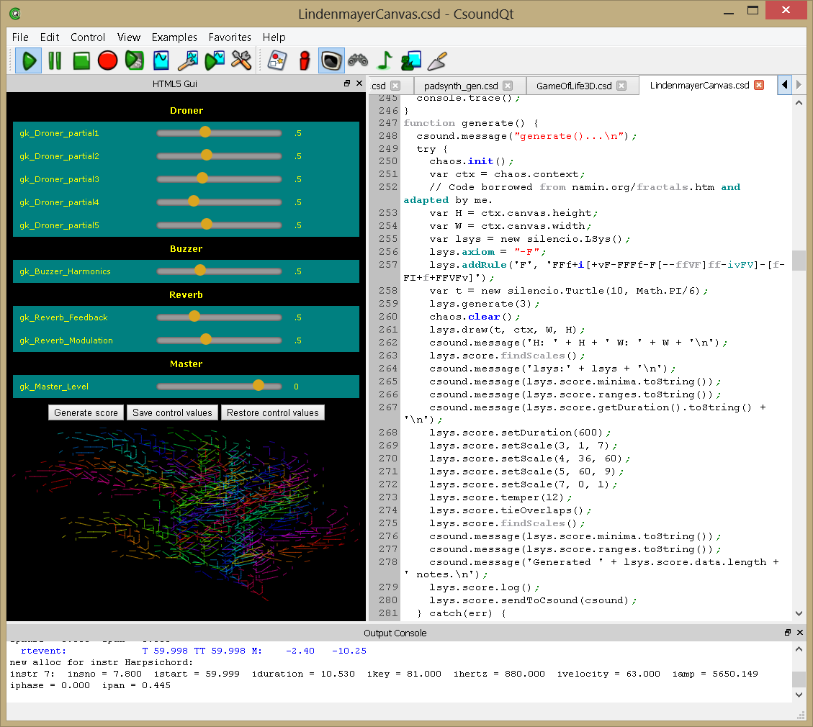

12 G. CSOUND AND HTML
=====================

Introduction
-------------

Certain Csound front ends, currently including CsoundQt and Csound for
Android, have the ability to use HTML to define user interfaces, to
control Csound, and to generate Csound scores and even orchestras. The
HTML code is embedded in the optional `<html>` element of the Csound
Structured Data (CSD) file. This element essentially defines a Web page
that contains Csound.

This chapter is organized as follows:

1.  Introduction (this section)
2.  Installation
3.  Tutorial User's Guide
4.  Conclusion

HTML must be understood here to represent not only Hyper Text Markup
Language, but also all of the other Web standards that currently are
supported by Web browsers, Web servers, and the Internet, including
cascading style sheets (CSS), HTML5 features such as drawing on a
graphics canvas visible in the page, producing animated 3-dimensional
graphics with WebGL including shaders and GPU acceleration, Web Audio,
various forms of local data storage, Web Sockets, and so on and so on.
This whole conglomeration of standards is currently defined and
maintained under the non-governmental leadership of the
[World Wide Web Consortium](http://www.w3.org/standards/) (W3C)
which in turn is
primarily driven by commercial interests belonging to the
[Web Hypertext Application Technology Working Group](https://whatwg.org/) (WHATWG).
Most modern Web browsers implement almost all of the W3C standards up to
and including HTML5 at an impressive level of performance and
consistency. To see what features are available in your own Web browser,
go to this [test page](https://html5test.com/). All of this stuff is now
usable in Csound pieces.

### Examples of Use

For an example of a few of the things are possible with HTML in Csound,
take a look at the following screen shots. Both of these examples are
included in the Windows installer for Csound, which also includes the
HTML-enabled version of CsoundQt.

In this figure, *GameOfLife3d.csd* demonstrates the following features of
HTML: style sheets for formatting the legend, WebGL for displaying a
rotating 3-dimensional form of John Conway's *Game of Life* with shifting
lighting, animation which "tweens" the cubes from one state of the
game to the next, and the Csound API. The JavaScript code that generates
the display also builds up a chunk of Csound score that is sent to
Csound. Thus, each new state of the game plays a chord using Csound
instruments.  The user can interact with the game, rotating it and
zooming it.

In the *LindenmayerCanvas.csd* shown here, the HTML code is used to do these
things:

1.  Define slider widgets for controlling Csound with the channel API,
    using HTML input elements with JavaScript event handlers.
2.  Style the sliders and the table containing them with a Custom Style
    Sheet (CSS).
3.  Save the positions of the widgets when the *Save control values*
    button is clicked, and restore the positions of the widgets when the
    *Restore control values* button is clicked, using the Local
    Storage feature of HTML5. These values are retrieved whenever the
    piece is loaded.
4.  Use JavaScript to define a context-free Lindenmayer system for
    generating not only the tree image drawn on the HTML Canvas at the
    bottom of the screen, but also a Csound score representing the tree,
    when the *Generate score* button is clicked. Being able to see
    some sort of graphical representation of a score is very useful when
    doing algorithmic composition.

It is true that LaTeX can do a better job of typesetting than HTML and
CSS. It is true that game engines can do a better job for interactive,
3-dimensional computer animation with scene graphs than WebGL. It is
true that compiled C or C++ code runs faster than JavaScript. It is true
that Haskell is a more fully-featured functional programming language
than JavaScript. It is true that MySQL is a more powerful database than
HTML5 storage.

But the fact is, there is no single program except for a Web browser
that manages to be quite functional in all of these categories in a way
that beginning to intermediate programmers can use, and for which the
only required runtime is the Web browser itself.

For this reason alone, HTML makes a very good front end for Csound.
Furthermore, the Web standards are maintained in a stable form by a
large community of competent developers representing diverse interests.
So I believe HTML as a front end for Csound should be quite stable and
remain backwardly compatible, just as Csound itself remains backwardly
compatible with old pieces.

### How it Works

The Web browser embedded into CsoundQt is the
[Chromium Embedded Framework](https://bitbucket.org/chromiumembedded/cef).
The Web browser embedded into Csound for Android is the
[WebView](http://developer.android.com/reference/android/webkit/WebView.html)
available in the
[Android SDK](https://developer.android.com/index.html).

The front end parses the `<html>` element out of the CSD file and simply
saves it as an HTML file, in other words, as a Web page. For example,
*MyCsoundPiece.csd* will produce
[MyCsoundPiece.csd.html.](http://MyCsoundPiece.csd.html) The front
end's embedded browser then loads this Web page, compiles it, displays
it, executes any scripts contained in it, and lets the user interact
with it.

It is important to understand that *any* valid HTML code can be used in
Csound\'s `<html>` element. It is just a Web page like any other Web
page.

In general, the different Web standards are either defined as JavaScript
classes and libraries, or glued together using JavaScript. In other
words, HTML without JavaScript is dead, but HTML with JavaScript
handlers for HTML events and attached to the document elements in the
HTML code, comes alive. Indeed, JavaScript can itself define HTML
documents by programmatically creating Document Object Model objects.

JavaScript is the engine and the major programming language of the World
Wide Web in general, and of code that runs in Web browsers in
particular. JavaScript is a standardized language, and it is a
functional programming language not that dissimilar in concept from
Scheme. JavaScript also allows classes to be defined by prototypes.

The JavaScript execution context of a Csound Web page contains Csound
itself as a *csound* JavaScript object that has the following methods:

    getVersion() [returns a number]
    compileOrc(orchestra_code) and
    evalCode(orchestra_code) [returns the numeric result of the evaluation]
    readScore(score_lines)
    setControlChannel(channel_name,number)
    getControlChannel(channel_name) [returns a number representing the channel value]
    message(text)
    getSr() [returns a number]
    getKsmps() [returns a number]
    getNchnls() [returns a number]
    isPlaying() [returns 1 if Csound is playing, 0 if not]

The front end contains a mechanism for forwarding JavaScript calls in
the Web page's JavaScript context to native functions that are defined
in the front end, which passes them on to Csound. This involves a small
amount of C++ glue code that the user does not need to know about. In
CsoundQt, the glue code uses asynchronous IPC because the Chromium
Embedded Framework forks several threads or even processes to implement
the Web browser, but again, the user does not need to know anything
about this.

In the future, more functions from the Csound API will be added to this
JavaScript interface, including, at least in some front ends, the
ability for Csound to appear as a Node in a Web Audio graph (this
already is possible in the Emscripten built of Csound).

Also in the future, the JavaScript methods of Csound in Emscripten will
be harmonized with these methods.

Also in the future, there will be a native Node extension for the NW.js
HTML5 desktop application framework, providing the same JavaScript
interface to Csound.

Installation
------------

On Windows, simply download the current Csound installer from
SourceForge and use it to install Csound on your computer. HTML is
enabled by default in CsoundQt, which is included in the installer.

On Android, simply download the current Csound6.apk from SourceForge and
use it to install Csound on your Android device. This can be any
reasonably powerful Android smartphone or tablet. HTML is enabled by
default, but the HTML5 features that are available will depend upon your
version of Android.

Currently, WebGL may or may not be enabled on Android, depending on your
versions of hardware and software.

Tutorial User Guide
--------------------

Let's get started and do a few things in the simplest possible way, in
a series of *toots*. These pieces also are included in the
examples/html directory of the Windows installation and can be found in
the Csound Git repository as well.

1.  Display \"Hello, World, this is Csound!\" in HTML.
2.  Create a button that will generate a series of notes based on the
    logistic equation.
3.  Create a slider to set the value of the parameter that controls the
    degree of chaos produced by iterating the logistic equation, and two
    other sliders to control the frequency ratio and modulation index of
    the FM instrument that plays the notes from the logistic equation.
4.  Style the HTML elements using a style sheet.

   ***EXAMPLE 12G01_HelloWorld.csd***

This is the bare minimum CSD that shows some HTML output. In its
entirety it is:

~~~
<CsoundSynthesizer>
<CsOptions>
</CsOptions>
<CsInstruments>
sr = 44100
ksmps = 128
nchnls = 2
0dbfs = 1.0
</CsInstruments>
<html>
Hello, World, this is Csound!
</html>
<CsScore>
</CsScore>
</CsoundSynthesizer>
;example by Michael Gogins
~~~

Not much to it. HTML is full of graceful defaults. In HTML, plain text
without any tags is imply printed as plain text.

### 02_ScoreGenerator.csd

Here I have introduced a simple Csound orchestra consisting of a single
frequency modulation instrument feeding first into a reverberation
effect, and then into a master output unit. These are connected using
the signal flow graph opcodes. The actual orchestra is of little
interest here. And this piece has no score, because the score will be
generated at run time. In the `<html>` element, I also have added this
button:

    <button onclick="generate()"> Generate score </button>

When this button is clicked, it calls a JavaScript function that uses
the logistic equation, which is a simple quadratic dynamical system,  to
generate a Csound score from a chaotic attractor of the system. This
function also is quite simple. Its main job, aside from iterating the
logistic equation a few hundred times, is to translate each iteration of
the system into a musical note and send that note to Csound to be played
using the Csound API function readScore(). So the following `

### 03_Sliders.csd

The next step is to add more user control to this piece. We will enable
the user to control the attractor of the piece by varying the constant
*c*, and we will enable the user to control the sound of the Csound
orchestra by varying the  frequency modulation index, frequency
modulation carrier ratio, reverberation time, and master output level.

This code is demonstrated on a low level, so that you can see all of the
details and understand exactly what is going on. A real piece would most
likely be written at a higher level of abstraction, for example by using
a third party widget toolkit, such as jQuery UI.

A slider in HTML is just an `input` element like this:

    <input type=range min=0 max=1 value=.5 id=sliderC step=0.001 oninput="on_sliderC(value)">

This element has attributes of minimum value 0, maximum value 1, which
normalizes the user's possible values between 0 and 1. This could be
anything, but in many musical contexts, for example VST plugins, user
control values are always normalized between 0 and 1. The tiny `step`
attribute simply approximates a continuous range of values.

The most important thing is the `oninput` attribute, which sets the
value of a JavaScript event handler for the `oninput` event. This
function is called whenever the user changes the value of the slider.

For ease of understanding, a naming convention is used here, with
*sliderC* being the basic name and other names of objects associated
with this slider taking names built up by adding prefixes or suffixes
to this basic name.

Normally a slider has a label, and it is convenient to show the actual
numerical value of the slider. This can be done like so:

    <table>
    <col width="2*">
    <col width="5*">
    <col width="100px">
    <tr>
    <td>
    <label for=sliderC>c</label>
    <td>
    <input type=range min=0 max=1 value=.5 id=sliderC step=0.001 oninput="on_sliderC(value)">
    <td>
    <output for=sliderC id=sliderCOutput>.5</output>
    </tr>
    </table>

If the slider, its label, and its numeric display are put into an HTML
table, that table will act like a layout manager in a standard widget
toolkit, and will resize the contained elements as required to get them
to line up.

For this slider, the JavaScript handler is:

    function on_sliderC(value) {
        c = parseFloat(value);
        document.querySelector('#sliderCOutput').value = c;
    }

The variable *c* was declared at global scope just above the generate()
function, so that variable is accessible within the *on_sliderC*
function.

Keep in mind, if you are playing with this code, that a new value of *c*
will only be heard when a new score is generated.

Very similar logic can be used to control variables in the Csound
orchestra. The value of the slider has to be sent to Csound using the
channel API, like this:

    function on_sliderFmIndex(value) {
        var numberValue = parseFloat(value);
        document.querySelector('#sliderFmIndexOutput').value = numberValue;
        csound.setControlChannel('gk_FmIndex', numberValue);
    }

Then, in the Csound orchestra, that value has to be retrieved using the
chnget opcode and applied to the instrument to which it pertains. It is
most efficient if the variables controlled by channels are global
variables declared just above their respective instrument definitions.
The normalized values can be rescaled as required in the Csound
instrument code.

    gk_FmIndex init 0.5
    instr ModerateFM
    ...
    kindex = gk_FmIndex * 20
    ...
    endin

Also for the sake of efficiency, a global, always-on instrument can be
used to read the control channels and assign their values to these
global variables:

    instr Controls
    gk_FmIndex_ chnget "gk_FmIndex"
    if gk_FmIndex_  != 0 then
     gk_FmIndex = gk_FmIndex_
    endif
    gk_FmCarrier_ chnget "gk_FmCarrier"
    if gk_FmCarrier_  != 0 then
     gk_FmCarrier = gk_FmCarrier_
    endif
    gk_ReverberationDelay_ chnget "gk_ReverberationDelay"
    if gk_ReverberationDelay_  != 0 then
     gk_ReverberationDelay = gk_ReverberationDelay_
    endif
    gk_MasterLevel_ chnget "gk_MasterLevel"
    if gk_MasterLevel_  != 0 then
     gk_MasterLevel = gk_MasterLevel_
    endif
    endin

Note that each actual global variable has a default value, which is only
overridden if the user actually operates its slider.

### 04_CustomStyle.csd

The default appearance of HTML elements is brutally simple. But each
element has attributes that can be used to change its appearance, and
these offer a great deal of control.

Of course, setting for example the font attribute for each label on a
complex HTML layout is tedious. Therefore, this example shows how to use
a style sheet. We don't need much style to get a much improved
appearance:

    

This little style sheet is generic, that is, it applies to every element
on the HTML page. It says, for example, that *table td* (table cells)
are to have a yellow sans-serif font on a teal background, and this will
apply to every table cell on the page. Style sheets can be made more
specialized by giving them names. But for this kind of application, that
is not usually necessary.

Conclusion
-----------

Most, if not all all, of the functions performed by other Csound front
ends could be encompassed by HTML and JavaScript. However, there are a
few gotchas. For CsoundQt and other front ends based on Chrome, there
may be extra latency and processing overhead required by inter-process
communications. For Emscripten and other applications that use Web
Audio, there may also be additional latency.

Obviously, much *more* can be done with HTML, JavaScript, and other Web
standards found in contemporary Web browsers. Full-fledged,
three-dimensional, interactive, multi-player computer games are now
being written with HTML and JavaScript. Other sorts of Web applications
also are being written this way.

Sometimes, JavaScript is embedded into an application for use as a
scripting language. The Csound front ends discussed here are examples,
but there are others. For example, Max for Live can be programmed in
JavaScript, and so can the open source score editor MuseScore. In fact,
in MuseScore, JavaScript can be used to algorithmically generate notated
scores.
