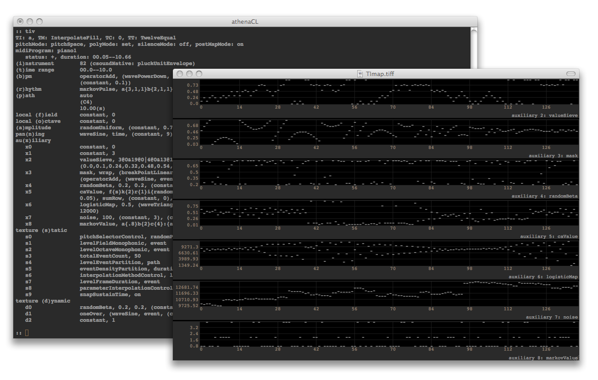
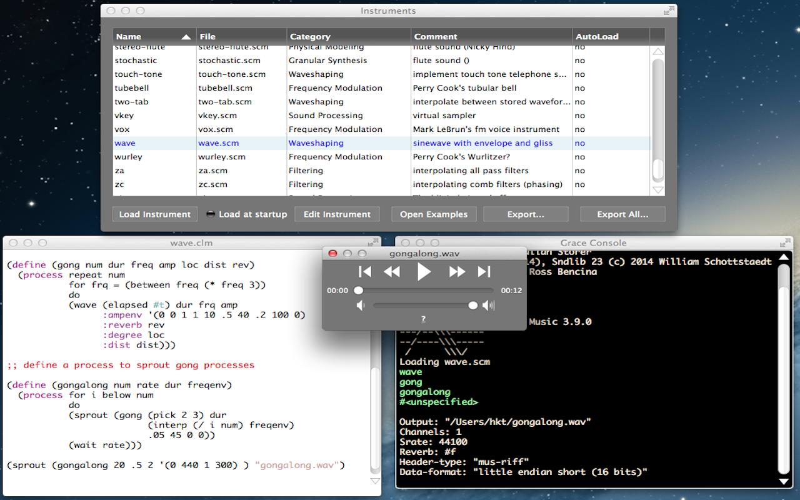

14 A. METHODS OF WRITING CSOUND SCORES
======================================

Although the use of Csound real-time has become more prevalent and
arguably more important whilst the use of the score has diminished and
become less important, composing using score events within the Csound
score remains an important bedrock to working with Csound. There are
many methods for writing Csound score several of which are covered here;
starting with the classical method of writing scores by hand, then with
the definition of a user-defined score language, and concluding several
external Csound score generating programs.

Writing Score by Hand
---------------------

In Csound's original incarnation the orchestra and score existed as
separate text files. This arrangement existed partly in an attempt to
appeal to composers who had come from a background of writing for
conventional instruments by providing a more familiar paradigm. The
three unavoidable attributes of a note event - which instrument plays
it, when, and for how long - were hardwired into the structure of a note
event through its first three attributes or "p-fields". All additional
attributes (p4 and beyond), for example: dynamic, pitch, timbre, were
left to the discretion of the composer, much as they would be when
writing for conventional instruments. It is often overlooked that when
writing score events in Csound we define start times and durations in
*beats*. It just so happens that 1 beat defaults to a duration of 1
second leading to the consequence that many Csound users spend years
thinking that they are specifying note events in terms of seconds rather
than beats. This default setting can easily be modified and manipulated
as shown later on.

The most basic score event as described above might be something like
this:

     i 1 0 5

which would demand that instrument number 1 play a note at time zero
(beats) for 5 beats. After time of constructing a score in this manner
it quickly becomes apparent that certain patterns and repetitions recur.
Frequently a single  instrument will be called repeatedly to play the
notes that form a longer phrase therefore diminishing the worth of
repeatedly typing the same instrument number for p1, an instrument may
play a long sequence of notes of the same duration as in a phrase of
running semiquavers rendering the task of inputting the same value for
p3 over and over again slightly tedious and often a note will follow on
immediately after the previous one as in a legato phrase intimating that
the p2 start-time of that note might better be derived from the duration
and start-time of the previous note by the computer than to be figured
out by the composer. Inevitably short-cuts were added to the syntax to
simplify these kinds of tasks:

    i 1 0 1 60
    i 1 1 1 61
    i 1 2 1 62
    i 1 3 1 63
    i 1 4 1 64

 could now be expressed as:

    i 1 0 1 60
    i . + 1 >
    i . + 1 >
    i . + 1 >
    i . + 1 64

where `.` would indicate that that p-field would reuse the same
p-field value from the previous score event, where `+`, unique for p2,
would indicate that the start time would follow on immediately after the
previous note had ended and `>` would create a linear ramp from the
first explicitly defined value (60) to the next explicitly defined value
(64) in that p-field column (p4).

A more recent refinement of the p2 shortcut allows for staccato notes
where the rhythm and timing remain unaffected. Each note lasts for 1/10
of a beat and each follows one second after the previous.

    i 1 0   .1 60
    i . ^+1 .  >
    i . ^+1 .  >
    i . ^+1 .  >
    i . ^+1 .  64

The benefits offered by these short cuts quickly becomes apparent when
working on longer scores. In particular the editing of critical values
once, rather than many times is soon appreciated.

Taking a step further back, a myriad of score tools, mostly also
identified by a single letter, exist to manipulate entire sections of
score. As previously mentioned Csound defaults to giving each beat a
duration of 1 second which corresponds to this `t` statement at the
beginning of a score:

    t 0 60

"At time (beat) zero set tempo to 60 beats per minute"; but this could
easily be anything else or evena string of tempo change events following
the format of a
[linsegb](https://csound.com/docs/manual/linsegb.html) statement.

    t 0 120 5 120 5 90 10 60

This time tempo begins at 120bpm and remains steady until the 5th beat,
whereupon there is an immediate change to 90bpm; thereafter the tempo
declines in linear fashion until the 10th beat when the tempo has
reached 60bpm.

`m` statements allow us to define sections of the score that might be
repeated (`s` statements marking the end of that section). `n`
statements referencing the name given to the original `m` statement
via their first parameter field will call for a repetition of that
section.

    m verse
    i 1 0   1 60
    i . ^+1 .  >
    i . ^+1 .  >
    i . ^+1 .  >
    i . ^+1 . 64
    s
    n verse
    n verse
    n verse

Here a *verse* section is first defined using an `m` section (the
section is also played at this stage). `s` marks the end of the
section definition and `n` recalls this section three more times.

Just a selection of the techniques and shortcuts available for
hand-writing scores have been introduced here (refer to the 
[Csound Reference Manual](https://csound.com/docs/manual/index.html) for a
more encyclopedic overview). It has hopefully become clear however that
with a full knowledge and implementation of these techniques the user
can adeptly and efficiently write and manipulate scores by hand.

Extension of the Score Language: *bin="..."* 
----------------------------------------------

It is possible to pass the score as written through a pre-processor
before it is used by Csound to play notes. instead it can be first
interpretted by a binary (application), which produces a usual csound
score as a result. This is done by the statement `bin="..."` in the
\<CsScore\> tag. What happens?

1.  If just a binary is specified, this binary is called and two files
    are passed to it:
    1.  A copy of the user written score. This file has the suffix
        *.ext* 
    2.  An empty file which will be read after the interpretation by
        Csound. This file has the usual score suffix *.sco*
2.  If a binary and a script is specified, the binary calls the script
    and passes the two files to the script.

If you have Python  installed on your computer, you should be able to
run the following examples. They do actually nothing but print the
arguments (= file names).

### Calling a binary without a script 

   ***EXAMPLE 14A01_Score_bin.csd***

    <CsoundSynthesizer> 
    <CsInstruments> 
    instr 1 
    endin 
    </CsInstruments>
    <CsScore bin="python3"> 
    from sys import argv 
    print("File to read = '%s'" % argv[0])
    print("File to write = '%s'" % argv[1])
    </CsScore> 
    </CsoundSynthesizer>

When you execute this .csd file in the terminal, your output should
include something like this: 

    File to read = '/tmp/csound-idWDwO.ext'
    File to write = '/tmp/csound-EdvgYC.sco'

And there should be a complaint because the empty .sco file has not been
written:

    cannot open scorefile /tmp/csound-EdvgYC.sco

### Calling a binary and a script

To test this, first save this file as *print.py* in the same folder
where your .csd examples are:

    from sys import argv
    print("Script = '%s'" % argv[0])
    print("File to read = '%s'" % argv[1])
    print("File to write = '%s'" % argv[2])

Then run this csd:

   ***EXAMPLE 14A02_Score_bin_script.csd***

    <CsoundSynthesizer>
    <CsInstruments>
    instr 1
    endin
    </CsInstruments>
    <CsScore bin="python3 print.py">
    </CsScore>
    </CsoundSynthesizer>

The output should include these lines:

    Script = 'print.py'
    File to read = '/tmp/csound-jwZ9Uy.ext'
    File to write = '/tmp/csound-NbMTfJ.sco'

And again a complaint about the invalid score file:

    cannot open scorefile /tmp/csound-NbMTfJ.sco

### CsBeats

As an alternative to the classical Csound score,
[CsBeats](https://csound.com/docs/manual/CsBeats.html) is included
with Csound. This is a domain specific language tailored to the concepts
of beats, rhythm and standard western notation. To use Csbeat, specify
"csbeats" as the CsScore bin option in a Csound unified score file.

    <CsScore bin="csbeats">

For more information, refer to the 
[Csound Manual](https://csound.com/docs/manual/CsBeats.html).

### Scripting Language Examples

The following example uses a perl script to allow seeding options in the
score. A random seed can be set as a comment; like *;;SEED 123*. If no
seed has been set, the current system clock is used. So there will be a
different value for the first three random statements, while the last
two statements will always generate the same values.

   ***EXAMPLE 14A03_Score_perlscript.csd*** 

    <CsoundSynthesizer>
    <CsInstruments>
    ;example by tito latini

    instr 1
      prints "amp = %f, freq = %f\n", p4, p5;
    endin

    </CsInstruments>
    <CsScore bin="perl cs_sco_rand.pl">

    i1  0  .01  rand()   [200 + rand(30)]
    i1  +  .    rand()   [400 + rand(80)]
    i1  +  .    rand()   [600 + rand(160)]
    ;; SEED 123
    i1  +  .    rand()   [750 + rand(200)]
    i1  +  .    rand()   [210 + rand(20)]
    e

    </CsScore>
    </CsoundSynthesizer>

    # cs_sco_rand.pl
    my ($in, $out) = @ARGV;
    open(EXT, "<", $in);
    open(SCO, ">", $out);

    while (<EXT>) {
      s/SEED\s+(\d+)/srand($1);$&/e;
      s/rand\(\d*\)/eval $&/ge;
      print SCO;
    }

Pysco
-----

[Pysco](http://jacobjoaquin.github.com/csd/pysco.html) is a modular
Csound score environment for event generation, event processing, and the
fashioning musical structures in time. Pysco is non-imposing and does
not force composers into any one particular compositional model;
Composers design their own score frameworks by importing from existing
Python libraries, or fabricate their own functions as needed. It fully
supports the existing classical Csound score, and runs inside a unified
CSD file. The sources are 
[on github](https://github.com/jacobjoaquin/csd/tree/master/demo/pysco), 
so although the code is still using Python2, it can certainly serve as an example about the possibilities of using Python as score scripting language.

Pysco is designed to be a giant leap forward from the classical Csound
score by leveraging Python, a highly extensible general-purpose
scripting language. While the classical Csound score does feature a
small handful of score tricks, it lacks common computer programming
paradigms, offering little in terms of alleviating the tedious process
of writing scores by hand. Python plus the Pysco interface transforms
the limited classical score into highly flexible and modular text-based
compositional environment.

### Transitioning away from the Classical Csound Score

Only two changes are necessary to get started. First, the optional *bin* argument for the CsScore tag needs to specify "python pysco.py" . Second, all existing classical Csound score code works when placed inside the *score()*
function.

    <CsScore bin="python pysco.py">

    score('''
    f 1 0 8192 10 1
    t 0 144
    i 1 0.0 1.0 0.7 8.02
    i 1 1.0 1.5 0.4 8.05
    i 1 2.5 0.5 0.3 8.09
    i 1 3.0 1.0 0.4 9.00
    ''')

    </CsScore>

Boiler plate code that is often associated with scripting and scoring,
such as file management and string concatenation, has been conveniently
factored out.

The last step in transitioning is to learn a few of Python or Pysco
features. While Pysco and Python offers an incredibly vast set of tools
and features, one can supercharge their scores with only a small
handful.

### Managing Time with the *cue()*

The *cue()* object is the Pysco 
[context manager](http://docs.python.org/2/reference/datamodel.html#context-managers)
for controlling and manipulating time in a score. Time is a fundamental
concept in music, and the *cue()* object elevates the role of time to that
of other control such as *if* and *for* statements, synthesizing time into
the form of the code.

In the classical Csound score model, there is only the concept of beats.
This forces composers to place events into the global timeline, which
requires an extra added incovenience of calculating start times for
individual events. Consider the following code in which measure 1 starts
at time 0.0 and measure 2 starts at time 4.0.

    ; Measure 1
    i 1 0.0 1.0 0.7 8.02
    i 1 1.0 1.5 0.4 8.05
    i 1 2.5 0.5 0.3 8.09
    i 1 3.0 1.0 0.4 9.00

    ; Measure 2
    i 1 4.0 1.0 0.7 8.07
    i 1 5.0 1.5 0.4 8.10
    i 1 6.5 0.5 0.3 9.02
    i 1 7.0 1.0 0.4 9.07

In an ideal situation, the start times for each measure would be
normalized to zero, allowing composers to think local to the current
measure rather than the global timeline. This is the role of Pysco\'s
cue() context manager. The same two measures in Pysco are rewritten as
follows:

    # Measure 1
    with cue(0):
        score('''
        i 1 0.0 1.0 0.7 8.02
        i 1 1.0 1.5 0.4 8.05
        i 1 2.5 0.5 0.3 8.09
        i 1 3.0 1.0 0.4 9.00
        ''')

    # Measure 2
    with cue(4):
        score('''
        i 1 0.0 1.0 0.7 8.07
        i 1 1.0 1.5 0.4 8.10
        i 1 2.5 0.5 0.3 9.02
        i 1 3.0 1.0 0.4 9.07
        ''')

The start of measure 2 is now 0.0, as opposed to 4.0 in the classical
score environment. The physical layout of these time-based block
structure also adds visual cues for the composer, as indentation and
*with cue()* statements adds clarity when scanning a score for a
particular event.

Moving events in time, regardless of how many there are, is nearly
effortless. In the classical score, this often involves manually
recalculating entire columns of start times. Since the cue() supports
nesting, it\'s possible and rather quite easy, to move these two
measures any where in the score with a new *with cue()* statement. 

    # Movement 2
    with cue(330):
        # Measure 1
        with cue(0):
            i 1 0.0 1.0 0.7 8.02
            i 1 1.0 1.5 0.4 8.05
            i 1 2.5 0.5 0.3 8.09
            i 1 3.0 1.0 0.4 9.00

        #Measure 2
        with cue(4):
            i 1 0.0 1.0 0.7 8.07
            i 1 1.0 1.5 0.4 8.10
            i 1 2.5 0.5 0.3 9.02
            i 1 3.0 1.0 0.4 9.07

These two measures now start at beat 330 in the piece. With the
exception of adding an extra level of indentation, the score code for
these two measures are unchanged. 

### Generating Events

Pysco includes two functions for generating a Csound score event. The
*score()* function simply accepts any and all classical Csound score
events as a string. The second is *event_i()*, which generates a properly
formatted Csound score event. Take the following Pysco event for
example:

    event_i(1, 0, 1.5, 0.707 8.02)

The *event_i()* function transforms the input, outputting the following
Csound score code: 

    i 1 0 1.5 0.707 8.02

These event score functions combined with Python's extensive set of
features aid in generating multiple events. The following example uses
three of these features: the 
[for statement](http://docs.python.org/2/tutorial/controlflow.html#for-statements), 
[range()](http://docs.python.org/2/tutorial/controlflow.html#the-range-function),
and [random()](http://docs.python.org/2/library/random.html#random.random).

    from random import random

    score('t 0 160')

    for time in range(8):
        with cue(time):
            frequency = 100 + random() * 900
            event_i(1, 0, 1, 0.707, frequency)

Python's *for* statement combined with *range()* loops through the
proceeding code block eight times by iterating through the list of
values created with the *range()* function. The list generated by *range(8)*
is:

    [0, 1, 2, 3, 4, 5, 6, 7]

As the script iterates through the list, variable time assumes the next
value in the list; The time variable is also the start time of each
event. A hint of algorithmic flair is added by importing the
*random()* function from Python's 
[random library](http://docs.python.org/2/library/random.html) and using it to
create a random frequency between 100 and 1000 Hz. The script produces
this classical Csound score:

    t 0 160
    i 1 0 1 0.707 211.936363038
    i 1 1 1 0.707 206.021046104
    i 1 2 1 0.707 587.07781543
    i 1 3 1 0.707 265.13585797
    i 1 4 1 0.707 124.548796225
    i 1 5 1 0.707 288.184408335
    i 1 6 1 0.707 396.36805871
    i 1 7 1 0.707 859.030151952

### Processing Events

Pysco includes two functions for processing score event data called
*p_callback()* and *pmap()*. The *p_callback()* is a pre-processor that
changes event data before it's inserted into the score object while
*pmap()* is a post-processor that transforms event data that already
exists in the score.

    p_callback(event_type, instr_number, pfield, function, *args)
    pmap(event_type, instr_number, pfield, function, *args)

The following examples demonstrates a use case for both functions. The
*p_callback()* function pre-processes all the values in the pfield 5
column for instrument 1 from conventional notation (D5, G4, A4, etc) to
hertz. The *pmap()* post-processes all pfield 4 values for instrument 1,
converting from decibels to standard amplitudes.

    p_callback('i', 1, 5, conv_to_hz)

    score('''
    t 0 120
    i 1 0 0.5 -3 D5
    i 1 + .   .  G4
    i 1 + .   .  A4
    i 1 + .   .  B4
    i 1 + .   .  C5
    i 1 + .   .  A4
    i 1 + .   .  B4
    i 1 + .   .  G5
    ''')

    pmap('i', 1, 4, dB)

 The final output is:

    f 1 0 8192 10 1
    t 0 120
    i 1 0 0.5 0.707945784384 587.329535835
    i 1 + .   .  391.995435982
    i 1 + .   .  440.0
    i 1 + .   .  493.883301256
    i 1 + .   .  523.251130601
    i 1 + .   .  440.0
    i 1 + .   .  493.883301256
    i 1 + .   .  783.990871963

CMask
-----

CMask is an application that produces score files for Csound, i.e. lists
of notes or rather events. Its main application is the generation of
events to create a texture or granular sounds. The program takes a
parameter file as input and makes a score file that can be used
immediately with Csound.

The basic concept in CMask is the tendency mask. This is an area that is
limited by two time variant boundaries. This area describes a space of
possible values for a score parameter, for example amplitude, pitch,
pan, duration etc. For every parameter of an event (a note statement
pfield in Csound) a random value will be selected from the range that is
valid at this time.

There are also other means in CMask for the parameter generation, for
example cyclic lists, oscillators, polygons and random walks. Each
parameter of an event can be generated by a different method. A set of
notes / events generated by a set of methods lasting for a certain time
span is called a field.

### A CMask example: creation of a dynamic texture

    { 
    f1 0 8193 10 1 ;sine wave
    }
    
    f 0 20 ;field duration: 20 secs

    p1 const 1   
    p2 ;decreasing density 
    rnd uni ;from .03 - .08 sec to .5 - 1 sec 
    mask [.03 .5 ipl 3] [.08 1 ipl 3] map 1 
    prec 2   
    p3 ;increasing duration 
    rnd uni mask [.2 3 ipl 1] [.4 5 ipl 1] 
    prec 2   

    p4 ;narrowing frequency grid 
    rnd uni mask [3000 90 ipl 1] [5000 150 ipl 1] map 1 
    quant [400 50] .95 
    prec 2   
    p5 ;FM index gets higher from 2-4 to 4-7 
    rnd uni mask [2 4] [4 7] 
    prec 2   

    p6 range 0 1 ;panorama position uniform distributed 
    prec 2 ;between left and right

 The output is:

    f1 0 8193 10 1            ;sine wave

    ; ------- begin of field 1 --- seconds: 0.00 - 20.00 --------
    ;ins    time    dur     p4      p5      p6

    i1      0       0.37    3205.55 3.57    0.8
    i1      0.07    0.24    3190.83 3.55    0.28
    i1      0.12    0.3     3589.39 2.74    0.51
    i1      0.2     0.38    3576.81 3.46    0.14
    i1      0.25    0.2     3158.89 2.3     0.8
    i1      0.28    0.28    2775.01 2.25    1
    ........
    ........
    ........
    i1      18.71   4.32    145.64  5.75    0.27
    i1      19.12   3.27    129.68  5.27    0.3
    i1      19.69   4.62    110.64  6.87    0.65

    ; ------- end of field 1 --- number of events: 241 -------

Cmask can be downloaded for 
[MacOS9, Win, Linux](http://www.bartetzki.de/en/software.html) (by
André Bartetzki) and is ported to
[OSX](http://www.anthonykozar.net/ports/cmask)(by Anthony Kozar).

 

nGen
-----

nGen is a free multi-platform generation tool for creating Csound
event-lists (score files) and standard MIDI files. It is written in C
and runs on a variety of platforms (version 2.1.2 is currently available
for OSX 10.5 and above, Linux Intel and Windows 7+). All
versions run in the UNIX command-line style (at a command-line shell
prompt). nGen was designed and written by composer Mikel Kuehn and was
inspired in part by the basic syntax of Aleck Brinkman's Score11 note
list preprocessor (Score11 is available for Linux Intel from the Eastman
Computer Music Center) and Leland Smith's Score program.

nGen will allow you to do several things with ease that are either
difficult or not possible using Csound and/or MIDI sequencing programs;
nGen is a powerful front-end for creating Csound score-files and basic
standard MIDI files. Some of the basic strengths of nGen are:

-   Event-based granular textures can be generated quickly. Huge streams
    of values can be generated with specific random-number distributions
    (e.g., Gaussian, flat, beta, exponential, etc.).
-   Note-names and rhythms can be entered in intuitive formats (e.g.,
    pitches: C4, Df3; rhythms: 4, 8, 16, 32).
-   "Chords" can be specified as a single unit (e.g., C4:Df:E:Fs).
    Textual and numeric macros are available.

Additionally, nGen supplies a host of conversion routines that allow
p-field data to be converted to different formats in the resulting
Csound score file (e.g., octave.pitch-class can be formatted to Hz
values, etc.). A variety of formatting routines are also supplied (such
as the ability to output floating-point numbers with a certain precision
width).

nGen is a portable text-based application. It runs on most platforms
(Windows, Mac, Linux, Irix, UNIX, etc.) and allows for macro- and
micro-level generation of event-list data by providing many dynamic
functions for dealing with statistical generation (such as interpolation
between values over the course of many events, varieties of
pseudo-random data generation, p-field extraction and filtering, 1/f
data, the use of "sets" of values, etc.) as well as special modes of
input (such as note-name/octave-number, reciprocal duration code, etc.).
Its memory allocation is dynamic, making it useful for macro-level
control over huge score-files. In addition, nGen contains a flexible
text-based macro pre-processor (identical to that found in recent
versions of Csound), numeric macros and expressions, and also allows for
many varieties of data conversion and special output formatting. nGen is
command-line based and accepts an ASCII formatted text-file which is
expanded into a Csound score-file or a standard MIDI file. It is easy to
use and is extremely flexible making it suitable for use by those not
experienced with high-level computer programming languages.

### An example of simple granular synthesis with wave forms

    ;These lines go directly to the output file
    >f1    0   16384   10   1                           ;sine wave
    >f2    0   16384   10   1 0 .5 0 .25 0 .125 0 .0625 ;odd partials (dec.)
    >f3    0   16384   10   1 .5 .25 .125 .0625         ;decreasing strength
    >f4    0   16384   10   1 1 1 1 1                   ;pulse
    >f5    0   16384   10   1 0 1 0 1                   ;odd
    >f82   0   16385   20   2   1                       ;grain envelope

    #define MAX #16000#            ;a macro for the maximum amplitude

    i1 = 7 0 10 {
      p2 .01                       ;intervalic start time

      /* The duration of each event slowly changes over time starting at 20 the
      initial start time interval to 1x the ending start-time interval. The "T"
      variable is used to control the duration of both move statements (50% of
      the entire i-block duration). */
      p3 mo(T*.5 1. 20 1)   mo(T*.5 1. 1 10)

      /* Amplitude gets greater in the center to compensate for shorter grains
      the MAX macro (see above) is used to set the high range anchor. */
      p4 rd(.1) mo(T*.5, 1. E 0 $MAX)  mo(T*.5 1. E $MAX 0)

      /* Frequency: moves logarithmically from 3000 to a range between 100 and
      200 then exponentially up to a range between 1000 and 4000. The "T"
      variable is again used to specify a percentage of the iblock's total
      duration.  If you try to compile this as a MIDI file, all of the Herz
      values will turn into MIDI note numbers through VALUE % 128 -- rapidly
      skimming over the entire keyboard... */
      p5 rd(0) mo(T*.4  1. l 3000 [100 200]) \
               mo(T*.6 1. e [100 200] [1000 4000])

      /* Spatial placement: 25% hard-left 25% hard-right 50% a Gaussian value
      (near the middle). */
      p6(re2) ra(10 .25 0 .25 1 .5 [g 0 1])
      p7(in)  se(T 1. [1 2 3 4 5])  ;select different wave-form function #s
    }

The output is:

    f1    0   16384   10   1                           ;sine wave
    f2    0   16384   10   1 0 .5 0 .25 0 .125 0 .0625 ;odd partials (dec.)
    f3    0   16384   10   1 .5 .25 .125 .0625         ;decreasing strength
    f4    0   16384   10   1 1 1 1 1                   ;pulse
    f5    0   16384   10   1 0 1 0 1                   ;odd
    f82   0   16385   20   2   1                       ;grain envelope
    ;I-block #1 (i1):
    i1    0.000  0.200     0.000  3000.000     0.00     3
    i1    0.010  0.200     0.063  2673.011     0.79     3
    i1    0.020  0.199     0.253  2468.545     1.00     2
    i1    0.030  0.199     0.553  2329.545     1.00     5
    i1    0.040  0.198     1.033  2223.527     1.00     2
    i1    0.050  0.198     1.550  2160.397     0.50     4
    ........
    ........
    ........
    i1    9.970  0.100   127.785  2342.706     0.48     1
    i1    9.980  0.100    64.851  3200.637     1.00     1
    i1    9.990  0.100     0.000  3847.285     1.00     2

    e

 nGen for Mac, Windows and Linux can be downloaded
[here](http://mikelkuehn.com/index.php/ng)

AthenaCL
---------

The athenaCL system is a software tool for creating musical structures.
Music is rendered as a polyphonic event list, or an EventSequence
object. This EventSequence can be converted into diverse forms, or
OutputFormats, including scores for the Csound synthesis language,
Musical Instrument Digital Interface (MIDI) files, and other specialized
formats. Within athenaCL, Orchestra and Instrument models provide
control of and integration with diverse OutputFormats. Orchestra models
may include complete specification, at the code level, of external sound
sources that are created in the process of OutputFormat generation. 

The athenaCL system features specialized objects for creating and
manipulating pitch structures, including the Pitch, the Multiset (a
collection of Pitches), and the Path (a collection of Multisets). Paths
define reusable pitch groups. When used as a compositional resource, a
Path is interpreted by a Texture object (described below).

The athenaCL system features three levels of algorithmic design. The
first two levels are provided by the ParameterObject and the Texture.
The ParameterObject is a model of a low-level one-dimensional parameter
generator and transformer. The Texture is a model of a multi-dimensional
generative musical part. A Texture is controlled and configured by
numerous embedded ParameterObjects. Each ParameterObject is assigned to
either event parameters, such as amplitude and rhythm, or Texture
configuration parameters. The Texture interprets ParameterObject values
to create EventSequences. The number of ParameterObjects in a Texture,
as well as their function and interaction, is determined by the
Texture's parent type (TextureModule) and Instrument model. Each
Texture is an instance of a TextureModule. TextureModules encode diverse
approaches to multi-dimensional algorithmic generation. The
TextureModule manages the deployment and interaction of lower level
ParameterObjects, as well as linear or non-linear event generation.
Specialized TextureModules may be designed to create a wide variety of
musical structures.

The third layer of algorithmic design is provided by the Clone, a model
of the multi-dimensional transformative part. The Clone transforms
EventSequences generated by a Texture. Similar to Textures, Clones are
controlled and configured by numerous embedded ParameterObjects.

Each Texture and Clone creates a collection of Events. Each Event is a
rich data representation that includes detailed timing, pitch, rhythm,
and parameter data. Events are stored in EventSequence objects. The
collection all Texture and Clone EventSequences is the complete output
of athenaCL. These EventSequences are transformed into various
OutputFormats for compositional deployment.

AthenaCL can be downloaded
[here](http://www.flexatone.org/athena.html).

Common Music
-------------

Common Music is a music composition system that transforms high-level
algorithmic representations of musical processes and structure into a
variety of control protocols for sound synthesis and display. It
generates musical output via MIDI, OSC, CLM, FOMUS and CSOUND. Its main
user application is Grace (Graphical Realtime Algorithmic Composition
Environment) a drag-and-drop, cross-platform app implemented in JUCE
(C++) and S7 Scheme. In Grace musical algorithms can run in real time,
or faster-than-real time when doing file-based composition. Grace
provides two coding languages for designing musical algorithms: S7
Scheme, and SAL, an easy-to-learn but expressive algol-like language. 

Some of the features:

-   Runs on Mac, Windows and Linux
-   Two coding languages for designing algorithms: S7 Scheme and SAL (an
    easy-to-learn alternate)
-   Data visualization

Common Music 3 can be downloaded
[here](http://commonmusic.sourceforge.net).
