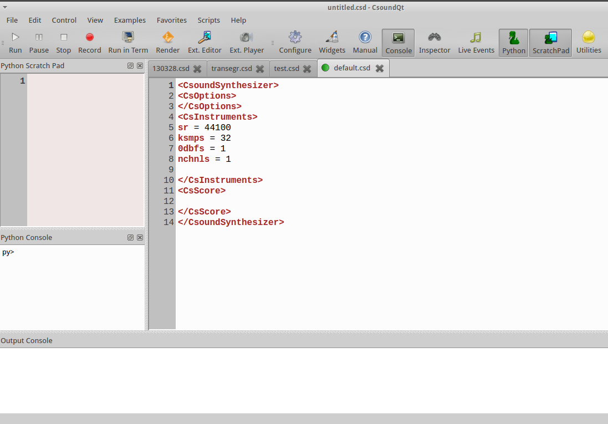
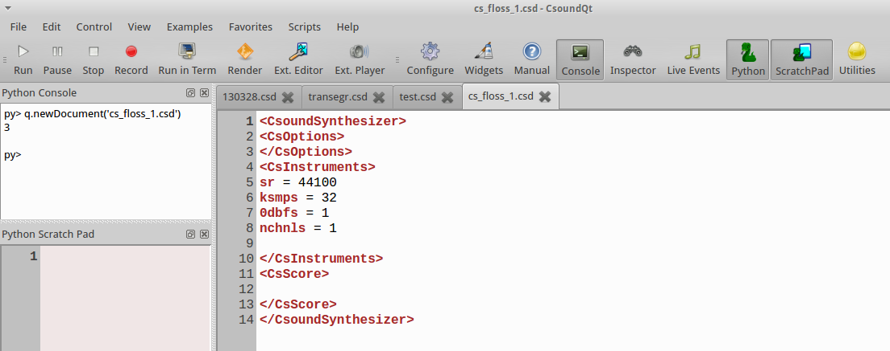
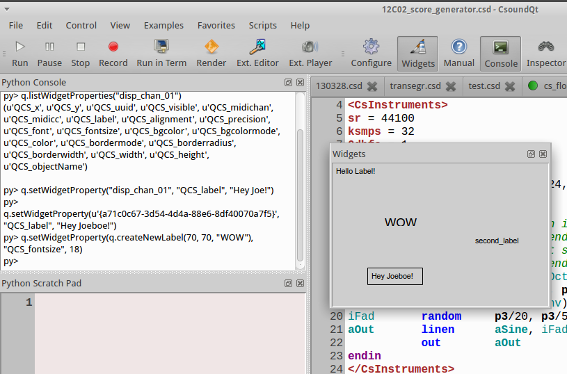

14 B. PYTHON IN CSOUNDQT
========================

If CsoundQt is built with PythonQt support,^[If not, have a look at the
[releases](https://github.com/CsoundQt/CsoundQt/releases) page.
Python 2.7 must be installed, too. For building CsoundQt with
Python support, have a look at the descriptions in
[CsoundQt's Wiki](https://github.com/CsoundQt/CsoundQt/wiki).]
it enables a lot of new
possibilities, mostly in three main fields: interaction with the
CsoundQt interface, interaction with widgets and using classes from Qt
libraries to build custom interfaces in python.

If you start CsoundQt and can open the panels *Python Console* and
*Python Scratch Pad*, you are ready to go.

The CsoundQt Python Object
--------------------------

As *CsoundQt* has formerly been called *QuteCsound*, this name can still be
found in the sources. The *QuteCsound object* (called *PyQcsObject* in the
sources) is the interface for scripting CsoundQt. All declarations of
the class can be found in the file
[pyqcsobject.h](https://github.com/CsoundQt/CsoundQt/blob/develop/src/pyqcsobject.h)
in the sources.

It enables the control of a large part of CsoundQt's possibilities from
the python interpreter, the python scratchpad, from scripts or from
inside of a running Csound file via Csound's python opcodes.^[See chapter
[12 B](12-b-python-and-csound.md) for more information on the python opcodes and ctcsound.]

By default, a *PyQcsObject* is already available in the python
interpreter of CsoundQt called "q". To use any of its methods, we  can use a form like

    q.stopAll()

The methods can be divided into four groups:

- access CsoundQt's interface (open or close files, start or stop
  performance etc)
- edit Csound files which has already been opened as tabs in CsoundQt
- manage CsoundQt's widgets
- interface with the running Csound engine

File and Control Access
------------------------

If you have CsoundQt running on your computer, you should type the
following code examples in the Python Console (if only one line) or the
Python Scratch Pad (if more than one line of code).^[To evaluate multiple
lines of Python code in the Scratch Pad, choose either
Edit-\>Evaluate Section (Alt+E), or select and choose
Edit-\>Evaluate Selection (Alt+Shift+E).]

### Create or Load a *csd* File

Type `q.newDocument('cs_floss_1.csd')` in your Python Console and hit
the Return key. This will create a new csd file named
*cs_floss_1.csd* in your working directory. And it also returns an
integer (in the screenshot below: 3) as index for this file.

If you close this file and then execute the line
`q.loadDocument('cs_floss_1.csd')`, you should see the file again as
tab in CsoundQt.

Let us have a look how these two methods *newDocument* and
*loadDocument* are described in the sources:

    int newDocument(QString name)
    int loadDocument(QString name, bool runNow = false)

The method *newDocument* needs a name as string ("QString") as argument,
and returns an integer. The method loadDocument also takes a name as
input string and returns an integer as index for this csd. The
additional argument *runNow* is optional. It expects a boolean value
(True/False or 1/0). The default is *false* which means "do not run
immediately after loading". So if you type instead
`q.loadDocument('cs_floss_1.csd', True)` or
`q.loadDocument('cs_floss_1.csd', 1)`, the csd file should start
immediately.

### Run, Pause or Stop a *csd* File

For the next methods, we first need some more code in our csd. So let
your *cs_floss_1.csd* look like this:

***EXAMPLE 14B01_run_pause_stop.csd***

~~~csound
<CsoundSynthesizer>
<CsOptions>
</CsOptions>
<CsInstruments>
sr = 44100
ksmps = 32
0dbfs = 1
nchnls = 1

giSine     ftgen      0, 0, 1024, 10, 1

instr 1
kPitch     expseg     500, p3, 1000
aSine      poscil     .2, kPitch, giSine
           out        aSine
endin
</CsInstruments>
<CsScore>
i 1 0 10
</CsScore>
</CsoundSynthesizer>
~~~

This instrument performs a simple pitch glissando from 500 to 1000 Hz in
ten seconds. Now make sure that this csd is the currently active tab in
CsoundQt, and execute this:

     q.play()

This starts the performance. If you do nothing, the performance will
stop after ten seconds. If you type instead after some seconds

     q.pause()

the performance will pause. The same task q.pause() will resume the
performance. Note that this is different from executing q.play() after
q.pause() ; this will start a new performance. With

    q.stop()

you can stop the current performance.

### Access to Different *csd* Tabs via Indices

The *play()*, *pause()* and *stop()* method, as well as other methods in
CsoundQt's integrated Python, allow also to access csd file tabs which
are not currently active. As we saw in the creation of a new csd file by
`q.newDocument('cs_floss_1.csd')`, each of them gets an index. This
index allows universal access to all csd files in a running CsoundQt
instance.

First, create a new file *cs_floss_2.csd*, for instance with this
code:

~~~csound
<CsoundSynthesizer>
<CsOptions>
</CsOptions>
<CsInstruments>
sr = 44100
ksmps = 32
0dbfs = 1
nchnls = 1

giSine     ftgen      0, 0, 1024, 10, 1

instr 1
kPitch     expseg     500, p3, 1000
aSine      poscil     .2, kPitch, giSine
           out        aSine
endin
</CsInstruments>
<CsScore>
i 1 0 10
</CsScore>
</CsoundSynthesizer>
~~~

Now get the index of these two tabs in executing
`q.getDocument('cs_floss_1.csd')` and
`q.getDocument('cs_floss_2.csd')` . This will show something like
this:

So in my case the indices are 3 and 4.^[If you have less or more csd tabs
already while creating the new files, the index will be lower or higher.] 
Now you can start, pause and stop any of these files with tasks like these:

    q.play(3)
    q.play(4)
    q.stop(3)
    q.stop(4)

If you have checked *Allow simultaneous play* in CsoundQt's
*Configure-\>General* ...

.. you should be able to run both csds simultaneously. To stop all
running files, use:

    q.stopAll()

To set a csd as active, use `setDocument(index)`. This will have the
same effect as clicking on the tab.

### Send Score Events

Now comment out the score line in the file *cs_floss_2.csd*, or
simply remove it. When you now start Csound, this tab should run. Now
execute this command:

    q.sendEvent('i 1 0 2')

This should trigger instrument 1 for two seconds.

### Query File Name or Path

In case you need to know the name^[Different to most usages, *name* means here
the full path including the file name.] or the path of a csd file, you
have these functions:

    getFileName()
    getFilePath()

Calling the method without any arguments, it refers to the currently
active csd. An index as argument links to a specific tab. Here is a
Python code snippet which returns indices, file names and file paths of
all tabs in CsoundQt:

    index = 0
    while q.getFileName(index):
        print 'index = %d' % index
        print ' File Name = %s' % q.getFileName(index)
        print ' File Path = %s' % q.getFilePath(index)
        index += 1

Which returns for instance:

    index = 0
    File Name = /home/jh/Joachim/Stuecke/30Carin/csound/130328.csd
    File Path = /home/jh/Joachim/Stuecke/30Carin/csound
    index = 1
    File Name = /home/jh/src/csoundmanual/examples/transegr.csd
    File Path = /home/jh/src/csoundmanual/examples
    index = 2
    File Name = /home/jh/Desktop/test.csd
    File Path = /home/jh/Desktop

Get and Set csd Text
--------------------

One of the main features of Python scripting in CsoundQt is the ability
to edit any section of a csd file. There are several *get* functions,
to query text, and also *set* functions to change or insert text.

### Get Text from a *csd* File

Make sure your *cs_floss_2.csd* is the active tab, and execute the
following python code lines:

    q.getCsd()
    q.getOrc()
    q.getSco()

You will get the full visible *csd*, the *orc* or the *sco* part as a unicode string.

You can also get the text for the \<CsOptions\>, the text for
CsoundQt's widgets and presets, or the full text of this csd:

    q.getOptionsText()
    q.getWidgetsText()
    q.getPresetsText()
    q.getFullText()

If you select some text or some widgets, you will get the selection with
these commands:

    q.getSelectedText()
    q.getSelectedWidgetsText()

As usual, you can specify any of the loaded csds via its index. So
calling q.getOrc(3) instead of q.getOrc() will return the orc text of the
csd with index 3, instead of the orc text of the currently active csd.

### Set Text in a *csd* File

Set the cursor anywhere in your active csd, and execute the following
line in the Python Console:

    q.insertText('my nice insertion')

You will see your nice insertion in the csd file. In case you do not
like it, you can choose Edit-\>Undo. It does not make a difference for
the CsoundQt editor whether the text has been typed by hand, or by the
internal Python script facility.

Text can also be inserted to individual sections using the functions:

    setCsd(text)
    setFullText(text)
    setOrc(text)
    setSco(text)
    setWidgetsText(text)
    setPresetsText(text)
    setOptionsText(text)

Note that the whole section will be overwritten with the string *text*.

### Opcode Exists

You can ask whether a string is an opcode name, or not, with the
function *opcodeExtists*, for instance:

    py> q.opcodeExists('line')
    True
    py> q.opcodeExists('OSCsend')
    True
    py> q.opcodeExists('Line')
    False
    py> q.opcodeExists('Joe')
    NotYet

### Example: Score Generation

A typical application for setting text in a csd is to generate a score.
There have been numerous tools and programs to do this, and it can be
very pleasant to use CsoundQt's Python scripting for this task. Let us
modify our previous instrument first to make it more flexible:

***EXAMPLE 14B02_score_generated.csd***

~~~csound
<CsoundSynthesizer>
<CsOptions>
</CsOptions>
<CsInstruments>
sr = 44100
ksmps = 32
0dbfs = 1
nchnls = 1

giSine     ftgen      0, 0, 1024, 10, 1

instr 1
iOctStart  =          p4 ;pitch in octave notation at start
iOctEnd    =          p5 ;and end
iDbStart   =          p6 ;dB at start
iDbEnd     =          p7 ;and end
kPitch     expseg     cpsoct(iOctStart), p3, cpsoct(iOctEnd)
kEnv       linseg     iDbStart, p3, iDbEnd
aSine      poscil     ampdb(kEnv), kPitch, giSine
iFad       random     p3/20, p3/5
aOut       linen      aSine, iFad, p3, iFad
           out        aOut
endin
</CsInstruments>
<CsScore>
i 1 0 10 ;will be overwritten by the python score generator
</CsScore>
</CsoundSynthesizer>
~~~

The following code will now insert 30 score events in the score section:

~~~python
from random import uniform
numScoEvents = 30
sco = ''
for ScoEvent in range(numScoEvents):
    start = uniform(0, 40)
    dur = 2**uniform(-5, 3)
    db1, db2 = [uniform(-36, -12) for x in range(2)]
    oct1, oct2 = [uniform(6, 10) for x in range(2)]
    scoLine = 'i 1 %f %f %f %f %d %d\n' % (start,dur,oct1,oct2,db1,db2)
    sco = sco + scoLine
q.setSco(sco)
~~~

This generates a texture with either falling or rising gliding pitches.
The durations are set in a way that shorter durations have a bigger probability than larger ones. The volume and pitch ranges allow many
variations in the simple shape.

Widgets
-------

#### Creating a Label

Click on the *Widgets* button to see the widgets panel. Then execute
this command in the Python Console:

    q.createNewLabel()

The properties dialog of the label pops up. Type *Hello Label!* or
something like this as text.

When you click *Ok*, you will see the label widget in the panel, and a
strange unicode string as return value in the Python Console:

The string *u\'{3a171aa2-4cf8-4f05-9f30-172863909f56}\'* is a
"universally unique identifier" (uuid). Each widget can be accessed by
this ID.

### Specifying the Common Properties as Arguments

Instead of having a live talk with the properties dialog, we can specify
all properties as arguments for the *createNewLabel* method:

    q.createNewLabel(200, 100, "second_label")

This should be the result:

A new label has been created---without opening the properties
dialog---at position x=200 y=100^[Pixels from left and from top.] with the
name *second_label*. If you want to create a widget not in the active document, but in another
tab, you can also specify the tab index. The following command will create a
widget at the same position and with the same name in the first tab:

    q.createNewLabel(200, 100, "second_label", 0)

### Setting the Specific Properties

Each widget has a xy position and a channel name.^[Only a label does not
have a channel name. So as we saw, in case of a label
the name is its displayed text.] But the other
properties depend on the type of widget. A Display has name, width and
height, but no resolution like a SpinBox. The function setWidgetProperty
refers to a widget via its ID and sets a property. Let us try this for a
Display widget. This command creates a Display widget with channel name
\"disp\_chan\_01\" at position x=50 y=150:

    q.createNewDisplay(50, 150, "disp_chan_01")

And this sets the text to a new string:^[For the main property of a widget
(text for a Display, number for Sliders, SpinBoxes etc) you can also use the
setChannelString and setChannelValue method.
See below at *Getting and Setting Channel Values*]

    q.setWidgetProperty("disp_chan_01", "QCS_label", "Hey Joe!")

The setWidgetProperty method needs the ID of a widget first. This can be
expressed either as channel name (*disp_chan_01*) as in the command
above, or as uuid. As I got the string
u\'{a71c0c67-3d54-4d4a-88e6-8df40070a7f5}\' as uuid, I can also write:

~~~python
q.setWidgetProperty(u'{a71c0c67-3d54-4d4a-88e6-8df40070a7f5}',
                    'QCS_label', 'Hey Joeboe!')
~~~

For humans, referring to the channel name as ID is certainly preferable.^[
Note that two widgets can share the same channel name
(for instance a slider and a spinbox). In this case, referring to a widget
via its channel name is not possible at all.] But as the *createNew...*
method returns the uuid, you can use it implicitely, for instance in this command:

    q.setWidgetProperty(q.createNewLabel(70, 70, "WOW"), "QCS_fontsize", 18)

### Getting the Property Names and Values

How can we know that the visible text of a Display widget
is called *QCS_label* and the fontsize *QCS_fontsize*? If we do
not know the name of a property, we can ask CsoundQt for it via the function
*listWidgetProperties*:

    py> q.listWidgetProperties("disp_chan_01")
    (u'QCS_x', u'QCS_y', u'QCS_uuid', u'QCS_visible', u'QCS_midichan',
     u'QCS_midicc', u'QCS_label', u'QCS_alignment', u'QCS_precision',
     u'QCS_font', u'QCS_fontsize', u'QCS_bgcolor', u'QCS_bgcolormode',
     u'QCS_color', u'QCS_bordermode', u'QCS_borderradius', u'QCS_borderwidth',
     u'QCS_width', u'QCS_height', u'QCS_objectName')

*listWidgetProperties* returns all properties in a tuple. We
can query the value of a single property with the function
*getWidgetProperty*, which takes the uuid and the property as inputs, and
returns the property value. So this code snippet asks for all property
values of our Display widget:

    widgetID = "disp_chan_01"
    properties = q.listWidgetProperties(widgetID)
    for property in properties:
        propVal = q.getWidgetProperty(widgetID, property)
        print property + ' = ' + str(propVal)

Returns:

    QCS_x = 50
    QCS_y = 150
    QCS_uuid = {a71c0c67-3d54-4d4a-88e6-8df40070a7f5}
    QCS_visible = True
    QCS_midichan = 0
    QCS_midicc = -3
    QCS_label = Hey Joeboe!
    QCS_alignment = left
    QCS_precision = 3
    QCS_font = Arial
    QCS_fontsize = 10
    QCS_bgcolor = #ffffff
    QCS_bgcolormode = False
    QCS_color = #000000
    QCS_bordermode = border
    QCS_borderradius = 1
    QCS_borderwidth = 1
    QCS_width = 80
    QCS_height = 25
    QCS_objectName = disp_chan_01

### Get the UUIDs of all Widgets

For getting the uuid strings of all widgets in the active csd tab, type

    q.getWidgetUuids()

As always, the uuid strings of other csd tabs can be accessed via the
index.

### Some Examples for Creating and Modifying Widgets

Create a new slider with the channel name *level* at position 10,10 in
the (already open but not necessarily active) document *test.csd*:

    q.createNewSlider(10, 10, "level", q.getDocument("test.csd"))

Create ten knobs with the channel names *partial_1*, *partial_2*
etc, and the according labels *amp_part_1*, *amp_part_2* etc in
the currently active document:

    for no in range(10):
        q.createNewKnob(100*no, 5, "partial_"+str(no+1))
        q.createNewLabel(100*no+5, 90, "amp_part_"+str(no+1))

Alternatively, you can store the uuid strings while creating:

    knobs, labels = [], []
    for no in range(10):
        knobs.append(q.createNewKnob(100*no, 5, "partial_"+str(no+1)))
        labels.append(q.createNewLabel(100*no+5, 90, "amp_part_"+str(no+1)))

The variables *knobs* and *labels* now contain the IDs:

    py> knobs
    [u'{8d10f9e3-70ce-4953-94b5-24cf8d6f6adb}',
    u'{d1c98b52-a0a1-4f48-9bca-bac55dad0de7}',
    u'{b7bf4b76-baff-493f-bc1f-43d61c4318ac}',
    u'{1332208d-e479-4152-85a8-0f4e6e589d9d}',
    u'{428cc329-df4a-4d04-9cea-9be3e3c2a41c}',
    u'{1e691299-3e24-46cc-a3b6-85fdd40eac15}',
    u'{a93c2b27-89a8-41b2-befb-6768cae6f645}',
    u'{26931ed6-4c28-4819-9b31-4b9e0d9d0a68}',
    u'{874beb70-b619-4706-a465-12421c6c8a85}',
    u'{3da687a9-2794-4519-880b-53c2f3b67b1f}']
    py> labels
    [u'{9715ee01-57d5-407d-b89a-bae2fc6acecf}',
    u'{71295982-b5e7-4d64-9ac5-b8fbcffbd254}',
    u'{09e924fa-2a7c-47c6-9e17-e710c94bd2d1}',
    u'{2e31dbfb-f3c2-43ab-ab6a-f47abb4875a3}',
    u'{adfe3aef-4499-4c29-b94a-a9543e54e8a3}',
    u'{b5760819-f750-411d-884c-0bad16d68d09}',
    u'{c3884e9e-f0d8-4718-8fcb-66e82456f0b5}',
    u'{c1401878-e7f7-4e71-a097-e92ada42e653}',
    u'{a7d14879-1601-4789-9877-f636105b552c}',
    u'{ec5526c4-0fda-4963-8f18-1c7490b0a667}'

Move the first knob 200 pixels downwards:

    q.setWidgetProperty(knobs[0], "QCS_y", q.getWidgetProperty(knobs[0],
    "QCS_y")+200)

Modify the maximum of each knob so that the higher partials have less
amplitude range (set maximum to 1, 0.9, 0.8, ... 0.1):

    for knob in range(10):
        q.setWidgetProperty(knobs[knob], "QCS_maximum", 1-knob/10.0)

### Deleting widgets

You can delete a widget using the method *destroyWidget*. You have to
pass the widget's ID, again either as channel name or (better) as uuid
string. This will remove the first knob in the example above:

    q.destroyWidget("partial_1")

This will delete all knobs:

    for w in knobs:
        q.destroyWidget(w)

And this will delete all widgets of the active document:

    for w in q.getWidgetUuids():
        q.destroyWidget(w)

### Getting and Setting Channel Names and Values

After this cruel act of destruction, let us again create a slider and a
display:

    py> q.createNewSlider(10, 10, "level")
    u'{b0294b09-5c87-4607-afda-2e55a8c7526e}'
    py> q.createNewDisplay(50, 10, "message")
    u'{a51b438f-f671-4108-8cdb-982387074e4d}'

Now we will ask for the values of these widgets^[Here again accessed
by the channel name. Of course accessing by uuid would also be possible
(and more safe, as explained above).] with the methods
*getChannelValue* and *getChannelString*:

    py> q.getChannelValue('level')
    0.0
    py> q.getChannelString("level")
    u''
    py> q.getChannelValue('message')
    0.0
    py> q.getChannelString('message')
    u'Display'

As you see, it depends on the type of the widget whether to query its
value by *getChannelValue* or *getChannelString*. Although CsoundQt will not
return an error, it makes no sense to ask a slider for its string (as
its value is a number), and a display for its number (as its value is a
string).

With the methods *setChannelValue* and *setChannelString* we can change the
main content of a widget very easily:

    py> q.setChannelValue("level", 0.5)
    py> q.setChannelString("message", "Hey Joe again!")

This is much more handy than the general method using setWidgetProperty:

    py> q.setWidgetProperty("level", "QCS_value", 1)
    py> q.setWidgetProperty("message", "QCS_label", "Nono")

### Presets

Now right-click in the widget panel and choose *Store Preset -\> New
Preset*:

You can (but need not) enter a name for the preset. The important thing
here is the number of the preset (here 0). - Now change the value of the
slider and the text of the display widget. Save again as preset, now
being preset 1. - Now execute this:

    q.loadPreset(0)

You will see the content of the widgets reloaded to the first preset.
Again, with

    q.loadPreset(1)

you can switch to the second one.

Like all python scripting functions in CsoundQt, you can not only use
these methods from the Python Console or the Python Scratch Pad, but also
from inside any csd. This is an example how to switch all the widgets to
other predefined states, in this case controlled by the score. You will
see the widgets for the first three seconds in Preset 0, then for the
next three seconds in Preset 1, and finally again in Preset 0:

***EXAMPLE 14B03_presets.csd***

~~~csound
<CsoundSynthesizer>
<CsOptions>
-odac
</CsOptions>
<CsInstruments>

pyinit

instr loadPreset
 index = p4
 pycalli "q.loadPreset", index
endin

</CsInstruments>
<CsScore>
i "loadPreset" 0 3 0
i "loadPreset" + . 1
i "loadPreset" + . 0
</CsScore>
</CsoundSynthesizer>
;example by tarmo johannes and joachim heintz
~~~

Csound Functions
----------------

Several functions can interact with the Csound engine, for example to
query information about it. Note that the functions *getSampleRate*,
*getKsmps*, *getNumChannels* and *getCurrentCsound* refer to a *running*
instance of Csound.

    py> q.getVersion() # CsoundQt API version
    u'1.0'
    py> q.getSampleRate()
    44100.0
    py> q.getKsmps()
    32
    py> q.getNumChannels()
    1
    py> q.getCurrentCsound()
    CSOUND (C++ object at: 0x2fb5670)

With *getCsChannel*, *getCsStringChannel* and *setCsChannel* you can
access csound channels directly, independently from widgets. They are
useful when testing a csd for use with the Csound API (in another
application, a csLapdsa or Cabbage plugin, Android application) or
similar. These are some examples, executed on a running csd instance:

    py> q.getCsChannel('my_num_chn')
    0.0
    py> q.getCsStringChannel('my_str_chn')
    u''

    py> q.setCsChannel('my_num_chn', 1.1)
    py> q.setCsChannel('my_str_chn', 'Hey Csound')

    py> q.getCsChannel('my_num_chn')
    1.1
    py> q.getCsStringChannel('my_str_chn')
    u'Hey Csound'

If you have a function table in your running Csound instance which has
for instance been created with the line `giSine ftgen 1, 0, 1024, 10, 1`,
you can query *getTableArray* like this:

    py> q.getTableArray(1)
    MYFLT (C++ object at: 0x35d1c58)

Finally, you can register a Python function as a callback to be executed
in between processing blocks for Csound. The first argument should be
the text that should be called on every pass. It can include arguments
or variables which will be evaluated every time. You can also set a
number of periods to skip to avoid.

    registerProcessCallback(QString func, int skipPeriods = 0)

You can register the python text to be executed on every Csound control
block callback, so you can execute a block of code, or call any function
which is already defined.

Creating Own GUIs with PythonQt
--------------------------------

One of the very powerful features of using Python inside CsoundQt is the
ability to build own GUIs. This is done via the
[PythonQt](http://pythonqt.sourceforge.net/) library which gives you
access to the Qt toolkit via Python. We will show some examples here.
Have a look in the *Scripts* menu in CsoundQt to find much more (you
will find the code in the *Editor* submenu).

### Dialog Box

Sometimes it is practical to ask from user just one question - number or
name of something and then execute the rest of the code (it can be done
also inside a csd with python opcodes). In Qt, the class to create a
dialog for one question is called
[QInputDialog](http://doc.qt.nokia.com/4.7-snapshot/qinputdialog.html).

To use this or any other Qt classes, it is necessary to import the
PythonQt and its Qt submodules. In most cases it is enough to add this
line:

    from PythonQt.Qt import *

or

    from PythonQt.QtGui import *

At first an object of *QInputDialog* must be defined, then you can use its
methods *getInt*, *getDouble*, *getItem* or *getText* to read the input in the
form you need. This is a basic example:

~~~python
from PythonQt.Qt import *

inpdia = QInputDialog()
myInt = inpdia.getInt(inpdia,"Example 1","How many?")
print myInt
# example by tarmo johannes
~~~

Note that the variable *myInt* is now set to a value which remains in
your Python interpreter. Your Python Console may look like this when
executing the code above, and then ask for the value of *myInt*:

~~~python
py>
12
Evaluated 5 lines.
py> myInt
12
~~~

Depending on the value of myInt, you can do funny or serious things.
This code re-creates the Dialog Box whenever the user enters the number
1:

~~~python
from PythonQt.Qt import *

def again():
    inpdia = QInputDialog()
    myInt = inpdia.getInt(inpdia,"Example 1","How many?")
    if myInt == 1:
        print "If you continue to enter '1'"
        print "I will come back again and again."
        again()
    else:
        print "Thanks - Leaving now."
again()
# example by joachim heintz
~~~

A simple example follows showing how an own GUI can be embedded in your
Csound code. Here, Csound waits for the user input, and then prints out
the entered value as the Csound variable giNumber:

***EXAMPLE 14B04_dialog.csd***

~~~csound
<CsoundSynthesizer>
<CsOptions>
-n
</CsOptions>
<CsInstruments>
ksmps = 32

pyinit
pyruni {{
from PythonQt.Qt import *
dia = QInputDialog()
dia.setDoubleDecimals(4)
}}

giNumber pyevali {{
dia.getDouble(dia,"CS question","Enter number: ")
}} ; get the number from Qt dialog

instr 1
        print giNumber
endin

</CsInstruments>
<CsScore>
i 1 0 0
</CsScore>
</CsoundSynthesizer>
;example by tarmo johannes
~~~

More complex examples can be found in CsoundQt's *Scripts* menu.

List of PyQcsObject Methods in CsoundQt
---------------------------------------

### Load/Create/Activate a csd File

~~~python
int loadDocument(QString name, bool runNow = false)
int getDocument(QString name = "")
int newDocument(QString name)
void setDocument(int index)
~~~

### Play/Pause/Stop a csd File

~~~python
void play(int index = -1, bool realtime = true)
void pause(int index = -1)
void stop(int index = -1)
void stopAll()
~~~

### Send Score Events

~~~python
void sendEvent(int index, QString events)
void sendEvent(QString events)
void schedule(QVariant time, QVariant event)
~~~

### Query File Name/Path

~~~python
QString getFileName(int index = -1)
QString getFilePath(int index = -1)
~~~

### Get csd Text

~~~python
QString getSelectedText(int index = -1, int section = -1)
QString getCsd(int index = -1)
QString getFullText(int index = -1)
QString getOrc(int index = -1)
QString getSco(int index = -1)
QString getWidgetsText(int index = -1)
QString getSelectedWidgetsText(int index = -1)
QString getPresetsText(int index = -1)
QString getOptionsText(int index = -1)
~~~

### Set csd Text

~~~python
void insertText(QString text, int index = -1, int section = -1)
void setCsd(QString text, int index = -1)
void setFullText(QString text, int index = -1)
void setOrc(QString text, int index = -1)
void setSco(QString text, int index = -1)
void setWidgetsText(QString text, int index = -1)
void setPresetsText(QString text, int index = -1)
void setOptionsText(QString text, int index = -1)
~~~

### Opcode Exists

~~~python
bool opcodeExists(QString opcodeName)
~~~

### Create Widgets

~~~python
QString createNewLabel(
  int x = 0, int y = 0, QString channel = QString(), int index = -1
)
QString createNewDisplay(
  int x = 0, int y = 0, QString channel = QString(), int index = -1
)
QString createNewScrollNumber(
  int x = 0, int y = 0, QString channel = QString(), int index = -1
)
QString createNewLineEdit(
  int x = 0, int y = 0, QString channel = QString(), int index = -1
)
QString createNewSpinBox(
  int x = 0, int y = 0, QString channel = QString(), int index = -1
)
QString createNewSlider(
  QString channel, int index = -1
)
QString createNewSlider(
  int x = 0, int y = 0, QString channel = QString(), int index = -1
)
QString createNewButton(
  int x = 0, int y = 0, QString channel = QString(), int index = -1
)
QString createNewKnob(
  int x = 0, int y = 0, QString channel = QString(), int index = -1
)
QString createNewCheckBox(
  int x = 0, int y = 0, QString channel = QString(), int index = -1
)
QString createNewMenu(
  int x = 0, int y = 0, QString channel = QString(), int index = -1
)
QString createNewMeter(
  int x = 0, int y = 0, QString channel = QString(), int index = -1
)
QString createNewConsole(
  int x = 0, int y = 0, QString channel = QString(), int index = -1
)
QString createNewGraph(
  int x = 0, int y = 0, QString channel = QString(), int index = -1
)
QString createNewScope(
  int x = 0, int y = 0, QString channel = QString(), int index = -1
)
~~~

### Query Widgets

~~~python
QVariant getWidgetProperty(QString widgetid, QString property, int index= -1)
double getChannelValue(QString channel, int index = -1)
QString getChannelString(QString channel, int index = -1)
QStringList listWidgetProperties(QString widgetid, int index = -1)
QStringList getWidgetUuids(int index = -1)
~~~

### Modify Widgets

~~~python
void setWidgetProperty(
  QString widgetid, QString property, QVariant value, int index= -1
)
void setChannelValue(QString channel, double value, int index = -1)
void setChannelString(QString channel, QString value, int index = -1)
~~~

### Delete Widgets

~~~python
bool destroyWidget(QString widgetid)
~~~

### Presets

~~~python
void loadPreset(int presetIndex, int index = -1)
~~~

### Live Event Sheet

~~~python
QuteSheet* getSheet(int index = -1, int sheetIndex = -1)
QuteSheet* getSheet(int index, QString sheetName)
~~~

### Csound / API

~~~python
QString getVersion()
void refresh()
void setCsChannel(QString channel, double value, int index = -1)
void setCsChannel(QString channel, QString value, int index = -1)
double getCsChannel(QString channel, int index = -1)
QString getCsStringChannel(QString channel, int index = -1)
CSOUND* getCurrentCsound()
double getSampleRate(int index = -1)
int getKsmps(int index = -1)
int getNumChannels(int index = -1)
MYFLT *getTableArray(int ftable, int index = -1)
void registerProcessCallback(
  QString func, int skipPeriods = 0, int index = -1
)
~~~
