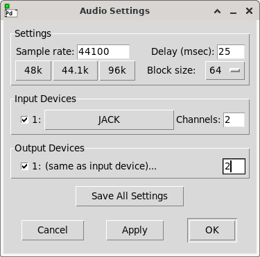

# 03 Bonjour amplitude

## Ce que vous apprendrez dans ce tutoriel

- Comment créer une **amplitude qui varie dans le temps**.
- Que sont les **constantes de l’entête d’orchestre / orchestra header constants** dans Csound :
  - la **sample rate / fréquence d’échantillonnage**,
  - la **ksmps** ou **block size / taille de bloc**,
  - **nchnls** comme nombre de canaux de sortie,
  - **0dbfs** comme équivalent zéro dB **f**ull **s**cale.
- Comment l’**ordre d’exécution** fonctionne dans le programme Csound.
- Comment vous pouvez **comprendre les messages d’erreur**.

## Une ligne pour l’amplitude

Maintenant que nous avons compris comment créer des lignes, nous pouvons également appliquer un mouvement linéaire à l’amplitude.

Voici un signal qui se déplace de 0.3 à 0.1 en une demi-seconde :

  

Et ce code devrait déjà vous être familier :

```
kAmp = linseg:k(0.3,0.5,0.1)
```

Notez qu’acoustiquement, cette façon de changer le volume est discutable. Nous en parlerons dans le Tutoriel 06.

## Retour au début

Considérons maintenant quelques réglages importants qui sont écrits au début de la balise \<CsInstruments> :

```
<CsInstruments>

sr = 44100 //sr = sample rate
ksmps = 64
nchnls = 2 //nchnls = number of channels
0dbfs = 1
```

Cet ensembles de configurations est parfois appelé Entête de l’Orchestre / Orchestra Header.

Nous y voyons quatre **constantes** qui doivent être écrites explicitement dans tout fichier Csound.

On les appelle **constantes** car vous ne pouvez pas les changer en cours d’exécution de Csound. Une fois Csound lancé et que Csound compile votre fichier, ces valeurs restent inchangées tout le temps de l’exécution.

Quelle est la signification de ces constantes ?

### sr

**sr** signifie **s**ample **r**ate. C’est le nombre d’échantillons audio par seconde. Les valeurs les plus courantes sont 44100 (le standard CD), 48000 (le standard vidéo), ou de plus hautes valeurs comme 96000 ou 192000.

Comme le _sample rate / taux d’échantillonnage_ est mesuré par seconde, il est souvent exprimé en Hertz (Hz), ou en kilo Hertz (kHz).

Vous devriez choisir un sample rate qui convienne à vos besoins. Par exemple, quand vous produisez de l’audio pour une vidéo _mpeg_ qui nécessite 48 kHz, vous devriez configurer :

```
sr = 48000
```

Quand votre carte son tourne à 44100 Hz, vous devriez configurer votre `sr` à la même valeur ; ou vice-versa, configurer votre carte son à la valeur que vous avez définie comme `sr` dans Csound.

### ksmps

**ksmps** signifie **nombre de samples/échantillons pendant une période de contrôle**.

Comme vous l’avez appris dans le [Tutoriel 02](15-f-GS-fr-02.md), le _k-rate_ est basé sur le sample-rate. Un **groupe** ou **block de samples** est collecté dans un paquet. Imaginez-vous debout devant un tapis-roulant. De petites statues arrivent sur le tapis à intervalles réguliers, disons une fois par seconde. Plutôt que prendre chaque statue pour les passer une à une à un collègue, vous en mettez au fur et à mesure 64 dans un paquet. Et vous ne passez ce paquet à votre collègue qu’une fois le paquet rempli des 64 statues prévues. Vous passerez donc un paquet toutes les 64 secondes.

Cet interval de temps pour passer un paquet (en temps que paquets par seconde) est le _control rate_, ou **k-rate**. L’interval de temps pendant lequel les petites statues arrivent une par une est l’audio-rate, ou **a-rate**. Dans notre exemple, le _k-rate_ est 64 fois plus lent que le _a-rate_.

La constante **ksmps** définit combien d’échantillons audio sont collectés dans un paquet _k-rate_. Ce que nous nommons "paquet/package" ici, est un terme technique nommé "block" ou "vector". _ksmps_ est donc exactement la même chose que "block size" dans PureData, ou "vector size" dans Max.

### nchnls

**nchnls** signifie **nombre de canaux/number of channels**.

- Quand vous avez une carte son stéréo, vous configurerez `nchnls = 2`.

- Quand vous utilisez huit haut-parleurs, vous devez configurer `nchnls = 8`. Vous aurez besoin d’une carte son avec au moins huit canaux pour la sortie en temps réel.

Note : Csound suppose que vous avez le même nombre de canaux d’entrée que de canaux de sortie. Si ce n’est pas le cas, vous devez utiliser la constante `nchnls_i` pour configurer le nombre de canaux d’entrée.  
Par exemple, si vous avez 8 canaux de sortie mais 4 canaux d’entrée sur votre interface audio, configurez :

```
nchnls = 8
nchnls_i = 4
```

### 0dbfs

**0dbfs** signifie : **Quelle est l’amplitude qui représente 0 dB à plein échelle (full scale).**

Au premier abord, ça semble un peu compliqué…

Avec cette configuration, nous définissons un nombre qui représente l’amplitude maximum possible.

Nous devrions toujours mettre le nombre 1, car c’est la manière qu’on toutes les applications audio de faire. 0 est l’amplitude minimum (donc le silence), et 1 est l’amplitude maximum.

Donc, toujours configurer :

```
0dbfs = 1
```

…et tout ira bien.

(Nous en dirons plus au sujet de 0 dB dans le tutoriel 05)

### Valeurs par défaut dans l’entête d’orchestre / orchestra header

Peut-être avez-vous vu des fichiers Csound dans lesquels ces quatre constantes fondamentales ne sont pas définies.

Dans ce cas, Csound utilisera les valeurs par défaut :

- La valeur par défaut de **sr** est 44100. C’est acceptable, mais c’est mieux de le définir explicitement (et le changer si nécessaire).

- La valeur par défaut de **ksmps** est 10. Ce n’est pas bon car ce n’est pas une puissance de deux. (voyez plus loin dans ce chapitre pourquoi c’est préférable).

- La valeur par défaut de **nchnls** est 1. Ce n’est pas bon car habituellement nous voulons utiliser au moins la stéréo.

- La valeur par défaut pour **0dbfs** est 32767. Ce n’est vraiment pas bon. S’il-vous-plait, configurez-la à 1.

Comme vous avez pu le comprendre, il est donc fortement recommandé de toujours configurer ces quatre constantes explicitement.

## Exemple

Voyez comment les lignes _kAmp_ et _kFreq_ sont créées par l’opcode `linseg`.  
Ces deux lignes sont alimentées via les deux noms de variables dans l’oscillateur `poscil`.

```
<CsoundSynthesizer>
<CsOptions>
-o dac
</CsOptions>
<CsInstruments>

sr = 44100
ksmps = 64
nchnls = 2
0dbfs = 1

instr Bonjour
  kAmp = linseg:k(0.3,0.5,0.1)
  kFreq = linseg:k(500,0.5,400)
  aSine = poscil:a(kAmp,kFreq)
  outall(aSine)
endin

</CsInstruments>
<CsScore>
i "Bonjour" 0 2
</CsScore>

</CsoundSynthesizer>
```

## Essayez-le vous-même

- Changez la durée dans le signal _kAmp_ de 0.5 à 1 ou 2. Les lignes de fréquence et d’amplitude se déplacent maintenant indépendamment d’une de l’autre.

- Changez les valeurs du signal _kAmp_ afin d’obtenir une augmentation plutôt qu’une diminution de l’amplitude.

- Changez `0dbfs` à 2. Vous devriez entendre les sons moins forts puisque le niveau à pleine échelle est maintenant deux fois plus haut.

- Changez `0dbfs` à 0.5. Vous devriez cette fois entendre les sons plus fort.

- déplacez la ligne `aSine = poscil:a(kAmp,kFreq)` de la troisième position dans l’instrument à la première position. Appuyer sur le bouton "play" et regardez le message d’erreur. Comprenez-vous pourquoi Csound se plaint ?

## Flux du signal et ordre d’exécution

Nous pouvons dessiner le flux du signal de notre instrument ainsi :

  

S’il vous plait, comparez cette version au [diagram de flux du signal du Tutoriel 1](15-e-GS-fr-01.md#le-flux-dun-signal-et-son-code). Les deux entrées pour l’oscillateur `poscil` ne sont plus deux nombres, mais deux signaux, qui sont les sorties des opcodes `linseg`.

Csound lit le code de notre programme ligne par ligne. Chaque fois que quelques chose est utilisé comme entrée pour un opcode, il doit déjà exister à ce moment.

## Lisez les messages d’erreur

Quand nous avons placé la troisième ligne de l’instrument en haut, nous avons demané à Csound d’utiliser quelque chose qui n’est pas encore connu :

```
instr Bonjour
  aSine = poscil:a(kAmp,kFreq)
  kAmp = linseg:k(0.3,0.5,0.1)
  kFreq = linseg:k(500,0.5,400)
  outall(aSine)
endin
```

L’oscillateur `poscil` demande _kAmp_ et _kFreq_ en entrée. Mais à ce point du code, il n’y a pas encore ni _kAmp_, ni _kFreq_. Csound retournera donc un message d’erreur "used before defined / utilisé avant d’avoir été défini" :

```
error: Variable 'kAmp' used before defined
```

Comme vous le voyez, Csound arrête sa lecture au premier message d’erreur. Une fois que vous aurez remis le `kAmp = linseg:k(0.3,0.5,0.1)` en haut de la définition de l’instrument, Csound ne se plaindra plus au sujet de _kAmp_, mais se déplacera jusqu’à la prochaine variable indéfinie :

```
error: Variable 'kFreq' used before defined
```

Le message d’erreur à changé. Csound ne se plaint plus de _kAmp_, mais de _kFreq_. Une fois la ligne `kFreq = linseg:k(500,0.5,400)` remise en seconde position, le message d’erreur disparaitra.

Pour résumer :

1. Apprendre un langage de programmation est impossible sans produire des erreurs. C’est une partie essentielle de l’apprentissage. Mais :
2. Vous DEVEZ LIRE les messages d’erreur. Regardez où la _console Csound_ se trouve dans votre environnement de développement (elle pourrait être cachée ou en arrière-plan). Puis lisez jusqu’à ce que vous obteniez le premier message d’erreur.
3. Le premier ! Puis essayez de comprendre ce message et suivez les conseils pour résoudre cette erreur.

## Constantes et termes que vous avez appris dans ce tutoriel

### Constantes

- `sr` nombre d’échantillons/samples par seconde.
- `ksmps` nombre d’échantillons/samples par bloc de contrôle.
- `nchnls` nombre de canaux audio.
- `0dbfs` nombre pour représenter l’amplitude maximum à zéro dB à pleine échelle.

### Termes
- _Block Size_ et _Vector Size_ sont des termes équivalent à `ksmps` dans Csound : le nombre de samples dans un cycle de contrôle.

## Avançons
avec le tutoriel suivant : [04 Bonjour Fondu en sortie](15-h-GS-fr-04.md)

## ou lisez quelques explications supplémentaires ici

### Quelques notes sur ksmps

Note 1 : Il est recommandé d’utiliser des valeurs **puissance-de deux** pour `ksmps`. Les valeurs courantes sont 32 (= $2^5$) ou 64 (= $2^6$). Ceci est dû à la gestion des entrées/sorties de l’audio. Vous trouverez la même chose dans d’autres applications.

Note 2 : L’avantage d’un `ksmps` **plus petit** est une meilleur définition temporelle pour le control rate. Si le sample rate est 441000 Hz, nous avons une résolution temporelle de 1/44100 secondes par sample/échantillon. C’est une durée d’environ 0.000023 secondes, ou 0.023 millisecondes entre deux samples. Quand nous réglons `ksmps = 64` pour ce sample rate de 44100 Hz, nous obtenons 64/44100 secondes comme résolution temporelle entre deux blocs, ou deux valeurs de contrôle. Ça se situe autour de 0.00145 secondes, ou 1.45 milliseconds entre deux blocs, ou valeurs de contrôles. Quand nous réglons `ksmps = 32` pour le même sample rate, nous obtenons 0.725 millisecondes comme résolution temporelle pour chaque nouvelle valeur de contrôle.

Note 3 : L’avantage d’un `ksmps` plus large est une meilleure performance en termes de vitesse. Si vous avez un fichier Csound complexe et très consommateur de ressource CPU, vous risquez d’obtenir des 'dropouts / pertes'. Dans ce cas, tentez d’augmenter `ksmps`.

Note 4 : Bien que `ksmps` soit une constante, nous pouvons configurer une **ksmps locale** dans un instrument. L’opcode destiné à cette opération est `setksmps`. Parfois, nous voulons exécuter un opcode _k-rate_ dans un instrument échantillon par échantillon. Dans ce cas, nous pouvons utiliser `setksmps(1)`. Nous pouvons seulement séparer le `ksmps` globale en parties plus petite, jamais l’inverse.

### Comment cela se passe-t-il dans PD ?
[Pure Data](http://puredata.info/) est un autre langage de programmation audio populaire. Contrairement à Csound, il n’est pas basé sur le texte, mais utilise des symboles visuels pour la programmation. Vous pouvez imaginer que le flux du programme que nous avons dessiné plus haut sous forme de symboles est maintenant sur votre écran, et vous connectez les boites-objet avec des cables symboliques.

(Il est possible, de cette façon, d’emballer Csound dans PD). Apprenez en plus dans [ce livre](https://flossmanual.csound.com/csound-in-other-applications/csound-in-pd) si vous êtes intéressé.

Il pourrait être intéressant de regarder comment des constantes importantes comme le sample rate (_sr_) et _ksmps_ sont configurés et aussi appelés dans PD. La comparaison peut aider à comprendre ce qui se passe dans toute application audio et tout langage de programmation audio.

Toutes les configurations peuvent être trouvées dans les _audio settings_… qui ressemblent à ça dans ma version de PD :

  


- en haut à gauche, on règle le **sample rate**. En dessous à droite, on sélectionne la **taille de bloc / block size**. C’est exactement la même chose que le _ksmps_ dans Csound. La taille de bloc sélectionnée de 64 est ce que nous avons fait avec :

```
ksmps = 64
```

- En dessous, nous pouvons configurer les périphériques d’entrée et de sortie, et le nombre de canaux d’entrée et de sortie. La deuxième chose est ce que nous avons fait avec

```
nchnls = 2
```

Par rapport à cette images, nous n’avons sélectionné aucun périphérique audio car nous utilisons pour ces tutoriel un navigateur web. Nous utilisons donc ici _Web Audio_. Mais bien sûr, vous pouvez sélectionner vos périphériques d’entrée et de sortie dans Csound également.

Et qu’en est-il de 0dbfs ? Cette valeur est **toujours** définie sur 1 dans PD, il n’y a donc pas de champ pour cela.
