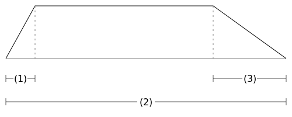

# 04 Bonjour fondu en sortie / fade out

## Ce que vous apprendrez dans ce tutoriel

- Comment appliquer des **fondus/fades linéaires** à un instrument.
- Ce que sont le **p-fields / p-champs**.
- Ce que signifie **p3** dans un instrument.

## Fondu en entrée et fondu en sortie (Fade-in and Fade-out)

Jusqu’ici, le son produit par notre instrument s’achève brutalement. Cela est dû à une coupure brusque à la fin de la durée de l’instrument.

Imaginez une onde sinusoïdale qui est coupée n’importe où. Peut-être par exemple comme ça :


Dans ce cas, nous entendrons un clic à la fin. Mais même sans ce clic, on préfère généralement adoucir la fin, comme les sons naturels se terminent.

L’opcode Csound `linen` est très pratique pour appliquer de simples fondus/fades à un signal audio.

### L’opcode 'linen'

Une enveloppe créée par `linen` ressemble à ça :



Nous avons besoin de trois nombres pour ajuster les fondus dans `linen` :

1. La durée du fondu en entrée,
2. La durée totale,
3. La durée du fondu en sortie.

## Les champs/fields de paramètres de la partition/score

Généralement, nous voulons configurer la durée totale de `linen` comme étant la durée totale de la note.

Par exemple, si la durée de la note est 2 secondes, nous voudrons 2 secondes comme durée totale de `linen`. Si la durée de la note est 3 secondes, nous voudrons 3 secondes comme durée totale de `linen`.

Dans le [Tutoriel 01](15-e-GS-fr-01.md), vous avez appris comment la durée d’un instrument est configurée dans Csound. Vous vous souvenez que ça s’écrit dans la partition :

```
i "Bonjour" 0 2
```

Après le premier champ `i` qui indique un _évènement d’instrument_, nous avons trois valeurs :

1. Le nom de l’instrument
2. L’heure de début
3. La durée

Nous appelons ces valeurs des `**parameter fields / champs de paramètres**, ou **p-fields / p-champs**.

Nous avons trois p-fields dans la partition, abrégés en **p1**, **p2** et **p3**.


## 'p3' dans un instrument

Un instrument Csound est instancié via une ligne de partition. Chaque ligne de partition contient au moins trois champs/fields de paramètre. Ces paramètres sont passés à l’instrument quand celui-ci est instancié.

Ainsi chaque instrument "connait" son **p1** (son numéro ou nom), son **p2** (son heure de début) et son **p3** (sa durée).

Et plus encore :

chaque instrument peut **se référer** à ses champs de paramètres de partition en écrivant simplement **p1**, **p2** ou **p3** dans le code.

## Exemple

En plus des trois arguments d’entrée pour `linen` que nous avons discuté ci-dessus, nous avons comme premier argument d’entrée le signal audio que nous voulons modifier.

Voici l’ordre des quatre arguments pour l’opcode `linen` :

1. Le signal audio auquel les fade-in et fade-out sont appliqués (fondus en entrée et fondus en sortie).
2. La durée du fade-in (en secondes).
3. La durée total du `linen`.
4. La durée du fade-out.

En examinant le code ci-dessous, vous pouvez voir comment celui-ci utilise **p3** pour adapter la durée du `linen` à la durée de l’évènement instrumental de la partition :

```
<CsoundSynthesizer>
<CsOptions>
-o dac
</CsOptions>
<CsInstruments>

sr = 44100
ksmps = 64
nchnls = 2
0dbfs = 1

instr Bonjour
  kAmp = linseg:k(0.3,0.5,0.1)
  kFreq = linseg:k(500,0.5,400)
  aSine = poscil:a(kAmp,kFreq)
  aOut = linen:a(aSine,0,p3,1)
  outall(aOut)
endin

</CsInstruments>
<CsScore>
i "Bonjour" 0 2
</CsScore>
</CsoundSynthesizer>
```

## Changement de volume par multiplication

Comment pouvons-nous appliquer le signal que nous avons dessiné dans le schéma précédent, passant de 0 à 1 en fondu entrant, et de 1 à 0 en fondu sortant, à un signal audio ?

Ça se fait par multiplication. Nous multiplions le signal audio par le signal d’enveloppe généré par `linen` :

```
aEnv = linen:a(1,0,p3,1)
aSin = poscil:a(0.2,400)
aOut = aEnv * aSine
```

La forme

```
aOut = linen:a(aSine,0,p3,1)
```

est un raccourci pour cette multiplication.

## Essayez vous-même

Changez le code pour que :

- Vous ayez un fade-in de 0.5 secondes (Vous n’avez actuellement qu’un fade-out).
- Votre instrument joue pendant 5 secondes.
- Votre fade-out ait la durée complète de l’instrument, quelle que soit cette durée
- Vous obteniez un fade-in de 1 seconde, mais pas de fade-out.
- Vous obteniez un fade-in de la moitié de la durée complète de l’instrument, et un fade-out également de la durée de la moitié complète de l’instrument. (Ce qui résultera en une forme d’enveloppe triangulaire).
- Vous insériez **p3** dans la line _kAmp_ afin que l’amplitude change tout au long de la durée de l’instrument.
- Vous insériez **p3** dans la line _kFreq_ afin que la fréquence change tout au long de la durée de l’instrument.

## Opcodes et symbols que vous avez appris dans ce tutoriel

### Opcodes

- `linen:a(aIn,Fade-in,Duration,Fade-out)` fade-in et fade-out linéaire.

## Symbols

- `p1` : le premier paramètre d’une ligne de partition, qui appelle l’instrument à l’aide du nom ou du numéro de cet instrument.
- `p2` : le second paramètre d’une ligne de partition qui définit l’heure de début de l’instrument.
- `p3` : le troisième paramètre d’une ligne de partition qui définit la durée de cet évènement instrumental.

<<<<<<< HEAD
Note : `p3` fait référence à la partition, mais n’a aucune signification à l’intérieur de celle-ci. Csound affichera une erreur si vous écrivez **p3** comme symbole dans la partition. Il n’a de signification que dans le code de l’**instrument**.
=======
Note : `p3` fait référence à la partition, mais n’a aucune signification à l’intérieur de celle-ci. Csound affichera une erreur si vous écrivez **p3** comme symbole dans la partition. Il n’a de signification que dans le code de l’**instrument**.

> > > > > > > c9576890a19c871cb299cf2796c5d68c80ef27f0

## Avançons

avec le tutoriel suivant : [05. Bonjour touches/keys MIDI](15-i-GS-fr-05.md).

## … Ou lisez quelque explications supplémentaires ici

### L’entrée d’amplitude de 'linen'

La première entrée de `linen` est l’amplitude.

Dans le cas le plus simple, cette amplitude est un nombre fixe. Si c’est 1, alors nous obtenons la forme de base que nous avons vue au début de ce chapitre :


`linen:a(1,0.2,p3,0.5)` produira un fade-in entre 0 et 1 en 0.2 secondes, et un fade-out entre 1 et 0 en 0.5 secondes, sur une durée totale **p3** définie dans un évènement instrumentale dans la partition/score.

Dans l’exemple, nous avons utilisé l’opcode `linen` en insérant directement un signal audio dans la première entrée.

```
linen:a(aSine,0,p3,1)
```

Comme cette première entrée de `linen` est une amplitude, ça peut être une amplitude constante, ou un signal. C’est le cas ici pour _aSine_ en temps qu’entrée d’amplitude.

Comme vous le savez déjà, dans un signal, les valeurs changent au cours du temps, que ce soit au aux _k-rate_ ou au taux _a-rate_.

### Ne devrions-nous pas utiliser un opcode k-rate pour les fondus ?

Peut-être vous demandez-vous pourquoi nous avons créé un signal **audio** comme signal d’envelope ? Le code serait alors celui-ci :

```
kFade = linen:k(1,0.5,p3,0.5)
aSine = poscil:a(0.2,400)
aOut = kFade * aSine
```

Ça pourrait être effectivement un peu plus efficace. Mais pour les ordinateurs modernes, ce gain de performance est négligeable.

D’un autre côté, les enveloppes _a-rate_ sont préférables car elles sont réellement très lisses. Il n’y a pas d’effet d’escalier comme ça peut être le cas avec les enveloppes _k-rate_.

Vous pouvez en apprendre davantage à ce sujet [ici](https://flossmanual.csound.com/csound-language/initialization-and-performance-pass#possible-problems-with-k-rate-tick-size). Je recommande personnellement de toujours utiliser des enveloppes a-rate.

Est-ce bien d’utiliser des fondus/fades linéaires ?
Un fondu linéaire est un fondu qui dessine une ligne pour créer une transition entre 0 et 1, ou entre 1 et 0. C’est de là que vient le nom *linen* : un générateur d’enveloppe linéaire.

Une alternative consiste à utiliser des courbes pour les fondus/fades.


Acoustiquement, les fondus linéaires ne sont pas les meilleurs. Nous en discuterons les raisons dans le [Tutoriel 06](15-j-GS-fr-06.md).

Pratiquement, les fondus linéaires que génère `linen` sont suffisants dans bien des cas. Mais gardez en tête qu’il existe d’autres possibilités de formes pour les fondus, et essayez-les quand vous n’êtes pas satisfait du résultat sonore. L’opcode `transeg` est alors votre ami.
