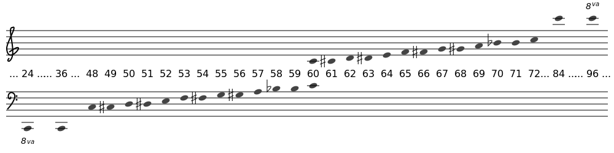
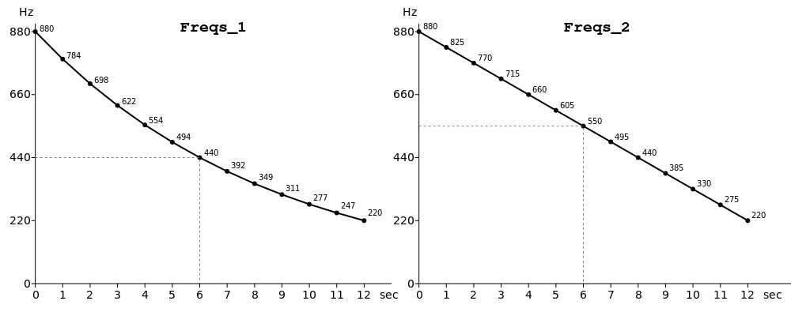
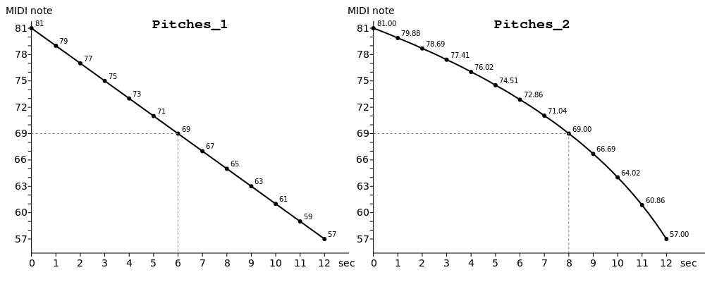

# 05. Bonjour touches MIDI / Midi keys

## Ce que vous apprendrez dans ce tutoriel

- Comment travailler avec les **numéros de note MIDI** plutôt que les valeurs de fréquences.
- Comment **convertir** des notes MIDI en **fréquences**.
- Que sont les variables **i-rate** dans la console de Csound.

## Problèmes liés à l’utilisation des fréquences brutes

Dans [Bonjour Fréquences](15-f-GS-fr-02.md), nous avions créé une _line_, ou en terme musical, un _glissando_ de la fréquence 500 Hz à 400 Hz :

```
kFreq = linseg:k(500, 0.5, 400)
```

Ici, nous avons deux problèmes :

1. Quand nous demandons à un musicien de jouer une certaine hauteur, nous disons « Peux-tu jouer un **Ré / D** », ou « Peux-tu jouer un **Ré4 / D4** ». Mais à quelle note correspond 500 Hz ?
2. Lorsque nous effectuons un glissando de 500 Hz à 400 Hz, nous ne le faisons en réalité pas de manière aussi linéaire que nous pourrions le penser.

Nous aborderons le premier point dans les paragraphes qui suivent. Pour le second, vous trouverez une explication plus bas, dans la partie facultative de ce tutoriel. Vous pouvez également consulter la section [Pitch and Frequency](https://flossmanual.csound.com/basics/pitch-and-frequency) du chapitre [Digital Audio Basics](https://flossmanual.csound.com/basics) de ce livre.

## Les numéros de notes MIDI et l’opcode 'mtof'

Il existe plusieurs systèmes et possibilités pour spécifier des hauteurs comme _D4_ plutôt que les fréquences bruts dans Csound.

Je recommande l’utilisation des numéros de notes MIDI, car ils sont faciles à apprendre et qu’ils sont aussi utilisés par d’autres langages de programmation et applications.

Tout ce que vous devez savoir au sujet des numéros ou touches MIDI : _C4_ est réglé sur la note numéro 60. Puis chaque demi-ton, ou chaque touche suivante sur un clavier MIDI, est _plus un_ pour monter, et _moins un_ pour descendre.



Si vous voulez convertir n’importe quelle note MIDI en sa fréquence relative, utilisez l’opcode `mtof` (midi to frequency).

Quand nous voulons que Csound calcule la fréquence correspondant à _D4_, et stocke le résultat dans une variable, nous écrivons :

```
iFreq = mtof:i(62)
```

## Les variables 'i-rate' dans Csound

La touche MIDI 62 est un nombre, pas un signal. De même la fréquence correspondant à cette touche MIDI. C’est un simple nombre, pas un signal. C’est la raison pour laquelle nous l’avons appelé **iFreq**.

Une variable **i-rate** dans Csound n’est calculée **qu’une seule fois** : lors de l’initialisation de l’instrument dans lequel elle apparait. Et c’est de là que vient son nom.

Souvenez-vous que les variables **k-rate** et **a-rate** sont des signaux. Un signal varie dans le temps.

Pour résumer :

- **a-rate** : variables qui contiennent des signaux qui sont mis à jour à chaque sample/échantillon.
- **k-rate** : variables qui contiennent des signaux qui sont mis à jour à chaque k-cycle. Moins souvent que le _a-rate_, cycle déterminé par la constante `ksmps`.
- **i-rate** : variables qui ne contiennent pas des signaux, mais des nombres, qui ne sont calculés qu’une seule fois à chaque appel d’instrument. Elles conservent leur valeur pendant toute la durée de la note de l’instrument et ne changent pas.

## L’opcode 'print'

Nous aimerions maintenant savoir quelle est la fréquence contenue dans la variable _iFreq_.

Pour un langage de programmation, ça signifie l’_imprimer/print_. Par l’impression, le programme affiche les valeurs dans la console. Dans la console nous voyons les messages émanant du programme.

L’opcode `print` est ce que nous cherchons. Sa syntaxe est simple :

```
print(iVariable)
```

```
<CsoundSynthesizer>
<CsOptions>
-o dac
</CsOptions>
<CsInstruments>

sr = 44100
ksmps = 64
nchnls = 2
0dbfs = 1

instr Print
  iFreq = mtof:i(62)
  print(iFreq)
endin

</CsInstruments>
<CsScore>
i "Print" 0 0
</CsScore>
</CsoundSynthesizer>
```

Vous devriez voir ce message vers la fin de la sortie de la console :

```
instr 1: iFreq = 293.665
```

    Note : l'opcode `print` ne fonctionne **qu'avec les variables i-rate**.
    Vous ne pouvez pas utiliser cet opcode pour imprimer des variables
    _k-rate_ ou _a-rate_. Nous verrons plus tard des opcodes pour imprimer
    des variables k-rate ou a-rate.

## Exemple

Nous allons maintenant utiliser des notes MIDI pour le glissando, plutôt que des fréquences brutes.

Nous créons une _line_ qui se déplace en une demi seconde de la note MIDI 72 (C5) à la note MIDI 68 (Ab4). Nous stockons cette _line_ de notes MIDI dans la variable *kMidi* :

```
kMidi = linseg:k(72,0.5,68)
```

Cette ligne est un signal car elle change au cours du temps.

Ensuite nous convertissons cette _line_ en fréquences en utilisant l’opcode `mtof` :

```
kFreq = mtof:k(kMidi)
```

Notez que nous utilisons `mtof:k` ici, car nous appliquons le convertisseur midi-to-frequency au signal _k-rate_ de _kMidi_. Le résultat est également un signal _k-rate_.

```
<CsoundSynthesizer>
<CsOptions>
-o dac
</CsOptions>
<CsInstruments>

sr = 44100
ksmps = 64
nchnls = 2
0dbfs = 1

instr Bonjour
  kAmp = linseg:k(0.3,0.5,0.1)
  kMidi = linseg:k(72,0.5,68)
  kFreq = mtof:k(kMidi)
  aSine = poscil:a(kAmp,kFreq)
  aOut = linen:a(aSine,0,p3,1)
  outall(aOut)
endin

</CsInstruments>
<CsScore>
i "Bonjour" 0 2
</CsScore>
</CsoundSynthesizer>
```

## L’opcode 'prints' et les 'strings/chaines de caractères'

Jusqu’à présent nous n’avons eu à faire qu’à des nombres.

Nous avons vu que des nombres peuvent être calculés seulement une fois, à l’_i-rate_, ou qu’il sont calculés encore et encore à chaque bloc de samples, donc au _k-rate_, ou même qu’ils sont calculés encore et encore à chaque sample/échantillon, donc à l’_a-rate_.

Mais tous sont des nombres.
C’est assez naturel pour une application audio, comparée par exemple à un traitement de texte.

Cependant, même dans une application audio, nous avons parfois besoins d’écrire du texte, par exemple quand nous pointons un fichier son comme "monfichier.wav".

Ce type de données, qui commence et finit par des guillemets doubles, est appelé une **string/chaine de caractère**.

L’opcode `prints` est similaire à l’opcode `print`, sauf qu’il imprime un string, et pas un nombre.

Essayez-le :

```
<CsoundSynthesizer>
<CsOptions>
-o dac
</CsOptions>
<CsInstruments>

sr = 44100
ksmps = 64
nchnls = 2
0dbfs = 1

instr Prints
  prints("Bonjour String!\n")
endin

</CsInstruments>
<CsScore>
i "Prints" 0 0
</CsScore>
</CsoundSynthesizer>
```

Vous vous demandez peut-être ce qu’est ce `\n` à la fin du string. C’est un spécificateur de format qui ajoute une nouvelle ligne.

S’il-vous-plait, comparez : supprimez les deux caractères `\n` et exécutez le code de nouveau. Vous verrez que la sortie de la console est maintenant suivie immédiatement par le message Csound suivant, sans saut de ligne.

Ou ajoutez un autre `\n`, et vous verrez une ligne vide après "Hello String!".
En fait, il existe bien d’autres spécificateurs de format. Nous y reviendront dans le [Tutoriel 09](15-m-GS-fr-09.md).

## Essayez-le vous même

Changez le signal _kMidi_ afin que :

1. La première note MIDI soit _E5_ plutôt que _C5_.
2. La seconde note MIDI soit _G4_ plutôt que _Ab4_.
3. La durée complète de l’instrument soit utilisée pour le glissando.
4. Le glissando soit ascendant plutôt que descendant.

Changez aussi ceci :

5. Créez deux variables _iFreqStart_ et _iFreqEnd_ pour les deux notes MIDI. (vous aurez besoin de convertir les notes MIDI au taux _i-rate_ pour ça.) Insérez alors ces _i-variables_ dans la ligne `kFreq = linseg(...)`. Comparez le résultat à celui de l’exemple.
6. Codez une "échelle chromatique" (= toujours utiliser la note MIDI suivante) qui descend de _D5_ à _A4_. Chaque note MIDI dure une seconde, puis se déplace à la note suivante. Vous pouvez obtenir ça avec `linseg` en utilisant zéro comme durée entre deux notes. Voici le début :
   `kMidi = linseg:k(74,1,74,0,73,...)`. N’oubliez pas d’ajuster la durée totale dans la partition ; sinon vous n’entendrez pas les series de hauteurs bien que vous les ayez créées.

## Opcodes et termes que vous avez appris dans ce tutoriel

### Opcodes

- `mtof:i(MIDI_note)` Convertisseur MIDI-to-frequency pour une note MIDI.
- `mtof:k(MIDI_notes)` Convertisseur MIDI-to-frequency pour un signal _k-rate_.
- `print(iVariable)` Imprime les variables de type _i-rate_ sur la console Csound.
- `prints(String)` Imprime une string/chaine de caractères sur la console Csound.

### Termes

- _i-rate_ est le moment (en tant que point, non en tant que durée) où un instrument est initialisé.
- _une variable i-rate_, ou _i-variable_ est une variable qui obtient une valeur seulement une fois, au moment de l’initialisation d’un instrument.
- A _string_ est une chaine de caractères, délimitée par des guillemets doubles. Je recommande d’utiliser uniquement des caractères ASCII dans Csound pour éviter les problèmes.

## Avançons

avec le tutoriel suivant : [06 Bonjour Decibel](15-j-GS-fr-06.md).

## … ou lisez quelques explications supplémentaires ici

### Le même n’est pas le même…

Il vaut la peine d’examiner de plus près le cas d’une ligne de hauteurs par rapport à une ligne de fréquences. Nous avons deux possibilités lorsque nous créons un _glissando_ entre deux notes MIDI :

1. Soit nous créons d’abord la ligne entre les deux notes MIDI. Puis nous convertissons cette ligne en fréquences. C’est ce que nous avons fait dans l’exemple de code :

```
kMidi = linseg:k(72,0.5,68)
kFreq = mtof:k(kMidi)
```

2. Soit nous convertissons d’abord les deux notes MIDI en fréquences. Puis nous créons une ligne. Ça donnerait le code suivant :

```
iFreqStart = mtof:i(72)
iFreqEnd = mtof:i(68)
kFreq = linseg:k(iFreqStart, 0.5,iFreqEnd)
```

Pour une meilleure comparaisons, nous changeons le code afin que :

- Le déplacement dure 12 secondes plutôt que 0.5 secondes
- Le déplacement soit de deux octaves plutôt que de quatre demi-tons.

Nous choisissions _A5_ (= 880 Hz ou la note MIDI 81), et _A3_ (= 220 Hz ou la note MIDI 57) comme début et comme fin. Et nous créons une variable pour chacune des deux manières.

```
kMidiLine_1 = linseg:k(81,12,57)
kFreqLine_1 = mtof:k(kMidiLine_1)

iFreqStart = mtof:i(81)
iFreqEnd = mtof:i(57)
kFreqLine_2 = linseg:k(iFreqStart, 12, iFreqEnd)
```

- La variable _kFreqLine_1_ contient le signal de fréquence qui dérive de la transition linéaire dans le domaine des notes MIDI.
- La variable _kFreqLine_2_ contient le signal de fréquences qui dérive de la transition linéaires dans le domaine des fréquences.

Quand nous utilisons un oscillateur pour chacune des deux lignes de fréquences, nous pouvons écouter les deux versions en même temps. La _kFreqLine_1_ sortira sur le canal gauche, et la _kFreqLine_2_ sur le canal droit.

Pour mieux comparer, nous voulons aussi voir le numéro de note MIDI dans chaque version de signal. Pour _kFreqLine_1_, c’est le signal _kMidiLine_1_ que nous avons créé. Mais quelles hauteurs MIDI correspondent avec les fréquences du signal *kFreqLine_2* ?

Nous pouvons obtenir ces hauteurs via l’opcode `ftom` (frequency to midi). Cet opcode est l’inverse de l’opcode `mtof`. Pour `ftom`, nous avons une fréquence en entrée, et obtenons un numéro de note MIDI en sortie. Donc, pour obtenir les hauteurs correspondant à _kFreqLine_2_, nous écrivons :

```
kMidiLine_2 = ftom:k(kFreqLine_2)
```

Voici le code qui joue les deux lignes, et imprime les valeurs MIDI et de fréquences des deux lignes, une fois par seconde. Ne vous inquiétez pas des opcodes que vous ne connaissez pas encore. Il s’agit principalement de _mise en forme_.

```
<CsoundSynthesizer>
<CsOptions>
-o dac
</CsOptions>
<CsInstruments>

sr = 44100
ksmps = 1
nchnls = 2
0dbfs = 1

instr Compare

  kMidi = linseg:k(81,12,57)
  kFreqLine_1 = mtof:k(kMidi)

  iFreqStart = mtof:i(81)
  iFreqEnd = mtof:i(57)
  kFreqLine_2 = linseg:k(iFreqStart,12,iFreqEnd)
  kMidiLine_2 = ftom:k(kFreqLine_2)

  prints("Time   Pitches_1  Freqs_1      Freqs_2  Pitches_2\n")
  prints("(sec)   (MIDI)     (Hz)          (Hz)     (MIDI)\n")
  printks("%2d      %.2f     %.3f      %.3f    %.2f\n", 1,
          timeinsts(), kMidi, kFreqLine_1, kFreqLine_2, kMidiLine_2)

  aOut_1 = poscil:a(0.2,kFreqLine_1)
  aOut_2 = poscil:a(0.2,kFreqLine_2)
  aFadeOut = linen:a(1,0,p3,1)
  out(aOut_1*aFadeOut,aOut_2*aFadeOut)

endin

</CsInstruments>
<CsScore>
i "Compare" 0 13
</CsScore>
</CsoundSynthesizer>
```

Dans la console, vous devriez avoir ceci :

```
Time   Pitches_1  Freqs_1      Freqs_2  Pitches_2
(sec)   (MIDI)     (Hz)          (Hz)     (MIDI)
 0      81.00     880.000      880.000    81.00
 1      79.00     783.991      825.000    79.88
 2      77.00     698.456      770.000    78.69
 3      75.00     622.254      715.000    77.41
 4      73.00     554.365      660.000    76.02
 5      71.00     493.883      605.000    74.51
 6      69.00     440.000      550.000    72.86
 7      67.00     391.995      495.000    71.04
 8      65.00     349.228      440.000    69.00
 9      63.00     311.127      385.000    66.69
10      61.00     277.183      330.000    64.02
11      59.00     246.942      275.000    60.86
12      57.00     220.000      220.000    57.00
```

Lorsque nous traçons les deux courbes de fréquence, nous constatons que la première ressemble à une courbe concave, tandis que la seconde est une ligne droite :



Sur ce graphique, nous voyons que \_Freqs_1 atteint 440 Hz à la moitié de la durée, tandis que \_Freqs_2 atteint 550 Hz à la moitié de la durée.

La line _Freqs_2_ **soustrait** 55 Hz à chaque seconde de l’exécution :

```
880.000 - 55.000 = 825.000
825.000 - 55.000 = 770.000
…
275.000 - 55.000 = 220.000
```

par contre, la line _Freqs_1_ présente le même **rapport/ratio** entre les valeurs de fréquences de deux secondes consécutives :

```
880.000 / 783.991 = 1.12246…
783.991 / 698.456 = 1.12246…
…
246.942 / 220.000 = 1.12246…
```

Notre perception suit des **ratios/rapports**. Nous y reviendrons dans le [tutoriel suivant](15-j-GS-fr-06.md).

Ce que nous entendons est ce que les impressions des _Hauteurs/Pitches_ montrent :



Nous entendons que la première ligne descend régulièrement, tandis que la seconde est trop lente au début, puis trop rapide à la fin.

Dans le graphique, les points sur les lignes pointent la note MIDI 69, qui est une octave plus bas que la note de départ.

- Ce point est atteint après 6 secondes par la ligne _Pitches_1_. C’est correcte pour une hauteur qui décroit régulièrement. Nous avons deux octaves qui sont parcourues en 12 secondes, donc chaque octave a besoin de 6 secondes.
- La ligne \_Pitches_2, toutefois, atteint la note MIDI 69 après 8 secondes. Elle a donc besoin des 2/3 du temps total pour arriver à la première octave, puis seulement 1/3 pour arriver à la seconde octave.

l’écriture en notation musicale de ces "trop lent" et "trop vite" donne ça :


Pour adapter les notes MIDI à la notation traditionnelle, j’ai indiqué ci-dessus l’écart en cents par rapport aux demi-tons. La note MIDI numéro 79,88 pour la deuxième note, est exprimée comme un la bémol moins 12 cents. Si les écarts sont supérieurs à 14 cents, j’ai ajouté une flèche aux altérations.

On voit clairement comment l’interval du premier pas est seulement légèrement plus grand qu’un demi-ton, tandis que le dernier pas est presque une tierce majeur.

Si vous aimez cette façon de produire un glissando, pas de problème. soyez juste conscient que ce n’est pas aussi linéaire que ses fréquences le suggèrent.

### Diapason standard pour MIDI et tempérament égal

Les instruments à clavier nécessitent une hauteur de référence. Cette hauteur est La4 / A4, et sa fréquence est normalement réglée à 440 Hz.

Ça n’a pas toujours été le cas dans la musique traditionnelle européenne, et – autant que je le sache – pas plus dans les traditions musicales d’autres cultures. Il existait généralement une certaine plage à l’intérieur de laquelle la hauteur standard pouvait varier. Même au 19e siècle où les standardisations scientifique prévalaient de plus en plus, cette manière continuait d’exister. La première fixation internationale d’un diapason standard eut lieu au cours d’une conférence à Vienne en 1885.

Ce diapason standard fut défini à 435 Hz. Mais les orchestres avaient tendance à augmenter cette hauteur standard car le son est alors plus brillant. Finalement, en 1939, lors de la conférence de la Fédération Internationale des Associations Nationales de Normalisation (ISA) à Londres, la hauteur a été fixée à 440 Hz. Cette norme est toujours en vigueur aujourd’hui, même si la plupart des orchestres jouent un peu plus haut, à 442 Hz.

Csound offre une possibilité intéressante de modifier la hauteurs standard pour le MIDI. Dans l’entête de l’orchestre, vous pouvez par exemple régler le diapason à 443 Hz via cette instruction :

```
A4 = 443
```

Si vous ne configurez pas `A4`, alors la valeur de `440 Hz` par défaut s’applique.

Une fois le diapason fixé, toutes les hauteurs sont calculées par rapport à lui. Ce système d’accordage / tuning system, utilisé par MIDI, est le "Tempérament égal / equal temperament". Il signifie que d’un demi-ton au demi-ton suivant, le rapport de fréquence est toujours le même : $2^{1/12}$.

Donc si A4, qui est le numéro de note MIDI 69, est à 440 Hz, la note n°70 sera à $440 \cdot 2^{1/12}$ Hz. Nous pouvons utiliser Csound pour le calculer :

```
iFreq = 440 * 2^(1/12)
print(iFreq)
```

Ce qui imprimera :

```
iFreq = 466.164
```

…qui correspond bien au résultat de l’opcode `mtof` :

```
iFreq = mtof:i(70)
print(iFreq)
```

…qui imprime aussi :

```
iFreq = 466.164
```

### 'i' dans la partition/score, et 'i-rate'…

… n’ont rien à voir l’un avec l’autre.

Plus généralement, la partition/score n’est pas constituée de code Csound.
La partition est à la base une liste d’appels d’instruments, accompagnée de quelques simples conventions. Aucun langage de programmation ici.

Ça peut parfois prêter à confusion pour des débutants. Mais en Csound moderne, la partition reste souvent vide.
Nous verrons comment ça fonctionne dans le [tutoriel 07](15-k-GS-fr-07.md).
