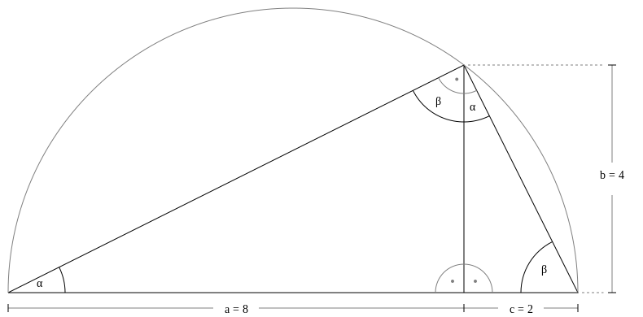
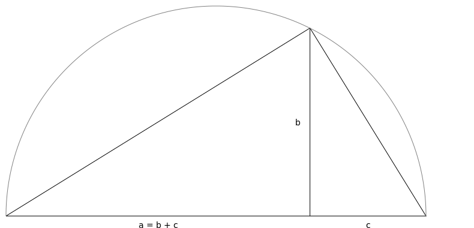

# 06 Bonjour Decibels
## Ce que vous apprendrez dans ce tutoriel
- Comment la **perception humaine** suit des **ratios/rapports**, non seulement dans le domaine des fréquences, mais aussi dans celui des **amplitudes**.
- Comment fonctionne l’échelle des **Decibels (dB)**.
- Comment **convertir** des valeurs en **Decibels** en **amplitudes**.
- Comment utiliser une **expression** comme **argument d’entrée** sans créer une variable.

## Problèmes liés à l’utilisation d’amplitudes brutes

Dans le dernier tutoriel, nous discutions de quelques défauts liés à l’utilisation de fréquences brutes, et qu’il est généralement préférable de travailler avec les numéros de note MIDI.

Il existe un défaut similaire quand on travail avec des valeurs d’amplitude brutes. La perception humaine – tant des hauteurs que du volume – suit des _ratios/rapports_.

Nous entendons les fréquences de la colonne de gauche comme des octaves, car elles ont toutes le rapport/ratio 2/1 :

|Fréquence|Vers >|Ratio/Rapport|
|---|---|---|
|8000 Hz|> 8000 Hz/4000 Hz =|2:1|
|4000 Hz|> 4000 Hz/2000 Hz =|2:1|
|2000 Hz|> 2000 Hz/1000 Hz =|2:1|
|1000 Hz|> 1000 Hz/500 Hz = |2:1|
|500 Hz |> 500 Hz/250 Hz  = |2:1|
|250 Hz |> 250 Hz/125 Hz  = |2:1|
|125 Hz |||

De la même façon, nous percevons ces amplitudes comme ayant une perte de volume égale, car elles suivent toutes le même rapport :

|Amplitude|Vers >|Ratio/Rapport|
|---|---|---|
|1     |>1/0.5        =|2|
|0.5   |>0.5/0.25     =|2|
|0.25  |>0.25/0.125   =|2|
|0.125 |>0.125/0.0625 =|2|
|0.0625|||

Comme vous le voyez, après seulement quatre "octaves d’intensité", nous obtenons une amplitude inférieure à 0.1. Mais l’oreille humaine est capable de percevoir environ **quinze** de ces octaves d’intensité !

## Decibel

C’est l’échelle en **décibels (dB)** qui reflète cela. Comme vous l’avez appris dans le [tutoriel 02](15-f-GS-fr-02.md), nous réglons l’amplitude 1 comme référence à la valeur zéro dB par cette instruction dans l’entête de l’orchestre :
```
0dbfs = 1
```

Zéro dB signifie ici : L’amplitude la plus élevée possible. Chaque rapport/ratio d’amplitude de 1/2 correspond alors une perte d’environ 6 dB. Il en résulte les relations suivantes entre les amplitudes et les décibels :

|Amplitude|dB |
|---------|---:|
|1        |0   |
|0.5      |-6  |
|0.25     |-12 |
|0.125    |-18 |
|0.063    |-24 |
|0.0316   |-30 |
|0.01585  |-36 |
|0.00794  |-42 |
|0.00398  |-48 |
|0.001995 |-54 |
|0.001    |-60 |

    Note 1 : Pour être précis, pour un rapport/ratio d’amplitude de 1/2, la différence est _-6.0206_dB_ plutôt que _-6 DB_. La colonne d’amplitude ne suit donc pas précisément le rapport 1/2.

    Note 2 : Vous pouvez en apprendre davantage sur les intensités sonores dan [ce livre](https://flossmanual.csound.com/basics/intensities).

    Note 3 : Pour un contexte plus général, voyez la [loi Weber-Fechner](https://en.wikipedia.org/wiki/Weber%E2%80%93Fechner_law).

## L’opcode 'ampdb'

Nous préfèrerons donc habituellement travailler avec les décibels plutôt que les amplitudes brutes. Comme un oscillateur requière un amplitude comme argument d’entrée, nous devons **convertir les décibels en amplitudes**. Cette tache est accomplie par l’opcode `ampdb` (amplitude depuis décibel). Exécutez ceci, et regardez la sortie de la console :

```
<CsoundSynthesizer>
<CsOptions>
-o dac
</CsOptions>
<CsInstruments>

sr = 44100
ksmps = 64
nchnls = 2
0dbfs = 1

instr Convert
  iAmp = ampdb:i(-6)
  print(iAmp)
endin

</CsInstruments>
<CsScore>
i "Convert" 0 0
</CsScore>
</CsoundSynthesizer>
```

Vous devriez voir ce message :

```
instr 1:  iAmp = 0.501
```

Similaire à l’opcode `mtof`, l’opcode `ampdb` peut s’exécuter à l’_i-rate_ ou au _k-rate_. Ici nous avons utilisé _i-rate_, donc `ampdb:i`, car nous avons un nombre en entrée et non pas un signal.

Nous utiliserons `ampdb:k` quand nous aurons des valeurs en décibel variables dans le temps en entrée. Dans le cas le plus simple, il s’agit d’une croissance ou d’une décroissance/decay linéaires. Nous pouvons créer ce signal d’entrée comme d’habitude avec l’opcode `linseg`. Voici un signal qui se déplace de -10 dB à -20 dB en une demi seconde :

```
kDb = linseg:k(-10,0.5,-20)
```

…et voici la conversion en amplitudes qui suit :

```
kAmp = ampdb:k(kDb)
```

## Insertion d’une expression comme argument d’entrée

Jusqu’ici, nous avons toujours stocké la sortie d’un opcode dans une variable ; la sortie d’un opcode obtient ainsi un nom, et ce nom est alors utilisé comme entrée pour l’opcode suivant dans la chaine. Nous avons actuellement quatre liens chainés. Ces liens chainés sont écrits en tant que nombres à droite dans la figure suivante :


Il est possible d’omettre les noms de variables et de passer directement une expression comme argument d’entrée dans le lien chainé suivant. Voici le code pour sauter les noms de variables pour le lien chainé 2 :

```
aSine = poscil:a(ampdb:k(kDb),mtof:k(kMidi))
```

La figure peut maintenant être dessinée ainsi :

  

## Exemple
Cette version est utilisée dans l’exemple de code.

```
<CsoundSynthesizer>
<CsOptions>
-o dac
</CsOptions>
<CsInstruments>

sr = 44100
ksmps = 64
nchnls = 2
0dbfs = 1

instr Bonjour
  kDb = linseg:k(-10,0.5,-20)
  kMidi = linseg:k(72,0.5,68)
  aSine = poscil:a(ampdb:k(kDb),mtof:k(kMidi))
  aOut = linen:a(aSine,0,p3,1)
  outall(aOut)
endin

</CsInstruments>
<CsScore>
i "Bonjour" 0 2
</CsScore>
</CsoundSynthesizer>
```

## Court ou lisible ?

La possibilité d’insérer directement la sortie d’un opcode dans un autre est potentiellement infinie. Cela permet d’obtenir un code plus court.

D’un autre côté, si un nombre important de ces expressions sont insérés les une dans les autres, le code peut se transformer en un désert rocailleux de signes `, :, , et )`.

Les variables ne sont en réalité pas un mal nécessaire. Elles peuvent être d’une grande aide pour comprendre ce qui se passe dans le code, à condition qu’elles portent un nom significatif. C’est ce que j’ai essayé en définissant _kMidi_, _aSine_, … Vous trouverez peut-être de meilleurs noms ; essayez !.

Si nous insérons les quatre maillons de la chaine les uns dans les autres, le code ressemblera à ça :

```
outall(linen:a(poscil:a(ampdb:k(linseg:k(-1*,.5,-20),…))))
```

Je ne pense pas que ça soit très facile à lire et à comprendre ; en particulier pour des débutants. Dans le Manuel FLOSS de Csound, nous avons une limite nette due à des contraintes de mise en page : aucune ligne de code ne peut dépasser 78 caractères. Je pense que c’est une bonne contrainte.

Les qualités les plus importantes d’un code sont sa clarté et sa lisibilité. Si l’insertion directe d’une expression augmente ces qualités, alors utilisez-la. Mais mieux vaut éviter les abréviations de code qui relèvent davantage de la paresse que d’une décision murement réfléchie.

Vous êtes le meilleur juge. Relisez votre code une semaine après, et alors faites-vous votre opinion.

## Essayez vous-même

- Créez un _crescendo_ (une augmentation de volume) plutôt qu’un _diminuendo_ (une décroissance/decay du volume) comme nous l’avons fait.
- Changez les valeurs pour que le _crescendo_ soit plus contrasté.
- Changez à nouveau pour un _diminuendo_, mais également plus contrasté que dans l’exemple.
- Changez le code afin d’utiliser les variables nommées _kAmp_ et _kFreq_ d’abord, comme montré dans la première figure.
- Jouez à omettre les noms de variables dans les liens chainés 1, 3 ou 4. Quelle version préférez-vous?

## Les opcodes que vous avez appris dans ce tutoriel
- `ampdb:i(iDecibel)` : convertit un nombre en décibels en un nombre en amplitude.
- `ampdb:k(kDecibel)` : convertit un signal en décibels en un signal en amplitudes.

## Avançons…
avec le tutoriel suivant : [07 Hello p-Fields](15-k-GS-fr-07.md)

## ou lisez quelques explications supplémentaires ici

### Qu’est-ce que 0 dB ?

Nous avons souligné certaines similitudes entre le travail avec les hauteurs tonales et celui avec les volumes. Ces similitudes découlent du fait que nos sens perçoivent les choses de manière proportionnelle. La gamme MIDI pour la hauteur tonale et l’échelle de décibels pour le volume reflètent toutes deux cette caractéristique.

Mais il y a tout de même une grosse différence entre les deux : L’échelle MIDI est une échelle **absolue**. La note MIDI numéro 69 **est** 440 Hz. (ou, pour être un peu plus précis : la note MIDI numéro 69 est réglée sur la hauteur standard, qui est généralement de 440 Hz).

Quand à elle, l’échelle des Décibels est une échelle **relative**. Ça ne signifie rien de dire "Ceci est -6 dB", à moins d’avoir **défini** quelque chose comme étant **0 dB**.

En **acoustique**, 0 dB correspond à une valeur très faible. Pour le dire d’une manière non-scientifique : il s’agit du son le plus faible que nous puissions entendre.

Ça signifie que les valeurs en Décibels communes sont alors **positive** dans ce domaine, car elles sont presque toutes supérieures à ce minimum. Par exemple autour de 60 dB pour une conversation normale.

Mais, comme expliqué plus haut, en **audio numérique**, c’est l’inverse. Ici, notre réglage **0 dB** correspond au **maximum**, à l’amplitude la plus élevée possible.

En audio-numérique, nous avons un certain nombre de bits pour chaque sample/échantillon : 16 bit, 24 bit, 32 bit. Quelque soit ce nombre, il y a un maximum. Imaginez un nombre numérique en 16 bit dans lequel chaque bit pout être 0 ou 1. Alors l’amplitude maximum possible est quand tous les bits sont des 1.

Idem pour les autres résolutions. Elle n’ajoutent rien en plus. Elles offrent juste une plus fine résolution entre le maximum et le minimum.

C’est donc parfaitement sensé de régler ce maximum possible à 0 dB. Mais ça signifie aussi qu’en audio-numérique nous n’avons que des valeurs **négatives** en dB.

### Puis-je utiliser des valeurs en dB ?

Il y a une exception à ce qui vient d’être dit. Oui, il est vrai qu’il ne peut y avoir d’amplitude plus élevée que 0 dB. Mais nous pouvons utiliser des dB positifs en audio-numérique quand nous **amplifions** des sons de faible intensité.

Comme nous l’avons vu dans le [tutoriel 4](15-h-GS-fr-04.md), amplifier un signal signifie le multiplier par une valeurs supérieur à 1. Il est tout à fait logique d’exprimer cela en décibels plutôt qu’en un multiplicateur.

Nous pouvons donc dire : "J’amplifie ce signal de 6 dB", plutôt que : "J’amplifie ce signal par un facteur de 2". Et : "J’amplifie ce signal de 12 dB" devrait être meilleur que "Je l’amplifie d’un facteur de 4".

Dans ce contexte, nous utiliserons un nombre positif comme entrée pour l’opcode `ampdb`.

Voici une simple exemple :

```
<CsoundSynthesizer>
<CsOptions>
-o dac
</CsOptions>
<CsInstruments>
sr = 48000
ksmps = 64
nchnls = 2
0dbfs = 1

instr Amplify
   iDb = p4
   //crée un bruit rose très doux:
   aNoise = pinkish(0.01)
   //Amplification
   aOut = aNoise * ampdb(iDb)
   outall(aOut)
endin
</CsInstruments>

<CsScore>
i "Amplify" 0  2  0  //Le bruit n’est pas amplifié > pas de changement
i "Amplify" 2  2  10 //amplification de 10 Db
i "Amplify" 4  2  20 //amplification de 20 Db
</CsScore>
</CsoundSynthesizer>
```

## Un aperçu des séries arithmétiques et géométriques

Il est souvent intéressant de revenir, à partir de la musique électronique, sur certaines traditions très anciennes dont elle est l’héritière. Je voudrais ici faire un détour par l’une de ces traditions.

Ce que nous avons abordé dans ce tutoriel et dans le précédent à propos des transitions _linéaires et proportionnelles_ en fréquences et en amplitudes a été décrit par des mathématiciens de la Grèce antique comme des séries _arithmétiques_ et _géométriques_.

Si nous avons deux nombres, ou longueurs, et que nous cherchons celui qui se trouve "entre les deux", la moyenne **arithmétique** recherche la **distance** égale entre le plus petit et le plus grand. Ou, selon les mots d’Archytas de Tarente (débat du IVè siècle av. J.C) :
> La moyenne arithmétique se produit lorsqu’il y a trois termes présentant successivement le même excès : le deuxième dépasse le troisième de la même quantité que le premier dépasse le deuxième. Dans cette proportion, le rapport des nombres les plus grands est inférieur, et celui des plus petits est supérieur.

Si le premier nombre est 8, et le deuxième est 2, nous recherchons le deuxième nombre comme moyenne arithmétique A et l’"excès" x, comme suit :

```
A = x + 2
8 = x + A
2 + x + x = 8
x + x = 6
x = 3
```

Donc la moyenne arithmétique A est 5, car 2 + 3 = 5, et 5 + 3 = D.

Mais comme l’affirme Archytas, "Le rapport entre les grands nombres est moindre, celui entre les petits nombres est plus grand". Ici :
```
8/5 = 1.6
5/2 = 2.6
```
  


Ça correspond à ce que nous avons décrit  comme "D’abord trop lent, ensuite trop vite" dans le [précédent tutoriel](15-i-GS-fr-05.md)

Voici comment Archytas décrit la moyenne **géométrique** :

La moyenne géométrique est le rapport entre le deuxième et le troisième élément, tel que le premier est au deuxième ; dans ce cas, les plus grands nombres ont le même rapport que les plus petits.

Donc si nous cherchons la moyenne géométrique G entre 8 et 2, nous calculons :

$8/G = G/2$  
$8 = G * G/2$  
$16 = G^2$  
$G = 4$  

  

La moyenne géométrique de 8 et 2 est 4, car le rapport du nombre le plus large avec la moyenne, et le rapport de la moyenne avec le plus petit nombre est le même : 8/4 = 2, et 4/2 = 2.

Il est intéressant d’observer la manière _géométrique_ de construire cette moyenne, telle qu’elle est présentée dans les Éléments d’Euclide (VI.8) :

    Si, dans un triangle rectangle, une ligne droite est tracée à partir de l’angle droit perpendiculairement à la base, alors les triangles autour de la perpendiculaire sont similaires à l’ensemble du triangle et entre eux.  
    [Euclid's Elements of Geometry, Translation R. Fitzpatrick, p. 164, cited after](https://farside.ph.utexas.edu/Books/Euclid/Elements.pdf).

  

Euclide décrit comment les deux triangles qui sont à gauche et à droite de cette perpendiculaire ont les mêmes angles, et que c’est également le cas quand on observe le grand triangle. Ça établit une similitude parfaite.

La longueur de cette perpendiculaire est la moyenne géométrique des deux parties de la base. Selon le théorème de l’altitude du triangle rectangle, le carré de cette altitude est égal au produit des parties de base :

$$
b^2 = a \cdot c \\
b = \sqrt{a \cdot c}
$$

C'est exactement la formule de la moyenne géométrique.

Il existe également un lien étroit avec le nombre d'or, célèbre pour son utilisation dans l'art et la nature. Dans le triangle décrit par Euclide, cela signifie : Trouvez un triangle dont la plus petite partie de la base plus la hauteur est égale à la plus grande partie de la base :

  

Actuellement, nous avons a=8, $c=2$ et $b=4$. De toute évidence, $8=4+2$ n'est pas vrai.
Nous pouvons déplacer légèrement le point de séparation vers la gauche, de sorte que $a=7$
 et $c=3$. Cela donne $7 = \sqrt{21} + 3$, ce qui n'est pas vrai non plus.

Malheureusement, le nombre d'or peut être facilement construit géométriquement, mais c'est un nombre irrationnel. Nous nous rapprochons toutefois lorsque nous choisissons des nombres de Fibonacci plus élevés. Par exemple, pour les nombres de Fibonacci b=88 et c=55, on obtient : $a=b⋅b/c=88⋅88/55=140,8$ au lieu des 143 souhaités.

Cela convient peut-être pour la musique, qui a toujours besoin d'un peu d'imperfection pour vivre…
