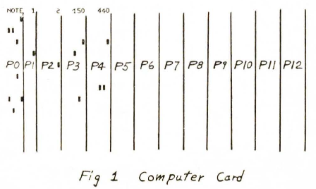
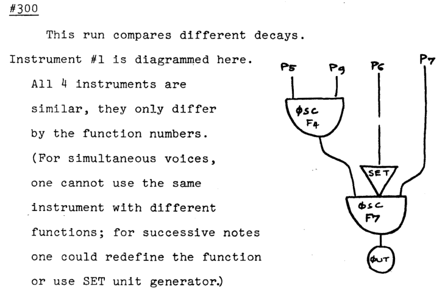

# 07 Bonjour p-champs / p-fields
## Ce que vous apprendrez dans ce tutoriel
- Que sont les **instances d’instruments**
- Comment **ouvrir les instruments** aux paramètres d’entrée définis dans la partition.
- Comment travailler avec des paramètres d’entrée **flexibles** dans un instrument.
- Comment écrire des commentaires dans le code Csound.

## Les instruments sont des modèles qui sont instanciés

Nous avons jusqu’ici implémenté de nombreuses fonctionnalités pratiques à notre instrument, comme le glissando ou le volume, et des fade-in et fade-out automatiques.

Mais tout ça arrivait uniquement **dans** l’instrument. Chaque fois que nous appelions notre instrument _Bonjour_, il jouait à la même hauteur et au même volume. Tout ce que nous pouvions faire depuis l’extérieur de l’instrument était d’ajuster **quand** l’instrument commençait à jouer, et pour **combien de temps** il devait jouer. Comme vous le savez depuis le [tutoriel 04](15-h-GS-fr-04.md), ces informations sont soumises à l’instrument via des paramètres dans la partition / score.

- Le premier paramètre, abrévié **p1** est le numéro ou le nom de l’instrument appelé.
- Le second paramètre, abrévié **p2** est l’heure de début de cet instrument.
- Le troisième paramètre, abrévié **p3** est la durée de cet instrument.

Appelons l’instrument _Bonjour_ avec ces lignes de partition :
```
i "Bonjour" 0 2
i "Bonjour" 3 3
i "Bonjour" 9 1
```

Ici, nous **instancions** un certain instrument. Chaque instance est un objet en cours d’exécution d’un modèle d’instrument ; c’est la "chose" concrète qui existe en tant que réalisation du modèle.

  
_Trois instances d’un instrument dans une séquence_

Nous pouvons créer autant d’instances d’instrument que nous le voulons. Elles peuvent se suivre dans le temps, se superposer ou même se chevaucher partiellement, comme dans ces lignes de partition :
```
i "Bonjour" 0 7
i "Bonjour" 3 6
i "Bonjour" 5 1
```
  
_Trois instances d’instrument se chevauchant mutuellement_

## Rendre les instruments plus adaptables

Mais revenons aux caractéristiques de notre instrument comme nous l’avons laissé. Nous avons besoin de le rendre plus perméable au monde qui l’entoure. Par exemple, nous voulons pouvoir décider dans notre appel à l’instance de l’instrument, quelle note MIDI jouer au début, et quelle note MIDI jouer à la fin de la durée.

Pour ce faire, nous **ajoutons des p-fields/champs supplémentaires** à notre ligne de partition. Nous écrivons notre premier numéro de note MIDI comme quatrième paramètre **p4**, et notre second numéro MIDI comme cinquième paramètre **p5** :
```
i "Bonjour" 0 2 72 68
```

Ce qui signifie que nous appelons :
- **p1** l’instrument "Bonjour",
- **p2** l’heure de début de cette instance qui sera zéro,
- **p3** sa durée en seconde – ici 2,
- **p4** le numéro de note MIDI 72 au début, et
- **p5** le numéro de note MIDI 68 à la fin de la durée (p3).

Pour que ça fonctionne, nous insérons **p4** et **p5** dans le code de notre instrument :
```
instr Bonjour
    iMidiStart = p4
    iMidiEnd = p5
    kMidi = linseg:k (iMidiStart, p3, iMidiEnd)
    …
endin
```

L’instrument interprète ces valeurs de la même façon que le fait **p3** que nous utilisons déjà dans le code de notre instrument. Pour **p4** et **p5**, l’instance d’instrument examinera la ligne de partition, et prendra le quatrième paramètre comme valeur pour **p4**, et le cinquième comme valeur pour **p5**.

  
_Instrument lisant p4 et p5 sur une ligne de partition_

## Insertion directe de p-field/champs ou définition de variables ?

Dans le code ci-dessus, nous avons défini des variables au taux _i-rate_ : _iMIDIStart_ et _iMIDIEnd_. Il aurait été tout à fait correct de placer **p4** et **p5** directement dans le code de l’instrument, comme ceci :
```
kMidi = linseg:k (p4, p3, p5)
```

Mais d’un point de vue lisibilité du code, il est préférable de donner la signification de **p4** et **p5** en haut du code de l’instrument, et de les connecter à l’aide d’un nom de variable significatif.

Cette variable sera une variable de type _i-rate_ car la partition ne peut passer que des valeurs fixes à l’instrument.

Les noms de variables devraient être les plus significatifs possible, sans devenir trop longs. Le plus important, une fois de plus, est la lisibilité du code.

## Commentaires dans le code

La lisibilité peut aussi être améliorée par des commentaires ; en particulier quand le code est long.

Csound offre trois possibilités pour commenter :
- `//` et `;` sont des signes qui précèdent un commentaire sur une ligne.
- Ce qui est entre `/*` et `*/` sera également ignoré par Csound. Dans ce cas, le commentaire peut comporter plusieurs lignes.

Je suggère de commenter abondamment. En particulier quand vous commencez à apprendre Csound. Ça vous aidera à comprendre et mieux intégrer ce qui se passe dans le code, et aussi – si vous relisez votre code plus tard – à le comprendre plus rapidement.

Je commence même souvent par des commentaire quand je code. Les commentaires sont alors là pour clarifier ce que vous chercher à faire.  
Par exemple :
```
instr JeSaisPas
//génère deux nombres aléatoires

//calcule leur distance

//si la distance est plus grande que x…

//…insère du silence…

//…sinon produit un max de bruits dingues.
endin
```

## Exemple

À partir de maintenant, nous insèrerons des commentaires dans le code. D’abord abondamment ; dans les derniers tutoriels, nous les réduirons en nous concentrant sur les nouveaux éléments dans le code.
```
<CsoundSynthesizer>
<CsOptions>
-o dac
</CsOptions>
<CsInstruments>
/*CONSTANTES DANS L’ENTÊTE DE L’INSTRUMENT*/
sr = 48000
ksmps = 64
nchnls = 2
0dbfs = 1

/*CODE DE L’INSTRUMENT*/
instr Bonjour ;Bonjour est écrit ici sans guillemets doubles!
   //Reçoit les notes MIDI de début et de fin depuis la partition:
   iMidiStart = p4 ;c’est un numéro de note MIDI
   iMidiEnd = p5
   //Crée un glissando sur la durée totale (p3)
   kMidi = linseg:k(iMidiStart, p3, iMidiEnd)
   //Crée une decay/décroissance de -10 dB à -20 dB 
   //durant la 1ère moitié de la durée
   kDb = linseg:k(-10, p3/2, -20)
   //Son sinusoïdal avec ampdb et mtof pour convertir 
   //les entrée, respectivement en amp et en freq
   aSine = poscil:a(ampdb:k(kDb), mtof:k(kMidi))
   //Applique une seconde de fade-out
   aOut = linen:a(aSine, 0, p3, 1)
   //Sortie vers tous les canaux
   outall(aOut)
endin
</CsInstruments>

<CsScore>
/* Lignes de partition */
// Champs/fields des paramètres de partition
// p1       p2    p3    p4 p5
i "Bonjour"   0     2     72 68 ; Guillemets nécessaires
i "Bonjour"   4     3     67 73
i "Bonjour"   9     5     74 66
i "Bonjour"   11.5  0.5   72 73.5
i "Bonjour"   12.5  0.5   73 73.5
</CsScore>
</CsoundSynthesizer>
```

## Un coup d’œil sur l’histoire

Les **p-fields/p-champs** sont des éléments qui reflètent la longue histoire de Csound. C’est une figure qui vient de l’article "Musical Sounds from digital computers", par Mathews, Pierce et Guttman, montrant cette "carte informatique" :

  
_p-fields/champs sur une carte informatique dans Mathews et.al. 1962_

Ici, le champ `P0` contient l’information soit d’une "note", soit d’une "pause". `P1` est le numéro d’instrument. Comme il n’y a pas de polyphonie ici, `P2` est la durée de la chaine d’évènements. `P3` est une amplitude, ici dans la plage de 0 à 1000, et `P4` est la fréquence.

Les p-field/p-champs existaient donc avant que les ordinateurs n’aient un écran et un clavier.

C’est de _MUSIC V_ de Mathews, dont c’est servi Jean-Claude Risset pour écrire son ouvrage historique "Catalogue of Computer Synthesized Sounds" en 1969. Voici un extrait dans lequel vous pouvez voir à nouveau des p-fields :

  
_Extrait du "Catalogue" de Rissets, 1969_

Les premières version du programme _MUSIC_ de Max Mathews pouvait fonctionner uniquement sur un ordinateur particulier. Le "C" de Csound pointe vers le [language de programmation C](https://en.wikipedia.org/wiki/C_(programming_language)) qui fut publié en 1972. Ce langage rendit possible la séparation entre d’une part le code source – qui est écrit et peut être lu par les humains –, et d’autre part le code machine, spécifique au type de machine sur lequel le code s’exécute. C est toujours un langage populaire, utilisé pour tout ce qui nécessite un grande vitesse d’exécution, comme les OS (operating systems) ou les applications audio.

D’un côté, les _p-fields/p-champs_ sont simples et donnent de nombreuses possibilités. De l’autre, il amènent des restrictions. Basiquement, un _p-field/p-champ_ contient un nombre. Beaucoup de travail fut nécessaire aux développeurs de Csound pour rendre possible l’écriture de chaines de caractères/strings dans un p-field. Mais il n’est toujours pas possible de passer un signal via un _p-field/p-champ_ à un instrument.

Heureusement, les _p-fields_ sont seulement une des possibilités pour un instrument de communiquer avec le "monde extérieur". Nous discuterons d’autres façons plus tard dans ces tutoriels.

## Essayez-le vous même
- Changez les valeurs dans la partition de façon que les directions de glissements de hauteurs soient inversées (vers le haut plutôt que vers le bas et vice-versa).
- Changez les valeurs dans la partition afin que vous n’ayez plus de glissandos, mais des hauteurs constantes.
- Ajoutez deux p-champs/p-fields dans la partition pour spécifier le premier et le dernier volume en _dB_. Référez-vous à ces p-champs comme **p6** et **p7** dans le code de l’instrument. Introduisez-y deux nouvelles variables de type _i-rate_ en les appelant _iDbStart_ et _iDbEnd_.
- Changez le code afin que les changements de volume utilisent la durée totale de l’instance d’instrument tandis que les changements de hauteur utilisent seulement la moitié de cette durée.
- Revenez au code d’origine en rechargeant la page. Maintenant, effacez le cinquième p-field de la partition et changez le code dans l’instrument afin que la variable _iMidiEnd_ soit toujours six notes MIDI en-dessous de _iMIDIStart_.
- Réintroduisez **p5**, mais cette fois avec une signification différente : 1 dans le p-field signifiera que la note _iMidiEnd_ sera six notes MIDI plus haut que _iMidiStart_ ; -1 signifiera que la note _iMidiEnd_ sera six notes MIDI plus bas que _iMidiStart_.
- Ajoutez un p-field/p-champ qui établit la durée de fade-out comme un rapport de la durée totale. (1 signifierait que le fade-out serait égale à la durée totale de l’instrument, et 0.5 signifierait que le fade out serait égale à la moitié de la durée de l’instrument).

## Termes et symboles que vous avez appris dans ce tutoriel

### Termes
- **instance** est la manifestation ou la réalisation d’un instrument quand il est appelé par une ligne de partition (score line).

### Symboles
- **p4**, **p5** … sont utilisés dans le code d’un instrument Csound en référence au quatrième, cinquième … paramètre dans une ligne de partition appelée une instance d’instrument.

## Avançons

avec le tutoriel suivant : [08 Hello Schedule](15-l-GS-fr-08.md)

## … ou lisez quelques explications supplémentaires

### Notes MIDI et déviations microtonales

Vous aurez peut-être remarqué que dans la dernière ligne de partition de l’exemple, il était écrit :
```
i "Hello"   12.5    .5      73      73.5
```

Mais quelle est la note MIDI numéro 73.5 ? Il n’existe pas de note avec ce numéro. Il n’y a que les notes 73 (C#5) et 74 (D5).  
C’est vrai mais la conversion depuis le numéro de note MIDI vers les fréquences ne marche pas seulement pour les nombres entiers de notes MIDI. Il est possible de spécifier une fraction de demi-ton située entre deux nombres entiers de note MIDI. On peut divisé un demi-ton en deux quarts de ton. C’est ce que nous avons fait en nous référant au numéro de note MIDI 73.5 : Un quart de ton plus haut que C#5, ou un quart de ton plus bas que D5. Nous pouvons exprimer n’importe quelle autre fraction de la même manière. L’usage le plus courant est de diviser un demi-ton en cent _cents_. Le numéro de note MIDI 60.14 représentera un C4 + 14 cents. 68.67 sera un A4 - 33 cents.

### énumération des instances en tant que parties fractionnaires

Il est non seulement possible d’appeler autant d’instances d’instruments que nous le voulons, mais nous pouvons aussi donner à chacune de ces instances un certain numéro. On le réalise en appelant l’instrument non pas avec un nombre entier, mais avec un nombre entier + une partie fractionnaire.

Dans ce cas, nous n’écrirons pas ces lignes de partition :
```
i 1 0   3
i 1 2   2
i 1 5   1
```
… mais nous écrirons plutôt ces lignes de partition :
```
i 1.1   0   3
i 1.2   2   2
i 1.3   5   1
```
Ici nous avons appelé l’instrument 1.1 comme première instance de l’instrument 1, 1.2 comme seconde instance, et 1.3 comme troisième instance.

Comme vous le voyez dans ce simple exemple, l’instance d’instrument obtient ces informations :
```
<CsoundSynthesizer>
<CsOptions>
-odac -m128
</CsOptions>

<CsInstruments>
sr = 48000
ksmps = 32
nchnls = 2
0dbfs = 1

//place le message "Hello …" dans le canal "radio"
chnset("Hello instrument 1.2", "radio")

instr 1
   iMyInstance = p1 ;obtient l’instance comme 1.1, 1.2 ou 1.3
   print(iMyInstance) ;imprime-là
   //Reçoit le message seulement si l’instance est 1.2
   if iMyInstance == 1.2 then
      Smessage = chnget:S("radio")
      prints("%s\n", Smessage)
   endif
endin
</CsInstruments>

<CsScore>
i  1.1   0  3
i  1.2   2  2
i  1.3   5  1
</CsScore>
</CsoundSynthesizer>
```
Vous devriez voir ceci imprimé dans la console :
```
instr 1:  iMyInstance = 1.100
instr 1:  iMyInstance = 1.200
Hello instrument 1.2!
instr 1:  iMyInstance = 1.300
```

### Noms d’instruments et parties fractionnaires

Nous pouvons donner un nom ou un numéro à un instrument. Je préfère personnellement les noms car ils décrivent ce que fait l’instrument.  
Par exemple :
```
instr EntreeLive
instr EnregistreSurDisque
instr AnalyseRMS
```

Il s’agit de nouveau d’une amélioration de la lisibilité du code. Mais nous ne pouvons pas appeler un instrument avec un nombre fractionnaire si nous l’appelons par son nom. Dans la ligne de code
```
i "EntreeLive" 0    1000
```
… le premier p-field/p-champ `"EntreeLive"` est un string, pas un nombre. Et nous ne pouvons pas étendre un string avec `.1` comme nous le pouvons avec un nombre.  
Ceci ne fonctionnera pas :
```
i "EntreeLive".1    0   1000
```

Nous avons deux options ici :

1. La première option se sert du fait que Csound convertit en interne chaque nom d’instrument en un nombre. La manière dont Csound assigne les nombres aux noms d’instruments est simple : L’instrument qui est au sommet obtient le nombre 1, le suivant le nombre 2 et ainsi de suite.

Quand nous n’avons qu’un seul instrument, nous pouvons être sûr que c’est l’instrument 1 pour Csound. Et par conséquent, le code qui suit marche sans problème :
```
<CsoundSynthesizer>
<CsOptions>
-odac -m128
</CsOptions>
<CsInstruments>
sr = 44100
ksmps = 32
nchnls = 2
0dbfs = 1

//put the message string "Hello ..." in the channel "radio"
chnset("Hello instrument 1.2!","radio")

instr TestInstanceSelection
  iMyInstance = p1 ;get instance as 1.1, 1.2 or 1.3
  print(iMyInstance) ;print it
  //receive the message only if instance is 1.2
  if iMyInstance == 1.2 then
    Smessage = chnget:S("radio")
    prints("%s\n",Smessage)
  endif
endin

</CsInstruments>
<CsScore>
i 1.1 0 3
i 1.2 2 2
i 1.3 5 1
</CsScore>
</CsoundSynthesizer>
```

 Nous avons ici un instrument nomé "TestInstanceSelection", mais nous l’appelons 1.1, 1.2, 1.3 dans les lignes de partition. Pas de problème.

2. L’autre manière de travailler avec les instruments nommés et les parties fractionnaires est de déplacer l’appel de l’instrument depuis la partition/score vers le code Csound courant. C’est le sujet du prochain tutoriel dans lequel nous introduiront l’opcode `schedule`.
