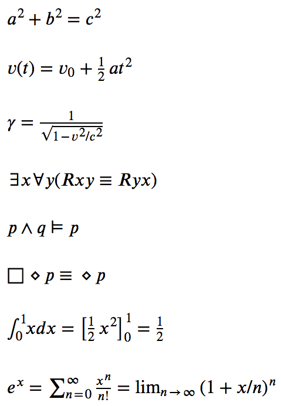

WRITING IN MARKDOWN
===================

We use Pandoc Markdown here. For a full description,
see https://pandoc.org/MANUAL.html#pandocs-markdown or
https://rmarkdown.rstudio.com/authoring_pandoc_markdown.html%23raw-tex#pandoc_markdown

For anyone who writes on this book, these features are in particular important:

# 1. HEADINGS

As usual in markdown:
   
`# level one heading`

# level one heading

`## level two heading`

## level two heading

`### level three heading`  

### level three heading

`#### level four heading`

#### level four heading


# 2. ITALICS

please use `_this_` not `*that*`


# 3. BOLD

please usw `**this**` not `__that__`


# 4. CODE EXAMPLES

a) full .csd examples
---------------------

**must** be written as **fenced code**: `\`\`\`csound` before and `\`\`\``
after the csound code:

    ```csound
    <CsoundSynthesizer>
    ...
    </CsoundSynthesizer>
    ```

NOTE that **this is for examples which can be extracted and played
as they are** (no requirement except files in resources/SourceMaterials)


b) other code snippets
----------------------

are preceded by four spaces:

&nbsp;&nbsp;&nbsp;&nbsp;this is a small code snippet

gets

    this is a small code snippet


c) code snippets inside normal text
-----------------------------------

this is an `inside code snippet` which must by surronded by \`backticks\`.

    
# 5. IMAGES

this is the way an image is specified with caption and resizing:

    {width=50%}

- avoid underscore `_`, use minus `-` instead
- alway start with the section-chapter 
- caption and resizing are optional


# 6. FOOTNOTES

inside the text use `^[]` for footnotes in the chapter.
    
the footnote itself should be written inline within the
paragraph from which it's refered to, the pandoc engine
will automatically give it a number and place the
footnote to the bottom of a given page:

    FooBar was a proof Einstein did.^[Middle Earth Magazine, 1900, vol.3]
    FooBar turned out to be a placeholder for a text in pandoc document.

see [here](https://pandoc.org/MANUAL.html#footnotes) for more details on inline-footnotes.


# 7. MATH FORMULAS

are written in [tex math](https://en.wikibooks.org/wiki/LaTeX/Mathematics), surrounded by dollar signs `$` in the text, or by two dollar signs `$$` for paragraphs.

here are some tex math examples from <https://github.com/kikofernandez/pandoc-examples/blob/master/math/math.tex#L1>

    $a^2 + b^2 = c^2$
    $v(t) = v_0 + \frac{1}{2}at^2$
    $\gamma = \frac{1}{\sqrt{1 - v^2/c^2}}$
    $\exists x \forall y (Rxy \equiv Ryx)$
    $p \wedge q \models p$
    $\Box\diamond p\equiv\diamond p$
    $\int_{0}^{1} x dx = \left[ \frac{1}{2}x^2 \right]_{0}^{1} = \frac{1}{2}$
    $e^x = \sum_{n=0}^\infty \frac{x^n}{n!} = \lim_{n\rightarrow\infty} (1+x/n)^n$



